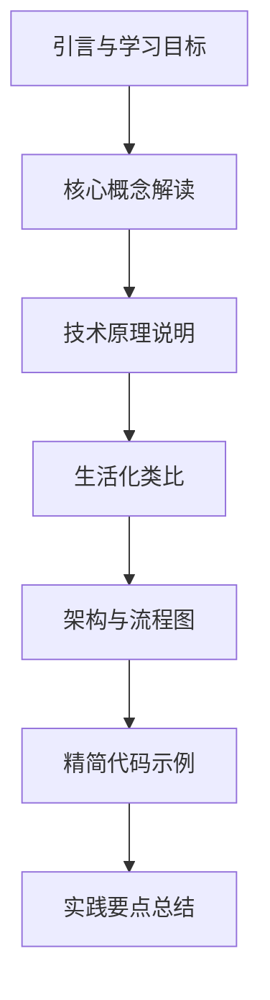

# Chapter 10 强化学习文档优化设计方案

## 一、优化目标与原则

### 1.1 核心目标
- **减少代码幅度**：将代码示例精简 40-50%，仅保留核心逻辑和关键方法
- **增加文字说明**：补充 30-40% 的原理说明和概念解释
- **图文并茂**：每个文档增加 3-5 个 Mermaid 可视化图表
- **生活化类比**：用日常生活场景类比抽象的技术概念

### 1.2 优化原则
- 保持技术准确性，不降低专业水准
- 强化概念理解，降低学习曲线
- 突出实用价值，贴近实际应用
- 保持结构完整，便于查阅参考

## 二、文档结构优化策略

### 2.1 总体结构调整

每个文档将按以下结构重组：



### 2.2 内容比例调整

| 内容类型 | 原比例 | 目标比例 | 调整说明 |
|---------|--------|---------|---------|
| 代码示例 | 60% | 30% | 精简为核心接口和关键逻辑 |
| 文字说明 | 25% | 40% | 增加原理解释和概念阐述 |
| 可视化图表 | 10% | 20% | 增加流程图、架构图、状态图 |
| 类比说明 | 5% | 10% | 用生活场景解释抽象概念 |

## 三、各文档优化要点

### 3.1 文档 10.1：马尔可夫决策过程

#### 优化重点
1. **概念解读增强**
   - MDP 的本质：智能体的"决策世界观"
   - 马尔可夫性质的深入理解
   - 状态、动作、奖励的相互关系

2. **生活化类比**
   - **导航系统类比**：将 MDP 比作手机导航
     - 状态 = 当前位置
     - 动作 = 路线选择（左转/右转/直行）
     - 奖励 = 时间节省 / 路况舒适度
     - 转移概率 = 路况变化的不确定性
   
   - **投资决策类比**：理解折扣因子
     - 短期收益 vs 长期收益
     - 时间价值与未来不确定性

3. **可视化增强**
   - MDP 交互循环流程图
   - 贝尔曼方程的可视化展示
   - 状态转移图示例

4. **代码精简**
   - 保留：`DiscreteMDP` 核心接口
   - 精简：内部实现细节，移至附录或注释
   - 突出：关键方法签名和调用示例

#### 新增内容结构

```
10.1.1 强化学习基本概念
  - 核心要素解读（增加文字说明）
  - 生活场景类比：自动驾驶汽车的决策过程
  
10.1.2 马尔可夫决策过程定义
  - MDP 数学框架（保留核心公式）
  - 可视化：MDP 组成要素关系图
  - 离散/连续 MDP 对比表格
  
10.1.3 马尔可夫性质深度解析
  - 性质本质理解（增加原理说明）
  - 类比：天气预报只看今天，不看昨天
  - 实际应用中的近似处理
  
10.1.4 策略与价值函数
  - 策略的直觉理解
  - 可视化：策略空间与价值函数关系
  - 精简代码：仅展示接口定义
  
10.1.5 贝尔曼方程可视化
  - 方程的几何意义
  - 递归关系图示
  - 求解过程动画描述
```

### 3.2 文档 10.2：价值函数与策略梯度

#### 优化重点

1. **蒙特卡洛方法解读**
   - **赌场类比**：理解采样估计
     - 玩多局游戏获得平均收益
     - 局数越多，估计越准确
     - 高方差问题：有时赢很多，有时输很多

2. **时序差分学习**
   - **学习开车类比**：
     - MC：等到达目的地才评价这次驾驶
     - TD：每个路口都评价当前选择
     - Bootstrap：利用已有经验快速调整

3. **可视化增强**
   - MC vs TD 学习过程对比图
   - 资格迹（Eligibility Traces）可视化
   - 策略梯度方向示意图

4. **代码优化**
   - 保留：算法核心更新规则
   - 精简：辅助方法和工具函数
   - 增加：伪代码描述算法流程

#### 新增内容结构

```
10.2.1 价值函数估计概述
  - 为什么需要估计？（环境未知）
  - 类比：盲人摸象 vs 科学采样
  
10.2.2 蒙特卡洛方法详解
  - 基本思想（文字说明为主）
  - 可视化：采样-估计循环图
  - 首次访问 vs 每次访问对比表
  - 精简代码：核心更新逻辑
  
10.2.3 时序差分学习原理
  - TD(0) 的直觉理解
  - 生活类比：预测天气 vs 实际天气
  - 可视化：TD 误差传播图
  - TD(λ) 的统一视角
  
10.2.4 策略梯度方法
  - 直接优化策略的思想
  - 可视化：策略空间的梯度场
  - 与价值方法的对比
```

### 3.3 文档 10.3：Q-Learning 算法实现

#### 优化重点

1. **Q-Learning 核心思想**
   - **学习路线类比**：
     - Q 表 = 路线评分表
     - 学习过程 = 不断更新路线评分
     - ε-贪心 = 偶尔尝试新路线

2. **探索与利用权衡**
   - **餐厅选择类比**：
     - 利用：去熟悉的好餐厅
     - 探索：尝试新餐厅
     - ε 衰减：随着经验增加，减少尝试

3. **可视化增强**
   - Q-Learning 算法流程图
   - Q 表更新过程动画描述
   - ε 衰减曲线图

4. **代码精简策略**
   - 保留：`QTable` 核心方法
   - 保留：`QLearning.update()` 主逻辑
   - 精简：统计、打印等辅助代码
   - 用表格展示：参数配置选项

#### 新增内容结构

```
10.3.1 Q-Learning 算法思想
  - 算法的直觉理解（增加文字）
  - 类比：学习走迷宫的过程
  - Off-policy 特性解析
  
10.3.2 Q 表与更新规则
  - Q 表的物理意义
  - 可视化：Q 表结构示意图
  - 更新规则的几何解释
  - 精简代码：核心接口
  
10.3.3 ε-贪心策略详解
  - 探索-利用困境
  - 生活案例：职业规划中的探索与利用
  - 可视化：ε 衰减策略对比
  
10.3.4 算法收敛性分析
  - 收敛条件的直观理解
  - 可视化：收敛过程示意图
  - 参数调优建议（表格形式）
```

### 3.4 文档 10.4：深度 Q 网络（DQN）

#### 优化重点

1. **DQN 突破性创新**
   - **函数逼近类比**：
     - Q 表 = 查字典（离散）
     - DQN = 学规律（连续）
     - 神经网络 = 通用函数逼近器

2. **经验回放机制**
   - **学习笔记类比**：
     - 经验池 = 笔记本
     - 随机采样 = 复习随机翻笔记
     - 打破相关性 = 避免死记硬背

3. **目标网络作用**
   - **移动靶问题**：
     - 普通 DQN = 追逐移动的目标
     - 目标网络 = 固定目标一段时间
     - 提高稳定性

4. **可视化增强**
   - DQN 完整架构图
   - 经验回放流程图
   - 目标网络更新时序图

5. **代码优化**
   - 保留：网络架构定义
   - 保留：训练主循环
   - 精简：具体矩阵运算细节
   - 用图表：损失函数变化趋势

#### 新增内容结构

```
10.4.1 从 Q-Learning 到 DQN
  - 维度灾难问题（文字说明）
  - 函数逼近的必要性
  - 可视化：Q 表 vs 神经网络对比
  
10.4.2 DQN 网络架构
  - 网络设计思想
  - 可视化：网络结构图
  - 精简代码：网络定义框架
  
10.4.3 经验回放机制深度解析
  - 为什么需要经验回放？
  - 类比：学生复习策略
  - 可视化：回放缓冲区工作原理
  - 采样策略对比表格
  
10.4.4 目标网络稳定训练
  - 训练不稳定的根源
  - 可视化：有/无目标网络对比
  - 更新频率的影响（图表）
  
10.4.5 DQN 训练流程
  - 完整训练循环（流程图）
  - 关键步骤说明
  - 精简代码：训练主逻辑
```

### 3.5 文档 10.5：DQN 变体和改进

#### 优化重点

1. **Double DQN**
   - **考试评分类比**：
     - 标准 DQN = 自己给自己打分（过高估计）
     - Double DQN = 一人出题，另一人评分（客观）

2. **Dueling DQN**
   - **任务评估类比**：
     - 状态价值 = 当前位置的基础价值
     - 优势函数 = 不同行动的额外价值
     - 分离评估 = 更精确的判断

3. **优先经验回放**
   - **学习重点类比**：
     - 普通回放 = 平均用力复习
     - 优先回放 = 重点复习错题
     - TD 误差 = 题目的难度/重要性

4. **可视化增强**
   - 各变体改进点对比图
   - Double DQN 动作选择流程
   - Dueling 网络架构图
   - 优先级分布可视化

5. **代码优化**
   - 保留：各变体核心创新点
   - 精简：重复的基础代码
   - 用表格：性能对比数据

#### 新增内容结构

```
10.5.1 DQN 存在的问题
  - Q 值过高估计分析
  - 可视化：Q 值偏差示意图
  
10.5.2 Double DQN 解决方案
  - 解耦思想（文字说明）
  - 生活类比：裁判与运动员分离
  - 可视化：Double DQN 流程图
  - 精简代码：核心改进部分
  
10.5.3 Dueling DQN 架构
  - 价值分解思想
  - 可视化：网络架构对比
  - 类比：房屋价值 = 地段 + 装修
  - 代码：网络定义重点
  
10.5.4 优先经验回放
  - 优先级设计理念
  - 可视化：采样概率分布
  - 生活类比：智能错题本
  - 重要性采样解释
  
10.5.5 性能对比与选择建议
  - 各变体对比表格
  - 适用场景分析
  - 实践建议
```

### 3.6 文档 10.6：综合项目（CartPole）

#### 优化重点

1. **项目整体架构**
   - **软件系统类比**：
     - 环境 = 数据库
     - 智能体 = 业务逻辑
     - 训练器 = 服务编排
     - 评估器 = 质量保证

2. **CartPole 物理原理**
   - **倒立摆类比**：用手掌顶笔的平衡游戏
   - 物理公式的直观理解
   - 状态空间的物理意义

3. **可视化增强**
   - 系统架构全景图
   - 训练流程时序图
   - 性能指标变化图
   - 状态空间可视化

4. **代码优化**
   - 保留：系统架构代码框架
   - 保留：训练主流程
   - 精简：详细配置和工具函数
   - 增加：部署和使用指南

#### 新增内容结构

```
10.6.1 项目架构设计
  - 系统分层思想（文字说明）
  - 可视化：完整架构图
  - 组件职责表格
  
10.6.2 CartPole 环境理解
  - 物理模型说明
  - 生活类比：手掌顶笔游戏
  - 可视化：状态空间示意图
  - 精简代码：环境接口
  
10.6.3 智能体设计与实现
  - 智能体架构（流程图）
  - 组件集成说明
  - 精简代码：核心组件
  
10.6.4 训练流程与监控
  - 训练循环设计
  - 可视化：训练时序图
  - 监控指标说明（表格）
  - 调优策略建议
  
10.6.5 评估与部署
  - 评估指标体系
  - 可视化：性能曲线图
  - 部署流程说明
  - 使用示例
```

## 四、生活化类比库

### 4.1 核心概念类比表

| 技术概念 | 生活类比 | 类比说明 |
|---------|---------|---------|
| 马尔可夫性质 | 天气预报 | 明天天气只看今天，不看昨天 |
| 状态转移 | 交通路况 | 从 A 地到 B 地的路径变化 |
| 奖励函数 | 考试成绩 | 学习行为的反馈信号 |
| 折扣因子 | 投资收益 | 远期收益的时间折现 |
| 蒙特卡洛采样 | 民意调查 | 抽样调查估计总体 |
| 时序差分学习 | 导航更新 | 每个路口更新路线评估 |
| Q-Learning | 学习走迷宫 | 记录每条路的好坏评分 |
| 探索-利用 | 餐厅选择 | 尝试新餐厅 vs 去常去的餐厅 |
| 经验回放 | 复习笔记 | 随机翻看笔记巩固知识 |
| 目标网络 | 固定靶训练 | 避免追逐移动的目标 |
| Double DQN | 考试评分 | 出题和评分分离 |
| Dueling DQN | 房屋估价 | 地段价值 + 装修价值 |
| 优先回放 | 错题本 | 重点复习错题 |

### 4.2 算法流程类比

#### Q-Learning 学习过程
```
就像学习走迷宫：
1. 初始阶段：随机尝试各条路（高探索）
2. 学习阶段：记录每条路的"评分"（Q 值）
3. 优化阶段：主要走高分路，偶尔试新路（低探索）
4. 成熟阶段：几乎总是走最优路径
```

#### DQN 训练过程
```
类比学生学习过程：
1. 上课（环境交互）：听课做题获得经验
2. 记笔记（经验回放）：记录重要知识点
3. 复习（批量学习）：随机抽取笔记复习
4. 考试（评估）：测试掌握程度
5. 调整（优化）：根据错题调整学习策略
```

## 五、可视化图表规划

### 5.1 必备图表清单

每个文档需包含以下类型的图表：

#### 10.1 马尔可夫决策过程
1. MDP 交互循环流程图
2. 状态转移概率图示例
3. 贝尔曼方程递归关系图
4. 策略与价值函数关系图

#### 10.2 价值函数与策略梯度
1. MC vs TD 学习对比图
2. 资格迹传播示意图
3. 策略梯度方向场图
4. Actor-Critic 架构图

#### 10.3 Q-Learning
1. Q-Learning 算法流程图
2. Q 表更新过程示意图
3. ε 衰减策略曲线对比
4. 收敛过程可视化

#### 10.4 深度 Q 网络
1. DQN 完整架构图
2. 经验回放机制流程图
3. 目标网络更新时序图
4. 训练损失变化曲线

#### 10.5 DQN 变体
1. DQN 变体改进点对比
2. Double DQN 流程图
3. Dueling 网络架构图
4. 优先级采样分布图

#### 10.6 综合项目
1. 系统架构全景图
2. 训练流程时序图
3. CartPole 状态空间图
4. 性能指标变化图

### 5.2 图表设计规范

所有 Mermaid 图表应遵循：
- 使用清晰的中文标注
- 颜色区分不同类型节点
- 箭头明确指示数据流向
- 包含必要的图例说明

## 六、代码精简策略

### 6.1 保留原则

**必须保留**：
- 核心接口定义
- 关键方法签名
- 主要算法逻辑
- 典型调用示例

**可以精简**：
- 辅助工具方法
- 详细实现细节
- 重复的构造函数
- 大量的 getter/setter
- 统计和日志代码

### 6.2 代码展示方式

1. **完整代码**（10-20 行）
   - 核心接口定义
   - 关键算法逻辑

2. **伪代码**（5-10 行）
   - 算法流程描述
   - 关键步骤说明

3. **方法签名**（1-3 行）
   - 接口设计展示
   - 参数说明

4. **调用示例**（3-5 行）
   - 使用方法演示
   - 集成示例

### 6.3 代码与文字比例

每个小节建议：
- 文字说明：40-50%
- 代码示例：25-35%
- 可视化图表：15-20%
- 类比说明：10-15%

## 七、文档篇幅控制

### 7.1 总体篇幅

| 文档 | 原行数 | 目标行数 | 调整幅度 |
|-----|--------|---------|---------|
| 10.1 | 1086 | 900-1000 | 保持或略减 |
| 10.2 | 1327 | 1000-1100 | 减少 20% |
| 10.3 | 1216 | 900-1000 | 减少 20% |
| 10.4 | 1364 | 1000-1100 | 减少 20% |
| 10.5 | 1507 | 1100-1200 | 减少 25% |
| 10.6 | 1573 | 1200-1300 | 减少 20% |

### 7.2 内容密度优化

- 减少代码重复
- 合并相似内容
- 提炼核心要点
- 增加信息密度

## 八、实施步骤

### 8.1 优化顺序

按以下顺序优化文档：
1. 10.1 马尔可夫决策过程（基础）
2. 10.3 Q-Learning（经典算法）
3. 10.4 深度 Q 网络（核心技术）
4. 10.2 价值函数与策略梯度
5. 10.5 DQN 变体
6. 10.6 综合项目

### 8.2 每个文档的优化流程


## 九、质量检查标准

### 9.1 内容质量

- ✅ 技术准确性：概念、公式、算法正确无误
- ✅ 逻辑清晰性：章节衔接自然，层次分明
- ✅ 可读性：语言流畅，通俗易懂
- ✅ 完整性：覆盖核心知识点，无重大遗漏

### 9.2 形式质量

- ✅ 代码精简：代码量减少 40-50%
- ✅ 图表丰富：每文档 3-5 个可视化图表
- ✅ 类比恰当：生活化类比准确贴切
- ✅ 排版规范：格式统一，便于阅读

### 9.3 实用价值

- ✅ 概念理解：帮助读者理解抽象概念
- ✅ 实践指导：提供实用的开发建议
- ✅ 快速参考：便于查阅关键信息
- ✅ 学习友好：降低学习曲线

## 十、预期成果

### 10.1 定量目标

- 代码量减少：40-50%
- 图表增加：每文档 3-5 个
- 文字说明增加：30-40%
- 总篇幅控制：不超过原文档的 120%

### 10.2 定性目标

- 更易理解：降低概念理解难度
- 更加直观：通过图表和类比增强直观性
- 更具实用性：聚焦实际应用价值
- 更好体验：提升阅读学习体验

### 10.3 读者收益

完成优化后，读者将获得：
1. **概念清晰**：通过类比和图表快速理解抽象概念
2. **原理透彻**：深入理解算法原理和设计思想
3. **实践能力**：掌握核心技术和实现要点
4. **全局视野**：建立完整的知识体系

---

**优化方案设计完成**

本设计方案系统规划了 chapter10-reinforcement-learning 下所有文档的优化策略，兼顾技术深度和学习友好性，确保优化后的文档既专业又易懂。
