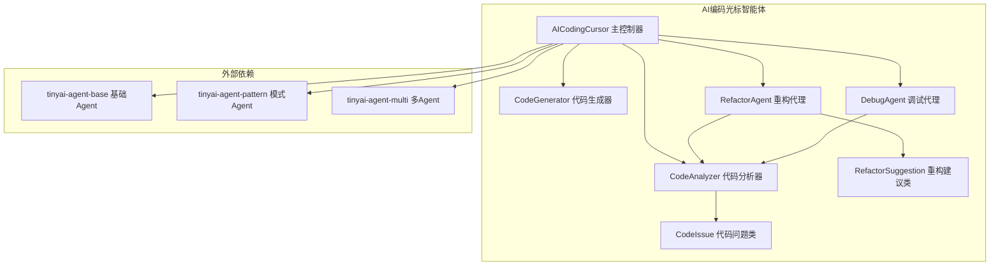
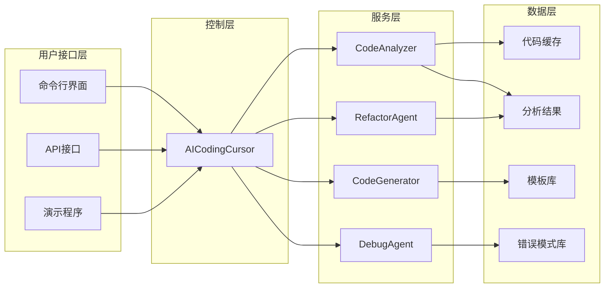
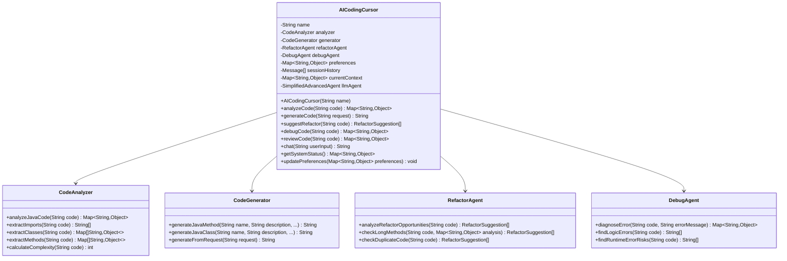
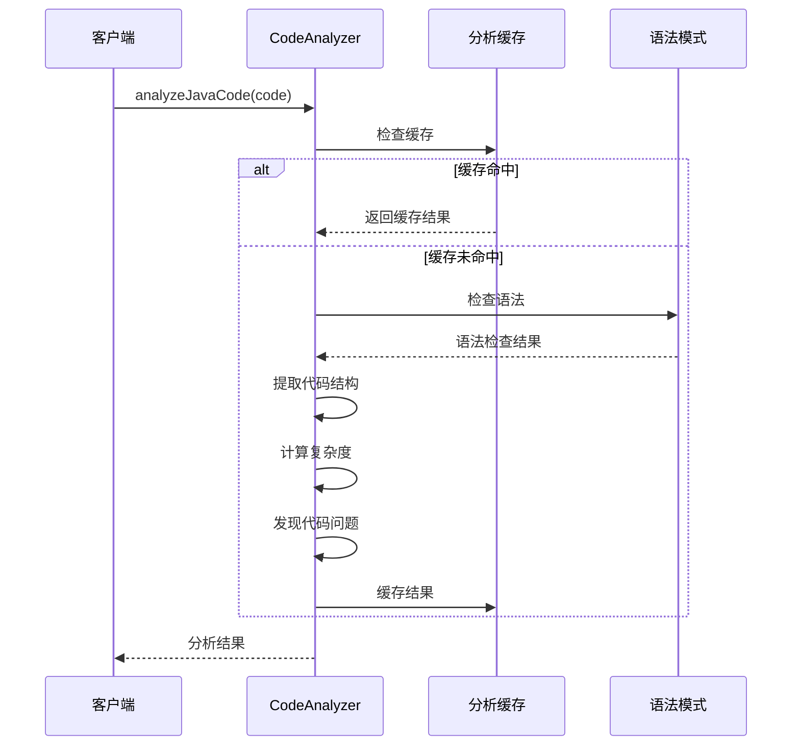
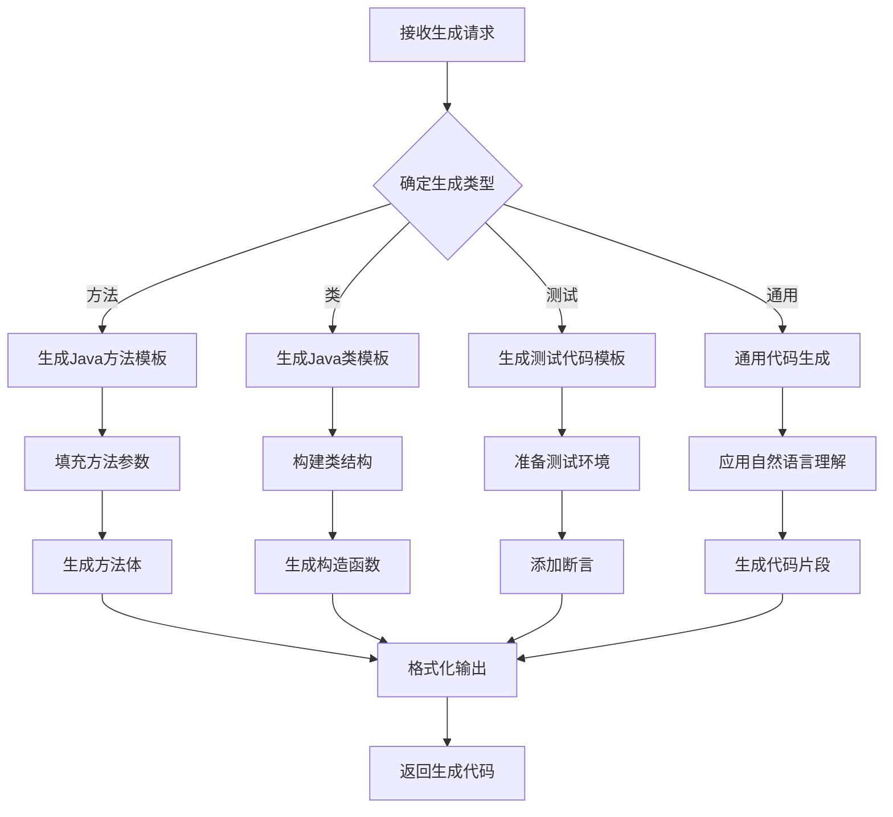
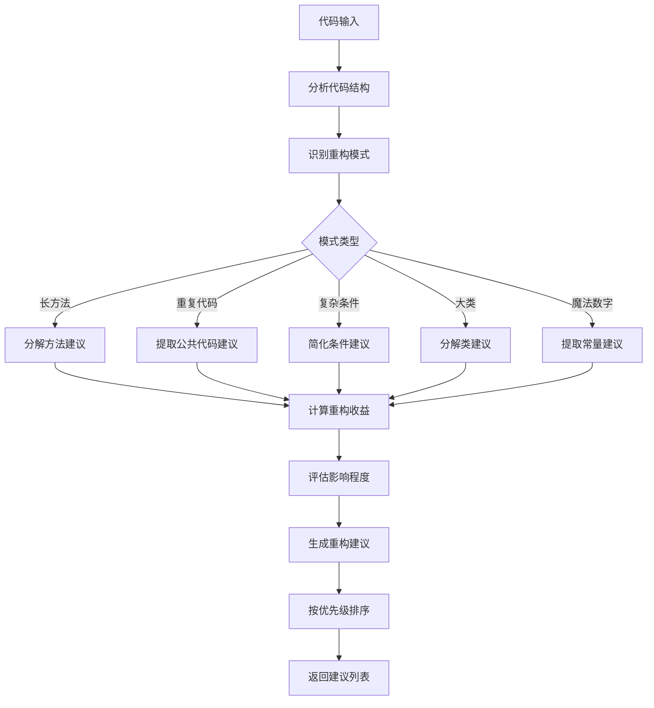
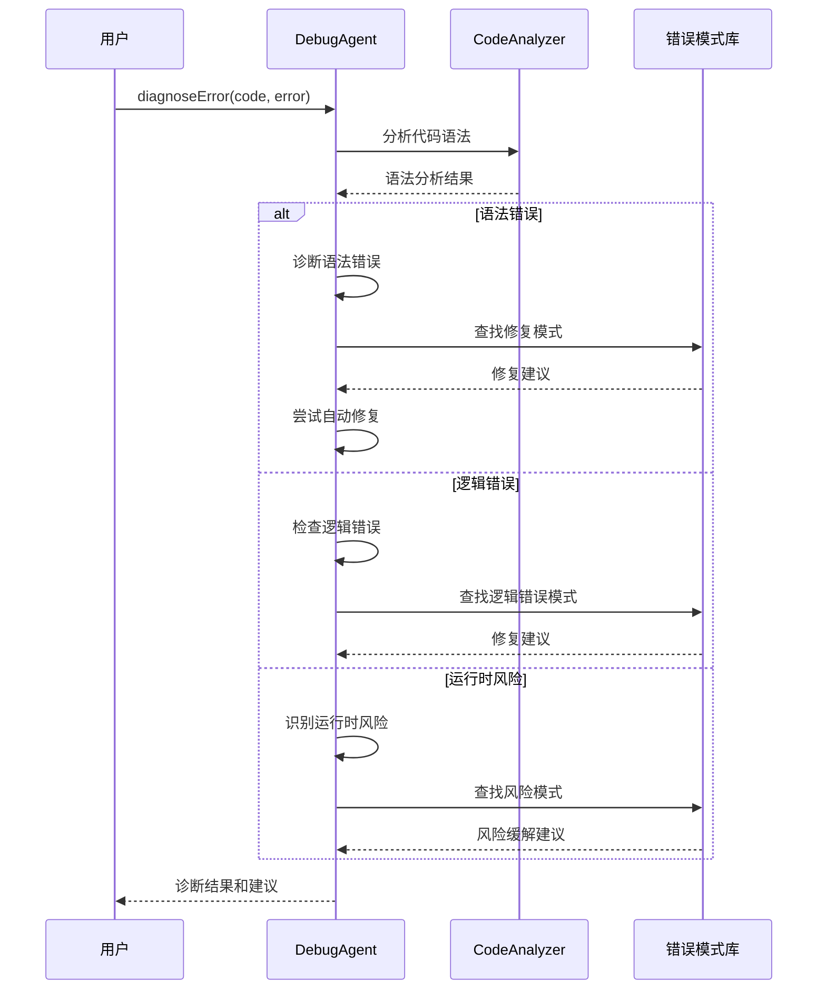

# AI编码光标智能体

<cite>
**本文档中引用的文件**
- [AICodingCursor.java](file://tinyai-agent-cursor/src/main/java/io/leavesfly/tinyai/agent/cursor/AICodingCursor.java)
- [CodeAnalyzer.java](file://tinyai-agent-cursor/src/main/java/io/leavesfly/tinyai/agent/cursor/CodeAnalyzer.java)
- [CodeGenerator.java](file://tinyai-agent-cursor/src/main/java/io/leavesfly/tinyai/agent/cursor/CodeGenerator.java)
- [RefactorAgent.java](file://tinyai-agent-cursor/src/main/java/io/leavesfly/tinyai/agent/cursor/RefactorAgent.java)
- [DebugAgent.java](file://tinyai-agent-cursor/src/main/java/io/leavesfly/tinyai/agent/cursor/DebugAgent.java)
- [CodeIssue.java](file://tinyai-agent-cursor/src/main/java/io/leavesfly/tinyai/agent/cursor/CodeIssue.java)
- [RefactorSuggestion.java](file://tinyai-agent-cursor/src/main/java/io/leavesfly/tinyai/agent/cursor/RefactorSuggestion.java)
- [CursorDemo.java](file://tinyai-agent-cursor/src/main/java/io/leavesfly/tinyai/agent/cursor/CursorDemo.java)
- [README.md](file://tinyai-agent-cursor/README.md)
- [pom.xml](file://tinyai-agent-cursor/pom.xml)
</cite>

## 目录
1. [简介](#简介)
2. [项目结构](#项目结构)
3. [核心组件](#核心组件)
4. [架构概览](#架构概览)
5. [详细组件分析](#详细组件分析)
6. [API接口](#api接口)
7. [使用示例](#使用示例)
8. [集成指南](#集成指南)
9. [最佳实践](#最佳实践)
10. [故障排除](#故障排除)
11. [结论](#结论)

## 简介

AI编码光标智能体是一个功能完整的Java智能编程助手系统，基于Python版本重新设计并充分利用了TinyAI项目中的现有组件。系统具备代码理解、生成、分析、重构和调试等核心能力，为Java开发者提供全方位的编程辅助。

该系统模拟了类似Cursor AI的核心功能，专门针对Java编程任务进行优化，旨在提高开发效率、保证代码质量和促进最佳实践的应用。

## 项目结构

AI编码光标智能体项目采用模块化设计，主要包含以下核心组件：



**图表来源**
- [AICodingCursor.java](file://tinyai-agent-cursor/src/main/java/io/leavesfly/tinyai/agent/cursor/AICodingCursor.java#L1-L50)
- [CodeAnalyzer.java](file://tinyai-agent-cursor/src/main/java/io/leavesfly/tinyai/agent/cursor/CodeAnalyzer.java#L1-L30)
- [CodeGenerator.java](file://tinyai-agent-cursor/src/main/java/io/leavesfly/tinyai/agent/cursor/CodeGenerator.java#L1-L30)

**章节来源**
- [README.md](file://tinyai-agent-cursor/README.md#L1-L100)
- [pom.xml](file://tinyai-agent-cursor/pom.xml#L1-L58)

## 核心组件

AI编码光标智能体由五个核心组件构成，每个组件都有明确的职责和功能：

### 1. AICodingCursor 主控制器
负责协调各个子系统的工作，提供统一的API接口。

### 2. CodeAnalyzer 代码分析器
执行深度的代码分析，包括语法检查、结构分析、复杂度计算和问题识别。

### 3. CodeGenerator 代码生成器
基于模板和上下文生成高质量的Java代码。

### 4. RefactorAgent 重构代理
智能分析代码结构，提供具体的重构建议和实施方案。

### 5. DebugAgent 调试代理
诊断代码中的潜在错误，提供修复建议和自动修复功能。

**章节来源**
- [AICodingCursor.java](file://tinyai-agent-cursor/src/main/java/io/leavesfly/tinyai/agent/cursor/AICodingCursor.java#L15-L50)
- [CodeAnalyzer.java](file://tinyai-agent-cursor/src/main/java/io/leavesfly/tinyai/agent/cursor/CodeAnalyzer.java#L15-L30)
- [CodeGenerator.java](file://tinyai-agent-cursor/src/main/java/io/leavesfly/tinyai/agent/cursor/CodeGenerator.java#L15-L30)

## 架构概览

AI编码光标智能体采用分层架构设计，各组件之间通过清晰的接口进行通信：



**图表来源**
- [AICodingCursor.java](file://tinyai-agent-cursor/src/main/java/io/leavesfly/tinyai/agent/cursor/AICodingCursor.java#L30-L80)
- [CursorDemo.java](file://tinyai-agent-cursor/src/main/java/io/leavesfly/tinyai/agent/cursor/CursorDemo.java#L1-L50)

## 详细组件分析

### AICodingCursor 主控制器分析

AICodingCursor是整个系统的核心控制器，负责协调各个子系统的协同工作：



**图表来源**
- [AICodingCursor.java](file://tinyai-agent-cursor/src/main/java/io/leavesfly/tinyai/agent/cursor/AICodingCursor.java#L15-L100)
- [CodeAnalyzer.java](file://tinyai-agent-cursor/src/main/java/io/leavesfly/tinyai/agent/cursor/CodeAnalyzer.java#L15-L50)
- [CodeGenerator.java](file://tinyai-agent-cursor/src/main/java/io/leavesfly/tinyai/agent/cursor/CodeGenerator.java#L15-L50)
- [RefactorAgent.java](file://tinyai-agent-cursor/src/main/java/io/leavesfly/tinyai/agent/cursor/RefactorAgent.java#L15-L50)
- [DebugAgent.java](file://tinyai-agent-cursor/src/main/java/io/leavesfly/tinyai/agent/cursor/DebugAgent.java#L15-L50)

**章节来源**
- [AICodingCursor.java](file://tinyai-agent-cursor/src/main/java/io/leavesfly/tinyai/agent/cursor/AICodingCursor.java#L1-L200)

### CodeAnalyzer 代码分析器分析

CodeAnalyzer负责深度的代码分析，提供全面的代码质量评估：



**图表来源**
- [CodeAnalyzer.java](file://tinyai-agent-cursor/src/main/java/io/leavesfly/tinyai/agent/cursor/CodeAnalyzer.java#L30-L80)

**章节来源**
- [CodeAnalyzer.java](file://tinyai-agent-cursor/src/main/java/io/leavesfly/tinyai/agent/cursor/CodeAnalyzer.java#L1-L200)

### CodeGenerator 代码生成器分析

CodeGenerator基于模板系统和上下文感知生成高质量的Java代码：



**图表来源**
- [CodeGenerator.java](file://tinyai-agent-cursor/src/main/java/io/leavesfly/tinyai/agent/cursor/CodeGenerator.java#L50-L150)

**章节来源**
- [CodeGenerator.java](file://tinyai-agent-cursor/src/main/java/io/leavesfly/tinyai/agent/cursor/CodeGenerator.java#L1-L200)

### RefactorAgent 重构代理分析

RefactorAgent智能分析代码结构，提供具体的重构建议：



**图表来源**
- [RefactorAgent.java](file://tinyai-agent-cursor/src/main/java/io/leavesfly/tinyai/agent/cursor/RefactorAgent.java#L80-L150)

**章节来源**
- [RefactorAgent.java](file://tinyai-agent-cursor/src/main/java/io/leavesfly/tinyai/agent/cursor/RefactorAgent.java#L1-L200)

### DebugAgent 调试代理分析

DebugAgent提供智能的错误诊断和修复建议：



**图表来源**
- [DebugAgent.java](file://tinyai-agent-cursor/src/main/java/io/leavesfly/tinyai/agent/cursor/DebugAgent.java#L100-L200)

**章节来源**
- [DebugAgent.java](file://tinyai-agent-cursor/src/main/java/io/leavesfly/tinyai/agent/cursor/DebugAgent.java#L1-L200)

## API接口

### AICodingCursor 主要方法

```java
// 代码分析
Map<String, Object> analyzeCode(String code)

// 代码生成
String generateCode(String request)

// 重构建议
List<RefactorSuggestion> suggestRefactor(String code)

// 错误调试
Map<String, Object> debugCode(String code)
Map<String, Object> debugCode(String code, String errorMessage)

// 综合审查
Map<String, Object> reviewCode(String code)

// AI对话
String chat(String userInput)

// 系统管理
Map<String, Object> getSystemStatus()
void updatePreferences(Map<String, Object> preferences)
void clearSessionHistory()
```

### CodeAnalyzer 分析器接口

```java
// 分析Java代码
Map<String, Object> analyzeJavaCode(String code)

// 返回结果包含：
// - syntax_valid: 语法是否有效
// - imports: 导入语句列表
// - classes: 类定义信息
// - methods: 方法定义信息
// - variables: 变量定义信息
// - complexity: 圈复杂度
// - issues: 代码问题列表
// - metrics: 代码度量指标
```

### CodeGenerator 生成器接口

```java
// 生成Java方法
String generateJavaMethod(String name, String description, 
                         List<String> parameters, String returnType, String modifier)

// 生成Java类
String generateJavaClass(String name, String description, String modifier,
                        String inheritance, List<String> fields, List<String> methods)

// 生成测试代码
String generateJavaTest(String methodName, String className, String returnType)

// 根据请求生成代码
String generateFromRequest(String request)
```

**章节来源**
- [AICodingCursor.java](file://tinyai-agent-cursor/src/main/java/io/leavesfly/tinyai/agent/cursor/AICodingCursor.java#L80-L300)

## 使用示例

### 基础使用示例

```java
import io.leavesfly.tinyai.agent.cursor.AICodingCursor;

// 创建AI Coding Cursor实例
AICodingCursor cursor = new AICodingCursor("我的编程助手");

// 1. 分析代码
String code = """
    public class Calculator {
        public int add(int a, int b) {
            return a + b;
        }
    }
    """;

Map<String, Object> analysis = cursor.analyzeCode(code);
System.out.println("语法有效: " + analysis.get("syntax_valid"));
System.out.println("复杂度: " + analysis.get("complexity"));

// 2. 生成代码
String newCode = cursor.generateCode("method validateEmail");
System.out.println("生成的代码:\n" + newCode);

// 3. 重构建议
List<RefactorSuggestion> suggestions = cursor.suggestRefactor(code);
for (RefactorSuggestion suggestion : suggestions) {
    System.out.println("建议: " + suggestion.getDescription());
}

// 4. 调试代码
Map<String, Object> debugResult = cursor.debugCode(code);
System.out.println("发现错误: " + debugResult.get("error_found"));

// 5. 综合代码审查
Map<String, Object> review = cursor.reviewCode(code);
System.out.println("质量评分: " + review.get("overall_score"));

// 6. AI对话
String response = cursor.chat("什么是单例模式？");
System.out.println("AI回复: " + response);
```

### 高级使用示例

```java
// 配置系统偏好
Map<String, Object> preferences = new HashMap<>();
preferences.put("language", "java");
preferences.put("style", "standard");
preferences.put("auto_refactor", true);
preferences.put("debug_level", "detailed");
preferences.put("max_suggestions", 10);
preferences.put("enable_ai_chat", true);

cursor.updatePreferences(preferences);

// 批量代码分析
List<String> codeFiles = Arrays.asList(code1, code2, code3);
for (String code : codeFiles) {
    Map<String, Object> result = cursor.reviewCode(code);
    double score = (Double) result.get("overall_score");
    System.out.println("代码质量评分: " + score);
}
```

**章节来源**
- [CursorDemo.java](file://tinyai-agent-cursor/src/main/java/io/leavesfly/tinyai/agent/cursor/CursorDemo.java#L50-L200)

## 集成指南

### Maven依赖配置

```xml
<dependency>
    <groupId>io.leavesfly.tinyai</groupId>
    <artifactId>tinyai-agent-cursor</artifactId>
    <version>1.0-SNAPSHOT</version>
</dependency>
```

### 环境要求

- Java 17 或更高版本
- Maven 3.6 或更高版本
- TinyAI项目的其他模块依赖

### 开发环境搭建

```bash
# 克隆项目
git clone <repository-url>
cd TinyAI

# 构建项目
export JAVA_HOME="/Library/Java/JavaVirtualMachines/jdk-17.jdk/Contents/Home"
mvn clean install -DskipTests

# 单独构建cursor模块
mvn clean compile -pl tinyai-agent-cursor
```

### 运行演示程序

```bash
# 使用Maven运行演示程序
cd tinyai-agent-cursor
mvn exec:java -Dexec.mainClass="io.leavesfly.tinyai.agent.cursor.CursorDemo"
```

**章节来源**
- [README.md](file://tinyai-agent-cursor/README.md#L50-L150)
- [pom.xml](file://tinyai-agent-cursor/pom.xml#L1-L58)

## 最佳实践

### 1. 代码质量提升

- **定期使用代码审查功能**：每周至少进行一次全面的代码质量评估
- **关注重构建议**：及时处理高优先级的重构建议
- **利用AI对话功能**：通过AI获取编程最佳实践建议

### 2. 性能优化

- **合理使用缓存**：利用内置的分析结果缓存提高性能
- **批量处理**：对于大量代码文件，考虑批量处理而非逐个分析
- **监控系统状态**：定期检查系统性能指标

### 3. 工作流集成

- **IDE集成**：将AI编码光标集成到常用的IDE中
- **CI/CD集成**：在持续集成流程中加入代码质量检查
- **团队协作**：建立团队代码质量标准和审查流程

### 4. 配置优化

```java
// 推荐的配置设置
Map<String, Object> optimalConfig = new HashMap<>();
optimalConfig.put("language", "java");
optimalConfig.put("style", "standard");
optimalConfig.put("auto_refactor", true);
optimalConfig.put("debug_level", "detailed");
optimalConfig.put("max_suggestions", 15); // 增加建议数量
optimalConfig.put("enable_ai_chat", true);
optimalConfig.put("cache_enabled", true); // 启用缓存
```

## 故障排除

### 常见问题及解决方案

#### 1. 语法分析失败

**问题描述**：代码分析返回错误或无法正确解析

**解决方案**：
```java
// 检查代码完整性
if (code == null || code.trim().isEmpty()) {
    System.out.println("代码不能为空");
    return;
}

// 检查编码格式
try {
    byte[] bytes = code.getBytes("UTF-8");
    String normalizedCode = new String(bytes, "UTF-8");
    // 使用标准化后的代码进行分析
} catch (Exception e) {
    System.out.println("编码转换失败: " + e.getMessage());
}
```

#### 2. 生成代码质量问题

**问题描述**：生成的代码不符合预期或质量不高

**解决方案**：
```java
// 提供更详细的生成请求
String detailedRequest = "生成一个完整的Java类，包含以下功能：\n" +
    "- 私有字段\n" +
    "- 公共构造函数\n" +
    "- getter/setter方法\n" +
    "- toString方法\n" +
    "- equals和hashCode方法";

String improvedCode = cursor.generateCode(detailedRequest);
```

#### 3. 性能问题

**问题描述**：大型代码文件分析速度慢

**解决方案**：
```java
// 分割大型文件进行分析
String[] codeChunks = splitLargeFile(code, 1000); // 每块1000行
for (String chunk : codeChunks) {
    Map<String, Object> result = cursor.analyzeCode(chunk);
    // 合并结果
}
```

#### 4. 内存使用过高

**问题描述**：长时间运行后内存占用过高

**解决方案**：
```java
// 定期清理缓存
cursor.clearSessionHistory();
cursor.getGenerator().clearTemplateCache();

// 监控内存使用
Runtime runtime = Runtime.getRuntime();
long memoryUsed = runtime.totalMemory() - runtime.freeMemory();
System.out.println("内存使用: " + memoryUsed / 1024 / 1024 + " MB");
```

### 调试技巧

#### 1. 启用详细日志

```java
// 在系统初始化时启用详细日志
Map<String, Object> debugPrefs = new HashMap<>();
debugPrefs.put("debug_level", "verbose");
cursor.updatePreferences(debugPrefs);
```

#### 2. 分步调试

```java
// 分步执行关键功能
String code = "public class Test {}";
Map<String, Object> analysis = cursor.analyzeCode(code);
System.out.println("分析结果: " + analysis);

List<RefactorSuggestion> suggestions = cursor.suggestRefactor(code);
System.out.println("重构建议: " + suggestions.size());

Map<String, Object> debugResult = cursor.debugCode(code);
System.out.println("调试结果: " + debugResult);
```

**章节来源**
- [AICodingCursor.java](file://tinyai-agent-cursor/src/main/java/io/leavesfly/tinyai/agent/cursor/AICodingCursor.java#L100-L200)
- [CodeAnalyzer.java](file://tinyai-agent-cursor/src/main/java/io/leavesfly/tinyai/agent/cursor/CodeAnalyzer.java#L100-L200)

## 结论

AI编码光标智能体是一个功能强大且设计精良的Java智能编程助手系统。通过模块化的架构设计和丰富的功能特性，它为Java开发者提供了全方位的编程辅助服务。

### 主要优势

1. **全面的功能覆盖**：从代码分析到生成、重构、调试，提供完整的编程辅助
2. **高性能设计**：采用缓存机制和优化算法，确保良好的响应性能
3. **易于集成**：提供清晰的API接口和详细的集成指南
4. **可扩展性强**：模块化设计便于功能扩展和定制

### 应用场景

- **日常开发辅助**：实时代码质量检查和智能代码生成
- **代码审查**：自动化代码质量评估和标准化审查流程
- **学习和教育**：分析示例代码结构和学习最佳实践
- **团队协作**：统一代码风格标准和提高团队开发效率

### 未来发展方向

1. **更多语言支持**：扩展到JavaScript、Python等其他编程语言
2. **云端集成**：提供云端版本和API服务
3. **插件生态**：开发IDE插件和浏览器扩展
4. **机器学习增强**：引入更先进的AI模型提升智能化水平

AI编码光标智能体代表了现代编程辅助工具的发展方向，通过人工智能技术的应用，显著提升了软件开发的效率和质量。随着技术的不断进步，它将在软件开发领域发挥越来越重要的作用。