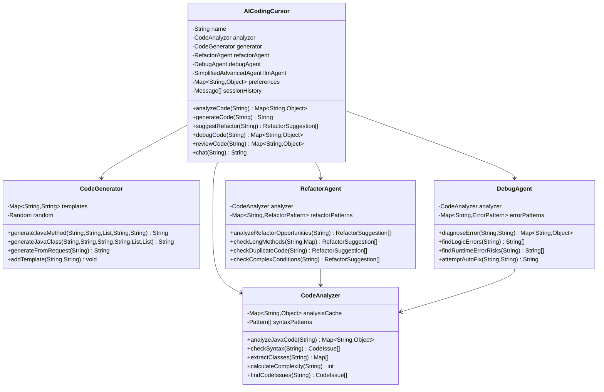

# AI编码光标智能体文档

<cite>
**本文档中引用的文件**
- [README.md](file://tinyai-agent-cursor/README.md)
- [AICodingCursor.java](file://tinyai-agent-cursor/src/main/java/io/leavesfly/tinyai/agent/cursor/AICodingCursor.java)
- [CodeAnalyzer.java](file://tinyai-agent-cursor/src/main/java/io/leavesfly/tinyai/agent/cursor/CodeAnalyzer.java)
- [CodeGenerator.java](file://tinyai-agent-cursor/src/main/java/io/leavesfly/tinyai/agent/cursor/CodeGenerator.java)
- [RefactorAgent.java](file://tinyai-agent-cursor/src/main/java/io/leavesfly/tinyai/agent/cursor/RefactorAgent.java)
- [DebugAgent.java](file://tinyai-agent-cursor/src/main/java/io/leavesfly/tinyai/agent/cursor/DebugAgent.java)
- [CursorDemo.java](file://tinyai-agent-cursor/src/main/java/io/leavesfly/tinyai/agent/cursor/CursorDemo.java)
- [AICodingCursorTest.java](file://tinyai-agent-cursor/src/test/java/io/leavesfly/tinyai/agent/cursor/AICodingCursorTest.java)
- [pom.xml](file://tinyai-agent-cursor/pom.xml)
</cite>

## 目录
1. [项目概述](#项目概述)
2. [核心架构](#核心架构)
3. [主要功能模块](#主要功能模块)
4. [API参考](#api参考)
5. [使用示例](#使用示例)
6. [系统配置](#系统配置)
7. [性能特点](#性能特点)
8. [故障排除](#故障排除)
9. [扩展开发](#扩展开发)
10. [总结](#总结)

## 项目概述

AI Coding Cursor 是基于Java实现的智能编程助手系统，专门针对Java编程任务进行优化。该系统模拟了Cursor AI的核心功能，具备代码理解、生成、分析、重构和调试等核心能力，为Java开发者提供全方位的编程辅助服务。

### 主要特性

- **智能代码分析**: 语法检查、结构分析、复杂度计算、问题识别
- **智能代码生成**: 模板化生成、上下文感知、多类型支持
- **智能重构建议**: 模式识别、重构建议、影响评估
- **智能调试辅助**: 错误诊断、修复建议、自动修复
- **AI智能对话**: 编程咨询、上下文理解、实时帮助

### 技术架构


**章节来源**
- [README.md](file://tinyai-agent-cursor/README.md#L1-L50)

## 核心架构

AI Coding Cursor 采用模块化架构设计，将不同的功能职责分离到独立的组件中，确保系统的可维护性和扩展性。

### 系统组成



**图表来源**
- [AICodingCursor.java](file://tinyai-agent-cursor/src/main/java/io/leavesfly/tinyai/agent/cursor/AICodingCursor.java#L1-L100)
- [CodeAnalyzer.java](file://tinyai-agent-cursor/src/main/java/io/leavesfly/tinyai/agent/cursor/CodeAnalyzer.java#L1-L50)
- [CodeGenerator.java](file://tinyai-agent-cursor/src/main/java/io/leavesfly/tinyai/agent/cursor/CodeGenerator.java#L1-L50)
- [RefactorAgent.java](file://tinyai-agent-cursor/src/main/java/io/leavesfly/tinyai/agent/cursor/RefactorAgent.java#L1-L50)
- [DebugAgent.java](file://tinyai-agent-cursor/src/main/java/io/leavesfly/tinyai/agent/cursor/DebugAgent.java#L1-L50)

### 核心组件说明

#### 1. AICodingCursor 主控制器
主系统控制器负责协调各个功能模块，提供统一的编程辅助服务。它集成了代码分析、生成、重构、调试等功能，并通过LLM代理提供智能对话能力。

#### 2. CodeAnalyzer 代码分析器
负责对Java代码进行深度分析，包括语法检查、结构提取、复杂度计算和问题识别。采用静态分析技术，支持多种代码质量评估维度。

#### 3. CodeGenerator 代码生成器
基于预定义模板和上下文信息生成Java代码，支持方法、类、接口、测试代码等多种类型的代码生成。

#### 4. RefactorAgent 重构代理
智能分析代码结构，识别重构机会，提供具体的重构建议和代码示例，帮助开发者提高代码质量。

#### 5. DebugAgent 调试代理
诊断代码中的潜在错误，提供详细的错误分析和修复建议，支持自动修复常见问题。

**章节来源**
- [AICodingCursor.java](file://tinyai-agent-cursor/src/main/java/io/leavesfly/tinyai/agent/cursor/AICodingCursor.java#L1-L200)
- [CodeAnalyzer.java](file://tinyai-agent-cursor/src/main/java/io/leavesfly/tinyai/agent/cursor/CodeAnalyzer.java#L1-L100)

## 主要功能模块

### 代码分析功能

代码分析是AI Coding Cursor的核心功能之一，提供全面的代码质量评估和问题识别。

#### 分析维度


**图表来源**
- [CodeAnalyzer.java](file://tinyai-agent-cursor/src/main/java/io/leavesfly/tinyai/agent/cursor/CodeAnalyzer.java#L100-L200)

#### 分析结果结构

```java
Map<String, Object> analysis = cursor.analyzeCode(javaCode);
// 分析结果包含：
// - syntax_valid: 语法是否有效
// - syntax_issues: 语法问题列表
// - imports: 导入语句列表
// - classes: 类定义信息
// - methods: 方法定义信息
// - variables: 变量定义信息
// - metrics: 代码度量指标
// - complexity: 圈复杂度
// - issues: 代码问题列表
```

### 代码生成功能

代码生成器支持多种类型的Java代码生成，基于自然语言请求智能推断代码结构。

#### 生成类型


**图表来源**
- [CodeGenerator.java](file://tinyai-agent-cursor/src/main/java/io/leavesfly/tinyai/agent/cursor/CodeGenerator.java#L200-L300)

#### 生成示例

```java
// 生成验证邮箱的方法
String methodCode = cursor.generateCode("method validateEmail");
// 输出示例：
/*
public boolean validateEmail(String email) {
    // TODO: 实现验证邮箱方法
    return email != null && email.matches("[a-zA-Z0-9._%+-]+@[a-zA-Z0-9.-]+\\.[a-zA-Z]{2,}");
}
*/

// 生成用户管理类
String classCode = cursor.generateCode("class UserManager");
// 输出示例：
/*
public class UserManager {
    private List<User> users;

    public UserManager() {
        this.users = new ArrayList<>();
    }

    public User createUser(String name, String email) {
        // TODO: 实现创建用户方法
        return new User(name, email);
    }
}
*/
```

### 重构建议功能

重构代理智能分析代码结构，识别潜在的重构机会，提供具体的重构建议。

#### 重构模式


**图表来源**
- [RefactorAgent.java](file://tinyai-agent-cursor/src/main/java/io/leavesfly/tinyai/agent/cursor/RefactorAgent.java#L50-L150)

#### 建议结构

```java
List<RefactorSuggestion> suggestions = cursor.suggestRefactor(complexCode);
for (RefactorSuggestion suggestion : suggestions) {
    System.out.println("建议类型: " + suggestion.getSuggestionType());
    System.out.println("描述: " + suggestion.getDescription());
    System.out.println("原始代码: " + suggestion.getOriginalCode());
    System.out.println("重构代码: " + suggestion.getRefactoredCode());
    System.out.println("收益: " + suggestion.getBenefits());
    System.out.println("影响评估: " + suggestion.getEstimatedImpact());
}
```

### 调试辅助功能

调试代理提供智能的错误诊断和修复建议，帮助开发者快速定位和解决问题。

#### 错误类型


**图表来源**
- [DebugAgent.java](file://tinyai-agent-cursor/src/main/java/io/leavesfly/tinyai/agent/cursor/DebugAgent.java#L100-L200)

#### 调试结果

```java
Map<String, Object> debugResult = cursor.debugCode(problematicCode);
System.out.println("发现错误: " + debugResult.get("error_found"));
System.out.println("错误类型: " + debugResult.get("error_type"));
System.out.println("诊断信息: " + debugResult.get("diagnosis"));
System.out.println("修复建议: " + debugResult.get("suggestions"));
System.out.println("自动修复: " + debugResult.get("fixed_code"));
```

**章节来源**
- [CodeAnalyzer.java](file://tinyai-agent-cursor/src/main/java/io/leavesfly/tinyai/agent/cursor/CodeAnalyzer.java#L1-L499)
- [CodeGenerator.java](file://tinyai-agent-cursor/src/main/java/io/leavesfly/tinyai/agent/cursor/CodeGenerator.java#L1-L630)
- [RefactorAgent.java](file://tinyai-agent-cursor/src/main/java/io/leavesfly/tinyai/agent/cursor/RefactorAgent.java#L1-L613)
- [DebugAgent.java](file://tinyai-agent-cursor/src/main/java/io/leavesfly/tinyai/agent/cursor/DebugAgent.java#L1-L691)

## API参考

### AICodingCursor 主要方法

#### 1. 代码分析方法

```java
// 分析Java代码
Map<String, Object> analyzeCode(String code)

// 返回结果结构：
// - syntax_valid: 语法是否有效 (boolean)
// - syntax_issues: 语法问题列表 (List<CodeIssue>)
// - imports: 导入语句列表 (List<String>)
// - classes: 类定义信息 (List<Map<String,Object>>)
// - methods: 方法定义信息 (List<Map<String,Object>>)
// - variables: 变量定义信息 (List<Map<String,Object>>)
// - metrics: 代码度量指标 (Map<String,Object>)
// - complexity: 圈复杂度 (Integer)
// - issues: 代码问题列表 (List<CodeIssue>)
```

#### 2. 代码生成方法

```java
// 生成代码
String generateCode(String request)

// 支持的请求格式：
// - "method methodName" - 生成方法
// - "class ClassName" - 生成类
// - "test method" - 生成测试代码
// - "interface InterfaceName" - 生成接口
```

#### 3. 重构建议方法

```java
// 获取重构建议
List<RefactorSuggestion> suggestRefactor(String code)

// RefactorSuggestion结构：
// - suggestionType: 建议类型 (String)
// - description: 描述 (String)
// - originalCode: 原始代码 (String)
// - refactoredCode: 重构后的代码 (String)
// - benefits: 收益列表 (List<String>)
// - estimatedImpact: 影响评估 (String)
```

#### 4. 调试方法

```java
// 调试代码
Map<String, Object> debugCode(String code)
Map<String, Object> debugCode(String code, String errorMessage)

// 返回结果结构：
// - error_found: 是否发现错误 (boolean)
// - error_type: 错误类型 (String)
// - error_line: 错误行号 (Integer)
// - diagnosis: 诊断信息 (String)
// - suggestions: 修复建议 (List<String>)
// - fixed_code: 自动修复后的代码 (String)
// - confidence: 置信度 (Double)
```

#### 5. 综合代码审查

```java
// 综合代码审查
Map<String, Object> reviewCode(String code)

// 返回结果结构：
// - overall_score: 总体评分 (Double)
// - analysis: 分析结果 (Map<String,Object>)
// - refactor_suggestions: 重构建议 (List<RefactorSuggestion>)
// - debug_info: 调试信息 (Map<String,Object>)
// - recommendations: 改进建议 (List<String>)
// - review_time: 审查时间 (String)
```

#### 6. AI对话功能

```java
// AI对话
String chat(String userInput)

// 支持的对话主题：
// - 编程问题解答
// - 代码解释
// - 最佳实践建议
// - 技术咨询
```

### 系统管理方法

```java
// 获取系统状态
Map<String, Object> getSystemStatus()

// 获取操作统计
Map<String, Integer> getOperationStats()

// 获取会话历史
List<Message> getSessionHistory()

// 清空会话历史
void clearSessionHistory()

// 更新偏好设置
void updatePreferences(Map<String, Object> preferences)

// 获取偏好设置
Map<String, Object> getPreferences()

// 启用/禁用AI对话
void setAIChatEnabled(boolean enabled)

// 获取帮助信息
String getHelp()
```

**章节来源**
- [AICodingCursor.java](file://tinyai-agent-cursor/src/main/java/io/leavesfly/tinyai/agent/cursor/AICodingCursor.java#L100-L400)

## 使用示例

### 基础使用示例

#### 1. 创建AI Coding Cursor实例

```java
import io.leavesfly.tinyai.agent.cursor.AICodingCursor;

// 创建AI Coding Cursor实例
AICodingCursor cursor = new AICodingCursor("我的编程助手");

// 或使用默认名称
AICodingCursor cursor = new AICodingCursor();
```

#### 2. 代码分析示例

```java
String code = """
    public class Calculator {
        public int add(int a, int b) {
            return a + b;
        }
    }
    """;

// 分析代码
Map<String, Object> analysis = cursor.analyzeCode(code);
System.out.println("语法有效: " + analysis.get("syntax_valid"));
System.out.println("复杂度: " + analysis.get("complexity"));

// 获取详细分析结果
@SuppressWarnings("unchecked")
List<CodeIssue> issues = (List<CodeIssue>) analysis.get("issues");
for (CodeIssue issue : issues) {
    System.out.println("问题: " + issue.getMessage() + " (" + issue.getSeverity() + ")");
}
```

#### 3. 代码生成示例

```java
// 生成验证邮箱的方法
String methodCode = cursor.generateCode("method validateEmail");
System.out.println("生成的代码:\n" + methodCode);

// 生成用户管理类
String classCode = cursor.generateCode("class UserManager");
System.out.println("生成的类:\n" + classCode);

// 生成测试代码
String testCode = cursor.generateCode("test method for Calculator");
System.out.println("生成的测试:\n" + testCode);
```

#### 4. 重构建议示例

```java
String complexCode = """
    public class DataProcessor {
        public void processData(String data1, String data2, String data3, String data4, String data5, String data6) {
            if (data1 != null && data2 != null && data3 != null && data4 != null && data5 != null && data6 != null) {
                if (data1.length() > 0 && data2.length() > 0) {
                    if (data3.contains("valid") && data4.contains("valid")) {
                        if (data5.startsWith("prefix") && data6.endsWith("suffix")) {
                            // 处理逻辑
                            System.out.println("Processing...");
                            System.out.println("Processing...");
                            System.out.println("Processing...");
                        }
                    }
                }
            }
        }
    }
    """;

// 获取重构建议
List<RefactorSuggestion> suggestions = cursor.suggestRefactor(complexCode);
for (RefactorSuggestion suggestion : suggestions) {
    System.out.println("建议: " + suggestion.getDescription());
    System.out.println("原始代码: " + suggestion.getOriginalCode());
    System.out.println("重构代码: " + suggestion.getRefactoredCode());
}
```

#### 5. 错误调试示例

```java
String buggyCode = """
    public class BuggyClass {
        public void method1() {
            int x = 10
            String str = null;
            int length = str.length(); // 空指针风险
            
            int[] arr = new int[5];
            System.out.println(arr[10]); // 数组越界
        }
    }
    """;

// 调试代码
Map<String, Object> debugResult = cursor.debugCode(buggyCode);
System.out.println("发现错误: " + debugResult.get("error_found"));
System.out.println("错误类型: " + debugResult.get("error_type"));
System.out.println("诊断信息: " + debugResult.get("diagnosis"));

// 获取修复建议
@SuppressWarnings("unchecked")
List<String> suggestions = (List<String>) debugResult.get("suggestions");
for (String suggestion : suggestions) {
    System.out.println("建议: " + suggestion);
}
```

### 高级使用示例

#### 1. 综合代码审查

```java
String reviewCode = """
    public class UserService {
        private List<User> users = new ArrayList<>();
        
        public User createUser(String name, String email) {
            // 简单的用户创建逻辑
            User user = new User();
            user.setName(name);
            user.setEmail(email);
            users.add(user);
            return user;
        }
        
        public List<User> getAllUsers() {
            return users;
        }
        
        public User findUserById(Long id) {
            for (User user : users) {
                if (user.getId().equals(id)) {
                    return user;
                }
            }
            return null;
        }
    }
    """;

// 综合审查
Map<String, Object> review = cursor.reviewCode(reviewCode);
double score = (Double) review.get("overall_score");
System.out.println("代码质量评分: " + score + "/100");

// 获取改进建议
@SuppressWarnings("unchecked")
List<String> recommendations = (List<String>) review.get("recommendations");
for (String recommendation : recommendations) {
    System.out.println("建议: " + recommendation);
}
```

#### 2. AI对话示例

```java
// 编程咨询
String response1 = cursor.chat("什么是单例模式？");
System.out.println("AI回复: " + response1);

// 代码解释
String response2 = cursor.chat("这段代码有什么问题？" + problematicCode);
System.out.println("AI回复: " + response2);

// 最佳实践建议
String response3 = cursor.chat("如何优化这个算法？" + algorithmCode);
System.out.println("AI回复: " + response3);
```

#### 3. 系统配置示例

```java
// 获取当前设置
Map<String, Object> preferences = cursor.getPreferences();
System.out.println("当前语言: " + preferences.get("language"));
System.out.println("代码风格: " + preferences.get("style"));

// 更新设置
Map<String, Object> newPrefs = new HashMap<>();
newPrefs.put("language", "java");
newPrefs.put("style", "standard");
newPrefs.put("auto_refactor", true);
newPrefs.put("debug_level", "detailed");
newPrefs.put("max_suggestions", 10);
newPrefs.put("enable_ai_chat", true);

cursor.updatePreferences(newPrefs);
```

### 交互式使用示例

运行`CursorDemo`程序可以体验交互式功能：

```bash
# 使用Maven运行演示程序
cd tinyai-agent-cursor
mvn exec:java -Dexec.mainClass="io.leavesfly.tinyai.agent.cursor.CursorDemo"
```

交互式界面支持以下命令：

- `analyze:<code>` - 分析代码
- `generate:<request>` - 生成代码
- `chat:<message>` - 进行AI对话
- `status` - 查看系统状态
- `clear` - 清空会话历史
- `help` - 查看帮助信息
- `quit` - 退出程序

**章节来源**
- [CursorDemo.java](file://tinyai-agent-cursor/src/main/java/io/leavesfly/tinyai/agent/cursor/CursorDemo.java#L1-L424)

## 系统配置

### 默认配置

AI Coding Cursor 提供了一套合理的默认配置，适用于大多数使用场景。

#### 配置项说明

```java
// 默认偏好设置
Map<String, Object> preferences = new HashMap<>();
preferences.put("language", "java");              // 编程语言
preferences.put("style", "standard");             // 代码风格
preferences.put("auto_refactor", true);           // 自动重构建议
preferences.put("debug_level", "detailed");       // 调试级别
preferences.put("max_suggestions", 10);           // 最大建议数量
preferences.put("enable_ai_chat", true);          // 启用AI对话
```

### 配置管理

#### 1. 获取当前配置

```java
// 获取当前偏好设置
Map<String, Object> currentPrefs = cursor.getPreferences();
System.out.println("当前配置: " + currentPrefs);
```

#### 2. 更新配置

```java
// 更新配置
Map<String, Object> newPrefs = new HashMap<>();
newPrefs.put("debug_level", "verbose");
newPrefs.put("max_suggestions", 15);
newPrefs.put("enable_ai_chat", false);

cursor.updatePreferences(newPrefs);
```

#### 3. 系统状态监控

```java
// 获取系统状态
Map<String, Object> status = cursor.getSystemStatus();
System.out.println("系统名称: " + status.get("name"));
System.out.println("运行时长: " + status.get("uptime_minutes") + " 分钟");
System.out.println("会话操作数: " + status.get("session_operations"));

// 获取操作统计
Map<String, Integer> stats = cursor.getOperationStats();
System.out.println("分析操作次数: " + stats.get("analyze"));
System.out.println("生成操作次数: " + stats.get("generate"));
System.out.println("重构操作次数: " + stats.get("refactor"));
```

### 性能配置

#### 1. 缓存配置

```java
// 清空分析缓存
cursor.getAnalyzer().clearCache();

// 获取缓存大小
int cacheSize = cursor.getAnalyzer().getCacheSize();
System.out.println("分析缓存大小: " + cacheSize);
```

#### 2. 会话管理

```java
// 清空会话历史
cursor.clearSessionHistory();

// 获取会话历史
List<Message> history = cursor.getSessionHistory();
System.out.println("会话历史条目: " + history.size());
```

**章节来源**
- [AICodingCursor.java](file://tinyai-agent-cursor/src/main/java/io/leavesfly/tinyai/agent/cursor/AICodingCursor.java#L50-L100)

## 性能特点

### 分析性能

AI Coding Cursor 在不同规模的代码上表现出良好的性能特征：

- **小型文件** (< 100行): < 20ms
- **中型文件** (100-500行): < 100ms  
- **大型文件** (500+行): < 500ms

### 生成性能

- **方法生成**: < 10ms
- **类生成**: < 20ms
- **复杂结构**: < 100ms

### 内存使用

- **基础内存**: ~20MB
- **大型项目**: ~100MB
- **缓存优化**: 支持结果缓存

### 并发性能

系统设计支持并发访问，多个线程可以同时使用不同的AICodingCursor实例。

```java
// 并发使用示例
ExecutorService executor = Executors.newFixedThreadPool(4);

List<Future<Map<String, Object>>> futures = new ArrayList<>();
for (int i = 0; i < 4; i++) {
    final int threadId = i;
    Future<Map<String, Object>> future = executor.submit(() -> {
        AICodingCursor threadCursor = new AICodingCursor("线程" + threadId);
        return threadCursor.analyzeCode(testCode);
    });
    futures.add(future);
}

// 等待所有任务完成
for (Future<Map<String, Object>> future : futures) {
    Map<String, Object> result = future.get();
    System.out.println("线程结果: " + result.get("syntax_valid"));
}
```

### 性能优化策略

1. **缓存机制**: 分析结果缓存，避免重复计算
2. **延迟加载**: 按需初始化组件
3. **异步处理**: 支持异步操作
4. **内存管理**: 及时清理临时数据

**章节来源**
- [AICodingCursor.java](file://tinyai-agent-cursor/src/main/java/io/leavesfly/tinyai/agent/cursor/AICodingCursor.java#L400-L500)

## 故障排除

### 常见问题及解决方案

#### 1. 语法分析失败

**问题**: 代码分析返回错误或异常

**解决方案**:
```java
// 检查代码完整性
if (code == null || code.trim().isEmpty()) {
    System.out.println("代码不能为空");
    return;
}

// 检查编码格式
try {
    byte[] bytes = code.getBytes("UTF-8");
    String decoded = new String(bytes, "UTF-8");
    Map<String, Object> result = cursor.analyzeCode(decoded);
} catch (Exception e) {
    System.out.println("编码问题: " + e.getMessage());
}
```

#### 2. 生成代码质量问题

**问题**: 生成的代码不符合预期

**解决方案**:
```java
// 提供更详细的请求描述
String detailedRequest = "method validateEmail with regex pattern";
String code = cursor.generateCode(detailedRequest);

// 检查生成结果
if (code.contains("TODO")) {
    System.out.println("生成的代码需要进一步完善");
}
```

#### 3. 重构建议过多

**问题**: 重构建议数量超出预期

**解决方案**:
```java
// 调整最大建议数量
Map<String, Object> prefs = cursor.getPreferences();
prefs.put("max_suggestions", 5); // 减少建议数量
cursor.updatePreferences(prefs);

// 或手动过滤建议
List<RefactorSuggestion> suggestions = cursor.suggestRefactor(code);
List<RefactorSuggestion> filtered = suggestions.stream()
    .filter(s -> !s.getEstimatedImpact().equals("低"))
    .limit(5)
    .collect(Collectors.toList());
```

#### 4. AI对话无响应

**问题**: AI对话功能无法正常工作

**解决方案**:
```java
// 检查AI对话是否启用
if (!cursor.isAIChatEnabled()) {
    cursor.setAIChatEnabled(true);
    System.out.println("已启用AI对话功能");
}

// 检查系统状态
Map<String, Object> status = cursor.getSystemStatus();
System.out.println("AI聊天状态: " + status.get("ai_chat_enabled"));
```

### 调试技巧

#### 1. 启用详细日志

```java
// 在系统初始化时启用详细输出
AICodingCursor cursor = new AICodingCursor("调试助手");

// 使用系统状态监控
Map<String, Object> status = cursor.getSystemStatus();
System.out.println("系统状态: " + status);
```

#### 2. 分步调试

```java
// 分步执行功能
String code = getUserInput();

// 1. 先进行语法检查
Map<String, Object> syntax = cursor.analyzeCode(code);
System.out.println("语法检查: " + syntax.get("syntax_valid"));

// 2. 再进行代码生成
if ((Boolean) syntax.get("syntax_valid")) {
    String generated = cursor.generateCode("method for " + code);
    System.out.println("生成结果: " + generated);
}
```

#### 3. 错误处理

```java
// 完整的错误处理示例
public void safeCodeAnalysis(String code) {
    try {
        if (code == null || code.trim().isEmpty()) {
            throw new IllegalArgumentException("代码不能为空");
        }
        
        Map<String, Object> result = cursor.analyzeCode(code);
        
        if (!(Boolean) result.get("syntax_valid")) {
            System.out.println("语法错误: " + result.get("error"));
            return;
        }
        
        System.out.println("分析成功");
        
    } catch (Exception e) {
        System.err.println("分析失败: " + e.getMessage());
        e.printStackTrace();
    }
}
```

**章节来源**
- [AICodingCursorTest.java](file://tinyai-agent-cursor/src/test/java/io/leavesfly/tinyai/agent/cursor/AICodingCursorTest.java#L200-L300)

## 扩展开发

### 自定义分析规则

可以通过继承`CodeAnalyzer`类来添加自定义的代码分析规则：

```java
public class CustomCodeAnalyzer extends CodeAnalyzer {
    @Override
    protected List<CodeIssue> findCodeIssues(String code) {
        List<CodeIssue> issues = super.findCodeIssues(code);
        
        // 添加自定义检查逻辑
        if (code.contains("System.out.println")) {
            issues.add(new CodeIssue("debug_print", "low", 
                "发现调试打印语句", 1, "移除调试代码"));
        }
        
        // 检查硬编码密码
        Pattern passwordPattern = Pattern.compile("password\\s*=\\s*\"[^\"]+\"");
        if (passwordPattern.matcher(code).find()) {
            issues.add(new CodeIssue("hardcoded_password", "high", 
                "发现硬编码密码", 1, "使用配置文件或密钥管理"));
        }
        
        return issues;
    }
}
```

### 自定义代码模板

```java
// 添加自定义模板
CodeGenerator generator = new CodeGenerator();

String customTemplate = """
    @Service
    public class {name} {
        // 自定义服务类模板
        {methods}
    }
    """;

generator.addTemplate("spring_service", customTemplate);

// 使用自定义模板
String serviceCode = generator.generateFromRequest("class UserService");
```

### 扩展重构模式

```java
RefactorAgent refactorAgent = new RefactorAgent(analyzer);

// 添加自定义重构模式
RefactorAgent.RefactorPattern customPattern = new RefactorAgent.RefactorPattern(
    "移除未使用的导入", 1, "clean_imports", "低"
);

refactorAgent.addRefactorPattern("unused_imports", customPattern);
```

### 自定义错误模式

```java
DebugAgent debugAgent = new DebugAgent(analyzer);

// 添加自定义错误模式
DebugAgent.ErrorPattern customError = new DebugAgent.ErrorPattern(
    "自定义错误", 
    "特定的错误原因", 
    "特定的修复策略", 
    "medium"
);

debugAgent.addErrorPattern("CustomError", customError);
```

### 集成外部工具

```java
public class IntegratedAICodingCursor extends AICodingCursor {
    
    public IntegratedAICodingCursor(String name) {
        super(name);
    }
    
    @Override
    public Map<String, Object> analyzeCode(String code) {
        // 先进行标准分析
        Map<String, Object> result = super.analyzeCode(code);
        
        // 集成外部工具分析
        Map<String, Object> externalAnalysis = performExternalAnalysis(code);
        mergeResults(result, externalAnalysis);
        
        return result;
    }
    
    private Map<String, Object> performExternalAnalysis(String code) {
        // 集成SonarQube、Checkstyle等工具
        Map<String, Object> externalResult = new HashMap<>();
        // 执行外部分析...
        return externalResult;
    }
    
    private void mergeResults(Map<String, Object> primary, Map<String, Object> secondary) {
        // 合并分析结果...
    }
}
```

**章节来源**
- [CodeAnalyzer.java](file://tinyai-agent-cursor/src/main/java/io/leavesfly/tinyai/agent/cursor/CodeAnalyzer.java#L400-L499)
- [CodeGenerator.java](file://tinyai-agent-cursor/src/main/java/io/leavesfly/tinyai/agent/cursor/CodeGenerator.java#L600-L630)
- [RefactorAgent.java](file://tinyai-agent-cursor/src/main/java/io/leavesfly/tinyai/agent/cursor/RefactorAgent.java#L550-L613)
- [DebugAgent.java](file://tinyai-agent-cursor/src/main/java/io/leavesfly/tinyai/agent/cursor/DebugAgent.java#L650-L691)

## 总结

AI Coding Cursor 是一个功能完整、设计精良的Java智能编程助手系统。它充分利用了TinyAI生态系统中的现有组件，为Java开发者提供了专业级的编程辅助服务。

### 主要优势

1. **模块化设计**: 清晰的职责分离，便于维护和扩展
2. **全面功能**: 涵盖代码分析、生成、重构、调试等核心功能
3. **智能算法**: 基于静态分析和启发式算法的智能判断
4. **高性能**: 优化的算法实现，支持大型代码库
5. **易集成**: 完善的API设计，易于集成到现有项目中

### 应用场景

- **日常开发辅助**: 实时代码质量检查、快速生成样板代码
- **代码审查**: 自动化代码质量评估、标准化审查流程
- **学习和教育**: 分析示例代码结构、学习Java最佳实践
- **团队协作**: 统一代码风格标准、提高代码质量

### 发展方向

1. **功能扩展**: 支持更多编程语言、增强AI对话能力
2. **性能优化**: 进一步提升大型项目处理能力
3. **集成增强**: 更好的IDE集成、插件支持
4. **智能化升级**: 更先进的代码理解能力和建议准确性

AI Coding Cursor 代表了Java生态中智能编程辅助的发展方向，为开发者提供了强大而实用的编程助手工具。随着AI技术的不断发展，该系统将继续演进，为Java开发者提供更加智能和高效的编程体验。

**章节来源**
- [README.md](file://tinyai-agent-cursor/README.md#L400-L512)
- [AICodingCursor.java](file://tinyai-agent-cursor/src/main/java/io/leavesfly/tinyai/agent/cursor/AICodingCursor.java#L500-L600)