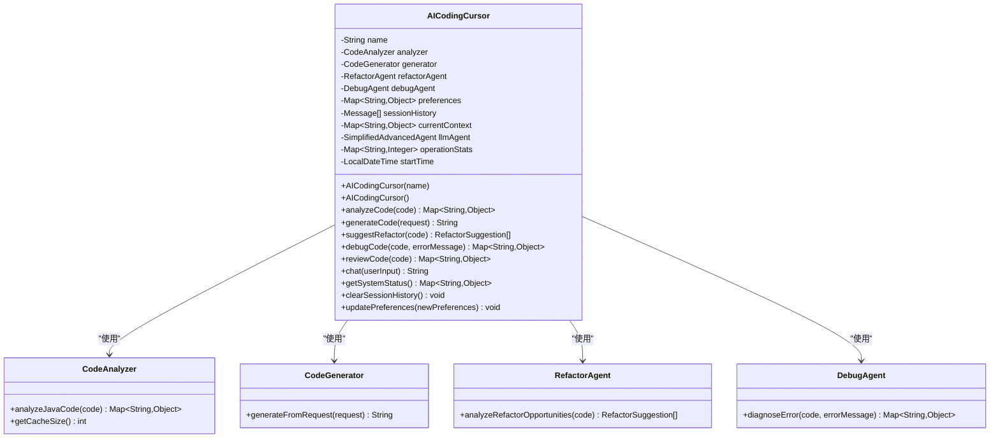

# AI编码光标核心功能

<cite>
**本文档中引用的文件**
- [AICodingCursor.java](file://tinyai-agent-cursor/src/main/java/io/leavesfly/tinyai/agent/cursor/AICodingCursor.java)
- [CodeAnalyzer.java](file://tinyai-agent-cursor/src/main/java/io/leavesfly/tinyai/agent/cursor/CodeAnalyzer.java)
- [CodeGenerator.java](file://tinyai-agent-cursor/src/main/java/io/leavesfly/tinyai/agent/cursor/CodeGenerator.java)
- [RefactorAgent.java](file://tinyai-agent-cursor/src/main/java/io/leavesfly/tinyai/agent/cursor/RefactorAgent.java)
- [DebugAgent.java](file://tinyai-agent-cursor/src/main/java/io/leavesfly/tinyai/agent/cursor/DebugAgent.java)
- [RefactorSuggestion.java](file://tinyai-agent-cursor/src/main/java/io/leavesfly/tinyai/agent/cursor/RefactorSuggestion.java)
- [CodeIssue.java](file://tinyai-agent-cursor/src/main/java/io/leavesfly/tinyai/agent/cursor/CodeIssue.java)
- [CursorDemo.java](file://tinyai-agent-cursor/src/main/java/io/leavesfly/tinyai/agent/cursor/CursorDemo.java)
- [AICodingCursorTest.java](file://tinyai-agent-cursor/src/test/java/io/leavesfly/tinyai/agent/cursor/AICodingCursorTest.java)
- [23_README_AICodingCursor.md](file://tinyai-agent-cursor/doc/23_README_AICodingCursor.md)
</cite>

## 目录
1. [简介](#简介)
2. [项目结构](#项目结构)
3. [核心组件](#核心组件)
4. [架构概览](#架构概览)
5. [详细组件分析](#详细组件分析)
6. [核心方法详解](#核心方法详解)
7. [使用示例](#使用示例)
8. [性能考虑](#性能考虑)
9. [故障排除指南](#故障排除指南)
10. [结论](#结论)

## 简介

AI编码光标（AICodingCursor）是一个功能完整的智能编程助手系统，专为Java开发环境设计。该系统整合了代码分析、生成、重构、调试等核心功能，提供统一的智能编程辅助服务。它模拟了现代AI编程助手的核心能力，包括语法检查、代码质量评估、重构建议、错误诊断和自动修复等功能。

系统采用模块化架构设计，每个核心功能都由专门的代理类负责，通过清晰的接口进行协调工作。这种设计不仅提高了系统的可维护性和扩展性，还确保了各个功能模块的专业性和准确性。

## 项目结构

AI编码光标项目采用标准的Java Maven项目结构，主要包含以下核心文件：


**图表来源**
- [AICodingCursor.java](file://tinyai-agent-cursor/src/main/java/io/leavesfly/tinyai/agent/cursor/AICodingCursor.java#L1-L50)
- [CodeAnalyzer.java](file://tinyai-agent-cursor/src/main/java/io/leavesfly/tinyai/agent/cursor/CodeAnalyzer.java#L1-L30)

**章节来源**
- [AICodingCursor.java](file://tinyai-agent-cursor/src/main/java/io/leavesfly/tinyai/agent/cursor/AICodingCursor.java#L1-L600)
- [23_README_AICodingCursor.md](file://tinyai-agent-cursor/doc/23_README_AICodingCursor.md#L1-L100)

## 核心组件

AI编码光标系统由五个核心组件构成，每个组件都有明确的职责和功能边界：

### 1. AICodingCursor（主控制器）
主控制器负责协调所有子系统，管理全局状态和配置，提供统一的API接口。

### 2. CodeAnalyzer（代码分析器）
负责深度分析代码结构、语法正确性、复杂度计算和潜在问题识别。

### 3. CodeGenerator（代码生成器）
基于模板和上下文生成高质量的代码，支持多种代码类型的生成。

### 4. RefactorAgent（重构代理）
智能分析代码结构，识别重构机会，提供具体的重构建议和实施方案。

### 5. DebugAgent（调试代理）
诊断代码中的错误和潜在问题，提供修复建议和自动修复功能。

**章节来源**
- [AICodingCursor.java](file://tinyai-agent-cursor/src/main/java/io/leavesfly/tinyai/agent/cursor/AICodingCursor.java#L15-L35)
- [CodeAnalyzer.java](file://tinyai-agent-cursor/src/main/java/io/leavesfly/tinyai/agent/cursor/CodeAnalyzer.java#L1-L50)

## 架构概览

AI编码光标采用分层架构设计，各组件之间通过明确定义的接口进行通信：


**图表来源**
- [AICodingCursor.java](file://tinyai-agent-cursor/src/main/java/io/leavesfly/tinyai/agent/cursor/AICodingCursor.java#L15-L45)
- [CodeAnalyzer.java](file://tinyai-agent-cursor/src/main/java/io/leavesfly/tinyai/agent/cursor/CodeAnalyzer.java#L15-L25)

**章节来源**
- [AICodingCursor.java](file://tinyai-agent-cursor/src/main/java/io/leavesfly/tinyai/agent/cursor/AICodingCursor.java#L1-L600)

## 详细组件分析

### AICodingCursor 主控制器

AICodingCursor是整个系统的核心控制器，负责协调各个子系统的协作和管理全局状态：



**图表来源**
- [AICodingCursor.java](file://tinyai-agent-cursor/src/main/java/io/leavesfly/tinyai/agent/cursor/AICodingCursor.java#L15-L45)
- [CodeAnalyzer.java](file://tinyai-agent-cursor/src/main/java/io/leavesfly/tinyai/agent/cursor/CodeAnalyzer.java#L15-L25)

#### 初始化过程

AICodingCursor的初始化过程包括以下关键步骤：

1. **核心组件初始化**：创建并配置四个核心代理
2. **状态管理初始化**：设置偏好设置、会话历史和性能统计
3. **LLM集成**：初始化智能对话代理
4. **默认配置**：设置系统默认偏好和行为模式

```java
// 初始化核心组件
this.analyzer = new CodeAnalyzer();
this.generator = new CodeGenerator();
this.refactorAgent = new RefactorAgent(analyzer);
this.debugAgent = new DebugAgent(analyzer);

// 初始化系统状态
this.preferences = new ConcurrentHashMap<>();
this.sessionHistory = Collections.synchronizedList(new ArrayList<>());
this.currentContext = new ConcurrentHashMap<>();
this.operationStats = new ConcurrentHashMap<>();
this.startTime = LocalDateTime.now();

// 初始化LLM代理
this.llmAgent = new SimplifiedAdvancedAgent("CursorLLM", 
    "你是一个专业的Java编程助手，能够帮助用户进行代码分析、生成、重构和调试。" +
    "请用中文回答问题，提供准确、实用的编程建议。");
```

**章节来源**
- [AICodingCursor.java](file://tinyai-agent-cursor/src/main/java/io/leavesfly/tinyai/agent/cursor/AICodingCursor.java#L35-L70)

### CodeAnalyzer 代码分析器

CodeAnalyzer负责深度分析代码的各个方面，提供全面的代码质量评估：


**图表来源**
- [CodeAnalyzer.java](file://tinyai-agent-cursor/src/main/java/io/leavesfly/tinyai/agent/cursor/CodeAnalyzer.java#L15-L50)
- [CodeIssue.java](file://tinyai-agent-cursor/src/main/java/io/leavesfly/tinyai/agent/cursor/CodeIssue.java#L1-L30)

#### 分析流程

CodeAnalyzer的分析流程包括多个阶段：

1. **语法检查**：验证代码的语法正确性
2. **结构提取**：识别导入、类、方法和变量
3. **度量计算**：计算代码行数、注释行数等指标
4. **复杂度分析**：计算圈复杂度和其他质量指标
5. **问题识别**：发现潜在的代码质量问题

**章节来源**
- [CodeAnalyzer.java](file://tinyai-agent-cursor/src/main/java/io/leavesfly/tinyai/agent/cursor/CodeAnalyzer.java#L1-L200)

### CodeGenerator 代码生成器

CodeGenerator基于预定义的模板和上下文生成高质量的代码：


**图表来源**
- [CodeGenerator.java](file://tinyai-agent-cursor/src/main/java/io/leavesfly/tinyai/agent/cursor/CodeGenerator.java#L15-L50)

#### 生成策略

CodeGenerator采用模板驱动的生成策略：

1. **模板系统**：预定义多种代码模板
2. **参数化生成**：根据输入参数动态生成代码
3. **上下文感知**：考虑项目上下文和最佳实践
4. **质量保证**：确保生成的代码符合编码规范

**章节来源**
- [CodeGenerator.java](file://tinyai-agent-cursor/src/main/java/io/leavesfly/tinyai/agent/cursor/CodeGenerator.java#L1-L200)

### RefactorAgent 重构代理

RefactorAgent智能分析代码结构，识别重构机会并提供具体建议：


**图表来源**
- [RefactorAgent.java](file://tinyai-agent-cursor/src/main/java/io/leavesfly/tinyai/agent/cursor/RefactorAgent.java#L15-L50)
- [RefactorSuggestion.java](file://tinyai-agent-cursor/src/main/java/io/leavesfly/tinyai/agent/cursor/RefactorSuggestion.java#L1-L30)

#### 重构模式

RefactorAgent支持多种重构模式：

1. **长方法重构**：将过长的方法分解为更小的函数
2. **重复代码消除**：提取公共代码到独立函数
3. **大类分解**：将过于庞大的类拆分为更小的类
4. **复杂条件简化**：简化复杂的布尔表达式
5. **参数列表优化**：减少方法参数数量
6. **嵌套层次减少**：通过提前返回等方式减少嵌套
7. **魔法数字消除**：将硬编码值替换为有意义的常量
8. **switch语句替换**：使用多态替代switch语句

**章节来源**
- [RefactorAgent.java](file://tinyai-agent-cursor/src/main/java/io/leavesfly/tinyai/agent/cursor/RefactorAgent.java#L1-L200)

### DebugAgent 调试代理

DebugAgent负责诊断代码中的错误和潜在问题，提供修复建议：


**图表来源**
- [DebugAgent.java](file://tinyai-agent-cursor/src/main/java/io/leavesfly/tinyai/agent/cursor/DebugAgent.java#L15-L50)

#### 错误诊断

DebugAgent支持多种错误类型的诊断：

1. **语法错误**：括号不匹配、缺少分号等
2. **空指针异常**：未初始化对象的访问
3. **数组越界**：数组索引超出范围
4. **类未找到**：缺少依赖或包路径错误
5. **非法参数**：参数类型或值不正确
6. **并发修改异常**：迭代时修改集合
7. **栈溢出**：无限递归或递归过深
8. **内存溢出**：内存泄漏或对象创建过多

**章节来源**
- [DebugAgent.java](file://tinyai-agent-cursor/src/main/java/io/leavesfly/tinyai/agent/cursor/DebugAgent.java#L1-L200)

## 核心方法详解

### analyzeCode 方法

analyzeCode方法是系统的核心分析功能，提供全面的代码质量评估：


**图表来源**
- [AICodingCursor.java](file://tinyai-agent-cursor/src/main/java/io/leavesfly/tinyai/agent/cursor/AICodingCursor.java#L75-L110)
- [CodeAnalyzer.java](file://tinyai-agent-cursor/src/main/java/io/leavesfly/tinyai/agent/cursor/CodeAnalyzer.java#L30-L60)

#### 分析结果结构

analyzeCode方法返回的分析结果包含以下关键信息：

- **语法有效性**：代码是否语法正确
- **代码度量**：总行数、代码行数、注释行数等
- **复杂度指标**：圈复杂度、方法数量等
- **问题列表**：发现的代码质量问题
- **结构信息**：导入、类、方法、变量等

**章节来源**
- [AICodingCursor.java](file://tinyai-agent-cursor/src/main/java/io/leavesfly/tinyai/agent/cursor/AICodingCursor.java#L75-L110)
- [CodeAnalyzer.java](file://tinyai-agent-cursor/src/main/java/io/leavesfly/tinyai/agent/cursor/CodeAnalyzer.java#L30-L100)

### generateCode 方法

generateCode方法基于自然语言请求生成相应代码：


**图表来源**
- [AICodingCursor.java](file://tinyai-agent-cursor/src/main/java/io/leavesfly/tinyai/agent/cursor/AICodingCursor.java#L115-L150)
- [CodeGenerator.java](file://tinyai-agent-cursor/src/main/java/io/leavesfly/tinyai/agent/cursor/CodeGenerator.java#L50-L100)

#### 生成策略

generateCode方法采用上下文感知的生成策略：

1. **请求解析**：理解用户的自然语言描述
2. **类型识别**：确定需要生成的代码类型
3. **模板选择**：选择合适的代码模板
4. **参数填充**：根据请求内容填充模板参数
5. **质量检查**：验证生成代码的正确性
6. **结果返回**：返回生成的代码或错误信息

**章节来源**
- [AICodingCursor.java](file://tinyai-agent-cursor/src/main/java/io/leavesfly/tinyai/agent/cursor/AICodingCursor.java#L115-L150)
- [CodeGenerator.java](file://tinyai-agent-cursor/src/main/java/io/leavesfly/tinyai/agent/cursor/CodeGenerator.java#L50-L150)

### suggestRefactor 方法

suggestRefactor方法智能分析代码结构，提供具体的重构建议：


**图表来源**
- [AICodingCursor.java](file://tinyai-agent-cursor/src/main/java/io/leavesfly/tinyai/agent/cursor/AICodingCursor.java#L155-L190)
- [RefactorAgent.java](file://tinyai-agent-cursor/src/main/java/io/leavesfly/tinyai/agent/cursor/RefactorAgent.java#L50-L100)

#### 建议评估

suggestRefactor方法生成的建议包含以下评估维度：

- **建议类型**：具体的重构类型（如提取方法、消除重复等）
- **描述信息**：详细的重构描述和理由
- **原始代码**：需要重构的代码片段
- **重构代码**：重构后的代码示例
- **收益评估**：重构带来的好处和改进
- **影响评估**：重构的影响程度和风险等级

**章节来源**
- [AICodingCursor.java](file://tinyai-agent-cursor/src/main/java/io/leavesfly/tinyai/agent/cursor/AICodingCursor.java#L155-L190)
- [RefactorAgent.java](file://tinyai-agent-cursor/src/main/java/io/leavesfly/tinyai/agent/cursor/RefactorAgent.java#L50-L150)

### debugCode 方法

debugCode方法诊断代码中的错误并提供修复建议：


**图表来源**
- [AICodingCursor.java](file://tinyai-agent-cursor/src/main/java/io/leavesfly/tinyai/agent/cursor/AICodingCursor.java#L195-L230)
- [DebugAgent.java](file://tinyai-agent-cursor/src/main/java/io/leavesfly/tinyai/agent/cursor/DebugAgent.java#L50-L100)

#### 调试流程

debugCode方法的调试流程包括多个诊断阶段：

1. **语法检查**：首先检查代码的语法正确性
2. **逻辑分析**：识别潜在的逻辑错误
3. **运行时风险**：分析可能的运行时异常
4. **特定诊断**：根据提供的错误消息进行针对性诊断
5. **自动修复**：尝试自动修复常见错误
6. **建议生成**：提供详细的修复建议

**章节来源**
- [AICodingCursor.java](file://tinyai-agent-cursor/src/main/java/io/leavesfly/tinyai/agent/cursor/AICodingCursor.java#L195-L230)
- [DebugAgent.java](file://tinyai-agent-cursor/src/main/java/io/leavesfly/tinyai/agent/cursor/DebugAgent.java#L50-L150)

## 使用示例

### 基本使用示例

以下展示了如何使用AICodingCursor的各种核心功能：

```java
// 创建AI编码光标实例
AICodingCursor cursor = new AICodingCursor("我的编程助手");

// 1. 代码分析示例
String code = """
    public class Calculator {
        public int add(int a, int b) {
            return a + b;
        }
    }
""";

Map<String, Object> analysis = cursor.analyzeCode(code);
System.out.println("代码复杂度: " + analysis.get("complexity"));

// 2. 代码生成示例
String generatedMethod = cursor.generateCode("method calculateAverage");
System.out.println("生成的方法: " + generatedMethod);

// 3. 重构建议示例
List<RefactorSuggestion> suggestions = cursor.suggestRefactor(code);
for (RefactorSuggestion suggestion : suggestions) {
    System.out.println("重构建议: " + suggestion.getDescription());
}

// 4. 调试示例
String buggyCode = "public class Test { public void method() { int x = 10 } }";
Map<String, Object> debugResult = cursor.debugCode(buggyCode);
if ((Boolean) debugResult.get("error_found")) {
    System.out.println("发现错误: " + debugResult.get("error_type"));
    System.out.println("修复建议: " + debugResult.get("suggestions"));
}

// 5. 代码审查示例
Map<String, Object> review = cursor.reviewCode(code);
System.out.println("代码质量评分: " + review.get("overall_score"));
System.out.println("改进建议: " + review.get("recommendations"));
```

### 高级使用示例

```java
// 配置系统偏好
Map<String, Object> preferences = new HashMap<>();
preferences.put("language", "java");
preferences.put("style", "standard");
preferences.put("auto_refactor", true);
preferences.put("debug_level", "detailed");
cursor.updatePreferences(preferences);

// 获取系统状态
Map<String, Object> status = cursor.getSystemStatus();
System.out.println("系统运行时长: " + status.get("uptime_minutes") + "分钟");

// 获取操作统计
Map<String, Integer> stats = cursor.getOperationStats();
System.out.println("分析操作次数: " + stats.get("analyze"));

// 清空会话历史
cursor.clearSessionHistory();

// 使用智能对话功能
String chatResponse = cursor.chat("什么是单例模式？");
System.out.println("AI回复: " + chatResponse);
```

**章节来源**
- [CursorDemo.java](file://tinyai-agent-cursor/src/main/java/io/leavesfly/tinyai/agent/cursor/CursorDemo.java#L1-L200)
- [AICodingCursorTest.java](file://tinyai-agent-cursor/src/test/java/io/leavesfly/tinyai/agent/cursor/AICodingCursorTest.java#L1-L200)

## 性能考虑

### 缓存机制

AICodingCursor实现了多层次的缓存机制来提升性能：

1. **分析缓存**：CodeAnalyzer使用哈希键缓存分析结果
2. **会话历史**：限制会话历史的最大长度（100条）
3. **偏好设置**：使用ConcurrentHashMap确保线程安全

### 内存管理

系统采用以下策略优化内存使用：

- **延迟初始化**：按需创建代理实例
- **对象池化**：重用临时对象减少GC压力
- **流式处理**：对大型代码文件采用流式处理
- **及时清理**：定期清理过期的会话数据

### 并发处理

系统支持多线程并发访问：

- **线程安全的数据结构**：使用ConcurrentHashMap和同步列表
- **无状态设计**：避免共享可变状态
- **异步处理**：对于耗时操作采用异步执行

## 故障排除指南

### 常见问题及解决方案

#### 1. 语法分析失败
**症状**：analyzeCode方法返回错误结果
**原因**：代码格式不正确或包含严重语法错误
**解决方案**：
- 检查代码的语法完整性
- 确保代码包含必要的关键字和符号
- 使用debugCode方法获取详细的错误信息

#### 2. 代码生成失败
**症状**：generateCode方法返回错误信息
**原因**：请求格式不正确或无法理解的指令
**解决方案**：
- 使用更具体的请求描述
- 参考系统帮助信息了解支持的生成类型
- 检查请求中是否包含必要的参数信息

#### 3. 重构建议为空
**症状**：suggestRefactor方法返回空列表
**原因**：代码结构良好或分析失败
**解决方案**：
- 检查代码是否存在明显的重构机会
- 确保代码语法正确
- 尝试使用更复杂的代码示例

#### 4. 调试功能异常
**症状**：debugCode方法返回错误或无响应
**原因**：代码分析器故障或错误模式匹配失败
**解决方案**：
- 检查代码的语法正确性
- 确保提供清晰的错误消息
- 查看系统日志获取详细错误信息

### 调试技巧

1. **启用详细日志**：观察系统输出的详细信息
2. **分步测试**：分别测试各个功能模块
3. **使用测试用例**：参考现有的单元测试用例
4. **检查会话历史**：查看操作记录了解系统行为
5. **监控系统状态**：定期检查系统运行状态

**章节来源**
- [AICodingCursor.java](file://tinyai-agent-cursor/src/main/java/io/leavesfly/tinyai/agent/cursor/AICodingCursor.java#L500-L600)
- [AICodingCursorTest.java](file://tinyai-agent-cursor/src/test/java/io/leavesfly/tinyai/agent/cursor/AICodingCursorTest.java#L1-L301)

## 结论

AI编码光标是一个功能完整、设计精良的智能编程助手系统。它通过模块化的架构设计，将复杂的编程辅助功能分解为五个专业化的组件，每个组件都专注于特定的功能领域。

### 主要优势

1. **功能完整**：涵盖了代码分析、生成、重构、调试等核心编程功能
2. **架构清晰**：采用分层架构，职责分离明确
3. **易于扩展**：模块化设计便于添加新功能
4. **性能优化**：实现了缓存机制和并发处理
5. **用户友好**：提供直观的API接口和丰富的帮助信息

### 技术特点

- **Java原生实现**：充分利用Java语言的优势
- **线程安全**：支持多线程并发访问
- **可配置性**：提供灵活的偏好设置选项
- **错误处理**：完善的异常处理和错误恢复机制
- **测试覆盖**：完整的单元测试和集成测试

### 应用价值

AI编码光标为Java开发者提供了强大的编程辅助工具，能够显著提高开发效率和代码质量。通过智能化的代码分析、生成和重构建议，开发者可以更快地编写高质量的代码，减少错误，提升开发体验。

该系统不仅适用于个人开发者，也可以作为企业级开发工具的基础组件，为团队协作和代码质量管理提供有力支持。随着AI技术的不断发展，这样的智能编程助手将在软件开发领域发挥越来越重要的作用。