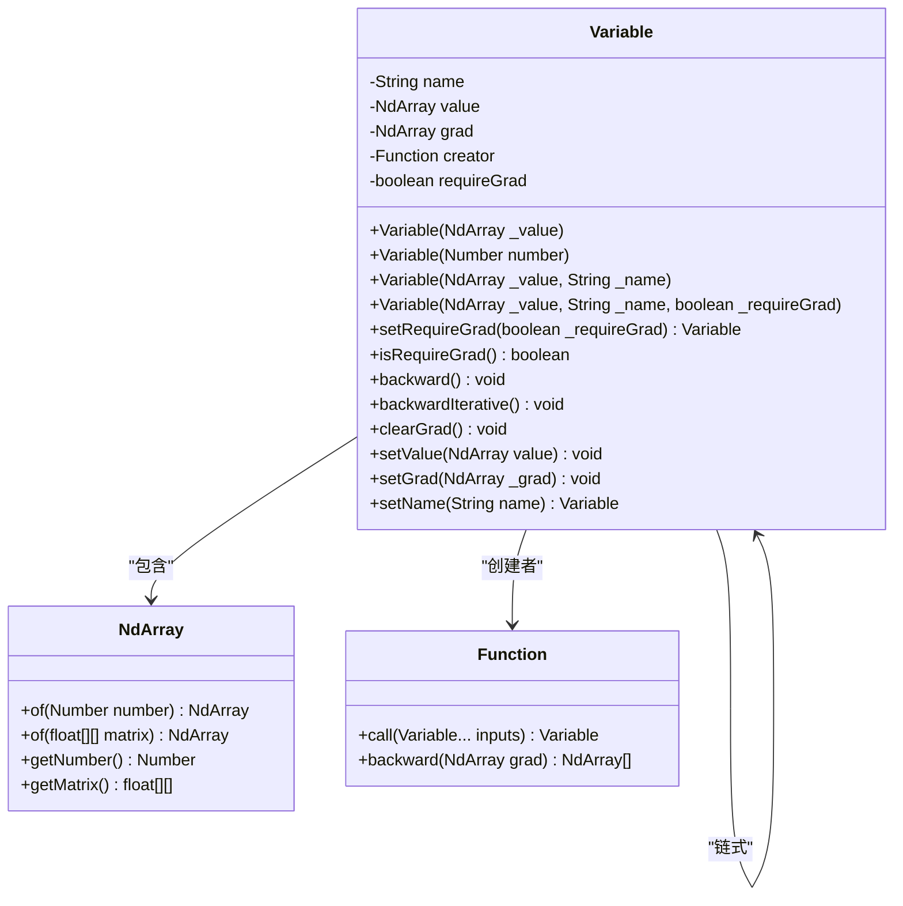
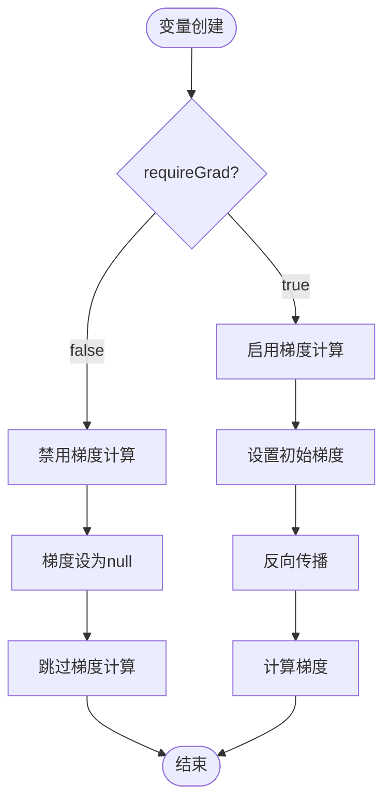

# 变量构造方法

<cite>
**本文档中引用的文件**
- [Variable.java](file://tinyai-deeplearning-func/src/main/java/io/leavesfly/tinyai/func/Variable.java) - *新增变量构造方法的详细文档*
- [VariableTest.java](file://tinyai-deeplearning-func/src/test/java/io/leavesfly/tinyai/func/VariableTest.java) - *包含构造函数的单元测试*
- [LineExam.java](file://tinyai-deeplearning-case/src/main/java/io/leavesfly/tinyai/example/regress/LineExam.java) - *线性回归示例中变量创建*
- [MlpSinExam.java](file://tinyai-deeplearning-case/src/main/java/io/leavesfly/tinyai/example/regress/MlpSinExam.java) - *MLP正弦回归示例*
- [Function.java](file://tinyai-deeplearning-func/src/main/java/io/leavesfly/tinyai/func/Function.java) - *函数基类定义*
</cite>

## 更新摘要
**变更内容**
- 根据最新代码更新了Variable类的四种构造函数重载形式
- 详细说明了requireGrad参数在自动微分中的作用机制
- 增加了name属性在调试和可视化中的价值说明
- 提供了每种构造方式的代码示例和典型应用场景对比

## 目录
1. [简介](#简介)
2. [Variable类概述](#variable类概述)
3. [四种构造函数重载形式](#四种构造函数重载形式)
4. [构造函数详细分析](#构造函数详细分析)
5. [使用场景对比](#使用场景对比)
6. [实际应用示例](#实际应用示例)
7. [最佳实践建议](#最佳实践建议)
8. [总结](#总结)

## 简介

Variable类是TinyDL深度学习框架中的核心组件，它代表了数学中的变量概念。Variable类不仅包含变量的值（通过NdArray表示），还包含了变量的梯度、生成该变量的函数等信息。它是自动微分系统的核心，负责构建和维护计算图。

本文档将详细介绍Variable类的四种构造函数重载形式，包括它们的使用场景、参数含义以及在实际开发中的最佳实践。

## Variable类概述

Variable类继承自Serializable接口，提供了以下核心功能：

- **变量值管理**：通过NdArray存储变量的实际数值
- **梯度计算**：支持自动微分过程中的梯度计算
- **计算图构建**：记录生成该变量的函数，用于构建计算图
- **命名支持**：提供变量名称，便于调试和可视化
- **梯度控制**：通过requireGrad参数控制是否计算梯度



**图表来源**
- [Variable.java](file://tinyai-deeplearning-func/src/main/java/io/leavesfly/tinyai/func/Variable.java#L20-L109)

## 四种构造函数重载形式

Variable类提供了四种不同的构造函数重载形式，每种都有特定的使用场景和用途：

### 1. 基础NdArray构造函数

```java
public Variable(NdArray _value)
```

这是最基础的构造函数，仅接受一个NdArray类型的值作为参数。

### 2. 基本数值类型构造函数

```java
public Variable(Number number)
```

这个构造函数接受一个Number类型的参数，内部会自动转换为NdArray。

### 3. 带名称的构造函数

```java
public Variable(NdArray _value, String _name)
```

除了变量值外，还接受一个字符串类型的名称参数，用于标识变量。

### 4. 完整配置构造函数

```java
public Variable(NdArray _value, String _name, boolean _requireGrad)
```

这是最完整的构造函数，接受变量值、名称和梯度计算标志三个参数。

**章节来源**
- [Variable.java](file://tinyai-deeplearning-func/src/main/java/io/leavesfly/tinyai/func/Variable.java#L50-L109)

## 构造函数详细分析

### 基础NdArray构造函数

```java
public Variable(NdArray _value) {
    if (Objects.isNull(_value)) {
        throw new RuntimeException("NdArray value is null!");
    }
    this.value = _value;
}
```

**特点**：
- 最简单的构造方式，只提供变量值
- 名称属性默认为null
- requireGrad默认为true
- 适用于临时变量或不需要命名的场景

**使用场景**：
- 中间计算结果
- 不需要调试信息的变量
- 性能敏感的场景

### 基本数值类型构造函数

```java
public Variable(Number number) {
    if (Objects.isNull(number)) {
        throw new RuntimeException("NdArray number is null!");
    }
    this.value = NdArray.of(number);
}
```

**特点**：
- 接受基本数值类型（Integer, Float, Double等）
- 内部自动转换为单元素NdArray
- 其他属性默认值同基础构造函数

**使用场景**：
- 常量定义
- 简单标量运算
- 参数初始化

### 带名称的构造函数

```java
public Variable(NdArray _value, String _name) {
    if (Objects.isNull(_value)) {
        throw new RuntimeException("NdArray _value is null!");
    }
    this.value = _value;
    this.name = _name;
}
```

**特点**：
- 提供变量名称，便于调试和可视化
- requireGrad默认为true
- 适合需要跟踪的变量

**使用场景**：
- 模型参数
- 输入输出变量
- 需要调试的中间变量

### 完整配置构造函数

```java
public Variable(NdArray _value, String _name, boolean _requireGrad) {
    if (Objects.isNull(_value)) {
        throw new RuntimeException("NdArray _value is null!");
    }
    this.value = _value;
    this.name = _name;
    this.requireGrad = _requireGrad;
}
```

**特点**：
- 完全控制变量的所有属性
- 可以禁用梯度计算
- 适合特殊需求的变量

**使用场景**：
- 输入数据变量（通常不需要梯度）
- 特殊用途的中间变量
- 性能优化场景

**章节来源**
- [Variable.java](file://tinyai-deeplearning-func/src/main/java/io/leavesfly/tinyai/func/Variable.java#L50-L109)

## 使用场景对比

| 构造方式 | 适用场景 | 性能影响 | 调试便利性 | 内存占用 |
|---------|---------|---------|-----------|---------|
| 基础NdArray | 临时变量、中间计算 | 最优 | 较低 | 最小 |
| 基本数值类型 | 常量、简单标量 | 最优 | 较低 | 最小 |
| 带名称 | 模型参数、调试变量 | 中等 | 高 | 中等 |
| 完整配置 | 特殊用途、性能优化 | 中等 | 最高 | 中等 |

### requireGrad参数的作用机制

requireGrad参数控制变量在反向传播过程中的梯度计算行为：



**图表来源**
- [Variable.java](file://tinyai-deeplearning-func/src/main/java/io/leavesfly/tinyai/func/Variable.java#L111-L130)

当requireGrad为false时，变量的梯度会被设置为null，这样可以节省内存并提高计算效率。

### name属性的价值

name属性在调试和可视化计算图时具有重要价值：

1. **调试便利性**：在错误信息中显示变量名称
2. **可视化支持**：在计算图可视化中显示变量标识
3. **代码可读性**：使代码更具描述性
4. **性能分析**：帮助识别性能瓶颈的变量

**章节来源**
- [Variable.java](file://tinyai-deeplearning-func/src/main/java/io/leavesfly/tinyai/func/Variable.java#L111-L130)
- [VariableTest.java](file://tinyai-deeplearning-func/src/test/java/io/leavesfly/tinyai/func/VariableTest.java#L47-L88)

## 实际应用示例

### 示例1：线性回归模型参数初始化

```java
// 模型参数，需要梯度计算
Variable w = new Variable(NdArray.of(0), "weight");
Variable b = new Variable(NdArray.of(0), "bias");

// 输入数据，不需要梯度计算
Variable variableX = new Variable(NdArray.of(x), "input", false).transpose();
Variable variableY = new Variable(NdArray.of(y), "target", false).transpose();
```

### 示例2：神经网络训练中的变量创建

```java
// 数据批次处理
Variable variableX = batches.get(0).toVariableX().setName("x").setRequireGrad(false);
Variable variableY = batches.get(0).toVariableY().setName("y").setRequireGrad(false);

// 模型预测
Variable predictY = model.forward(variableX);
Variable loss = lossFunc.loss(variableY, predictY);
```

### 示例3：简单数学运算

```java
// 创建标量变量
Variable constant = new Variable(3.14f);  // 使用Number构造函数
Variable value = new Variable(NdArray.of(2.71f));  // 使用NdArray构造函数

// 进行数学运算
Variable result = constant.mul(value).add(new Variable(1.0f));
```

### 示例4：复杂网络结构

```java
// 多层感知机示例
Block block = new MlpBlock("MlpBlock", batchSize, 
    Config.ActiveFunc.Sigmoid, 1, 10, 1);

// 变量创建和链式调用
Variable input = new Variable(inputData).setName("input");
Variable hidden = block.forward(input).setName("hidden");
Variable output = block.forward(hidden).setName("output");
```

**章节来源**
- [LineExam.java](file://tinyai-deeplearning-case/src/main/java/io/leavesfly/tinyai/example/regress/LineExam.java#L40-L44)
- [MlpSinExam.java](file://tinyai-deeplearning-case/src/main/java/io/leavesfly/tinyai/example/regress/MlpSinExam.java#L40-L45)

## 最佳实践建议

### 1. 构造函数选择原则

- **临时变量**：使用基础NdArray构造函数
- **常量定义**：使用Number构造函数
- **模型参数**：使用带名称的构造函数
- **特殊需求**：使用完整配置构造函数

### 2. requireGrad设置策略

```java
// 输入数据通常不需要梯度
Variable input = new Variable(data, "input", false);

// 模型参数需要梯度
Variable weight = new Variable(initialWeights, "weight", true);

// 中间计算结果根据需要设置
Variable intermediate = new Variable(computedValue, "intermediate", false);
```

### 3. name属性使用规范

```java
// 使用有意义的名称
Variable loss = new Variable(lossValue, "loss_function");
Variable gradient = new Variable(gradValue, "gradient_wrt_weight");

// 避免使用无意义的名称
Variable temp = new Variable(tempValue, "temp");  // 不推荐
```

### 4. 性能优化建议

- 在推理阶段禁用不需要梯度的变量
- 及时清理不需要的梯度
- 合理使用不同构造函数减少不必要的开销

### 5. 错误处理

```java
try {
    Variable var = new Variable(null);  // 会抛出RuntimeException
} catch (RuntimeException e) {
    System.err.println("变量创建失败: " + e.getMessage());
}
```

## 总结

Variable类的四种构造函数重载形式各有其特定的使用场景和优势：

1. **基础NdArray构造函数**：适用于临时变量和性能敏感场景
2. **基本数值类型构造函数**：适用于常量定义和简单标量运算
3. **带名称的构造函数**：适用于模型参数和需要调试的变量
4. **完整配置构造函数**：适用于特殊需求和性能优化场景

正确理解和使用这些构造函数，结合requireGrad参数和name属性的合理配置，可以显著提升代码的可读性、可维护性和性能表现。在实际开发中，应根据具体场景选择合适的构造方式，并遵循相应的最佳实践建议。

通过深入理解Variable类的构造机制，开发者可以更好地利用TinyDL框架进行深度学习模型的开发和优化，构建更加高效和可靠的机器学习应用。