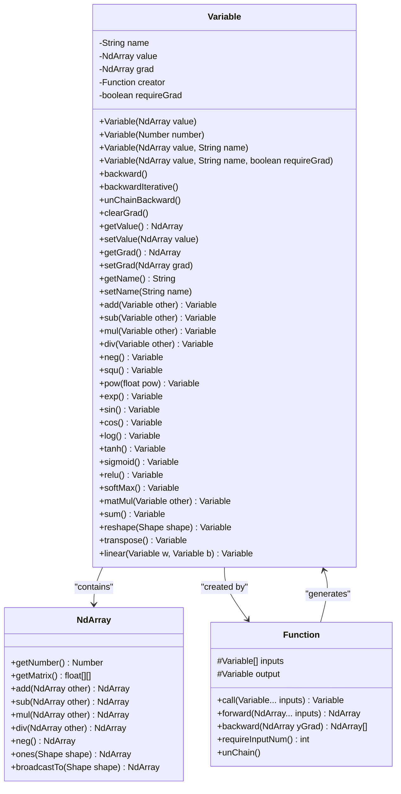
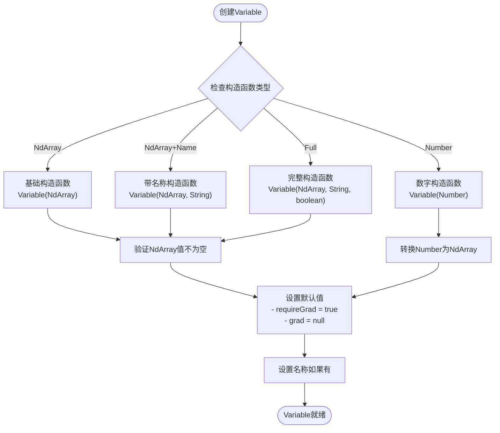
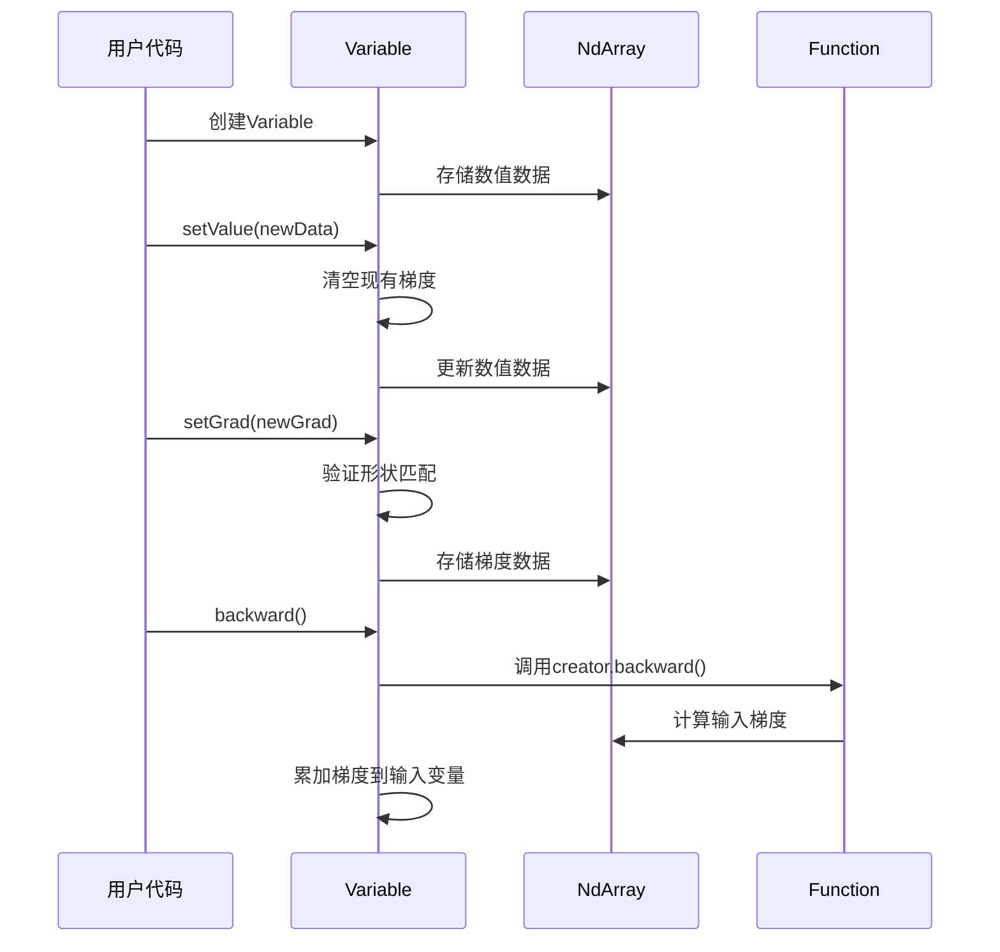
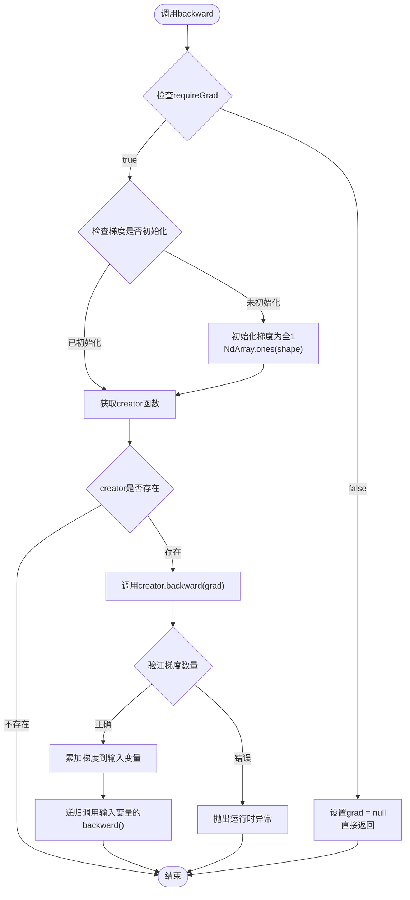
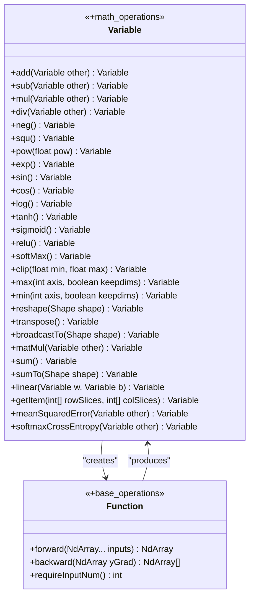
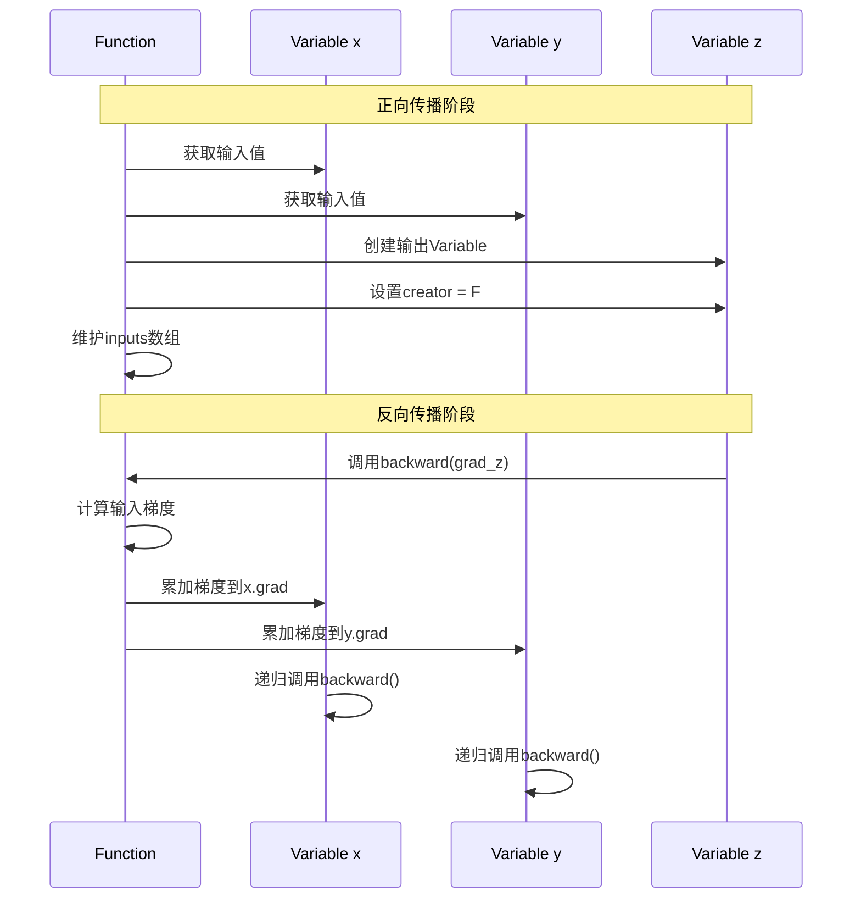

# 变量系统API文档

<cite>
**本文档中引用的文件**
- [Variable.java](file://tinyai-dl-func/src/main/java/io/leavesfly/tinyai/func/Variable.java)
- [Function.java](file://tinyai-dl-func/src/main/java/io/leavesfly/tinyai/func/Function.java)
- [Add.java](file://tinyai-dl-func/src/main/java/io/leavesfly/tinyai/func/base/Add.java)
- [Neg.java](file://tinyai-dl-func/src/main/java/io/leavesfly/tinyai/func/base/Neg.java)
- [VariableTest.java](file://tinyai-dl-func/src/test/java/io/leavesfly/tinyai/func/VariableTest.java)
- [BaseOperationsTest.java](file://tinyai-dl-func/src/test/java/io/leavesfly/tinyai/func/base/BaseOperationsTest.java)
</cite>

## 目录
1. [简介](#简介)
2. [Variable类概述](#variable类概述)
3. [构造函数详解](#构造函数详解)
4. [核心属性和方法](#核心属性和方法)
5. [自动微分机制](#自动微分机制)
6. [数学运算符重载](#数学运算符重载)
7. [计算图构建](#计算图构建)
8. [使用示例](#使用示例)
9. [性能优化](#性能优化)
10. [故障排除](#故障排除)

## 简介

Variable类是TinyDL深度学习框架中计算图的核心节点，它封装了NdArray数值数据并支持自动微分功能。Variable类不仅存储变量的值，还维护变量的梯度信息、生成该变量的函数引用以及是否需要计算梯度的标志位。通过Variable类，开发者可以轻松构建复杂的计算图并实现自动微分。

## Variable类概述

Variable类是数学变量的抽象表示，在TinyDL框架中扮演着关键角色。它继承自Serializable接口，支持序列化操作，使得模型可以在不同环境中进行持久化和传输。



**图表来源**
- [Variable.java](file://tinyai-dl-func/src/main/java/io/leavesfly/tinyai/func/Variable.java#L1-L654)
- [Function.java](file://tinyai-dl-func/src/main/java/io/leavesfly/tinyai/func/Function.java#L1-L152)

**章节来源**
- [Variable.java](file://tinyai-dl-func/src/main/java/io/leavesfly/tinyai/func/Variable.java#L1-L50)

## 构造函数详解

Variable类提供了四种不同的构造函数重载形式，每种都有特定的使用场景：

### 1. 基础构造函数

```java
public Variable(NdArray _value)
```

这是最基础的构造函数，仅接受一个NdArray类型的值。当不需要额外信息时使用。

**特点：**
- 必须提供有效的NdArray值
- 默认requireGrad为true
- 没有名称标识

### 2. 数字构造函数

```java
public Variable(Number number)
```

接受一个Number类型参数，内部会自动转换为NdArray。

**特点：**
- 方便创建标量变量
- 自动转换为NdArray
- 默认配置

### 3. 带名称的构造函数

```java
public Variable(NdArray _value, String _name)
```

除了基本值外，还接受一个字符串名称，便于调试和可视化。

**特点：**
- 提供变量标识
- 便于调试
- 默认requireGrad为true

### 4. 完整构造函数

```java
public Variable(NdArray _value, String _name, boolean _requireGrad)
```

这是最灵活的构造函数，允许完全控制变量的各个方面。

**特点：**
- 完全自定义配置
- 明确指定梯度需求
- 最佳性能控制



**图表来源**
- [Variable.java](file://tinyai-dl-func/src/main/java/io/leavesfly/tinyai/func/Variable.java#L58-L95)

**章节来源**
- [Variable.java](file://tinyai-dl-func/src/main/java/io/leavesfly/tinyai/func/Variable.java#L58-L95)
- [VariableTest.java](file://tinyai-dl-func/src/test/java/io/leavesfly/tinyai/func/VariableTest.java#L30-L88)

## 核心属性和方法

### 数值访问方法

#### getValue()

获取变量的当前值，返回底层的NdArray对象。

```java
public NdArray getValue()
```

**用途：**
- 获取变量的实际数值
- 进行数值比较
- 数据可视化

#### setValue()

设置变量的新值，替换原有的NdArray。

```java
public void setValue(NdArray value)
```

**注意事项：**
- 会清空现有的梯度信息
- 影响后续的反向传播计算

### 梯度管理方法

#### getGrad()

获取变量的梯度值，返回底层的NdArray对象。

```java
public NdArray getGrad()
```

**返回值：**
- 如果变量不需要梯度计算，返回null
- 否则返回存储的梯度NdArray

#### setGrad()

设置变量的梯度值，支持形状验证。

```java
public void setGrad(NdArray _grad)
```

**验证规则：**
- 梯度形状必须与变量值形状匹配
- requireGrad为false时，梯度会被强制设置为null
- 支持null值输入（无操作）

#### clearGrad()

清理变量的梯度信息，释放内存。

```java
public void clearGrad()
```

**用途：**
- 每次训练迭代前重置梯度
- 防止梯度累积错误

### 梯度需求控制

#### setRequireGrad()

设置变量是否需要计算梯度。

```java
public Variable setRequireGrad(boolean _requireGrad)
```

**影响：**
- 控制反向传播时是否计算梯度
- 影响内存使用和计算性能
- 返回this以支持链式调用

#### isRequireGrad()

查询变量的梯度需求状态。

```java
public boolean isRequireGrad()
```

**注意：** Variable类本身没有这个方法，但可以通过构造函数参数推断。



**图表来源**
- [Variable.java](file://tinyai-dl-func/src/main/java/io/leavesfly/tinyai/func/Variable.java#L200-L250)

**章节来源**
- [Variable.java](file://tinyai-dl-func/src/main/java/io/leavesfly/tinyai/func/Variable.java#L200-L280)
- [VariableTest.java](file://tinyai-dl-func/src/test/java/io/leavesfly/tinyai/func/VariableTest.java#L86-L132)

## 自动微分机制

Variable类的核心功能是支持自动微分，通过backward()方法实现反向传播计算。

### backward()方法实现

```java
public void backward()
```

**执行流程：**

1. **梯度需求检查**：如果requireGrad为false，直接返回，不计算梯度
2. **梯度初始化**：如果梯度未初始化，设置为全1的数组
3. **递归计算**：调用creator的backward方法计算输入变量的梯度
4. **梯度累加**：将新计算的梯度累加到现有梯度上，支持梯度复用
5. **递归传播**：对每个输入变量递归调用backward()

### 梯度累加策略

Variable类采用梯度累加而非覆盖的策略，这允许同一个中间变量被多个下游节点使用时正确累加梯度。

```java
// 梯度累加实现
if (input.getGrad() != null) {
    input.setGrad(input.getGrad().add(grads.get(index)));
} else {
    input.setGrad(grads.get(index));
}
```

### 迭代版本的backward()

```java
public void backwardIterative()
```

提供了一个基于栈的迭代版本，避免递归调用可能导致的栈溢出问题，特别适用于深层网络或RNN场景。

### unChainBackward()方法

```java
public void unChainBackward()
```

用于RNN中切断计算图，防止梯度回传过长导致的梯度消失或爆炸问题。



**图表来源**
- [Variable.java](file://tinyai-dl-func/src/main/java/io/leavesfly/tinyai/func/Variable.java#L111-L148)

**章节来源**
- [Variable.java](file://tinyai-dl-func/src/main/java/io/leavesfly/tinyai/func/Variable.java#L111-L180)
- [VariableTest.java](file://tinyai-dl-func/src/test/java/io/leavesfly/tinyai/func/VariableTest.java#L313-L364)

## 数学运算符重载

Variable类提供了丰富的数学运算符重载方法，涵盖了基本算术运算、数学函数、矩阵操作等多个方面。

### 四则运算

#### add(Variable other)

```java
public Variable add(Variable other)
```

执行加法运算，支持广播操作。

#### sub(Variable other)

```java
public Variable sub(Variable other)
```

执行减法运算。

#### mul(Variable other)

```java
public Variable mul(Variable other)
```

执行乘法运算。

#### div(Variable other)

```java
public Variable div(Variable other)
```

执行除法运算。

### 一元操作

#### neg()

```java
public Variable neg()
```

执行取反操作。

#### squ()

```java
public Variable squ()
```

执行平方运算。

#### pow(float pow)

```java
public Variable pow(float pow)
```

执行幂运算。

### 基本数学函数

#### exp()

```java
public Variable exp()
```

执行自然指数运算。

#### sin()

```java
public Variable sin()
```

执行正弦运算。

#### cos()

```java
public Variable cos()
```

执行余弦运算。

#### log()

```java
public Variable log()
```

执行自然对数运算。

#### tanh()

```java
public Variable tanh()
```

执行双曲正切运算。

#### sigmoid()

```java
public Variable sigmoid()
```

执行Sigmoid运算。

#### relu()

```java
public Variable relu()
```

执行ReLU运算。

#### softMax()

```java
public Variable softMax()
```

执行SoftMax运算。

### 张量变形操作

#### reshape(Shape shape)

```java
public Variable reshape(Shape shape)
```

改变变量的形状。

#### transpose()

```java
public Variable transpose()
```

执行转置操作。

#### broadcastTo(Shape shape)

```java
public Variable broadcastTo(Shape shape)
```

将变量广播到指定形状。

#### matMul(Variable other)

```java
public Variable matMul(Variable other)
```

执行矩阵乘法运算。

#### sum()

```java
public Variable sum()
```

对变量的所有元素求和。

#### sumTo(Shape shape)

```java
public Variable sumTo(Shape shape)
```

将变量求和到指定形状。

### 线性变换

#### linear(Variable w, Variable b)

```java
public Variable linear(Variable w, Variable b)
```

执行线性变换 y = xW + b。

### 索引操作

#### getItem(int[] rowSlices, int[] colSlices)

```java
public Variable getItem(int[] rowSlices, int[] colSlices)
```

根据指定的行列索引获取变量的子集。

### 损失函数

#### meanSquaredError(Variable other)

```java
public Variable meanSquaredError(Variable other)
```

计算均方误差损失。

#### softmaxCrossEntropy(Variable other)

```java
public Variable softmaxCrossEntropy(Variable other)
```

计算Softmax交叉熵损失。



**图表来源**
- [Variable.java](file://tinyai-dl-func/src/main/java/io/leavesfly/tinyai/func/Variable.java#L300-L600)

**章节来源**
- [Variable.java](file://tinyai-dl-func/src/main/java/io/leavesfly/tinyai/func/Variable.java#L300-L654)

## 计算图构建

Variable类通过creator属性和Function类协作构建计算图。

### creator属性的作用

```java
private transient Function creator;
```

creator属性指向生成该Variable的Function实例，用于构建计算图。使用transient关键字标记，序列化时不保存，避免循环引用。

### 计算图构建过程

1. **Function.call()方法**：执行前向传播并创建Variable
2. **设置creator**：将Function实例赋值给Variable的creator属性
3. **维护输入关系**：Function维护输入Variable数组
4. **输出Variable**：Function的output属性指向新创建的Variable

### 计算图遍历



**图表来源**
- [Variable.java](file://tinyai-dl-func/src/main/java/io/leavesfly/tinyai/func/Variable.java#L111-L148)
- [Function.java](file://tinyai-dl-func/src/main/java/io/leavesfly/tinyai/func/Function.java#L40-L80)

**章节来源**
- [Variable.java](file://tinyai-dl-func/src/main/java/io/leavesfly/tinyai/func/Variable.java#L30-L50)
- [Function.java](file://tinyai-dl-func/src/main/java/io/leavesfly/tinyai/func/Function.java#L1-L152)

## 使用示例

### 基本变量创建和操作

```java
// 创建标量变量
Variable x = new Variable(NdArray.of(3.0f), "x");
Variable y = new Variable(NdArray.of(2.0f), "y");

// 执行基本运算
Variable z = x.mul(y).add(x); // z = x*y + x

// 计算损失
Variable target = new Variable(NdArray.of(10.0f));
Variable loss = z.meanSquaredError(target);

// 反向传播
loss.backward();

// 查看梯度
System.out.println("x.grad: " + x.getGrad());
System.out.println("y.grad: " + y.getGrad());
```

### 复杂计算图示例

```java
// 创建输入变量
Variable input = new Variable(NdArray.of(new float[][]{{1, 2}, {3, 4}}), "input");
Variable weights = new Variable(NdArray.of(new float[][]{{0.5f, 0.1f}, {0.2f, 0.3f}}), "weights");
Variable bias = new Variable(NdArray.of(new float[]{0.1f, 0.2f}), "bias");

// 构建计算图
Variable linear = input.matMul(weights);
Variable output = linear.add(bias);
Variable activated = output.relu();
Variable loss = activated.sum();

// 反向传播
loss.backward();

// 参数更新（伪代码）
weights.setGrad(weights.getGrad().add(weights.getValue().mul(0.01f))); // L2正则化
```

### 梯度累加示例

```java
// 创建共享变量
Variable shared = new Variable(NdArray.of(2.0f), "shared");

// 构建两个不同的计算路径
Variable path1 = shared.squ(); // path1 = shared^2
Variable path2 = shared.exp(); // path2 = e^shared

// 计算总损失
Variable loss1 = path1.sum();
Variable loss2 = path2.sum();
Variable totalLoss = loss1.add(loss2);

// 反向传播
totalLoss.backward();

// 查看梯度（应该是2*shared + e^shared）
System.out.println("shared.grad: " + shared.getGrad());
```

### RNN计算图截断示例

```java
// 创建RNN变量序列
Variable x0 = new Variable(NdArray.of(1.0f), "x0");
Variable x1 = new Variable(NdArray.of(2.0f), "x1");
Variable x2 = new Variable(NdArray.of(3.0f), "x2");

// 构建RNN计算图
Variable h0 = x0.relu();
Variable h1 = x1.relu().add(h0).relu();
Variable h2 = x2.relu().add(h1).relu();

// 截断计算图（防止梯度爆炸）
h1.unChainBackward();

// 计算损失并反向传播
Variable loss = h2.sum();
loss.backward();
```

**章节来源**
- [VariableTest.java](file://tinyai-dl-func/src/test/java/io/leavesfly/tinyai/func/VariableTest.java#L313-L419)
- [BaseOperationsTest.java](file://tinyai-dl-func/src/test/java/io/leavesfly/tinyai/func/base/BaseOperationsTest.java#L241-L278)

## 性能优化

### 梯度复用和累加

Variable类采用梯度累加策略，允许多个下游节点共享同一个中间变量时正确累加梯度，避免重复计算。

### 迭代版本的backward()

对于深层网络或RNN，建议使用迭代版本的backward()方法：

```java
// 使用迭代版本避免栈溢出
Variable loss = computeComplexNetwork();
loss.backwardIterative();
```

### 内存管理

及时调用clearGrad()方法清理不再需要的梯度信息：

```java
// 每次训练迭代前清理梯度
optimizer.zeroGrad();
```

### requireGrad标志

对于不需要梯度的变量（如输入数据），设置requireGrad为false：

```java
// 输入变量不需要梯度
Variable inputData = new Variable(inputDataNdArray, "input", false);
```

## 故障排除

### 常见错误和解决方案

#### 1. 梯度形状不匹配

**错误信息：** `_grad shape must equal value shape!`

**原因：** 设置梯度时形状与变量值的形状不匹配。

**解决方案：**
```java
// 确保梯度形状与变量值形状一致
NdArray grad = NdArray.zeros(variable.getValue().getShape());
variable.setGrad(grad);
```

#### 2. 反向传播梯度数量错误

**错误信息：** `Variable backward grads size error!`

**原因：** Function的backward方法返回的梯度数量与输入变量数量不匹配。

**解决方案：**
```java
// 确保backward方法返回的梯度列表大小等于输入变量数量
@Override
public List<NdArray> backward(NdArray yGrad) {
    return Arrays.asList(/* 与输入变量数量相同的梯度 */);
}
```

#### 3. 计算图断裂

**症状：** 反向传播时某些变量的梯度为null。

**原因：** 计算图被意外切断。

**解决方案：**
```java
// 确保计算图完整
Variable intermediate = input.relu();
Variable output = intermediate.linear(weights);
output.backward(); // 确保output有creator
```

### 调试技巧

#### 1. 检查变量状态

```java
// 检查变量的基本状态
System.out.println("Value shape: " + variable.getValue().getShape());
System.out.println("Has gradient: " + (variable.getGrad() != null));
System.out.println("Require grad: " + variable.isRequireGrad());
System.out.println("Creator: " + variable.getCreator());
```

#### 2. 可视化计算图

```java
// 递归打印计算图
public void printComputationalGraph(Variable var, String indent) {
    if (var.getCreator() != null) {
        Function creator = var.getCreator();
        System.out.println(indent + "Output: " + var.getName());
        for (Variable input : creator.getInputs()) {
            printComputationalGraph(input, indent + "  ");
        }
    } else {
        System.out.println(indent + "Input: " + var.getName());
    }
}
```

#### 3. 梯度检查

```java
// 检查梯度是否合理
public boolean checkGradients(Variable var) {
    if (var.getGrad() == null) {
        return false;
    }
    float[] gradValues = var.getGrad().getVector();
    for (float val : gradValues) {
        if (Float.isNaN(val) || Float.isInfinite(val)) {
            return false;
        }
    }
    return true;
}
```

**章节来源**
- [Variable.java](file://tinyai-dl-func/src/main/java/io/leavesfly/tinyai/func/Variable.java#L250-L280)
- [VariableTest.java](file://tinyai-dl-func/src/test/java/io/leavesfly/tinyai/func/VariableTest.java#L100-L132)