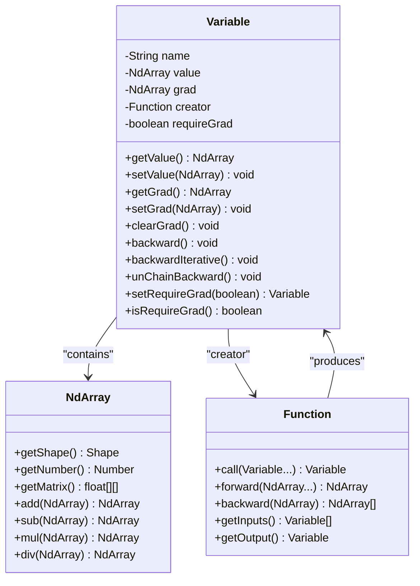
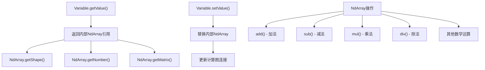
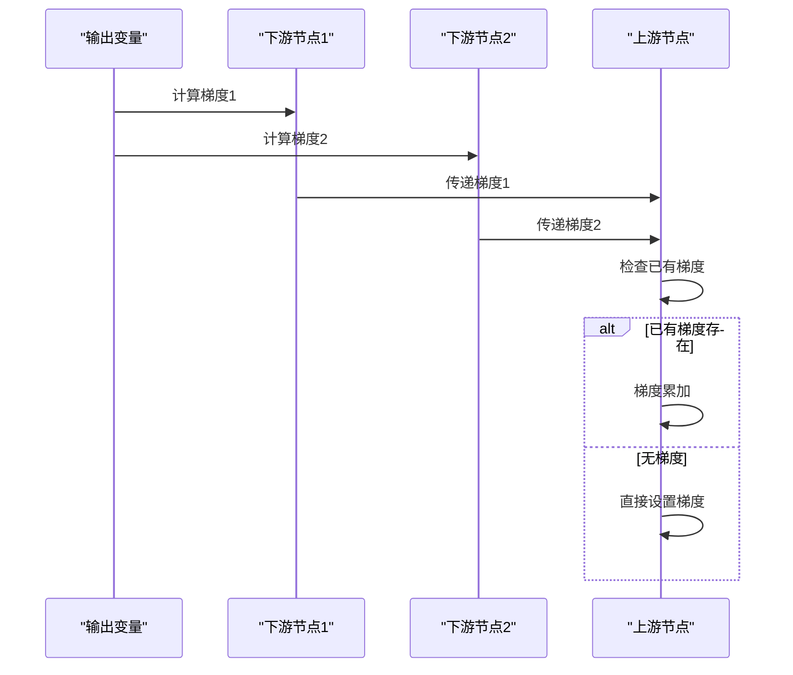
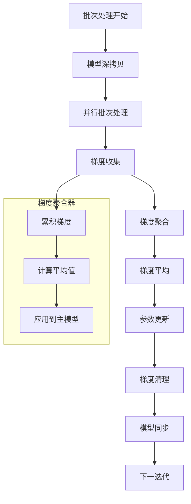

# 数值与梯度管理

<cite>
**本文档中引用的文件**
- [Variable.java](file://tinyai-dl-func/src/main/java/io/leavesfly/tinyai/func/Variable.java)
- [Function.java](file://tinyai-dl-func/src/main/java/io/leavesfly/tinyai/func/Function.java)
- [Add.java](file://tinyai-dl-func/src/main/java/io/leavesfly/tinyai/func/base/Add.java)
- [Neg.java](file://tinyai-dl-func/src/main/java/io/leavesfly/tinyai/func/base/Neg.java)
- [Parameter.java](file://tinyai-dl-nnet/src/main/java/io/leavesfly/tinyai/nnet/Parameter.java)
- [Trainer.java](file://tinyai-dl-ml/src/main/java/io/leavesfly/tinyai/ml/Trainer.java)
- [GradientAggregator.java](file://tinyai-dl-ml/src/main/java/io/leavesfly/tinyai/ml/parallel/GradientAggregator.java)
- [NdArray.java](file://tinyai-dl-ndarr/src/main/java/io/leavesfly/tinyai/ndarr/NdArray.java)
</cite>

## 目录
1. [简介](#简介)
2. [Variable类核心架构](#variable类核心架构)
3. [数值访问与管理机制](#数值访问与管理机制)
4. [梯度生命周期管理](#梯度生命周期管理)
5. [梯度累加策略](#梯度累加策略)
6. [形状一致性校验](#形状一致性校验)
7. [训练循环中的梯度管理](#训练循环中的梯度管理)
8. [实际应用示例](#实际应用示例)
9. [性能考虑](#性能考虑)
10. [故障排除指南](#故障排除指南)
11. [总结](#总结)

## 简介

Variable类是TinyDL深度学习框架中数学变量的抽象表示，它不仅是数值存储的核心容器，更是整个自动微分系统的基础组件。Variable类巧妙地封装了底层NdArray数据操作，提供了统一的数值和梯度管理接口，支持复杂的计算图构建和反向传播机制。

在深度学习训练过程中，数值和梯度的精确管理直接影响模型的收敛性和训练稳定性。Variable类通过精心设计的getter和setter方法，以及完善的梯度生命周期管理机制，确保了数值更新和梯度计算的准确性和高效性。

## Variable类核心架构

Variable类继承自Serializable接口，具备完整的序列化能力，支持模型的持久化存储和传输。该类的核心属性包括：



**图表来源**
- [Variable.java](file://tinyai-dl-func/src/main/java/io/leavesfly/tinyai/func/Variable.java#L18-L50)
- [Function.java](file://tinyai-dl-func/src/main/java/io/leavesfly/tinyai/func/Function.java#L25-L62)

**章节来源**
- [Variable.java](file://tinyai-dl-func/src/main/java/io/leavesfly/tinyai/func/Variable.java#L18-L50)

## 数值访问与管理机制

### getValue和setValue方法的设计原理

Variable类的数值访问通过getValue和setValue方法实现，这两个方法构成了数值管理的核心接口：

```java
public NdArray getValue() {
    return value;
}

public void setValue(NdArray value) {
    this.value = value;
}
```

这种设计遵循了封装原则，通过getter和setter方法控制对内部NdArray对象的访问。getValue方法直接返回内部value字段的引用，这种方式在保证性能的同时也确保了数据的一致性。

### 底层NdArray数据操作的封装

NdArray类提供了丰富的数值操作方法，包括基本的算术运算、矩阵操作和数学函数：



**图表来源**
- [Variable.java](file://tinyai-dl-func/src/main/java/io/leavesfly/tinyai/func/Variable.java#L232-L240)
- [NdArray.java](file://tinyai-dl-ndarr/src/main/java/io/leavesfly/tinyai/ndarr/NdArray.java)

**章节来源**
- [Variable.java](file://tinyai-dl-func/src/main/java/io/leavesfly/tinyai/func/Variable.java#L232-L240)

## 梯度生命周期管理

### getGrad方法的作用机制

getGrad方法提供了对变量梯度的只读访问：

```java
public NdArray getGrad() {
    return grad;
}
```

该方法返回内部grad字段的引用，允许外部代码读取当前变量的梯度值。在反向传播过程中，这个方法会被频繁调用，用于获取输出变量的梯度并传递给上游节点。

### setGrad方法的梯度设置逻辑

setGrad方法实现了复杂的梯度设置逻辑，包含了形状校验和requireGrad标志检查：

```java
public void setGrad(NdArray _grad) {
    if (_grad == null) {
        return;
    }
    if (!_grad.getShape().equals(value.getShape())) {
        throw new RuntimeException("_grad shape must equal value shape!");
    }
    if (requireGrad) {
        this.grad = _grad;
    } else {
        this.grad = null;
    }
}
```

这个方法的设计体现了以下几个关键点：

1. **空值检查**：当传入null梯度时直接返回，避免不必要的操作
2. **形状一致性校验**：确保梯度形状与变量值形状一致
3. **requireGrad标志控制**：根据变量的requireGrad属性决定是否存储梯度

### clearGrad方法的内存管理作用

clearGrad方法负责清理梯度内存：

```java
public void clearGrad() {
    grad = null;
}
```

这个简单的方法在训练循环中扮演着关键角色，它确保每次训练迭代开始时梯度都被正确初始化，避免梯度累积导致的错误。

**章节来源**
- [Variable.java](file://tinyai-dl-func/src/main/java/io/leavesfly/tinyai/func/Variable.java#L242-L260)

## 梯度累加策略

### 梯度累加的实现原理

在反向传播过程中，Variable类采用了梯度累加策略来处理多个下游节点可能产生的梯度：



**图表来源**
- [Variable.java](file://tinyai-dl-func/src/main/java/io/leavesfly/tinyai/func/Variable.java#L130-L145)

### backward方法中的梯度累加实现

在backward方法中，梯度累加的逻辑体现在以下代码段：

```java
// 累加梯度而不是直接设置，支持梯度复用
if (input.getGrad() != null) {
    input.setGrad(input.getGrad().add(grads.get(index)));
} else {
    input.setGrad(grads.get(index));
}
```

这种设计的优势在于：
- **支持复杂计算图**：允许多个分支的梯度最终汇聚到同一个节点
- **避免梯度丢失**：确保所有贡献的梯度都被正确累加
- **提高数值精度**：减少多次赋值可能引入的舍入误差

### 迭代式反向传播中的梯度累加

迭代式反向传播backardIterative方法同样实现了梯度累加：

```java
// 累加梯度而不是直接设置，支持梯度复用
if (input.getGrad() != null) {
    input.setGrad(input.getGrad().add(grad));
} else {
    input.setGrad(grad);
}
```

**章节来源**
- [Variable.java](file://tinyai-dl-func/src/main/java/io/leavesfly/tinyai/func/Variable.java#L130-L145)
- [Variable.java](file://tinyai-dl-func/src/main/java/io/leavesfly/tinyai/func/Variable.java#L170-L185)

## 形状一致性校验

### setGrad方法中的形状校验机制

形状一致性校验是梯度管理中的关键安全机制：

```java
if (!_grad.getShape().equals(value.getShape())) {
    throw new RuntimeException("_grad shape must equal value shape!");
}
```

这个检查确保了梯度和变量值具有相同的形状，这是自动微分正确性的基础保证。

### 形状校验的重要性分析

形状一致性校验的重要性体现在以下几个方面：

1. **数学正确性**：梯度必须与变量值具有相同的形状才能进行有效的数学运算
2. **计算图完整性**：确保计算图中所有节点的形状信息保持一致
3. **错误早期发现**：在梯度设置阶段就捕获形状不匹配的错误

### 广播操作中的形状处理

在Add等支持广播操作的函数中，形状校验需要考虑广播规则：

```java
@Override
public List<NdArray> backward(NdArray yGrad) {
    NdArray gx0 = yGrad;
    NdArray gx1 = x1Shape.equals(x0Shape) ? yGrad : yGrad.sumTo(x1Shape);
    return Arrays.asList(gx0, gx1);
}
```

这里展示了如何在反向传播中处理广播操作产生的形状差异。

**章节来源**
- [Variable.java](file://tinyai-dl-func/src/main/java/io/leavesfly/tinyai/func/Variable.java#L250-L255)
- [Add.java](file://tinyai-dl-func/src/main/java/io/leavesfly/tinyai/func/base/Add.java#L75-L80)

## 训练循环中的梯度管理

### clearGrad在训练循环中的关键作用

在训练循环开始前调用clearGrad方法释放梯度内存：

```java
model.clearGrads();
```

这个调用确保了：
- **梯度重置**：清除上一轮迭代的梯度残留
- **内存释放**：及时释放不再需要的梯度内存
- **训练稳定性**：避免梯度累积导致的数值不稳定

### 并行训练中的梯度管理

在并行训练环境中，梯度管理变得更加复杂：



**图表来源**
- [Trainer.java](file://tinyai-dl-ml/src/main/java/io/leavesfly/tinyai/ml/Trainer.java#L267-L303)
- [GradientAggregator.java](file://tinyai-dl-ml/src/main/java/io/leavesfly/tinyai/ml/parallel/GradientAggregator.java#L15-L37)

### requireGrad标志的动态控制

Variable类支持动态控制是否需要计算梯度：

```java
public Variable setRequireGrad(boolean _requireGrad) {
    this.requireGrad = _requireGrad;
    return this;
}
```

这个功能在以下场景中特别有用：
- **推理模式**：在模型推理时禁用梯度计算以提高性能
- **中间变量**：临时变量不需要梯度信息
- **内存优化**：减少不必要的梯度存储

**章节来源**
- [Variable.java](file://tinyai-dl-func/src/main/java/io/leavesfly/tinyai/func/Variable.java#L100-L105)
- [Trainer.java](file://tinyai-dl-ml/src/main/java/io/leavesfly/tinyai/ml/Trainer.java#L267-L303)

## 实际应用示例

### 基本数值和梯度操作示例

```java
// 创建变量
Variable x = new Variable(NdArray.of(2.0f), "x");
Variable y = new Variable(NdArray.of(3.0f), "y");

// 执行加法运算
Variable z = x.add(y);

// 获取结果值
float result = z.getValue().getNumber().floatValue(); // 结果为5.0

// 获取梯度（初始为null）
NdArray grad = z.getGrad(); // null

// 设置梯度
NdArray gradValue = NdArray.of(1.0f);
z.setGrad(gradValue);

// 清理梯度
z.clearGrad();
```

### 复杂计算图中的梯度管理

```java
// 构建复杂计算图
Variable a = new Variable(NdArray.of(1.0f), "a");
Variable b = new Variable(NdArray.of(2.0f), "b");
Variable c = new Variable(NdArray.of(3.0f), "c");

Variable ab = a.mul(b); // a * b
Variable ac = a.mul(c); // a * c
Variable result = ab.add(ac); // a*b + a*c

// 反向传播
result.backward();

// 获取梯度
NdArray aGrad = a.getGrad(); // 应该是b+c = 5.0
NdArray bGrad = b.getGrad(); // 应该是a = 1.0
NdArray cGrad = c.getGrad(); // 应该是a = 1.0
```

### 训练循环中的完整示例

```java
// 训练循环示例
for (int epoch = 0; epoch < numEpochs; epoch++) {
    float totalLoss = 0.0f;
    
    for (Batch batch : batches) {
        // 准备输入数据
        Variable x = batch.getInput().setName("x").setRequireGrad(false);
        Variable y = batch.getTarget().setName("y").setRequireGrad(false);
        
        // 前向传播
        Variable pred = model.forward(x);
        Variable loss = lossFunction.loss(pred, y);
        
        // 清理梯度
        model.clearGrads();
        
        // 反向传播
        loss.backward();
        
        // 参数更新
        optimizer.update();
        
        // 记录损失
        totalLoss += loss.getValue().getNumber().floatValue();
    }
    
    System.out.println("Epoch " + epoch + " Loss: " + totalLoss / batches.size());
}
```

**章节来源**
- [Variable.java](file://tinyai-dl-func/src/main/java/io/leavesfly/tinyai/func/Variable.java#L232-L281)

## 性能考虑

### 内存管理优化

Variable类的内存管理策略包括：

1. **延迟初始化**：梯度仅在需要时才分配内存
2. **及时清理**：clearGrad方法确保内存及时释放
3. **引用管理**：通过引用而非复制减少内存占用

### 计算效率优化

1. **就地操作**：某些操作支持就地修改以减少内存分配
2. **缓存机制**：Shape信息等常用属性被缓存以提高访问速度
3. **批量处理**：支持批量梯度操作以提高效率

### 并发安全性

在多线程环境中，Variable类通过以下机制保证线程安全：
- **不可变属性**：name和requireGrad等属性的修改是原子的
- **线程局部变量**：在并行训练中使用线程局部的模型副本
- **同步机制**：在梯度聚合等关键操作中使用适当的同步

## 故障排除指南

### 常见错误及解决方案

#### 1. 形状不匹配错误

**错误信息**：`RuntimeException: _grad shape must equal value shape!`

**原因**：梯度形状与变量值形状不匹配

**解决方案**：
```java
// 检查变量和梯度的形状
System.out.println("Variable shape: " + variable.getValue().getShape());
System.out.println("Gradient shape: " + gradient.getShape());

// 如果形状不匹配，使用sumTo进行形状调整
NdArray adjustedGrad = gradient.sumTo(variable.getValue().getShape());
variable.setGrad(adjustedGrad);
```

#### 2. 梯度累积问题

**症状**：训练过程中梯度值异常增大或发散

**原因**：忘记调用clearGrad方法

**解决方案**：
```java
// 在每个训练批次开始前清理梯度
model.clearGrads();

// 或者在更细粒度的级别清理
for (Parameter param : model.getParameters()) {
    param.clearGrad();
}
```

#### 3. 内存泄漏

**症状**：长时间运行后内存使用持续增长

**原因**：梯度未被及时清理

**解决方案**：
```java
// 确保在适当的位置调用clearGrad
try {
    // 训练代码
    loss.backward();
    optimizer.update();
} finally {
    // 必须清理梯度
    model.clearGrads();
}
```

### 调试技巧

1. **启用调试模式**：设置Config.train = true以启用详细的计算图记录
2. **检查形状**：定期打印变量和梯度的形状信息
3. **梯度检查**：使用小规模数据验证梯度计算的正确性
4. **内存监控**：监控内存使用情况以检测潜在的内存泄漏

**章节来源**
- [Variable.java](file://tinyai-dl-func/src/main/java/io/leavesfly/tinyai/func/Variable.java#L250-L255)

## 总结

Variable类的数值和梯度管理机制是TinyDL框架的核心组成部分，它通过精心设计的getter和setter方法，以及完善的生命周期管理，为深度学习训练提供了坚实的基础。

### 关键要点回顾

1. **数值管理**：getValue和setValue方法提供了安全的数值访问接口
2. **梯度管理**：getGrad、setGrad和clearGrad方法实现了完整的梯度生命周期管理
3. **形状校验**：setGrad方法中的形状一致性检查确保了计算的正确性
4. **梯度累加**：支持复杂计算图中的梯度累加策略
5. **内存优化**：clearGrad方法在训练循环中发挥关键作用
6. **并发支持**：在并行训练环境中提供了良好的支持

### 最佳实践建议

1. **始终清理梯度**：在每个训练批次开始前调用clearGrad
2. **检查形状一致性**：在设置梯度前验证形状匹配
3. **合理使用requireGrad**：在推理模式下禁用不需要的梯度计算
4. **监控内存使用**：定期检查内存使用情况以避免泄漏
5. **利用迭代式反向传播**：对于深层网络使用迭代式反向传播以避免栈溢出

通过深入理解Variable类的数值和梯度管理机制，开发者可以更好地利用TinyDL框架构建高效、稳定的深度学习模型，同时避免常见的陷阱和错误。