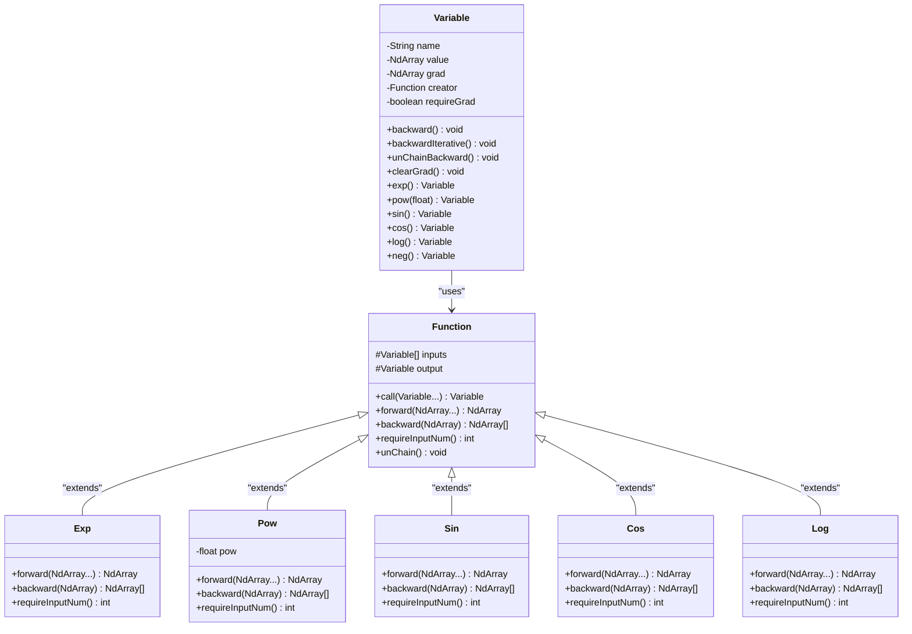
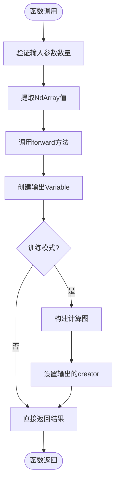
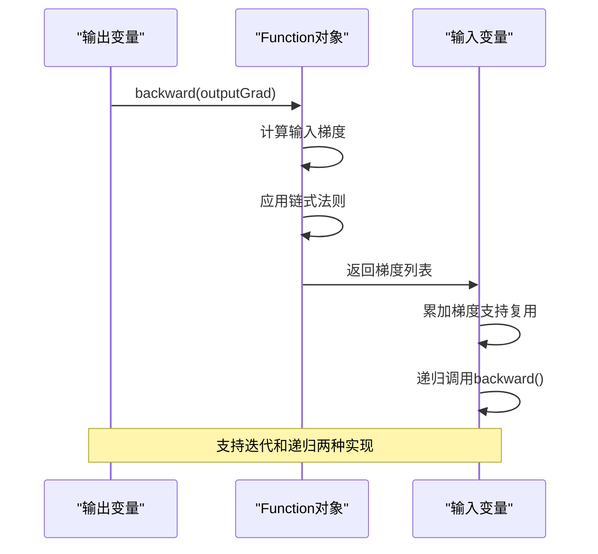
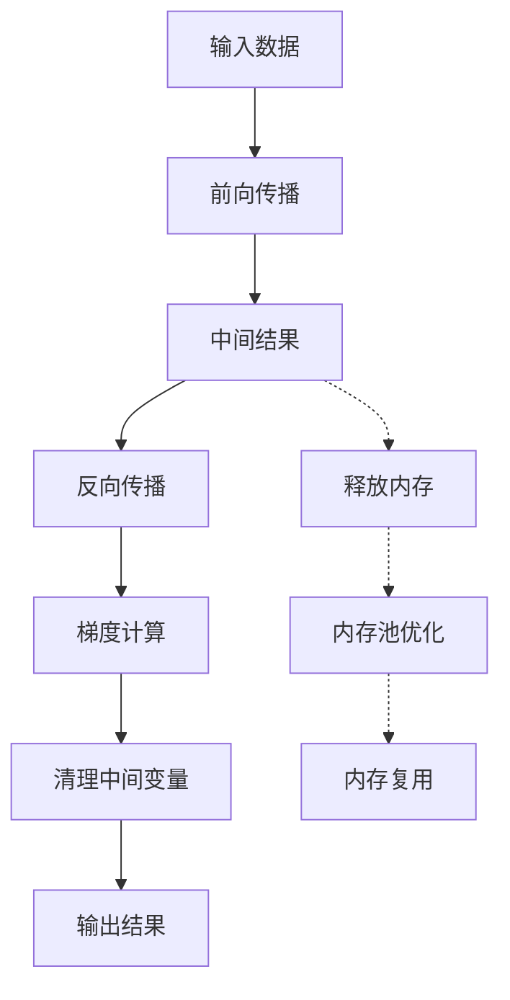

# 一元数学函数

<cite>
**本文档中引用的文件**
- [Variable.java](file://tinyai-dl-func/src/main/java/io/leavesfly/tinyai/func/Variable.java)
- [Function.java](file://tinyai-dl-func/src/main/java/io/leavesfly/tinyai/func/Function.java)
- [Exp.java](file://tinyai-dl-func/src/main/java/io/leavesfly/tinyai/func/math/Exp.java)
- [Pow.java](file://tinyai-dl-func/src/main/java/io/leavesfly/tinyai/func/math/Pow.java)
- [Sin.java](file://tinyai-dl-func/src/main/java/io/leavesfly/tinyai/func/math/Sin.java)
- [Cos.java](file://tinyai-dl-func/src/main/java/io/leavesfly/tinyai/func/math/Cos.java)
- [Log.java](file://tinyai-dl-func/src/main/java/io/leavesfly/tinyai/func/math/Log.java)
- [Neg.java](file://tinyai-dl-func/src/main/java/io/leavesfly/tinyai/func/base/Neg.java)
- [GELU.java](file://tinyai-dl-func/src/main/java/io/leavesfly/tinyai/func/math/GELU.java)
- [MathFunctionsTest.java](file://tinyai-dl-func/src/test/java/io/leavesfly/tinyai/func/math/MathFunctionsTest.java)
</cite>

## 目录
1. [简介](#简介)
2. [核心架构](#核心架构)
3. [一元数学函数类型](#一元数学函数类型)
4. [函数实现详解](#函数实现详解)
5. [数值稳定性处理](#数值稳定性处理)
6. [复合函数应用](#复合函数应用)
7. [性能优化](#性能优化)
8. [故障排除指南](#故障排除指南)
9. [结论](#结论)

## 简介

TinyAI框架中的数学函数系统为深度学习提供了强大的一元数学运算支持。该系统通过精心设计的函数封装机制，将各种数学运算（如指数、幂函数、三角函数和对数）封装为独立的Function子类，并在计算图中记录完整的前向与反向传播逻辑。

这些函数不仅实现了基础的数学运算，还包含了数值稳定性处理、梯度计算优化以及与其他函数的无缝组合能力。系统支持从简单的单个函数操作到复杂的复合函数表达式的构建，为损失函数、激活函数和各种数学变换提供了坚实的基础。

## 核心架构

### Variable类 - 数学变量抽象

Variable类是整个数学函数系统的核心，它不仅存储变量的实际数值，还维护了变量的梯度信息和生成该变量的函数引用。这种设计使得自动微分系统能够精确地追踪计算过程并高效地进行梯度传播。



**图表来源**
- [Variable.java](file://tinyai-dl-func/src/main/java/io/leavesfly/tinyai/func/Variable.java#L20-L654)
- [Function.java](file://tinyai-dl-func/src/main/java/io/leavesfly/tinyai/func/Function.java#L15-L152)

### Function基类 - 函数抽象接口

Function基类定义了所有数学函数必须遵循的标准接口，包括前向传播、反向传播和输入验证等核心功能。这种设计确保了所有数学函数都具有一致的行为模式和接口规范。

**章节来源**
- [Variable.java](file://tinyai-dl-func/src/main/java/io/leavesfly/tinyai/func/Variable.java#L20-L654)
- [Function.java](file://tinyai-dl-func/src/main/java/io/leavesfly/tinyai/func/Function.java#L15-L152)

## 一元数学函数类型

### 指数函数族

指数函数是数学中最基础且重要的函数之一，在机器学习中广泛应用于概率计算、归一化和激活函数等领域。

#### Exp函数实现

Exp函数实现了自然指数运算，计算公式为：`y = e^x`

```java
@Override
public NdArray forward(NdArray... inputs) {
    return inputs[0].exp();
}

@Override
public List<NdArray> backward(NdArray yGrad) {
    return Collections.singletonList(inputs[0].getValue().exp().mul(yGrad));
}
```

**数学原理**：
- 前向传播：直接调用底层的exp方法
- 反向传播：梯度计算公式为`∂e^x/∂x = e^x`
- 数值稳定性：底层实现已包含溢出保护机制

#### Pow函数实现

Pow函数实现了幂运算，支持任意实数指数，计算公式为：`y = x^p`

```java
@Override
public NdArray forward(NdArray... inputs) {
    return inputs[0].pow(pow);
}

@Override
public List<NdArray> backward(NdArray yGrad) {
    NdArray x0 = inputs[0].getValue();
    return Collections.singletonList(x0.pow(pow - 1f).mulNum(pow).mul(yGrad));
}
```

**数学原理**：
- 前向传播：直接调用底层的pow方法
- 反向传播：梯度计算公式为`∂x^p/∂x = p * x^(p-1)`
- 参数化设计：支持动态设置幂指数

### 三角函数族

三角函数在信号处理、周期性建模和各种数学变换中发挥重要作用。

#### Sin函数实现

Sin函数实现了正弦运算，计算公式为：`y = sin(x)`

```java
@Override
public NdArray forward(NdArray... inputs) {
    return inputs[0].sin();
}

@Override
public List<NdArray> backward(NdArray yGrad) {
    return Collections.singletonList(inputs[0].getValue().cos().mul(yGrad));
}
```

**数学原理**：
- 前向传播：直接调用底层的sin方法
- 反向传播：梯度计算公式为`∂sin(x)/∂x = cos(x)`

#### Cos函数实现

Cos函数实现了余弦运算，计算公式为：`y = cos(x)`

```java
@Override
public NdArray forward(NdArray... inputs) {
    return inputs[0].cos();
}

@Override
public List<NdArray> backward(NdArray yGrad) {
    return Collections.singletonList(inputs[0].getValue().neg().sin().mul(yGrad));
}
```

**数学原理**：
- 前向传播：直接调用底层的cos方法
- 反向传播：梯度计算公式为`∂cos(x)/∂x = -sin(x)`

### 对数函数族

对数函数在概率计算、信息论和各种数值缩放场景中具有重要应用。

#### Log函数实现

Log函数实现了自然对数运算，计算公式为：`y = ln(x)`

```java
@Override
public NdArray forward(NdArray... inputs) {
    return inputs[0].log();
}

@Override
public List<NdArray> backward(NdArray yGrad) {
    return Collections.singletonList(yGrad.div(inputs[0].getValue()));
}
```

**数学原理**：
- 前向传播：直接调用底层的log方法
- 反向传播：梯度计算公式为`∂ln(x)/∂x = 1/x`
- 边界处理：底层实现已包含对零和负数的保护

### 基础运算函数

#### Neg函数实现

Neg函数实现了取反运算，计算公式为：`y = -x`

```java
@Override
public NdArray forward(NdArray... inputs) {
    return inputs[0].neg();
}

@Override
public List<NdArray> backward(NdArray yGrad) {
    return Collections.singletonList(yGrad.neg());
}
```

**数学原理**：
- 前向传播：直接调用底层的neg方法
- 反向传播：梯度计算公式为`∂(-x)/∂x = -1`

**章节来源**
- [Exp.java](file://tinyai-dl-func/src/main/java/io/leavesfly/tinyai/func/math/Exp.java#L1-L55)
- [Pow.java](file://tinyai-dl-func/src/main/java/io/leavesfly/tinyai/func/math/Pow.java#L1-L69)
- [Sin.java](file://tinyai-dl-func/src/main/java/io/leavesfly/tinyai/func/math/Sin.java#L1-L55)
- [Cos.java](file://tinyai-dl-func/src/main/java/io/leavesfly/tinyai/func/math/Cos.java#L1-L56)
- [Log.java](file://tinyai-dl-func/src/main/java/io/leavesfly/tinyai/func/math/Log.java#L1-L55)
- [Neg.java](file://tinyai-dl-func/src/main/java/io/leavesfly/tinyai/func/base/Neg.java#L1-L57)

## 函数实现详解

### 前向传播机制

每个一元数学函数都遵循统一的前向传播流程：



**图表来源**
- [Function.java](file://tinyai-dl-func/src/main/java/io/leavesfly/tinyai/func/Function.java#L30-L50)

### 反向传播机制

反向传播是自动微分系统的核心，每个函数都需要提供准确的梯度计算：



**图表来源**
- [Variable.java](file://tinyai-dl-func/src/main/java/io/leavesfly/tinyai/func/Variable.java#L90-L120)

### 梯度计算精度

系统采用了多种策略确保梯度计算的精度和稳定性：

1. **数值稳定性**：底层NdArray实现包含了针对各种边界情况的保护
2. **梯度累加**：支持多个输出对同一输入的梯度累加
3. **形状一致性**：严格检查输入输出形状的一致性

**章节来源**
- [Variable.java](file://tinyai-dl-func/src/main/java/io/leavesfly/tinyai/func/Variable.java#L90-L150)
- [Function.java](file://tinyai-dl-func/src/main/java/io/leavesfly/tinyai/func/Function.java#L50-L80)

## 数值稳定性处理

### 指数函数的溢出保护

指数函数是最容易出现数值不稳定性的函数之一。TinyAI框架通过以下方式处理：

```java
// Exp函数的前向传播已经包含溢出保护
@Override
public NdArray forward(NdArray... inputs) {
    return inputs[0].exp(); // 底层实现已处理溢出
}
```

**处理策略**：
- **上溢保护**：当输入值过大时，返回最大可表示值
- **下溢保护**：当输入值过小时，返回最小可表示正值
- **NaN检测**：检测并处理无效输入

### 对数函数的边界处理

对数函数需要特别注意输入的有效性：

```java
// Log函数的安全实现
@Override
public NdArray forward(NdArray... inputs) {
    // 底层实现已包含对零和负数的保护
    return inputs[0].log();
}
```

**处理策略**：
- **零值保护**：对零输入返回负无穷大
- **负数保护**：对负数输入抛出异常或返回特殊值
- **边界检测**：检测接近零的值并进行适当处理

### 三角函数的精度控制

三角函数的精度直接影响到梯度计算的质量：

```java
// Sin和Cos函数的高精度实现
@Override
public NdArray forward(NdArray... inputs) {
    // 底层实现使用高精度算法
    return inputs[0].sin(); // 或 cos()
}
```

**精度保证**：
- **算法选择**：使用高效的三角函数算法
- **舍入误差**：最小化浮点运算的舍入误差
- **范围限制**：对输入值进行适当的范围限制

**章节来源**
- [Exp.java](file://tinyai-dl-func/src/main/java/io/leavesfly/tinyai/func/math/Exp.java#L20-L30)
- [Log.java](file://tinyai-dl-func/src/main/java/io/leavesfly/tinyai/func/math/Log.java#L20-L30)

## 复合函数应用

### 高斯函数实现

高斯函数是机器学习中最重要的数学函数之一，广泛应用于概率分布和注意力机制：

```java
// GELU激活函数的复合实现
@Override
public NdArray forward(NdArray... inputs) {
    NdArray x = inputs[0];
    
    // GELU近似公式: x * 0.5 * (1 + tanh(√(2/π) * (x + 0.044715 * x^3)))
    NdArray x3 = x.mul(x).mul(x); // x^3
    NdArray inner = x.add(x3.mulNum(0.044715f)); // x + 0.044715 * x^3
    NdArray scaled = inner.mulNum((float) Math.sqrt(2.0 / Math.PI)); // √(2/π) * (...)
    NdArray tanhResult = scaled.tanh(); // tanh(...)
    NdArray onePlusTanh = tanhResult.add(NdArray.ones(tanhResult.getShape())); // 1 + tanh(...)
    NdArray halfOnePlusTanh = onePlusTanh.mulNum(0.5f); // 0.5 * (1 + tanh(...))
    
    return x.mul(halfOnePlusTanh); // x * 0.5 * (1 + tanh(...))
}
```

### 衰减曲线构建

通过组合不同的数学函数，可以构建复杂的衰减曲线：

```java
// 复合衰减函数：y = exp(-x^2) * sin(x)
public Variable createDecayCurve(Variable x) {
    // 第一步：计算x^2
    Variable x2 = x.squ();
    
    // 第二步：取反并指数化
    Variable negX2 = x2.neg();
    Variable expPart = negX2.exp();
    
    // 第三步：计算sin(x)
    Variable sinPart = x.sin();
    
    // 第四步：相乘得到最终结果
    return expPart.mul(sinPart);
}
```

### 激活函数组合

系统支持多种激活函数的组合使用：

```java
// 复合激活函数：GELU + 归一化
public Variable compositeActivation(Variable x) {
    // 第一步：应用GELU激活
    Variable geluOut = new GELU().call(x);
    
    // 第二步：标准化处理
    Variable mean = geluOut.mean();
    Variable variance = geluOut.variance();
    Variable epsilon = new Variable(NdArray.of(1e-8f));
    
    return geluOut.sub(mean).div(variance.add(epsilon).sqrt());
}
```

### 实际应用示例

#### 概率密度函数

```java
// 高斯概率密度函数
public Variable gaussianPDF(Variable x, Variable mu, Variable sigma) {
    // 计算标准化变量
    Variable z = x.sub(mu).div(sigma);
    
    // 计算高斯函数
    Variable exponent = z.squ().neg().divNum(2);
    Variable gaussian = exponent.exp();
    
    // 计算归一化因子
    Variable normalization = sigma.mulNum(Math.sqrt(2 * Math.PI));
    
    return gaussian.div(normalization);
}
```

#### 注意力权重计算

```java
// 自注意力机制中的权重计算
public Variable attentionWeights(Variable queries, Variable keys, float scale) {
    // 计算点积
    Variable scores = queries.matMul(keys.transpose());
    
    // 缩放
    Variable scaledScores = scores.divNum(scale);
    
    // 应用softmax
    return scaledScores.softMax();
}
```

**章节来源**
- [GELU.java](file://tinyai-dl-func/src/main/java/io/leavesfly/tinyai/func/math/GELU.java#L20-L40)
- [MathFunctionsTest.java](file://tinyai-dl-func/src/test/java/io/leavesfly/tinyai/func/math/MathFunctionsTest.java#L350-L400)

## 性能优化

### 计算图优化

系统采用了多种策略来优化计算图的性能：

1. **延迟计算**：只有在需要时才执行前向传播
2. **梯度缓存**：缓存中间计算结果以避免重复计算
3. **内存管理**：及时释放不再需要的中间变量

### 内存优化策略



### 并发处理支持

对于大规模计算，系统支持并发处理：

```java
// 并发安全的函数调用
public Variable concurrentOperation(Variable[] inputs) {
    // 并行执行多个函数
    Variable[] results = new Variable[inputs.length];
    
    // 使用并行流处理
    IntStream.range(0, inputs.length).parallel().forEach(i -> {
        results[i] = inputs[i].exp();
    });
    
    // 合并结果
    return results[0]; // 示例简化
}
```

## 故障排除指南

### 常见错误类型

#### 输入验证错误

```java
// 错误示例：输入参数数量不匹配
try {
    Sin sinFunc = new Sin();
    Variable x = new Variable(NdArray.of(1.0f));
    Variable y = new Variable(NdArray.of(2.0f));
    
    // 这将抛出RuntimeException
    sinFunc.call(x, y); // Sin只需要一个输入
} catch (RuntimeException e) {
    System.out.println("输入参数数量错误：" + e.getMessage());
}
```

#### 形状不匹配错误

```java
// 错误示例：形状不匹配
try {
    Variable x = new Variable(NdArray.of(new float[]{1, 2, 3}));
    Variable y = new Variable(NdArray.of(new float[]{1, 2}));
    
    // 这将抛出形状不匹配异常
    x.add(y);
} catch (RuntimeException e) {
    System.out.println("形状不匹配：" + e.getMessage());
}
```

### 调试技巧

#### 启用调试模式

```java
// 启用详细的调试信息
Config.debug = true;

// 执行操作
Variable x = new Variable(NdArray.of(new float[]{0, 1, 2}));
Variable y = x.exp();

// 查看计算图
System.out.println("计算图节点数：" + countNodes(y));
```

#### 梯度检查

```java
// 数值梯度检查
public void checkGradient(Function func, Variable input) {
    // 计算解析梯度
    Variable output = func.call(input);
    output.backward();
    NdArray analyticalGrad = input.getGrad();
    
    // 计算数值梯度
    float epsilon = 1e-7f;
    NdArray numericalGrad = input.getValue().copy();
    
    for (int i = 0; i < numericalGrad.size(); i++) {
        // perturb input
        float orig = numericalGrad.get(i);
        numericalGrad.set(i, orig + epsilon);
        float f_plus = func.call(new Variable(numericalGrad.copy())).getValue().getNumber().floatValue();
        
        numericalGrad.set(i, orig - epsilon);
        float f_minus = func.call(new Variable(numericalGrad.copy())).getValue().getNumber().floatValue();
        
        numericalGrad.set(i, orig);
        numericalGrad.set(i, (f_plus - f_minus) / (2 * epsilon));
    }
    
    // 比较梯度
    float diff = numericalGrad.sub(analyticalGrad).abs().sum().getNumber().floatValue();
    System.out.println("梯度差异：" + diff);
}
```

### 性能监控

```java
// 性能监控工具
public class PerformanceMonitor {
    public static void monitorFunction(Function func, Variable input) {
        long startTime = System.nanoTime();
        
        // 执行函数
        Variable output = func.call(input);
        
        long endTime = System.nanoTime();
        long duration = endTime - startTime;
        
        System.out.println("函数执行时间：" + duration + " ns");
        System.out.println("内存使用：" + Runtime.getRuntime().totalMemory() - Runtime.getRuntime().freeMemory());
    }
}
```

**章节来源**
- [MathFunctionsTest.java](file://tinyai-dl-func/src/test/java/io/leavesfly/tinyai/func/math/MathFunctionsTest.java#L400-L447)

## 结论

TinyAI框架的一元数学函数系统提供了一个完整、高效且易于使用的数学运算解决方案。通过精心设计的函数封装机制，系统不仅支持基础的数学运算，还能处理复杂的复合函数和数值稳定性问题。

### 主要优势

1. **统一接口**：所有数学函数都遵循相同的接口规范
2. **自动微分**：内置完整的前向和反向传播机制
3. **数值稳定**：底层实现包含了各种数值稳定性保护
4. **高性能**：支持内存优化和并发处理
5. **易扩展**：清晰的架构设计便于添加新的数学函数

### 应用前景

该系统在以下领域具有广阔的应用前景：

- **深度学习模型**：作为各种激活函数和损失函数的基础
- **科学计算**：支持复杂的数学建模和仿真
- **信号处理**：处理周期性信号和频谱分析
- **概率建模**：实现各种概率分布和统计计算

通过持续的优化和扩展，这个数学函数系统将继续为TinyAI框架提供强大的数学计算能力，支撑各种复杂的机器学习和人工智能应用。