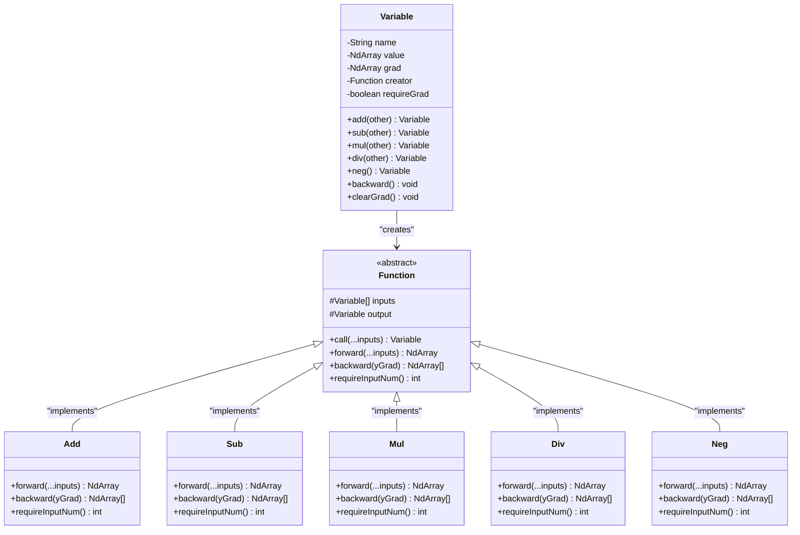

# 四则运算操作

<cite>
**本文档中引用的文件**
- [Variable.java](file://tinyai-dl-func/src/main/java/io/leavesfly/tinyai/func/Variable.java)
- [Function.java](file://tinyai-dl-func/src/main/java/io/leavesfly/tinyai/func/Function.java)
- [Add.java](file://tinyai-dl-func/src/main/java/io/leavesfly/tinyai/func/base/Add.java)
- [Sub.java](file://tinyai-dl-func/src/main/java/io/leavesfly/tinyai/func/base/Sub.java)
- [Mul.java](file://tinyai-dl-func/src/main/java/io/leavesfly/tinyai/func/base/Mul.java)
- [Div.java](file://tinyai-dl-func/src/main/java/io/leavesfly/tinyai/func/base/Div.java)
- [BaseOperationsTest.java](file://tinyai-dl-func/src/test/java/io/leavesfly/tinyai/func/base/BaseOperationsTest.java)
- [LineExam.java](file://tinyai-dl-case/src/main/java/io/leavesfly/tinyai/example/regress/LineExam.java)
</cite>

## 目录
1. [简介](#简介)
2. [架构概览](#架构概览)
3. [核心组件分析](#核心组件分析)
4. [四则运算实现详解](#四则运算实现详解)
5. [自动微分机制](#自动微分机制)
6. [内存管理与形状校验](#内存管理与形状校验)
7. [实际应用示例](#实际应用示例)
8. [性能考虑](#性能考虑)
9. [故障排除指南](#故障排除指南)
10. [结论](#结论)

## 简介

TinyAI框架中的Variable类提供了完整的四则运算操作支持，包括加法（add）、减法（sub）、乘法（mul）、除法（div）和取反（neg）操作。这些运算符通过创建对应的Function子类实例来构建计算图节点，并在前向传播中执行实际计算。本文档将详细解释每个运算符的工作原理、输入输出类型、维度匹配要求以及在自动微分中的梯度计算方式。

## 架构概览

TinyAI的四则运算系统采用了经典的计算图架构，其中Variable类作为计算图的节点，Function类作为计算图的边。



**图表来源**
- [Variable.java](file://tinyai-dl-func/src/main/java/io/leavesfly/tinyai/func/Variable.java#L1-L654)
- [Function.java](file://tinyai-dl-func/src/main/java/io/leavesfly/tinyai/func/Function.java#L1-L152)

## 核心组件分析

### Variable类设计

Variable类是整个计算图系统的核心，它不仅包含变量的值（NdArray），还包含变量的梯度、生成该变量的函数等信息。

```java
public class Variable implements Serializable {
    private String name;              // 变量名称，用于调试和可视化
    private NdArray value;            // 变量的实际数值
    private NdArray grad;             // 反向传播计算得到的梯度值
    private transient Function creator; // 生成该变量的函数
    private boolean requireGrad = true; // 是否需要计算梯度
}
```

### Function基类

Function类定义了所有数学函数操作的抽象接口，负责构建计算图和执行前向传播。

```java
public abstract class Function {
    protected Variable[] inputs;    // 输入变量数组
    protected Variable output;      // 输出变量
    
    public Variable call(Variable... _inputs) {
        // 输入验证
        if (_inputs.length != requireInputNum() && requireInputNum() > 0) {
            throw new RuntimeException("Function call inputs Variable requireInputNum error!");
        }
        
        // 提取NdArray值
        NdArray[] ndArrayInputs = Arrays.stream(_inputs)
                .filter(Objects::nonNull)
                .map(Variable::getValue)
                .toArray(NdArray[]::new);
        
        // 执行前向传播
        NdArray ndArrayOutput = forward(ndArrayInputs);
        
        // 创建输出变量
        Variable _output = new Variable(ndArrayOutput);
        
        // 构建计算图
        if (Config.train) {
            this.inputs = _inputs;
            this.output = _output;
            _output.setCreator(this);
        }
        
        return _output;
    }
}
```

**章节来源**
- [Variable.java](file://tinyai-dl-func/src/main/java/io/leavesfly/tinyai/func/Variable.java#L20-L100)
- [Function.java](file://tinyai-dl-func/src/main/java/io/leavesfly/tinyai/func/Function.java#L20-L80)

## 四则运算实现详解

### 加法运算（Add）

加法运算是最基础的四则运算，支持广播操作以处理不同形状的数组。

```java
public class Add extends Function {
    private Shape x0Shape;
    private Shape x1Shape;
    
    @Override
    public NdArray forward(NdArray... inputs) {
        x0Shape = inputs[0].getShape();
        x1Shape = inputs[1].getShape();
        
        // 检查是否需要广播
        if (x0Shape.equals(x1Shape)) {
            // 形状相同，直接相加
            return inputs[0].add(inputs[1]);
        } else {
            // 需要广播
            if (isBroadcastable(x1Shape, x0Shape)) {
                return inputs[0].add(inputs[1].broadcastTo(x0Shape));
            } else if (isBroadcastable(x0Shape, x1Shape)) {
                return inputs[0].broadcastTo(x1Shape).add(inputs[1]);
            } else {
                throw new IllegalArgumentException(
                    String.format("加法操作的形状不兼容：%s vs %s", x0Shape, x1Shape)
                );
            }
        }
    }
    
    @Override
    public List<NdArray> backward(NdArray yGrad) {
        NdArray gx0 = yGrad;
        NdArray gx1 = x1Shape.equals(x0Shape) ? yGrad : yGrad.sumTo(x1Shape);
        return Arrays.asList(gx0, gx1);
    }
}
```

**广播机制**：当两个输入的形状不同时，系统会自动进行广播以匹配形状。广播规则是从后往前检查维度是否兼容，如果源维度为1则可以广播。

**梯度计算**：对于加法运算，梯度直接传递给两个输入变量，即∂z/∂x = 1，∂z/∂y = 1。

### 减法运算（Sub）

减法运算类似于加法，但梯度符号相反。

```java
public class Sub extends Function {
    @Override
    public NdArray forward(NdArray... inputs) {
        NdArray input0 = inputs[0];
        NdArray input1 = inputs[1];
        
        if (input0.getShape().equals(input1.getShape())) {
            return input0.sub(input1);
        } else {
            // 广播逻辑...
        }
    }
    
    @Override
    public List<NdArray> backward(NdArray yGrad) {
        return Arrays.asList(yGrad, yGrad.neg());
    }
}
```

**梯度计算**：对于 z = x - y，有∂z/∂x = 1，∂z/∂y = -1。

### 乘法运算（Mul）

乘法运算的梯度计算较为复杂，需要使用链式法则。

```java
public class Mul extends Function {
    @Override
    public List<NdArray> backward(NdArray yGrad) {
        NdArray ndArray0 = inputs[0].getValue();
        NdArray ndArray1 = inputs[1].getValue();
        
        return Arrays.asList(yGrad.mul(ndArray1), yGrad.mul(ndArray0));
    }
}
```

**梯度计算**：对于 z = x * y，有∂z/∂x = y，∂z/∂y = x。

### 除法运算（Div）

除法运算的梯度计算最为复杂，涉及到复合函数的链式法则。

```java
public class Div extends Function {
    @Override
    public List<NdArray> backward(NdArray yGrad) {
        NdArray ndArray0 = inputs[0].getValue();
        NdArray ndArray1 = inputs[1].getValue();
        
        return Arrays.asList(yGrad.div(ndArray1), 
                             yGrad.mul(ndArray0.neg().div(ndArray1.square())));
    }
}
```

**梯度计算**：对于 z = x / y，有∂z/∂x = 1/y，∂z/∂y = -x/y²。

### 取反运算（Neg）

取反运算是唯一的一元运算，梯度恒为-1。

```java
public class Neg extends Function {
    @Override
    public List<NdArray> backward(NdArray yGrad) {
        return Arrays.asList(yGrad.neg());
    }
}
```

**章节来源**
- [Add.java](file://tinyai-dl-func/src/main/java/io/leavesfly/tinyai/func/base/Add.java#L1-L116)
- [Sub.java](file://tinyai-dl-func/src/main/java/io/leavesfly/tinyai/func/base/Sub.java#L1-L115)
- [Mul.java](file://tinyai-dl-func/src/main/java/io/leavesfly/tinyai/func/base/Mul.java#L1-L123)
- [Div.java](file://tinyai-dl-func/src/main/java/io/leavesfly/tinyai/func/base/Div.java#L1-L119)

## 自动微分机制

### 前向传播

在前向传播阶段，Variable类的四则运算方法会创建对应的Function子类实例，并调用其call方法：

```java
public Variable add(Variable other) {
    Function function = new Add();
    return function.call(this, other);
}
```

这个过程包括以下步骤：
1. 创建Function实例
2. 调用Function的call方法
3. 执行前向传播计算
4. 构建计算图（如果处于训练模式）

### 反向传播

反向传播通过Variable的backward方法递归执行：

```java
public void backward() {
    if (!requireGrad) {
        this.grad = null;
        return;
    }
    
    // 初始化梯度为1
    if (Objects.isNull(grad)) {
        setGrad(NdArray.ones(this.getValue().getShape()));
    }
    
    Function _creator = creator;
    if (!Objects.isNull(_creator)) {
        Variable[] _inputs = _creator.getInputs();
        List<NdArray> grads = _creator.backward(grad);
        
        int index = 0;
        for (Variable input : _inputs) {
            // 累加梯度而不是直接设置
            if (input.getGrad() != null) {
                input.setGrad(input.getGrad().add(grads.get(index)));
            } else {
                input.setGrad(grads.get(index));
            }
            input.backward();
            index++;
        }
    }
}
```

### 梯度累加机制

系统采用梯度累加而非覆盖的方式，支持梯度复用：

```java
// 累加梯度而不是直接设置
if (input.getGrad() != null) {
    input.setGrad(input.getGrad().add(grads.get(index)));
} else {
    input.setGrad(grads.get(index));
}
```

**章节来源**
- [Variable.java](file://tinyai-dl-func/src/main/java/io/leavesfly/tinyai/func/Variable.java#L300-L400)
- [Function.java](file://tinyai-dl-func/src/main/java/io/leavesfly/tinyai/func/Function.java#L80-L152)

## 内存管理与形状校验

### 形状校验机制

系统在执行四则运算时会严格检查输入的形状兼容性：

```java
private boolean isBroadcastable(Shape srcShape, Shape dstShape) {
    // 支持多维数组的广播判断
    // 从后往前检查维度是否兼容
    if (srcShape.getDimNum() <= dstShape.getDimNum()) {
        boolean compatible = true;
        for (int i = 0; i < srcShape.getDimNum(); i++) {
            int srcDimIndex = srcShape.getDimNum() - 1 - i;
            int dstDimIndex = dstShape.getDimNum() - 1 - i;
            
            int srcDim = srcShape.getDimension(srcDimIndex);
            int dstDim = dstShape.getDimension(dstDimIndex);
            
            // 广播规则：维度相等，或者源维度为1
            if (srcDim != dstDim && srcDim != 1) {
                compatible = false;
                break;
            }
        }
        if (compatible) {
            return true;
        }
    }
    
    return false;
}
```

### 内存管理策略

1. **梯度清零**：每次训练迭代开始前调用clearGrad()方法
2. **计算图切断**：通过unChainBackward()方法防止梯度回传过长
3. **迭代式反向传播**：使用栈结构避免递归调用导致的栈溢出

```java
public void clearGrad() {
    grad = null;
}

public void unChainBackward() {
    Function creatorFunc = creator;
    if (!Objects.isNull(creatorFunc)) {
        Variable[] xs = creatorFunc.getInputs();
        unChain();
        for (Variable x : xs) {
            x.unChainBackward();
        }
    }
}
```

**章节来源**
- [Add.java](file://tinyai-dl-func/src/main/java/io/leavesfly/tinyai/func/base/Add.java#L50-L80)
- [Variable.java](file://tinyai-dl-func/src/main/java/io/leavesfly/tinyai/func/Variable.java#L150-L200)

## 实际应用示例

### 线性模型示例

以下是一个使用四则运算构建线性模型的完整示例：

```java
public class LineExam {
    public static void main(String[] args) {
        // 创建权重和偏置变量
        Variable w = new Variable(NdArray.of(0), "w");
        Variable b = new Variable(NdArray.of(0), "b");
        
        // 准备输入数据
        Variable variableX = new Variable(NdArray.of(x), "x", false).transpose();
        Variable variableY = new Variable(NdArray.of(y), "y", false).transpose();
        
        // 训练循环
        for (int i = 0; i < maxEpoch; i++) {
            // 线性预测：y = wx + b
            Variable predict = variableX.linear(w, b);
            
            // 均方误差损失
            Variable loss = meanSquaError(variableY, predict);
            
            // 清除梯度
            w.clearGrad();
            b.clearGrad();
            
            // 反向传播
            loss.backward();
            
            // 参数更新
            float learningRate = 0.1f;
            w.setValue(w.getValue().sub(w.getGrad().mul(learningRate)));
            b.setValue(b.getValue().sub(b.getGrad().mul(learningRate)));
        }
    }
    
    public static Variable meanSquaError(Variable y, Variable x) {
        return y.sub(x).squ().sum().div(new Variable(y.getValue().getMatrix().length));
    }
}
```

### 简单神经网络层

```java
public class SimpleNeuralLayer {
    private Variable weights;
    private Variable bias;
    
    public Variable forward(Variable input) {
        // 线性变换：output = input * weights + bias
        return input.linear(weights, bias);
    }
    
    public void updateWeights(Optimizer optimizer) {
        // 清除梯度
        weights.clearGrad();
        bias.clearGrad();
        
        // 反向传播
        loss.backward();
        
        // 更新参数
        optimizer.update();
    }
}
```

### 链式运算示例

```java
public class ChainedOperations {
    public static void main(String[] args) {
        Variable a = new Variable(NdArray.of(5.0f), "a");
        Variable b = new Variable(NdArray.of(3.0f), "b");
        
        // 链式运算：(a + b) * (a - b) = a² - b²
        Variable sum = a.add(b);        // a + b
        Variable diff = a.sub(b);       // a - b
        Variable result = sum.mul(diff); // (a + b) * (a - b)
        
        // 计算梯度
        result.backward();
        
        // 验证梯度：d/da[(a+b)(a-b)] = (a-b) + (a+b) = 2a
        // 验证梯度：d/db[(a+b)(a-b)] = (a-b) - (a+b) = -2b
    }
}
```

**章节来源**
- [LineExam.java](file://tinyai-dl-case/src/main/java/io/leavesfly/tinyai/example/regress/LineExam.java#L1-L107)
- [BaseOperationsTest.java](file://tinyai-dl-func/src/test/java/io/leavesfly/tinyai/func/base/BaseOperationsTest.java#L200-L250)

## 性能考虑

### 迭代式反向传播

对于深层网络或RNN等场景，建议使用迭代式的反向传播以避免栈溢出：

```java
public void backwardIterative() {
    if (!requireGrad) {
        this.grad = null;
        return;
    }
    
    // 初始化梯度为1
    if (Objects.isNull(grad)) {
        setGrad(NdArray.ones(this.getValue().getShape()));
    }
    
    // 使用栈来模拟递归过程
    Stack<Variable> stack = new Stack<>();
    stack.push(this);
    
    while (!stack.isEmpty()) {
        Variable currentVar = stack.pop();
        // 处理逻辑...
    }
}
```

### 内存优化策略

1. **及时清理梯度**：在每次训练迭代开始时调用clearGrad()
2. **计算图切断**：在RNN中适当使用unChainBackward()
3. **批量处理**：对于大批量数据使用批处理优化

### 广播优化

系统在执行广播操作时会缓存形状信息，避免重复计算：

```java
private Shape x0Shape;
private Shape x1Shape;

@Override
public NdArray forward(NdArray... inputs) {
    x0Shape = inputs[0].getShape();
    x1Shape = inputs[1].getShape();
    // ... 广播逻辑
}
```

## 故障排除指南

### 常见错误及解决方案

1. **形状不兼容错误**
   ```
   IllegalArgumentException: 加法操作的形状不兼容：[2,3] vs [4,5]
   ```
   **解决方案**：检查输入数组的形状，确保满足广播规则或形状完全匹配。

2. **梯度尺寸错误**
   ```
   RuntimeException: Variable backward grads size error!
   ```
   **解决方案**：检查Function的backward方法返回的梯度列表长度是否与输入变量数量一致。

3. **内存不足**
   ```
   OutOfMemoryError: Java heap space
   ```
   **解决方案**：及时调用clearGrad()清理梯度，或使用迭代式反向传播。

### 调试技巧

1. **启用训练模式**：确保Config.train为true以构建计算图
2. **检查计算图**：使用Uml.getDotGraph()可视化计算图
3. **验证梯度**：通过数值微分验证自动微分的正确性

```java
// 启用训练模式
Config.train = true;

// 可视化计算图
System.out.println(Uml.getDotGraph(loss));

// 验证梯度
Variable numericalGrad = computeNumericalGradient(loss, variable);
Variable analyticalGrad = variable.getGrad();
// 比较两者的差异
```

**章节来源**
- [Variable.java](file://tinyai-dl-func/src/main/java/io/leavesfly/tinyai/func/Variable.java#L100-L150)
- [BaseOperationsTest.java](file://tinyai-dl-func/src/test/java/io/leavesfly/tinyai/func/base/BaseOperationsTest.java#L300-L347)

## 结论

TinyAI框架的四则运算系统提供了完整而高效的数学运算支持，其主要特点包括：

1. **完整的计算图支持**：通过Variable和Function类的协作，实现了完整的前向和反向传播
2. **灵活的广播机制**：支持不同形状数组的自动广播，简化了复杂的数学运算
3. **高效的自动微分**：采用梯度累加机制和迭代式反向传播，确保了计算效率
4. **严格的类型检查**：在编译时和运行时都进行形状和类型检查，保证了程序的健壮性
5. **丰富的应用场景**：从简单的线性模型到复杂的神经网络层，都能很好地支持

通过合理使用这些四则运算操作，开发者可以轻松构建各种机器学习模型，并利用自动微分机制高效地进行参数优化。系统的内存管理和性能优化特性也确保了在大规模应用中的稳定性。