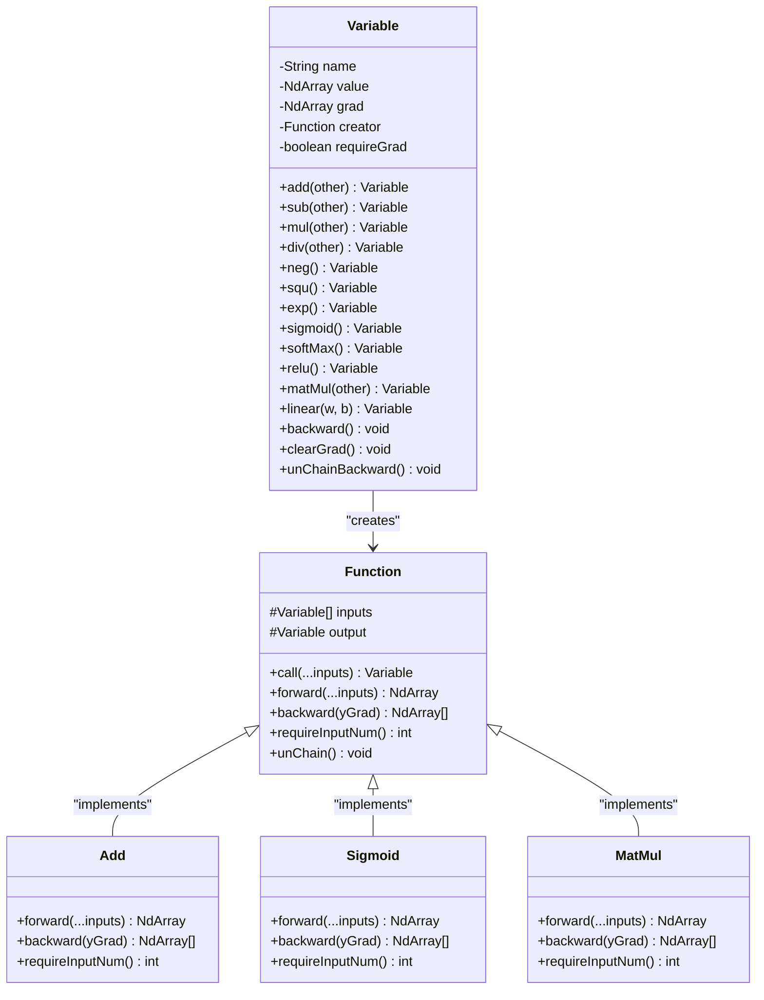
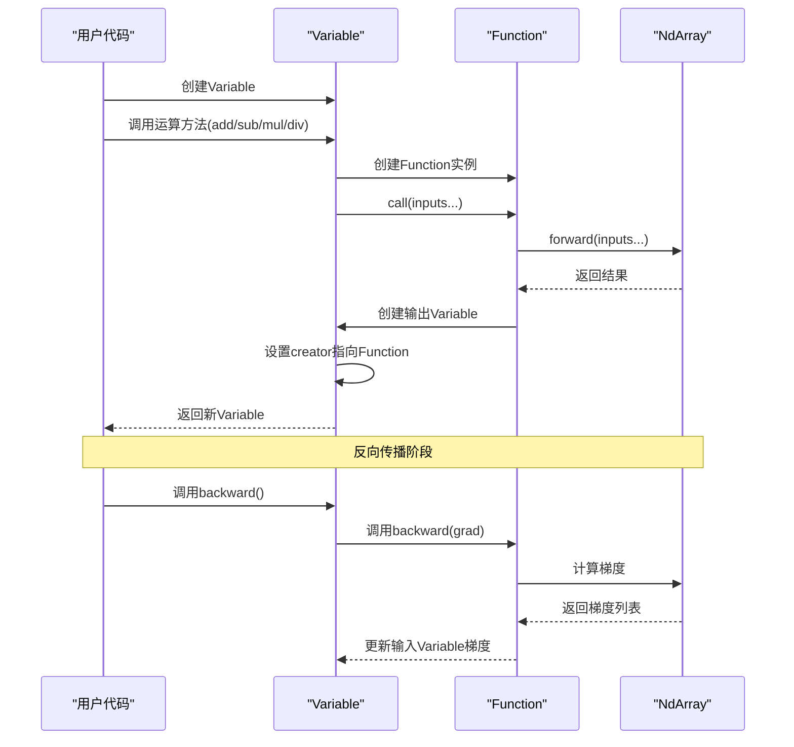

# 数学运算操作

<cite>
**本文档中引用的文件**
- [Variable.java](file://tinyai-deeplearning-func/src/main/java/io/leavesfly/tinyai/func/Variable.java)
- [Function.java](file://tinyai-deeplearning-func/src/main/java/io/leavesfly/tinyai/func/Function.java)
- [Add.java](file://tinyai-deeplearning-func/src/main/java/io/leavesfly/tinyai/func/base/Add.java)
- [Sigmoid.java](file://tinyai-deeplearning-func/src/main/java/io/leavesfly/tinyai/func/math/Sigmoid.java)
- [MatMul.java](file://tinyai-deeplearning-func/src/main/java/io/leavesfly/tinyai/func/matrix/MatMul.java)
- [SoftMax.java](file://tinyai-deeplearning-func/src/main/java/io/leavesfly/tinyai/func/matrix/SoftMax.java)
- [VariableTest.java](file://tinyai-deeplearning-func/src/test/java/io/leavesfly/tinyai/func/VariableTest.java)
- [MathFunctionsTest.java](file://tinyai-deeplearning-func/src/test/java/io/leavesfly/tinyai/func/math/MathFunctionsTest.java)
- [MatrixOperationsTest.java](file://tinyai-deeplearning-func/src/test/java/io/leavesfly/tinyai/func/matrix/MatrixOperationsTest.java)
</cite>

## 目录
1. [简介](#简介)
2. [Variable类架构概述](#variable类架构概述)
3. [四则运算操作](#四则运算操作)
4. [一元数学函数](#一元数学函数)
5. [激活函数实现](#激活函数实现)
6. [矩阵运算操作](#矩阵运算操作)
7. [数据处理操作](#数据处理操作)
8. [计算图构建机制](#计算图构建机制)
9. [实际应用示例](#实际应用示例)
10. [性能优化考虑](#性能优化考虑)
11. [故障排除指南](#故障排除指南)
12. [总结](#总结)

## 简介

TinyAI框架中的数学运算操作是深度学习计算的核心基础设施。通过Variable类和Function类的协同工作，系统提供了完整的自动微分能力，支持各种数学运算、激活函数和矩阵操作。本文档将详细介绍Variable类支持的所有数学运算操作，包括四则运算、一元操作、矩阵运算和数据处理操作的实现原理和使用方法。

## Variable类架构概述

Variable类是TinyAI框架中数学变量的抽象表示，它不仅包含变量的值（NdArray），还包含变量的梯度、生成该变量的函数等信息。Variable是自动微分系统的核心组件，负责构建和维护计算图。



**图表来源**
- [Variable.java](file://tinyai-deeplearning-func/src/main/java/io/leavesfly/tinyai/func/Variable.java#L1-L654)
- [Function.java](file://tinyai-deeplearning-func/src/main/java/io/leavesfly/tinyai/func/Function.java#L1-L152)

**章节来源**
- [Variable.java](file://tinyai-deeplearning-func/src/main/java/io/leavesfly/tinyai/func/Variable.java#L1-L100)
- [Function.java](file://tinyai-deeplearning-func/src/main/java/io/leavesfly/tinyai/func/Function.java#L1-L50)

## 四则运算操作

四则运算操作是Variable类提供的基础数学运算功能，包括加法、减法、乘法和除法。这些操作通过对应的Function类实现，并自动构建计算图。

### 加法运算

加法运算是最常用的数学操作之一，支持广播操作以处理不同形状的变量。

```java
// 基本加法运算
Variable a = new Variable(NdArray.of(new float[][]{{1, 2}, {3, 4}}));
Variable b = new Variable(NdArray.of(new float[][]{{2, 3}, {4, 5}}));
Variable sum = a.add(b); // 结果: [[3, 5], [7, 9]]

// 广播加法
Variable scalar = new Variable(5);
Variable scalarAdd = a.add(scalar); // 结果: [[7, 9], [11, 13]]
```

加法运算的实现特点：
- 自动处理广播操作
- 支持形状不匹配的情况
- 反向传播时梯度直接传递

### 减法运算

减法运算同样支持广播操作，允许不同形状的变量相减。

```java
// 基本减法运算
Variable diff = b.sub(a); // 结果: [[1, 1], [1, 1]]

// 与标量相减
Variable scalarSub = a.sub(scalar); // 结果: [[-3, -1], [1, 3]]
```

### 乘法运算

乘法运算支持逐元素乘法和矩阵乘法。

```java
// 逐元素乘法
Variable mul = a.mul(b); // 结果: [[2, 6], [12, 20]]

// 与标量相乘
Variable scalarMul = a.mul(scalar); // 结果: [[10, 20], [30, 40]]
```

### 除法运算

除法运算支持逐元素除法。

```java
// 逐元素除法
Variable div = b.div(a); // 结果: [[2, 1.5], [4/3, 1.25]]
```

**章节来源**
- [Variable.java](file://tinyai-deeplearning-func/src/main/java/io/leavesfly/tinyai/func/Variable.java#L283-L333)
- [Add.java](file://tinyai-deeplearning-func/src/main/java/io/leavesfly/tinyai/func/base/Add.java#L1-L116)

## 一元数学函数

一元数学函数是对单个变量执行的各种数学运算，包括平方、指数、对数、三角函数等。

### 基本数学函数

```java
// 平方运算
Variable a = new Variable(NdArray.of(new float[][]{{1, 4}, {9, 16}}));
Variable square = a.squ(); // 结果: [[1, 16], [81, 256]]

// 指数运算
Variable exp = a.exp(); // 结果: [[e^1, e^4], [e^9, e^16]]

// 对数运算
Variable log = a.log(); // 结果: [[ln(1), ln(4)], [ln(9), ln(16)]]

// 幂运算
Variable pow = a.pow(2.5f); // 结果: [[1^2.5, 4^2.5], [9^2.5, 16^2.5]]
```

### 三角函数

```java
// 正弦运算
Variable sin = a.sin();

// 余弦运算
Variable cos = a.cos();

// 双曲正切运算
Variable tanh = a.tanh();
```

### 取反操作

```java
// 取反运算
Variable neg = a.neg(); // 结果: [[-1, -4], [-9, -16]]
```

**章节来源**
- [Variable.java](file://tinyai-deeplearning-func/src/main/java/io/leavesfly/tinyai/func/Variable.java#L335-L386)

## 激活函数实现

激活函数是神经网络中的关键组件，用于引入非线性特性。TinyAI框架提供了多种激活函数的实现。

### Sigmoid函数

Sigmoid函数将输入值映射到(0,1)区间，常用于二分类问题的输出层。

```java
// Sigmoid激活函数
Variable input = new Variable(NdArray.of(new float[]{-100, 0, 100}));
Variable sigmoidOutput = input.sigmoid();

// 反向传播时的梯度计算
// ∂sigmoid(x)/∂x = sigmoid(x) * (1 - sigmoid(x))
```

Sigmoid函数的特点：
- 输出范围：(0, 1)
- 导数公式：σ'(x) = σ(x) * (1 - σ(x))
- 易于饱和，可能导致梯度消失

### SoftMax函数

SoftMax函数将输入值转换为概率分布，常用于多分类问题的输出层。

```java
// SoftMax激活函数
Variable logits = new Variable(NdArray.of(new float[][]{{1, 2, 3}, {1, 2, 3}}));
Variable probabilities = logits.softMax();

// 反向传播时的梯度计算
// ∂softmax(x_i)/∂x_j = softmax(x_i) * (δ_ij - softmax(x_j))
```

SoftMax函数的特点：
- 输出范围：(0, 1)
- 所有输出之和为1
- 导数计算相对复杂，涉及矩阵运算

### ReLU函数

ReLU（Rectified Linear Unit）函数将负值置为0，正值保持不变。

```java
// ReLU激活函数
Variable input = new Variable(NdArray.of(new float[][]{{-2, -1}, {0, 1}, {2, 3}}));
Variable reluOutput = input.relu();

// 导数：x > 0时为1，x ≤ 0时为0
```

ReLU函数的特点：
- 计算简单高效
- 缓解梯度消失问题
- 可能导致神经元死亡

### Tanh函数

双曲正切函数将输入值映射到(-1, 1)区间。

```java
// Tanh激活函数
Variable input = new Variable(NdArray.of(new float[]{-100, 0, 100}));
Variable tanhOutput = input.tanh();

// 导数：1 - tanh²(x)
```

**章节来源**
- [Sigmoid.java](file://tinyai-deeplearning-func/src/main/java/io/leavesfly/tinyai/func/math/Sigmoid.java#L1-L58)
- [SoftMax.java](file://tinyai-deeplearning-func/src/main/java/io/leavesfly/tinyai/func/matrix/SoftMax.java#L1-L62)

## 矩阵运算操作

矩阵运算是深度学习中的核心操作，包括矩阵乘法、线性变换、转置等。

### 矩阵乘法

矩阵乘法是神经网络中最常用的运算之一。

```java
// 矩阵乘法
Variable x = new Variable(NdArray.of(new float[][]{{1, 2}, {3, 4}}));
Variable w = new Variable(NdArray.of(new float[][]{{2, 0}, {1, 2}}));
Variable result = x.matMul(w); // 结果: [[4, 4], [10, 8]]

// 反向传播时的梯度计算
// ∂(x*w)/∂x = yGrad * w^T
// ∂(x*w)/∂w = x^T * yGrad
```

矩阵乘法的特点：
- 支持二维矩阵运算
- 反向传播计算复杂度较高
- 需要满足维度兼容性

### 线性变换

线性变换是神经网络中的基本操作，形式为 y = xW + b。

```java
// 线性变换
Variable x = new Variable(NdArray.of(new float[][]{{1, 2}}));
Variable w = new Variable(NdArray.of(new float[][]{{0.1f, 0.2f}, {0.3f, 0.4f}}));
Variable b = new Variable(NdArray.of(new float[]{0.1f, 0.2f}));
Variable linearOutput = x.linear(w, b);
```

### 转置操作

转置操作交换矩阵的行和列。

```java
// 转置操作
Variable a = new Variable(NdArray.of(new float[][]{{1, 2}, {3, 4}}));
Variable transpose = a.transpose(); // 结果: [[1, 3], [2, 4]]
```

### 重塑操作

重塑操作改变变量的形状，但保持元素总数不变。

```java
// 重塑操作
Variable a = new Variable(NdArray.of(new float[][]{{1, 2}, {3, 4}}));
Variable reshaped = a.reshape(Shape.of(4, 1)); // 结果: [[1], [2], [3], [4]]
```

**章节来源**
- [MatMul.java](file://tinyai-deeplearning-func/src/main/java/io/leavesfly/tinyai/func/matrix/MatMul.java#L1-L62)

## 数据处理操作

数据处理操作包括裁剪、最大值、最小值等操作，用于数据预处理和后处理。

### 裁剪操作

裁剪操作将变量的值限制在指定范围内。

```java
// 裁剪操作
Variable input = new Variable(NdArray.of(new float[][]{{-2, -0.5f}, {0, 0.5f}, {1.5f, 2}}));
Variable clipped = input.clip(-1, 1); // 结果: [[-1, -0.5f], [0, 0.5f], [1, 1]]

// 导数：在范围内为1，超出范围为0
```

### 最大值和最小值操作

沿指定轴计算最大值和最小值。

```java
// 最大值操作
Variable input = new Variable(NdArray.of(new float[][]{{1, 3, 2}, {6, 4, 5}}));
Variable maxValues = input.max(1, false); // 结果: [[3], [6]]

// 最小值操作
Variable minValues = input.min(1, false); // 结果: [[1], [4]]
```

### 求和操作

对变量的所有元素求和。

```java
// 求和操作
Variable input = new Variable(NdArray.of(new float[][]{{1, 2, 3}, {4, 5, 6}}));
Variable sum = input.sum(); // 结果: 21
```

**章节来源**
- [Variable.java](file://tinyai-deeplearning-func/src/main/java/io/leavesfly/tinyai/func/Variable.java#L388-L430)

## 计算图构建机制

计算图是自动微分系统的核心概念，Variable类通过Function对象构建计算图节点。



**图表来源**
- [Variable.java](file://tinyai-deeplearning-func/src/main/java/io/leavesfly/tinyai/func/Variable.java#L200-L250)
- [Function.java](file://tinyai-deeplearning-func/src/main/java/io/leavesfly/tinyai/func/Function.java#L30-L80)

### 计算图的工作原理

1. **前向传播**：当调用Variable的运算方法时，系统会创建对应的Function实例，并调用其call方法。
2. **计算图构建**：Function实例会记录输入变量和输出变量的关系，并将自己设置为输出变量的creator。
3. **反向传播**：当调用Variable的backward方法时，系统会沿着计算图反向遍历，计算每个变量的梯度。

### 梯度累积机制

```java
// 梯度累积示例
Variable x = new Variable(NdArray.of(3.0f));
Variable y = new Variable(NdArray.of(2.0f));

Variable x_squared = x.squ(); // x^2
Variable xy = x.mul(y);       // x*y
Variable z = x_squared.add(xy); // z = x^2 + xy

z.backward(); // 执行反向传播

// 梯度累积：dz/dx = 2x + y
assertEquals(2*3 + 2, x.getGrad().getNumber().floatValue(), 1e-6);
```

**章节来源**
- [Variable.java](file://tinyai-deeplearning-func/src/main/java/io/leavesfly/tinyai/func/Variable.java#L150-L200)

## 实际应用示例

### 简单神经网络层

```java
// 简单的全连接层实现
public class SimpleDenseLayer {
    private Variable weights;
    private Variable bias;
    
    public SimpleDenseLayer(int inputSize, int outputSize) {
        // 初始化权重和偏置
        this.weights = new Variable(NdArray.randomNormal(Shape.of(inputSize, outputSize)));
        this.bias = new Variable(NdArray.zeros(Shape.of(outputSize)));
    }
    
    public Variable forward(Variable input) {
        // 线性变换
        Variable linear = input.linear(weights, bias);
        // 应用激活函数
        return linear.relu();
    }
}
```

### 多层感知机

```java
// 多层感知机实现
public class MLP {
    private SimpleDenseLayer hiddenLayer;
    private SimpleDenseLayer outputLayer;
    
    public MLP(int inputSize, int hiddenSize, int outputSize) {
        this.hiddenLayer = new SimpleDenseLayer(inputSize, hiddenSize);
        this.outputLayer = new SimpleDenseLayer(hiddenSize, outputSize);
    }
    
    public Variable forward(Variable input) {
        Variable hidden = hiddenLayer.forward(input);
        return outputLayer.forward(hidden);
    }
    
    public Variable computeLoss(Variable predictions, Variable targets) {
        // 使用均方误差损失
        return predictions.meanSquaredError(targets);
    }
}
```

### 复合运算示例

```java
// 复合运算示例
public class ComplexOperationExample {
    public static void main(String[] args) {
        // 创建输入变量
        Variable x = new Variable(NdArray.of(new float[][]{{1, 2}, {3, 4}}));
        Variable y = new Variable(NdArray.of(new float[][]{{2, 0}, {1, 2}}));
        
        // 构建复杂的计算图
        Variable x_transpose = x.transpose();
        Variable y_transpose = y.transpose();
        
        Variable matmul_result = x_transpose.matMul(y_transpose);
        Variable squared = matmul_result.squ();
        Variable exp = squared.exp();
        Variable softmax = exp.softMax();
        
        // 执行反向传播
        softmax.backward();
        
        // 检查梯度
        assertNotNull(x.getGrad());
        assertNotNull(y.getGrad());
    }
}
```

**章节来源**
- [VariableTest.java](file://tinyai-deeplearning-func/src/test/java/io/leavesfly/tinyai/func/VariableTest.java#L350-L420)

## 性能优化考虑

### 内存管理

1. **梯度清理**：在每次训练迭代开始前调用`clearGrad()`方法清理梯度，避免内存泄漏。
2. **计算图截断**：对于RNN等模型，使用`unChainBackward()`方法截断计算图，防止梯度回传过长。

```java
// 梯度清理示例
public void trainIteration() {
    // 清理所有变量的梯度
    for (Variable var : variables) {
        var.clearGrad();
    }
    
    // 执行前向传播和反向传播
    // ...
    
    // 参数更新
    updateParameters();
}
```

### 迭代式反向传播

对于深层网络，建议使用迭代式反向传播以避免栈溢出：

```java
// 迭代式反向传播
Variable output = computeNetwork(input);
output.backwardIterative(); // 使用迭代方式而非递归
```

### 广播优化

广播操作虽然方便，但在某些情况下可能影响性能。建议：

1. 尽量使用形状匹配的操作
2. 对于重复使用的广播操作，考虑提前进行广播

## 故障排除指南

### 常见错误及解决方案

1. **形状不匹配错误**
```java
// 错误：形状不匹配
Variable a = new Variable(NdArray.of(new float[][]{{1, 2}}));
Variable b = new Variable(NdArray.of(new float[]{1, 2, 3})); // 3个元素
Variable c = a.add(b); // 抛出异常

// 解决方案：使用广播操作
Variable c = a.broadcastTo(Shape.of(1, 3)).add(b);
```

2. **梯度形状不匹配**
```java
// 错误：梯度形状不匹配
Variable x = new Variable(NdArray.of(new float[][]{{1, 2}, {3, 4}}));
Variable y = new Variable(NdArray.of(new float[]{1, 2})); // 2个元素
Variable z = x.add(y); // 梯度形状不匹配

// 解决方案：确保形状匹配或使用广播
Variable z = x.add(y.broadcastTo(Shape.of(2, 2)));
```

3. **计算图截断问题**
```java
// 对于RNN，需要截断计算图
for (int i = 0; i < sequenceLength; i++) {
    Variable output = rnnCell.forward(input, prevHidden);
    // 截断计算图，防止梯度回传过长
    output.unChainBackward();
    prevHidden = output;
}
```

### 调试技巧

1. **检查计算图结构**：通过打印Variable的creator信息来检查计算图结构。
2. **验证梯度**：使用数值微分方法验证自动微分的正确性。
3. **内存监控**：定期检查Variable对象的内存使用情况。

**章节来源**
- [Variable.java](file://tinyai-deeplearning-func/src/main/java/io/leavesfly/tinyai/func/Variable.java#L150-L200)

## 总结

TinyAI框架的数学运算操作提供了完整而强大的功能，涵盖了深度学习中所需的各种数学运算。通过Variable类和Function类的协同工作，系统实现了高效的自动微分机制。

### 主要特点

1. **完整的运算支持**：涵盖四则运算、一元函数、激活函数、矩阵运算和数据处理操作。
2. **自动微分**：通过计算图机制自动生成梯度计算代码。
3. **灵活的广播操作**：支持不同形状变量间的自动广播。
4. **高性能实现**：底层使用高效的NdArray操作，保证计算性能。
5. **易于使用**：提供直观的API设计，简化深度学习模型开发。

### 最佳实践

1. **合理使用计算图**：及时清理不需要的计算图节点，避免内存泄漏。
2. **选择合适的激活函数**：根据任务需求选择适当的激活函数。
3. **注意形状匹配**：在进行矩阵运算时，确保输入变量的形状兼容。
4. **利用广播操作**：适当使用广播操作简化代码，提高可读性。

通过掌握这些数学运算操作，开发者可以构建复杂的深度学习模型，实现各种机器学习算法。TinyAI框架的设计使得这些操作既强大又易用，为深度学习研究和应用提供了坚实的基础。