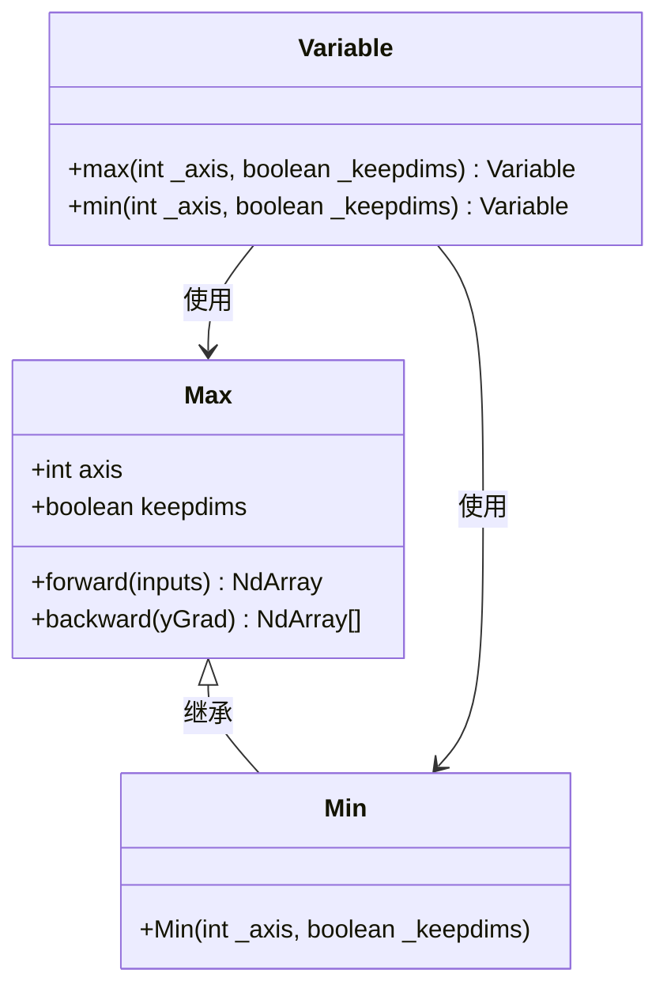

# 数据处理与归约操作

<cite>
**Referenced Files in This Document**   
- [Clip.java](file://tinyai-dl-func/src/main/java/io/leavesfly/tinyai/func/math/Clip.java)
- [Max.java](file://tinyai-dl-func/src/main/java/io/leavesfly/tinyai/func/math/Max.java)
- [Min.java](file://tinyai-dl-func/src/main/java/io/leavesfly/tinyai/func/math/Min.java)
- [Variable.java](file://tinyai-dl-func/src/main/java/io/leavesfly/tinyai/func/Variable.java)
- [NdArrayTest.java](file://tinyai-dl-ndarr/src/test/java/io/leavesfly/tinyai/ndarr/NdArrayTest.java)
</cite>

## 目录
1. [引言](#引言)
2. [裁剪操作（Clip）](#裁剪操作clip)
3. [最大值与最小值归约操作](#最大值与最小值归约操作)
4. [实际应用案例](#实际应用案例)
5. [结论](#结论)

## 引言
Variable类是TinyAI深度学习框架中的核心组件，它不仅封装了数值数据，还支持自动微分和计算图构建。该类提供了丰富的数据处理操作，其中裁剪（clip）、最大值（max）和最小值（min）是三种关键的数学运算。这些操作在深度学习的各个阶段，如数据预处理、模型训练和结果后处理中都扮演着至关重要的角色。本文档将详细阐述这些操作的实现原理、计算逻辑及其在强化学习、特征归一化等场景中的实际应用。

## 裁剪操作（Clip）

Variable类的`clip`方法用于将张量中的每个元素限制在一个指定的范围内，即`[min, max]`。该操作在深度学习中具有双重重要性：一是作为数据预处理手段，确保输入特征的数值稳定性；二是作为梯度裁剪（Gradient Clipping）技术的核心，防止训练过程中出现梯度爆炸问题。

在实现上，`clip`方法通过创建一个`Clip`函数对象并调用其`call`方法来完成。`Clip`函数的前向传播（forward）直接调用底层`NdArray`的`clip`方法，将超出范围的值截断到边界值。例如，对于一个包含`{-5, 0, 2, 8, -2, 10}`的数组，当`min=-1`且`max=5`时，裁剪后的结果为`{-1, 0, 2, 5, -1, 5}`。

其反向传播（backward）逻辑是`clip`操作的关键。梯度计算遵循一个简单的规则：只有当原始输入值位于`[min, max]`区间内时，其梯度才被保留（梯度为1）；对于所有被裁剪的值（即小于`min`或大于`max`的值），其梯度被置为0。这种机制确保了在反向传播过程中，模型参数的更新只受到“有效”数据的影响，从而增强了训练的稳定性。

```mermaid
flowchart TD
A[输入张量] --> B{值在[min,max]内?}
B --> |是| C[梯度=1]
B --> |否| D[梯度=0]
C --> E[输出梯度]
D --> E
```

**Diagram sources**
- [Clip.java](file://tinyai-dl-func/src/main/java/io/leavesfly/tinyai/func/math/Clip.java#L42-L85)

**Section sources**
- [Clip.java](file://tinyai-dl-func/src/main/java/io/leavesfly/tinyai/func/math/Clip.java)
- [Variable.java](file://tinyai-dl-func/src/main/java/io/leavesfly/tinyai/func/Variable.java#L475-L484)
- [NdArrayTest.java](file://tinyai-dl-ndarr/src/test/java/io/leavesfly/tinyai/ndarr/NdArrayTest.java#L555-L568)

## 最大值与最小值归约操作

`max`和`min`操作是沿指定轴进行的归约（reduction）运算，用于计算张量在特定维度上的极值。它们在特征提取、注意力机制和模型输出分析中非常有用。

这两个操作在Variable类中通过`max(int axis, boolean keepdims)`和`min(int axis, boolean keepdims)`方法实现。它们都继承自`Max`基类，构造函数接收两个参数：`_axis`指定进行归约的轴，`_keepdims`则控制输出的维度是否保持。

- **计算逻辑**：前向传播时，操作会遍历指定轴上的所有元素，找出最大值或最小值。例如，对于一个形状为(2,3)的矩阵，沿`axis=1`（行方向）求最大值，会得到一个形状为(2,)的一维数组，其中每个元素是对应行的最大值。
- **keepdims选项的影响**：当`keepdims=true`时，输出张量的维度数与输入保持一致，但被归约的轴长度变为1。这通常通过`broadcastTo`方法实现。例如，对一个(2,3)的矩阵沿`axis=1`求最大值并`keepdims=true`，输出形状为(2,1)。这在需要保持张量形状以进行后续广播运算时非常有用。
- **反向传播**：`max`操作的梯度计算规则是，只有在输入张量中取得最大值的位置，其梯度才被传递（梯度为1），其他位置的梯度为0。`min`操作同理。这确保了梯度只流向对最终结果有贡献的路径。



**Diagram sources**
- [Max.java](file://tinyai-dl-func/src/main/java/io/leavesfly/tinyai/func/math/Max.java)
- [Min.java](file://tinyai-dl-func/src/main/java/io/leavesfly/tinyai/func/math/Min.java)
- [Variable.java](file://tinyai-dl-func/src/main/java/io/leavesfly/tinyai/func/Variable.java)

**Section sources**
- [Max.java](file://tinyai-dl-func/src/main/java/io/leavesfly/tinyai/func/math/Max.java)
- [Min.java](file://tinyai-dl-func/src/main/java/io/leavesfly/tinyai/func/math/Min.java)
- [Variable.java](file://tinyai-dl-func/src/main/java/io/leavesfly/tinyai/func/Variable.java#L495-L512)

## 实际应用案例

### 强化学习中的奖励裁剪
在强化学习中，环境返回的奖励信号可能具有很大的方差，这会导致策略梯度更新不稳定。通过`clip`操作将奖励值限制在一个合理的范围内（如`[-1, 1]`），可以显著提高训练的稳定性。例如，在`CartPoleDQNExample`中，对Q网络的输出进行裁剪，可以防止Q值发散，从而加速收敛。

### 特征归一化预处理
在模型训练前，对输入特征进行归一化是常见的预处理步骤。`max`和`min`操作可以用来计算特征的全局最大值和最小值，进而实现Min-Max归一化。公式为：`(x - min) / (max - min)`。这能将所有特征缩放到[0, 1]区间，消除不同特征间的量纲差异，加快模型收敛速度。

### 模型输出后处理
在分类任务中，模型输出的logits通常需要通过`max`操作来确定最终的预测类别。`argmax`操作（虽然未在文档中直接提及，但与`max`紧密相关）可以找到概率最高的类别索引。此外，在生成模型中，`clip`操作可用于限制生成内容的数值范围，确保输出的合理性。

## 结论
Variable类提供的`clip`、`max`和`min`操作是构建稳定、高效深度学习模型的基石。`clip`操作通过限制数值范围，在梯度裁剪和数据预处理中保障了数值稳定性。`max`和`min`操作作为强大的归约工具，能够沿指定轴提取关键信息，并通过`keepdims`选项灵活控制输出维度。这些操作的正确应用，如在强化学习中裁剪奖励、在预处理中进行特征归一化，能够显著提升模型的训练稳定性和收敛速度。理解这些操作的底层实现和梯度计算逻辑，对于设计和调试复杂的神经网络架构至关重要。