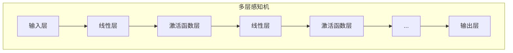
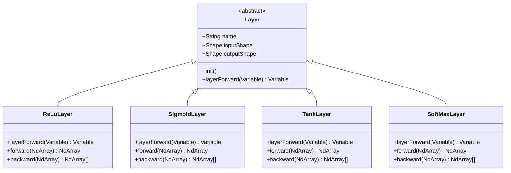

# 激活函数操作

<cite>
**本文档中引用的文件**  
- [Variable.java](file://tinyai-dl-func/src/main/java/io/leavesfly/tinyai/func/Variable.java)
- [ReLu.java](file://tinyai-dl-func/src/main/java/io/leavesfly/tinyai/func/math/ReLu.java)
- [Sigmoid.java](file://tinyai-dl-func/src/main/java/io/leavesfly/tinyai/func/math/Sigmoid.java)
- [Tanh.java](file://tinyai-dl-func/src/main/java/io/leavesfly/tinyai/func/math/Tanh.java)
- [GELU.java](file://tinyai-dl-func/src/main/java/io/leavesfly/tinyai/func/math/GELU.java)
- [SoftMax.java](file://tinyai-dl-func/src/main/java/io/leavesfly/tinyai/func/matrix/SoftMax.java)
- [MlpBlock.java](file://tinyai-dl-nnet/src/main/java/io/leavesfly/tinyai/nnet/block/MlpBlock.java)
- [ReLuLayer.java](file://tinyai-dl-nnet/src/main/java/io/leavesfly/tinyai/nnet/layer/activate/ReLuLayer.java)
- [SigmoidLayer.java](file://tinyai-dl-nnet/src/main/java/io/leavesfly/tinyai/nnet/layer/activate/SigmoidLayer.java)
- [TanhLayer.java](file://tinyai-dl-nnet/src/main/java/io/leavesfly/tinyai/nnet/layer/activate/TanhLayer.java)
- [SoftMaxLayer.java](file://tinyai-dl-nnet/src/main/java/io/leavesfly/tinyai/nnet/layer/activate/SoftMaxLayer.java)
</cite>

## 目录
1. [简介](#简介)
2. [核心激活函数实现](#核心激活函数实现)
3. [前向计算与反向传播机制](#前向计算与反向传播机制)
4. [激活函数在多层感知机中的应用](#激活函数在多层感知机中的应用)
5. [不同激活函数对模型训练的影响对比](#不同激活函数对模型训练的影响对比)
6. [总结](#总结)

## 简介
本项目中的激活函数实现基于`Variable`类和`Function`类构建，构成了深度学习框架的核心非线性变换能力。这些激活函数包括ReLU、Sigmoid、Tanh、GELU和SoftMax，分别用于不同的神经网络层和任务场景。它们通过引入非线性特性，使神经网络能够拟合复杂的函数映射关系。`Variable`类作为自动微分系统的核心，不仅存储数值，还维护计算图以支持梯度反向传播。

## 核心激活函数实现

### ReLU激活函数
ReLU（Rectified Linear Unit）激活函数是最常用的激活函数之一，其数学表达式为：f(x) = max(0, x)。该函数将所有负值置为0，保留正值不变，具有计算简单、缓解梯度消失问题的优点。

**数学特性**：
- 定义域：(-∞, +∞)
- 值域：[0, +∞)
- 非线性且分段线性
- 输出不以零为中心

**典型应用场景**：
- 深度神经网络的隐藏层
- 卷积神经网络（CNN）中的特征提取层
- 需要稀疏激活的场景

### Sigmoid激活函数
Sigmoid激活函数将任意实数映射到(0,1)区间，其数学表达式为：f(x) = 1 / (1 + e^(-x))。该函数输出可解释为概率值。

**数学特性**：
- 定义域：(-∞, +∞)
- 值域：(0, 1)
- 平滑且可导
- 输出以0.5为中心

**典型应用场景**：
- 二分类问题的输出层
- 门控机制（如LSTM中的遗忘门）
- 需要概率输出的场景

### Tanh激活函数
Tanh（双曲正切）激活函数是Sigmoid函数的变体，其数学表达式为：f(x) = (e^x - e^(-x)) / (e^x + e^(-x))。该函数将输入映射到(-1,1)区间。

**数学特性**：
- 定义域：(-∞, +∞)
- 值域：(-1, 1)
- 奇函数，输出以零为中心
- 梯度比Sigmoid更陡峭

**典型应用场景**：
- RNN网络中的隐藏状态更新
- 需要零中心化输出的场景
- 某些生成模型的中间层

### GELU激活函数
GELU（Gaussian Error Linear Unit）激活函数结合了ReLU和Dropout的思想，其数学表达式为：GELU(x) = x * Φ(x)，其中Φ(x)是标准正态分布的累积分布函数。实际实现中使用近似公式：x * 0.5 * (1 + tanh(√(2/π) * (x + 0.044715 * x³)))。

**数学特性**：
- 定义域：(-∞, +∞)
- 值域：(-∞, +∞)
- 平滑且非单调
- 具有随机正则化效果

**典型应用场景**：
- Transformer模型中的前馈网络
- BERT等预训练语言模型
- 需要平滑非线性变换的深度网络

### SoftMax激活函数
SoftMax激活函数用于多分类问题的输出层，其数学表达式为：softmax(x_i) = e^(x_i) / Σ(e^(x_j))。该函数将输入向量转换为概率分布。

**数学特性**：
- 定义域：(-∞, +∞)
- 值域：(0, 1)
- 输出和为1
- 放大最大值，抑制最小值

**典型应用场景**：
- 多分类问题的输出层
- 注意力机制中的权重分配
- 需要概率分布输出的场景

**节来源**
- [ReLu.java](file://tinyai-dl-func/src/main/java/io/leavesfly/tinyai/func/math/ReLu.java#L1-L57)
- [Sigmoid.java](file://tinyai-dl-func/src/main/java/io/leavesfly/tinyai/func/math/Sigmoid.java#L1-L58)
- [Tanh.java](file://tinyai-dl-func/src/main/java/io/leavesfly/tinyai/func/math/Tanh.java#L1-L58)
- [GELU.java](file://tinyai-dl-func/src/main/java/io/leavesfly/tinyai/func/math/GELU.java#L1-L91)
- [SoftMax.java](file://tinyai-dl-func/src/main/java/io/leavesfly/tinyai/func/matrix/SoftMax.java#L1-L62)

## 前向计算与反向传播机制

### 前向计算逻辑
所有激活函数的前向计算都通过`forward`方法实现，该方法接收输入的`NdArray`并返回计算结果。在`Variable`类中，通过调用相应的`Function`子类来执行计算，并维护计算图。

```mermaid
flowchart TD
A[输入变量] --> B{调用激活函数}
B --> C[ReLU: max(0,x)]
B --> D[Sigmoid: 1/(1+e^-x)]
B --> E[Tanh: (e^x-e^-x)/(e^x+e^-x)]
B --> F[GELU: x*Φ(x)]
B --> G[SoftMax: e^x_i/Σe^x_j]
C --> H[输出变量]
D --> H
E --> H
F --> H
G --> H
```

**图来源**
- [Variable.java](file://tinyai-dl-func/src/main/java/io/leavesfly/tinyai/func/Variable.java#L300-L350)
- [ReLu.java](file://tinyai-dl-func/src/main/java/io/leavesfly/tinyai/func/math/ReLu.java#L15-L25)
- [Sigmoid.java](file://tinyai-dl-func/src/main/java/io/leavesfly/tinyai/func/math/Sigmoid.java#L15-L25)

### 反向传播梯度公式
反向传播通过`backward`方法计算梯度，每个激活函数都有特定的梯度计算公式：

#### ReLU梯度
- 当x > 0时，梯度为1
- 当x ≤ 0时，梯度为0
- 实现中使用mask操作高效计算

#### Sigmoid梯度
- ∂sigmoid(x)/∂x = sigmoid(x) * (1 - sigmoid(x))
- 利用前向传播结果避免重复计算

#### Tanh梯度
- ∂tanh(x)/∂x = 1 - tanh(x)²
- 同样利用前向传播结果优化计算

#### GELU梯度
- 使用数值近似计算
- 包含两个主要部分：基础项和修正项
- 计算较为复杂但保持平滑性

#### SoftMax梯度
- ∂softmax(x_i)/∂x_j = softmax(x_i) * (δ_ij - softmax(x_j))
- 使用矩阵运算高效实现

```mermaid
flowchart TD
A[输出梯度] --> B{激活函数类型}
B --> C[ReLU: mask(x>0)]
B --> D[Sigmoid: y*(1-y)]
B --> E[Tanh: 1-y²]
B --> F[GELU: 复杂近似]
B --> G[SoftMax: y*dx - y*sum(dx)]
C --> H[输入梯度]
D --> H
E --> H
F --> H
G --> H
```

**图来源**
- [ReLu.java](file://tinyai-dl-func/src/main/java/io/leavesfly/tinyai/func/math/ReLu.java#L30-L40)
- [Sigmoid.java](file://tinyai-dl-func/src/main/java/io/leavesfly/tinyai/func/math/Sigmoid.java#L30-L45)
- [Tanh.java](file://tinyai-dl-func/src/main/java/io/leavesfly/tinyai/func/math/Tanh.java#L30-L45)
- [GELU.java](file://tinyai-dl-func/src/main/java/io/leavesfly/tinyai/func/math/GELU.java#L50-L80)
- [SoftMax.java](file://tinyai-dl-func/src/main/java/io/leavesfly/tinyai/func/matrix/SoftMax.java#L30-L50)

### 梯度消失/爆炸问题的缓解机制
不同的激活函数对梯度消失/爆炸问题有不同的缓解效果：

- **ReLU**: 有效缓解梯度消失问题，因为正值区域梯度恒为1，但可能导致"死亡ReLU"问题
- **Sigmoid**: 容易导致梯度消失，因为梯度值在两端趋近于0
- **Tanh**: 比Sigmoid稍好，但仍有梯度消失问题
- **GELU**: 通过平滑过渡缓解梯度问题，性能优于ReLU
- **SoftMax**: 在分类任务中通过概率归一化稳定梯度

**节来源**
- [Variable.java](file://tinyai-dl-func/src/main/java/io/leavesfly/tinyai/func/Variable.java#L100-L200)
- [ReLu.java](file://tinyai-dl-func/src/main/java/io/leavesfly/tinyai/func/math/ReLu.java#L30-L40)
- [Sigmoid.java](file://tinyai-dl-func/src/main/java/io/leavesfly/tinyai/func/math/Sigmoid.java#L30-L45)

## 激活函数在多层感知机中的应用

### 多层感知机架构
在`MlpBlock`类中，激活函数被集成到多层感知机的架构中。每个隐藏层后都连接一个激活函数层，形成线性变换与非线性变换的交替结构。



**图来源**
- [MlpBlock.java](file://tinyai-dl-nnet/src/main/java/io/leavesfly/tinyai/nnet/block/MlpBlock.java#L1-L60)

### 激活函数层实现
激活函数在神经网络中以层的形式存在，如`ReLuLayer`、`SigmoidLayer`等。这些层包装了相应的激活函数，并实现了`Layer`接口。



**图来源**
- [ReLuLayer.java](file://tinyai-dl-nnet/src/main/java/io/leavesfly/tinyai/nnet/layer/activate/ReLuLayer.java#L1-L79)
- [SigmoidLayer.java](file://tinyai-dl-nnet/src/main/java/io/leavesfly/tinyai/nnet/layer/activate/SigmoidLayer.java#L1-L65)
- [TanhLayer.java](file://tinyai-dl-nnet/src/main/java/io/leavesfly/tinyai/nnet/layer/activate/TanhLayer.java#L1-L65)
- [SoftMaxLayer.java](file://tinyai-dl-nnet/src/main/java/io/leavesfly/tinyai/nnet/layer/activate/SoftMaxLayer.java#L1-L67)

### 完整使用示例
以下是在多层感知机中组合使用激活函数的完整示例：

```java
// 创建使用ReLU激活函数的MLP
MlpBlock reluMlp = new MlpBlock("relu_mlp", batchSize, Config.ActiveFunc.ReLU, 784, 256, 128, 10);

// 创建使用Sigmoid激活函数的MLP
MlpBlock sigmoidMlp = new MlpBlock("sigmoid_mlp", batchSize, Config.ActiveFunc.Sigmoid, 784, 256, 128, 10);

// 前向传播
Variable input = new Variable(inputData);
Variable reluOutput = reluMlp.layerForward(input);
Variable sigmoidOutput = sigmoidMlp.layerForward(input);
```

**节来源**
- [MlpBlock.java](file://tinyai-dl-nnet/src/main/java/io/leavesfly/tinyai/nnet/block/MlpBlock.java#L1-L60)
- [ReLuLayer.java](file://tinyai-dl-nnet/src/main/java/io/leavesfly/tinyai/nnet/layer/activate/ReLuLayer.java#L1-L79)

## 不同激活函数对模型训练的影响对比

### 训练动态对比
不同激活函数对模型训练动态有显著影响：

| 激活函数 | 训练速度 | 梯度稳定性 | 输出分布 | 适用场景 |
|---------|--------|----------|---------|--------|
| ReLU | 快 | 高（正值区域） | 稀疏，非零中心 | 深度网络隐藏层 |
| Sigmoid | 慢 | 低（易梯度消失） | (0,1)区间，概率解释 | 二分类输出层 |
| Tanh | 中等 | 中等 | (-1,1)区间，零中心 | RNN隐藏状态 |
| GELU | 快 | 高 | 平滑，非零中心 | Transformer模型 |
| SoftMax | - | 高（归一化） | 概率分布 | 多分类输出层 |

### 性能特征分析
- **ReLU**: 训练速度快，但可能出现"死亡神经元"问题
- **Sigmoid**: 训练慢，易梯度消失，适合小网络
- **Tanh**: 比Sigmoid性能更好，输出零中心化
- **GELU**: 综合性能最佳，特别适合深层网络
- **SoftMax**: 专用于分类任务，确保输出为有效概率分布

### 选择建议
- **隐藏层**: 优先选择ReLU或GELU
- **输出层**:
  - 二分类: Sigmoid
  - 多分类: SoftMax
  - 回归: 线性（无激活函数）
- **RNN结构**: Tanh或ReLU
- **Transformer**: GELU

**节来源**
- [MlpBlockTest.java](file://tinyai-dl-nnet/src/test/java/io/leavesfly/tinyai/nnet/block/MlpBlockTest.java#L69-L346)

## 总结
本项目中的激活函数实现通过`Variable`类和`Function`类的协同工作，提供了完整的前向计算和反向传播支持。ReLU、Sigmoid、Tanh、GELU和SoftMax等激活函数各有特点，适用于不同的网络结构和任务场景。在实际应用中，应根据具体需求选择合适的激活函数，以优化模型的训练效率和性能表现。多层感知机通过将线性层与激活函数层交替连接，构建了强大的非线性建模能力。