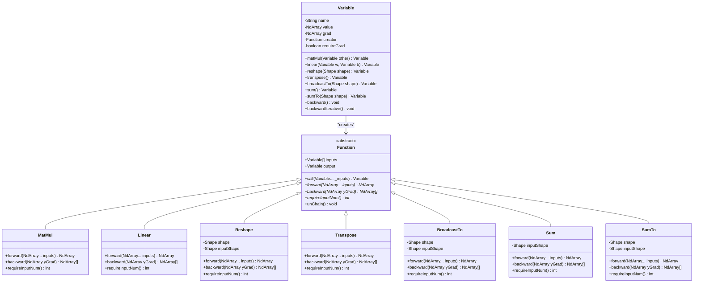
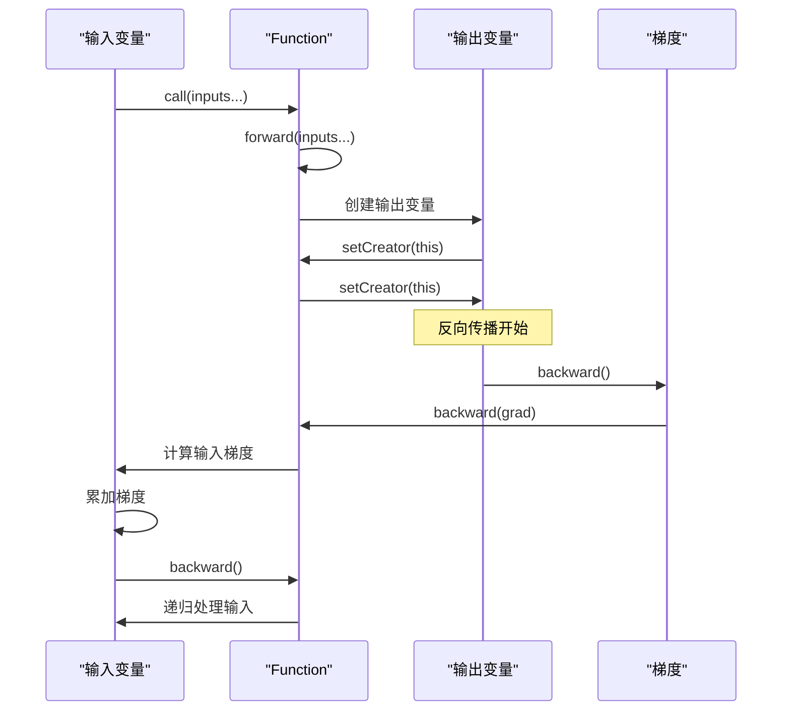
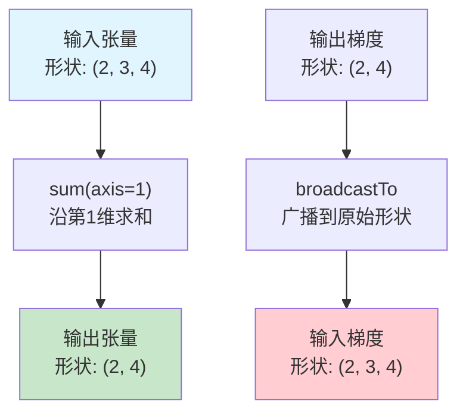
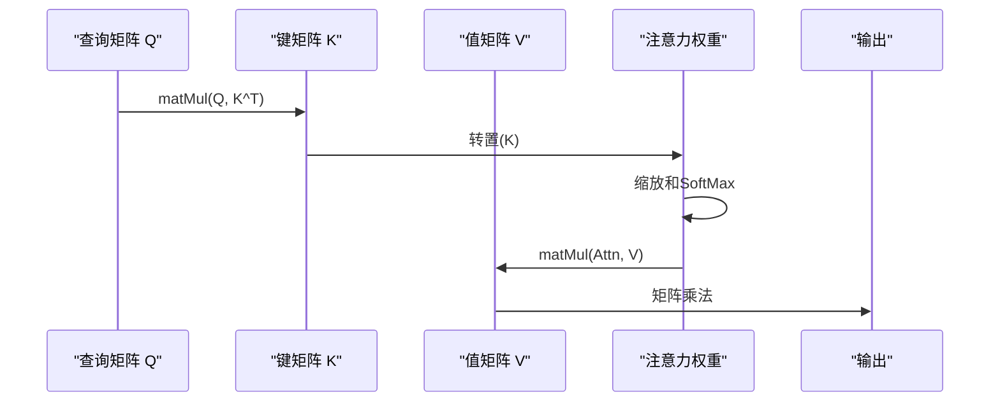
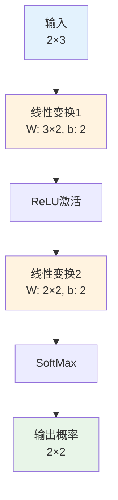
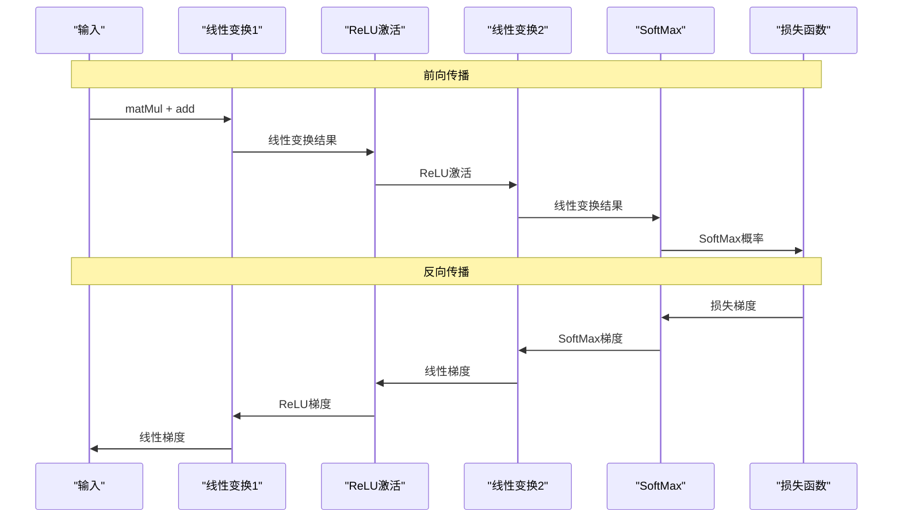

# 矩阵与张量操作

<cite>
**本文档中引用的文件**
- [Variable.java](file://tinyai-dl-func/src/main/java/io/leavesfly/tinyai/func/Variable.java)
- [Function.java](file://tinyai-dl-func/src/main/java/io/leavesfly/tinyai/func/Function.java)
- [MatMul.java](file://tinyai-dl-func/src/main/java/io/leavesfly/tinyai/func/matrix/MatMul.java)
- [Linear.java](file://tinyai-dl-func/src/main/java/io/leavesfly/tinyai/func/matrix/Linear.java)
- [Reshape.java](file://tinyai-dl-func/src/main/java/io/leavesfly/tinyai/func/matrix/Reshape.java)
- [Transpose.java](file://tinyai-dl-func/src/main/java/io/leavesfly/tinyai/func/matrix/Transpose.java)
- [BroadcastTo.java](file://tinyai-dl-func/src/main/java/io/leavesfly/tinyai/func/matrix/BroadcastTo.java)
- [Sum.java](file://tinyai-dl-func/src/main/java/io/leavesfly/tinyai/func/matrix/Sum.java)
- [SumTo.java](file://tinyai-dl-func/src/main/java/io/leavesfly/tinyai/func/matrix/SumTo.java)
- [AffineLayer.java](file://tinyai-dl-nnet/src/main/java/io/leavesfly/tinyai/nnet/layer/dnn/AffineLayer.java)
- [MatrixOperationsTest.java](file://tinyai-dl-func/src/test/java/io/leavesfly/tinyai/func/matrix/MatrixOperationsTest.java)
</cite>

## 目录
1. [简介](#简介)
2. [核心架构概览](#核心架构概览)
3. [Variable类核心功能](#variable类核心功能)
4. [矩阵与张量操作详解](#矩阵与张量操作详解)
5. [深度学习模型中的应用](#深度学习模型中的应用)
6. [性能优化策略](#性能优化策略)
7. [综合示例：构建前向传播流程](#综合示例构建前向传播流程)
8. [故障排除指南](#故障排除指南)
9. [总结](#总结)

## 简介

TinyAI框架中的矩阵与张量操作是深度学习模型的核心基础。本文档全面介绍了Variable类支持的各种矩阵与张量级操作，包括矩阵乘法（matMul）、线性变换（linear）、重塑（reshape）、转置（transpose）、广播（broadcastTo）及求和操作（sum/sumTo）。这些操作在深度学习模型中发挥着关键作用，如matMul用于全连接层计算，reshape用于数据维度调整，transpose用于改变数据布局，broadcastTo用于扩展维度，sum/sumTo用于聚合计算。

## 核心架构概览

TinyAI的矩阵与张量操作基于函数式编程范式，通过Function基类定义统一的操作接口，每种具体操作继承自该基类并实现特定的前向传播和反向传播逻辑。



**图表来源**
- [Function.java](file://tinyai-dl-func/src/main/java/io/leavesfly/tinyai/func/Function.java#L1-L152)
- [Variable.java](file://tinyai-dl-func/src/main/java/io/leavesfly/tinyai/func/Variable.java#L1-L654)
- [MatMul.java](file://tinyai-dl-func/src/main/java/io/leavesfly/tinyai/func/matrix/MatMul.java#L1-L62)
- [Linear.java](file://tinyai-dl-func/src/main/java/io/leavesfly/tinyai/func/matrix/Linear.java#L1-L72)

## Variable类核心功能

Variable类是TinyAI框架中数学变量的抽象表示，它不仅包含变量的值（NdArray），还包含变量的梯度、生成该变量的函数等信息。Variable是自动微分系统的核心组件，负责构建和维护计算图。

### 核心属性

- **value**: 变量的实际数值，使用NdArray表示
- **grad**: 反向传播计算得到的梯度值，用于参数更新
- **creator**: 记录生成当前Variable的函数，用于构建计算图
- **requireGrad**: 是否需要计算当前变量的梯度
- **name**: 变量的名称，用于标识变量，便于调试和可视化

### 自动微分机制

Variable类实现了两种反向传播机制：

1. **递归实现** (`backward()`): 传统的递归调用方式
2. **迭代实现** (`backwardIterative()`): 使用栈来避免递归调用可能导致的栈溢出问题



**图表来源**
- [Variable.java](file://tinyai-dl-func/src/main/java/io/leavesfly/tinyai/func/Variable.java#L100-L150)
- [Function.java](file://tinyai-dl-func/src/main/java/io/leavesfly/tinyai/func/Function.java#L30-L60)

**章节来源**
- [Variable.java](file://tinyai-dl-func/src/main/java/io/leavesfly/tinyai/func/Variable.java#L1-L654)
- [Function.java](file://tinyai-dl-func/src/main/java/io/leavesfly/tinyai/func/Function.java#L1-L152)

## 矩阵与张量操作详解

### 矩阵乘法（MatMul）

矩阵乘法是深度学习中最基础也是最重要的操作之一，用于全连接层的计算。

#### 实现原理

```java
@Override
public NdArray forward(NdArray... inputs) {
    NdArray x = inputs[0];
    NdArray w = inputs[1];
    return x.dot(w);
}

@Override
public List<NdArray> backward(NdArray yGrad) {
    NdArray x = inputs[0].getValue();
    NdArray w = inputs[1].getValue();
    return Arrays.asList(yGrad.dot(w.transpose()), x.transpose().dot(yGrad));
}
```

#### 形状兼容性规则

- 输入矩阵x形状为`(m, n)`
- 输入矩阵w形状为`(n, p)`
- 输出矩阵形状为`(m, p)`
- 必须满足内维度相等：`x.cols == w.rows`

#### 性能优化策略

- 使用高效的矩阵乘法库（如BLAS）
- 支持批量矩阵乘法
- 内存布局优化（行优先vs列优先）

### 线性变换（Linear）

线性变换执行`y = x * W + b`操作，是全连接层的核心计算。

#### 实现特点

```java
@Override
public NdArray forward(NdArray... inputs) {
    NdArray y = inputs[0].dot(inputs[1]);
    if (inputs.length == 2) {
        return y;
    }
    return y.add(inputs[2].broadcastTo(y.getShape()));
}
```

#### 参数处理

- **权重矩阵W**: 形状为`(input_size, output_size)`
- **偏置向量b**: 可选，形状为`(1, output_size)`，通过broadcastTo扩展到输出形状
- **偏置处理**: 自动处理偏置的存在与否

### 重塑（Reshape）

重塑操作改变变量的形状而不改变数据内容。

#### 实现机制

```java
@Override
public NdArray forward(NdArray... inputs) {
    inputShape = inputs[0].getShape();
    return inputs[0].reshape(shape);
}

@Override
public List<NdArray> backward(NdArray yGrad) {
    return Collections.singletonList(yGrad.reshape(inputShape));
}
```

#### 形状兼容性

- 新形状的元素总数必须等于原始形状的元素总数
- 支持动态形状推断（使用-1作为占位符）

### 转置（Transpose）

转置操作交换矩阵的行和列。

#### 数学性质

对于转置操作，梯度计算遵循以下规则：
- `(A^T)^T = A`
- `(AB)^T = B^T * A^T`

### 广播（BroadcastTo）

广播操作将较小的数组扩展到较大的目标形状。

#### 广播规则

1. 从最后一个维度开始比较
2. 如果两个维度的大小相同，或者其中一个维度大小为1，则可以广播
3. 不同维度的广播规则必须满足兼容性

#### 梯度传播

广播的反向传播通过`sumTo`操作将梯度值还原到原始形状。

### 求和操作（Sum/SumTo）

求和操作用于聚合计算，在池化层和损失函数中广泛应用。

#### Sum vs SumTo

- **Sum**: 对所有元素求和，返回标量
- **SumTo**: 沿指定维度求和到目标形状

#### 梯度传播

求和操作的梯度传播通过广播操作将标量梯度扩展到原始形状。



**图表来源**
- [Sum.java](file://tinyai-dl-func/src/main/java/io/leavesfly/tinyai/func/matrix/Sum.java#L1-L60)
- [SumTo.java](file://tinyai-dl-func/src/main/java/io/leavesfly/tinyai/func/matrix/SumTo.java#L1-L69)

**章节来源**
- [MatMul.java](file://tinyai-dl-func/src/main/java/io/leavesfly/tinyai/func/matrix/MatMul.java#L1-L62)
- [Linear.java](file://tinyai-dl-func/src/main/java/io/leavesfly/tinyai/func/matrix/Linear.java#L1-L72)
- [Reshape.java](file://tinyai-dl-func/src/main/java/io/leavesfly/tinyai/func/matrix/Reshape.java#L1-L70)
- [Transpose.java](file://tinyai-dl-func/src/main/java/io/leavesfly/tinyai/func/matrix/Transpose.java#L1-L55)
- [BroadcastTo.java](file://tinyai-dl-func/src/main/java/io/leavesfly/tinyai/func/matrix/BroadcastTo.java#L1-L70)
- [Sum.java](file://tinyai-dl-func/src/main/java/io/leavesfly/tinyai/func/matrix/Sum.java#L1-L60)
- [SumTo.java](file://tinyai-dl-func/src/main/java/io/leavesfly/tinyai/func/matrix/SumTo.java#L1-L69)

## 深度学习模型中的应用

### 全连接层的应用

在神经网络中，矩阵乘法和线性变换是最常用的层间计算：

```java
// 全连接层的实现
public Variable layerForward(Variable... inputs) {
    Variable x = inputs[0];
    return x.linear(wParam, bParam);
}
```

### 数据预处理

- **Reshape**: 将图像数据从`(batch, height, width, channels)`转换为`(batch, height*width*channels)`
- **Transpose**: 在不同框架间转换数据布局
- **BroadcastTo**: 添加批次维度或通道维度

### 损失函数计算

- **Sum**: 计算总损失
- **SumTo**: 按批次维度求和

### 注意力机制

在Transformer模型中，矩阵乘法用于计算注意力权重：



**图表来源**
- [MatMul.java](file://tinyai-dl-func/src/main/java/io/leavesfly/tinyai/func/matrix/MatMul.java#L20-L30)
- [AffineLayer.java](file://tinyai-dl-nnet/src/main/java/io/leavesfly/tinyai/nnet/layer/dnn/AffineLayer.java#L70-L80)

**章节来源**
- [AffineLayer.java](file://tinyai-dl-nnet/src/main/java/io/leavesfly/tinyai/nnet/layer/dnn/AffineLayer.java#L1-L89)

## 性能优化策略

### 内存布局优化

1. **行优先存储**: 适合连续访问模式
2. **列优先存储**: 适合转置操作
3. **缓存友好的访问模式**: 优化数据局部性

### 算法优化

1. **分块计算**: 大矩阵分解为小块处理
2. **并行计算**: 利用多核CPU或GPU
3. **近似算法**: 在精度允许的情况下使用近似方法

### 计算图优化

1. **计算图简化**: 合并连续的相同操作
2. **梯度检查点**: 在内存和计算之间权衡
3. **延迟计算**: 只在需要时才执行计算

## 综合示例：构建前向传播流程

以下是一个完整的深度神经网络前向传播流程示例，展示了如何串联各种矩阵与张量操作：

```java
// 定义输入变量
Variable input = new Variable(NdArray.of(new float[][]{
    {1.0f, 2.0f, 3.0f},
    {4.0f, 5.0f, 6.0f}
}));

// 第一层：线性变换 + ReLU激活
Parameter weights1 = new Parameter(
    NdArray.of(new float[][]{
        {0.1f, 0.2f},
        {0.3f, 0.4f},
        {0.5f, 0.6f}
    })
);
Parameter bias1 = new Parameter(NdArray.of(new float[]{0.1f, 0.2f}));
Variable hidden = input.linear(weights1, bias1);
Variable activated = hidden.relu();

// 第二层：线性变换 + SoftMax
Parameter weights2 = new Parameter(
    NdArray.of(new float[][]{
        {0.7f, 0.8f},
        {0.9f, 1.0f}
    })
);
Parameter bias2 = new Parameter(NdArray.of(new float[]{0.3f, 0.4f}));
Variable output = activated.linear(weights2, bias2);
Variable probabilities = output.softMax();

// 前向传播完成
NdArray result = probabilities.getValue();
System.out.println("输出概率分布: " + result);
```

### 计算图可视化



### 梯度计算流程



**图表来源**
- [Variable.java](file://tinyai-dl-func/src/main/java/io/leavesfly/tinyai/func/Variable.java#L100-L150)
- [Linear.java](file://tinyai-dl-func/src/main/java/io/leavesfly/tinyai/func/matrix/Linear.java#L20-L35)

## 故障排除指南

### 常见错误类型

1. **形状不匹配错误**
   ```java
   // 错误示例
   Variable result = input.matMul(weights); // 形状不兼容
   
   // 解决方案
   Variable transposedWeights = weights.transpose();
   Variable result = input.matMul(transposedWeights);
   ```

2. **梯度形状不匹配**
   ```java
   // 检查梯度形状
   if (gradient != null && gradient.getShape().equals(variable.getValue().getShape())) {
       variable.setGrad(gradient);
   } else {
       throw new RuntimeException("梯度形状不匹配");
   }
   ```

3. **内存不足**
   - 使用更小的批次大小
   - 启用梯度检查点
   - 优化数据类型（float32 vs float64）

### 调试技巧

1. **启用训练模式**
   ```java
   Config.train = true; // 启用计算图构建
   ```

2. **检查计算图**
   ```java
   Variable current = output;
   while (current.getCreator() != null) {
       System.out.println("创建者: " + current.getCreator().getClass().getSimpleName());
       current = current.getCreator().getInputs()[0];
   }
   ```

3. **验证梯度**
   ```java
   // 数值梯度验证
   float epsilon = 1e-7f;
   NdArray numericalGrad = computeNumericalGradient(loss, variable, epsilon);
   NdArray analyticalGrad = variable.getGrad();
   // 比较两者的差异
   ```

**章节来源**
- [MatrixOperationsTest.java](file://tinyai-dl-func/src/test/java/io/leavesfly/tinyai/func/matrix/MatrixOperationsTest.java#L1-L200)

## 总结

TinyAI框架中的矩阵与张量操作为深度学习提供了坚实的基础。通过Variable类和Function基类的组合，实现了高效、灵活的自动微分系统。主要特性包括：

1. **完整的操作集合**: 支持矩阵乘法、线性变换、重塑、转置、广播和求和等核心操作
2. **高效的自动微分**: 通过递归和迭代两种方式实现反向传播
3. **灵活的形状处理**: 支持动态形状推断和多种广播规则
4. **性能优化**: 包含内存布局优化和计算图简化等策略
5. **易于使用**: 通过链式调用和直观的方法名简化开发复杂度

这些操作在深度学习模型中发挥着关键作用，从简单的全连接层到复杂的注意力机制，都离不开这些基础的矩阵与张量操作。通过合理使用这些操作，开发者可以构建出高效、准确的深度学习模型。