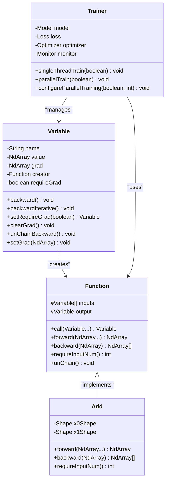

# 梯度计算优化策略

<cite>
**本文档中引用的文件**
- [Variable.java](file://tinyai-dl-func/src/main/java/io/leavesfly/tinyai/func/Variable.java)
- [Function.java](file://tinyai-dl-func/src/main/java/io/leavesfly/tinyai/func/Function.java)
- [Add.java](file://tinyai-dl-func/src/main/java/io/leavesfly/tinyai/func/base/Add.java)
- [VariableTest.java](file://tinyai-dl-func/src/test/java/io/leavesfly/tinyai/func/VariableTest.java)
- [Trainer.java](file://tinyai-dl-ml/src/main/java/io/leavesfly/tinyai/ml/Trainer.java)
- [MlpSinExam.java](file://tinyai-dl-case/src/main/java/io/leavesfly/tinyai/example/regress/MlpSinExam.java)
</cite>

## 目录
1. [简介](#简介)
2. [核心架构概览](#核心架构概览)
3. [requireGrad标志位机制](#requiregrad标志位机制)
4. [梯度延迟初始化策略](#梯度延迟初始化策略)
5. [梯度累加逻辑](#梯度累加逻辑)
6. [性能优化应用场景](#性能优化应用场景)
7. [最佳实践指南](#最佳实践指南)
8. [故障排除指南](#故障排除指南)
9. [结论](#结论)

## 简介

TinyAI深度学习框架中的自动微分系统采用了先进的性能优化设计，其中最核心的优化策略之一就是通过`requireGrad`标志位实现的条件梯度计算。这种设计允许开发者在不同的计算阶段灵活控制梯度计算的开销，从而在模型评估、推理部署和部分参数冻结训练等场景中获得显著的性能提升。

本文档将深入分析这一优化机制的工作原理、实现细节以及最佳实践，帮助开发者充分理解和利用这一强大的性能优化工具。

## 核心架构概览

自动微分系统的核心组件包括`Variable`类、`Function`类和计算图管理机制。整个系统采用面向对象的设计模式，通过责任链模式构建计算图，实现了高效的前向传播和反向传播计算。



**图表来源**
- [Variable.java](file://tinyai-dl-func/src/main/java/io/leavesfly/tinyai/func/Variable.java#L20-L148)
- [Function.java](file://tinyai-dl-func/src/main/java/io/leavesfly/tinyai/func/Function.java#L15-L151)
- [Add.java](file://tinyai-dl-func/src/main/java/io/leavesfly/tinyai/func/base/Add.java#L15-L115)

**章节来源**
- [Variable.java](file://tinyai-dl-func/src/main/java/io/leavesfly/tinyai/func/Variable.java#L1-L654)
- [Function.java](file://tinyai-dl-func/src/main/java/io/leavesfly/tinyai/func/Function.java#L1-L152)

## requireGrad标志位机制

`requireGrad`标志位是TinyAI自动微分系统中的关键性能优化机制。它控制着变量是否参与梯度计算，当设置为`false`时，系统将完全跳过该变量的梯度计算和计算图构建，从而显著提升前向推理效率。

### 标志位的工作原理

```java
public void backward() {
    if (!requireGrad) {
        this.grad = null;
        return;
    }
    // 只有在requireGrad为true时才会执行后续的梯度计算
    if (Objects.isNull(grad)) {
        setGrad(NdArray.ones(this.getValue().getShape()));
    }
    // 继续执行梯度计算...
}
```

### 标志位的设置方式

```java
// 方式1：构造函数中设置
Variable var = new Variable(arr, "no_grad_var", false);

// 方式2：动态设置
Variable var = new Variable(arr);
var.setRequireGrad(false);
```

### 标志位的控制效果

当`requireGrad`设置为`false`时，系统会执行以下优化：

1. **跳过梯度计算**：完全忽略该变量的梯度计算
2. **不构建计算图**：不记录该变量的创建者函数
3. **节省内存**：不分配梯度存储空间
4. **减少计算开销**：跳过反向传播过程

**章节来源**
- [Variable.java](file://tinyai-dl-func/src/main/java/io/leavesfly/tinyai/func/Variable.java#L111-L148)
- [VariableTest.java](file://tinyai-dl-func/src/test/java/io/leavesfly/tinyai/func/VariableTest.java#L75-L88)

## 梯度延迟初始化策略

TinyAI采用了智能的梯度延迟初始化策略，只有在首次反向传播时才创建梯度数组。这种设计既保证了内存的有效利用，又避免了不必要的初始化开销。

### 延迟初始化的实现机制

```java
public void backward() {
    // 只有在需要梯度时才初始化
    if (Objects.isNull(grad)) {
        setGrad(NdArray.ones(this.getValue().getShape()));
    }
    
    // 递归计算梯度
    Function _creator = creator;
    if (!Objects.isNull(_creator)) {
        // 执行梯度计算...
    }
}
```

### 梯度初始化的触发条件

1. **首次反向传播**：当变量的`grad`字段为`null`时
2. **requireGrad为true**：只有在需要梯度的情况下才初始化
3. **形状匹配**：初始化的梯度数组形状与变量值的形状一致

### 内存优化效果

这种延迟初始化策略带来了显著的内存优化效果：

- **按需分配**：只在真正需要时分配梯度内存
- **避免浪费**：对于不需要梯度的变量，完全不分配内存
- **动态调整**：根据变量的实际形状动态分配合适大小的梯度数组

**章节来源**
- [Variable.java](file://tinyai-dl-func/src/main/java/io/leavesfly/tinyai/func/Variable.java#L111-L148)

## 梯度累加逻辑

TinyAI的梯度计算系统支持梯度累加，这对于多任务学习或多损失项的场景尤为重要。系统采用累加而非覆盖的方式处理梯度，确保不同损失函数产生的梯度能够正确合并。

### 梯度累加的核心实现

```java
public void backward() {
    // ... 前面的代码 ...
    
    int index = 0;
    for (Variable input : _inputs) {
        // 累加梯度而不是直接设置
        if (input.getGrad() != null) {
            input.setGrad(input.getGrad().add(grads.get(index)));
        } else {
            input.setGrad(grads.get(index));
        }
        input.backward();
        index++;
    }
}
```

### 梯度累加的优势

1. **多任务支持**：支持多个损失函数共享同一组参数
2. **梯度聚合**：将来自不同路径的梯度正确合并
3. **数值稳定性**：避免梯度丢失，提高训练稳定性
4. **灵活性**：支持复杂的计算图结构

### 梯度累加的使用场景

```java
// 场景1：多任务学习
Variable loss1 = model1.forward(x).meanSquaredError(y1);
Variable loss2 = model2.forward(x).meanSquaredError(y2);

// 分别计算梯度
loss1.backward();
loss2.backward();

// 参数自动累加梯度
optimizer.update(); // 参数同时更新，包含了loss1和loss2的梯度
```

**章节来源**
- [Variable.java](file://tinyai-dl-func/src/main/java/io/leavesfly/tinyai/func/Variable.java#L125-L148)

## 性能优化应用场景

`requireGrad`标志位和梯度计算优化策略在多种实际应用场景中发挥着重要作用，以下是几个典型的应用场景及其优化效果。

### 模型评估场景

在模型评估阶段，我们只需要前向传播来计算预测结果，不需要梯度信息。通过设置`requireGrad=false`，可以显著提升评估速度。

```java
// 评估时的优化
Variable evalInput = testData.toVariableX().setRequireGrad(false);
Variable predictions = model.forward(evalInput);
// 不需要调用backward()，因为requireGrad=false
```

### 推理部署场景

在生产环境的推理部署中，模型只需要进行前向计算，不需要任何梯度计算。这是`requireGrad=false`的最佳应用场景。

```java
// 推理时的完整优化
Variable inferenceInput = inputData.toVariableX().setRequireGrad(false);
Variable output = model.forward(inferenceInput);
// 完全跳过梯度计算，最大化推理性能
```

### 部分参数冻结训练

在迁移学习和微调场景中，我们可能只想训练模型的一部分参数。通过设置不需要训练的参数对应的变量`requireGrad=false`，可以避免这些参数的梯度计算。

```java
// 迁移学习中的参数冻结
// 冻结预训练层的梯度
pretrainedLayers.forEach(layer -> {
    layer.parameters().forEach(param -> {
        param.setRequireGrad(false);
    });
});

// 只训练新添加的层
newLayers.forEach(layer -> {
    layer.parameters().forEach(param -> {
        param.setRequireGrad(true);
    });
});
```

### 并行训练优化

在并行训练环境中，`requireGrad=false`可以显著减少内存使用和通信开销。

```java
// 并行训练中的优化策略
public void singleThreadTrain(boolean shuffleData) {
    // 对于输入数据，不需要梯度
    Variable variableX = batch.toVariableX().setName("x").setRequireGrad(false);
    Variable variableY = batch.toVariableY().setName("y").setRequireGrad(false);
    
    Variable predictY = model.forward(variableX);
    Variable lossVariable = loss.loss(variableY, predictY);
    
    // 清理梯度
    model.clearGrads();
    lossVariable.backward();
    optimizer.update();
}
```

**章节来源**
- [Trainer.java](file://tinyai-dl-ml/src/main/java/io/leavesfly/tinyai/ml/Trainer.java#L150-L180)
- [MlpSinExam.java](file://tinyai-dl-case/src/main/java/io/leavesfly/tinyai/example/regress/MlpSinExam.java#L40-L50)

## 最佳实践指南

基于对TinyAI自动微分系统的深入分析，以下是针对不同场景的最佳实践建议。

### 开发阶段的最佳实践

1. **明确区分训练和推理**：
   ```java
   // 训练时
   Variable x_train = batch.toVariableX().setRequireGrad(true);
   
   // 推理时
   Variable x_inference = batch.toVariableX().setRequireGrad(false);
   ```

2. **合理使用requireGrad标志**：
   ```java
   // 对于不需要梯度的中间变量
   Variable intermediate = someOperation(x);
   intermediate.setRequireGrad(false);
   ```

3. **及时清理梯度**：
   ```java
   // 在每个训练批次开始前清理梯度
   model.clearGrads();
   ```

### 性能优化的最佳实践

1. **批量处理优化**：
   ```java
   // 对于大批量数据，考虑使用并行训练
   trainer.configureParallelTraining(true, numCPUs);
   trainer.train(true);
   ```

2. **内存管理**：
   ```java
   // 对于大型模型，及时释放不需要的变量
   intermediate.unChainBackward();
   intermediate = null;
   ```

3. **梯度检查点**：
   ```java
   // 在RNN中使用梯度检查点技术
   if (shouldCheckpoint(step)) {
       intermediate.unChainBackward();
   }
   ```

### 调试和监控的最佳实践

1. **梯度验证**：
   ```java
   // 在关键节点验证梯度
   if (DEBUG_MODE) {
       Variable debugVar = someOperation(x);
       debugVar.setRequireGrad(true);
       debugVar.backward();
       // 检查梯度是否正常
   }
   ```

2. **性能监控**：
   ```java
   // 监控梯度计算的性能
   long startTime = System.nanoTime();
   loss.backward();
   long endTime = System.nanoTime();
   System.out.println("梯度计算耗时: " + (endTime - startTime) + " ns");
   ```

## 故障排除指南

在使用`requireGrad`标志位和梯度计算优化时，可能会遇到一些常见问题。以下是这些问题的诊断和解决方案。

### 常见问题及解决方案

1. **梯度意外为null**
   ```java
   // 问题：期望有梯度但得到null
   // 解决方案：检查requireGrad设置
   if (variable.getGrad() == null) {
       System.out.println("变量的requireGrad为false，无法计算梯度");
       variable.setRequireGrad(true);
   }
   ```

2. **内存泄漏**
   ```java
   // 问题：内存使用持续增长
   // 解决方案：确保及时清理计算图
   variable.unChainBackward();
   ```

3. **梯度不正确**
   ```java
   // 问题：梯度值不符合预期
   // 解决方案：检查计算图的完整性
   if (variable.getCreator() == null) {
       System.out.println("变量没有创建者，可能是计算图被切断");
   }
   ```

### 性能问题诊断

1. **反向传播过慢**
   ```java
   // 诊断：检查是否启用了requireGrad优化
   if (slowBackwardPropagation) {
       // 尝试启用requireGrad优化
       variable.setRequireGrad(false);
   }
   ```

2. **内存使用过高**
   ```java
   // 诊断：检查是否有未清理的计算图
   // 使用内存分析工具检查NdArray的分配情况
   ```

**章节来源**
- [VariableTest.java](file://tinyai-dl-func/src/test/java/io/leavesfly/tinyai/func/VariableTest.java#L313-L364)

## 结论

TinyAI自动微分系统中的性能优化设计体现了现代深度学习框架的发展趋势。通过`requireGrad`标志位机制、梯度延迟初始化策略和梯度累加逻辑的有机结合，系统能够在保证功能完整性的同时，为不同的应用场景提供最优的性能表现。

这种设计的优势主要体现在：

1. **灵活性**：开发者可以根据具体需求灵活控制梯度计算
2. **高效性**：在推理和评估场景中显著提升性能
3. **可扩展性**：支持复杂的多任务学习和并行训练
4. **易用性**：通过简单的API设计降低使用门槛

随着深度学习应用的不断扩展，这种精细化的性能优化策略将成为构建高效、可扩展深度学习系统的重要基础。开发者应该充分理解和掌握这些优化机制，以便在实际项目中获得最佳的性能表现。