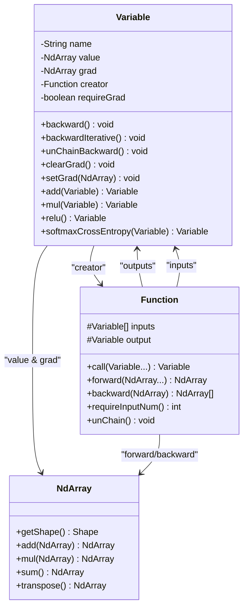
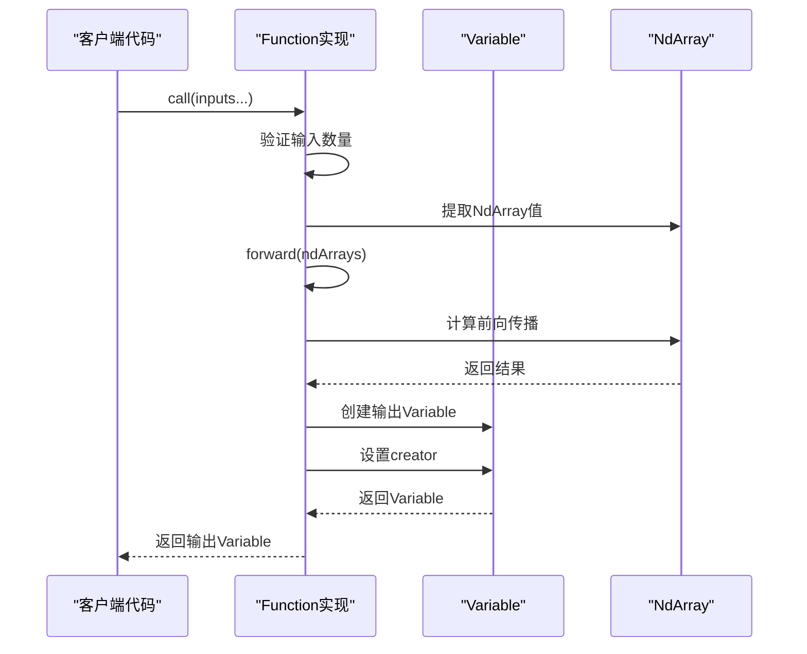
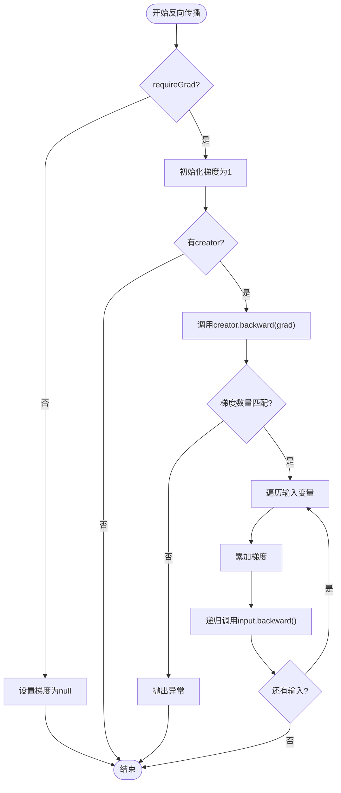
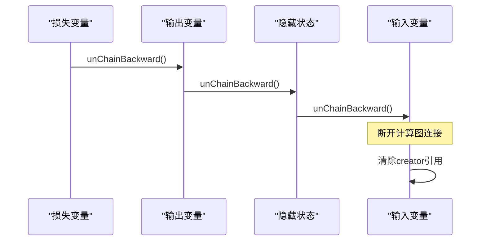
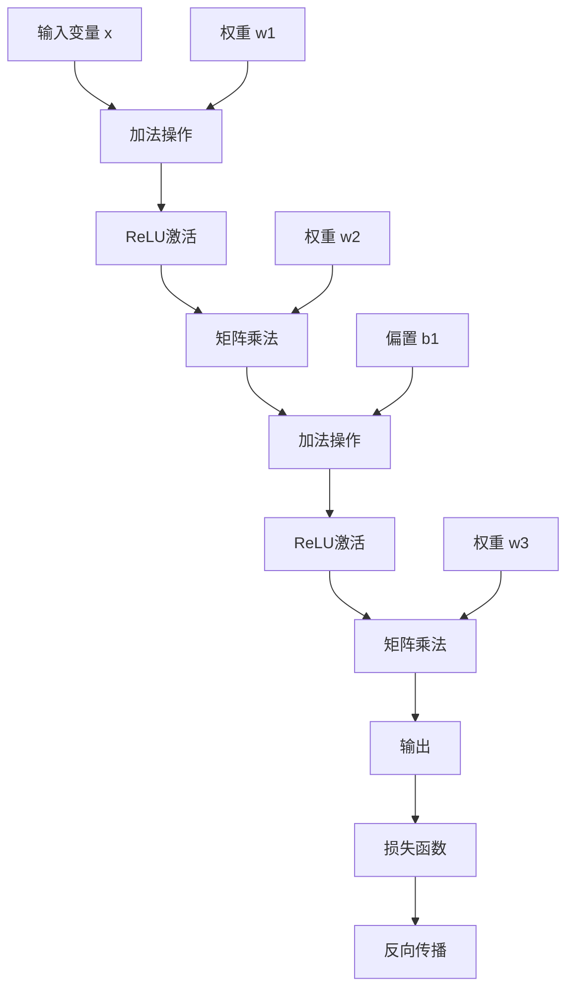

# 自动微分系统

<cite>
**本文档中引用的文件**
- [Variable.java](file://tinyai-dl-func/src/main/java/io/leavesfly/tinyai/func/Variable.java)
- [Function.java](file://tinyai-dl-func/src/main/java/io/leavesfly/tinyai/func/Function.java)
- [Add.java](file://tinyai-dl-func/src/main/java/io/leavesfly/tinyai/func/base/Add.java)
- [VariableTest.java](file://tinyai-dl-func/src/test/java/io/leavesfly/tinyai/func/VariableTest.java)
- [LineExam.java](file://tinyai-dl-case/src/main/java/io/leavesfly/tinyai/example/regress/LineExam.java)
- [CompleteRnnExample.java](file://tinyai-dl-case/src/main/java/io/leavesfly/tinyai/example/rnn/CompleteRnnExample.java)
</cite>

## 目录
1. [简介](#简介)
2. [核心架构](#核心架构)
3. [Variable类详解](#variable类详解)
4. [Function接口设计](#function接口设计)
5. [反向传播机制](#反向传播机制)
6. [递归vs迭代实现](#递归vs迭代实现)
7. [计算图管理](#计算图管理)
8. [性能优化策略](#性能优化策略)
9. [实际应用示例](#实际应用示例)
10. [故障排除指南](#故障排除指南)
11. [总结](#总结)

## 简介

TinyAI的自动微分系统是一个高效且灵活的深度学习框架核心组件，它实现了基于计算图的自动微分机制。该系统通过Variable类和Function接口的协作，提供了完整的前向传播和反向传播能力，支持复杂的神经网络训练过程。

自动微分系统的核心优势在于：
- **零手动编码梯度**：无需手动推导和实现梯度公式
- **动态计算图**：运行时构建计算图，支持控制流
- **内存高效**：通过计算图管理和梯度清理优化内存使用
- **类型安全**：强类型系统确保计算正确性

## 核心架构

自动微分系统采用经典的计算图架构，由三个核心组件构成：



**图表来源**
- [Variable.java](file://tinyai-dl-func/src/main/java/io/leavesfly/tinyai/func/Variable.java#L20-L60)
- [Function.java](file://tinyai-dl-func/src/main/java/io/leavesfly/tinyai/func/Function.java#L15-L50)

## Variable类详解

Variable类是自动微分系统的核心，它封装了数学变量及其梯度信息，并维护与计算图的关系。

### 核心属性

```java
private String name;              // 变量名称，用于调试和可视化
private NdArray value;            // 变量的实际数值
private NdArray grad;             // 反向传播计算得到的梯度值
private transient Function creator; // 生成该变量的函数
private boolean requireGrad = true; // 是否需要计算梯度
```

### 构造函数设计

Variable类提供了多种构造函数以适应不同的使用场景：

```java
// 基本构造函数
public Variable(NdArray _value)

// 带名称的构造函数
public Variable(NdArray _value, String _name)

// 带梯度标志的构造函数
public Variable(NdArray _value, String _name, boolean _requireGrad)
```

### 梯度管理机制

Variable类实现了智能的梯度管理机制：

```java
public void setGrad(NdArray _grad) {
    if (_grad == null) return;
    if (!_grad.getShape().equals(value.getShape())) {
        throw new RuntimeException("_grad shape must equal value shape!");
    }
    if (requireGrad) {
        this.grad = _grad;
    } else {
        this.grad = null;
    }
}
```

**节来源**
- [Variable.java](file://tinyai-dl-func/src/main/java/io/leavesfly/tinyai/func/Variable.java#L60-L100)

## Function接口设计

Function接口定义了所有数学函数操作的标准行为，是构建计算图的基础。

### 接口职责



**图表来源**
- [Function.java](file://tinyai-dl-func/src/main/java/io/leavesfly/tinyai/func/Function.java#L35-L65)

### 前向传播实现

每个Function实现都需要提供前向传播和反向传播的具体逻辑：

```java
@Override
public NdArray forward(NdArray... inputs) {
    // 实现具体的前向传播逻辑
    // 例如：加法操作直接相加
    return inputs[0].add(inputs[1]);
}

@Override
public List<NdArray> backward(NdArray yGrad) {
    // 实现梯度反向传播
    // 例如：加法操作梯度直接传递
    return Arrays.asList(yGrad, yGrad);
}
```

**节来源**
- [Function.java](file://tinyai-dl-func/src/main/java/io/leavesfly/tinyai/func/Function.java#L70-L90)

## 反向传播机制

自动微分系统的核心是反向传播算法，它通过递归遍历计算图来计算梯度。

### 递归反向传播实现



**图表来源**
- [Variable.java](file://tinyai-dl-func/src/main/java/io/leavesfly/tinyai/func/Variable.java#L119-L150)

### 梯度累加机制

自动微分系统采用梯度累加而非覆盖的方式，支持梯度复用：

```java
// 累加梯度而不是直接设置，支持梯度复用
if (input.getGrad() != null) {
    input.setGrad(input.getGrad().add(grads.get(index)));
} else {
    input.setGrad(grads.get(index));
}
```

这种设计允许同一个变量被多个函数使用时，其梯度会被正确累加。

**节来源**
- [Variable.java](file://tinyai-dl-func/src/main/java/io/leavesfly/tinyai/func/Variable.java#L130-L145)

## 递归vs迭代实现

自动微分系统提供了两种反向传播实现方式，各有优缺点。

### 递归实现特点

**优点：**
- 代码简洁直观
- 符合数学概念
- 易于理解和调试

**缺点：**
- 深度较大时可能栈溢出
- 性能相对较低

### 迭代实现特点

```java
public void backwardIterative() {
    if (!requireGrad) {
        this.grad = null;
        return;
    }

    // 初始化梯度为1
    if (Objects.isNull(grad)) {
        setGrad(NdArray.ones(this.getValue().getShape()));
    }

    // 使用栈来模拟递归过程
    Stack<Variable> stack = new Stack<>();
    stack.push(this);

    while (!stack.isEmpty()) {
        Variable currentVar = stack.pop();
        // 处理当前变量...
    }
}
```

**优点：**
- 避免栈溢出问题
- 更高的性能
- 适合深层网络和RNN

**缺点：**
- 代码复杂度较高
- 调试相对困难

### 选择建议

- **简单网络**：优先使用递归实现
- **深层网络**：推荐使用迭代实现
- **RNN序列模型**：必须使用迭代实现

**节来源**
- [Variable.java](file://tinyai-dl-func/src/main/java/io/leavesfly/tinyai/func/Variable.java#L152-L200)

## 计算图管理

自动微分系统提供了强大的计算图管理功能，特别是针对RNN等序列模型的特殊需求。

### unChainBackward机制



**图表来源**
- [Variable.java](file://tinyai-dl-func/src/main/java/io/leavesfly/tinyai/func/Variable.java#L202-L215)

### RNN中的应用

在RNN训练中，unChainBackward用于防止梯度爆炸：

```java
// 训练循环中的关键步骤
for (Batch batch : batches) {
    // ... 前向传播 ...
    
    model.clearGrads();
    loss.backward();
    optimizer.update();
    
    // 切断计算图，每批数据要清理重新构建计算图
    loss.unChainBackward();
}
```

这种方法确保了：
- 每批次独立训练
- 防止梯度无限累积
- 优化内存使用

**节来源**
- [CompleteRnnExample.java](file://tinyai-dl-case/src/main/java/io/leavesfly/tinyai/example/rnn/CompleteRnnExample.java#L170-L185)

## 性能优化策略

自动微分系统采用了多种优化策略来提高性能和减少内存使用。

### requireGrad标志优化

```java
public Variable setRequireGrad(boolean _requireGrad) {
    this.requireGrad = _requireGrad;
    return this;
}

public boolean isRequireGrad() {
    return requireGrad;
}
```

当设置`requireGrad = false`时：
- 不计算梯度
- 不存储梯度信息
- 减少内存占用
- 提高推理速度

### 内存管理策略

```java
public void clearGrad() {
    grad = null;
}

private void unChain() {
    creator = null;
}
```

这些方法帮助：
- 及时释放不再需要的梯度
- 清理计算图引用
- 防止内存泄漏

### 广播操作优化

Add函数展示了高效的广播操作：

```java
@Override
public NdArray forward(NdArray... inputs) {
    if (x0Shape.equals(x1Shape)) {
        // 形状相同，直接相加
        return inputs[0].add(inputs[1]);
    } else {
        // 需要广播
        if (isBroadcastable(x1Shape, x0Shape)) {
            return inputs[0].add(inputs[1].broadcastTo(x0Shape));
        }
    }
}
```

**节来源**
- [Variable.java](file://tinyai-dl-func/src/main/java/io/leavesfly/tinyai/func/Variable.java#L80-L95)
- [Add.java](file://tinyai-dl-func/src/main/java/io/leavesfly/tinyai/func/base/Add.java#L30-L50)

## 实际应用示例

### 线性回归示例

以下是一个完整的线性回归训练示例：

```java
// 定义模型参数
Variable w = new Variable(NdArray.of(0), "w");
Variable b = new Variable(NdArray.of(0), "b");

// 前向传播
Variable predict = predict(variableX, w, b);

// 计算损失
Variable loss = meanSquaError(variableY, predict);

// 反向传播
loss.backward();

// 参数更新
w.setValue(w.getValue().sub(w.getGrad().mul(learnRate)));
b.setValue(b.getValue().sub(b.getGrad().mul(learnRate)));
```

### 复杂计算图示例



**图表来源**
- [LineExam.java](file://tinyai-dl-case/src/main/java/io/leavesfly/tinyai/example/regress/LineExam.java#L50-L70)

### RNN训练示例

```java
// RNN训练中的关键步骤
for (Batch batch : batches) {
    Variable loss = new Variable(0f);
    loss.setName("loss");
    
    for (int j = 0; j < batch.getSize(); j++) {
        Variable x = new Variable(xArray[j]).setName("x");
        Variable y = new Variable(yArray[j]).setName("y");
        Variable predict = model.forward(x);
        loss = loss.add(lossFunc.loss(y, predict));
    }

    model.clearGrads();
    loss.backward();
    optimizer.update();
    
    // 切断计算图
    loss.unChainBackward();
}
```

**节来源**
- [LineExam.java](file://tinyai-dl-case/src/main/java/io/leavesfly/tinyai/example/regress/LineExam.java#L55-L85)
- [CompleteRnnExample.java](file://tinyai-dl-case/src/main/java/io/leavesfly/tinyai/example/rnn/CompleteRnnExample.java#L150-L185)

## 故障排除指南

### 常见错误及解决方案

#### 1. 梯度形状不匹配

**错误信息**：`_grad shape must equal value shape!`

**原因**：梯度数组的形状与变量值的形状不一致

**解决方案**：
```java
// 确保梯度形状正确
if (!_grad.getShape().equals(value.getShape())) {
    _grad = _grad.sumTo(value.getShape());
}
```

#### 2. 计算图循环引用

**症状**：内存使用持续增长，程序崩溃

**原因**：计算图中存在循环引用

**解决方案**：
```java
// 定期清理计算图
loss.unChainBackward();
```

#### 3. 梯度消失或爆炸

**症状**：梯度值接近零或无穷大

**原因**：网络层数过多或学习率不当

**解决方案**：
- 使用迭代实现的backward方法
- 添加梯度裁剪
- 调整学习率

### 调试技巧

#### 1. 可视化计算图

```java
// 使用UML工具可视化计算图
System.out.println(Uml.getDotGraph(lastLoss));
```

#### 2. 检查梯度值

```java
// 打印梯度统计信息
System.out.println("Gradient stats:");
System.out.println("Mean: " + w.getGrad().mean().getNumber());
System.out.println("Std: " + w.getGrad().std().getNumber());
```

#### 3. 验证计算图完整性

```java
// 检查变量是否有正确的creator
if (var.getCreator() == null) {
    System.out.println("Warning: Variable has no creator");
}
```

## 总结

TinyAI的自动微分系统是一个设计精良、功能完备的深度学习框架核心组件。它通过以下特性提供了强大的自动微分能力：

### 核心优势

1. **灵活的架构设计**：Variable和Function的分离设计使得系统易于扩展和维护
2. **双重实现策略**：同时提供递归和迭代两种反向传播实现，满足不同场景需求
3. **智能内存管理**：通过requireGrad标志和unChainBackward机制优化内存使用
4. **类型安全保证**：强类型系统确保计算正确性和安全性
5. **丰富的数学操作**：内置大量数学函数和操作符重载

### 最佳实践建议

1. **合理使用requireGrad**：在推理阶段禁用梯度计算以提高性能
2. **及时清理计算图**：特别是在RNN训练中使用unChainBackward
3. **选择合适的反向传播实现**：根据网络深度选择递归或迭代实现
4. **监控梯度行为**：定期检查梯度统计信息以发现潜在问题

### 发展方向

自动微分系统在未来的发展方向包括：
- 支持更高阶的导数计算
- 优化大规模分布式训练中的梯度通信
- 集成更多的数学函数和操作
- 提供更丰富的调试和可视化工具

通过深入理解这些设计原理和最佳实践，开发者可以更好地利用TinyAI的自动微分系统构建高效、可靠的深度学习应用。