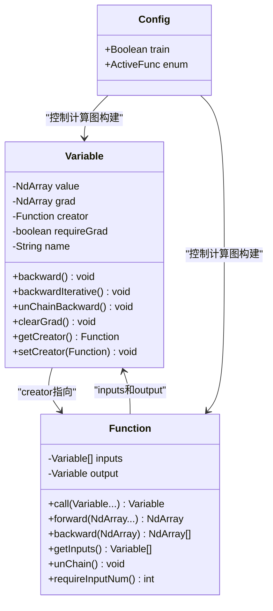
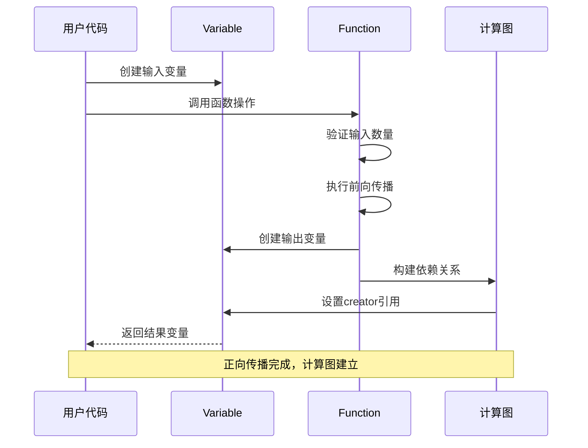
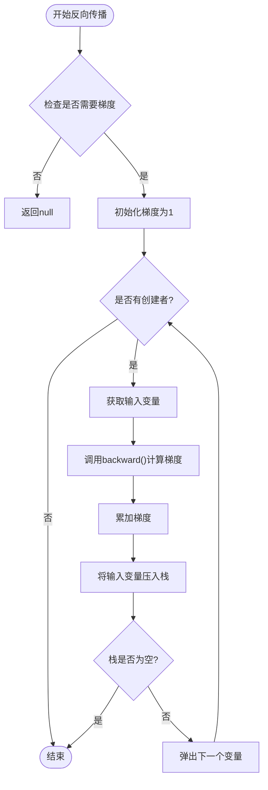
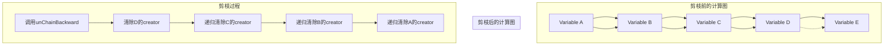

# 计算图管理与剪枝机制

<cite>
**本文档引用的文件**
- [Variable.java](file://tinyai-dl-func/src/main/java/io/leavesfly/tinyai/func/Variable.java)
- [Function.java](file://tinyai-dl-func/src/main/java/io/leavesfly/tinyai/func/Function.java)
- [Config.java](file://tinyai-dl-func/src/main/java/io/leavesfly/tinyai/util/Config.java)
- [Squ.java](file://tinyai-dl-func/src/main/java/io/leavesfly/tinyai/func/math/Squ.java)
- [MatMul.java](file://tinyai-dl-func/src/main/java/io/leavesfly/tinyai/func/matrix/MatMul.java)
- [CompleteRnnExample.java](file://tinyai-dl-case/src/main/java/io/leavesfly/tinyai/example/rnn/CompleteRnnExample.java)
- [RnnCosExam.java](file://tinyai-dl-case/src/main/java/io/leavesfly/tinyai/example/regress/RnnCosExam.java)
- [SimpleRnnLayer.java](file://tinyai-dl-nnet/src/main/java/io/leavesfly/tinyai/nnet/layer/rnn/SimpleRnnLayer.java)
- [SimpleRnnBlock.java](file://tinyai-dl-nnet/src/main/java/io/leavesfly/tinyai/nnet/block/SimpleRnnBlock.java)
</cite>

## 目录
1. [简介](#简介)
2. [计算图基础架构](#计算图基础架构)
3. [Variable类详解](#variable类详解)
4. [Function类详解](#function类详解)
5. [反向传播机制](#反向传播机制)
6. [unChainBackward剪枝机制](#unchainbackward剪枝机制)
7. [RNN中的应用案例](#rnn中的应用案例)
8. [性能优化策略](#性能优化策略)
9. [最佳实践指南](#最佳实践指南)
10. [故障排除](#故障排除)

## 简介

TinyAI框架实现了一套完整的动态计算图管理系统，通过Variable和Function对象构建灵活的计算依赖关系。该系统的核心创新在于实现了智能的计算图剪枝机制，特别是通过`unChainBackward()`方法有效解决了RNN等序列模型中的梯度爆炸和内存泄漏问题。

计算图是深度学习框架的核心概念，它记录了前向传播过程中各变量之间的依赖关系，使得反向传播能够准确计算梯度。TinyAI的计算图系统不仅支持标准的前向传播，还提供了强大的剪枝功能，确保在长时间序列训练中不会出现内存溢出或梯度消失/爆炸问题。

## 计算图基础架构

### 核心组件关系



**图表来源**
- [Variable.java](file://tinyai-dl-func/src/main/java/io/leavesfly/tinyai/func/Variable.java#L39-L86)
- [Function.java](file://tinyai-dl-func/src/main/java/io/leavesfly/tinyai/func/Function.java#L15-L151)
- [Config.java](file://tinyai-dl-func/src/main/java/io/leavesfly/tinyai/util/Config.java#L10-L43)

### 计算图构建流程



**图表来源**
- [Function.java](file://tinyai-dl-func/src/main/java/io/leavesfly/tinyai/func/Function.java#L35-L75)

**章节来源**
- [Variable.java](file://tinyai-dl-func/src/main/java/io/leavesfly/tinyai/func/Variable.java#L39-L86)
- [Function.java](file://tinyai-dl-func/src/main/java/io/leavesfly/tinyai/func/Function.java#L15-L75)

## Variable类详解

Variable类是计算图系统的核心，它封装了数值数据和梯度信息，并维护与Function的引用关系。

### 核心属性

```java
private NdArray value;              // 变量的数值数据
private NdArray grad;               // 变量的梯度
private transient Function creator; // 创建该变量的Function
private boolean requireGrad = true; // 是否需要计算梯度
private String name;                // 变量名称（可选）
```

### 反向传播实现

Variable类提供了两种反向传播实现方式：

#### 递归实现（推荐）

```java
public void backward() {
    if (!requireGrad) {
        this.grad = null;
        return;
    }
    
    // 初始化梯度为1
    if (Objects.isNull(grad)) {
        setGrad(NdArray.ones(this.getValue().getShape()));
    }
    
    Function _creator = creator;
    if (!Objects.isNull(_creator)) {
        Variable[] _inputs = _creator.getInputs();
        List<NdArray> grads = _creator.backward(grad);
        
        int index = 0;
        for (Variable input : _inputs) {
            if (input.getGrad() != null) {
                input.setGrad(input.getGrad().add(grads.get(index)));
            } else {
                input.setGrad(grads.get(index));
            }
            input.backward();
            index++;
        }
    }
}
```

#### 迭代实现（用于深层网络）

```java
public void backwardIterative() {
    if (!requireGrad) {
        this.grad = null;
        return;
    }

    if (Objects.isNull(grad)) {
        setGrad(NdArray.ones(this.getValue().getShape()));
    }

    Stack<Variable> stack = new Stack<>();
    stack.push(this);

    while (!stack.isEmpty()) {
        Variable currentVar = stack.pop();
        Function currentCreator = currentVar.getCreator();
        
        if (Objects.isNull(currentCreator)) {
            continue;
        }

        Variable[] inputs = currentCreator.getInputs();
        List<NdArray> grads = currentCreator.backward(currentVar.getGrad());

        for (int i = 0; i < inputs.length; i++) {
            Variable input = inputs[i];
            NdArray grad = grads.get(i);
            
            if (input.getGrad() != null) {
                input.setGrad(input.getGrad().add(grad));
            } else {
                input.setGrad(grad);
            }
            
            if (input.getCreator() != null) {
                stack.push(input);
            }
        }
    }
}
```

**章节来源**
- [Variable.java](file://tinyai-dl-func/src/main/java/io/leavesfly/tinyai/func/Variable.java#L111-L188)

## Function类详解

Function类是所有数学操作的基础抽象类，定义了前向传播和反向传播的标准接口。

### 核心方法

#### call()方法 - 计算图构建入口

```java
public Variable call(Variable... _inputs) {
    // 输入验证
    if (_inputs.length != requireInputNum() && requireInputNum() > 0) {
        throw new RuntimeException("Function call inputs Variable requireInputNum error!");
    }

    // 提取NdArray值
    NdArray[] ndArrayInputs = Arrays.stream(_inputs)
            .filter(Objects::nonNull)
            .map(Variable::getValue)
            .toArray(NdArray[]::new);

    // 执行前向传播
    NdArray ndArrayOutput = forward(ndArrayInputs);

    // 创建输出变量
    Variable _output = new Variable(ndArrayOutput);

    // 只在训练模式下构建计算图
    if (Config.train) {
        this.inputs = _inputs;
        this.output = _output;
        _output.setCreator(this);
    }

    return _output;
}
```

### 具体函数实现示例

#### 平方函数（Squ）

```java
public class Squ extends Function {
    @Override
    public NdArray forward(NdArray... inputs) {
        return inputs[0].pow(2);
    }

    @Override
    public List<NdArray> backward(NdArray yGrad) {
        NdArray x = inputs[0].getValue();
        return Collections.singletonList(x.mulNum(2).mul(yGrad));
    }

    @Override
    public int requireInputNum() {
        return 1;
    }
}
```

#### 矩阵乘法（MatMul）

```java
public class MatMul extends Function {
    @Override
    public NdArray forward(NdArray... inputs) {
        NdArray x = inputs[0];
        NdArray w = inputs[1];
        return x.dot(w);
    }

    @Override
    public List<NdArray> backward(NdArray yGrad) {
        NdArray x = inputs[0].getValue();
        NdArray w = inputs[1].getValue();
        return Arrays.asList(yGrad.dot(w.transpose()), x.transpose().dot(yGrad));
    }

    @Override
    public int requireInputNum() {
        return 2;
    }
}
```

**章节来源**
- [Function.java](file://tinyai-dl-func/src/main/java/io/leavesfly/tinyai/func/Function.java#L35-L151)
- [Squ.java](file://tinyai-dl-func/src/main/java/io/leavesfly/tinyai/func/math/Squ.java#L15-L56)
- [MatMul.java](file://tinyai-dl-func/src/main/java/io/leavesfly/tinyai/func/matrix/MatMul.java#L15-L61)

## 反向传播机制

### 梯度累积机制

TinyAI实现了智能的梯度累积机制，支持多个下游节点对同一输入变量的梯度累加：

```java
// 累加梯度而不是直接设置，支持梯度复用
if (input.getGrad() != null) {
    input.setGrad(input.getGrad().add(grad));
} else {
    input.setGrad(grad);
}
```

这种设计允许：
- 多个输出变量共享同一个输入变量
- 自动梯度累加，无需手动处理
- 避免梯度覆盖问题

### 计算图遍历策略



**图表来源**
- [Variable.java](file://tinyai-dl-func/src/main/java/io/leavesfly/tinyai/func/Variable.java#L150-L188)

## unChainBackward剪枝机制

### 剪枝原理

`unChainBackward()`方法是TinyAI框架的核心创新之一，专门用于解决RNN等序列模型中的长期依赖问题。该方法通过切断计算图的creator引用，实现计算图的剪枝。

### 实现机制

```java
public void unChainBackward() {
    Function creatorFunc = creator;
    if (!Objects.isNull(creatorFunc)) {
        Variable[] xs = creatorFunc.getInputs();
        unChain();  // 清除当前变量的creator引用
        for (Variable x : xs) {
            x.unChainBackward();  // 递归剪枝
        }
    }
}

private void unChain() {
    creator = null;  // 清除creator引用
}
```

### 剪枝效果



**图表来源**
- [Variable.java](file://tinyai-dl-func/src/main/java/io/leavesfly/tinyai/func/Variable.java#L186-L230)

### Truncated Backpropagation Through Time (BPTT)

在RNN训练中，`unChainBackward()`方法对应于Truncated BPTT技术：

```java
// 在RNN训练循环中使用
for (int j = 0; j < batch.getSize(); j++) {
    Variable x = new Variable(xArray[j]).setName("x");
    Variable y = new Variable(yArray[j]).setName("y");
    Variable predict = model.forward(x);
    loss = loss.add(lossFunc.loss(y, predict));
}

model.clearGrads();
loss.backward();
optimizer.update();

// 截断计算图，防止梯度回传过长
loss.unChainBackward();
```

**章节来源**
- [Variable.java](file://tinyai-dl-func/src/main/java/io/leavesfly/tinyai/func/Variable.java#L186-L230)
- [CompleteRnnExample.java](file://tinyai-dl-case/src/main/java/io/leavesfly/tinyai/example/rnn/CompleteRnnExample.java#L140-L150)

## RNN中的应用案例

### SimpleRNN训练示例

```java
public static void trainModel(Model model, Adam optimizer, Loss lossFunc, 
                              List<Batch> batches, int maxEpoch) {
    for (int i = 0; i < maxEpoch; i++) {
        // 重置RNN状态
        model.resetState();

        float lossSum = 0f;
        int batchCount = 0;
        
        for (Batch batch : batches) {
            NdArray[] xArray = batch.getX();
            NdArray[] yArray = batch.getY();
            
            Variable loss = new Variable(0f);
            loss.setName("loss");
            
            for (int j = 0; j < batch.getSize(); j++) {
                Variable x = new Variable(xArray[j]).setName("x");
                Variable y = new Variable(yArray[j]).setName("y");
                Variable predict = model.forward(x);
                loss = loss.add(lossFunc.loss(y, predict));
            }

            model.clearGrads();
            loss.backward();
            optimizer.update();

            lossSum += loss.getValue().getNumber().floatValue() / batch.getSize();
            batchCount++;
            
            // 关键：截断计算图
            loss.unChainBackward();
        }
        
        if (i % (maxEpoch / 10) == 0 || (i == maxEpoch - 1)) {
            System.out.println("epoch: " + i + "  avg-loss:" + lossSum / batchCount);
        }
    }
}
```

### RNN层的状态管理

```java
@Override
public void resetState() {
    state = null;
    stateValue = null;
    currentBatchSize = -1; // 重置批大小记录
}

@Override
public Variable layerForward(Variable... inputs) {
    Variable x = inputs[0];
    int inputBatchSize = x.getValue().getShape().getRow();
    
    // 检测批大小变化，如果变化则重置状态
    if (currentBatchSize != -1 && currentBatchSize != inputBatchSize) {
        resetState();
    }
    currentBatchSize = inputBatchSize;

    // 第一次前向传播，没有前一时间步的隐藏状态
    if (Objects.isNull(state)) {
        prevState = null;
        xLinear = x.linear(x2h, b);
        state = xLinear.tanh();
        stateValue = state.getValue();
        preTanh = state;
    } else {
        // 后续前向传播，包含前一时间步的隐藏状态
        prevState = state;
        xLinear = x.linear(x2h, b);
        hLinear = new Variable(stateValue).linear(h2h, null);
        state = xLinear.add(hLinear).tanh();
        stateValue = state.getValue();
        preTanh = state;
    }
    return state;
}
```

**章节来源**
- [CompleteRnnExample.java](file://tinyai-dl-case/src/main/java/io/leavesfly/tinyai/example/rnn/CompleteRnnExample.java#L120-L187)
- [SimpleRnnLayer.java](file://tinyai-dl-nnet/src/main/java/io/leavesfly/tinyai/nnet/layer/rnn/SimpleRnnLayer.java#L80-L140)

## 性能优化策略

### 内存管理

1. **及时清理计算图**：在每次训练迭代后调用`unChainBackward()`
2. **批量处理**：合理设置批次大小，平衡内存使用和计算效率
3. **状态重置**：定期重置RNN状态，避免状态累积

### 计算优化

1. **梯度累积**：利用自动梯度累加机制减少手动处理
2. **迭代反向传播**：对于深层网络使用迭代实现避免栈溢出
3. **条件计算**：根据`requireGrad`标志决定是否进行梯度计算

### 内存泄漏防护

```java
// 推荐的训练循环模式
for (int epoch = 0; epoch < maxEpoch; epoch++) {
    model.resetState(); // 重置RNN状态
    
    for (Batch batch : batches) {
        // 前向传播
        Variable loss = computeLoss(batch);
        
        // 反向传播
        model.clearGrads();
        loss.backward();
        optimizer.update();
        
        // 关键步骤：截断计算图
        loss.unChainBackward();
    }
}
```

## 最佳实践指南

### 何时调用unChainBackward

1. **RNN训练**：每次完整序列处理后
2. **序列模型**：每处理一个时间步后
3. **批量训练**：每批数据处理完成后
4. **长序列**：超过一定时间步后

### 推荐的使用模式

```java
// 1. 基本使用模式
Variable loss = computeLoss(inputs);
loss.backward();
loss.unChainBackward(); // 必须调用

// 2. RNN训练模式
for (int timeStep = 0; timeStep < sequenceLength; timeStep++) {
    Variable output = rnnLayer.forward(input);
    Variable loss = lossFunc.compute(output, target);
    
    loss.backward();
    optimizer.update();
    loss.unChainBackward(); // 截断计算图
}

// 3. 批量训练模式
for (Batch batch : batches) {
    Variable loss = computeBatchLoss(batch);
    
    model.clearGrads();
    loss.backward();
    optimizer.update();
    loss.unChainBackward(); // 清理计算图
}
```

### 错误预防

1. **始终检查训练模式**：确保`Config.train`为`true`
2. **正确设置requireGrad**：根据需要设置变量的梯度需求
3. **及时清理状态**：在模型重置或状态变化时清理相关变量
4. **监控内存使用**：定期检查内存消耗，及时发现潜在泄漏

## 故障排除

### 常见问题及解决方案

#### 1. 内存泄漏

**症状**：训练过程中内存持续增长，最终导致OutOfMemoryError

**原因**：忘记调用`unChainBackward()`或`clearGrad()`

**解决方案**：
```java
// 确保在每次训练迭代后清理计算图
loss.unChainBackward();
// 或者手动清理梯度
x.clearGrad();
```

#### 2. 梯度消失/爆炸

**症状**：训练损失不下降或出现NaN值

**原因**：计算图过长，梯度在反向传播中累积

**解决方案**：
```java
// 使用Truncated BPTT技术
for (int timeStep = 0; timeStep < sequenceLength; timeStep++) {
    // 处理时间步...
    
    if (timeStep % bpttLength == 0) {
        loss.unChainBackward(); // 截断计算图
    }
}
```

#### 3. 计算图损坏

**症状**：反向传播失败或梯度计算错误

**原因**：计算图结构被意外修改

**解决方案**：
```java
// 确保在训练期间保持计算图完整性
Config.train = true; // 启用计算图构建
try {
    loss.backward();
} finally {
    Config.train = false; // 禁用计算图构建（如果需要）
}
```

#### 4. 性能问题

**症状**：训练速度过慢

**原因**：频繁的计算图重建或不必要的梯度计算

**解决方案**：
```java
// 使用迭代反向传播
loss.backwardIterative();

// 或者禁用不需要梯度的变量
Variable constant = new Variable(value, "constant", false);
```

### 调试技巧

1. **可视化计算图**：使用`Uml.getDotGraph(variable)`查看计算图结构
2. **检查梯度**：打印梯度值确认计算正确性
3. **逐步调试**：在关键位置添加断点检查变量状态
4. **内存监控**：使用JVM工具监控内存使用情况

通过掌握这些计算图管理和剪枝机制，开发者可以有效地构建和训练复杂的深度学习模型，特别是在处理序列数据时获得更好的性能和稳定性。