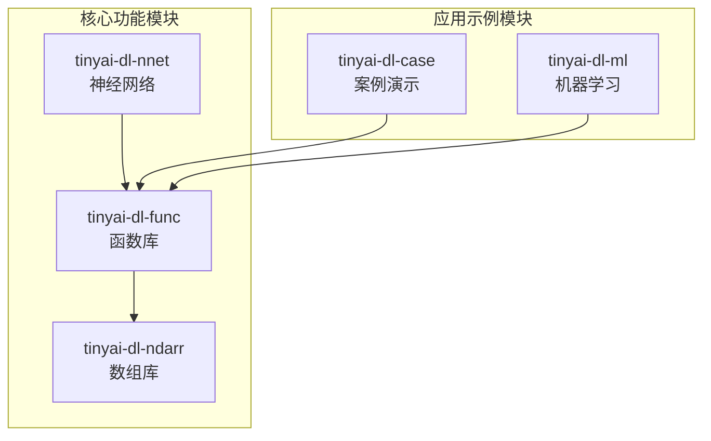
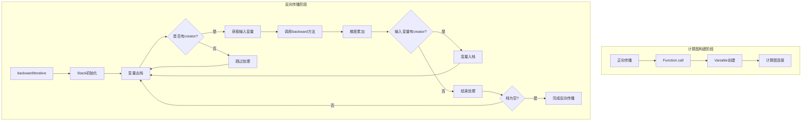
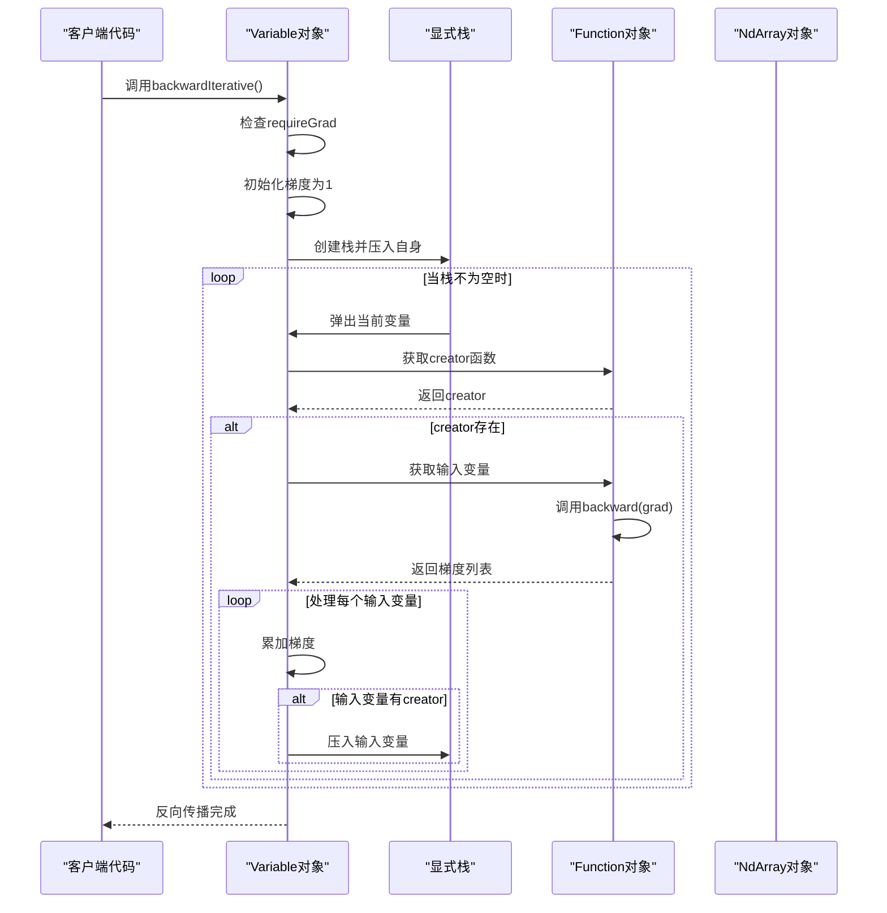
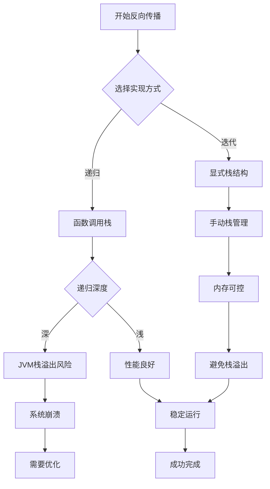
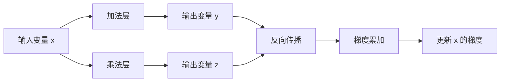
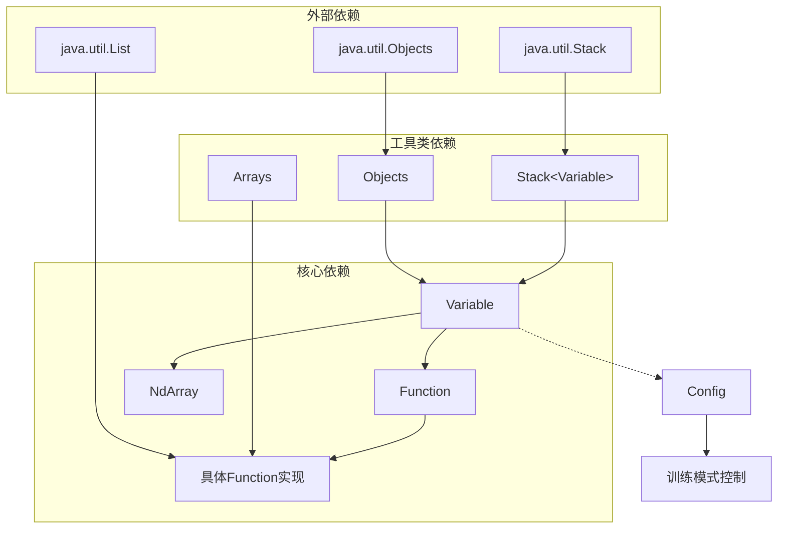

# 迭代式反向传播实现

<cite>
**本文档中引用的文件**
- [Variable.java](file://tinyai-dl-func/src/main/java/io/leavesfly/tinyai/func/Variable.java)
- [Function.java](file://tinyai-dl-func/src/main/java/io/leavesfly/tinyai/func/Function.java)
- [Add.java](file://tinyai-dl-func/src/main/java/io/leavesfly/tinyai/func/base/Add.java)
- [Mul.java](file://tinyai-dl-func/src/main/java/io/leavesfly/tinyai/func/base/Mul.java)
- [MatMul.java](file://tinyai-dl-func/src/main/java/io/leavesfly/tinyai/func/matrix/MatMul.java)
- [Neg.java](file://tinyai-dl-func/src/main/java/io/leavesfly/tinyai/func/base/Neg.java)
- [Div.java](file://tinyai-dl-func/src/main/java/io/leavesfly/tinyai/func/base/Div.java)
- [Sub.java](file://tinyai-dl-func/src/main/java/io/leavesfly/tinyai/func/base/Sub.java)
</cite>

## 目录
1. [简介](#简介)
2. [项目结构概述](#项目结构概述)
3. [核心组件分析](#核心组件分析)
4. [架构概览](#架构概览)
5. [详细组件分析](#详细组件分析)
6. [依赖关系分析](#依赖关系分析)
7. [性能考虑](#性能考虑)
8. [故障排除指南](#故障排除指南)
9. [结论](#结论)

## 简介

TinyDL深度学习框架中的迭代式反向传播实现是一个重要的工程创新，它通过显式栈结构替代传统的递归调用来实现反向传播算法。这种方法解决了传统递归实现可能遇到的JVM栈溢出问题，特别适用于深层神经网络和循环神经网络（RNN）等场景。

本文档详细阐述了`backwardIterative()`方法如何使用`Stack<Variable>`来模拟函数调用栈，逐层处理计算图节点，并对比分析了迭代实现相对于递归实现的优势。

## 项目结构概述

TinyDL项目采用模块化架构设计，其中反向传播功能主要集中在以下模块中：



**图表来源**
- [Variable.java](file://tinyai-dl-func/src/main/java/io/leavesfly/tinyai/func/Variable.java#L1-L50)
- [Function.java](file://tinyai-dl-func/src/main/java/io/leavesfly/tinyai/func/Function.java#L1-L50)

**章节来源**
- [Variable.java](file://tinyai-dl-func/src/main/java/io/leavesfly/tinyai/func/Variable.java#L1-L654)

## 核心组件分析

### Variable类的核心功能

`Variable`类是TinyDL框架中自动微分系统的核心组件，负责构建和维护计算图。它不仅包含变量的值（`NdArray`），还包含变量的梯度、生成该变量的函数等信息。

```java
public class Variable implements Serializable {
    private String name;              // 变量名称
    private NdArray value;            // 变量的值
    private NdArray grad;             // 变量的梯度
    private transient Function creator; // 生成该变量的函数
    private boolean requireGrad = true; // 是否需要计算梯度
}
```

### Function基类的设计模式

`Function`类是所有数学函数操作的基类，定义了前向传播和反向传播的接口，并负责构建计算图：

```java
public abstract class Function {
    protected Variable[] inputs;    // 输入变量数组
    protected Variable output;      // 输出变量
    public abstract NdArray forward(NdArray... inputs);
    public abstract List<NdArray> backward(NdArray yGrad);
    public abstract int requireInputNum();
}
```

**章节来源**
- [Variable.java](file://tinyai-dl-func/src/main/java/io/leavesfly/tinyai/func/Variable.java#L18-L60)
- [Function.java](file://tinyai-dl-func/src/main/java/io/leavesfly/tinyai/func/Function.java#L15-L152)

## 架构概览

迭代式反向传播实现的整体架构如下：



**图表来源**
- [Variable.java](file://tinyai-dl-func/src/main/java/io/leavesfly/tinyai/func/Variable.java#L150-L188)

## 详细组件分析

### backwardIterative()方法实现详解

`backwardIterative()`方法是迭代式反向传播的核心实现，它使用显式栈结构替代递归调用来避免JVM栈溢出问题：

```java
public void backwardIterative() {
    if (!requireGrad) {
        this.grad = null;
        return;
    }

    // 初始化梯度为1
    if (Objects.isNull(grad)) {
        setGrad(NdArray.ones(this.getValue().getShape()));
    }

    // 使用栈来模拟递归过程
    Stack<Variable> stack = new Stack<>();
    stack.push(this);

    while (!stack.isEmpty()) {
        Variable currentVar = stack.pop();
        Function currentCreator = currentVar.getCreator();
        
        if (Objects.isNull(currentCreator)) {
            continue;
        }

        Variable[] inputs = currentCreator.getInputs();
        List<NdArray> grads = currentCreator.backward(currentVar.getGrad());

        if (inputs.length != grads.size()) {
            throw new RuntimeException("Variable backward grads size error!");
        }

        for (int i = 0; i < inputs.length; i++) {
            Variable input = inputs[i];
            NdArray grad = grads.get(i);

            // 累加梯度而不是直接设置，支持梯度复用
            if (input.getGrad() != null) {
                input.setGrad(input.getGrad().add(grad));
            } else {
                input.setGrad(grad);
            }

            // 如果输入变量有创建者函数，将其加入栈中继续处理
            if (input.getCreator() != null) {
                stack.push(input);
            }
        }
    }
}
```

#### 方法执行流程分析



**图表来源**
- [Variable.java](file://tinyai-dl-func/src/main/java/io/leavesfly/tinyai/func/Variable.java#L150-L188)

### Function实现类的backward方法

不同的Function实现类提供了各自的反向传播计算逻辑。以下是几个典型实现的例子：

#### 加法函数的backward实现

```java
@Override
public List<NdArray> backward(NdArray yGrad) {
    NdArray gx0 = yGrad;
    NdArray gx1 = x1Shape.equals(x0Shape) ? yGrad : yGrad.sumTo(x1Shape);
    return Arrays.asList(gx0, gx1);
}
```

#### 乘法函数的backward实现

```java
@Override
public List<NdArray> backward(NdArray yGrad) {
    NdArray ndArray0 = inputs[0].getValue();
    NdArray ndArray1 = inputs[1].getValue();
    return Arrays.asList(yGrad.mul(ndArray1), yGrad.mul(ndArray0));
}
```

#### 矩阵乘法的backward实现

```java
@Override
public List<NdArray> backward(NdArray yGrad) {
    NdArray x = inputs[0].getValue();
    NdArray w = inputs[1].getValue();
    return Arrays.asList(yGrad.dot(w.transpose()), x.transpose().dot(yGrad));
}
```

**章节来源**
- [Variable.java](file://tinyai-dl-func/src/main/java/io/leavesfly/tinyai/func/Variable.java#L150-L188)
- [Add.java](file://tinyai-dl-func/src/main/java/io/leavesfly/tinyai/func/base/Add.java#L85-L95)
- [Mul.java](file://tinyai-dl-func/src/main/java/io/leavesfly/tinyai/func/base/Mul.java#L85-L90)
- [MatMul.java](file://tinyai-dl-func/src/main/java/io/leavesfly/tinyai/func/matrix/MatMul.java#L35-L40)

### 递归vs迭代实现对比分析

#### 递归实现的特点

```java
public void backward() {
    if (!requireGrad) {
        this.grad = null;
        return;
    }
    
    if (Objects.isNull(grad)) {
        setGrad(NdArray.ones(this.getValue().getShape()));
    }
    
    Function _creator = creator;
    if (!Objects.isNull(_creator)) {
        Variable[] _inputs = _creator.getInputs();
        List<NdArray> grads = _creator.backward(grad);
        
        if (_inputs.length != grads.size()) {
            throw new RuntimeException("Variable backward grads size error!");
        }
        
        int index = 0;
        for (Variable input : _inputs) {
            if (input.getGrad() != null) {
                input.setGrad(input.getGrad().add(grads.get(index)));
            } else {
                input.setGrad(grads.get(index));
            }
            input.backward(); // 递归调用
            index++;
        }
    }
}
```

#### 迭代实现的优势

1. **避免栈溢出风险**：深度网络或RNN中递归层数过多可能导致JVM栈溢出，迭代实现完全避免了这个问题

2. **更好的内存控制**：迭代实现可以更好地控制内存使用，特别是在处理大型计算图时

3. **潜在的性能提升**：减少了函数调用开销，特别是在浅层网络中可能获得性能优势

4. **调试便利性**：显式栈结构使得调试和监控计算图状态更加直观



**图表来源**
- [Variable.java](file://tinyai-dl-func/src/main/java/io/leavesfly/tinyai/func/Variable.java#L111-L148)
- [Variable.java](file://tinyai-dl-func/src/main/java/io/leavesfly/tinyai/func/Variable.java#L150-L188)

### 梯度累加机制

迭代式反向传播实现采用了梯度累加机制，这是深度学习框架中的一个重要设计原则：

```java
// 累加梯度而不是直接设置，支持梯度复用
if (input.getGrad() != null) {
    input.setGrad(input.getGrad().add(grad));
} else {
    input.setGrad(grad);
}
```

这种设计允许同一个输入变量被多个输出变量共享的情况，例如：



**图表来源**
- [Variable.java](file://tinyai-dl-func/src/main/java/io/leavesfly/tinyai/func/Variable.java#L180-L185)

**章节来源**
- [Variable.java](file://tinyai-dl-func/src/main/java/io/leavesfly/tinyai/func/Variable.java#L111-L148)
- [Variable.java](file://tinyai-dl-func/src/main/java/io/leavesfly/tinyai/func/Variable.java#L150-L188)

## 依赖关系分析

迭代式反向传播实现涉及多个组件之间的复杂依赖关系：



**图表来源**
- [Variable.java](file://tinyai-dl-func/src/main/java/io/leavesfly/tinyai/func/Variable.java#L1-L20)
- [Function.java](file://tinyai-dl-func/src/main/java/io/leavesfly/tinyai/func/Function.java#L1-L15)

**章节来源**
- [Variable.java](file://tinyai-dl-func/src/main/java/io/leavesfly/tinyai/func/Variable.java#L1-L20)
- [Function.java](file://tinyai-dl-func/src/main/java/io/leavesfly/tinyai/func/Function.java#L1-L15)

## 性能考虑

### 内存使用优化

迭代式反向传播实现相比递归实现具有更好的内存控制能力：

1. **栈空间控制**：显式栈的大小可以根据实际需求动态调整
2. **垃圾回收友好**：避免了大量临时对象的创建
3. **缓存局部性**：连续的内存访问模式提高了CPU缓存命中率

### 性能测试建议

为了评估迭代式反向传播的性能，建议进行以下测试：

```java
// 性能测试示例
public void benchmarkBackwardMethods() {
    // 创建不同规模的计算图
    Variable input = new Variable(NdArray.of(new float[100][100]));
    
    // 构建深层网络
    Variable output = input;
    for (int i = 0; i < 1000; i++) {
        output = output.add(output); // 模拟深层网络
    }
    
    // 测试递归实现
    long startTime = System.nanoTime();
    output.backward();
    long recursiveTime = System.nanoTime() - startTime;
    
    // 清理梯度
    output.clearGrad();
    
    // 测试迭代实现
    startTime = System.nanoTime();
    output.backwardIterative();
    long iterativeTime = System.nanoTime() - startTime;
    
    System.out.println("递归实现时间: " + recursiveTime);
    System.out.println("迭代实现时间: " + iterativeTime);
    System.out.println("性能提升: " + (recursiveTime - iterativeTime));
}
```

### 工程意义

迭代式反向传播实现对于构建大规模深度学习模型具有重要意义：

1. **稳定性增强**：避免了因递归深度过大导致的系统崩溃
2. **可扩展性**：支持更大规模的网络架构
3. **生产环境适用性**：更适合工业级应用部署
4. **调试友好性**：显式的栈结构便于问题诊断

## 故障排除指南

### 常见问题及解决方案

#### 1. 梯度尺寸不匹配错误

```java
if (inputs.length != grads.size()) {
    throw new RuntimeException("Variable backward grads size error!");
}
```

**解决方案**：
- 检查Function实现的backward方法是否正确返回了相应数量的梯度
- 确保输入变量数量与backward方法期望的数量一致

#### 2. 内存泄漏问题

**症状**：长时间运行后内存使用持续增长

**解决方案**：
- 定期调用`clearGrad()`清理梯度
- 使用`unChainBackward()`切断不必要的计算图分支

#### 3. 梯度累积异常

**症状**：梯度值异常大或异常小

**解决方案**：
- 检查梯度累加逻辑是否正确
- 添加梯度裁剪（gradient clipping）机制

**章节来源**
- [Variable.java](file://tinyai-dl-func/src/main/java/io/leavesfly/tinyai/func/Variable.java#L170-L175)
- [Variable.java](file://tinyai-dl-func/src/main/java/io/leavesfly/tinyai/func/Variable.java#L210-L230)

## 结论

迭代式反向传播实现是TinyDL框架中的一个重要技术突破，它通过显式栈结构有效解决了传统递归实现的局限性。该实现不仅提高了系统的稳定性和可扩展性，还为构建大规模深度学习模型提供了坚实的技术基础。

### 主要优势总结

1. **稳定性**：完全避免了JVM栈溢出问题
2. **性能**：在适当场景下可能获得性能提升
3. **可维护性**：清晰的代码结构便于理解和维护
4. **工程实用性**：更适合生产环境部署

### 未来发展方向

1. **并行化改进**：探索多线程并行反向传播的可能性
2. **内存优化**：进一步减少内存占用和GC压力
3. **GPU加速**：结合GPU计算能力提升整体性能
4. **自动优化**：根据网络结构自动选择最优的反向传播策略

通过深入理解迭代式反向传播实现的原理和优势，开发者可以更好地利用TinyDL框架构建高效、稳定的深度学习应用。