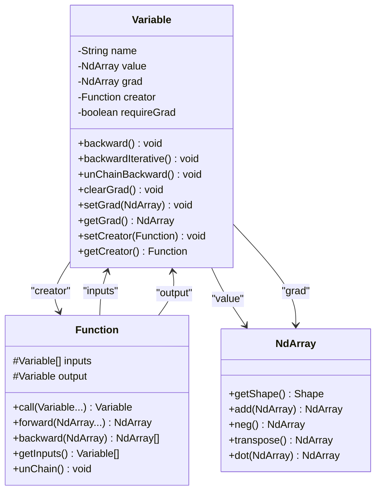
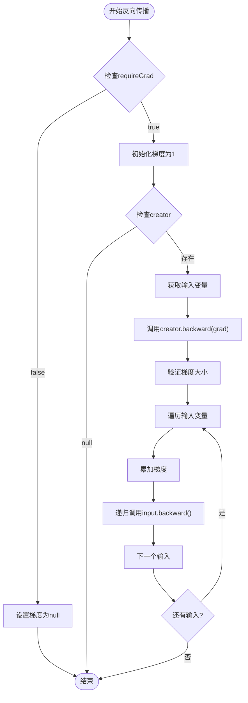
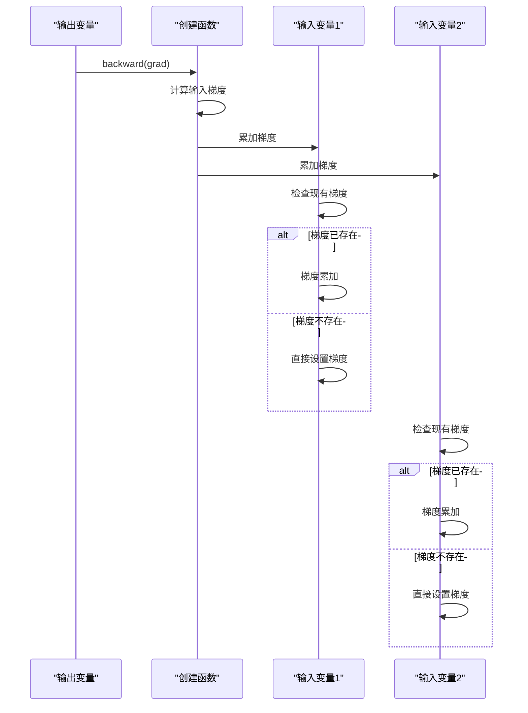
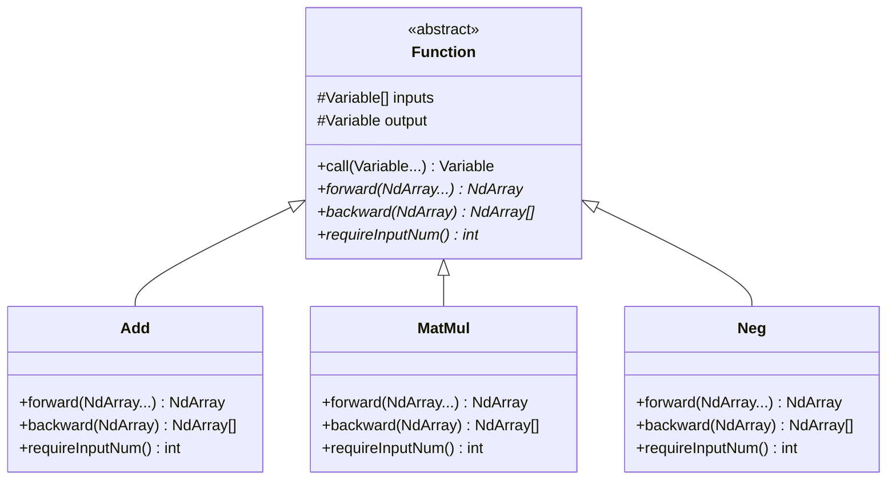
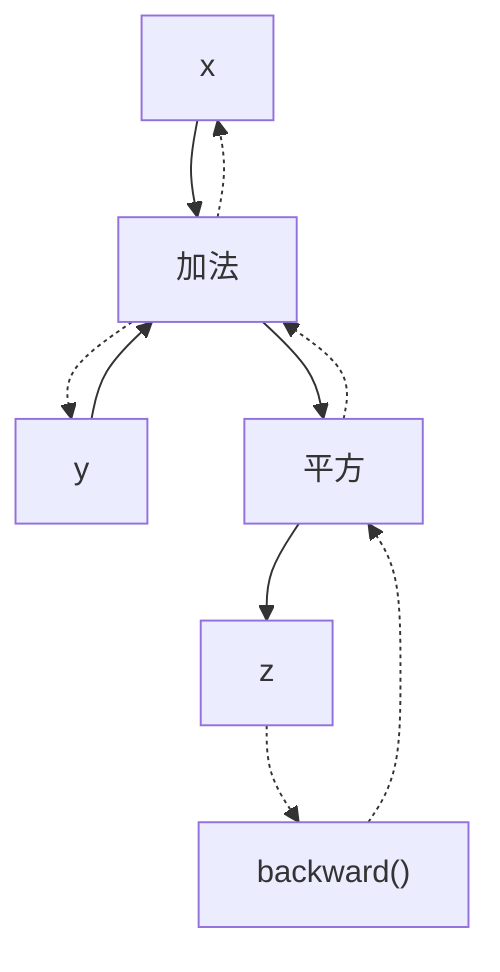
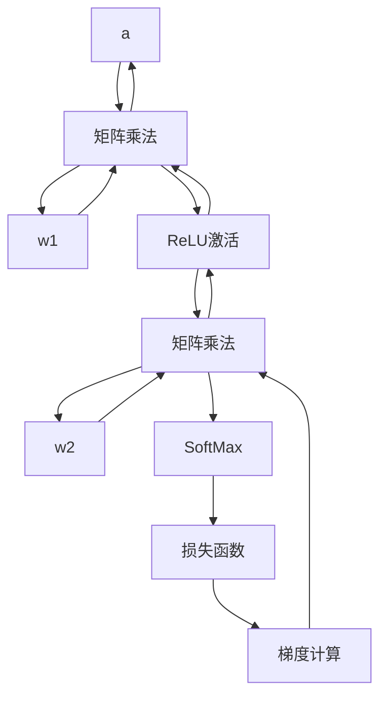

# Variable类中backward()方法递归实现机制详解

<cite>
**本文档中引用的文件**
- [Variable.java](file://tinyai-dl-func/src/main/java/io/leavesfly/tinyai/func/Variable.java)
- [Function.java](file://tinyai-dl-func/src/main/java/io/leavesfly/tinyai/func/Function.java)
- [Add.java](file://tinyai-dl-func/src/main/java/io/leavesfly/tinyai/func/base/Add.java)
- [MatMul.java](file://tinyai-dl-func/src/main/java/io/leavesfly/tinyai/func/matrix/MatMul.java)
- [Neg.java](file://tinyai-dl-func/src/main/java/io/leavesfly/tinyai/func/base/Neg.java)
- [VariableTest.java](file://tinyai-dl-func/src/test/java/io/leavesfly/tinyai/func/VariableTest.java)
</cite>

## 目录
1. [简介](#简介)
2. [Variable类核心概念](#variable类核心概念)
3. [递归反向传播机制架构](#递归反向传播机制架构)
4. [backward()方法详细分析](#backward方法详细分析)
5. [梯度初始化与传播策略](#梯度初始化与传播策略)
6. [计算图构建与遍历](#计算图构建与遍历)
7. [递归深度与性能考虑](#递归深度与性能考虑)
8. [实际应用示例](#实际应用示例)
9. [故障排除指南](#故障排除指南)
10. [结论](#结论)

## 简介

在TinyDL深度学习框架中，Variable类是自动微分系统的核心组件，负责构建和维护计算图。backward()方法实现了递归的反向传播机制，从当前变量出发，通过creator函数指针递归遍历整个计算图，完成梯度的自动计算和传播。

## Variable类核心概念

Variable类是对数学变量的抽象表示，它不仅包含变量的值(NdArray)，还包含变量的梯度、生成该变量的函数等信息。这些属性共同构成了自动微分系统的基础。



**图表来源**
- [Variable.java](file://tinyai-dl-func/src/main/java/io/leavesfly/tinyai/func/Variable.java#L18-L60)
- [Function.java](file://tinyai-dl-func/src/main/java/io/leavesfly/tinyai/func/Function.java#L15-L30)

**章节来源**
- [Variable.java](file://tinyai-dl-func/src/main/java/io/leavesfly/tinyai/func/Variable.java#L18-L60)

## 递归反向传播机制架构

递归反向传播机制基于计算图的拓扑结构，从输出变量开始，沿着计算图向上追溯，逐层计算每个中间变量的梯度。



**图表来源**
- [Variable.java](file://tinyai-dl-func/src/main/java/io/leavesfly/tinyai/func/Variable.java#L111-L148)

## backward()方法详细分析

### 方法签名与入口检查

```java
public void backward() {
    if (!requireGrad) {
        this.grad = null;
        return;
    }
```

方法首先检查变量是否需要计算梯度。如果`requireGrad`为false，则直接将梯度设置为null并返回，避免不必要的计算。

### 梯度初始化策略

```java
if (Objects.isNull(grad)) {
    setGrad(NdArray.ones(this.getValue().getShape()));
}
```

当梯度未初始化时，系统会自动初始化为全1的数组。这种初始化策略基于链式法则的初始条件：∂L/∂L = 1，其中L是最终的损失函数。

### 递归遍历计算图

```java
Function _creator = creator;
if (!Objects.isNull(_creator)) {
    Variable[] _inputs = _creator.getInputs();
    List<NdArray> grads = _creator.backward(grad);
```

这里的关键是通过`creator`属性获取生成当前变量的函数对象，然后调用其`backward()`方法计算输入变量的梯度。

### 梯度累加机制

```java
for (Variable input : _inputs) {
    if (input.getGrad() != null) {
        input.setGrad(input.getGrad().add(grads.get(index)));
    } else {
        input.setGrad(grads.get(index));
    }
    input.backward();
    index++;
}
```

这是递归反向传播的核心机制。系统采用累加而非覆盖的方式处理梯度，这支持了多路径梯度聚合的重要特性。

**章节来源**
- [Variable.java](file://tinyai-dl-func/src/main/java/io/leavesfly/tinyai/func/Variable.java#L111-L148)

## 梯度初始化与传播策略

### 默认梯度初始化

系统采用∂L/∂L = 1的默认初始化策略，这是基于微积分的基本原理：

- **数学原理**：对于最终的损失函数L，∂L/∂L = 1
- **实现方式**：使用`NdArray.ones(this.getValue().getShape())`
- **适用场景**：大多数情况下，特别是当Variable是计算图的终点时

### 梯度累加vs覆盖



**图表来源**
- [Variable.java](file://tinyai-dl-func/src/main/java/io/leavesfly/tinyai/func/Variable.java#L130-L140)

### 多路径梯度聚合

这种累加机制支持复杂的计算图结构中的梯度聚合：

- **分支结构**：多个操作可能共享同一个输入变量
- **循环结构**：RNN等模型中的重复计算
- **并行计算**：多个独立操作的结果可能影响同一输入

**章节来源**
- [Variable.java](file://tinyai-dl-func/src/main/java/io/leavesfly/tinyai/func/Variable.java#L130-L140)

## 计算图构建与遍历

### 计算图的动态构建

```java
// 只在训练模式下构建计算图
if (Config.train) {
    this.inputs = _inputs;
    this.output = _output;
    _output.setCreator(this);
}
```

计算图的构建是动态的，只有在`Config.train`为true时才会进行。这种设计允许在推理模式下禁用计算图构建以提高性能。

### Function类的作用

Function类作为计算图中各个操作节点的抽象基类，定义了前向传播和反向传播的标准接口：



**图表来源**
- [Function.java](file://tinyai-dl-func/src/main/java/io/leavesfly/tinyai/func/Function.java#L15-L30)
- [Add.java](file://tinyai-dl-func/src/main/java/io/leavesfly/tinyai/func/base/Add.java#L15-L25)
- [MatMul.java](file://tinyai-dl-func/src/main/java/io/leavesfly/tinyai/func/matrix/MatMul.java#L10-L20)

### 具体Function实现示例

以加法操作为例，展示了如何实现反向传播：

```java
@Override
public List<NdArray> backward(NdArray yGrad) {
    NdArray gx0 = yGrad;
    NdArray gx1 = x1Shape.equals(x0Shape) ? yGrad : yGrad.sumTo(x1Shape);
    return Arrays.asList(gx0, gx1);
}
```

对于矩阵乘法：

```java
@Override
public List<NdArray> backward(NdArray yGrad) {
    NdArray x = inputs[0].getValue();
    NdArray w = inputs[1].getValue();
    return Arrays.asList(yGrad.dot(w.transpose()), x.transpose().dot(yGrad));
}
```

**章节来源**
- [Function.java](file://tinyai-dl-func/src/main/java/io/leavesfly/tinyai/func/Function.java#L30-L152)
- [Add.java](file://tinyai-dl-func/src/main/java/io/leavesfly/tinyai/func/base/Add.java#L80-L95)
- [MatMul.java](file://tinyai-dl-func/src/main/java/io/leavesfly/tinyai/func/matrix/MatMul.java#L30-L45)

## 递归深度与性能考虑

### 递归实现的优势

递归实现具有以下优势：

1. **代码简洁性**：递归实现逻辑清晰，易于理解和维护
2. **自然表达**：与数学上的链式法则表达方式一致
3. **自动栈管理**：利用JVM的栈管理机制，减少手动内存管理

### 递归深度过大风险

递归实现的主要风险是栈溢出：

```java
// 当前采用的是递归调用，为了效率可用堆栈循环
```

Variable类提供了迭代版本的backward方法来解决这个问题：

```java
public void backwardIterative() {
    // 使用栈来模拟递归过程
    Stack<Variable> stack = new Stack<>();
    stack.push(this);
    
    while (!stack.isEmpty()) {
        Variable currentVar = stack.pop();
        // 迭代处理逻辑...
    }
}
```

### 性能优化建议

1. **及时切断计算图**：使用`unChainBackward()`方法防止过深的递归
2. **选择合适的实现**：对于深层网络，优先使用`backwardIterative()`
3. **监控递归深度**：在调试阶段监控递归调用的深度

**章节来源**
- [Variable.java](file://tinyai-dl-func/src/main/java/io/leavesfly/tinyai/func/Variable.java#L117-L120)
- [Variable.java](file://tinyai-dl-func/src/main/java/io/leavesfly/tinyai/func/Variable.java#L150-L230)

## 实际应用示例

### 简单计算图示例

假设我们有一个简单的计算图：`z = (x + y)^2`



**图表来源**
- [VariableTest.java](file://tinyai-dl-func/src/test/java/io/leavesfly/tinyai/func/VariableTest.java#L313-L340)

### 复杂计算图示例

考虑一个包含多个操作节点的复杂计算图：



### 递归执行顺序

在上述复杂计算图中，backward()方法的执行顺序如下：

1. **第一轮**：从LOSS变量开始，调用其creator的backward()
2. **第二轮**：处理SOFTMAX的输出，调用其creator的backward()
3. **第三轮**：处理MATMUL2的输出，调用其creator的backward()
4. **第四轮**：处理MATMUL1的输出，调用其creator的backward()
5. **第五轮**：处理ReLU激活的输出，调用其creator的backward()

**章节来源**
- [VariableTest.java](file://tinyai-dl-func/src/test/java/io/leavesfly/tinyai/func/VariableTest.java#L313-L364)

## 故障排除指南

### 常见错误类型

1. **梯度大小不匹配错误**
```java
if (inputs.length != grads.size()) {
    throw new RuntimeException("Variable backward grads size error!");
}
```
**解决方案**：检查Function实现中的backward()方法，确保返回的梯度列表大小与输入变量数量一致。

2. **空指针异常**
```java
if (Objects.isNull(grad)) {
    setGrad(NdArray.ones(this.getValue().getShape()));
}
```
**解决方案**：确保在调用backward()之前正确设置了输出变量的梯度。

### 调试技巧

1. **启用训练模式**：确保`Config.train = true`
2. **检查计算图完整性**：验证creator引用是否正确设置
3. **监控梯度值**：使用断点或日志记录梯度值的变化

### 性能诊断

1. **递归深度监控**：在调试版本中添加递归深度计数器
2. **内存使用分析**：监控梯度缓存的内存使用情况
3. **计算时间测量**：比较递归和迭代实现的性能差异

**章节来源**
- [Variable.java](file://tinyai-dl-func/src/main/java/io/leavesfly/tinyai/func/Variable.java#L135-L140)
- [VariableTest.java](file://tinyai-dl-func/src/test/java/io/leavesfly/tinyai/func/VariableTest.java#L360-L407)

## 结论

Variable类中的backward()方法递归实现机制是TinyDL框架自动微分系统的核心。它通过以下关键特性实现了高效的梯度计算：

1. **递归遍历**：从输出变量出发，沿计算图向上追溯
2. **梯度累加**：支持多路径梯度聚合，满足复杂的计算图需求
3. **动态构建**：按需构建计算图，提高运行时性能
4. **灵活实现**：提供递归和迭代两种实现方式，适应不同的应用场景

这种设计既保证了代码的简洁性和可维护性，又提供了强大的功能支持。理解这一机制对于正确使用TinyDL框架和开发自定义操作至关重要。

在实际应用中，开发者应该根据具体需求选择合适的实现方式，并注意递归深度控制和性能优化。通过合理使用计算图切断机制和迭代实现，可以有效避免栈溢出问题，确保系统的稳定运行。