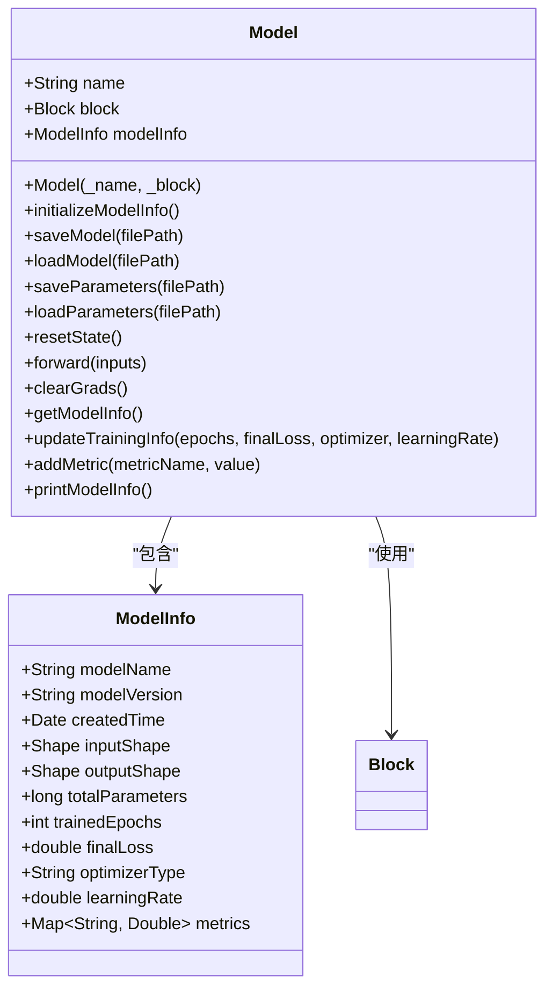
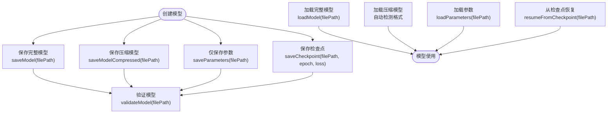
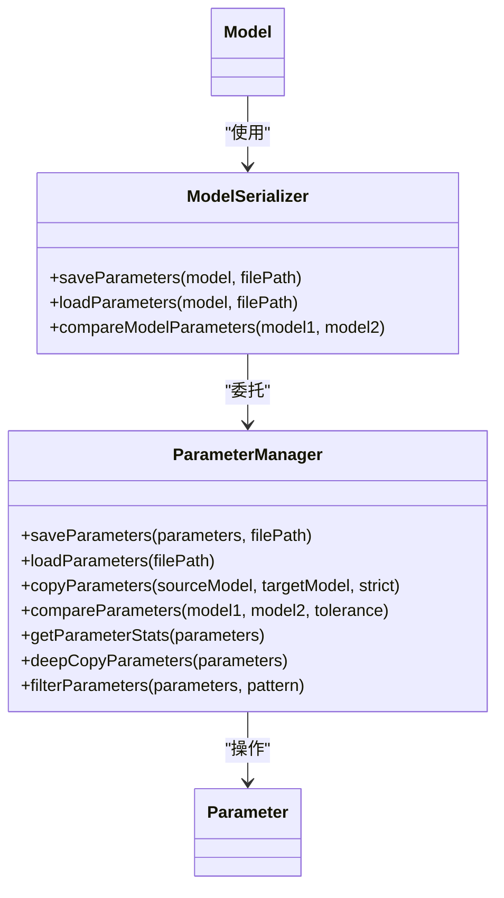
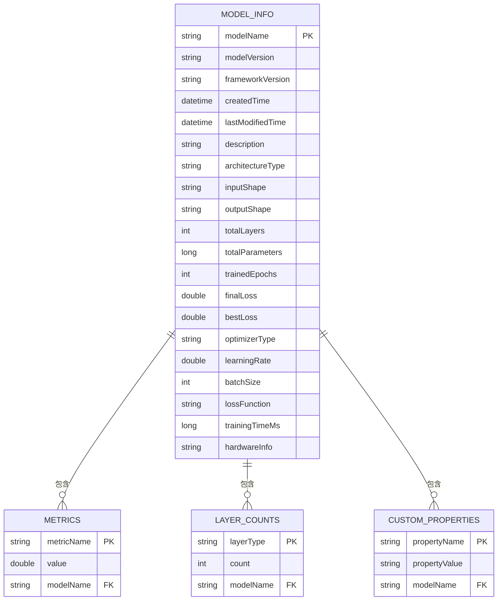
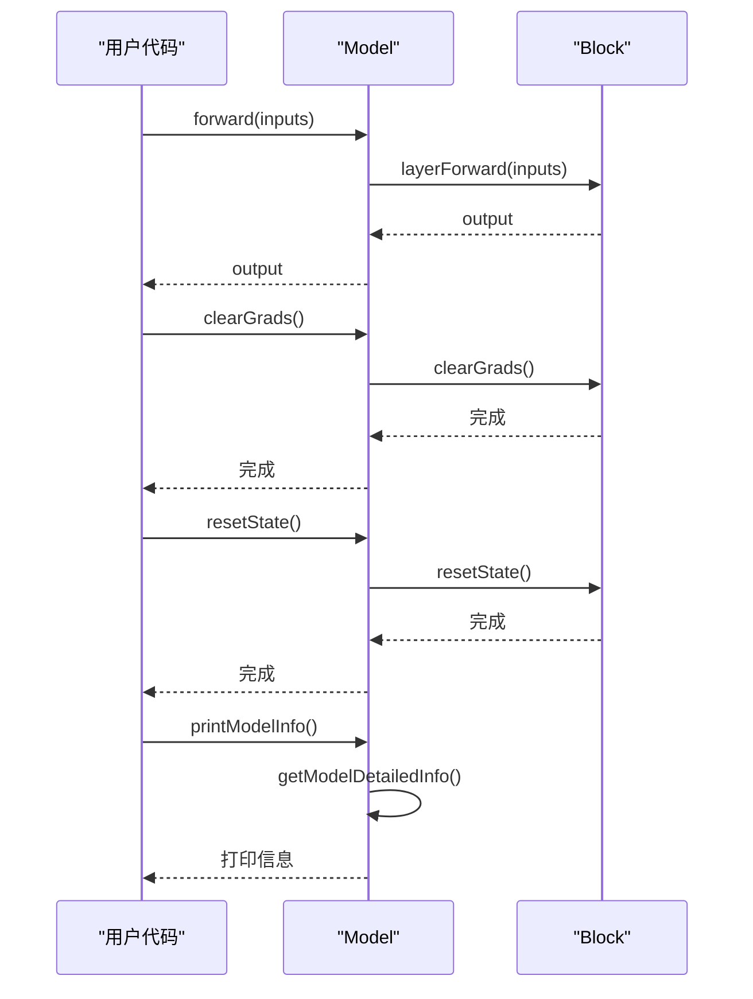
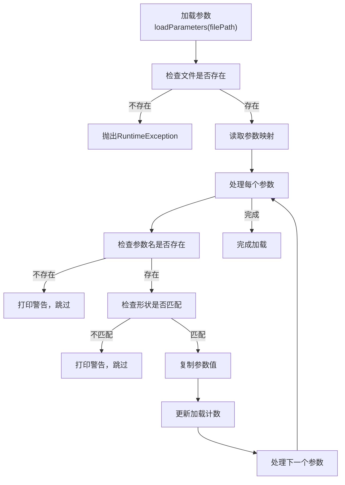
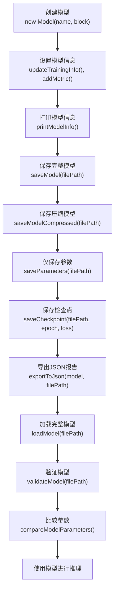

# 模型管理API

<cite>
**本文档中引用的文件**
- [Model.java](file://tinyai-dl-ml/src/main/java/io/leavesfly/tinyai/ml/Model.java)
- [ModelInfo.java](file://tinyai-dl-ml/src/main/java/io/leavesfly/tinyai/ml/ModelInfo.java)
- [ModelSerializer.java](file://tinyai-dl-ml/src/main/java/io/leavesfly/tinyai/ml/ModelSerializer.java)
- [ParameterManager.java](file://tinyai-dl-ml/src/main/java/io/leavesfly/tinyai/ml/ParameterManager.java)
- [ModelInfoExporter.java](file://tinyai-dl-ml/src/main/java/io/leavesfly/tinyai/ml/ModelInfoExporter.java)
- [ModelSerializationExample.java](file://tinyai-dl-case/src/main/java/io/leavesfly/tinyai/example/ModelSerializationExample.java)
</cite>

## 目录
1. [简介](#简介)
2. [模型生命周期管理](#模型生命周期管理)
3. [模型序列化机制](#模型序列化机制)
4. [参数管理功能](#参数管理功能)
5. [模型信息管理](#模型信息管理)
6. [运行时操作方法](#运行时操作方法)
7. [异常处理与最佳实践](#异常处理与最佳实践)
8. [完整示例](#完整示例)

## 简介
模型管理API为TinyAI框架提供了完整的模型创建、保存、加载和参数管理功能。该API以Model类为核心，结合ModelInfo、ModelSerializer、ParameterManager等辅助类，实现了模型的全生命周期管理。API设计注重类型安全、性能优化和易用性，支持多种序列化格式和灵活的参数操作。

**Section sources**
- [Model.java](file://tinyai-dl-ml/src/main/java/io/leavesfly/tinyai/ml/Model.java#L1-L50)

## 模型生命周期管理

### 模型创建与初始化
模型通过Model类的构造函数创建，需要提供模型名称和神经网络结构（Block）。构造函数会自动初始化模型信息，包括输入输出形状、参数数量和架构类型。

**Diagram sources**
- [Model.java](file://tinyai-dl-ml/src/main/java/io/leavesfly/tinyai/ml/Model.java#L1-L50)
- [ModelInfo.java](file://tinyai-dl-ml/src/main/java/io/leavesfly/tinyai/ml/ModelInfo.java#L1-L50)

**Section sources**
- [Model.java](file://tinyai-dl-ml/src/main/java/io/leavesfly/tinyai/ml/Model.java#L50-L100)

## 模型序列化机制

### 序列化格式与推荐实践
模型序列化支持多种格式，包括完整模型、压缩模型、仅参数文件和检查点。推荐使用ModelSerializer类而非传统的Java序列化，以获得更好的性能和功能。

**Diagram sources**
- [ModelSerializer.java](file://tinyai-dl-ml/src/main/java/io/leavesfly/tinyai/ml/ModelSerializer.java#L1-L100)
- [Model.java](file://tinyai-dl-ml/src/main/java/io/leavesfly/tinyai/ml/Model.java#L150-L250)

**Section sources**
- [ModelSerializer.java](file://tinyai-dl-ml/src/main/java/io/leavesfly/tinyai/ml/ModelSerializer.java#L1-L200)
- [Model.java](file://tinyai-dl-ml/src/main/java/io/leavesfly/tinyai/ml/Model.java#L150-L250)

## 参数管理功能

### 参数操作与管理
ParameterManager类提供了专门的参数操作功能，包括参数保存、加载、复制、比较和统计。这些功能支持在不同模型间灵活地管理参数。

**Diagram sources**
- [ParameterManager.java](file://tinyai-dl-ml/src/main/java/io/leavesfly/tinyai/ml/ParameterManager.java#L1-L50)
- [ModelSerializer.java](file://tinyai-dl-ml/src/main/java/io/leavesfly/tinyai/ml/ModelSerializer.java#L200-L300)

**Section sources**
- [ParameterManager.java](file://tinyai-dl-ml/src/main/java/io/leavesfly/tinyai/ml/ParameterManager.java#L1-L300)
- [ModelSerializer.java](file://tinyai-dl-ml/src/main/java/io/leavesfly/tinyai/ml/ModelSerializer.java#L200-L300)

## 模型信息管理

### ModelInfo类结构与功能
ModelInfo类负责收集和存储模型的元数据，包括基本信息、架构信息、训练信息和性能指标。这些信息可用于模型的监控、比较和文档化。

**Diagram sources**
- [ModelInfo.java](file://tinyai-dl-ml/src/main/java/io/leavesfly/tinyai/ml/ModelInfo.java#L1-L100)
- [ModelInfoExporter.java](file://tinyai-dl-ml/src/main/java/io/leavesfly/tinyai/ml/ModelInfoExporter.java#L1-L50)

**Section sources**
- [ModelInfo.java](file://tinyai-dl-ml/src/main/java/io/leavesfly/tinyai/ml/ModelInfo.java#L1-L200)
- [ModelInfoExporter.java](file://tinyai-dl-ml/src/main/java/io/leavesfly/tinyai/ml/ModelInfoExporter.java#L1-L100)

## 运行时操作方法

### 核心运行时方法
模型提供了多种运行时操作方法，用于模型的前向传播、状态管理和梯度处理。这些方法是模型训练和推理过程中的关键操作。

**Diagram sources**
- [Model.java](file://tinyai-dl-ml/src/main/java/io/leavesfly/tinyai/ml/Model.java#L250-L350)
- [ModelInfo.java](file://tinyai-dl-ml/src/main/java/io/leavesfly/tinyai/ml/ModelInfo.java#L200-L300)

**Section sources**
- [Model.java](file://tinyai-dl-ml/src/main/java/io/leavesfly/tinyai/ml/Model.java#L250-L350)

## 异常处理与最佳实践

### 异常处理策略
API提供了全面的异常处理机制，包括详细的错误消息、渐进式错误恢复和用户友好的警告提示。在参数加载时，会进行形状匹配检查，并自动跳过不匹配的参数。

**Diagram sources**
- [ModelSerializer.java](file://tinyai-dl-ml/src/main/java/io/leavesfly/tinyai/ml/ModelSerializer.java#L250-L350)
- [ParameterManager.java](file://tinyai-dl-ml/src/main/java/io/leavesfly/tinyai/ml/ParameterManager.java#L300-L400)

**Section sources**
- [ModelSerializer.java](file://tinyai-dl-ml/src/main/java/io/leavesfly/tinyai/ml/ModelSerializer.java#L250-L350)
- [ParameterManager.java](file://tinyai-dl-ml/src/main/java/io/leavesfly/tinyai/ml/ParameterManager.java#L300-L400)

## 完整示例

### 模型生命周期完整示例
以下示例展示了模型从创建到持久化的完整生命周期管理，包括模型创建、信息设置、保存、加载和验证。

**Diagram sources**
- [ModelSerializationExample.java](file://tinyai-dl-case/src/main/java/io/leavesfly/tinyai/example/ModelSerializationExample.java#L1-L200)
- [Model.java](file://tinyai-dl-ml/src/main/java/io/leavesfly/tinyai/ml/Model.java#L1-L360)

**Section sources**
- [ModelSerializationExample.java](file://tinyai-dl-case/src/main/java/io/leavesfly/tinyai/example/ModelSerializationExample.java#L1-L300)
- [Model.java](file://tinyai-dl-ml/src/main/java/io/leavesfly/tinyai/ml/Model.java#L1-L360)