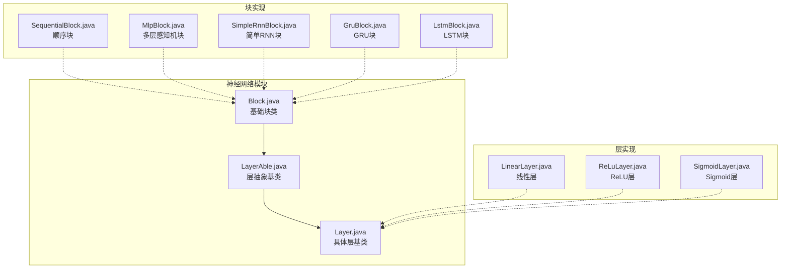
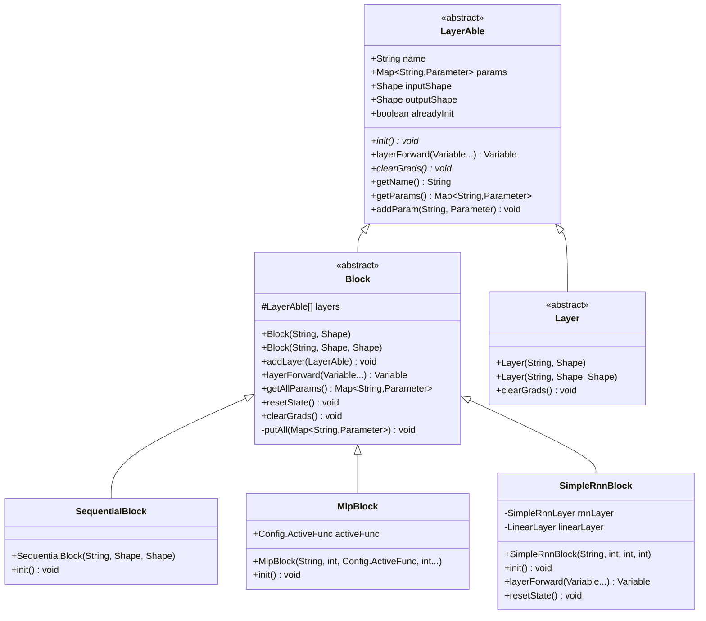
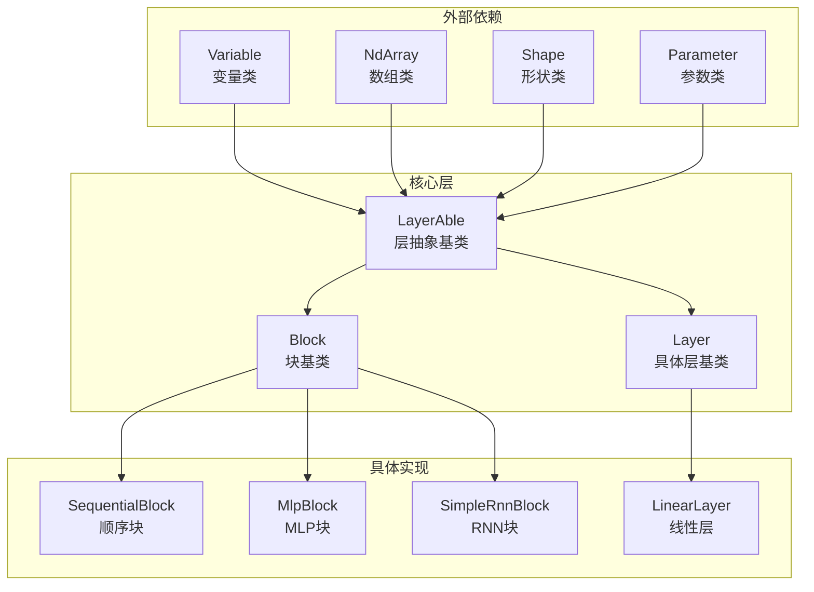

# 网络块API文档

<cite>
**本文档中引用的文件**
- [Block.java](file://tinyai-dl-nnet/src/main/java/io/leavesfly/tinyai/nnet/Block.java)
- [LayerAble.java](file://tinyai-dl-nnet/src/main/java/io/leavesfly/tinyai/nnet/LayerAble.java)
- [Layer.java](file://tinyai-dl-nnet/src/main/java/io/leavesfly/tinyai/nnet/Layer.java)
- [SequentialBlock.java](file://tinyai-dl-nnet/src/main/java/io/leavesfly/tinyai/nnet/block/SequentialBlock.java)
- [MlpBlock.java](file://tinyai-dl-nnet/src/main/java/io/leavesfly/tinyai/nnet/block/MlpBlock.java)
- [SimpleRnnBlock.java](file://tinyai-dl-nnet/src/main/java/io/leavesfly/tinyai/nnet/block/SimpleRnnBlock.java)
- [GruBlock.java](file://tinyai-dl-nnet/src/main/java/io/leavesfly/tinyai/nnet/block/GruBlock.java)
- [LstmBlock.java](file://tinyai-dl-nnet/src/main/java/io/leavesfly/tinyai/nnet/block/LstmBlock.java)
- [LinearLayer.java](file://tinyai-dl-nnet/src/main/java/io/leavesfly/tinyai/nnet/layer/dnn/LinearLayer.java)
- [SpiralMlpExam.java](file://tinyai-dl-case/src/main/java/io/leavesfly/tinyai/example/classify/SpiralMlpExam.java)
</cite>

## 目录
1. [简介](#简介)
2. [项目结构](#项目结构)
3. [核心组件](#核心组件)
4. [架构概览](#架构概览)
5. [详细组件分析](#详细组件分析)
6. [依赖关系分析](#依赖关系分析)
7. [性能考虑](#性能考虑)
8. [故障排除指南](#故障排除指南)
9. [结论](#结论)

## 简介

Block类是TinyAI框架中神经网络架构的基础组件，作为神经网络层的容器和组合器，支持构建复杂的网络拓扑结构。Block类继承自LayerAble抽象类，提供了层次化的网络构建能力，使得开发者能够轻松地组合不同的神经网络层来构建复杂的模型。

Block类的核心设计理念是将多个Layer或Block组织成一个逻辑单元，通过统一的接口提供前向传播、参数管理、梯度处理等功能。这种设计模式不仅简化了网络构建过程，还提高了代码的可维护性和可扩展性。

## 项目结构

TinyAI项目采用模块化架构，其中网络块相关的核心文件位于`tinyai-dl-nnet`模块中：



**图表来源**
- [Block.java](file://tinyai-dl-nnet/src/main/java/io/leavesfly/tinyai/nnet/Block.java#L1-L136)
- [LayerAble.java](file://tinyai-dl-nnet/src/main/java/io/leavesfly/tinyai/nnet/LayerAble.java#L1-L143)
- [SequentialBlock.java](file://tinyai-dl-nnet/src/main/java/io/leavesfly/tinyai/nnet/block/SequentialBlock.java#L1-L33)

**章节来源**
- [Block.java](file://tinyai-dl-nnet/src/main/java/io/leavesfly/tinyai/nnet/Block.java#L1-L136)
- [LayerAble.java](file://tinyai-dl-nnet/src/main/java/io/leavesfly/tinyai/nnet/LayerAble.java#L1-L143)

## 核心组件

### Block类概述

Block类是神经网络架构的基础组件，它表示由多个层组合而成的更大神经网络。Block类继承自LayerAble抽象类，提供了以下核心功能：

1. **层管理**：通过`layers`列表管理包含的所有子层
2. **参数收集**：通过`getAllParams()`方法递归收集所有可训练参数
3. **前向传播**：通过`layerForward()`方法实现层的顺序执行
4. **状态重置**：通过`resetState()`方法重置RNN等有状态网络的状态
5. **梯度处理**：通过`clearGrads()`方法清除所有层的梯度

### 构造函数详解

Block类提供了两个构造函数，分别用于不同的使用场景：

```java
// 基本构造函数
public Block(String _name, Shape _inputShape)

// 完整构造函数，包含输出形状
public Block(String _name, Shape _inputShape, Shape _outputShape)
```

**参数说明**：
- `_name`：块的唯一标识名称
- `_inputShape`：输入数据的形状，格式为`Shape.of(batchSize, inputSize)`
- `_outputShape`：输出数据的形状，格式为`Shape.of(batchSize, outputSize)`

### 层添加机制

通过`addLayer()`方法可以动态向Block中添加新的Layer：

```java
public void addLayer(LayerAble layerAble) {
    layerAble.init();
    layers.add(layerAble);
}
```

这个方法不仅将新层添加到内部列表中，还会调用层的`init()`方法进行初始化，确保参数正确设置。

**章节来源**
- [Block.java](file://tinyai-dl-nnet/src/main/java/io/leavesfly/tinyai/nnet/Block.java#L25-L50)

## 架构概览

Block类在整个神经网络架构中扮演着关键角色，它连接了底层的Layer和上层的Model，形成了清晰的层次结构：



**图表来源**
- [Block.java](file://tinyai-dl-nnet/src/main/java/io/leavesfly/tinyai/nnet/Block.java#L17-L136)
- [LayerAble.java](file://tinyai-dl-nnet/src/main/java/io/leavesfly/tinyai/nnet/LayerAble.java#L17-L143)
- [Layer.java](file://tinyai-dl-nnet/src/main/java/io/leavesfly/tinyai/nnet/Layer.java#L17-L51)

## 详细组件分析

### layerForward前向传播方法

`layerForward()`方法是Block类的核心功能之一，实现了层的顺序执行：

```java
@Override
public Variable layerForward(Variable... inputs) {
    Variable x = inputs[0];
    Variable y = layers.get(0).layerForward(x);
    for (int i = 1; i < layers.size(); i++) {
        y = layers.get(i).layerForward(y);
    }
    return y;
}
```

**执行流程**：
1. 接收输入变量数组，提取第一个输入
2. 将输入传递给第一个层进行前向传播
3. 依次将前一层的输出作为下一层的输入
4. 返回最终输出

这种顺序执行的设计使得Block能够构建任意深度的网络结构。

### 参数收集机制

`getAllParams()`方法提供了递归收集所有参数的能力：

```java
public Map<String, Parameter> getAllParams() {
    Map<String, Parameter> allParams = new HashMap<>();
    putAll(allParams);
    return allParams;
}

private void putAll(Map<String, Parameter> allParams) {
    allParams.putAll(params);
    for (LayerAble layer : layers) {
        if (layer instanceof Block) {
            allParams.putAll(((Block) layer).getAllParams());
        } else {
            allParams.putAll(layer.getParams());
        }
    }
}
```

**工作机制**：
- 首先收集当前Block的直接参数
- 然后递归处理每个子层
- 如果子层是Block类型，则调用其`getAllParams()`方法
- 如果子层是普通Layer，则调用其`getParams()`方法

### 状态重置方法

`resetState()`方法对于RNN等有状态网络至关重要：

```java
public void resetState() {
    for (LayerAble layerAble : layers) {
        if (layerAble instanceof RnnLayer) {
            ((RnnLayer) layerAble).resetState();
        } else if (layerAble instanceof Block) {
            ((Block) layerAble).resetState();
        }
    }
}
```

这个方法遍历所有子层，对RNN层调用`resetState()`方法，确保每次新的序列处理时状态被正确初始化。

### 梯度清除方法

`clearGrads()`方法负责清理所有层的梯度：

```java
@Override
public void clearGrads() {
    for (Parameter parameter : params.values()) {
        parameter.clearGrad();
    }
    for (LayerAble layer : layers) {
        layer.clearGrads();
    }
}
```

这个方法确保在每次反向传播之前梯度被正确清零，避免梯度累积问题。

**章节来源**
- [Block.java](file://tinyai-dl-nnet/src/main/java/io/leavesfly/tinyai/nnet/Block.java#L52-L136)

### 具体Block实现分析

#### SequentialBlock顺序块

SequentialBlock是最简单的Block实现，按添加顺序执行层：

```java
public class SequentialBlock extends Block {
    public SequentialBlock(String _name, Shape _xInputShape, Shape _yOutputShape) {
        super(_name, _xInputShape, _yOutputShape);
    }
    
    @Override
    public void init() {
        // 空实现，参数在addLayer时初始化
    }
}
```

#### MlpBlock多层感知机块

MlpBlock提供了更高级的MLP构建功能：

```java
public class MlpBlock extends Block {
    Config.ActiveFunc activeFunc;
    
    public MlpBlock(String _name, int batchSize, Config.ActiveFunc _activeFunc, int... layerSizes) {
        super(_name, Shape.of(batchSize, layerSizes[0]), Shape.of(-1, layerSizes[layerSizes.length - 1]));
        activeFunc = _activeFunc;
        
        for (int i = 1; i < layerSizes.length - 1; i++) {
            Layer layer = new LinearLayer("layer" + i, layerSizes[i - 1], layerSizes[i], true);
            addLayer(layer);
            if (!Objects.isNull(activeFunc) && Config.ActiveFunc.ReLU.name().equals(activeFunc.name())) {
                addLayer(new ReLuLayer("ReLU"));
            } else {
                addLayer(new SigmoidLayer("Sigmoid"));
            }
        }
        // 添加输出层
        Layer layer = new LinearLayer("layer" + (layerSizes.length - 1), 
                                     layerSizes[(layerSizes.length - 2)], 
                                     layerSizes[(layerSizes.length - 1)], true);
        addLayer(layer);
    }
}
```

#### SimpleRnnBlock简单RNN块

SimpleRnnBlock展示了如何组合不同类型的层：

```java
public class SimpleRnnBlock extends Block {
    private SimpleRnnLayer rnnLayer;
    private LinearLayer linearLayer;
    
    public SimpleRnnBlock(String name, int inputSize, int hiddenSize, int outputSize) {
        super(name, Shape.of(-1, inputSize), Shape.of(-1, outputSize));
        
        rnnLayer = new SimpleRnnLayer("rnn", Shape.of(-1, inputSize), Shape.of(-1, hiddenSize));
        addLayer(rnnLayer);
        
        linearLayer = new LinearLayer("line", hiddenSize, outputSize, true);
        addLayer(linearLayer);
    }
    
    @Override
    public Variable layerForward(Variable... inputs) {
        Variable state = rnnLayer.layerForward(inputs);
        return linearLayer.layerForward(state);
    }
}
```

**章节来源**
- [SequentialBlock.java](file://tinyai-dl-nnet/src/main/java/io/leavesfly/tinyai/nnet/block/SequentialBlock.java#L1-L33)
- [MlpBlock.java](file://tinyai-dl-nnet/src/main/java/io/leavesfly/tinyai/nnet/block/MlpBlock.java#L1-L61)
- [SimpleRnnBlock.java](file://tinyai-dl-nnet/src/main/java/io/leavesfly/tinyai/nnet/block/SimpleRnnBlock.java#L1-L60)

### 代码示例

#### 构建MLP网络

```java
// 创建一个3层MLP：输入2维 -> 隐藏30维 -> 输出3维
Block mlpBlock = new MlpBlock("mlp", 10, Config.ActiveFunc.ReLU, 2, 30, 30, 3);
```

#### 构建CNN网络

```java
// 创建一个简单的CNN网络
SequentialBlock cnnBlock = new SequentialBlock("cnn", Shape.of(-1, 3, 32, 32), Shape.of(-1, 10));

// 添加卷积层
cnnBlock.addLayer(new ConvLayer("conv1", 3, 16, 3, 1, 1));
cnnBlock.addLayer(new ReLuLayer("relu1"));

// 添加池化层
cnnBlock.addLayer(new PoolingLayer("pool1", 2, 2, 2, 2));

// 添加全连接层
cnnBlock.addLayer(new LinearLayer("fc1", 16*16, 128, true));
cnnBlock.addLayer(new ReLuLayer("relu2"));
cnnBlock.addLayer(new LinearLayer("fc2", 128, 10, true));
```

#### 构建RNN网络

```java
// 创建一个简单RNN网络
SimpleRnnBlock rnnBlock = new SimpleRnnBlock("rnn", 10, 20, 5);

// 在训练循环中使用
for (Batch batch : batches) {
    Variable input = batch.toVariableX();
    Variable output = rnnBlock.layerForward(input);
    
    // 计算损失和反向传播
    Variable loss = lossFunc.loss(target, output);
    model.clearGrads();
    loss.backward();
    optimizer.update();
    
    // 重置RNN状态
    rnnBlock.resetState();
}
```

**章节来源**
- [SpiralMlpExam.java](file://tinyai-dl-case/src/main/java/io/leavesfly/tinyai/example/classify/SpiralMlpExam.java#L92-L152)

## 依赖关系分析

Block类的依赖关系体现了清晰的分层架构：



**图表来源**
- [Block.java](file://tinyai-dl-nnet/src/main/java/io/leavesfly/tinyai/nnet/Block.java#L1-L10)
- [LayerAble.java](file://tinyai-dl-nnet/src/main/java/io/leavesfly/tinyai/nnet/LayerAble.java#L1-L15)

**章节来源**
- [Block.java](file://tinyai-dl-nnet/src/main/java/io/leavesfly/tinyai/nnet/Block.java#L1-L10)
- [LayerAble.java](file://tinyai-dl-nnet/src/main/java/io/leavesfly/tinyai/nnet/LayerAble.java#L1-L15)

## 性能考虑

### 内存管理

Block类通过合理的内存管理策略优化性能：

1. **延迟初始化**：参数在`addLayer()`方法中初始化，避免不必要的内存分配
2. **参数共享**：通过`getAllParams()`方法实现参数的统一管理，减少重复访问
3. **状态重置**：及时调用`resetState()`方法释放RNN层的内部状态

### 计算优化

1. **前向传播优化**：顺序执行减少了中间变量的创建
2. **梯度清理**：及时清理梯度避免内存泄漏
3. **形状检查**：通过Shape类确保输入输出形状匹配，避免运行时错误

### 最佳实践

1. **合理设置批处理大小**：根据可用内存调整`batchSize`
2. **及时重置状态**：在序列处理结束时调用`resetState()`
3. **参数初始化**：使用合适的初始化策略提高收敛速度
4. **梯度检查**：定期检查梯度值，防止梯度爆炸或消失

## 故障排除指南

### 常见问题及解决方案

#### 1. 形状不匹配错误

**症状**：运行时抛出形状不匹配异常
**原因**：输入输出形状设置错误或层间连接不当
**解决方案**：
```java
// 正确设置输入输出形状
Block block = new MlpBlock("mlp", batchSize, activeFunc, inputSize, hiddenSize, outputSize);
// 确保最后一个层的输出维度与目标一致
```

#### 2. 梯度消失或爆炸

**症状**：训练过程中损失不下降或发散
**原因**：参数初始化不当或学习率设置错误
**解决方案**：
```java
// 使用合适的初始化策略
NdArray initWeight = NdArray.likeRandomN(Shape.of(hiddenRow, hiddenCol))
    .mulNum(Math.sqrt((double) 1 / hiddenRow));
```

#### 3. RNN状态未重置

**症状**：序列处理结果异常
**原因**：RNN层状态未正确重置
**解决方案**：
```java
// 在每个序列开始前重置状态
rnnBlock.resetState();
```

#### 4. 内存不足

**症状**：运行时抛出OutOfMemoryError
**原因**：批处理大小过大或网络过于复杂
**解决方案**：
```java
// 减小批处理大小或网络规模
int reducedBatchSize = batchSize / 2;
Block smallBlock = new MlpBlock("small", reducedBatchSize, activeFunc, layerSizes);
```

**章节来源**
- [Block.java](file://tinyai-dl-nnet/src/main/java/io/leavesfly/tinyai/nnet/Block.java#L52-L136)

## 结论

Block类作为TinyAI框架中神经网络架构的基础组件，提供了强大而灵活的网络构建能力。通过继承LayerAble抽象类，Block类实现了层次化的网络结构，支持：

1. **灵活的层组合**：通过`addLayer()`方法动态添加各种类型的层
2. **统一的参数管理**：通过`getAllParams()`方法递归收集所有可训练参数
3. **高效的前向传播**：通过顺序执行实现简洁而高效的计算流程
4. **完善的生命周期管理**：通过`resetState()`和`clearGrads()`方法确保正确的状态管理

Block类的设计充分体现了面向对象编程的优势，通过抽象和继承实现了代码的复用和扩展。无论是构建简单的MLP网络还是复杂的RNN序列模型，Block类都能提供一致且易用的接口。

在实际使用中，开发者可以根据具体需求选择合适的Block实现，如SequentialBlock用于简单的顺序网络，MlpBlock用于多层感知机，SimpleRnnBlock用于RNN模型等。同时，通过遵循最佳实践和注意性能考虑，可以构建高效稳定的神经网络模型。