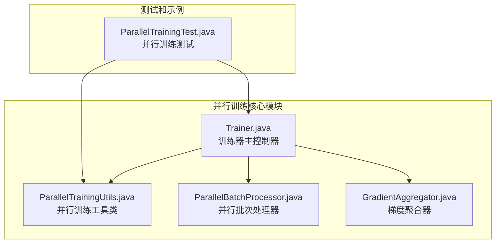
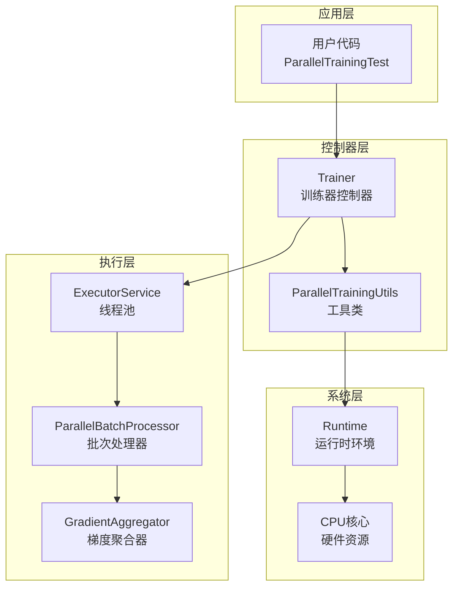
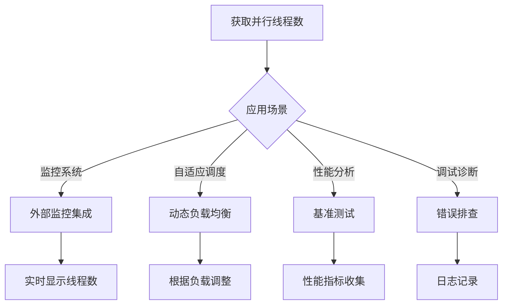
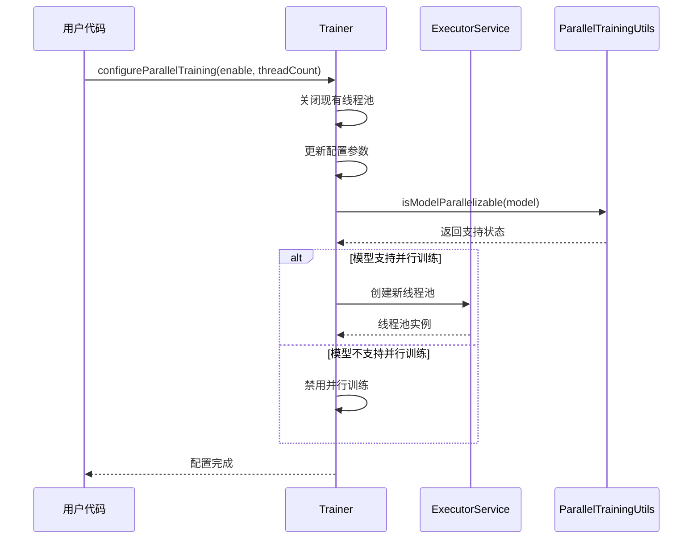
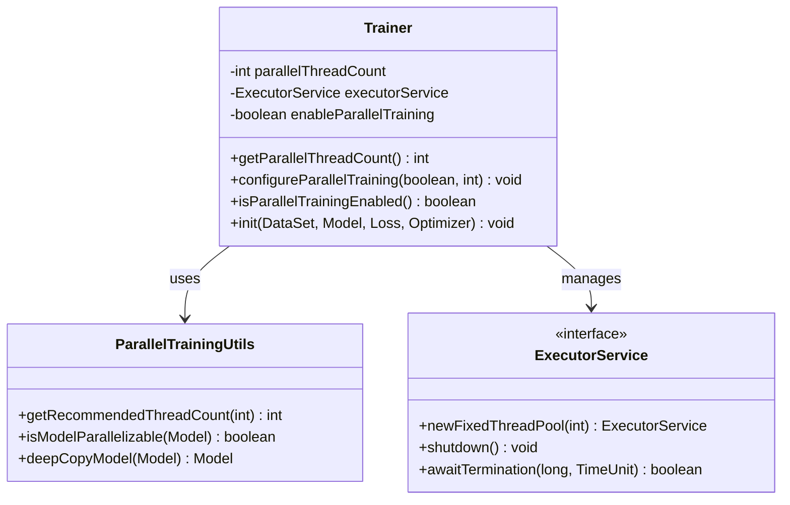
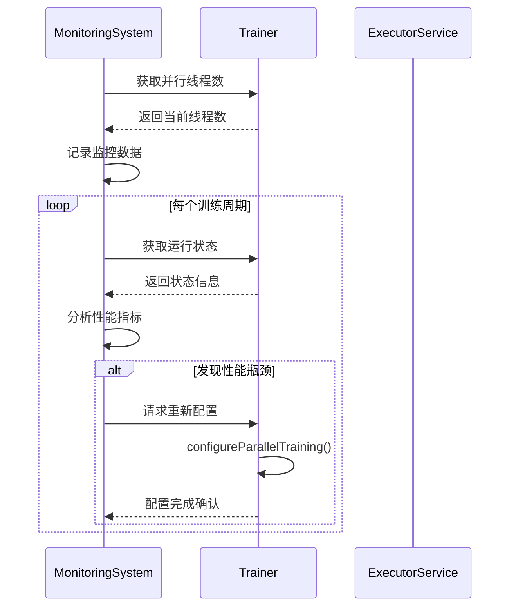
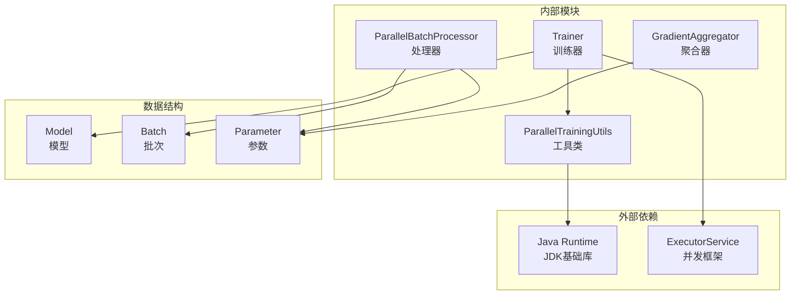

# 并行线程数管理

<cite>
**本文档引用的文件**
- [Trainer.java](file://tinyai-dl-ml/src/main/java/io/leavesfly/tinyai/ml/Trainer.java)
- [ParallelTrainingUtils.java](file://tinyai-dl-ml/src/main/java/io/leavesfly/tinyai/ml/parallel/ParallelTrainingUtils.java)
- [ParallelTrainingTest.java](file://tinyai-dl-case/src/main/java/io/leavesfly/tinyai/example/parallel/ParallelTrainingTest.java)
- [ParallelBatchProcessor.java](file://tinyai-dl-ml/src/main/java/io/leavesfly/tinyai/ml/parallel/ParallelBatchProcessor.java)
- [GradientAggregator.java](file://tinyai-dl-ml/src/main/java/io/leavesfly/tinyai/ml/parallel/GradientAggregator.java)
</cite>

## 目录
1. [简介](#简介)
2. [项目结构](#项目结构)
3. [核心组件](#核心组件)
4. [架构概览](#架构概览)
5. [详细组件分析](#详细组件分析)
6. [依赖关系分析](#依赖关系分析)
7. [性能考虑](#性能考虑)
8. [故障排除指南](#故障排除指南)
9. [结论](#结论)

## 简介

TinyDL框架中的并行线程数管理系统是一个关键的性能优化组件，它负责动态计算和管理并行训练过程中的线程数量。该系统通过`getParallelThreadCount()`方法提供了一个统一的接口来获取当前配置的有效并行度，这个值可以用于外部监控、自适应调度以及与其他并行相关API的协同工作。

并行线程数管理的核心目标是：
- **动态调整**：根据系统资源和数据批次数量自动计算最优线程数
- **一致性保证**：确保配置的线程数与实际线程池容量保持一致
- **监控支持**：为外部系统提供实时的并行度信息
- **自适应调度**：支持运行时环境判断和动态配置更新

## 项目结构

并行线程数管理功能分布在以下关键模块中：



**图表来源**
- [Trainer.java](file://tinyai-dl-ml/src/main/java/io/leavesfly/tinyai/ml/Trainer.java#L1-L50)
- [ParallelTrainingUtils.java](file://tinyai-dl-ml/src/main/java/io/leavesfly/tinyai/ml/parallel/ParallelTrainingUtils.java#L1-L30)

**章节来源**
- [Trainer.java](file://tinyai-dl-ml/src/main/java/io/leavesfly/tinyai/ml/Trainer.java#L1-L100)
- [ParallelTrainingUtils.java](file://tinyai-dl-ml/src/main/java/io/leavesfly/tinyai/ml/parallel/ParallelTrainingUtils.java#L1-L122)

## 核心组件

### Trainer类 - 并行训练控制器

Trainer类是并行线程数管理的核心控制器，它维护着并行训练的关键状态信息：

```java
// 并行训练相关配置
private int parallelThreadCount;
private ExecutorService executorService;
private boolean enableParallelTraining;
```

该类提供了三个主要的并行线程数管理方法：

1. **getParallelThreadCount()** - 获取当前配置的并行线程数
2. **isParallelTrainingEnabled()** - 检查并行训练是否启用
3. **configureParallelTraining()** - 动态配置并行训练参数

### ParallelTrainingUtils类 - 工具支持

ParallelTrainingUtils类提供了并行训练所需的核心工具方法，其中包含线程数计算的核心逻辑：

```java
public static int getRecommendedThreadCount(int batchCount) {
    int availableCores = Runtime.getRuntime().availableProcessors();
    
    // 线程数不应超过可用核心数的75%，也不应超过批次数量
    int maxThreads = Math.max(1, (int) (availableCores * 0.75));
    return Math.min(maxThreads, batchCount);
}
```

**章节来源**
- [Trainer.java](file://tinyai-dl-ml/src/main/java/io/leavesfly/tinyai/ml/Trainer.java#L41-L90)
- [ParallelTrainingUtils.java](file://tinyai-dl-ml/src/main/java/io/leavesfly/tinyai/ml/parallel/ParallelTrainingUtils.java#L60-L70)

## 架构概览

并行线程数管理系统采用分层架构设计，确保了良好的模块化和可扩展性：



**图表来源**
- [Trainer.java](file://tinyai-dl-ml/src/main/java/io/leavesfly/tinyai/ml/Trainer.java#L240-L269)
- [ParallelTrainingUtils.java](file://tinyai-dl-ml/src/main/java/io/leavesfly/tinyai/ml/parallel/ParallelTrainingUtils.java#L60-L70)

## 详细组件分析

### getParallelThreadCount()方法深度分析

`getParallelThreadCount()`方法是并行线程数管理的核心接口，它提供了以下功能特性：

#### 方法签名与返回值
```java
public int getParallelThreadCount() {
    return parallelThreadCount;
}
```

#### 功能语义
该方法返回当前配置的有效并行度，具有以下特点：

1. **静态性**：返回的是训练器启动时确定的固定值
2. **一致性**：确保返回值与实际线程池容量保持一致
3. **稳定性**：在训练过程中不会发生变化

#### 使用场景


**图表来源**
- [Trainer.java](file://tinyai-dl-ml/src/main/java/io/leavesfly/tinyai/ml/Trainer.java#L395-L400)

### configureParallelTraining()方法更新机制

`configureParallelTraining()`方法实现了并行线程数的动态更新机制：



**图表来源**
- [Trainer.java](file://tinyai-dl-ml/src/main/java/io/leavesfly/tinyai/ml/Trainer.java#L345-L378)

#### 更新流程详解

1. **资源清理阶段**：首先关闭现有的线程池以释放资源
2. **参数验证阶段**：检查线程数的有效性并更新内部状态
3. **模型兼容性检查**：验证当前模型是否支持并行训练
4. **线程池重建**：根据新的配置创建适配的线程池

### isParallelTrainingEnabled()运行时判断

该方法提供了运行时环境的判断能力：

```java
public boolean isParallelTrainingEnabled() {
    return enableParallelTraining && executorService != null && !executorService.isShutdown();
}
```

#### 判断条件
- **配置启用**：`enableParallelTraining`标志为true
- **资源就绪**：线程池已成功创建且未关闭
- **状态健康**：线程池处于正常运行状态

**章节来源**
- [Trainer.java](file://tinyai-dl-ml/src/main/java/io/leavesfly/tinyai/ml/Trainer.java#L379-L390)
- [Trainer.java](file://tinyai-dl-ml/src/main/java/io/leavesfly/tinyai/ml/Trainer.java#L391-L394)

### 实际线程池容量一致性保证

并行线程数管理确保了配置值与实际线程池容量的一致性：



**图表来源**
- [Trainer.java](file://tinyai-dl-ml/src/main/java/io/leavesfly/tinyai/ml/Trainer.java#L41-L50)
- [ParallelTrainingUtils.java](file://tinyai-dl-ml/src/main/java/io/leavesfly/tinyai/ml/parallel/ParallelTrainingUtils.java#L60-L70)

#### 一致性保证机制

1. **初始化时确定**：线程数在训练器初始化时确定并固定
2. **动态调整限制**：只能通过重新配置整个训练器来改变
3. **资源约束**：线程数不超过可用核心数的75%
4. **批次适配**：线程数不超过数据批次数量

**章节来源**
- [Trainer.java](file://tinyai-dl-ml/src/main/java/io/leavesfly/tinyai/ml/Trainer.java#L92-L125)
- [ParallelTrainingUtils.java](file://tinyai-dl-ml/src/main/java/io/leavesfly/tinyai/ml/parallel/ParallelTrainingUtils.java#L60-L70)

### 与其他并行相关API的协同使用

并行线程数管理与多个API协同工作，形成完整的并行训练生态系统：

#### 协同使用范例

```java
// 1. 基本使用模式
Trainer trainer = new Trainer(maxEpoch, monitor, evaluator, true, threadCount);
trainer.init(dataSet, model, loss, optimizer);

// 2. 运行时环境判断
if (trainer.isParallelTrainingEnabled()) {
    int threadCount = trainer.getParallelThreadCount();
    System.out.println("并行训练已启用，线程数: " + threadCount);
    
    // 结合外部监控系统
    monitor.setParallelThreadCount(threadCount);
}

// 3. 动态配置更新
trainer.configureParallelTraining(true, newThreadCount);
if (trainer.isParallelTrainingEnabled()) {
    int updatedCount = trainer.getParallelThreadCount();
    System.out.println("并行训练已重新配置，线程数: " + updatedCount);
}
```

#### 外部监控集成示例



**图表来源**
- [ParallelTrainingTest.java](file://tinyai-dl-case/src/main/java/io/leavesfly/tinyai/example/parallel/ParallelTrainingTest.java#L75-L85)

**章节来源**
- [ParallelTrainingTest.java](file://tinyai-dl-case/src/main/java/io/leavesfly/tinyai/example/parallel/ParallelTrainingTest.java#L75-L97)

## 依赖关系分析

并行线程数管理系统的依赖关系体现了清晰的分层架构：



**图表来源**
- [Trainer.java](file://tinyai-dl-ml/src/main/java/io/leavesfly/tinyai/ml/Trainer.java#L1-L20)
- [ParallelTrainingUtils.java](file://tinyai-dl-ml/src/main/java/io/leavesfly/tinyai/ml/parallel/ParallelTrainingUtils.java#L1-L15)

### 核心依赖关系

1. **Trainer → ParallelTrainingUtils**：使用工具类进行线程数计算
2. **Trainer → ExecutorService**：管理并行执行环境
3. **ParallelBatchProcessor → GradientAggregator**：协作完成梯度聚合
4. **所有组件 → Model**：操作机器学习模型

**章节来源**
- [Trainer.java](file://tinyai-dl-ml/src/main/java/io/leavesfly/tinyai/ml/Trainer.java#L1-L20)
- [ParallelBatchProcessor.java](file://tinyai-dl-ml/src/main/java/io/leavesfly/tinyai/ml/parallel/ParallelBatchProcessor.java#L1-L20)

## 性能考虑

并行线程数管理在设计时充分考虑了性能优化：

### 线程数计算策略

```java
public static int getRecommendedThreadCount(int batchCount) {
    int availableCores = Runtime.getRuntime().availableProcessors();
    
    // 线程数不应超过可用核心数的75%，也不应超过批次数量
    int maxThreads = Math.max(1, (int) (availableCores * 0.75));
    return Math.min(maxThreads, batchCount);
}
```

#### 性能优化原则

1. **CPU利用率优化**：限制线程数为CPU核心数的75%，避免过度竞争
2. **内存效率**：每个线程需要独立的模型副本，线程数过多会导致内存压力
3. **I/O平衡**：考虑数据加载和GPU计算的平衡
4. **批次适配**：线程数不超过数据批次数量，避免无效并行

### 内存管理

并行训练需要为每个线程创建模型的深拷贝：

```java
Model modelCopy = ParallelTrainingUtils.deepCopyModel(model);
```

这种设计确保了线程安全，但也带来了显著的内存开销。建议：

- **内存监控**：定期检查内存使用情况
- **批次大小调整**：适当增加批次大小以减少线程数需求
- **模型优化**：使用更紧凑的模型结构

## 故障排除指南

### 常见问题及解决方案

#### 1. 并行训练未启用

**症状**：`isParallelTrainingEnabled()`返回false

**可能原因**：
- 模型不支持序列化
- 线程池创建失败
- 配置参数错误

**解决方案**：
```java
// 检查模型是否支持并行训练
if (!ParallelTrainingUtils.isModelParallelizable(model)) {
    System.err.println("模型不支持并行训练，请检查模型实现");
}

// 检查线程池状态
if (trainer.getParallelThreadCount() <= 0) {
    System.err.println("线程数配置无效");
}
```

#### 2. 线程数与预期不符

**症状**：实际使用的线程数少于配置值

**可能原因**：
- 可用CPU核心数不足
- 数据批次数量较少
- 系统资源限制

**解决方案**：
```java
// 获取实际生效的线程数
int actualThreads = trainer.getParallelThreadCount();
System.out.println("实际线程数: " + actualThreads);

// 检查系统资源
int availableCores = Runtime.getRuntime().availableProcessors();
System.out.println("可用CPU核心数: " + availableCores);
```

#### 3. 内存溢出错误

**症状**：并行训练过程中出现OutOfMemoryError

**可能原因**：
- 线程数过多导致内存不足
- 模型过大
- 批次数据量过大

**解决方案**：
```java
// 减少线程数
trainer.configureParallelTraining(true, Math.max(1, availableCores / 2));

// 或者减少批次大小
dataSet.setBatchSize(newBatchSize);
```

**章节来源**
- [Trainer.java](file://tinyai-dl-ml/src/main/java/io/leavesfly/tinyai/ml/Trainer.java#L92-L125)
- [ParallelTrainingUtils.java](file://tinyai-dl-ml/src/main/java/io/leavesfly/tinyai/ml/parallel/ParallelTrainingUtils.java#L79-L89)

## 结论

TinyDL框架的并行线程数管理系统是一个设计精良、功能完备的性能优化组件。它通过以下关键特性实现了高效的并行训练管理：

### 核心优势

1. **智能线程数计算**：基于系统资源和数据特征自动计算最优线程数
2. **一致性保证**：确保配置值与实际执行环境完全匹配
3. **灵活配置**：支持运行时动态调整并行参数
4. **监控友好**：提供丰富的状态查询接口
5. **错误处理**：完善的异常处理和降级机制

### 最佳实践建议

1. **合理配置**：根据硬件资源和数据规模设置初始线程数
2. **监控集成**：将线程数信息集成到监控系统中
3. **性能调优**：定期分析并行训练性能，调整配置参数
4. **资源管理**：注意内存使用，避免过度并行导致资源耗尽

### 未来发展方向

1. **动态自适应**：根据运行时性能指标自动调整线程数
2. **多级并行**：支持CPU-GPU混合并行策略
3. **云原生支持**：适配容器化和分布式部署环境
4. **可视化界面**：提供图形化的并行训练监控界面

通过深入理解和正确使用并行线程数管理系统，开发者可以显著提升机器学习模型的训练效率，同时保持系统的稳定性和可维护性。