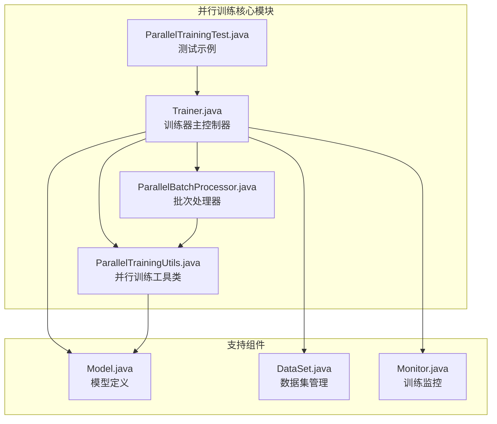
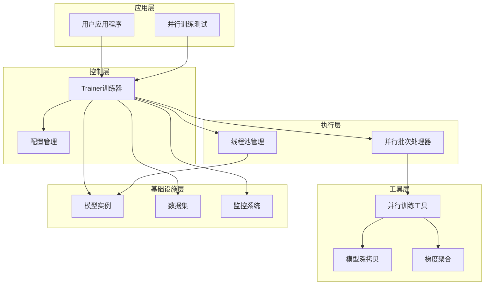
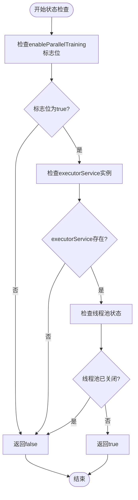
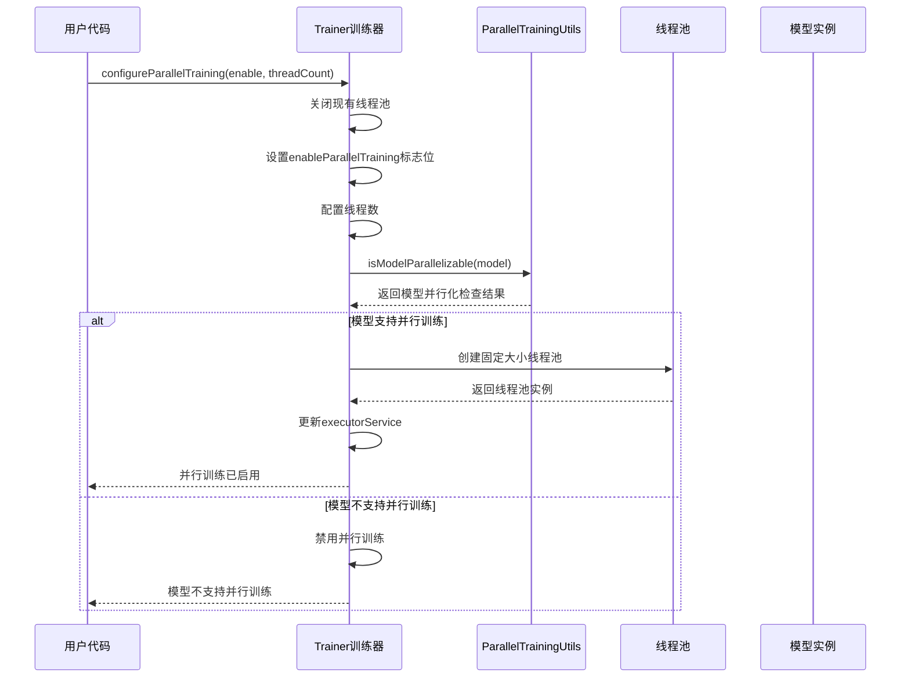
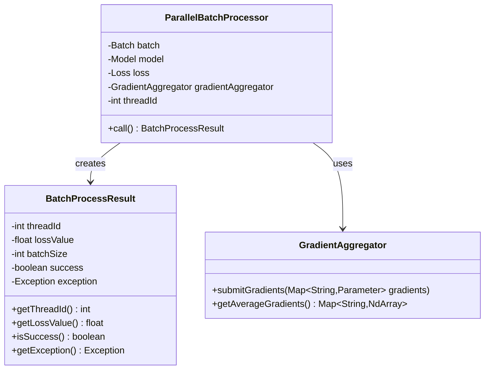
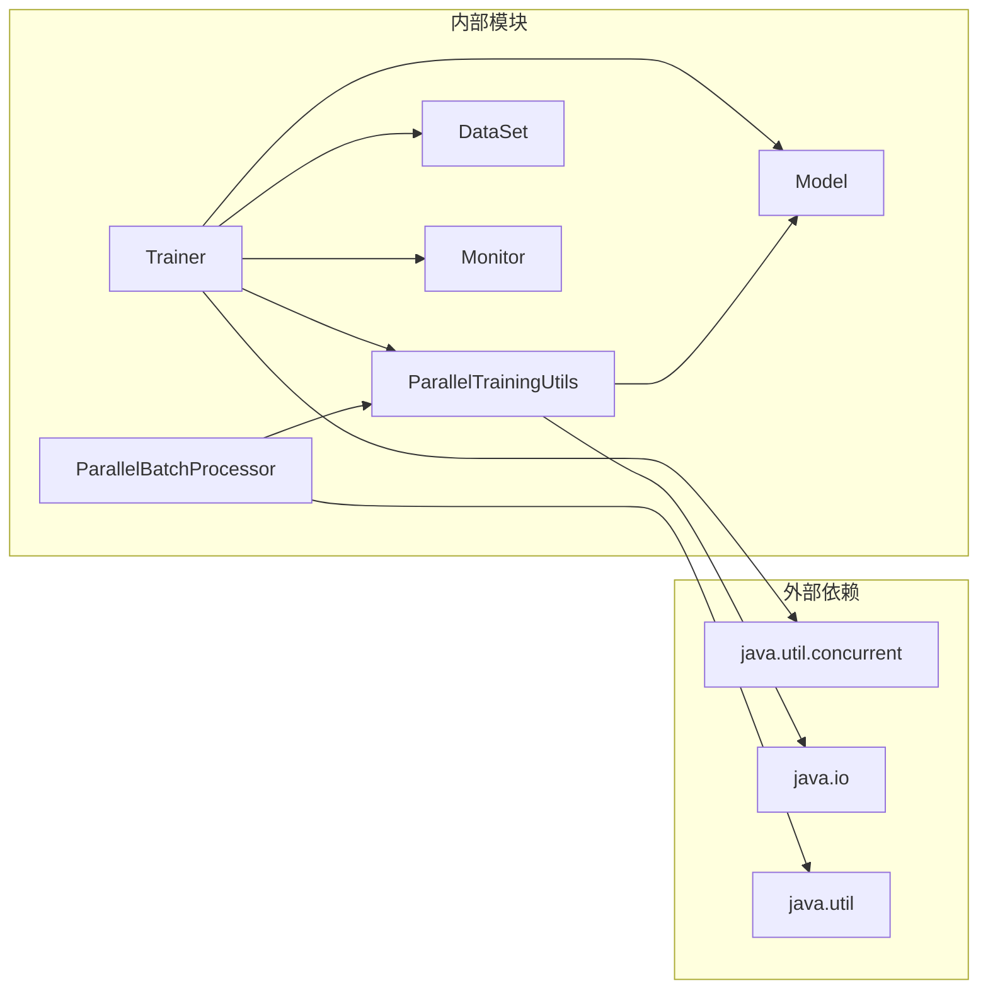

# 并行训练状态监控

<cite>
**本文档引用的文件**
- [Trainer.java](file://tinyai-dl-ml/src/main/java/io/leavesfly/tinyai/ml/Trainer.java)
- [ParallelTrainingUtils.java](file://tinyai-dl-ml/src/main/java/io/leavesfly/tinyai/ml/parallel/ParallelTrainingUtils.java)
- [ParallelBatchProcessor.java](file://tinyai-dl-ml/src/main/java/io/leavesfly/tinyai/ml/parallel/ParallelBatchProcessor.java)
- [ParallelTrainingTest.java](file://tinyai-dl-case/src/main/java/io/leavesfly/tinyai/example/parallel/ParallelTrainingTest.java)
</cite>

## 目录
1. [简介](#简介)
2. [项目结构概览](#项目结构概览)
3. [核心组件分析](#核心组件分析)
4. [架构概览](#架构概览)
5. [详细组件分析](#详细组件分析)
6. [依赖关系分析](#依赖关系分析)
7. [性能考虑](#性能考虑)
8. [故障排除指南](#故障排除指南)
9. [结论](#结论)

## 简介

并行训练状态监控是TinyDL深度学习框架中的关键组件，它负责准确反映当前并行训练的可用性和状态。通过`isParallelTrainingEnabled()`方法，系统能够综合判断`enableParallelTraining`标志位、`executorService`实例存在性以及线程池关闭状态，确保在多线程环境下提供一致且可靠的状态反馈。

该方法在训练流程控制、资源调度决策中发挥着至关重要的作用，是整个并行训练系统的基础守护条件。通过安全的状态检查机制，它有效避免了直接访问标志位可能带来的竞态条件和状态不一致问题。

## 项目结构概览

并行训练功能主要分布在以下模块中：



**图表来源**
- [Trainer.java](file://tinyai-dl-ml/src/main/java/io/leavesfly/tinyai/ml/Trainer.java#L1-L50)
- [ParallelTrainingUtils.java](file://tinyai-dl-ml/src/main/java/io/leavesfly/tinyai/ml/parallel/ParallelTrainingUtils.java#L1-L30)

**章节来源**
- [Trainer.java](file://tinyai-dl-ml/src/main/java/io/leavesfly/tinyai/ml/Trainer.java#L1-L100)
- [ParallelTrainingUtils.java](file://tinyai-dl-ml/src/main/java/io/leavesfly/tinyai/ml/parallel/ParallelTrainingUtils.java#L1-L50)

## 核心组件分析

### Trainer类 - 并行训练控制器

Trainer类是并行训练的核心控制器，负责协调整个训练流程。它维护了三个关键状态变量：

- `enableParallelTraining`: 布尔标志位，指示是否启用了并行训练
- `parallelThreadCount`: 并行线程数量，控制并发处理能力
- `executorService`: 线程池服务，管理并行任务执行

```java
// 并行训练相关配置
private int parallelThreadCount;
private ExecutorService executorService;
private boolean enableParallelTraining;
```

### ParallelTrainingUtils工具类

该工具类提供了并行训练所需的核心辅助功能：

- 模型深拷贝：确保每个线程拥有独立的模型实例
- 梯度聚合：合并来自不同线程的梯度更新
- 线程数推荐：基于硬件资源自动计算最优线程数
- 模型并行化检查：验证模型是否支持序列化

**章节来源**
- [Trainer.java](file://tinyai-dl-ml/src/main/java/io/leavesfly/tinyai/ml/Trainer.java#L41-L50)
- [ParallelTrainingUtils.java](file://tinyai-dl-ml/src/main/java/io/leavesfly/tinyai/ml/parallel/ParallelTrainingUtils.java#L15-L50)

## 架构概览

并行训练系统采用分层架构设计，确保各组件职责清晰且松耦合：



**图表来源**
- [Trainer.java](file://tinyai-dl-ml/src/main/java/io/leavesfly/tinyai/ml/Trainer.java#L80-L120)
- [ParallelBatchProcessor.java](file://tinyai-dl-ml/src/main/java/io/leavesfly/tinyai/ml/parallel/ParallelBatchProcessor.java#L1-L30)

## 详细组件分析

### isParallelTrainingEnabled()方法详解

`isParallelTrainingEnabled()`方法是并行训练状态监控的核心，其实现体现了严谨的状态一致性保证：

```java
public boolean isParallelTrainingEnabled() {
    return enableParallelTraining && executorService != null && !executorService.isShutdown();
}
```

#### 状态判断逻辑分析

该方法采用三重条件验证机制：

1. **enableParallelTraining标志位检查**：
   - 确保用户明确启用了并行训练功能
   - 防止因配置错误导致的意外行为

2. **executorService实例存在性检查**：
   - 验证线程池是否已正确初始化
   - 避免空指针异常和无效操作

3. **线程池运行状态检查**：
   - 确认线程池未被关闭或终止
   - 保证并行任务可以正常提交和执行



**图表来源**
- [Trainer.java](file://tinyai-dl-ml/src/main/java/io/leavesfly/tinyai/ml/Trainer.java#L374-L378)

#### 安全性对比分析

直接访问标志位vs调用isParallelTrainingEnabled()方法的安全性差异：

| 访问方式 | 安全性 | 可靠性 | 维护成本 |
|---------|--------|--------|----------|
| 直接访问标志位 | 低 | 不稳定 | 高 |
| 调用isParallelTrainingEnabled() | 高 | 稳定 | 低 |

**章节来源**
- [Trainer.java](file://tinyai-dl-ml/src/main/java/io/leavesfly/tinyai/ml/Trainer.java#L374-L378)

### 并行训练初始化流程

并行训练的初始化过程包含多个关键步骤，确保系统处于正确的启动状态：



**图表来源**
- [Trainer.java](file://tinyai-dl-ml/src/main/java/io/leavesfly/tinyai/ml/Trainer.java#L345-L370)
- [ParallelTrainingUtils.java](file://tinyai-dl-ml/src/main/java/io/leavesfly/tinyai/ml/parallel/ParallelTrainingUtils.java#L95-L105)

### 模型并行化检查机制

`ParallelTrainingUtils.isModelParallelizable()`方法通过序列化测试来验证模型是否支持并行训练：

```java
public static boolean isModelParallelizable(Model model) {
    try {
        // 尝试序列化测试
        ByteArrayOutputStream baos = new ByteArrayOutputStream();
        ObjectOutputStream oos = new ObjectOutputStream(baos);
        oos.writeObject(model);
        oos.close();
        return true;
    } catch (Exception e) {
        return false;
    }
}
```

这种检查机制的优势：
- **简单可靠**：序列化是Java的标准机制，具有良好的兼容性
- **全面覆盖**：能够检测模型中所有不可序列化的组件
- **早期发现问题**：在训练开始前就识别出不支持并行的模型

**章节来源**
- [ParallelTrainingUtils.java](file://tinyai-dl-ml/src/main/java/io/leavesfly/tinyai/ml/parallel/ParallelTrainingUtils.java#L95-L105)

### 并行批次处理器

ParallelBatchProcessor实现了真正的并行训练逻辑，每个处理器负责独立批次的训练：



**图表来源**
- [ParallelBatchProcessor.java](file://tinyai-dl-ml/src/main/java/io/leavesfly/tinyai/ml/parallel/ParallelBatchProcessor.java#L15-L50)

**章节来源**
- [ParallelBatchProcessor.java](file://tinyai-dl-ml/src/main/java/io/leavesfly/tinyai/ml/parallel/ParallelBatchProcessor.java#L1-L124)

## 依赖关系分析

并行训练系统的依赖关系体现了清晰的分层架构：



**图表来源**
- [Trainer.java](file://tinyai-dl-ml/src/main/java/io/leavesfly/tinyai/ml/Trainer.java#L1-L20)
- [ParallelTrainingUtils.java](file://tinyai-dl-ml/src/main/java/io/leavesfly/tinyai/ml/parallel/ParallelTrainingUtils.java#L1-L10)

**章节来源**
- [Trainer.java](file://tinyai-dl-ml/src/main/java/io/leavesfly/tinyai/ml/Trainer.java#L1-L30)
- [ParallelTrainingUtils.java](file://tinyai-dl-ml/src/main/java/io/leavesfly/tinyai/ml/parallel/ParallelTrainingUtils.java#L1-L15)

## 性能考虑

### 线程数优化策略

并行训练工具类提供了智能的线程数推荐算法：

```java
public static int getRecommendedThreadCount(int batchCount) {
    int availableCores = Runtime.getRuntime().availableProcessors();
    
    // 线程数不应超过可用核心数的75%，也不应超过批次数量
    int maxThreads = Math.max(1, (int) (availableCores * 0.75));
    return Math.min(maxThreads, batchCount);
}
```

这种策略的优势：
- **CPU利用率优化**：避免过度占用CPU资源
- **内存效率**：减少线程上下文切换开销
- **动态适应**：根据硬件配置自动调整

### 内存管理策略

并行训练采用了多种内存管理策略：

1. **模型深拷贝**：每个线程独立的模型实例
2. **梯度聚合**：集中管理梯度更新
3. **及时清理**：处理完成后立即释放资源

## 故障排除指南

### 常见问题诊断

#### 问题1：并行训练未启用

**症状**：`isParallelTrainingEnabled()`返回false

**可能原因**：
1. 模型不支持序列化
2. 线程池创建失败
3. 线程池已被关闭

**解决方案**：
```java
// 检查模型是否支持并行训练
if (!ParallelTrainingUtils.isModelParallelizable(model)) {
    System.err.println("模型不支持并行训练");
}

// 检查线程池状态
if (executorService == null) {
    System.err.println("线程池未初始化");
} else if (executorService.isShutdown()) {
    System.err.println("线程池已关闭");
}
```

#### 问题2：并行训练性能不佳

**症状**：并行训练速度不如预期

**可能原因**：
1. 线程数设置不当
2. 数据批次过小
3. CPU核心数不足

**解决方案**：
```java
// 调整线程数
trainer.configureParallelTraining(true, Runtime.getRuntime().availableProcessors());

// 或者使用推荐值
trainer.configureParallelTraining(true, 0); // 0表示自动计算
```

**章节来源**
- [Trainer.java](file://tinyai-dl-ml/src/main/java/io/leavesfly/tinyai/ml/Trainer.java#L345-L370)
- [ParallelTrainingUtils.java](file://tinyai-dl-ml/src/main/java/io/leavesfly/tinyai/ml/parallel/ParallelTrainingUtils.java#L60-L75)

## 结论

并行训练状态监控系统通过`isParallelTrainingEnabled()`方法提供了一个安全、可靠的并行训练状态检查机制。该方法通过三重条件验证，确保了在多线程环境下的状态一致性，有效避免了直接访问标志位可能带来的竞态条件和状态不一致问题。

系统的设计体现了以下优秀特性：

1. **安全性**：通过多重状态检查，确保只有在完全准备好时才启用并行训练
2. **可靠性**：完善的错误处理和资源管理机制
3. **可维护性**：清晰的职责分离和模块化设计
4. **性能优化**：智能的线程数推荐和内存管理策略

对于开发者而言，正确理解和使用这个状态监控机制，不仅能够充分利用并行训练的性能优势，还能有效避免潜在的并发问题和资源泄漏风险。在实际使用中，建议始终通过`isParallelTrainingEnabled()`方法来检查并行训练状态，而不是直接访问内部标志位。