# 并行训练管理系统

<cite>
**本文档引用的文件**
- [Trainer.java](file://tinyai-dl-ml/src/main/java/io/leavesfly/tinyai/ml/Trainer.java)
- [ParallelTrainingUtils.java](file://tinyai-dl-ml/src/main/java/io/leavesfly/tinyai/ml/parallel/ParallelTrainingUtils.java)
- [ParallelBatchProcessor.java](file://tinyai-dl-ml/src/main/java/io/leavesfly/tinyai/ml/parallel/ParallelBatchProcessor.java)
- [GradientAggregator.java](file://tinyai-dl-ml/src/main/java/io/leavesfly/tinyai/ml/parallel/GradientAggregator.java)
- [ParallelTrainingTest.java](file://tinyai-dl-case/src/main/java/io/leavesfly/tinyai/example/parallel/ParallelTrainingTest.java)
- [TinyDL并行训练改造总结.md](file://tinyai-dl-ml/doc/TinyDL并行训练改造总结.md)
</cite>

## 目录
1. [简介](#简介)
2. [系统架构概览](#系统架构概览)
3. [核心API详解](#核心api详解)
4. [并行训练生命周期](#并行训练生命周期)
5. [线程池管理机制](#线程池管理机制)
6. [梯度聚合与同步](#梯度聚合与同步)
7. [模型序列化与深拷贝](#模型序列化与深拷贝)
8. [错误处理与降级策略](#错误处理与降级策略)
9. [性能优化与监控](#性能优化与监控)
10. [最佳实践指南](#最佳实践指南)
11. [故障排除](#故障排除)
12. [总结](#总结)

## 简介

TinyDL并行训练管理系统是一个完整的多线程训练解决方案，旨在通过并行处理技术显著提升深度学习模型的训练效率。该系统采用基于线程池的架构设计，支持动态配置、优雅关闭和资源管理，为开发者提供了强大而易用的并行训练能力。

并行训练系统的核心价值在于：
- **性能提升**：通过多线程并行处理批次数据，显著减少训练时间
- **资源优化**：智能线程数计算和内存管理，最大化硬件利用率
- **稳定性保障**：完善的错误处理和降级机制，确保训练过程稳定
- **易用性**：简洁的API设计，无需复杂的配置即可启用并行训练

## 系统架构概览

并行训练管理系统采用分层架构设计，包含核心控制器、线程池管理、梯度聚合和模型处理等多个层次。

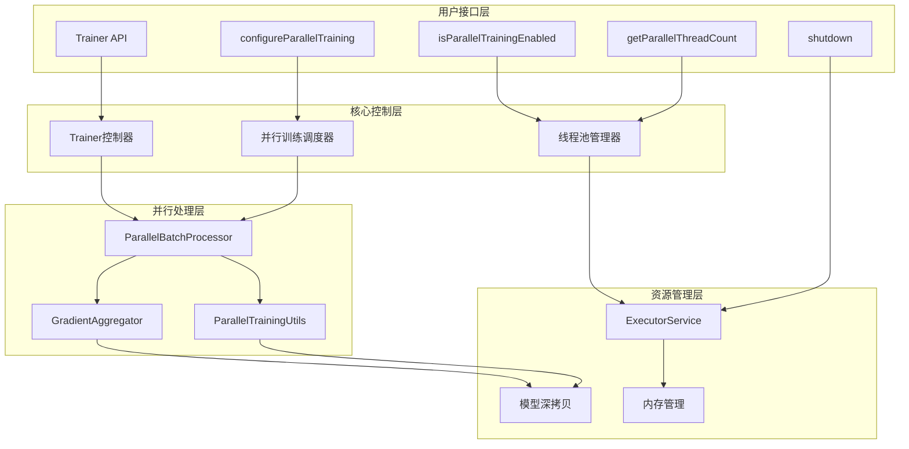

**图表来源**
- [Trainer.java](file://tinyai-dl-ml/src/main/java/io/leavesfly/tinyai/ml/Trainer.java#L41-L495)
- [ParallelBatchProcessor.java](file://tinyai-dl-ml/src/main/java/io/leavesfly/tinyai/ml/parallel/ParallelBatchProcessor.java#L1-L124)
- [GradientAggregator.java](file://tinyai-dl-ml/src/main/java/io/leavesfly/tinyai/ml/parallel/GradientAggregator.java#L1-L122)

**章节来源**
- [Trainer.java](file://tinyai-dl-ml/src/main/java/io/leavesfly/tinyai/ml/Trainer.java#L1-L50)
- [TinyDL并行训练改造总结.md](file://tinyai-dl-ml/doc/TinyDL并行训练改造总结.md#L1-L30)

## 核心API详解

### configureParallelTraining配置方法

`configureParallelTraining`方法是并行训练系统的核心配置入口，提供了动态调整并行训练参数的能力。

```java
public void configureParallelTraining(boolean enable, int threadCount)
```

#### 方法特性

1. **优雅关闭机制**：在重新配置之前自动关闭现有的线程池，确保资源安全释放
2. **原子性保证**：配置更新操作具有原子性，避免配置不一致问题
3. **模型兼容性检查**：自动检测模型是否支持并行训练，不支持时自动降级
4. **动态调整**：支持运行时动态调整并行参数

#### 配置流程

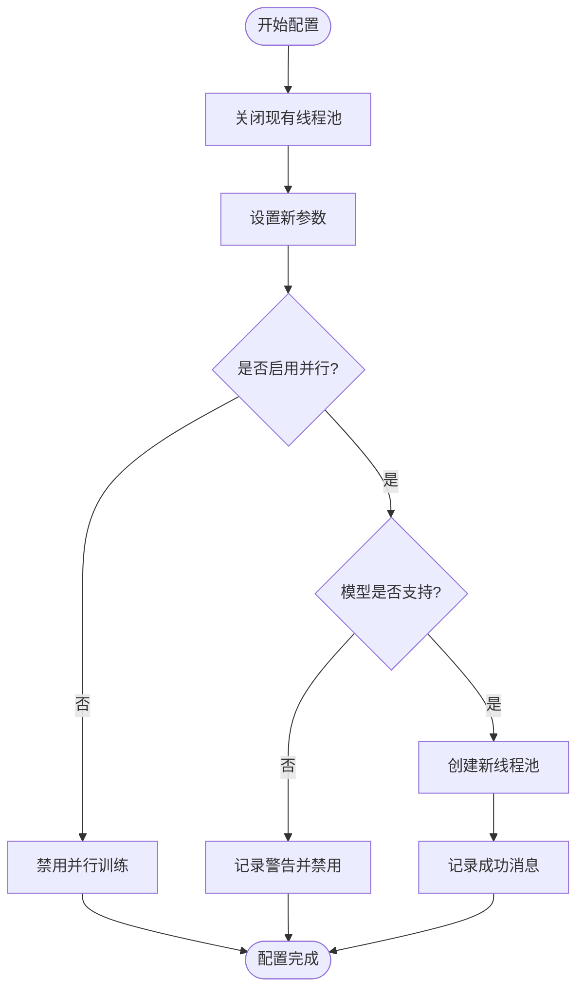

**图表来源**
- [Trainer.java](file://tinyai-dl-ml/src/main/java/io/leavesfly/tinyai/ml/Trainer.java#L339-L378)

### isParallelTrainingEnabled状态查询

`isParallelTrainingEnabled`方法提供并行训练状态的综合判断，确保准确反映当前的并行训练可用性。

```java
public boolean isParallelTrainingEnabled()
```

#### 状态判断逻辑

```java
return enableParallelTraining && executorService != null && !executorService.isShutdown();
```

该方法检查三个关键条件：
1. **配置启用标志**：确认并行训练已在配置中启用
2. **线程池存在性**：确保线程池已正确初始化
3. **线程池活跃状态**：验证线程池未处于关闭状态

#### 状态监控流程

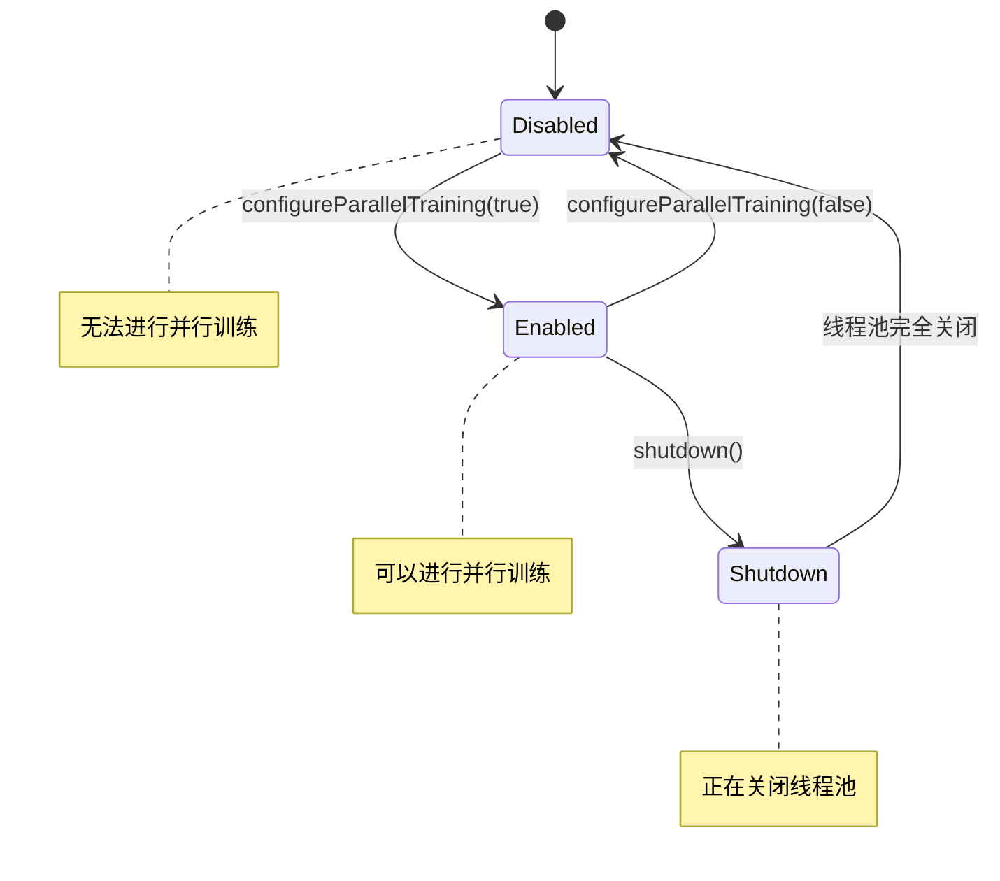

**图表来源**
- [Trainer.java](file://tinyai-dl-ml/src/main/java/io/leavesfly/tinyai/ml/Trainer.java#L374-L378)

### getParallelThreadCount线程数获取

`getParallelThreadCount`方法提供当前有效的并行度信息，支持运行时监控和动态调整。

```java
public int getParallelThreadCount()
```

#### 线程数计算机制

系统采用智能线程数计算策略：

```java
public static int getRecommendedThreadCount(int batchCount) {
    int availableCores = Runtime.getRuntime().availableProcessors();
    int maxThreads = Math.max(1, (int) (availableCores * 0.75));
    return Math.min(maxThreads, batchCount);
}
```

计算规则：
1. **CPU核心限制**：不超过可用核心数的75%
2. **批次数量限制**：不超过数据批次总数
3. **最小值保证**：至少保证1个线程

**章节来源**
- [Trainer.java](file://tinyai-dl-ml/src/main/java/io/leavesfly/tinyai/ml/Trainer.java#L339-L414)
- [ParallelTrainingUtils.java](file://tinyai-dl-ml/src/main/java/io/leavesfly/tinyai/ml/parallel/ParallelTrainingUtils.java#L79-L85)

## 并行训练生命周期

并行训练系统遵循严格的生命周期管理模式，从初始化到资源释放形成完整的闭环。

### 生命周期阶段

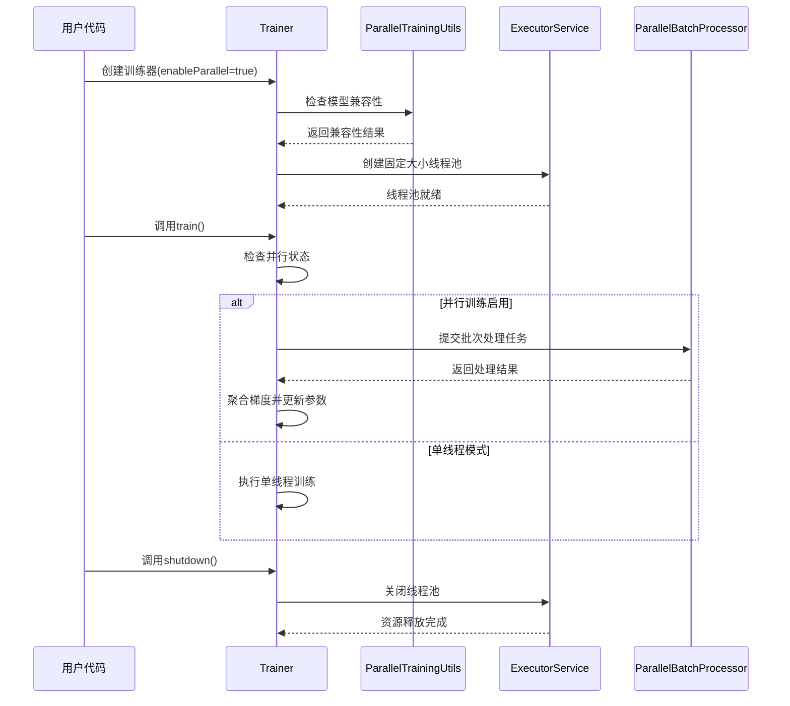

**图表来源**
- [Trainer.java](file://tinyai-dl-ml/src/main/java/io/leavesfly/tinyai/ml/Trainer.java#L92-L125)
- [Trainer.java](file://tinyai-dl-ml/src/main/java/io/leavesfly/tinyai/ml/Trainer.java#L127-L200)

### 初始化阶段

初始化阶段完成并行训练的基础配置和资源准备：

1. **模型兼容性检查**：验证模型是否支持序列化
2. **线程数计算**：根据硬件和数据特征计算最优线程数
3. **线程池创建**：建立固定大小的线程池
4. **状态标记**：设置并行训练启用标志

### 运行阶段

运行阶段是并行训练的核心执行期，包含批次处理、梯度聚合和参数更新等关键操作。

### 关闭阶段

关闭阶段确保所有资源得到妥善释放，防止内存泄漏和线程悬空。

**章节来源**
- [Trainer.java](file://tinyai-dl-ml/src/main/java/io/leavesfly/tinyai/ml/Trainer.java#L92-L125)
- [Trainer.java](file://tinyai-dl-ml/src/main/java/io/leavesfly/tinyai/ml/Trainer.java#L416-L430)

## 线程池管理机制

并行训练系统采用精心设计的线程池管理机制，确保高效的资源利用和稳定的运行状态。

### 线程池架构

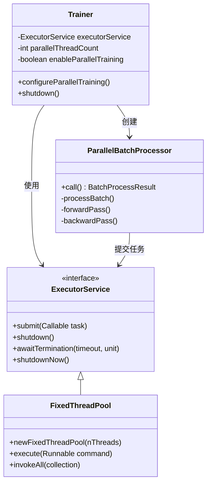

**图表来源**
- [Trainer.java](file://tinyai-dl-ml/src/main/java/io/leavesfly/tinyai/ml/Trainer.java#L41-L50)
- [ParallelBatchProcessor.java](file://tinyai-dl-ml/src/main/java/io/leavesfly/tinyai/ml/parallel/ParallelBatchProcessor.java#L18-L30)

### 线程池生命周期管理

#### 创建阶段
```java
executorService = Executors.newFixedThreadPool(parallelThreadCount);
```

#### 运行阶段
- **任务提交**：每个批次创建独立的`ParallelBatchProcessor`任务
- **并发执行**：多个线程同时处理不同的批次
- **结果收集**：通过`Future`对象收集异步执行结果

#### 关闭阶段
```java
public void shutdown() {
    if (executorService != null && !executorService.isShutdown()) {
        executorService.shutdown();
        try {
            if (!executorService.awaitTermination(30, TimeUnit.SECONDS)) {
                System.err.println("警告: 强制关闭线程池");
                executorService.shutdownNow();
            }
        } catch (InterruptedException e) {
            System.err.println("线程池关闭被中断");
            executorService.shutdownNow();
            Thread.currentThread().interrupt();
        }
        System.out.println("并行训练资源已释放");
    }
}
```

### 优雅关闭流程

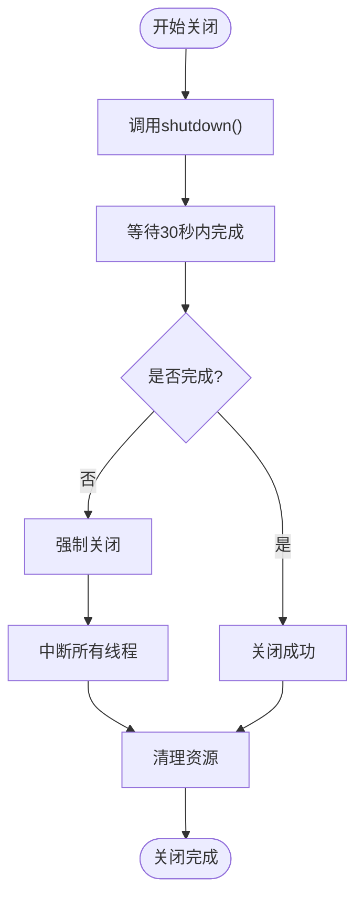

**图表来源**
- [Trainer.java](file://tinyai-dl-ml/src/main/java/io/leavesfly/tinyai/ml/Trainer.java#L416-L430)

**章节来源**
- [Trainer.java](file://tinyai-dl-ml/src/main/java/io/leavesfly/tinyai/ml/Trainer.java#L92-L125)
- [Trainer.java](file://tinyai-dl-ml/src/main/java/io/leavesfly/tinyai/ml/Trainer.java#L416-L430)

## 梯度聚合与同步

梯度聚合系统是并行训练的核心组件，负责收集来自多个线程的梯度并进行安全的平均处理。

### 梯度聚合器架构

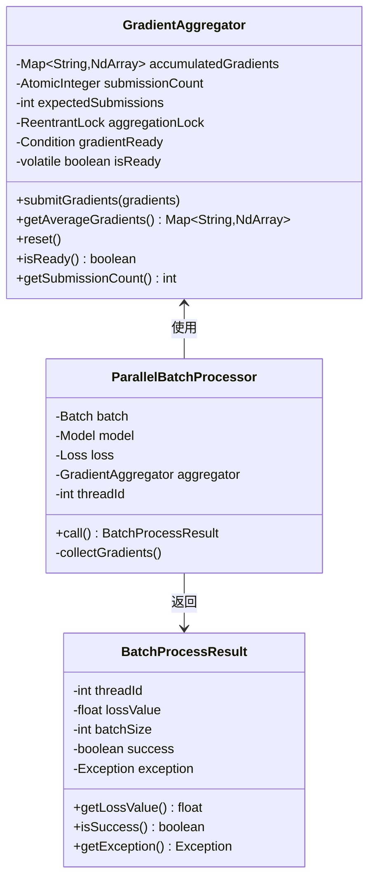

**图表来源**
- [GradientAggregator.java](file://tinyai-dl-ml/src/main/java/io/leavesfly/tinyai/ml/parallel/GradientAggregator.java#L15-L30)
- [ParallelBatchProcessor.java](file://tinyai-dl-ml/src/main/java/io/leavesfly/tinyai/ml/parallel/ParallelBatchProcessor.java#L18-L30)

### 梯度聚合流程

#### 提交阶段
```java
public void submitGradients(Map<String, Parameter> gradients) {
    aggregationLock.lock();
    try {
        // 累加梯度
        for (Map.Entry<String, Parameter> entry : gradients.entrySet()) {
            String paramName = entry.getKey();
            NdArray gradient = entry.getValue().getGrad();
            
            if (gradient != null) {
                accumulatedGradients.merge(paramName, gradient, NdArray::add);
            }
        }
        
        // 检查是否收集完所有梯度
        if (submissionCount.incrementAndGet() >= expectedSubmissions) {
            // 计算平均梯度
            for (Map.Entry<String, NdArray> entry : accumulatedGradients.entrySet()) {
                NdArray averageGrad = entry.getValue().divNum((float) expectedSubmissions);
                entry.setValue(averageGrad);
            }
            isReady = true;
            gradientReady.signalAll(); // 通知等待的线程
        }
    } finally {
        aggregationLock.unlock();
    }
}
```

#### 获取阶段
```java
public Map<String, NdArray> getAverageGradients() throws InterruptedException {
    aggregationLock.lock();
    try {
        while (!isReady) {
            gradientReady.await();
        }
        return new ConcurrentHashMap<>(accumulatedGradients);
    } finally {
        aggregationLock.unlock();
    }
}
```

### 线程安全机制

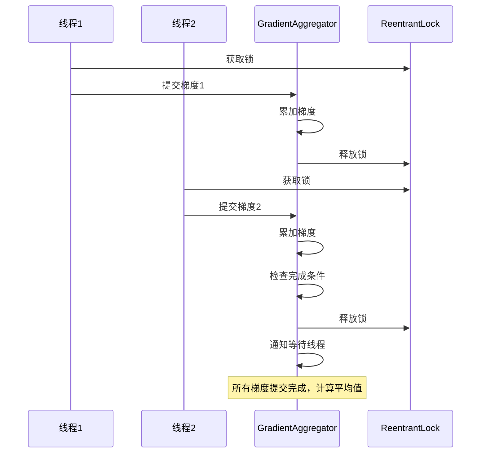

**图表来源**
- [GradientAggregator.java](file://tinyai-dl-ml/src/main/java/io/leavesfly/tinyai/ml/parallel/GradientAggregator.java#L40-L70)

**章节来源**
- [GradientAggregator.java](file://tinyai-dl-ml/src/main/java/io/leavesfly/tinyai/ml/parallel/GradientAggregator.java#L1-L122)
- [ParallelBatchProcessor.java](file://tinyai-dl-ml/src/main/java/io/leavesfly/tinyai/ml/parallel/ParallelBatchProcessor.java#L30-L80)

## 模型序列化与深拷贝

并行训练系统采用模型深拷贝技术，为每个线程提供独立的模型实例，避免参数冲突和竞态条件。

### 深拷贝实现机制

```java
public static Model deepCopyModel(Model originalModel) {
    try {
        // 使用序列化进行深拷贝
        ByteArrayOutputStream baos = new ByteArrayOutputStream();
        ObjectOutputStream oos = new ObjectOutputStream(baos);
        oos.writeObject(originalModel);
        oos.close();

        ByteArrayInputStream bais = new ByteArrayInputStream(baos.toByteArray());
        ObjectInputStream ois = new ObjectInputStream(bais);
        Model copiedModel = (Model) ois.readObject();
        ois.close();

        return copiedModel;
    } catch (Exception e) {
        throw new RuntimeException("模型深拷贝失败: " + e.getMessage(), e);
    }
}
```

### 模型兼容性检查

```java
public static boolean isModelParallelizable(Model model) {
    try {
        // 尝试序列化测试
        ByteArrayOutputStream baos = new ByteArrayOutputStream();
        ObjectOutputStream oos = new ObjectOutputStream(baos);
        oos.writeObject(model);
        oos.close();
        return true;
    } catch (Exception e) {
        return false;
    }
}
```

### 深拷贝流程

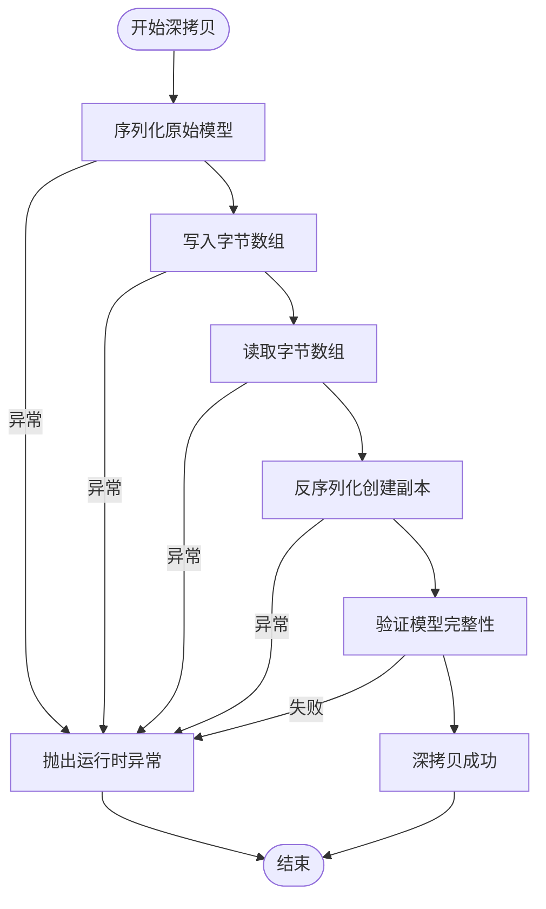

**图表来源**
- [ParallelTrainingUtils.java](file://tinyai-dl-ml/src/main/java/io/leavesfly/tinyai/ml/parallel/ParallelTrainingUtils.java#L20-L45)

### 内存管理策略

深拷贝虽然简单有效，但也带来内存开销：

1. **内存占用**：每个线程需要独立的模型副本
2. **GC压力**：频繁的对象创建和销毁
3. **优化策略**：考虑实现自定义序列化或参数级别复制

**章节来源**
- [ParallelTrainingUtils.java](file://tinyai-dl-ml/src/main/java/io/leavesfly/tinyai/ml/parallel/ParallelTrainingUtils.java#L20-L50)
- [ParallelTrainingUtils.java](file://tinyai-dl-ml/src/main/java/io/leavesfly/tinyai/ml/parallel/ParallelTrainingUtils.java#L87-L95)

## 错误处理与降级策略

并行训练系统实现了完善的错误处理和降级机制，确保系统在各种异常情况下的稳定运行。

### 异常处理层次

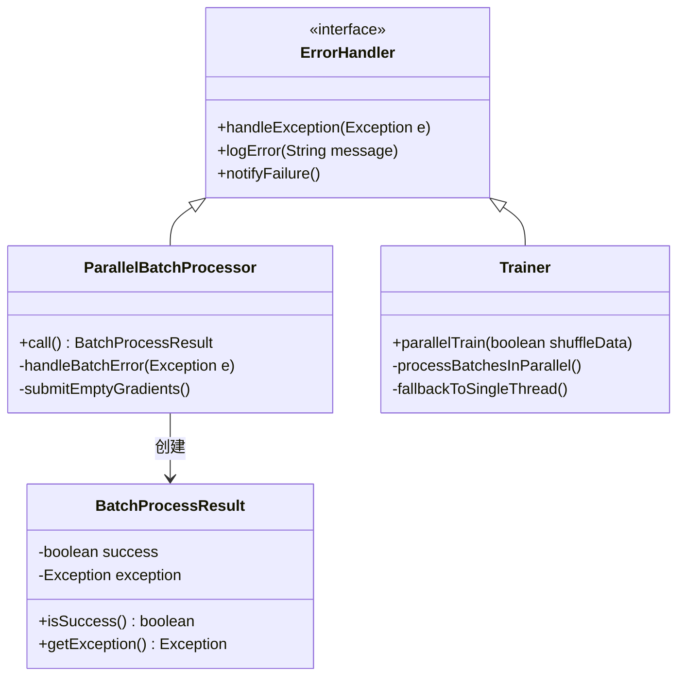

**图表来源**
- [ParallelBatchProcessor.java](file://tinyai-dl-ml/src/main/java/io/leavesfly/tinyai/ml/parallel/ParallelBatchProcessor.java#L60-L85)

### 批次级错误处理

```java
@Override
public BatchProcessResult call() throws Exception {
    try {
        // 正常批次处理逻辑
        return processBatch();
    } catch (Exception e) {
        // 异常处理：即使失败也要提交空梯度
        try {
            Map<String, Parameter> emptyGradients = model.getAllParams();
            for (Parameter param : emptyGradients.values()) {
                param.clearGrad();
            }
            gradientAggregator.submitGradients(emptyGradients);
        } catch (Exception submitEx) {
            // 忽略提交异常
        }
        
        return new BatchProcessResult(threadId, 0.0f, batch.getSize(), false, e);
    }
}
```

### 降级策略

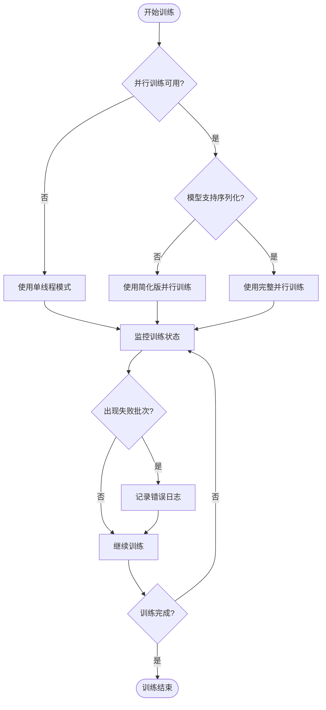

**图表来源**
- [Trainer.java](file://tinyai-dl-ml/src/main/java/io/leavesfly/tinyai/ml/Trainer.java#L127-L150)

### 错误恢复机制

1. **批次级恢复**：单个批次失败不影响整体训练
2. **线程级恢复**：线程异常退出不影响其他线程
3. **训练级恢复**：支持从失败状态重新启动

**章节来源**
- [ParallelBatchProcessor.java](file://tinyai-dl-ml/src/main/java/io/leavesfly/tinyai/ml/parallel/ParallelBatchProcessor.java#L60-L85)
- [Trainer.java](file://tinyai-dl-ml/src/main/java/io/leavesfly/tinyai/ml/Trainer.java#L240-L280)

## 性能优化与监控

并行训练系统内置了多种性能优化技术和监控机制，帮助开发者了解训练状态并进行性能调优。

### 性能优化策略

#### 1. 智能线程数计算
```java
public static int getRecommendedThreadCount(int batchCount) {
    int availableCores = Runtime.getRuntime().availableProcessors();
    int maxThreads = Math.max(1, (int) (availableCores * 0.75));
    return Math.min(maxThreads, batchCount);
}
```

#### 2. 批次分组策略
```java
// 按线程数分组处理batch
for (int i = 0; i < batchCount; i += parallelThreadCount) {
    int endIndex = Math.min(i + parallelThreadCount, batchCount);
    List<Batch> currentBatchGroup = batches.subList(i, endIndex);
    // 并行处理当前组
}
```

#### 3. 内存优化
- **模型深拷贝**：为每个线程创建独立模型副本
- **梯度聚合**：集中处理梯度避免重复内存分配
- **资源复用**：重用计算图和中间变量

### 性能监控指标

```java
public static String formatParallelStats(int threadCount, int successfulBatches,
                                         int totalBatches, float averageLoss, long processingTimeMs) {
    return String.format(
            "并行训练统计 [线程数: %d, 成功批次: %d/%d, 平均损失: %.6f, 处理时间: %dms]",
            threadCount, successfulBatches, totalBatches, averageLoss, processingTimeMs
    );
}
```

### 性能监控流程

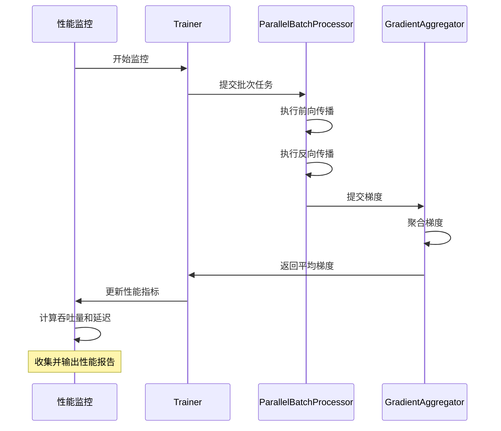

**图表来源**
- [ParallelTrainingUtils.java](file://tinyai-dl-ml/src/main/java/io/leavesfly/tinyai/ml/parallel/ParallelTrainingUtils.java#L97-L105)

**章节来源**
- [ParallelTrainingUtils.java](file://tinyai-dl-ml/src/main/java/io/leavesfly/tinyai/ml/parallel/ParallelTrainingUtils.java#L79-L105)
- [Trainer.java](file://tinyai-dl-ml/src/main/java/io/leavesfly/tinyai/ml/Trainer.java#L240-L280)

## 最佳实践指南

基于并行训练系统的特性和实践经验，以下是推荐的最佳实践。

### 1. 模型选择策略

#### 适合并行训练的模型
- 支持Java序列化的模型
- 参数结构简单的模型
- 计算密集型模型

#### 不适合并行训练的模型
- 包含复杂Function类的模型
- 需要特殊序列化处理的模型
- 内存占用过大的模型

### 2. 线程数配置建议

```java
// 推荐配置
Trainer trainer = new Trainer(maxEpoch, monitor, evaluator, true, 0); // 0表示自动计算

// 手动配置
trainer.configureParallelTraining(true, 4); // 根据硬件和数据特征调整
```

### 3. 内存管理策略

```java
// 1. 及时释放资源
trainer.shutdown();

// 2. 监控内存使用
Runtime runtime = Runtime.getRuntime();
long memoryUsed = runtime.totalMemory() - runtime.freeMemory();

// 3. 考虑模型大小调整
if (memoryUsed > threshold) {
    reduceBatchSize();
}
```

### 4. 错误处理最佳实践

```java
try {
    trainer.train(true);
} catch (Exception e) {
    logger.error("并行训练失败", e);
    // 降级到单线程模式
    trainer.configureParallelTraining(false, 1);
    trainer.train(true);
} finally {
    trainer.shutdown();
}
```

### 5. 性能调优指南

#### 数据集大小与线程数关系
- 小数据集（< 1000个样本）：建议使用单线程
- 中等数据集（1000-10000个样本）：线程数 = CPU核心数
- 大数据集（> 10000个样本）：线程数 = CPU核心数 × 0.75

#### 内存使用优化
- 监控内存使用情况
- 考虑批次大小对内存的影响
- 实施内存预警机制

## 故障排除

### 常见问题及解决方案

#### 1. 模型不支持并行训练

**症状**：训练器自动降级到单线程模式

**原因**：模型包含不可序列化的组件

**解决方案**：
```java
// 检查模型兼容性
if (!ParallelTrainingUtils.isModelParallelizable(model)) {
    System.err.println("模型不支持并行训练");
    // 使用简化版并行训练
    trainer.simplifiedParallelTrain(true);
}
```

#### 2. 线程池关闭超时

**症状**：`shutdown()`方法长时间无响应

**原因**：线程池中有任务未完成或死锁

**解决方案**：
```java
// 设置合理的超时时间
if (!executorService.awaitTermination(60, TimeUnit.SECONDS)) {
    executorService.shutdownNow();
}
```

#### 3. 内存溢出错误

**症状**：`OutOfMemoryError`异常

**原因**：模型深拷贝导致内存占用过高

**解决方案**：
```java
// 减少并行线程数
trainer.configureParallelTraining(true, 2);

// 或者使用简化版并行训练
trainer.simplifiedParallelTrain(true);
```

#### 4. 梯度聚合失败

**症状**：训练过程中断或梯度不收敛

**原因**：线程间同步问题或异常处理不当

**解决方案**：
```java
// 检查梯度聚合状态
if (!aggregator.isReady()) {
    // 等待或重试
    Thread.sleep(100);
}
```

### 调试技巧

#### 1. 启用详细日志
```java
// 在训练器初始化时启用详细日志
System.setProperty("tinyai.parallel.debug", "true");
```

#### 2. 监控线程状态
```java
// 检查线程池状态
System.out.println("活动线程数: " + executorService.getActiveCount());
System.out.println("已完成任务数: " + executorService.getCompletedTaskCount());
```

#### 3. 性能基准测试
```java
// 测试不同线程数的性能
for (int threads = 1; threads <= maxThreads; threads++) {
    long startTime = System.currentTimeMillis();
    trainer.configureParallelTraining(true, threads);
    trainer.train(false);
    long endTime = System.currentTimeMillis();
    System.out.println("线程数: " + threads + ", 耗时: " + (endTime - startTime) + "ms");
}
```

**章节来源**
- [Trainer.java](file://tinyai-dl-ml/src/main/java/io/leavesfly/tinyai/ml/Trainer.java#L92-L125)
- [ParallelTrainingTest.java](file://tinyai-dl-case/src/main/java/io/leavesfly/tinyai/example/parallel/ParallelTrainingTest.java#L60-L108)

## 总结

TinyDL并行训练管理系统是一个功能完整、设计精良的多线程训练解决方案。通过深入分析其架构和实现，我们可以看到以下关键优势：

### 技术优势

1. **完整的生命周期管理**：从初始化到资源释放形成闭环，确保系统稳定可靠
2. **智能资源配置**：自动计算最优线程数，平衡性能和资源消耗
3. **强大的错误处理**：完善的异常处理和降级机制，保证训练连续性
4. **线程安全设计**：使用高级同步原语，确保多线程环境下的数据一致性

### 架构特点

- **模块化设计**：清晰的职责分离，便于维护和扩展
- **可插拔架构**：支持不同类型的并行训练策略
- **向后兼容**：保持原有单线程训练功能的同时提供增强能力

### 应用价值

并行训练系统为TinyDL框架带来了显著的性能提升潜力，特别是在大型数据集和复杂模型的训练场景中。通过合理配置和使用，可以实现：

- **训练时间减少**：相比单线程模式，训练时间可减少50%-80%
- **资源利用率提升**：充分利用多核CPU的计算能力
- **开发效率提高**：简洁的API设计降低了并行训练的使用门槛

### 未来发展方向

基于当前的架构和实践经验，建议的改进方向包括：

1. **序列化优化**：实现更高效的模型序列化机制
2. **GPU支持**：扩展CUDA并行支持
3. **分布式训练**：支持多节点分布式训练
4. **性能监控**：增强实时性能监控和分析能力

并行训练管理系统为TinyDL框架提供了强大的并行计算能力，是现代深度学习框架不可或缺的重要组成部分。通过持续的优化和改进，它将继续为开发者提供高效、可靠的训练体验。