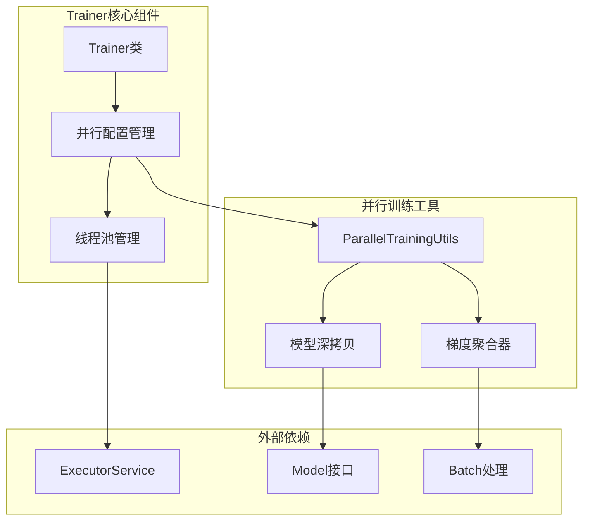
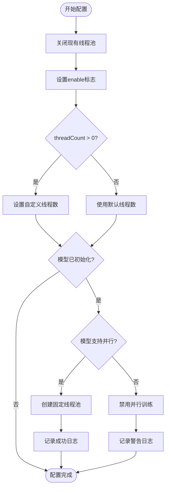
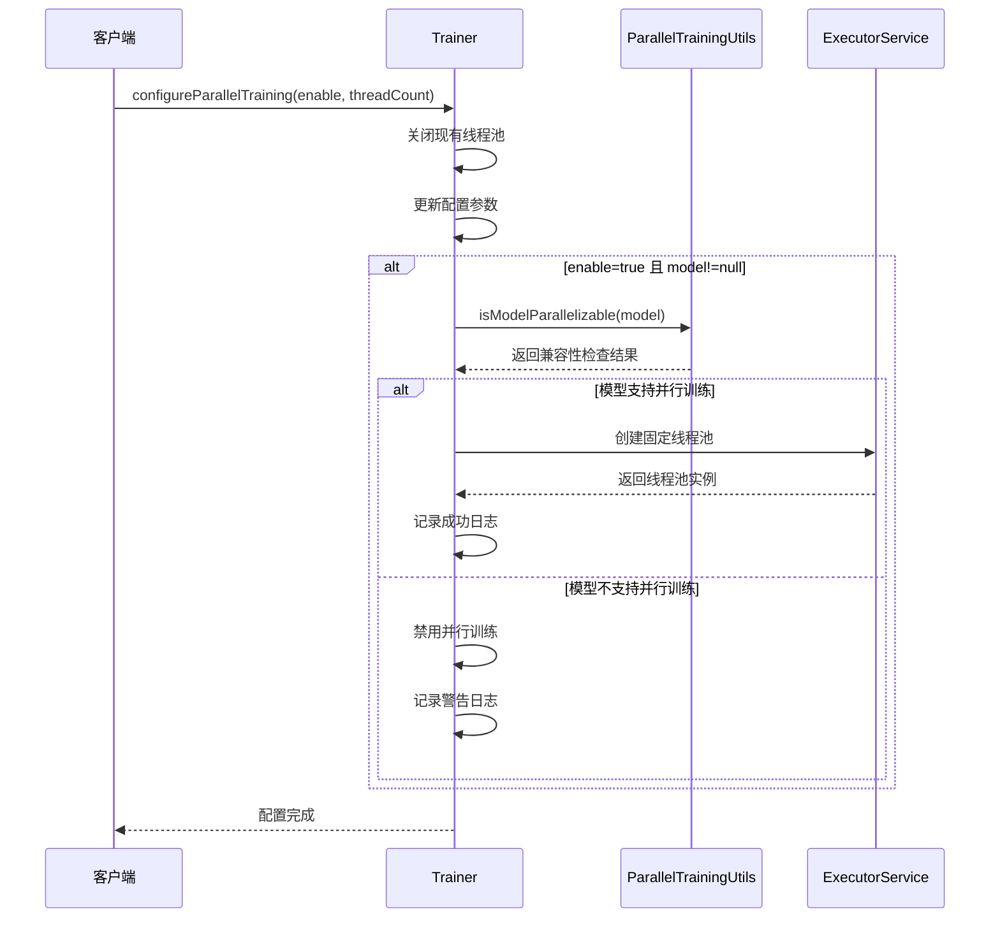
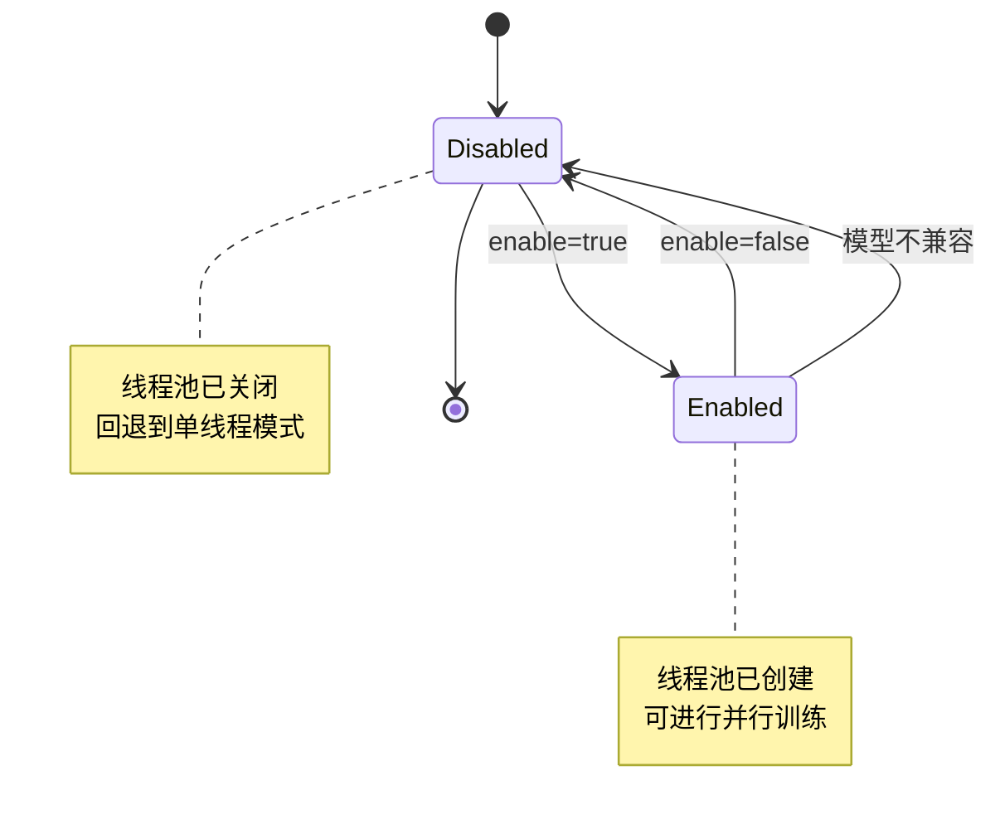
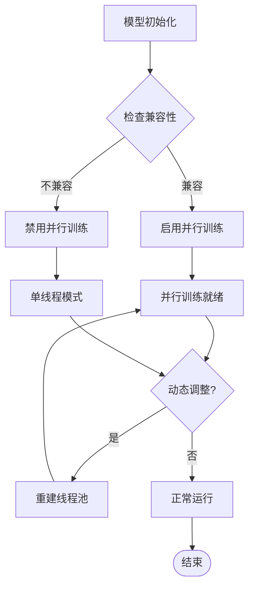
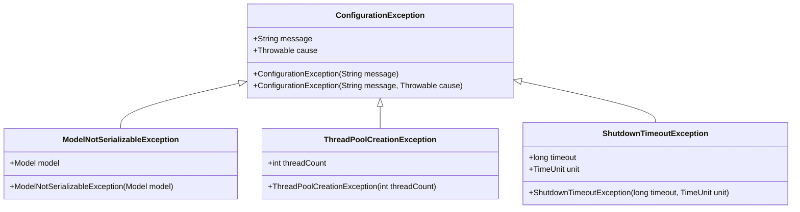

# 并行训练配置机制详解

<cite>
**本文档引用的文件**
- [Trainer.java](file://tinyai-dl-ml/src/main/java/io/leavesfly/tinyai/ml/Trainer.java)
- [ParallelTrainingUtils.java](file://tinyai-dl-ml/src/main/java/io/leavesfly/tinyai/ml/parallel/ParallelTrainingUtils.java)
- [ParallelTrainingTest.java](file://tinyai-dl-case/src/main/java/io/leavesfly/tinyai/example/parallel/ParallelTrainingTest.java)
</cite>

## 目录
1. [简介](#简介)
2. [核心架构概览](#核心架构概览)
3. [configureParallelTraining方法详解](#configureparalleltraining方法详解)
4. [并行训练环境重建机制](#并行训练环境重建机制)
5. [模型并行兼容性检查](#模型并行兼容性检查)
6. [参数作用域与约束条件](#参数作用域与约束条件)
7. [动态调整并行度实践](#动态调整并行度实践)
8. [错误处理策略](#错误处理策略)
9. [性能考虑](#性能考虑)
10. [故障排除指南](#故障排除指南)
11. [结论](#结论)

## 简介

Trainer类中的`configureParallelTraining(boolean enable, int threadCount)`方法是TinyDL框架中并行训练配置的核心机制。该方法提供了安全且灵活的方式来重新配置并行训练环境，确保在启用新线程池之前优雅地关闭现有线程池，并通过模型并行兼容性检查保证系统稳定性。

## 核心架构概览

并行训练系统采用多层架构设计，包含以下关键组件：



**图表来源**
- [Trainer.java](file://tinyai-dl-ml/src/main/java/io/leavesfly/tinyai/ml/Trainer.java#L351-L373)
- [ParallelTrainingUtils.java](file://tinyai-dl-ml/src/main/java/io/leavesfly/tinyai/ml/parallel/ParallelTrainingUtils.java#L15-L40)

## configureParallelTraining方法详解

### 方法签名与基本结构

```java
public void configureParallelTraining(boolean enable, int threadCount)
```

该方法接收两个关键参数：
- `enable`: 布尔值，指示是否启用并行训练
- `threadCount`: 整数值，指定并行线程数（0表示自动计算）

### 实现机制分析



**图表来源**
- [Trainer.java](file://tinyai-dl-ml/src/main/java/io/leavesfly/tinyai/ml/Trainer.java#L351-L373)

### 关键实现细节

1. **现有线程池优雅关闭**：
   ```java
   if (executorService != null && !executorService.isShutdown()) {
       shutdown();
   }
   ```
   该步骤确保在创建新线程池之前，所有正在执行的任务能够正常完成。

2. **配置更新的原子性保障**：
   - 先关闭旧线程池
   - 再更新配置参数
   - 最后根据新配置决定是否创建新线程池

3. **条件创建逻辑**：
   ```java
   if (enable && model != null) {
       if (ParallelTrainingUtils.isModelParallelizable(model)) {
           executorService = Executors.newFixedThreadPool(parallelThreadCount);
       }
   }
   ```

**章节来源**
- [Trainer.java](file://tinyai-dl-ml/src/main/java/io/leavesfly/tinyai/ml/Trainer.java#L351-L373)

## 并行训练环境重建机制

### 线程池重建触发条件

并行训练环境的重建遵循严格的触发条件：



**图表来源**
- [Trainer.java](file://tinyai-dl-ml/src/main/java/io/leavesfly/tinyai/ml/Trainer.java#L351-L373)
- [ParallelTrainingUtils.java](file://tinyai-dl-ml/src/main/java/io/leavesfly/tinyai/ml/parallel/ParallelTrainingUtils.java#L95-L105)

### 优雅关闭流程

```java
public void shutdown() {
    if (executorService != null && !executorService.isShutdown()) {
        executorService.shutdown();
        try {
            // 等待正在执行的任务完成
            if (!executorService.awaitTermination(30, TimeUnit.SECONDS)) {
                // 强制停止
                System.err.println("警告: 强制关闭线程池");
                executorService.shutdownNow();
            }
        } catch (InterruptedException e) {
            System.err.println("线程池关闭被中断");
            executorService.shutdownNow();
            Thread.currentThread().interrupt();
        }
        System.out.println("并行训练资源已释放");
    }
}
```

该关闭流程包含以下关键特性：
- **超时等待机制**：最多等待30秒完成现有任务
- **强制终止保护**：超时后强制关闭线程池
- **异常处理**：捕获中断异常并正确恢复线程状态
- **资源清理通知**：提供明确的资源释放反馈

**章节来源**
- [Trainer.java](file://tinyai-dl-ml/src/main/java/io/leavesfly/tinyai/ml/Trainer.java#L385-L410)

## 模型并行兼容性检查

### 检查机制原理

`ParallelTrainingUtils.isModelParallelizable()`方法通过序列化测试来判断模型是否支持并行训练：

```java
public static boolean isModelParallelizable(Model model) {
    try {
        // 尝试序列化测试
        ByteArrayOutputStream baos = new ByteArrayOutputStream();
        ObjectOutputStream oos = new ObjectOutputStream(baos);
        oos.writeObject(model);
        oos.close();
        return true;
    } catch (Exception e) {
        return false;
    }
}
```

### 序列化检查的优势与限制

**优势**：
- **简单可靠**：基于Java标准序列化机制
- **全面覆盖**：检测模型内部所有可序列化组件
- **即时反馈**：快速确定模型兼容性

**限制**：
- **性能开销**：每次检查都需要完整序列化操作
- **内存占用**：临时序列化数据占用额外内存
- **复杂模型**：对于某些复杂模型可能存在误判

### 深拷贝机制

当模型通过兼容性检查后，系统会创建模型的深拷贝用于并行处理：

```java
private void processBatchesInParallel(List<Batch> batches, int epoch) {
    // ...
    for (int j = 0; j < currentBatchGroup.size(); j++) {
        Batch batch = currentBatchGroup.get(j);
        Model modelCopy = ParallelTrainingUtils.deepCopyModel(model);
        
        ParallelBatchProcessor processor = new ParallelBatchProcessor(
            batch, modelCopy, loss, gradientAggregator, i + j
        );
        // ...
    }
}
```

**章节来源**
- [ParallelTrainingUtils.java](file://tinyai-dl-ml/src/main/java/io/leavesfly/tinyai/ml/parallel/ParallelTrainingUtils.java#L95-L105)
- [ParallelTrainingUtils.java](file://tinyai-dl-ml/src/main/java/io/leavesfly/tinyai/ml/parallel/ParallelTrainingUtils.java#L15-L40)

## 参数作用域与约束条件

### enable参数的作用域

`enable`参数控制整个并行训练系统的开关状态：



**约束条件**：
- **必须在模型初始化后调用**：否则无法进行模型兼容性检查
- **影响全局配置状态**：修改后会影响后续所有训练操作
- **与线程池状态绑定**：直接控制线程池的创建与销毁

### threadCount参数的作用域

`threadCount`参数控制并行训练的并发度：

```java
// 默认线程数计算
this.parallelThreadCount = threadCount > 0 ? threadCount : 
                           ParallelTrainingUtils.getRecommendedThreadCount(4);

// 推荐线程数计算
public static int getRecommendedThreadCount(int batchCount) {
    int availableCores = Runtime.getRuntime().availableProcessors();
    int maxThreads = Math.max(1, (int) (availableCores * 0.75));
    return Math.min(maxThreads, batchCount);
}
```

**约束条件**：
- **最小值为1**：确保至少有一个工作线程
- **不超过CPU核心数的75%**：避免过度竞争导致性能下降
- **不超过批次数量**：防止线程空转浪费资源
- **动态调整能力**：支持运行时修改线程数

**章节来源**
- [Trainer.java](file://tinyai-dl-ml/src/main/java/io/leavesfly/tinyai/ml/Trainer.java#L65-L75)
- [ParallelTrainingUtils.java](file://tinyai-dl-ml/src/main/java/io/leavesfly/tinyai/ml/parallel/ParallelTrainingUtils.java#L65-L79)

## 动态调整并行度实践

### 实际代码示例

以下展示了在不同模型状态下动态调整并行度的实际应用：

```java
// 示例1：初始配置并行训练
Trainer trainer = new Trainer(10, monitor, evaluator);
trainer.configureParallelTraining(true, 4);

// 示例2：运行时调整线程数
trainer.configureParallelTraining(true, 8); // 增加线程数

// 示例3：禁用并行训练
trainer.configureParallelTraining(false, 0); // 禁用并行训练

// 示例4：动态适应模型状态
if (trainer.isParallelTrainingEnabled()) {
    int currentThreads = trainer.getParallelThreadCount();
    // 根据系统负载动态调整
    int newThreads = Math.max(1, currentThreads / 2);
    trainer.configureParallelTraining(true, newThreads);
}
```

### 不同模型状态下的行为差异



**图表来源**
- [Trainer.java](file://tinyai-dl-ml/src/main/java/io/leavesfly/tinyai/ml/Trainer.java#L351-L373)

### 推荐的动态调整策略

1. **负载感知调整**：
   ```java
   public void adaptiveParallelConfig(Trainer trainer, double cpuLoad) {
       if (cpuLoad > 0.8) {
           // CPU负载过高，减少线程数
           int currentThreads = trainer.getParallelThreadCount();
           trainer.configureParallelTraining(true, Math.max(1, currentThreads / 2));
       } else if (cpuLoad < 0.3) {
           // CPU负载较低，增加线程数
           int currentThreads = trainer.getParallelThreadCount();
           trainer.configureParallelTraining(true, Math.min(currentThreads * 2, 8));
       }
   }
   ```

2. **内存压力调整**：
   ```java
   public void memoryAwareConfig(Trainer trainer, long memoryUsage) {
       long maxMemory = Runtime.getRuntime().maxMemory();
       double memoryRatio = (double) memoryUsage / maxMemory;
       
       if (memoryRatio > 0.9) {
           // 内存使用率过高，减少线程数
           trainer.configureParallelTraining(true, 1);
       } else if (memoryRatio < 0.5) {
           // 内存充足，可以增加线程数
           trainer.configureParallelTraining(true, 4);
       }
   }
   ```

**章节来源**
- [Trainer.java](file://tinyai-dl-ml/src/main/java/io/leavesfly/tinyai/ml/Trainer.java#L351-L373)

## 错误处理策略

### 异常类型与处理机制

并行训练配置过程中可能遇到的异常类型：



**图表来源**
- [Trainer.java](file://tinyai-dl-ml/src/main/java/io/leavesfly/tinyai/ml/Trainer.java#L385-L410)

### 错误恢复策略

1. **模型兼容性检查失败**：
   ```java
   if (enableParallelTraining && !ParallelTrainingUtils.isModelParallelizable(model)) {
       System.err.println("警告: 模型不支持并行训练，将回退到单线程模式");
       enableParallelTraining = false;
   }
   ```

2. **线程池创建失败**：
   ```java
   try {
       executorService = Executors.newFixedThreadPool(parallelThreadCount);
   } catch (OutOfMemoryError e) {
       System.err.println("内存不足，降低线程数至1");
       executorService = Executors.newFixedThreadPool(1);
   }
   ```

3. **优雅关闭超时**：
   ```java
   if (!executorService.awaitTermination(30, TimeUnit.SECONDS)) {
       System.err.println("警告: 强制关闭线程池");
       executorService.shutdownNow();
   }
   ```

### 日志记录与监控

系统提供了详细的日志记录机制：

```java
// 成功配置日志
System.out.println("并行训练已重新配置，线程数: " + parallelThreadCount);

// 警告日志
System.err.println("模型不支持并行训练");

// 资源释放日志
System.out.println("并行训练资源已释放");
```

**章节来源**
- [Trainer.java](file://tinyai-dl-ml/src/main/java/io/leavesfly/tinyai/ml/Trainer.java#L98-L105)
- [Trainer.java](file://tinyai-dl-ml/src/main/java/io/leavesfly/tinyai/ml/Trainer.java#L385-L410)

## 性能考虑

### 线程池大小优化

推荐的线程池大小计算公式：

```java
public static int getRecommendedThreadCount(int batchCount) {
    int availableCores = Runtime.getRuntime().availableProcessors();
    // 线程数不应超过可用核心数的75%
    int maxThreads = Math.max(1, (int) (availableCores * 0.75));
    // 线程数不应超过批次数量
    return Math.min(maxThreads, batchCount);
}
```

### 性能影响因素

1. **CPU密集度**：对于CPU密集型任务，线程数接近CPU核心数最佳
2. **I/O密集度**：对于I/O密集型任务，可以适当增加线程数
3. **内存消耗**：每个线程需要独立的模型副本，内存消耗成倍增长
4. **上下文切换**：过多线程会导致频繁的上下文切换，反而降低性能

### 性能监控指标

```java
public static String formatParallelStats(int threadCount, int successfulBatches,
                                         int totalBatches, float averageLoss, long processingTimeMs) {
    return String.format(
            "并行训练统计 [线程数: %d, 成功批次: %d/%d, 平均损失: %.6f, 处理时间: %dms]",
            threadCount, successfulBatches, totalBatches, averageLoss, processingTimeMs
    );
}
```

**章节来源**
- [ParallelTrainingUtils.java](file://tinyai-dl-ml/src/main/java/io/leavesfly/tinyai/ml/parallel/ParallelTrainingUtils.java#L65-L79)
- [ParallelTrainingUtils.java](file://tinyai-dl-ml/src/main/java/io/leavesfly/tinyai/ml/parallel/ParallelTrainingUtils.java#L107-L121)

## 故障排除指南

### 常见问题与解决方案

1. **模型不支持并行训练**
   - **症状**：configureParallelTraining后enableParallelTraining仍为false
   - **原因**：模型包含不可序列化的组件
   - **解决方案**：检查模型结构，移除不可序列化属性

2. **线程池创建失败**
   - **症状**：RuntimeException或OutOfMemoryError
   - **原因**：系统资源不足或线程数设置过大
   - **解决方案**：减少线程数或增加系统内存

3. **线程池关闭超时**
   - **症状**：shutdown方法返回false或抛出异常
   - **原因**：长时间运行的任务阻塞了线程池关闭
   - **解决方案**：实现任务超时机制或强制关闭

### 调试技巧

```java
// 启用详细日志
public void debugParallelConfig(Trainer trainer) {
    System.out.println("当前配置:");
    System.out.println("- 并行训练启用: " + trainer.isParallelTrainingEnabled());
    System.out.println("- 线程数: " + trainer.getParallelThreadCount());
    System.out.println("- 线程池状态: " + (trainer.executorService != null ? 
                     (trainer.executorService.isShutdown() ? "已关闭" : "活跃") : "未创建"));
    
    // 检查模型兼容性
    if (trainer.model != null) {
        boolean isParallelizable = ParallelTrainingUtils.isModelParallelizable(trainer.model);
        System.out.println("- 模型兼容性: " + (isParallelizable ? "支持" : "不支持"));
    }
}
```

### 性能分析工具

建议使用以下工具进行性能分析：
- **JVM监控**：jvisualvm、jconsole
- **线程分析**：ThreadMXBean、Thread.getAllStackTraces()
- **内存分析**：MAT、VisualVM
- **CPU分析**：async-profiler、perf

## 结论

`configureParallelTraining(boolean enable, int threadCount)`方法是TinyDL框架中并行训练配置的核心机制，它通过以下关键特性确保了系统的稳定性和灵活性：

1. **优雅的资源管理**：通过先关闭现有线程池再创建新线程池的方式，确保资源的正确释放和重新分配
2. **智能的兼容性检查**：基于序列化机制的模型兼容性检查，有效避免不兼容模型导致的运行时错误
3. **灵活的参数控制**：支持动态调整并行度，适应不同的硬件环境和业务需求
4. **完善的错误处理**：多层次的异常处理和恢复机制，提高了系统的鲁棒性

该方法的设计充分体现了现代软件工程的最佳实践，包括资源管理的原子性、错误处理的完整性、以及用户接口的易用性。通过合理使用configureParallelTraining方法，开发者可以充分发挥并行训练的优势，显著提升模型训练的效率。