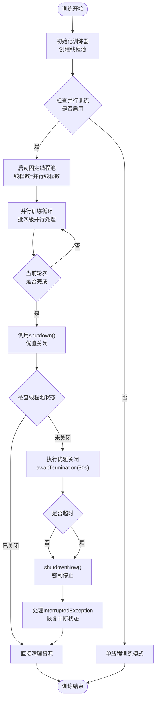
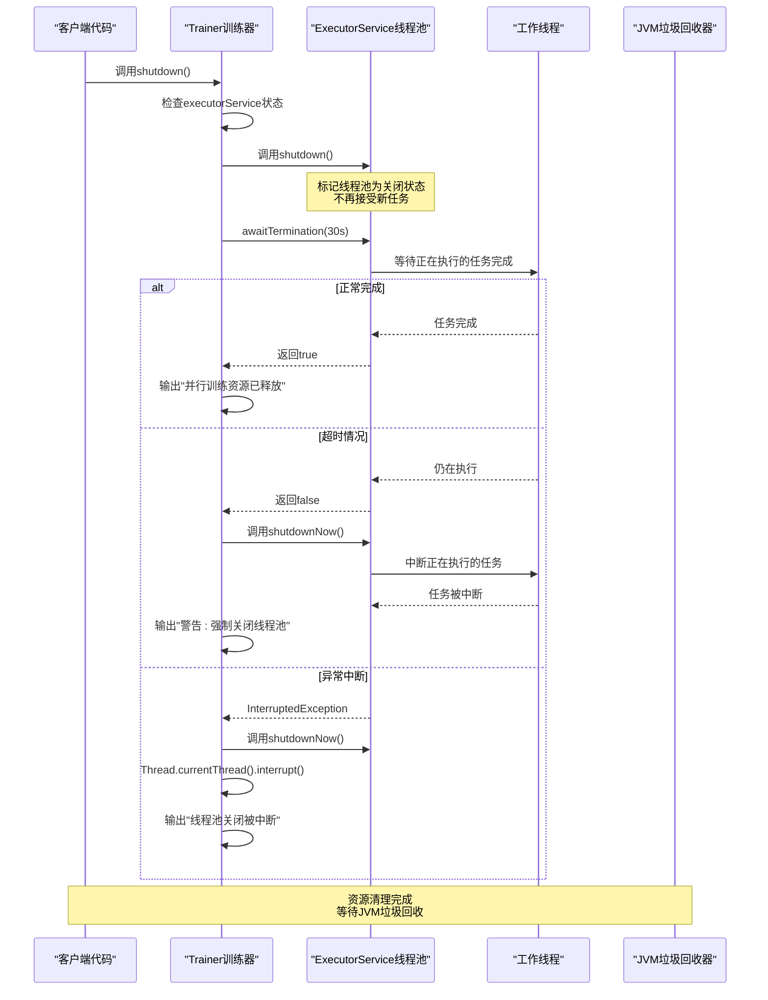
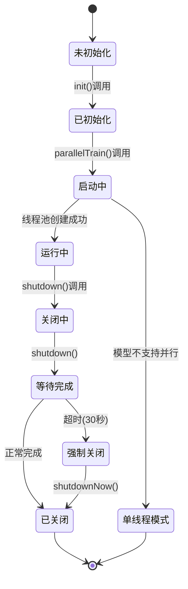

# 并行资源释放

<cite>
**本文档引用的文件**
- [Trainer.java](file://tinyai-dl-ml/src/main/java/io/leavesfly/tinyai/ml/Trainer.java)
- [ParallelTrainingUtils.java](file://tinyai-dl-ml/src/main/java/io/leavesfly/tinyai/ml/parallel/ParallelTrainingUtils.java)
- [ParallelBatchProcessor.java](file://tinyai-dl-ml/src/main/java/io/leavesfly/tinyai/ml/parallel/ParallelBatchProcessor.java)
- [GradientAggregator.java](file://tinyai-dl-ml/src/main/java/io/leavesfly/tinyai/ml/parallel/GradientAggregator.java)
- [ParallelTrainingTest.java](file://tinyai-dl-case/src/main/java/io/leavesfly/tinyai/example/parallel/ParallelTrainingTest.java)
- [TinyDL并行训练改造总结.md](file://tinyai-dl-ml/doc/TinyDL并行训练改造总结.md)
</cite>

## 目录
1. [简介](#简介)
2. [并行训练生命周期](#并行训练生命周期)
3. [shutdown()方法详解](#shutdown方法详解)
4. [优雅关闭流程](#优雅关闭流程)
5. [线程池状态管理](#线程池状态管理)
6. [资源清理最佳实践](#资源清理最佳实践)
7. [常见内存泄漏案例](#常见内存泄漏案例)
8. [JVM关闭钩子集成](#jvm关闭钩子集成)
9. [故障排除指南](#故障排除指南)
10. [总结](#总结)

## 简介

TinyDL框架的并行训练系统通过多线程技术显著提升了模型训练效率。然而，这种并行处理也带来了复杂的资源管理挑战。本文档重点阐述`shutdown()`方法在并行训练生命周期中的关键作用，详细分析其优雅关闭流程，以及如何防止线程泄漏和内存泄漏。

并行训练系统的核心组件包括：
- **ExecutorService线程池**：负责管理并行任务执行
- **GradientAggregator梯度聚合器**：线程安全地收集和平均梯度
- **ParallelBatchProcessor批次处理器**：独立处理单个批次的训练
- **Model深拷贝机制**：确保每个线程拥有独立的模型实例

## 并行训练生命周期

并行训练的生命周期可以分为以下关键阶段：



**图表来源**
- [Trainer.java](file://tinyai-dl-ml/src/main/java/io/leavesfly/tinyai/ml/Trainer.java#L374-L414)

## shutdown()方法详解

`shutdown()`方法是并行训练资源管理的核心，位于`Trainer`类中，负责优雅地关闭并行训练系统。该方法的设计体现了Java并发编程的最佳实践。

### 方法签名和基本逻辑

```java
public void shutdown() {
    if (executorService != null && !executorService.isShutdown()) {
        executorService.shutdown();
        try {
            // 等待正在执行的任务完成
            if (!executorService.awaitTermination(30, TimeUnit.SECONDS)) {
                // 强制停止
                System.err.println("警告: 强制关闭线程池");
                executorService.shutdownNow();
            }
        } catch (InterruptedException e) {
            System.err.println("线程池关闭被中断");
            executorService.shutdownNow();
            Thread.currentThread().interrupt();
        }
        System.out.println("并行训练资源已释放");
    }
}
```

### 关键设计原则

1. **状态检查前置**：在执行任何操作前检查线程池状态
2. **双重检查模式**：确保只在必要时执行关闭操作
3. **优雅优先**：优先尝试优雅关闭，只有在超时时才强制停止
4. **异常安全**：妥善处理InterruptedException并恢复中断状态

**章节来源**
- [Trainer.java](file://tinyai-dl-ml/src/main/java/io/leavesfly/tinyai/ml/Trainer.java#L374-L414)

## 优雅关闭流程

优雅关闭流程是并行训练资源管理的关键机制，确保所有正在执行的任务能够正常完成后再释放资源。

### 详细关闭步骤



**图表来源**
- [Trainer.java](file://tinyai-dl-ml/src/main/java/io/leavesfly/tinyai/ml/Trainer.java#L374-L414)

### 关键参数说明

- **30秒超时时间**：平衡了优雅关闭和系统响应性的考虑
- **shutdown()阶段**：标记线程池为关闭状态，拒绝新任务
- **awaitTermination()阶段**：等待现有任务完成，但不超过指定时间
- **shutdownNow()阶段**：强制中断所有正在执行的任务

**章节来源**
- [Trainer.java](file://tinyai-dl-ml/src/main/java/io/leavesfly/tinyai/ml/Trainer.java#L374-L414)

## 线程池状态管理

并行训练系统的线程池状态管理是资源释放的基础，涉及多个状态转换和检查点。

### 状态检查机制



### 状态检查代码实现

```java
// 状态检查示例
public boolean isParallelTrainingEnabled() {
    return enableParallelTraining && executorService != null && !executorService.isShutdown();
}

// 关闭状态检查
if (executorService != null && !executorService.isShutdown()) {
    // 执行关闭操作
}
```

### 线程池生命周期管理

1. **创建阶段**：`Executors.newFixedThreadPool(parallelThreadCount)`
2. **运行阶段**：任务提交和执行
3. **关闭阶段**：`shutdown()`标记关闭
4. **终止阶段**：`awaitTermination()`等待完成或`shutdownNow()`强制终止

**章节来源**
- [Trainer.java](file://tinyai-dl-ml/src/main/java/io/leavesfly/tinyai/ml/Trainer.java#L374-L414)
- [Trainer.java](file://tinyai-dl-ml/src/main/java/io/leavesfly/tinyai/ml/Trainer.java#L394-L396)

## 资源清理最佳实践

有效的资源清理是防止内存泄漏和系统资源耗尽的关键。以下是并行训练系统中的最佳实践。

### 1. 显式资源释放

```java
// 正确的资源释放模式
try {
    // 执行训练
    trainer.train(true);
} finally {
    // 确保资源释放
    trainer.shutdown();
}
```

### 2. 异常安全的资源管理

```java
// 使用try-with-resources模式
try (Trainer trainer = new Trainer(...)) {
    trainer.init(dataSet, model, loss, optimizer);
    trainer.train(true);
    // trainer自动关闭
} // 编译器自动生成shutdown()调用
```

### 3. 多线程环境下的资源管理

```java
// 多线程环境下的正确做法
public class ParallelTrainingManager {
    private final Trainer trainer;
    private final ExecutorService cleanupExecutor;
    
    public ParallelTrainingManager(...) {
        this.trainer = new Trainer(...);
        this.cleanupExecutor = Executors.newSingleThreadExecutor();
    }
    
    public void shutdown() {
        // 异步执行清理操作
        cleanupExecutor.execute(() -> {
            trainer.shutdown();
            cleanupExecutor.shutdown();
        });
    }
}
```

### 4. 资源监控和诊断

```java
// 资源使用情况监控
public void monitorResourceUsage() {
    if (trainer.isParallelTrainingEnabled()) {
        System.out.println("并行线程数: " + trainer.getParallelThreadCount());
        System.out.println("线程池状态: " + getThreadPoolStatus());
    }
}

private String getThreadPoolStatus() {
    // 实现线程池状态查询逻辑
    return "RUNNING"; // 示例返回值
}
```

**章节来源**
- [Trainer.java](file://tinyai-dl-ml/src/main/java/io/leavesfly/tinyai/ml/Trainer.java#L374-L414)
- [ParallelTrainingTest.java](file://tinyai-dl-case/src/main/java/io/leavesfly/tinyai/example/parallel/ParallelTrainingTest.java#L85-L95)

## 常见内存泄漏案例

理解常见的内存泄漏模式有助于预防和诊断问题。

### 1. 未调用shutdown()

```java
// 错误示例：忘记调用shutdown()
public void trainWithoutCleanup() {
    Trainer trainer = new Trainer(maxEpoch, monitor, evaluator, true, 4);
    trainer.init(dataSet, model, loss, optimizer);
    trainer.train(true);
    // 忘记调用trainer.shutdown()
    // 导致线程池无法释放，内存泄漏
}
```

### 2. 异常情况下未清理

```java
// 错误示例：异常情况下未清理资源
public void trainWithExceptionHandling() {
    Trainer trainer = new Trainer(maxEpoch, monitor, evaluator, true, 4);
    try {
        trainer.init(dataSet, model, loss, optimizer);
        trainer.train(true);
    } catch (Exception e) {
        // 异常处理，但忘记清理
        System.err.println("训练失败: " + e.getMessage());
        // 应该在这里调用trainer.shutdown()
    }
}
```

### 3. 循环引用导致的泄漏

```java
// 错误示例：循环引用
public class MemoryLeakExample {
    private Trainer trainer;
    private List<Trainer> trainers = new ArrayList<>(); // 循环引用
    
    public void createTrainers() {
        for (int i = 0; i < 10; i++) {
            Trainer t = new Trainer(...);
            trainers.add(t);
            // 每个trainer持有对列表的引用
            // 列表也持有对trainer的引用
        }
    }
}
```

### 4. 静态引用导致的泄漏

```java
// 错误示例：静态引用
public class StaticReferenceLeak {
    private static Trainer staticTrainer;
    
    public void createTrainer() {
        staticTrainer = new Trainer(...);
        // 即使方法执行完毕，trainer仍被静态引用
        // 无法被垃圾回收
    }
}
```

### 5. 未清理的监听器和回调

```java
// 错误示例：未清理的事件监听器
public class ListenerLeak {
    private EventListener listener;
    
    public void registerListener() {
        listener = new EventListener() {
            @Override
            public void onEvent(Event e) {
                // 处理事件
            }
        };
        eventManager.register(listener);
        // 忘记注销listener
    }
    
    public void cleanup() {
        eventManager.unregister(listener);
    }
}
```

### 预防措施

1. **使用finally块**：确保无论是否发生异常都执行清理
2. **实现AutoCloseable**：支持try-with-resources语法
3. **弱引用**：对于缓存等场景使用WeakReference
4. **定期清理**：实现定期清理机制

## JVM关闭钩子集成

将shutdown()方法集成到JVM关闭钩子中可以确保在程序意外终止时也能正确释放资源。

### 关闭钩子实现

```java
public class ShutdownHookManager {
    private static final List<AutoCloseable> resources = new ArrayList<>();
    
    public static void registerResource(AutoCloseable resource) {
        resources.add(resource);
    }
    
    public static void installShutdownHook() {
        Runtime.getRuntime().addShutdownHook(new Thread(() -> {
            System.out.println("JVM关闭钩子触发，开始清理资源...");
            for (AutoCloseable resource : resources) {
                try {
                    resource.close();
                    System.out.println("资源已清理");
                } catch (Exception e) {
                    System.err.println("清理资源时出错: " + e.getMessage());
                }
            }
        }));
    }
}
```

### Trainer集成示例

```java
public class ManagedTrainer extends Trainer implements AutoCloseable {
    public ManagedTrainer(...) {
        super(...);
        // 注册到关闭钩子管理器
        ShutdownHookManager.registerResource(this);
    }
    
    @Override
    public void close() throws Exception {
        shutdown();
    }
}
```

### 使用示例

```java
public class Application {
    public static void main(String[] args) {
        ShutdownHookManager.installShutdownHook();
        
        try (ManagedTrainer trainer = new ManagedTrainer(...)) {
            trainer.init(dataSet, model, loss, optimizer);
            trainer.train(true);
        } // 自动调用close()方法
    }
}
```

**章节来源**
- [Trainer.java](file://tinyai-dl-ml/src/main/java/io/leavesfly/tinyai/ml/Trainer.java#L374-L414)

## 故障排除指南

当并行训练资源释放出现问题时，可以通过以下步骤进行诊断和解决。

### 1. 诊断工具和方法

```java
// 资源使用情况诊断
public class ResourceDiagnostics {
    
    public static void diagnoseThreadPool(ExecutorService executor) {
        if (executor instanceof ThreadPoolExecutor) {
            ThreadPoolExecutor pool = (ThreadPoolExecutor) executor;
            System.out.println("线程池统计:");
            System.out.println("  核心线程数: " + pool.getCorePoolSize());
            System.out.println("  活跃线程数: " + pool.getActiveCount());
            System.out.println("  已完成任务数: " + pool.getCompletedTaskCount());
            System.out.println("  队列大小: " + pool.getQueue().size());
        }
    }
    
    public static void checkMemoryUsage() {
        Runtime runtime = Runtime.getRuntime();
        long totalMemory = runtime.totalMemory();
        long freeMemory = runtime.freeMemory();
        long usedMemory = totalMemory - freeMemory;
        
        System.out.println("内存使用情况:");
        System.out.println("  总内存: " + totalMemory / (1024 * 1024) + " MB");
        System.out.println("  已用内存: " + usedMemory / (1024 * 1024) + " MB");
        System.out.println("  可用内存: " + freeMemory / (1024 * 1024) + " MB");
    }
}
```

### 2. 常见问题和解决方案

#### 问题1：shutdown()方法执行缓慢

**症状**：调用shutdown()后程序长时间无响应

**原因分析**：
- 任务执行时间过长
- 任务内部存在死锁
- 线程池配置不当

**解决方案**：
```java
// 增加超时时间或强制关闭
public void handleSlowShutdown() {
    try {
        if (!executorService.awaitTermination(60, TimeUnit.SECONDS)) {
            System.err.println("优雅关闭超时，强制关闭...");
            List<Runnable> notExecuted = executorService.shutdownNow();
            System.out.println("强制关闭完成，未执行任务数: " + notExecuted.size());
        }
    } catch (InterruptedException e) {
        Thread.currentThread().interrupt();
        System.err.println("关闭过程被中断");
    }
}
```

#### 问题2：InterruptedException异常

**症状**：shutdown()过程中抛出InterruptedException

**原因分析**：
- 线程被外部中断
- 多线程环境下线程被取消

**解决方案**：
```java
// 正确处理InterruptedException
public void safeShutdown() {
    try {
        executorService.shutdown();
        if (!executorService.awaitTermination(30, TimeUnit.SECONDS)) {
            executorService.shutdownNow();
        }
    } catch (InterruptedException e) {
        // 恢复中断状态
        Thread.currentThread().interrupt();
        // 强制关闭
        executorService.shutdownNow();
        System.err.println("线程被中断，强制关闭线程池");
    }
}
```

#### 问题3：内存泄漏检测

**症状**：程序运行一段时间后内存持续增长

**诊断步骤**：
1. 使用JVM监控工具（JConsole、VisualVM）
2. 分析堆转储（heap dump）
3. 检查线程池状态
4. 验证shutdown()调用

**解决方案**：
```java
// 内存泄漏预防
public class MemoryAwareTrainer extends Trainer {
    @Override
    public void shutdown() {
        // 清理模型引用
        if (model != null) {
            model.clearReferences();
        }
        
        // 清理数据集引用
        if (dataSet != null) {
            dataSet.clear();
        }
        
        super.shutdown();
    }
}
```

### 3. 日志记录和监控

```java
// 增强的日志记录
public class TrainedLogger {
    private static final Logger logger = LoggerFactory.getLogger(TrainedLogger.class);
    
    public static void logShutdownProgress(Trainer trainer) {
        logger.info("开始关闭并行训练资源...");
        
        if (trainer.isParallelTrainingEnabled()) {
            logger.info("并行训练已启用，线程数: {}", trainer.getParallelThreadCount());
        } else {
            logger.info("并行训练未启用");
        }
        
        long startTime = System.currentTimeMillis();
        trainer.shutdown();
        long duration = System.currentTimeMillis() - startTime;
        
        logger.info("并行训练资源已释放，耗时: {} ms", duration);
    }
}
```

**章节来源**
- [Trainer.java](file://tinyai-dl-ml/src/main/java/io/leavesfly/tinyai/ml/Trainer.java#L374-L414)

## 总结

并行资源释放是TinyDL框架并行训练系统的重要组成部分。通过深入分析`shutdown()`方法的实现和优雅关闭流程，我们可以得出以下关键结论：

### 核心要点

1. **优雅关闭的重要性**：通过30秒的等待期，系统有机会让正在执行的任务正常完成，避免数据丢失和状态不一致。

2. **双重关闭策略**：先尝试优雅关闭，超时后强制关闭，这种策略在保证系统稳定性的同时也考虑了响应性。

3. **异常处理的安全性**：正确处理InterruptedException并恢复中断状态，确保线程安全。

4. **资源管理的责任链**：从Trainer类到具体的组件，形成了完整的资源管理责任链。

### 最佳实践总结

- **显式调用shutdown()**：在训练完成后必须显式调用shutdown()方法
- **异常安全的资源管理**：使用try-finally或try-with-resources模式
- **JVM关闭钩子集成**：确保程序意外终止时也能正确释放资源
- **定期监控和诊断**：建立资源使用情况的监控机制

### 未来改进方向

1. **更智能的超时策略**：根据任务类型和系统负载动态调整超时时间
2. **分布式资源管理**：支持跨进程的资源协调和清理
3. **自动化资源监控**：集成更强大的监控和告警机制
4. **GPU资源管理**：扩展到GPU内存和计算资源的管理

通过遵循这些原则和实践，开发者可以有效地管理并行训练系统的资源，避免内存泄漏和其他资源管理问题，确保系统的稳定性和可靠性。