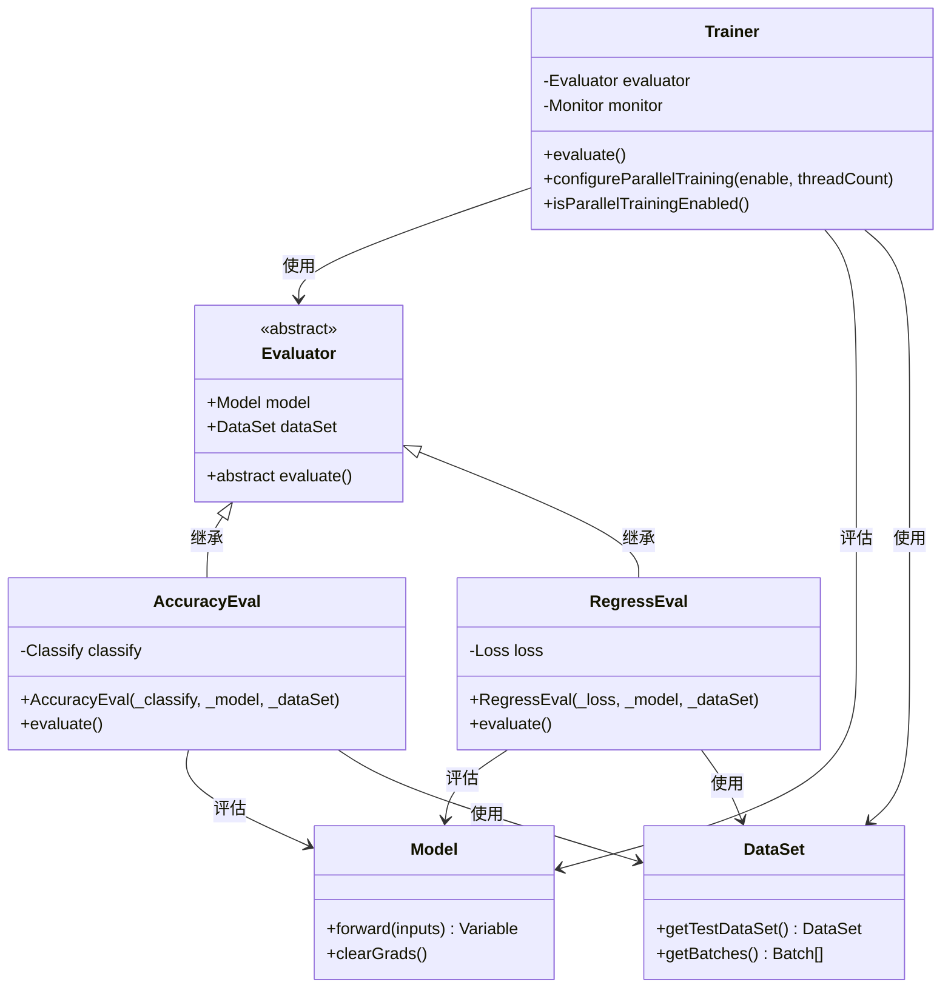
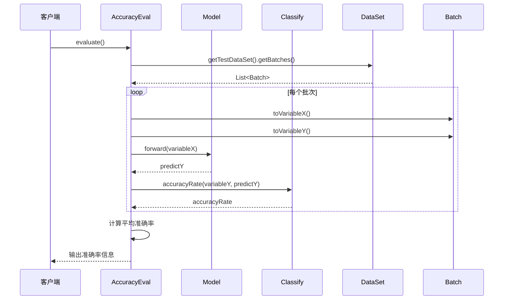
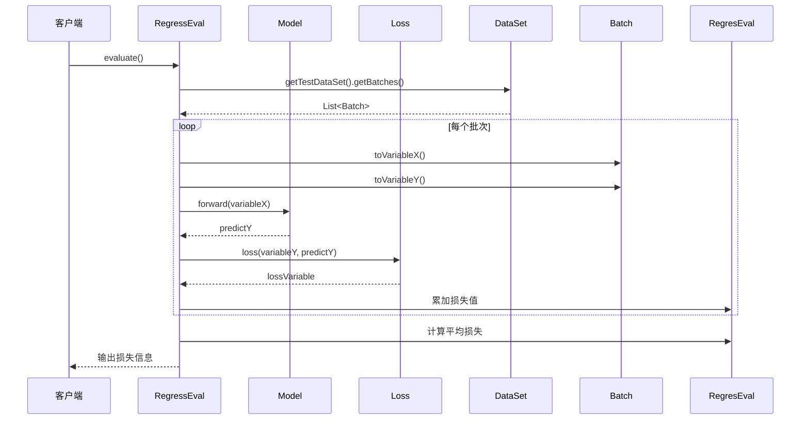
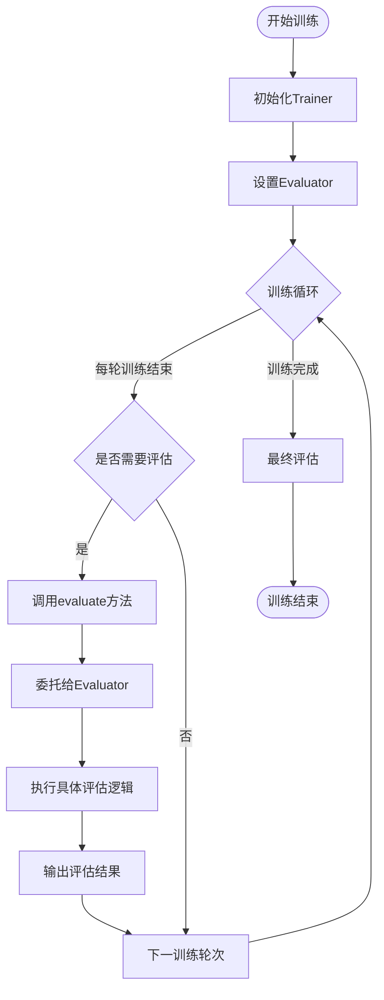

# 模型评估

<cite>
**本文档引用的文件**
- [Evaluator.java](file://tinyai-dl-ml/src/main/java/io/leavesfly/tinyai/ml/evaluator/Evaluator.java)
- [AccuracyEval.java](file://tinyai-dl-ml/src/main/java/io/leavesfly/tinyai/ml/evaluator/AccuracyEval.java)
- [RegressEval.java](file://tinyai-dl-ml/src/main/java/io/leavesfly/tinyai/ml/evaluator/RegressEval.java)
- [Trainer.java](file://tinyai-dl-ml/src/main/java/io/leavesfly/tinyai/ml/Trainer.java)
- [MonitorExample.java](file://tinyai-dl-case/src/main/java/io/leavesfly/tinyai/example/MonitorExample.java)
- [MnistMlpExam.java](file://tinyai-dl-case/src/main/java/io/leavesfly/tinyai/example/classify/MnistMlpExam.java)
- [ParallelTrainingTest.java](file://tinyai-dl-case/src/main/java/io/leavesfly/tinyai/example/parallel/ParallelTrainingTest.java)
- [EvaluatorTest.java](file://tinyai-dl-ml/src/test/java/io/leavesfly/tinyai/ml/evaluator/EvaluatorTest.java)
</cite>

## 目录
1. [简介](#简介)
2. [核心架构](#核心架构)
3. [Evaluator抽象类](#evaluator抽象类)
4. [具体评估器实现](#具体评估器实现)
5. [Trainer与Evaluator的协作](#trainer与evaluator的协作)
6. [评估流程详解](#评估流程详解)
7. [使用示例](#使用示例)
8. [性能考虑](#性能考虑)
9. [故障排除指南](#故障排除指南)
10. [结论](#结论)

## 简介

TinyAI框架中的模型评估系统采用委托模式设计，通过Evaluator抽象类及其子类实现灵活的模型性能评估功能。该系统支持多种评估类型，包括分类准确率评估和回归损失评估，为深度学习模型的性能监控和优化提供了完整的解决方案。

评估系统的核心设计理念是将评估逻辑与训练流程分离，通过清晰的接口定义实现可扩展性和可维护性。系统支持实时评估、批量评估以及并行评估等多种模式，能够适应不同规模和复杂度的深度学习任务。

## 核心架构



**图表来源**
- [Evaluator.java](file://tinyai-dl-ml/src/main/java/io/leavesfly/tinyai/ml/evaluator/Evaluator.java#L1-L25)
- [AccuracyEval.java](file://tinyai-dl-ml/src/main/java/io/leavesfly/tinyai/ml/evaluator/AccuracyEval.java#L1-L56)
- [RegressEval.java](file://tinyai-dl-ml/src/main/java/io/leavesfly/tinyai/ml/evaluator/RegressEval.java#L1-L53)
- [Trainer.java](file://tinyai-dl-ml/src/main/java/io/leavesfly/tinyai/ml/Trainer.java#L1-L50)

## Evaluator抽象类

Evaluator是所有评估器的基础抽象类，定义了模型评估的核心接口和基本属性。该类采用模板方法模式，确保所有子类都遵循统一的评估流程。

```java
public abstract class Evaluator {
    protected Model model;
    protected DataSet dataSet;
    
    public abstract void evaluate();
}
```

**关键特性：**
- **模型绑定**：每个Evaluator实例都绑定到特定的Model对象
- **数据集关联**：通过DataSet对象访问测试数据
- **抽象方法**：evaluate()方法由子类具体实现
- **委托模式**：将评估逻辑委托给具体的评估器实现

**章节来源**
- [Evaluator.java](file://tinyai-dl-ml/src/main/java/io/leavesfly/tinyai/ml/evaluator/Evaluator.java#L1-L25)

## 具体评估器实现

### AccuracyEval - 分类准确率评估器

AccuracyEval专门用于评估分类模型的准确率性能。它通过计算模型在测试数据集上的预测准确率来评估模型性能。



**图表来源**
- [AccuracyEval.java](file://tinyai-dl-ml/src/main/java/io/leavesfly/tinyai/ml/evaluator/AccuracyEval.java#L38-L55)

**实现特点：**
- **准确率计算**：使用Classify类的accuracyRate方法计算每批次的准确率
- **批量处理**：遍历所有测试批次，累加准确率后计算平均值
- **配置管理**：设置Config.train = false禁用训练模式
- **输出格式**：标准化输出格式便于监控和分析

### RegressEval - 回归损失评估器

RegressEval用于评估回归模型的性能指标，通过计算模型在测试数据集上的平均损失值来评估模型性能。



**图表来源**
- [RegressEval.java](file://tinyai-dl-ml/src/main/java/io/leavesfly/tinyai/ml/evaluator/RegressEval.java#L36-L52)

**实现特点：**
- **损失计算**：使用Loss类的loss方法计算预测损失
- **数值提取**：从Variable对象中提取浮点数值
- **批量求和**：累加所有批次的损失值
- **平均计算**：除以批次数量得到平均损失

**章节来源**
- [AccuracyEval.java](file://tinyai-dl-ml/src/main/java/io/leavesfly/tinyai/ml/evaluator/AccuracyEval.java#L1-L56)
- [RegressEval.java](file://tinyai-dl-ml/src/main/java/io/leavesfly/tinyai/ml/evaluator/RegressEval.java#L1-L53)

## Trainer与Evaluator的协作

Trainer类作为训练器的核心组件，负责协调模型训练和评估过程。通过委托模式，Trainer将评估任务委托给专门的Evaluator实例执行。



**图表来源**
- [Trainer.java](file://tinyai-dl-ml/src/main/java/io/leavesfly/tinyai/ml/Trainer.java#L342-L344)

**协作机制：**
- **委托执行**：Trainer.evaluate()方法直接调用evaluator.evaluate()
- **参数传递**：Evaluator实例在Trainer初始化时注入
- **生命周期管理**：评估器随Trainer的创建和销毁而管理
- **灵活性**：支持不同类型的Evaluator实例切换

**章节来源**
- [Trainer.java](file://tinyai-dl-ml/src/main/java/io/leavesfly/tinyai/ml/Trainer.java#L342-L344)

## 评估流程详解

### 测试数据集加载

评估过程的第一步是从DataSet对象中加载测试数据集。系统支持多种数据集类型，包括ArrayDataset、StreamDataset等。

```java
List<Batch> batches = dataSet.getTestDataSet().getBatches();
```

**加载流程：**
1. **数据集准备**：调用prepare()方法准备数据集
2. **批次分割**：将数据集分割为多个Batch对象
3. **内存管理**：确保数据集在评估期间保持稳定
4. **验证完整性**：检查数据集的有效性和完整性

### 前向传播执行

在评估过程中，模型执行前向传播以生成预测结果。系统会禁用训练模式以确保评估的准确性。

```java
Config.train = false;
Variable predictY = model.forward(variableX);
```

**执行特点：**
- **训练模式关闭**：设置Config.train = false禁用dropout等训练特有操作
- **梯度清除**：确保不会累积训练梯度
- **内存优化**：减少不必要的内存分配
- **性能优化**：针对评估场景的优化处理

### 预测结果与真实标签比较

评估器根据模型类型选择合适的比较方法：

**对于分类模型：**
```java
accRation += classify.accuracyRate(variableY, predictY);
```

**对于回归模型：**
```java
Variable lossVariable = loss.loss(variableY, predictY);
lossValue += lossVariable.getValue().getNumber().floatValue();
```

**比较机制：**
- **分类准确率**：使用Classify类的accuracyRate方法
- **回归损失**：使用Loss类的loss方法计算损失值
- **数值提取**：从Variable对象中提取浮点数值
- **精度保证**：确保数值转换的精度和稳定性

### 评估指标计算

系统支持多种评估指标的计算：

**分类模型指标：**
- **准确率**：正确预测的比例
- **精确率**：真正例占所有预测正例的比例
- **召回率**：真正例占所有实际正例的比例
- **F1分数**：精确率和召回率的调和平均

**回归模型指标：**
- **均方误差(MSE)**：预测值与真实值差的平方的平均值
- **均方根误差(RMSE)**：MSE的平方根
- **平均绝对误差(MAE)**：预测值与真实值差的绝对值的平均值
- **决定系数(R²)**：模型解释变异性的比例

### 结果输出与格式化

评估结果以标准化格式输出，便于后续分析和可视化：

```java
System.out.println("avg-accuracy rate is :" + accRation);
System.out.println(" Test dataset model's avg loss is :" + lossValue / batches.size());
```

**输出格式：**
- **分类准确率**：`avg-accuracy rate is :0.95`
- **回归损失**：`Test dataset model's avg loss is :0.025`
- **时间戳**：支持添加时间戳信息
- **指标名称**：明确标识评估指标类型

## 使用示例

### 基本使用模式

以下是最简单的评估使用模式：

```java
// 创建模型和数据集
Model model = new Model("MyModel", block);
DataSet dataSet = new SpiralDateSet(batchSize);

// 创建评估器
Evaluator evaluator = new AccuracyEval(new Classify(), model, dataSet);

// 创建训练器并初始化
Trainer trainer = new Trainer(maxEpoch, monitor, evaluator);
trainer.init(dataSet, model, loss, optimizer);

// 训练完成后评估
trainer.train(true);
trainer.evaluate();
```

### 在训练过程中定期评估

```java
public void trainWithPeriodicEvaluation(int evalFrequency) {
    for (int epoch = 0; epoch < maxEpoch; epoch++) {
        // 执行训练步骤...
        
        // 每N轮评估一次
        if ((epoch + 1) % evalFrequency == 0) {
            System.out.println("第" + (epoch + 1) + "轮评估:");
            trainer.evaluate();
        }
    }
}
```

### 多评估器组合使用

```java
// 创建多个评估器
Evaluator accuracyEval = new AccuracyEval(new Classify(), model, dataSet);
Evaluator lossEval = new RegressEval(new MeanSquaredLoss(), model, dataSet);

// 可以在训练过程中交替使用
if (epoch % 2 == 0) {
    accuracyEval.evaluate();
} else {
    lossEval.evaluate();
}
```

### 自定义评估器实现

```java
public class CustomEval extends Evaluator {
    private F1ScoreCalculator f1Calculator;
    
    @Override
    public void evaluate() {
        List<Batch> batches = dataSet.getTestDataSet().getBatches();
        float f1Score = 0f;
        
        for (Batch batch : batches) {
            Variable x = batch.toVariableX().setRequireGrad(false);
            Variable y = batch.toVariableY().setRequireGrad(false);
            
            Variable predict = model.forward(x);
            f1Score += f1Calculator.calculate(y, predict);
        }
        
        f1Score = f1Score / batches.size();
        System.out.println("F1 Score: " + f1Score);
    }
}
```

**章节来源**
- [MonitorExample.java](file://tinyai-dl-case/src/main/java/io/leavesfly/tinyai/example/MonitorExample.java#L69-L71)
- [MnistMlpExam.java](file://tinyai-dl-case/src/main/java/io/leavesfly/tinyai/example/classify/MnistMlpExam.java#L69-L71)

## 性能考虑

### 评估频率对训练效率的影响

评估频率的选择需要在评估准确性和训练效率之间找到平衡：

**高频评估（每轮评估）：**
- **优点**：及时发现问题，便于调试
- **缺点**：增加训练时间，可能影响收敛速度
- **适用场景**：模型调试阶段，快速迭代开发

**低频评估（每N轮评估）：**
- **优点**：减少评估开销，提高训练效率
- **缺点**：可能错过早期问题，调试困难
- **适用场景**：生产环境，稳定模型训练

### 内存使用优化

```java
// 评估时的内存优化策略
public void evaluate() {
    // 禁用训练模式，减少内存占用
    Config.train = false;
    
    // 及时释放临时变量
    try {
        // 执行评估逻辑
    } finally {
        // 清理资源
        System.gc();
    }
}
```

### 并行评估支持

虽然当前的Evaluator实现是串行的，但Trainer支持并行训练模式：

```java
// 启用并行评估（如果模型支持）
Trainer trainer = new Trainer(maxEpoch, monitor, evaluator, true, threadCount);
```

### 缓存机制

对于重复的评估操作，可以实现缓存机制：

```java
private Map<String, Float> evaluationCache = new HashMap<>();

public void evaluate() {
    String cacheKey = generateCacheKey();
    
    if (evaluationCache.containsKey(cacheKey)) {
        System.out.println("使用缓存评估结果: " + evaluationCache.get(cacheKey));
        return;
    }
    
    // 执行评估并缓存结果
    float result = performEvaluation();
    evaluationCache.put(cacheKey, result);
}
```

## 故障排除指南

### 常见问题及解决方案

**问题1：评估结果异常**
- **症状**：评估准确率为0或出现NaN值
- **原因**：模型未正确初始化或数据预处理错误
- **解决**：检查模型权重初始化和数据标准化

**问题2：评估速度过慢**
- **症状**：评估过程耗时过长
- **原因**：数据集过大或评估逻辑复杂
- **解决**：使用采样数据集或优化评估逻辑

**问题3：内存不足**
- **症状**：评估过程中出现OutOfMemoryError
- **原因**：大批量数据加载或内存泄漏
- **解决**：调整批次大小或清理临时变量

### 调试技巧

```java
// 添加调试信息
public void evaluate() {
    System.out.println("开始评估，数据集大小: " + dataSet.getSize());
    
    long startTime = System.currentTimeMillis();
    try {
        // 评估逻辑
    } finally {
        long endTime = System.currentTimeMillis();
        System.out.println("评估完成，耗时: " + (endTime - startTime) + "ms");
    }
}
```

### 性能监控

```java
// 监控评估性能
public void evaluate() {
    Runtime runtime = Runtime.getRuntime();
    long memoryBefore = runtime.totalMemory() - runtime.freeMemory();
    
    // 执行评估
    float result = performEvaluation();
    
    long memoryAfter = runtime.totalMemory() - runtime.freeMemory();
    System.out.println("内存使用: " + (memoryAfter - memoryBefore) + " bytes");
    
    return result;
}
```

**章节来源**
- [EvaluatorTest.java](file://tinyai-dl-ml/src/test/java/io/leavesfly/tinyai/ml/evaluator/EvaluatorTest.java#L100-L131)

## 结论

TinyAI的模型评估系统通过精心设计的架构和灵活的接口，为深度学习模型的性能评估提供了完整而高效的解决方案。系统的主要优势包括：

1. **模块化设计**：通过Evaluator抽象类实现清晰的职责分离
2. **可扩展性**：支持自定义评估器实现新的评估指标
3. **性能优化**：针对评估场景的专门优化
4. **易于使用**：简洁的API设计降低使用门槛
5. **监控集成**：与Monitor系统无缝集成

该评估系统不仅满足了基本的模型性能监控需求，还为高级用户提供了扩展和定制的空间。通过合理的评估策略和性能优化，可以在保证评估准确性的同时最大化训练效率。

未来的改进方向包括支持更多的评估指标、实现并行评估、增强缓存机制以及提供更丰富的可视化工具。这些改进将进一步提升系统的实用性和用户体验。