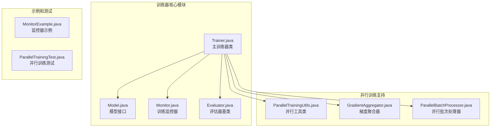
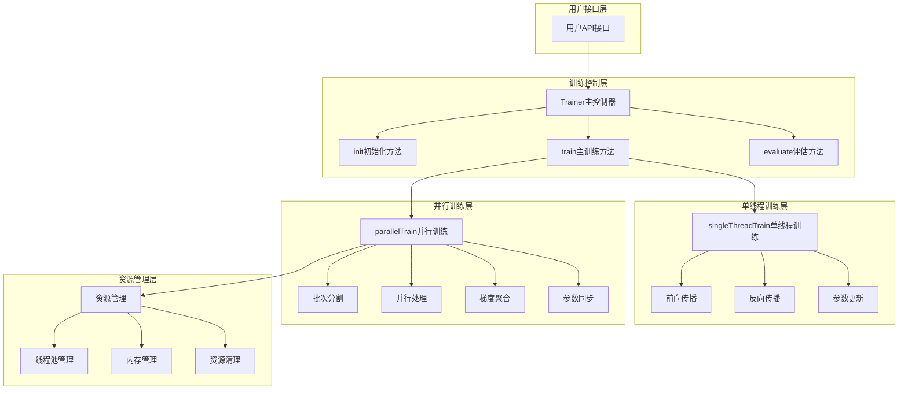
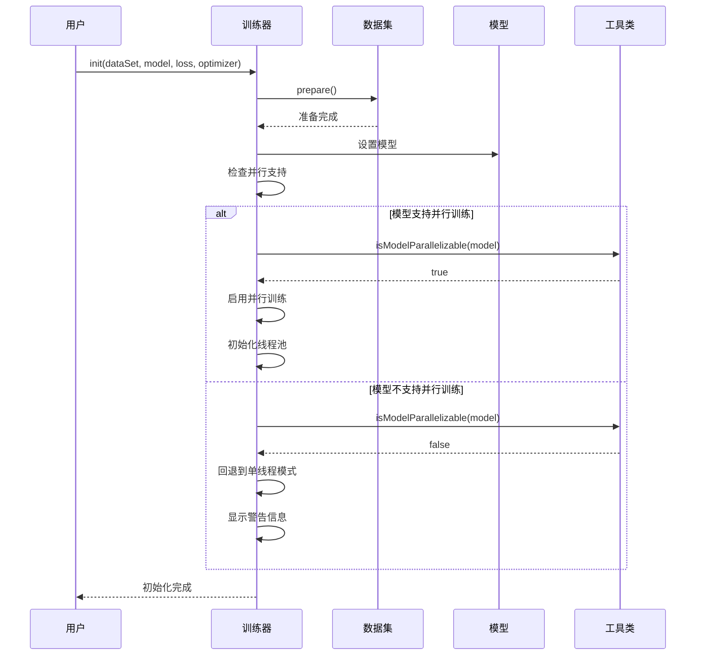
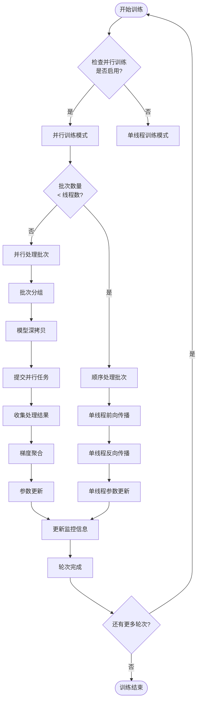
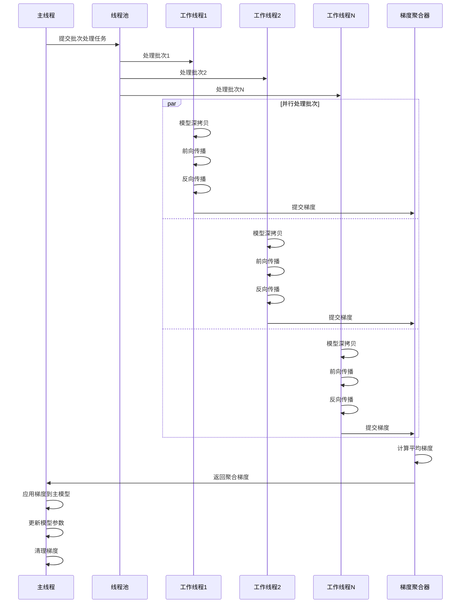
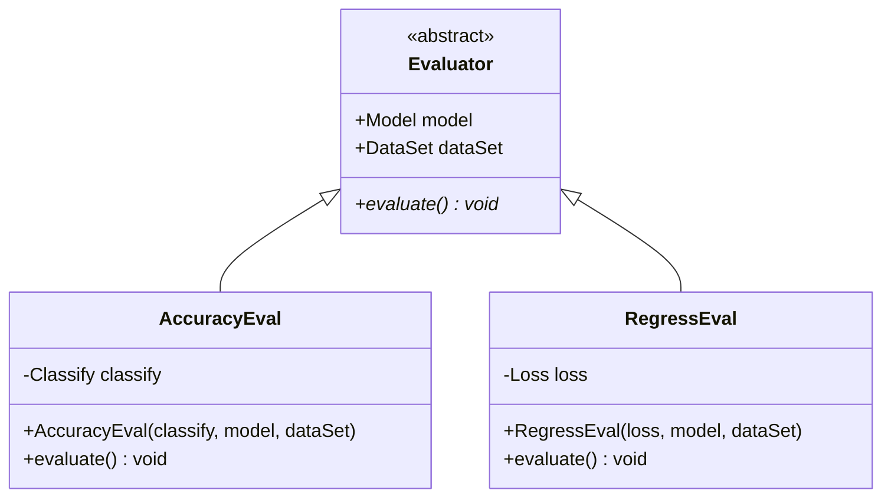
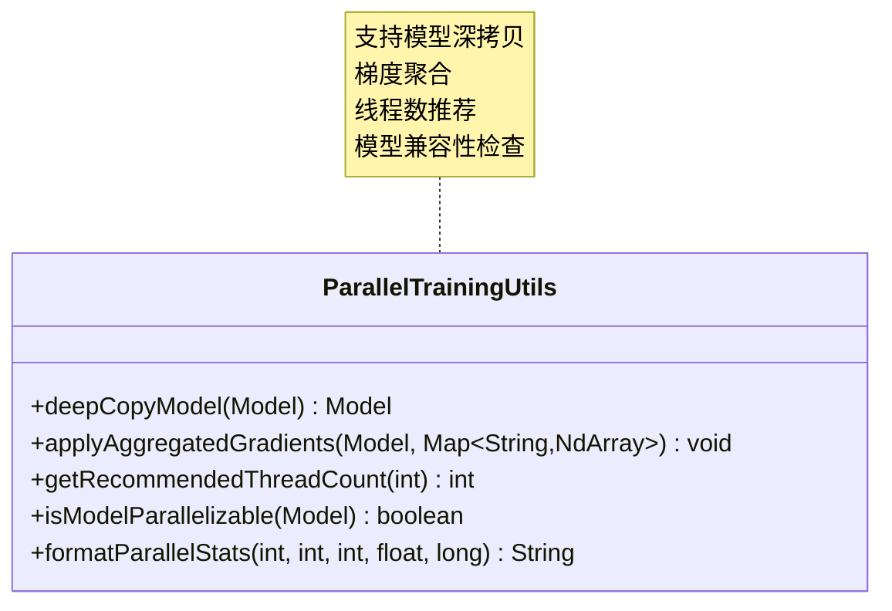

# 训练器API文档

<cite>
**本文档引用的文件**
- [Trainer.java](file://tinyai-dl-ml/src/main/java/io/leavesfly/tinyai/ml/Trainer.java)
- [ParallelTrainingUtils.java](file://tinyai-dl-ml/src/main/java/io/leavesfly/tinyai/ml/parallel/ParallelTrainingUtils.java)
- [Monitor.java](file://tinyai-dl-ml/src/main/java/io/leavesfly/tinyai/ml/Monitor.java)
- [Evaluator.java](file://tinyai-dl-ml/src/main/java/io/leavesfly/tinyai/ml/evaluator/Evaluator.java)
- [AccuracyEval.java](file://tinyai-dl-ml/src/main/java/io/leavesfly/tinyai/ml/evaluator/AccuracyEval.java)
- [Model.java](file://tinyai-dl-ml/src/main/java/io/leavesfly/tinyai/ml/Model.java)
- [MonitorExample.java](file://tinyai-dl-case/src/main/java/io/leavesfly/tinyai/example/MonitorExample.java)
- [ParallelTrainingTest.java](file://tinyai-dl-case/src/main/java/io/leavesfly/tinyai/example/parallel/ParallelTrainingTest.java)
</cite>

## 目录
1. [简介](#简介)
2. [项目结构](#项目结构)
3. [核心组件](#核心组件)
4. [架构概览](#架构概览)
5. [详细组件分析](#详细组件分析)
6. [依赖关系分析](#依赖关系分析)
7. [性能考虑](#性能考虑)
8. [故障排除指南](#故障排除指南)
9. [结论](#结论)

## 简介

TinyDL框架中的训练器API是一个功能强大的模型训练控制系统，提供了完整的训练流程管理功能。该系统支持单线程和并行训练两种模式，能够有效地管理模型训练过程中的各种资源和监控指标。

训练器API的核心设计理念是提供灵活且高效的训练控制机制，通过智能的并行训练策略和完善的资源管理，帮助开发者快速构建高性能的机器学习模型训练系统。

## 项目结构

训练器API位于TinyDL项目的`tinyai-dl-ml`模块中，主要包含以下关键文件：



**图表来源**
- [Trainer.java](file://tinyai-dl-ml/src/main/java/io/leavesfly/tinyai/ml/Trainer.java#L1-L495)
- [ParallelTrainingUtils.java](file://tinyai-dl-ml/src/main/java/io/leavesfly/tinyai/ml/parallel/ParallelTrainingUtils.java#L1-L122)

**章节来源**
- [Trainer.java](file://tinyai-dl-ml/src/main/java/io/leavesfly/tinyai/ml/Trainer.java#L1-L50)
- [ParallelTrainingUtils.java](file://tinyai-dl-ml/src/main/java/io/leavesfly/tinyai/ml/parallel/ParallelTrainingUtils.java#L1-L30)

## 核心组件

### Trainer类 - 训练器核心

Trainer类是整个训练系统的核心组件，提供了完整的训练流程管理功能：

```java
public class Trainer {
    // 核心训练组件
    private DataSet dataSet;
    private Model model;
    private Loss loss;
    private Optimizer optimizer;
    private Monitor monitor;
    private Evaluator evaluator;
    
    // 并行训练配置
    private int parallelThreadCount;
    private ExecutorService executorService;
    private boolean enableParallelTraining;
}
```

### 两种构造函数设计

训练器提供了两种不同的构造函数来满足不同场景的需求：

#### 基础训练器构造函数
```java
public Trainer(int _maxEpoch, Monitor _monitor, Evaluator _evaluator)
```
- **特点**: 默认不启用并行训练
- **适用场景**: 简单训练需求，资源受限环境
- **默认配置**: 自动计算推荐线程数

#### 高级训练器构造函数
```java
public Trainer(int _maxEpoch, Monitor _monitor, Evaluator _evaluator,
               boolean enableParallel, int threadCount)
```
- **特点**: 支持并行训练配置
- **适用场景**: 需要加速训练的复杂模型
- **灵活性**: 可动态调整并行参数

**章节来源**
- [Trainer.java](file://tinyai-dl-ml/src/main/java/io/leavesfly/tinyai/ml/Trainer.java#L50-L90)

## 架构概览

训练器API采用分层架构设计，确保了系统的可扩展性和维护性：



**图表来源**
- [Trainer.java](file://tinyai-dl-ml/src/main/java/io/leavesfly/tinyai/ml/Trainer.java#L100-L200)
- [Trainer.java](file://tinyai-dl-ml/src/main/java/io/leavesfly/tinyai/ml/Trainer.java#L200-L300)

## 详细组件分析

### init初始化方法详解

init方法负责训练器的初始化配置，是训练流程的第一步：



**图表来源**
- [Trainer.java](file://tinyai-dl-ml/src/main/java/io/leavesfly/tinyai/ml/Trainer.java#L92-L115)

#### 参数配置注入方式

训练器通过init方法注入以下关键组件：

1. **数据集注入**: `DataSet _dataSet`
   - 负责数据预处理和批次生成
   - 支持训练集和验证集分离

2. **模型注入**: `Model _model`
   - 封装神经网络架构
   - 维护模型参数和状态

3. **损失函数注入**: `Loss _loss`
   - 定义目标函数计算逻辑
   - 支持多种损失类型

4. **优化器注入**: `Optimizer _optimizer`
   - 控制参数更新策略
   - 支持SGD、Adam等多种优化算法

**章节来源**
- [Trainer.java](file://tinyai-dl-ml/src/main/java/io/leavesfly/tinyai/ml/Trainer.java#L92-L115)

### train主训练方法执行流程

train方法是训练器的核心入口，具有智能的训练模式选择能力：



**图表来源**
- [Trainer.java](file://tinyai-dl-ml/src/main/java/io/leavesfly/tinyai/ml/Trainer.java#L117-L130)
- [Trainer.java](file://tinyai-dl-ml/src/main/java/io/leavesfly/tinyai/ml/Trainer.java#L200-L250)

#### singleThreadTrain单线程训练机制

单线程训练是最基础的训练模式，适合简单模型和资源受限环境：

```java
public void singleThreadTrain(boolean shuffleData) {
    DataSet trainDataSet = dataSet.getTrainDataSet();
    if (shuffleData) {
        trainDataSet.shuffle();
    }

    for (int i = 0; i < maxEpoch; i++) {
        model.resetState();
        monitor.startNewEpoch(i);
        
        List<Batch> batches = trainDataSet.getBatches();
        float lossSum = 0f;
        float accSum = 0f;

        for (Batch batch : batches) {
            Variable variableX = batch.toVariableX().setName("x").setRequireGrad(false);
            Variable variableY = batch.toVariableY().setName("y").setRequireGrad(false);

            Variable predictY = model.forward(variableX);
            Variable lossVariable = loss.loss(variableY, predictY);
            
            model.clearGrads();
            lossSum += lossVariable.getValue().getNumber().floatValue();

            lossVariable.backward();
            optimizer.update();
            lossVariable.unChainBackward();
        }
        
        monitor.collectInfo(lossSum / batches.size());
        monitor.endEpoch();
        monitor.printTrainInfo();
    }
}
```

**章节来源**
- [Trainer.java](file://tinyai-dl-ml/src/main/java/io/leavesfly/tinyai/ml/Trainer.java#L132-L170)

#### parallelTrain并行训练机制

并行训练利用多线程技术加速训练过程，显著提升大型模型的训练效率：



**图表来源**
- [Trainer.java](file://tinyai-dl-ml/src/main/java/io/leavesfly/tinyai/ml/Trainer.java#L252-L320)

**章节来源**
- [Trainer.java](file://tinyai-dl-ml/src/main/java/io/leavesfly/tinyai/ml/Trainer.java#L252-L320)

### evaluate评估方法工作原理

evaluate方法负责模型性能评估，提供客观的模型质量指标：

```java
public void evaluate() {
    evaluator.evaluate();
}
```

评估过程的具体实现取决于具体的Evaluator子类：



**图表来源**
- [Evaluator.java](file://tinyai-dl-ml/src/main/java/io/leavesfly/tinyai/ml/evaluator/Evaluator.java#L1-L25)
- [AccuracyEval.java](file://tinyai-dl-ml/src/main/java/io/leavesfly/tinyai/ml/evaluator/AccuracyEval.java#L1-L56)

**章节来源**
- [Trainer.java](file://tinyai-dl-ml/src/main/java/io/leavesfly/tinyai/ml/Trainer.java#L322-L324)
- [AccuracyEval.java](file://tinyai-dl-ml/src/main/java/io/leavesfly/tinyai/ml/evaluator/AccuracyEval.java#L30-L55)

### 并行训练相关API详解

#### configureParallelTraining配置方法

```java
public void configureParallelTraining(boolean enable, int threadCount) {
    // 先关闭现有的线程池
    if (executorService != null && !executorService.isShutdown()) {
        shutdown();
    }
    
    this.enableParallelTraining = enable;
    if (threadCount > 0) {
        this.parallelThreadCount = threadCount;
    }
    
    // 如果启用并且模型已初始化，重新创建线程池
    if (enable && model != null) {
        if (ParallelTrainingUtils.isModelParallelizable(model)) {
            executorService = Executors.newFixedThreadPool(parallelThreadCount);
            System.out.println("并行训练已重新配置，线程数: " + parallelThreadCount);
        } else {
            System.err.println("模型不支持并行训练");
            this.enableParallelTraining = false;
        }
    }
}
```

#### isParallelTrainingEnabled状态检查

```java
public boolean isParallelTrainingEnabled() {
    return enableParallelTraining && executorService != null && !executorService.isShutdown();
}
```

#### getParallelThreadCount线程数获取

```java
public int getParallelThreadCount() {
    return parallelThreadCount;
}
```

#### shutdown资源释放

```java
public void shutdown() {
    if (executorService != null && !executorService.isShutdown()) {
        executorService.shutdown();
        try {
            // 等待正在执行的任务完成
            if (!executorService.awaitTermination(30, TimeUnit.SECONDS)) {
                // 强制停止
                System.err.println("警告: 强制关闭线程池");
                executorService.shutdownNow();
            }
        } catch (InterruptedException e) {
            System.err.println("线程池关闭被中断");
            executorService.shutdownNow();
            Thread.currentThread().interrupt();
        }
        System.out.println("并行训练资源已释放");
    }
}
```

**章节来源**
- [Trainer.java](file://tinyai-dl-ml/src/main/java/io/leavesfly/tinyai/ml/Trainer.java#L326-L370)
- [Trainer.java](file://tinyai-dl-ml/src/main/java/io/leavesfly/tinyai/ml/Trainer.java#L372-L390)
- [Trainer.java](file://tinyai-dl-ml/src/main/java/io/leavesfly/tinyai/ml/Trainer.java#L392-L400)
- [Trainer.java](file://tinyai-dl-ml/src/main/java/io/leavesfly/tinyai/ml/Trainer.java#L402-L425)

### ParallelTrainingUtils并行训练工具类

ParallelTrainingUtils提供了并行训练所需的核心工具方法：



**图表来源**
- [ParallelTrainingUtils.java](file://tinyai-dl-ml/src/main/java/io/leavesfly/tinyai/ml/parallel/ParallelTrainingUtils.java#L1-L122)

#### 模型深拷贝机制

```java
public static Model deepCopyModel(Model originalModel) {
    try {
        // 使用序列化进行深拷贝
        ByteArrayOutputStream baos = new ByteArrayOutputStream();
        ObjectOutputStream oos = new ObjectOutputStream(baos);
        oos.writeObject(originalModel);
        oos.close();

        ByteArrayInputStream bais = new ByteArrayInputStream(baos.toByteArray());
        ObjectInputStream ois = new ObjectInputStream(bais);
        Model copiedModel = (Model) ois.readObject();
        ois.close();

        return copiedModel;
    } catch (Exception e) {
        throw new RuntimeException("模型深拷贝失败: " + e.getMessage(), e);
    }
}
```

#### 梯度聚合和应用

```java
public static void applyAggregatedGradients(Model model, Map<String, NdArray> aggregatedGradients) {
    Map<String, Parameter> modelParams = model.getAllParams();

    for (Map.Entry<String, Parameter> entry : modelParams.entrySet()) {
        String paramName = entry.getKey();
        Parameter parameter = entry.getValue();

        // 获取对应的聚合梯度
        NdArray aggregatedGrad = aggregatedGradients.get(paramName);
        if (aggregatedGrad != null) {
            // 将聚合梯度设置到参数上
            parameter.setGrad(aggregatedGrad);
        }
    }
}
```

**章节来源**
- [ParallelTrainingUtils.java](file://tinyai-dl-ml/src/main/java/io/leavesfly/tinyai/ml/parallel/ParallelTrainingUtils.java#L20-L45)
- [ParallelTrainingUtils.java](file://tinyai-dl-ml/src/main/java/io/leavesfly/tinyai/ml/parallel/ParallelTrainingUtils.java#L47-L65)

## 依赖关系分析

训练器API的依赖关系体现了清晰的分层架构设计：

```mermaid
graph TD
subgraph "外部依赖"
JavaConcurrent[java.util.concurrent]
JavaIO[java.io]
JavaCollections[java.util]
end
subgraph "TinyDL核心模块"
FuncPackage[io.leavesfly.tinyai.func]
NdArrPackage[io.leavesfly.tinyai.ndarr]
NNetPackage[io.leavesfly.tinyai.nnet]
end
subgraph "训练器模块"
Trainer[Trainer]
Monitor[Monitor]
Evaluator[Evaluator]
Model[Model]
end
subgraph "并行训练模块"
ParallelUtils[ParallelTrainingUtils]
GradAgg[GradientAggregator]
BatchProc[ParallelBatchProcessor]
end
subgraph "数据集模块"
DataSet[DataSet]
Batch[Batch]
end
subgraph "损失和优化模块"
Loss[Loss]
Optimizer[Optimizer]
end
Trainer --> JavaConcurrent
Trainer --> JavaIO
Trainer --> JavaCollections
Trainer --> FuncPackage
Trainer --> NdArrPackage
Trainer --> NNetPackage
Trainer --> Monitor
Trainer --> Evaluator
Trainer --> Model
Trainer --> ParallelUtils
Trainer --> GradAgg
Trainer --> BatchProc
Trainer --> DataSet
Trainer --> Batch
Trainer --> Loss
Trainer --> Optimizer
```



**图表来源**
- [Trainer.java](file://tinyai-dl-ml/src/main/java/io/leavesfly/tinyai/ml/Trainer.java#L1-L20)

**章节来源**
- [Trainer.java](file://tinyai-dl-ml/src/main/java/io/leavesfly/tinyai/ml/Trainer.java#L1-L20)

## 性能考虑

### 线程数优化策略

训练器采用了智能的线程数推荐机制：

```java
public static int getRecommendedThreadCount(int batchCount) {
    int availableCores = Runtime.getRuntime().availableProcessors();

    // 线程数不应超过可用核心数的75%，也不应超过批次数量
    int maxThreads = Math.max(1, (int) (availableCores * 0.75));
    return Math.min(maxThreads, batchCount);
}
```

### 内存管理优化

1. **模型深拷贝**: 使用序列化技术确保线程安全
2. **梯度清理**: 每轮训练后及时清理梯度缓存
3. **资源回收**: 提供显式的shutdown方法进行资源清理

### 性能监控指标

训练器内置了全面的性能监控功能：

- **训练损失**: 实时跟踪训练过程中的损失变化
- **训练时间**: 记录每轮训练的执行时间
- **准确率**: 监控模型在训练集和验证集上的表现
- **内存使用**: 跟踪内存消耗情况

## 故障排除指南

### 常见问题及解决方案

#### 1. 并行训练不生效

**症状**: 训练器显示并行训练已启用，但实际运行速度没有提升

**原因**: 模型不支持序列化

**解决方案**:
```java
// 检查模型是否支持并行训练
if (!ParallelTrainingUtils.isModelParallelizable(model)) {
    System.err.println("模型不支持并行训练，将回退到单线程模式");
}
```

#### 2. 内存溢出错误

**症状**: 并行训练时出现OutOfMemoryError

**原因**: 线程数过多导致内存不足

**解决方案**:
```java
// 减少线程数或增加JVM堆内存
trainer.configureParallelTraining(true, Math.min(4, Runtime.getRuntime().availableProcessors()));
```

#### 3. 线程池资源泄漏

**症状**: 长时间运行后系统响应变慢

**原因**: 未正确调用shutdown方法

**解决方案**:
```java
try {
    trainer.train(true);
} finally {
    trainer.shutdown();
}
```

**章节来源**
- [Trainer.java](file://tinyai-dl-ml/src/main/java/io/leavesfly/tinyai/ml/Trainer.java#L105-L115)
- [ParallelTrainingUtils.java](file://tinyai-dl-ml/src/main/java/io/leavesfly/tinyai/ml/parallel/ParallelTrainingUtils.java#L75-L90)

## 结论

TinyDL的训练器API提供了一个功能完整、设计精良的模型训练控制系统。通过支持单线程和并行训练两种模式，它能够适应从简单实验到大规模生产的各种应用场景。

### 主要优势

1. **灵活的设计**: 支持多种训练模式和配置选项
2. **高效的并行**: 利用多线程技术显著提升训练速度
3. **完善的监控**: 内置全面的训练过程监控和可视化功能
4. **易于使用**: 简洁的API设计降低了使用门槛
5. **资源管理**: 完善的资源管理和清理机制

### 最佳实践建议

1. **合理配置线程数**: 根据硬件资源和模型复杂度调整并行参数
2. **及时释放资源**: 在训练完成后调用shutdown方法
3. **监控训练过程**: 利用Monitor类跟踪训练指标和性能
4. **选择合适的评估器**: 根据任务类型选择相应的Evaluator实现
5. **注意内存管理**: 对于大型模型，考虑使用梯度累积等技术

通过遵循这些最佳实践，开发者可以充分发挥训练器API的潜力，构建高效、稳定的机器学习训练系统。