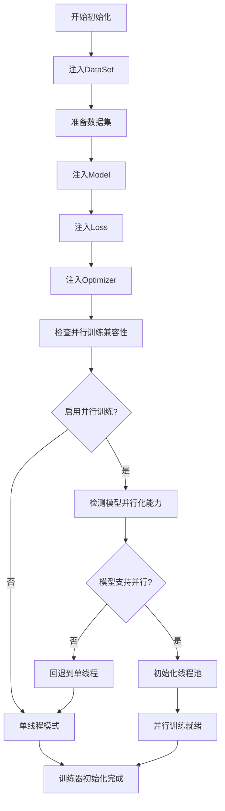
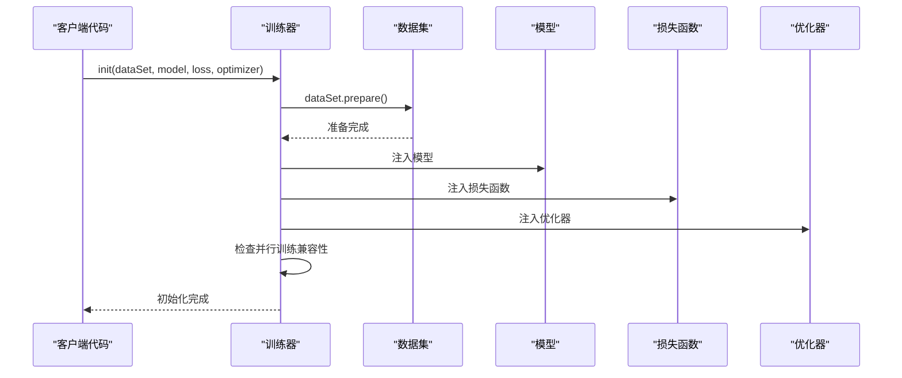
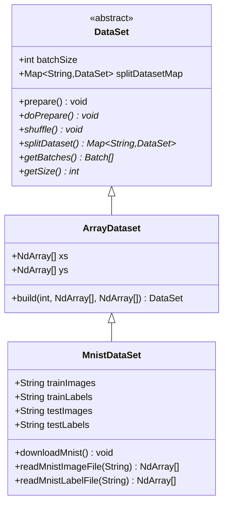
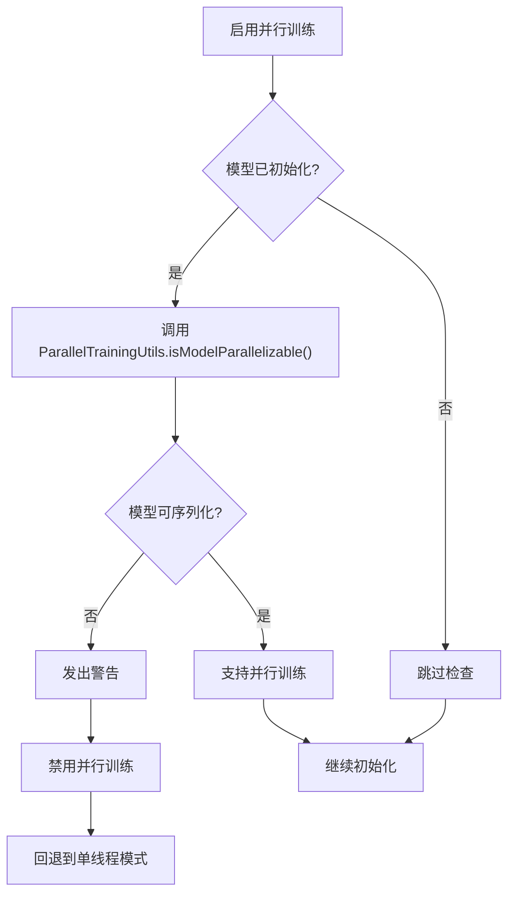
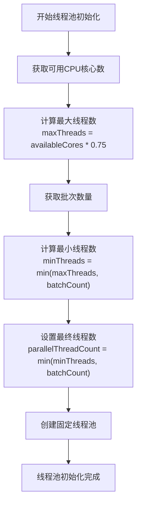

# 训练器初始化流程详解

<cite>
**本文档引用的文件**
- [Trainer.java](file://tinyai-dl-ml/src/main/java/io/leavesfly/tinyai/ml/Trainer.java)
- [ParallelTrainingUtils.java](file://tinyai-dl-ml/src/main/java/io/leavesfly/tinyai/ml/parallel/ParallelTrainingUtils.java)
- [ParallelBatchProcessor.java](file://tinyai-dl-ml/src/main/java/io/leavesfly/tinyai/ml/parallel/ParallelBatchProcessor.java)
- [GradientAggregator.java](file://tinyai-dl-ml/src/main/java/io/leavesfly/tinyai/ml/parallel/GradientAggregator.java)
- [DataSet.java](file://tinyai-dl-ml/src/main/java/io/leavesfly/tinyai/ml/dataset/DataSet.java)
- [MnistDataSet.java](file://tinyai-dl-ml/src/main/java/io/leavesfly/tinyai/ml/dataset/simple/MnistDataSet.java)
- [Model.java](file://tinyai-dl-ml/src/main/java/io/leavesfly/tinyai/ml/Model.java)
- [Loss.java](file://tinyai-dl-ml/src/main/java/io/leavesfly/tinyai/ml/loss/Loss.java)
- [Optimizer.java](file://tinyai-dl-ml/src/main/java/io/leavesfly/tinyai/ml/optimize/Optimizer.java)
</cite>

## 目录
1. [简介](#简介)
2. [训练器初始化架构概览](#训练器初始化架构概览)
3. [核心组件注入流程](#核心组件注入流程)
4. [数据集准备过程](#数据集准备过程)
5. [并行训练兼容性检查机制](#并行训练兼容性检查机制)
6. [线程池初始化逻辑](#线程池初始化逻辑)
7. [完整初始化代码示例](#完整初始化代码示例)
8. [常见初始化错误及解决方案](#常见初始化错误及解决方案)
9. [性能优化建议](#性能优化建议)
10. [总结](#总结)

## 简介

TinyAI框架的训练器初始化是一个复杂而精密的过程，涉及四个核心组件的注入：DataSet（数据集）、Model（模型）、Loss（损失函数）和Optimizer（优化器）。本文档将深入解析init方法的初始化流程，详细说明各组件的注入方式、数据集准备过程以及并行训练的兼容性检查机制。

## 训练器初始化架构概览

训练器初始化采用依赖注入模式，通过init方法将四个核心组件注入到训练器实例中。整个初始化过程包含以下关键步骤：



**图表来源**
- [Trainer.java](file://tinyai-dl-ml/src/main/java/io/leavesfly/tinyai/ml/Trainer.java#L92-L125)

## 核心组件注入流程

### 初始化方法签名

```java
public void init(DataSet _dataSet, Model _model, Loss _loss, Optimizer _optimizer)
```

### 注入顺序和验证

训练器按照严格的顺序注入四个核心组件：

1. **DataSet注入**：首先注入数据集，这是训练的基础
2. **Model注入**：随后注入模型，建立训练目标
3. **Loss注入**：接着注入损失函数，定义优化目标
4. **Optimizer注入**：最后注入优化器，确定参数更新策略



**图表来源**
- [Trainer.java](file://tinyai-dl-ml/src/main/java/io/leavesfly/tinyai/ml/Trainer.java#L92-L125)

**章节来源**
- [Trainer.java](file://tinyai-dl-ml/src/main/java/io/leavesfly/tinyai/ml/Trainer.java#L92-L125)

## 数据集准备过程

数据集准备是训练器初始化的关键环节，涉及数据下载、预处理和批次划分等多个步骤。

### 数据集抽象层设计



**图表来源**
- [DataSet.java](file://tinyai-dl-ml/src/main/java/io/leavesfly/tinyai/ml/dataset/DataSet.java#L1-L123)
- [MnistDataSet.java](file://tinyai-dl-ml/src/main/java/io/leavesfly/tinyai/ml/dataset/simple/MnistDataSet.java#L1-L181)

### 数据集准备流程

数据集准备过程包含以下关键步骤：

1. **下载数据**：自动从指定URL下载MNIST数据集
2. **读取二进制文件**：解析IDX格式的图像和标签文件
3. **数据预处理**：归一化像素值到[0,1]范围
4. **构建批次**：将数据分割成指定大小的批次
5. **数据集分割**：创建训练集、测试集和验证集

```java
// 数据集准备示例代码
public void doPrepare() {
    try {
        downloadMnist();
        NdArray[] trainX = readMnistImageFile(trainImages);
        NdArray[] trainY = readMnistLabelFile(trainLabels);
        DataSet trainDataset = build(batchSize, trainX, trainY);
        splitDatasetMap.put(Usage.TRAIN.name(), trainDataset);
        
        NdArray[] testX = readMnistImageFile(testImages);
        NdArray[] testY = readMnistLabelFile(testLabels);
        DataSet testDataset = build(batchSize, testX, testY);
        splitDatasetMap.put(Usage.TEST.name(), testDataset);
    } catch (Exception e) {
        throw new RuntimeException("MnistDataSet prepare() error!");
    }
}
```

**章节来源**
- [MnistDataSet.java](file://tinyai-dl-ml/src/main/java/io/leavesfly/tinyai/ml/dataset/simple/MnistDataSet.java#L35-L50)

## 并行训练兼容性检查机制

并行训练兼容性检查是训练器初始化的重要安全保障，确保模型能够安全地进行多线程并行处理。

### 模型序列化检测



**图表来源**
- [ParallelTrainingUtils.java](file://tinyai-dl-ml/src/main/java/io/leavesfly/tinyai/ml/parallel/ParallelTrainingUtils.java#L75-L85)

### 序列化检测实现

```java
public static boolean isModelParallelizable(Model model) {
    try {
        // 尝试序列化测试
        ByteArrayOutputStream baos = new ByteArrayOutputStream();
        ObjectOutputStream oos = new ObjectOutputStream(baos);
        oos.writeObject(model);
        oos.close();
        return true;
    } catch (Exception e) {
        return false;
    }
}
```

### 深拷贝机制

为了支持并行训练，系统需要为每个线程创建模型的深拷贝：

```java
public static Model deepCopyModel(Model originalModel) {
    try {
        // 使用序列化进行深拷贝
        ByteArrayOutputStream baos = new ByteArrayOutputStream();
        ObjectOutputStream oos = new ObjectOutputStream(baos);
        oos.writeObject(originalModel);
        oos.close();

        ByteArrayInputStream bais = new ByteArrayInputStream(baos.toByteArray());
        ObjectInputStream ois = new ObjectInputStream(bais);
        Model copiedModel = (Model) ois.readObject();
        ois.close();

        return copiedModel;
    } catch (Exception e) {
        throw new RuntimeException("模型深拷贝失败: " + e.getMessage(), e);
    }
}
```

**章节来源**
- [ParallelTrainingUtils.java](file://tinyai-dl-ml/src/main/java/io/leavesfly/tinyai/ml/parallel/ParallelTrainingUtils.java#L18-L40)
- [ParallelTrainingUtils.java](file://tinyai-dl-ml/src/main/java/io/leavesfly/tinyai/ml/parallel/ParallelTrainingUtils.java#L75-L85)

## 线程池初始化逻辑

线程池初始化是并行训练的核心，涉及线程数计算、资源分配和安全策略。

### 线程数计算策略



**图表来源**
- [ParallelTrainingUtils.java](file://tinyai-dl-ml/src/main/java/io/leavesfly/tinyai/ml/parallel/ParallelTrainingUtils.java#L50-L60)

### 动态线程数调整

训练器会根据实际批次数量动态调整线程数：

```java
// 根据实际batch数重新计算线程数
DataSet trainDataSet = dataSet.getTrainDataSet();
if (trainDataSet != null) {
    List<Batch> batches = trainDataSet.getBatches();
    parallelThreadCount = Math.min(parallelThreadCount, batches.size());
}
```

### 线程池配置

```java
// 初始化线程池
if (enableParallelTraining) {
    executorService = Executors.newFixedThreadPool(parallelThreadCount);
    System.out.println("并行训练已启用，线程数: " + parallelThreadCount);
}
```

### 推荐线程数计算

```java
public static int getRecommendedThreadCount(int batchCount) {
    int availableCores = Runtime.getRuntime().availableProcessors();
    
    // 线程数不应超过可用核心数的75%，也不应超过批次数量
    int maxThreads = Math.max(1, (int) (availableCores * 0.75));
    return Math.min(maxThreads, batchCount);
}
```

**章节来源**
- [Trainer.java](file://tinyai-dl-ml/src/main/java/io/leavesfly/tinyai/ml/Trainer.java#L105-L115)
- [ParallelTrainingUtils.java](file://tinyai-dl-ml/src/main/java/io/leavesfly/tinyai/ml/parallel/ParallelTrainingUtils.java#L50-L60)

## 完整初始化代码示例

以下是一个完整的训练器初始化示例，展示了各组件的正确注入方式：

```java
// 1. 创建数据集
MnistDataSet dataSet = new MnistDataSet(64);
dataSet.prepare();

// 2. 创建模型
SequentialBlock block = new SequentialBlock();
block.add(new LinearLayer(784, 128));
block.add(new ReLuLayer());
block.add(new LinearLayer(128, 10));
block.add(new SoftMaxLayer());
Model model = new Model("MNIST_CNN", block);

// 3. 创建损失函数
Loss loss = new SoftmaxCrossEntropy();

// 4. 创建优化器
Optimizer optimizer = new SGD(model, 0.01);

// 5. 创建训练器
Trainer trainer = new Trainer(10, new Monitor(), new AccuracyEval());
trainer.init(dataSet, model, loss, optimizer);

// 6. 启用并行训练（可选）
trainer.configureParallelTraining(true, 4);

// 7. 开始训练
trainer.train(true);
```

### 并行训练初始化示例

```java
// 创建支持并行训练的训练器
Trainer trainer = new Trainer(10, new Monitor(), new AccuracyEval(), 
                            true, 4); // 启用并行训练，4个线程

// 或者使用构造器后配置
Trainer trainer = new Trainer(10, new Monitor(), new AccuracyEval());
trainer.configureParallelTraining(true, 4);

// 初始化训练器
trainer.init(dataSet, model, loss, optimizer);
```

## 常见初始化错误及解决方案

### 错误1：模型不支持序列化

**错误现象**：
```
警告: 模型不支持并行训练，将回退到单线程模式
```

**原因分析**：
- 模型中包含不可序列化的对象
- 模型结构过于复杂导致序列化失败

**解决方案**：
```java
// 检查模型是否可序列化
try {
    ParallelTrainingUtils.isModelParallelizable(model);
} catch (Exception e) {
    System.err.println("模型序列化失败: " + e.getMessage());
    // 修改模型结构或使用单线程训练
}

// 或者直接禁用并行训练
trainer.configureParallelTraining(false, 0);
```

### 错误2：批次数量不足

**错误现象**：
```
警告: 并行训练未启用，回退到单线程模式
```

**原因分析**：
- 数据集批次数量少于线程数
- 并行训练不适合小数据集

**解决方案**：
```java
// 检查批次数量
DataSet trainDataSet = dataSet.getTrainDataSet();
List<Batch> batches = trainDataSet.getBatches();
if (batches.size() < trainer.getParallelThreadCount()) {
    // 减少线程数或使用单线程训练
    trainer.configureParallelTraining(true, batches.size());
}
```

### 错误3：内存不足

**错误现象**：
```
OutOfMemoryError: Java heap space
```

**原因分析**：
- 并行线程数过多导致内存溢出
- 每个线程都需要独立的模型副本

**解决方案**：
```java
// 减少并行线程数
int optimalThreads = ParallelTrainingUtils.getRecommendedThreadCount(batches.size());
trainer.configureParallelTraining(true, optimalThreads);

// 或者使用更小的批次大小
dataSet = new MnistDataSet(32); // 减少批次大小
```

### 错误4：资源泄漏

**错误现象**：
```
无法关闭线程池
```

**原因分析**：
- 未正确关闭训练器
- 线程池未释放

**解决方案**：
```java
// 正确的资源管理
Trainer trainer = new Trainer(...);
try {
    trainer.init(dataSet, model, loss, optimizer);
    trainer.train(true);
} finally {
    trainer.shutdown(); // 确保资源释放
}
```

**章节来源**
- [Trainer.java](file://tinyai-dl-ml/src/main/java/io/leavesfly/tinyai/ml/Trainer.java#L410-L440)

## 性能优化建议

### 1. 合理配置线程数

```java
// 根据硬件配置优化线程数
int availableCores = Runtime.getRuntime().availableProcessors();
int optimalThreads = Math.max(1, (int)(availableCores * 0.75));

// 根据数据集大小调整
int batchSize = 64;
int optimalBatchSize = ParallelTrainingUtils.getRecommendedThreadCount(batchSize);
```

### 2. 批次大小优化

```java
// 推荐的批次大小范围
int[] batchSizes = {32, 64, 128, 256};
for (int batchSize : batchSizes) {
    MnistDataSet dataSet = new MnistDataSet(batchSize);
    // 测试不同批次大小的性能
}
```

### 3. 内存管理

```java
// 及时清理临时变量
model.clearGrads();
lossVariable.unChainBackward();

// 监控内存使用
Runtime runtime = Runtime.getRuntime();
long memoryUsed = runtime.totalMemory() - runtime.freeMemory();
System.out.println("内存使用: " + memoryUsed / (1024 * 1024) + " MB");
```

### 4. 并行训练适用场景

- **大数据集**：至少1000个样本以上
- **复杂模型**：参数量超过10万
- **长训练周期**：超过10个epoch
- **充足内存**：每个线程需要独立模型副本

## 总结

TinyAI框架的训练器初始化流程是一个精心设计的系统，通过严格的组件注入、智能的兼容性检查和灵活的资源配置，为用户提供了强大而可靠的训练环境。

### 关键特性总结

1. **依赖注入模式**：通过init方法实现四个核心组件的有序注入
2. **智能兼容性检查**：自动检测模型是否支持并行训练
3. **动态资源配置**：根据实际数据情况调整线程数
4. **安全回退机制**：不支持并行训练时自动回退到单线程模式
5. **完善的错误处理**：提供详细的错误信息和解决方案

### 最佳实践建议

- 在初始化前验证各组件的有效性
- 根据硬件配置合理设置并行参数
- 及时释放训练器资源避免内存泄漏
- 监控训练过程中的性能指标
- 根据数据集特点选择合适的训练模式

通过深入理解这些初始化机制，开发者可以更好地利用TinyAI框架的强大功能，构建高效、稳定的机器学习训练系统。