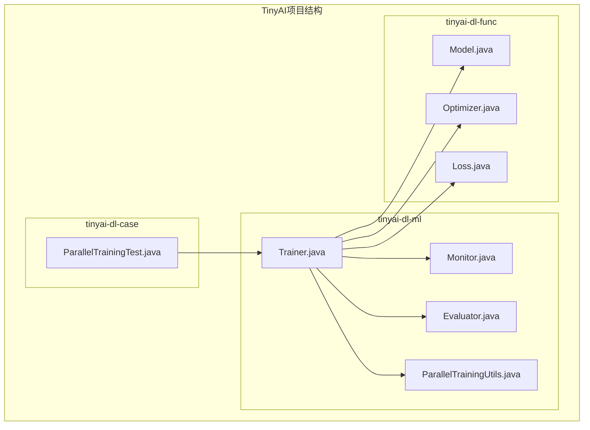
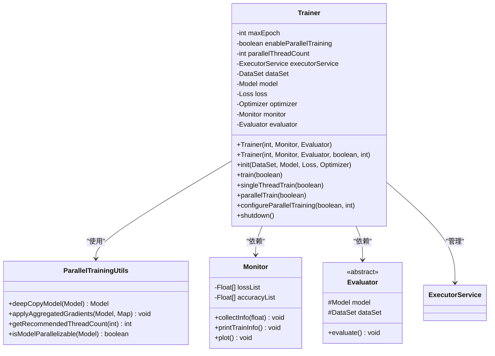
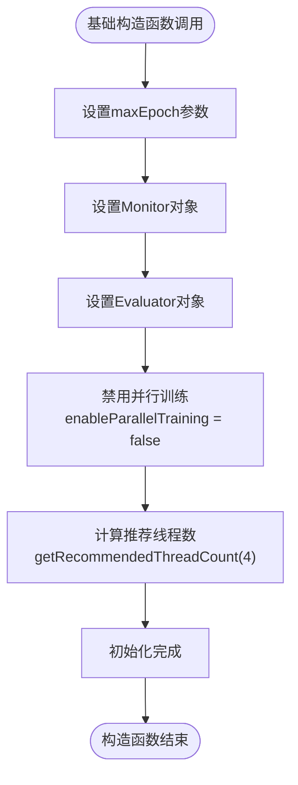
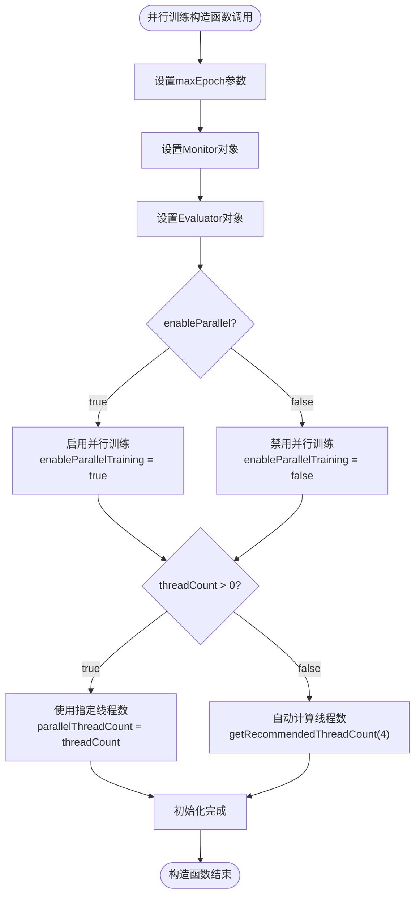
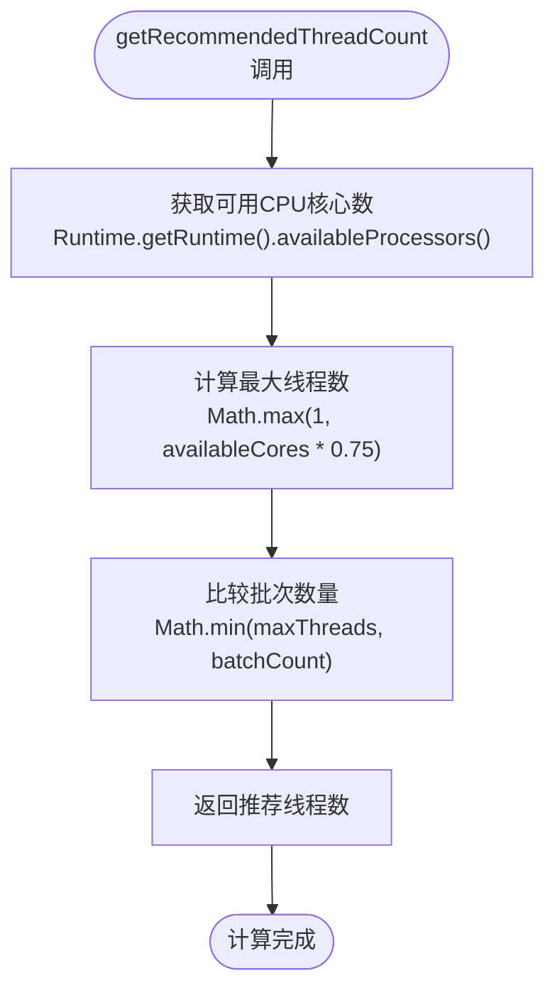
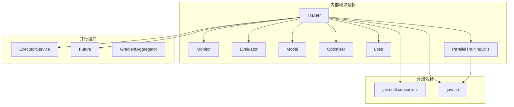

# 训练器构造函数详细文档

<cite>
**本文档引用的文件**
- [Trainer.java](file://tinyai-dl-ml/src/main/java/io/leavesfly/tinyai/ml/Trainer.java)
- [ParallelTrainingUtils.java](file://tinyai-dl-ml/src/main/java/io/leavesfly/tinyai/ml/parallel/ParallelTrainingUtils.java)
- [Monitor.java](file://tinyai-dl-ml/src/main/java/io/leavesfly/tinyai/ml/Monitor.java)
- [Evaluator.java](file://tinyai-dl-ml/src/main/java/io/leavesfly/tinyai/ml/evaluator/Evaluator.java)
- [ParallelTrainingTest.java](file://tinyai-dl-case/src/main/java/io/leavesfly/tinyai/example/parallel/ParallelTrainingTest.java)
</cite>

## 目录
1. [简介](#简介)
2. [项目结构概览](#项目结构概览)
3. [核心组件分析](#核心组件分析)
4. [架构概览](#架构概览)
5. [详细组件分析](#详细组件分析)
6. [依赖关系分析](#依赖关系分析)
7. [性能考虑](#性能考虑)
8. [故障排除指南](#故障排除指南)
9. [结论](#结论)

## 简介

Trainer类是TinyDL框架中模型训练的核心组件，提供了完整的训练流程管理功能。该类支持两种不同的构造方式：基础构造函数和并行训练构造函数。这两种构造函数分别满足不同的训练需求，从简单的单线程训练到复杂的多线程并行训练。

本文档将深入分析Trainer类的两个构造函数，详细解释它们的参数配置、初始化过程以及对后续训练流程的影响。通过具体代码示例和最佳实践指导，帮助开发者正确配置和使用训练器。

## 项目结构概览

Trainer类位于TinyAI项目的机器学习模块中，是整个训练系统的核心入口点：



**图表来源**
- [Trainer.java](file://tinyai-dl-ml/src/main/java/io/leavesfly/tinyai/ml/Trainer.java#L1-L50)
- [ParallelTrainingUtils.java](file://tinyai-dl-ml/src/main/java/io/leavesfly/tinyai/ml/parallel/ParallelTrainingUtils.java#L1-L30)

**章节来源**
- [Trainer.java](file://tinyai-dl-ml/src/main/java/io/leavesfly/tinyai/ml/Trainer.java#L1-L100)

## 核心组件分析

Trainer类的设计体现了清晰的职责分离原则，主要包含以下核心组件：

### 基础组件
- **数据集管理**：负责训练数据的加载和批次处理
- **模型管理**：维护训练中的模型状态和参数
- **损失函数**：计算模型预测与真实值之间的误差
- **优化器**：更新模型参数以最小化损失函数

### 监控和评估组件
- **Monitor**：收集训练过程中的各种指标
- **Evaluator**：评估模型在验证集上的性能

### 并行训练组件
- **ParallelTrainingUtils**：提供并行训练所需的基础工具
- **ExecutorService**：管理并行线程池
- **GradientAggregator**：聚合来自不同线程的梯度

**章节来源**
- [Trainer.java](file://tinyai-dl-ml/src/main/java/io/leavesfly/tinyai/ml/Trainer.java#L30-L80)

## 架构概览

Trainer类采用策略模式设计，支持单线程和并行两种训练策略：



**图表来源**
- [Trainer.java](file://tinyai-dl-ml/src/main/java/io/leavesfly/tinyai/ml/Trainer.java#L30-L80)
- [ParallelTrainingUtils.java](file://tinyai-dl-ml/src/main/java/io/leavesfly/tinyai/ml/parallel/ParallelTrainingUtils.java#L15-L50)

## 详细组件分析

### 基础构造函数分析

基础构造函数是最简单直接的构造方式，专门用于单线程训练场景：

```java
public Trainer(int _maxEpoch, Monitor _monitor, Evaluator _evaluator) {
    this.maxEpoch = _maxEpoch;
    monitor = _monitor;
    evaluator = _evaluator;
    
    // 默认并行训练配置
    this.enableParallelTraining = false;
    this.parallelThreadCount = ParallelTrainingUtils.getRecommendedThreadCount(4);
}
```

#### 参数详解

1. **_maxEpoch**：最大训练轮次，决定了模型在整个训练数据集上迭代的次数
2. **_monitor**：监控器对象，负责收集和可视化训练过程中的指标
3. **_evaluator**：评估器对象，用于在训练过程中评估模型性能

#### 初始化特性

- **默认禁用并行训练**：`enableParallelTraining = false`
- **智能线程数计算**：使用`ParallelTrainingUtils.getRecommendedThreadCount(4)`自动计算推荐线程数
- **线程数限制**：基于CPU核心数的75%计算，确保系统稳定性



**图表来源**
- [Trainer.java](file://tinyai-dl-ml/src/main/java/io/leavesfly/tinyai/ml/Trainer.java#L50-L60)

**章节来源**
- [Trainer.java](file://tinyai-dl-ml/src/main/java/io/leavesfly/tinyai/ml/Trainer.java#L50-L60)

### 并行训练构造函数分析

并行训练构造函数提供了更灵活的配置选项，支持完全自定义的并行训练设置：

```java
public Trainer(int _maxEpoch, Monitor _monitor, Evaluator _evaluator,
               boolean enableParallel, int threadCount) {
    this.maxEpoch = _maxEpoch;
    monitor = _monitor;
    evaluator = _evaluator;
    this.enableParallelTraining = enableParallel;
    this.parallelThreadCount = threadCount > 0 ? 
                               threadCount : 
                               ParallelTrainingUtils.getRecommendedThreadCount(4);
}
```

#### 参数详解

1. **enableParallel**：布尔值参数，控制是否启用并行训练
2. **threadCount**：指定并行线程的数量，0表示使用自动计算的推荐值

#### 配置逻辑

- **显式线程数优先**：如果`threadCount > 0`，则使用指定的线程数
- **自动计算回退**：如果`threadCount <= 0`，则使用推荐线程数
- **并行训练开关**：`enableParallel`参数直接影响训练策略的选择



**图表来源**
- [Trainer.java](file://tinyai-dl-ml/src/main/java/io/leavesfly/tinyai/ml/Trainer.java#L62-L70)

**章节来源**
- [Trainer.java](file://tinyai-dl-ml/src/main/java/io/leavesfly/tinyai/ml/Trainer.java#L62-L70)

### 并行训练工具类分析

ParallelTrainingUtils类提供了并行训练所需的核心工具方法：

#### 线程数计算算法

```java
public static int getRecommendedThreadCount(int batchCount) {
    int availableCores = Runtime.getRuntime().availableProcessors();
    
    // 线程数不应超过可用核心数的75%，也不应超过批次数量
    int maxThreads = Math.max(1, (int) (availableCores * 0.75));
    return Math.min(maxThreads, batchCount);
}
```

#### 特性分析

- **CPU感知**：基于实际可用CPU核心数计算
- **安全限制**：不超过CPU核心数的75%，避免系统过载
- **批次适配**：线程数不会超过数据批次数量
- **最小保证**：至少返回1个线程



**图表来源**
- [ParallelTrainingUtils.java](file://tinyai-dl-ml/src/main/java/io/leavesfly/tinyai/ml/parallel/ParallelTrainingUtils.java#L60-L70)

**章节来源**
- [ParallelTrainingUtils.java](file://tinyai-dl-ml/src/main/java/io/leavesfly/tinyai/ml/parallel/ParallelTrainingUtils.java#L60-L70)

### 实际应用示例

#### 基础构造函数使用示例

```java
// 创建监控器和评估器
Monitor monitor = new Monitor();
AccuracyEval evaluator = new AccuracyEval(new Classify(), model, dataSet);

// 使用基础构造函数创建训练器
Trainer trainer = new Trainer(100, monitor, evaluator);

// 初始化训练器
trainer.init(dataSet, model, loss, optimizer);

// 执行训练
trainer.train(true);
```

#### 并行训练构造函数使用示例

```java
// 创建监控器和评估器
Monitor monitor = new Monitor();
AccuracyEval evaluator = new AccuracyEval(new Classify(), model, dataSet);

// 使用并行训练构造函数创建训练器
Trainer trainer = new Trainer(100, monitor, evaluator, true, 4);

// 初始化训练器
trainer.init(dataSet, model, loss, optimizer);

// 执行并行训练
trainer.train(true);
```

#### 最佳实践配置

**初学者配置建议**：
```java
// 简单易用的基础配置
Trainer trainer = new Trainer(50, new Monitor(), new AccuracyEval(...));
```

**中级用户配置建议**：
```java
// 显式控制并行训练
Trainer trainer = new Trainer(100, monitor, evaluator, true, 2);
```

**高级用户配置建议**：
```java
// 自动计算最优线程数
Trainer trainer = new Trainer(100, monitor, evaluator, true, 0);
```

**章节来源**
- [ParallelTrainingTest.java](file://tinyai-dl-case/src/main/java/io/leavesfly/tinyai/example/parallel/ParallelTrainingTest.java#L70-L90)

## 依赖关系分析

Trainer类的依赖关系体现了良好的软件设计原则：



**图表来源**
- [Trainer.java](file://tinyai-dl-ml/src/main/java/io/leavesfly/tinyai/ml/Trainer.java#L1-L20)

**章节来源**
- [Trainer.java](file://tinyai-dl-ml/src/main/java/io/leavesfly/tinyai/ml/Trainer.java#L1-L20)

## 性能考虑

### 线程数配置策略

并行训练的性能很大程度上取决于线程数的合理配置：

1. **CPU密集型任务**：线程数通常等于CPU核心数
2. **I/O密集型任务**：可以适当增加线程数
3. **内存限制**：每个线程都需要独立的模型副本，注意内存消耗

### 内存管理

并行训练会显著增加内存使用：
- 每个线程需要独立的模型实例
- 梯度聚合需要额外的内存空间
- 建议监控内存使用情况，避免内存溢出

### 性能调优建议

1. **小数据集**：使用单线程训练，避免并行开销
2. **大数据集**：启用并行训练，充分利用多核CPU
3. **GPU训练**：考虑CUDA并行训练而非CPU线程并行
4. **混合策略**：结合批次大小和线程数优化

## 故障排除指南

### 常见问题及解决方案

#### 1. 模型不支持并行训练

**症状**：警告信息"模型不支持并行训练"
**原因**：模型无法序列化
**解决方案**：
```java
// 检查模型是否支持序列化
if (!ParallelTrainingUtils.isModelParallelizable(model)) {
    // 使用单线程训练
    Trainer trainer = new Trainer(maxEpoch, monitor, evaluator);
}
```

#### 2. 线程数过多导致性能下降

**症状**：并行训练比单线程慢
**原因**：线程数超过CPU核心数
**解决方案**：
```java
// 使用自动计算的线程数
Trainer trainer = new Trainer(maxEpoch, monitor, evaluator, true, 0);
```

#### 3. 内存不足

**症状**：OutOfMemoryError异常
**原因**：并行线程数过多或模型过大
**解决方案**：
```java
// 减少并行线程数
Trainer trainer = new Trainer(maxEpoch, monitor, evaluator, true, 2);
```

**章节来源**
- [Trainer.java](file://tinyai-dl-ml/src/main/java/io/leavesfly/tinyai/ml/Trainer.java#L80-L120)

## 结论

Trainer类的两个构造函数为不同需求的用户提供了一致而灵活的训练体验：

1. **基础构造函数**：适合初学者和简单场景，提供开箱即用的单线程训练
2. **并行训练构造函数**：适合有经验的用户和高性能需求场景，提供完全可控的并行训练能力

通过合理的参数配置和最佳实践遵循，开发者可以充分发挥TinyDL框架的训练潜力，实现高效、稳定的模型训练过程。无论是快速原型开发还是大规模生产部署，Trainer类都能提供相应的解决方案。