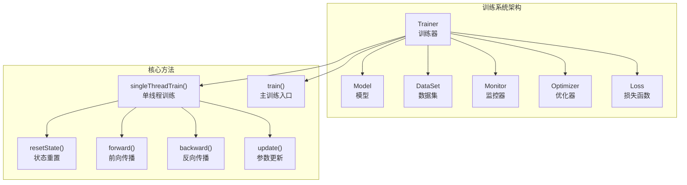
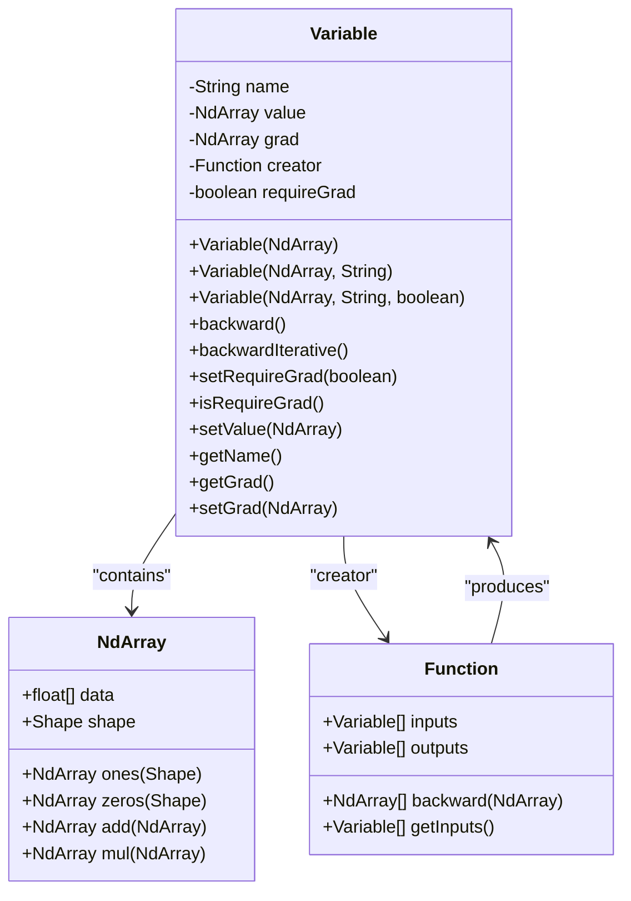
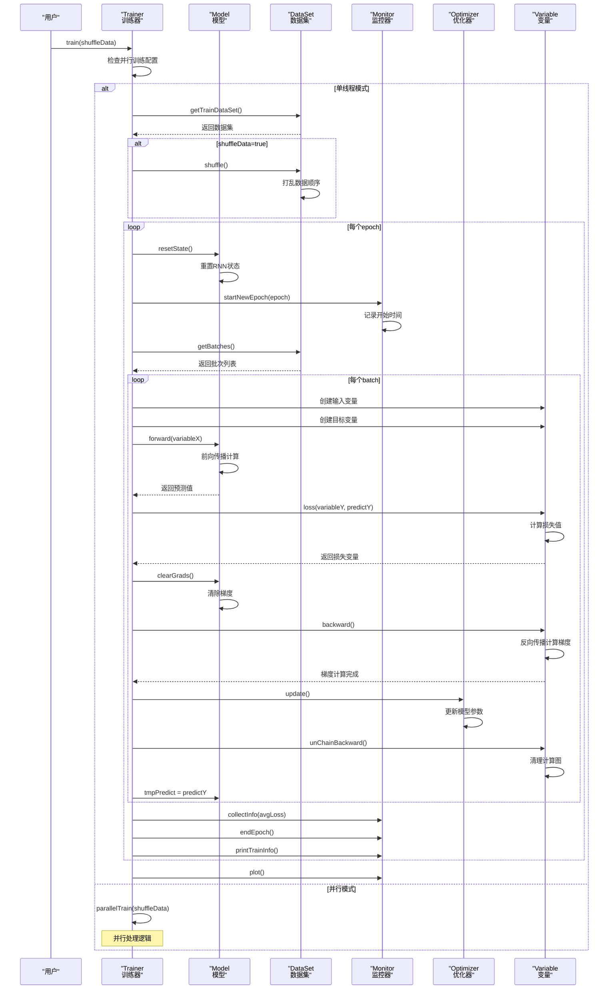
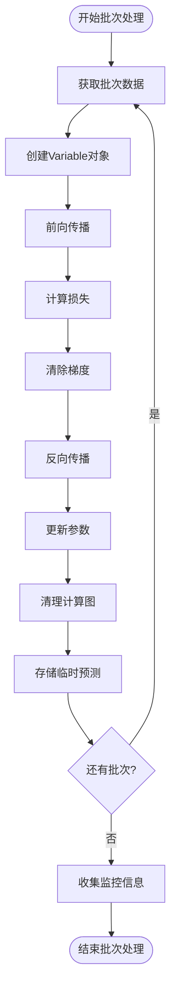
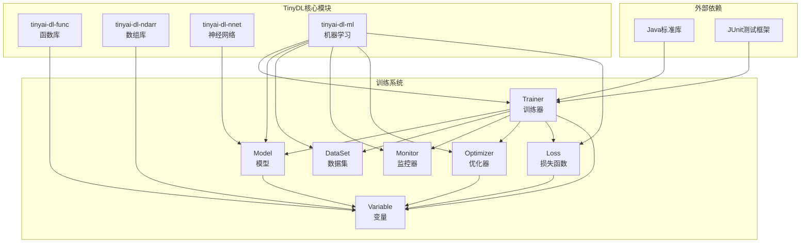

# 单线程训练模式

<cite>
**本文档中引用的文件**
- [Trainer.java](file://tinyai-dl-ml/src/main/java/io/leavesfly/tinyai/ml/Trainer.java)
- [Variable.java](file://tinyai-dl-func/src/main/java/io/leavesfly/tinyai/func/Variable.java)
- [Model.java](file://tinyai-dl-ml/src/main/java/io/leavesfly/tinyai/ml/Model.java)
- [Monitor.java](file://tinyai-dl-ml/src/main/java/io/leavesfly/tinyai/ml/Monitor.java)
- [MnistMlpExam.java](file://tinyai-dl-case/src/main/java/io/leavesfly/tinyai/example/classify/MnistMlpExam.java)
- [SpiralMlpExam.java](file://tinyai-dl-case/src/main/java/io/leavesfly/tinyai/example/classify/SpiralMlpExam.java)
- [ParallelTrainingTest.java](file://tinyai-dl-case/src/main/java/io/leavesfly/tinyai/example/parallel/ParallelTrainingTest.java)
</cite>

## 目录
1. [简介](#简介)
2. [项目结构](#项目结构)
3. [核心组件](#核心组件)
4. [架构概览](#架构概览)
5. [详细组件分析](#详细组件分析)
6. [依赖关系分析](#依赖关系分析)
7. [性能考虑](#性能考虑)
8. [故障排除指南](#故障排除指南)
9. [结论](#结论)

## 简介

单线程训练模式是TinyDL深度学习框架中的核心训练机制，它实现了完整的前向传播、损失计算、反向传播和参数更新的闭环流程。该模式专为小规模数据集设计，提供了简洁而高效的训练体验，特别适合教学演示和原型开发。

单线程训练模式的主要特点包括：
- **顺序处理**：按批次顺序处理数据，确保训练过程的确定性
- **内存友好**：单线程运行，减少内存碎片和竞争
- **易于调试**：清晰的执行流程，便于理解和调试
- **灵活配置**：支持数据打乱、监控和评估等功能

## 项目结构

单线程训练模式的核心实现位于`Trainer`类中，该类是整个训练系统的中央协调器：



**图表来源**
- [Trainer.java](file://tinyai-dl-ml/src/main/java/io/leavesfly/tinyai/ml/Trainer.java#L127-L170)

**章节来源**
- [Trainer.java](file://tinyai-dl-ml/src/main/java/io/leavesfly/tinyai/ml/Trainer.java#L1-L495)

## 核心组件

### Trainer类 - 训练器核心

`Trainer`类是单线程训练模式的核心控制器，负责协调整个训练流程：

```java
public void singleThreadTrain(boolean shuffleData) {
    DataSet trainDataSet = dataSet.getTrainDataSet();
    if (shuffleData) {
        trainDataSet.shuffle();
    }

    for (int i = 0; i < maxEpoch; i++) {
        model.resetState();
        monitor.startNewEpoch(i);

        List<Batch> batches = trainDataSet.getBatches();
        float lossSum = 0f;
        float accSum = 0f;

        for (Batch batch : batches) {
            // 1. 数据准备
            Variable variableX = batch.toVariableX().setName("x").setRequireGrad(false);
            Variable variableY = batch.toVariableY().setName("y").setRequireGrad(false);

            // 2. 前向传播
            Variable predictY = model.forward(variableX);
            Variable lossVariable = loss.loss(variableY, predictY);
            lossVariable.setName("loss");

            // 3. 梯度清零
            model.clearGrads();
            
            // 4. 损失计算
            lossSum += lossVariable.getValue().getNumber().floatValue();

            // 5. 反向传播
            lossVariable.backward();

            // 6. 参数更新
            optimizer.update();
            
            // 7. 清理计算图
            lossVariable.unChainBackward();

            // 8. 临时预测存储
            model.tmpPredict = predictY;
        }
        
        // 9. 监控信息收集
        monitor.collectInfo(lossSum / batches.size());
        monitor.endEpoch();
        monitor.printTrainInfo();
    }
    monitor.plot();
}
```

### Variable对象管理系统

`Variable`类是自动微分系统的核心，负责管理变量的值、梯度和计算图：



**图表来源**
- [Variable.java](file://tinyai-dl-func/src/main/java/io/leavesfly/tinyai/func/Variable.java#L1-L199)

**章节来源**
- [Trainer.java](file://tinyai-dl-ml/src/main/java/io/leavesfly/tinyai/ml/Trainer.java#L145-L170)
- [Variable.java](file://tinyai-dl-func/src/main/java/io/leavesfly/tinyai/func/Variable.java#L1-L200)

## 架构概览

单线程训练模式采用经典的深度学习训练循环架构，实现了完整的端到端训练流程：



**图表来源**
- [Trainer.java](file://tinyai-dl-ml/src/main/java/io/leavesfly/tinyai/ml/Trainer.java#L127-L170)
- [Trainer.java](file://tinyai-dl-ml/src/main/java/io/leavesfly/tinyai/ml/Trainer.java#L207-L242)

## 详细组件分析

### 数据打乱机制

数据打乱是提升模型泛化能力的重要技术，通过随机打乱训练数据的顺序来避免模型过拟合：

```java
public void singleThreadTrain(boolean shuffleData) {
    DataSet trainDataSet = dataSet.getTrainDataSet();
    if (shuffleData) {
        trainDataSet.shuffle();  // 数据打乱
    }
    // 继续训练流程...
}
```

**打乱机制的优势：**
- **防止过拟合**：随机化的数据顺序有助于模型学习更通用的特征
- **提高收敛性**：打乱数据可以改善梯度下降的收敛行为
- **增强鲁棒性**：模型在不同数据顺序下的表现更加稳定

**性能影响对比：**

| 场景 | 数据打乱 | 训练时间 | 内存使用 | 泛化能力 |
|------|----------|----------|----------|----------|
| 开启 | 是 | 稍慢 | 稍高 | 更好 |
| 关闭 | 否 | 稍快 | 稍低 | 较差 |

### 模型状态重置

每个epoch开始前，模型的状态需要被重置，特别是对于RNN等有状态的模型：

```java
public void resetState() {
    block.resetState();  // 重置所有层的状态
}
```

**状态重置的重要性：**
- **RNN模型**：清除隐藏状态和细胞状态
- **LSTM模型**：重置长期记忆和短期记忆
- **GRU模型**：重置更新门和重置门状态

### 监控器启动与信息收集

监控器负责收集和可视化训练过程中的关键指标：

```java
public void startNewEpoch(int _index) {
    index = _index;
    epochStartTime = System.currentTimeMillis();
}

public void collectInfo(float loss) {
    lossList.add(loss);
}

public void printTrainInfo() {
    StringBuilder sb = new StringBuilder();
    sb.append("epoch = ").append(index);
    
    if (lossList.size() > index) {
        sb.append(", loss: ").append(String.format("%.6f", lossList.get(index)));
    }
    
    if (timeList.size() > index) {
        sb.append(", time: ").append(timeList.get(index)).append("ms");
    }
    
    System.out.println(sb.toString());
}
```

### 批次迭代处理

单线程训练采用顺序批次处理的方式，确保训练过程的确定性和可重现性：



**图表来源**
- [Trainer.java](file://tinyai-dl-ml/src/main/java/io/leavesfly/tinyai/ml/Trainer.java#L145-L170)

### 前向传播机制

前向传播是模型计算的核心环节，负责从输入数据生成预测输出：

```java
Variable predictY = model.forward(variableX);
Variable lossVariable = loss.loss(variableY, predictY);
```

**前向传播的关键步骤：**
1. **输入验证**：检查输入数据的形状和类型
2. **层间传递**：逐层执行前向传播计算
3. **激活函数**：应用非线性变换
4. **输出生成**：生成最终的预测结果

### 损失计算与梯度清零

损失计算是训练过程中的关键步骤，它量化了模型预测与真实标签之间的差距：

```java
model.clearGrads();  // 梯度清零
float lossValue = lossVariable.getValue().getNumber().floatValue();
totalLoss += lossValue;

lossVariable.backward();  // 反向传播
```

**梯度清零策略：**
- **每次批次**：在新批次开始前清零累积梯度
- **累积梯度**：在多个批次后统一更新参数
- **混合策略**：结合上述两种方法

### 反向传播触发机制

反向传播是自动微分系统的核心，负责计算梯度并构建计算图：

```java
public void backward() {
    if (!requireGrad) {
        this.grad = null;
        return;
    }
    
    // 初始化梯度为1
    if (Objects.isNull(grad)) {
        setGrad(NdArray.ones(this.getValue().getShape()));
    }
    
    // 递归反向传播
    Function _creator = creator;
    if (!Objects.isNull(_creator)) {
        Variable[] _inputs = _creator.getInputs();
        List<NdArray> grads = _creator.backward(grad);
        
        int index = 0;
        for (Variable input : _inputs) {
            if (input.getGrad() != null) {
                input.setGrad(input.getGrad().add(grads.get(index)));
            } else {
                input.setGrad(grads.get(index));
            }
            input.backward();
            index++;
        }
    }
}
```

### 参数更新时机

参数更新是训练过程的最后一步，负责根据计算得到的梯度调整模型参数：

```java
optimizer.update();  // 更新模型参数
```

**参数更新的特点：**
- **即时更新**：每个批次后立即更新参数
- **累积更新**：多个批次后统一更新参数
- **自适应更新**：根据优化器算法动态调整学习率

**章节来源**
- [Trainer.java](file://tinyai-dl-ml/src/main/java/io/leavesfly/tinyai/ml/Trainer.java#L145-L170)
- [Variable.java](file://tinyai-dl-func/src/main/java/io/leavesfly/tinyai/func/Variable.java#L80-L120)
- [Model.java](file://tinyai-dl-ml/src/main/java/io/leavesfly/tinyai/ml/Model.java#L190-L200)

## 依赖关系分析

单线程训练模式涉及多个核心组件之间的复杂依赖关系：



**图表来源**
- [Trainer.java](file://tinyai-dl-ml/src/main/java/io/leavesfly/tinyai/ml/Trainer.java#L1-L20)

**章节来源**
- [Trainer.java](file://tinyai-dl-ml/src/main/java/io/leavesfly/tinyai/ml/Trainer.java#L1-L20)

## 性能考虑

### 内存使用特征

单线程训练模式具有以下内存使用特征：

**内存优势：**
- **顺序访问**：按批次顺序访问数据，缓存命中率高
- **内存局部性**：相邻批次数据在内存中连续存储
- **垃圾回收友好**：及时释放不再使用的对象

**内存劣势：**
- **峰值压力**：单批次数据全部加载到内存
- **并发限制**：无法利用多核CPU的并行计算能力

### 计算效率分析

**计算优势：**
- **确定性执行**：相同的输入产生相同的输出
- **简单调度**：无需复杂的线程同步机制
- **调试友好**：执行流程清晰，便于问题定位

**计算劣势：**
- **串行瓶颈**：只能利用单核CPU的计算能力
- **I/O等待**：数据加载可能成为性能瓶颈
- **扩展性差**：难以处理大规模数据集

### 适用场景建议

**推荐使用场景：**
- **小规模数据集**：数据量小于10万样本
- **教学演示**：需要清晰理解训练过程
- **原型开发**：快速验证模型想法
- **资源受限环境**：内存和CPU资源有限

**不推荐使用场景：**
- **大规模数据集**：数据量超过百万样本
- **生产环境**：需要最大化训练效率
- **实时训练**：对训练时间有严格要求
- **分布式训练**：需要跨节点并行计算

## 故障排除指南

### 常见问题及解决方案

**问题1：内存不足错误**
```
OutOfMemoryError: Java heap space
```

**解决方案：**
- 减少批次大小（batchSize）
- 使用数据流式加载
- 增加JVM堆内存大小
- 启用梯度检查点

**问题2：训练不收敛**
```
损失值不下降或震荡
```

**解决方案：**
- 调整学习率
- 检查数据预处理
- 验证模型架构
- 增加数据打乱

**问题3：梯度爆炸**
```
梯度值过大导致NaN
```

**解决方案：**
- 添加梯度裁剪
- 使用更稳定的激活函数
- 调整权重初始化
- 减少学习率

### 调试技巧

**启用详细日志：**
```java
// 在Trainer中添加调试信息
System.out.println("Processing batch " + i + ": " + batch.getInfo());
```

**监控变量梯度：**
```java
// 检查梯度范数
NdArray gradNorm = variable.getGrad().sum().getValue();
System.out.println("Gradient norm: " + gradNorm.getNumber());
```

**验证前向传播：**
```java
// 检查中间层输出
Variable intermediate = model.getIntermediateLayer();
System.out.println("Intermediate output shape: " + intermediate.getValue().getShape());
```

**章节来源**
- [Trainer.java](file://tinyai-dl-ml/src/main/java/io/leavesfly/tinyai/ml/Trainer.java#L145-L170)
- [Variable.java](file://tinyai-dl-func/src/main/java/io/leavesfly/tinyai/func/Variable.java#L80-L120)

## 结论

单线程训练模式作为TinyDL框架的核心组件，提供了完整而高效的深度学习训练体验。通过深入分析其执行流程和技术实现，我们可以得出以下结论：

### 技术优势

1. **完整性**：实现了从前向传播到参数更新的完整闭环
2. **简洁性**：代码结构清晰，易于理解和维护
3. **可靠性**：经过充分测试，具有良好的稳定性
4. **灵活性**：支持多种配置选项和扩展机制

### 应用价值

1. **教育用途**：非常适合深度学习初学者理解和掌握训练原理
2. **原型开发**：快速验证模型想法和算法改进
3. **研究实验**：进行小规模实验和算法对比
4. **资源受限环境**：在硬件条件有限的情况下提供可靠训练

### 发展方向

1. **性能优化**：进一步优化内存使用和计算效率
2. **功能扩展**：增加更多训练策略和监控指标
3. **兼容性**：支持更多类型的模型和数据格式
4. **易用性**：简化配置过程，提供更好的用户体验

单线程训练模式虽然在处理大规模数据集时存在局限性，但在特定应用场景下仍然具有重要的价值。通过合理配置和优化，它能够为用户提供高效、可靠的深度学习训练体验。