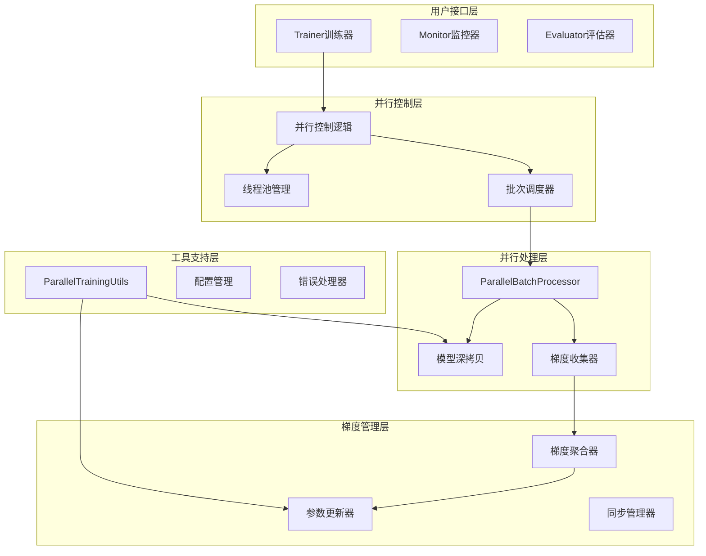
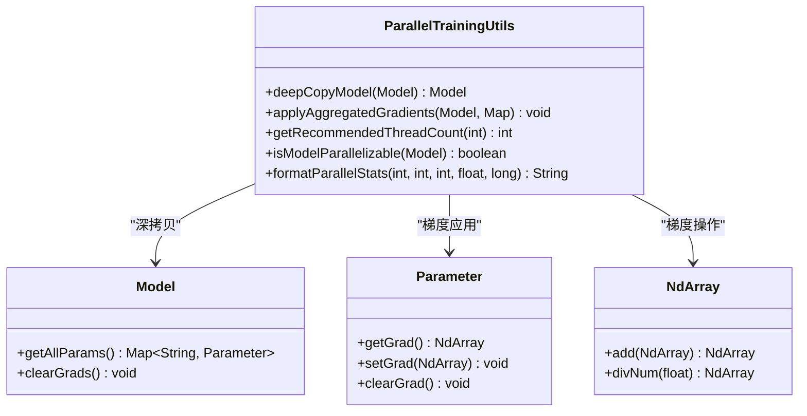
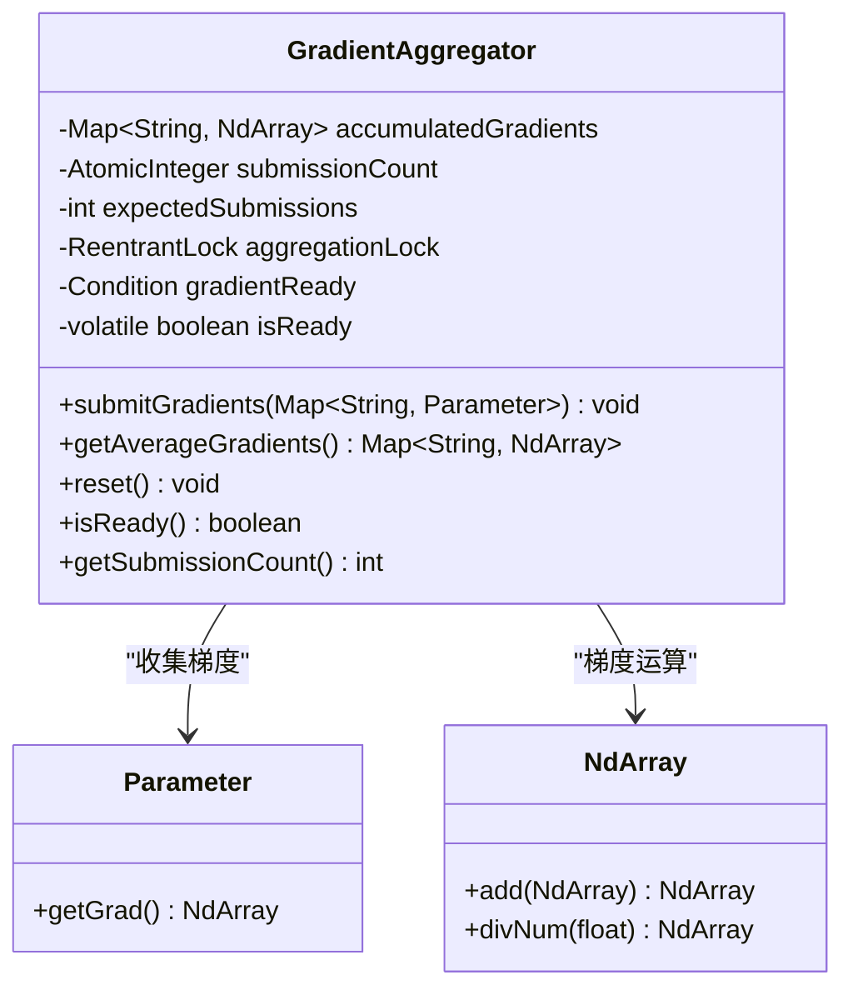
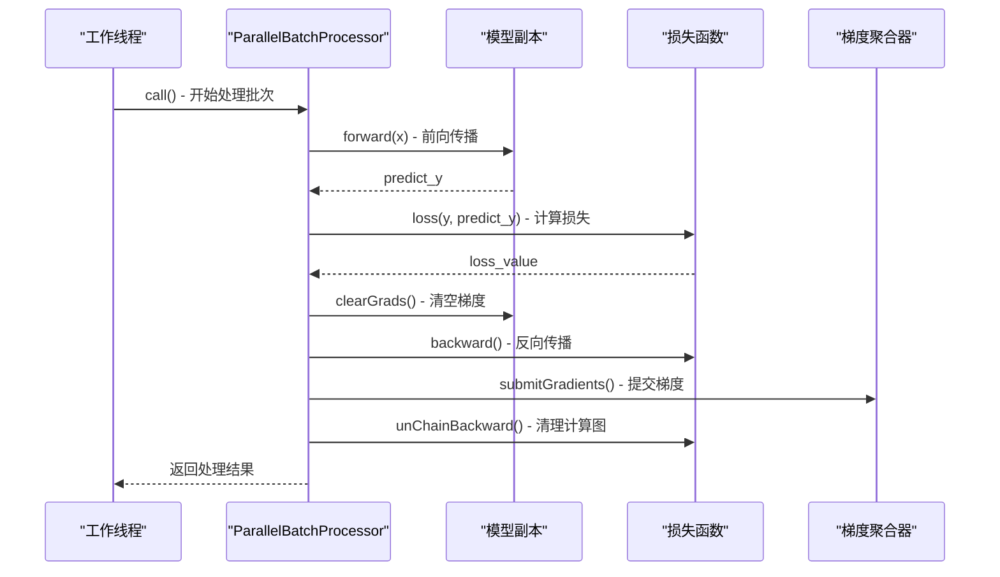
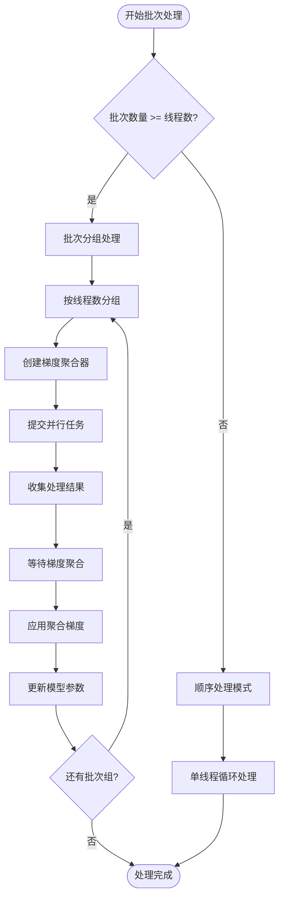
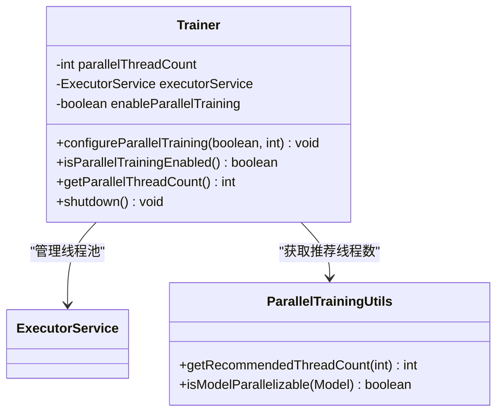
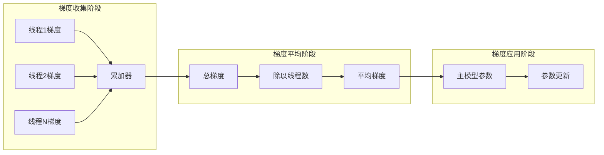

# 并行训练模式

<cite>
**本文档引用的文件**
- [ParallelTrainingUtils.java](file://tinyai-dl-ml/src/main/java/io/leavesfly/tinyai/ml/parallel/ParallelTrainingUtils.java)
- [GradientAggregator.java](file://tinyai-dl-ml/src/main/java/io/leavesfly/tinyai/ml/parallel/GradientAggregator.java)
- [ParallelBatchProcessor.java](file://tinyai-dl-ml/src/main/java/io/leavesfly/tinyai/ml/parallel/ParallelBatchProcessor.java)
- [Trainer.java](file://tinyai-dl-ml/src/main/java/io/leavesfly/tinyai/ml/Trainer.java)
- [ParallelTrainingTest.java](file://tinyai-dl-case/src/main/java/io/leavesfly/tinyai/example/parallel/ParallelTrainingTest.java)
</cite>

## 目录
1. [简介](#简介)
2. [架构概览](#架构概览)
3. [核心组件分析](#核心组件分析)
4. [并行处理策略](#并行处理策略)
5. [线程池管理](#线程池管理)
6. [梯度聚合算法](#梯度聚合算法)
7. [性能优化与最佳实践](#性能优化与最佳实践)
8. [故障排除指南](#故障排除指南)
9. [结论](#结论)

## 简介

TinyDL框架的并行训练模式是一种高效的多线程训练实现，通过将批次数据分配给多个线程并行处理，显著提升训练速度。该系统采用模型深拷贝技术确保线程安全，通过梯度聚合器统一管理梯度更新，实现了完整的并行训练流水线。

并行训练模式特别适用于以下场景：
- 大规模数据集训练
- 多核CPU环境
- 需要快速迭代的开发场景
- 对训练时间敏感的应用

## 架构概览

并行训练系统采用分层架构设计，包含以下核心层次：



**图表来源**
- [Trainer.java](file://tinyai-dl-ml/src/main/java/io/leavesfly/tinyai/ml/Trainer.java#L232-L294)
- [ParallelBatchProcessor.java](file://tinyai-dl-ml/src/main/java/io/leavesfly/tinyai/ml/parallel/ParallelBatchProcessor.java#L1-L50)
- [GradientAggregator.java](file://tinyai-dl-ml/src/main/java/io/leavesfly/tinyai/ml/parallel/GradientAggregator.java#L1-L50)

## 核心组件分析

### ParallelTrainingUtils 工具类

ParallelTrainingUtils是并行训练的核心工具类，提供模型深拷贝、梯度应用和线程数计算等关键功能。



**图表来源**
- [ParallelTrainingUtils.java](file://tinyai-dl-ml/src/main/java/io/leavesfly/tinyai/ml/parallel/ParallelTrainingUtils.java#L15-L122)

#### 模型深拷贝机制

模型深拷贝是并行训练的基础，确保每个线程拥有独立的模型实例：

```java
public static Model deepCopyModel(Model originalModel) {
    try {
        ByteArrayOutputStream baos = new ByteArrayOutputStream();
        ObjectOutputStream oos = new ObjectOutputStream(baos);
        oos.writeObject(originalModel);
        oos.close();

        ByteArrayInputStream bais = new ByteArrayInputStream(baos.toByteArray());
        ObjectInputStream ois = new ObjectInputStream(bais);
        Model copiedModel = (Model) ois.readObject();
        ois.close();

        return copiedModel;
    } catch (Exception e) {
        throw new RuntimeException("模型深拷贝失败: " + e.getMessage(), e);
    }
}
```

#### 线程数推荐算法

系统根据CPU核心数和数据批次数量智能计算推荐线程数：

```java
public static int getRecommendedThreadCount(int batchCount) {
    int availableCores = Runtime.getRuntime().availableProcessors();
    
    // 线程数不应超过可用核心数的75%，也不应超过批次数量
    int maxThreads = Math.max(1, (int) (availableCores * 0.75));
    return Math.min(maxThreads, batchCount);
}
```

**章节来源**
- [ParallelTrainingUtils.java](file://tinyai-dl-ml/src/main/java/io/leavesfly/tinyai/ml/parallel/ParallelTrainingUtils.java#L25-L122)

### GradientAggregator 梯度聚合器

GradientAggregator负责收集来自多个线程的梯度并进行平均计算，确保梯度更新的一致性和准确性。



**图表来源**
- [GradientAggregator.java](file://tinyai-dl-ml/src/main/java/io/leavesfly/tinyai/ml/parallel/GradientAggregator.java#L15-L122)

#### 梯度平均计算逻辑

梯度聚合器采用线程安全的设计，确保多线程环境下的正确性：

```java
public void submitGradients(Map<String, Parameter> gradients) {
    aggregationLock.lock();
    try {
        // 累加梯度
        for (Map.Entry<String, Parameter> entry : gradients.entrySet()) {
            String paramName = entry.getKey();
            NdArray gradient = entry.getValue().getGrad();

            if (gradient != null) {
                accumulatedGradients.merge(paramName, gradient, NdArray::add);
            }
        }

        // 检查是否收集完所有梯度
        if (submissionCount.incrementAndGet() >= expectedSubmissions) {
            // 计算平均梯度
            for (Map.Entry<String, NdArray> entry : accumulatedGradients.entrySet()) {
                NdArray averageGrad = entry.getValue().divNum((float) expectedSubmissions);
                entry.setValue(averageGrad);
            }
            isReady = true;
            gradientReady.signalAll(); // 通知等待的线程
        }
    } finally {
        aggregationLock.unlock();
    }
}
```

**章节来源**
- [GradientAggregator.java](file://tinyai-dl-ml/src/main/java/io/leavesfly/tinyai/ml/parallel/GradientAggregator.java#L40-L70)

### ParallelBatchProcessor 并行批次处理器

ParallelBatchProcessor是并行训练的核心执行单元，负责单个批次的完整训练流程。



**图表来源**
- [ParallelBatchProcessor.java](file://tinyai-dl-ml/src/main/java/io/leavesfly/tinyai/ml/parallel/ParallelBatchProcessor.java#L50-L100)

#### 批次处理结果结构

每个处理器返回详细的处理结果，包括成功状态、损失值和异常信息：

```java
public static class BatchProcessResult {
    private final int threadId;
    private final float lossValue;
    private final int batchSize;
    private final boolean success;
    private final Exception exception;
    
    // 构造函数和getter方法...
}
```

**章节来源**
- [ParallelBatchProcessor.java](file://tinyai-dl-ml/src/main/java/io/leavesfly/tinyai/ml/parallel/ParallelBatchProcessor.java#L85-L123)

## 并行处理策略

### 批次分组机制

并行训练采用批次分组策略，将连续的批次分配给不同的线程组：



**图表来源**
- [Trainer.java](file://tinyai-dl-ml/src/main/java/io/leavesfly/tinyai/ml/Trainer.java#L232-L294)

### 多线程任务提交流程

系统通过ExecutorService管理线程池，实现高效的任务调度：

```java
// 提交并行任务
List<Future<ParallelBatchProcessor.BatchProcessResult>> futures = new ArrayList<>();

for (int j = 0; j < currentBatchGroup.size(); j++) {
    Batch batch = currentBatchGroup.get(j);
    Model modelCopy = ParallelTrainingUtils.deepCopyModel(model);
    
    ParallelBatchProcessor processor = new ParallelBatchProcessor(
        batch, modelCopy, loss, gradientAggregator, i + j
    );
    
    futures.add(executorService.submit(processor));
}
```

### 异常处理与容错机制

并行训练实现了完善的异常处理机制，确保单个批次的失败不会影响整个训练过程：

```java
try {
    // 正常处理逻辑
    ParallelBatchProcessor.BatchProcessResult result = future.get();
    if (result.isSuccess()) {
        groupLoss += result.getLossValue();
        groupSuccessful++;
    } else {
        System.err.println("批次处理失败: " + result.getException().getMessage());
    }
} catch (Exception e) {
    System.err.println("获取批次处理结果失败: " + e.getMessage());
}
```

**章节来源**
- [Trainer.java](file://tinyai-dl-ml/src/main/java/io/leavesfly/tinyai/ml/Trainer.java#L240-L280)

## 线程池管理

### ExecutorService配置

Trainer类维护一个固定的线程池，支持动态调整和优雅关闭：



**图表来源**
- [Trainer.java](file://tinyai-dl-ml/src/main/java/io/leavesfly/tinyai/ml/Trainer.java#L40-L60)
- [ParallelTrainingUtils.java](file://tinyai-dl-ml/src/main/java/io/leavesfly/tinyai/ml/parallel/ParallelTrainingUtils.java#L60-L80)

### 动态线程数调整

系统支持运行时动态调整并行训练参数：

```java
public void configureParallelTraining(boolean enable, int threadCount) {
    // 先关闭现有的线程池
    if (executorService != null && !executorService.isShutdown()) {
        shutdown();
    }
    
    this.enableParallelTraining = enable;
    if (threadCount > 0) {
        this.parallelThreadCount = threadCount;
    }
    
    // 如果启用并且模型已初始化，重新创建线程池
    if (enable && model != null) {
        if (ParallelTrainingUtils.isModelParallelizable(model)) {
            executorService = Executors.newFixedThreadPool(parallelThreadCount);
            System.out.println("并行训练已重新配置，线程数: " + parallelThreadCount);
        } else {
            System.err.println("模型不支持并行训练");
            this.enableParallelTraining = false;
        }
    }
}
```

### 资源清理与优雅关闭

系统实现了完整的资源管理机制：

```java
public void shutdown() {
    if (executorService != null && !executorService.isShutdown()) {
        executorService.shutdown();
        try {
            // 等待正在执行的任务完成
            if (!executorService.awaitTermination(30, TimeUnit.SECONDS)) {
                // 强制停止
                System.err.println("警告: 强制关闭线程池");
                executorService.shutdownNow();
            }
        } catch (InterruptedException e) {
            System.err.println("线程池关闭被中断");
            executorService.shutdownNow();
            Thread.currentThread().interrupt();
        }
        System.out.println("并行训练资源已释放");
    }
}
```

**章节来源**
- [Trainer.java](file://tinyai-dl-ml/src/main/java/io/leavesfly/tinyai/ml/Trainer.java#L340-L380)

## 梯度聚合算法

### 梯度平均计算

梯度聚合器采用简单的平均算法，确保梯度更新的准确性：



**图表来源**
- [GradientAggregator.java](file://tinyai-dl-ml/src/main/java/io/leavesfly/tinyai/ml/parallel/GradientAggregator.java#L40-L70)

### 线程安全保证

系统通过多种机制确保梯度聚合的线程安全：

1. **ReentrantLock锁保护**：使用可重入锁保护关键临界区
2. **AtomicInteger计数**：原子操作确保计数准确性
3. **ConcurrentHashMap**：线程安全的梯度存储
4. **Condition信号量**：精确的线程同步

```java
public void submitGradients(Map<String, Parameter> gradients) {
    aggregationLock.lock();
    try {
        // 线程安全的梯度累加
        for (Map.Entry<String, Parameter> entry : gradients.entrySet()) {
            String paramName = entry.getKey();
            NdArray gradient = entry.getValue().getGrad();
            
            if (gradient != null) {
                accumulatedGradients.merge(paramName, gradient, NdArray::add);
            }
        }
        
        // 原子递增计数器
        if (submissionCount.incrementAndGet() >= expectedSubmissions) {
            // 计算平均梯度并通知等待线程
            for (Map.Entry<String, NdArray> entry : accumulatedGradients.entrySet()) {
                NdArray averageGrad = entry.getValue().divNum((float) expectedSubmissions);
                entry.setValue(averageGrad);
            }
            isReady = true;
            gradientReady.signalAll();
        }
    } finally {
        aggregationLock.unlock();
    }
}
```

### 参数同步更新

梯度聚合完成后，系统将平均梯度应用到主模型：

```java
// 将聚合梯度应用到主模型
ParallelTrainingUtils.applyAggregatedGradients(model, averageGradients);

// 更新参数
optimizer.update();

// 清理梯度
model.clearGrads();
```

**章节来源**
- [GradientAggregator.java](file://tinyai-dl-ml/src/main/java/io/leavesfly/tinyai/ml/parallel/GradientAggregator.java#L40-L90)

## 性能优化与最佳实践

### 线程数配置最佳实践

根据系统特性和硬件配置，推荐以下线程数配置策略：

1. **CPU密集型任务**：线程数 = CPU核心数 × 0.75
2. **I/O密集型任务**：线程数 = CPU核心数 × 1.5
3. **内存受限环境**：减少线程数以降低内存占用
4. **GPU训练**：考虑GPU内存限制，适当减少线程数

### 内存使用优化

并行训练的内存使用主要来自模型深拷贝：

```java
// 每个线程需要独立的模型副本
Model modelCopy = ParallelTrainingUtils.deepCopyModel(model);
```

优化策略：
- 使用模型参数共享而非完全深拷贝
- 实现模型参数级别的并行更新
- 添加内存压力检测和自动降级机制

### 性能监控指标

系统提供详细的性能统计信息：

```java
public static String formatParallelStats(int threadCount, int successfulBatches,
                                         int totalBatches, float averageLoss, long processingTimeMs) {
    return String.format(
            "并行训练统计 [线程数: %d, 成功批次: %d/%d, 平均损失: %.6f, 处理时间: %dms]",
            threadCount, successfulBatches, totalBatches, averageLoss, processingTimeMs
    );
}
```

### 大数据集优化建议

对于大规模数据集，建议采用以下优化策略：

1. **批次大小调整**：根据内存容量调整批次大小
2. **预取策略**：提前加载下一个批次数据
3. **异步I/O**：使用异步方式读取数据
4. **内存映射**：对超大数据集使用内存映射文件

**章节来源**
- [ParallelTrainingUtils.java](file://tinyai-dl-ml/src/main/java/io/leavesfly/tinyai/ml/parallel/ParallelTrainingUtils.java#L60-L122)

## 故障排除指南

### 常见问题诊断

#### 1. 模型不支持并行训练

**症状**：训练器提示"模型不支持并行训练"

**解决方案**：
```java
// 检查模型是否支持序列化
if (!ParallelTrainingUtils.isModelParallelizable(model)) {
    System.err.println("模型不支持并行训练");
    // 回退到单线程模式
    trainer.configureParallelTraining(false, 0);
}
```

#### 2. 线程池资源不足

**症状**：线程提交失败或超时

**解决方案**：
- 增加JVM堆内存
- 调整线程池大小
- 检查系统资源限制

#### 3. 梯度聚合超时

**症状**：`InterruptedException`异常

**解决方案**：
```java
try {
    Map<String, NdArray> averageGradients = gradientAggregator.getAverageGradients();
    // 处理梯度...
} catch (InterruptedException e) {
    System.err.println("梯度聚合被中断: " + e.getMessage());
    Thread.currentThread().interrupt();
    // 优雅退出或回退到单线程模式
}
```

### 调试技巧

1. **启用详细日志**：设置适当的日志级别
2. **监控线程状态**：使用JMX监控线程池状态
3. **性能分析**：使用Profiler分析热点代码
4. **内存分析**：监控内存使用情况，避免内存泄漏

### 性能基准测试

系统提供了完整的性能测试框架：

```java
// 测试并行训练性能
long startTime = System.currentTimeMillis();
trainer.parallelTrain(true);
long endTime = System.currentTimeMillis();
System.out.println("并行训练耗时: " + (endTime - startTime) + " ms");
```

**章节来源**
- [Trainer.java](file://tinyai-dl-ml/src/main/java/io/leavesfly/tinyai/ml/Trainer.java#L340-L380)
- [ParallelTrainingTest.java](file://tinyai-dl-case/src/main/java/io/leavesfly/tinyai/example/parallel/ParallelTrainingTest.java#L75-L95)

## 结论

TinyDL的并行训练模式通过精心设计的架构和算法，实现了高效的多线程训练能力。系统的主要优势包括：

1. **完整的并行流水线**：从批次分组到梯度聚合的完整解决方案
2. **线程安全保证**：通过锁机制和线程安全集合确保数据一致性
3. **灵活的配置选项**：支持动态调整线程数和训练模式
4. **完善的错误处理**：多层次的异常捕获和恢复机制
5. **性能监控支持**：详细的统计信息和性能指标

虽然目前存在模型序列化限制等挑战，但系统已经具备了良好的扩展性，为未来的GPU支持、分布式训练等功能奠定了坚实基础。通过合理的配置和优化，可以在各种硬件环境下获得显著的训练性能提升。