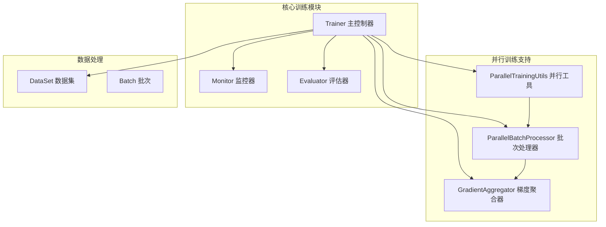
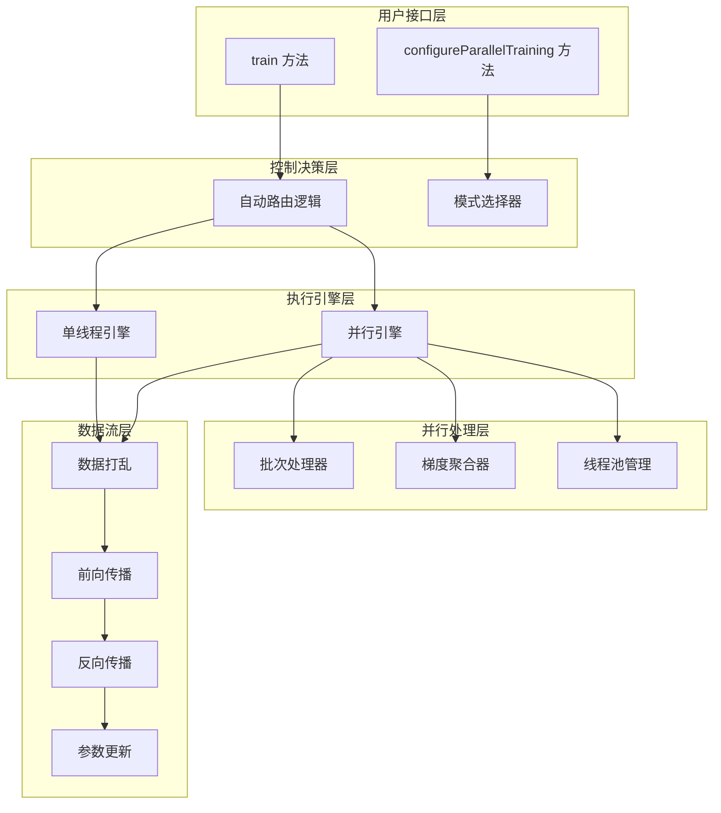
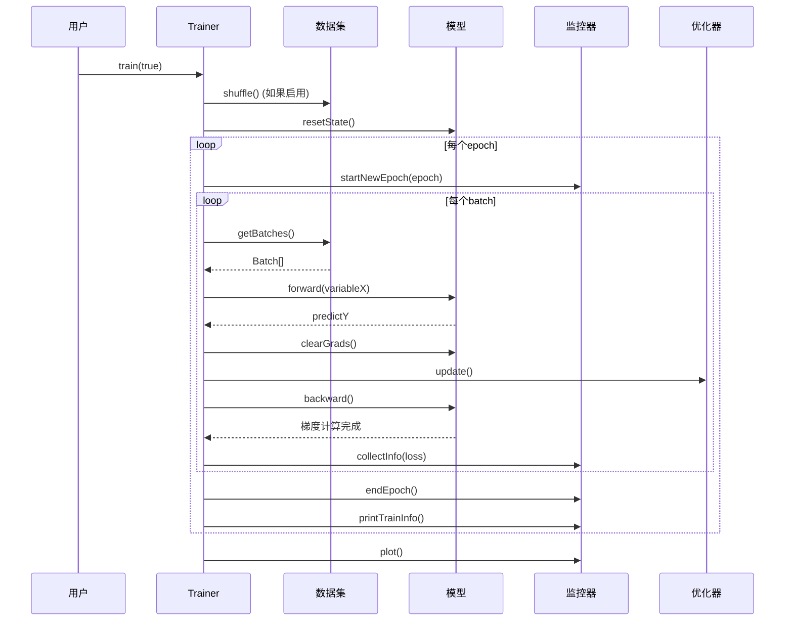
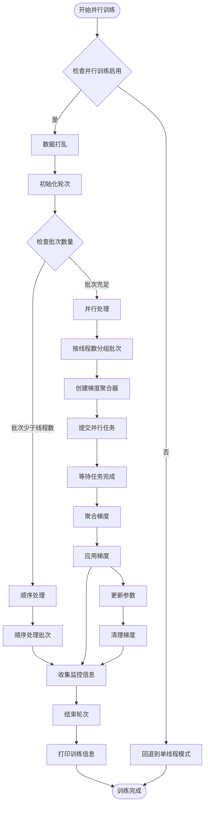
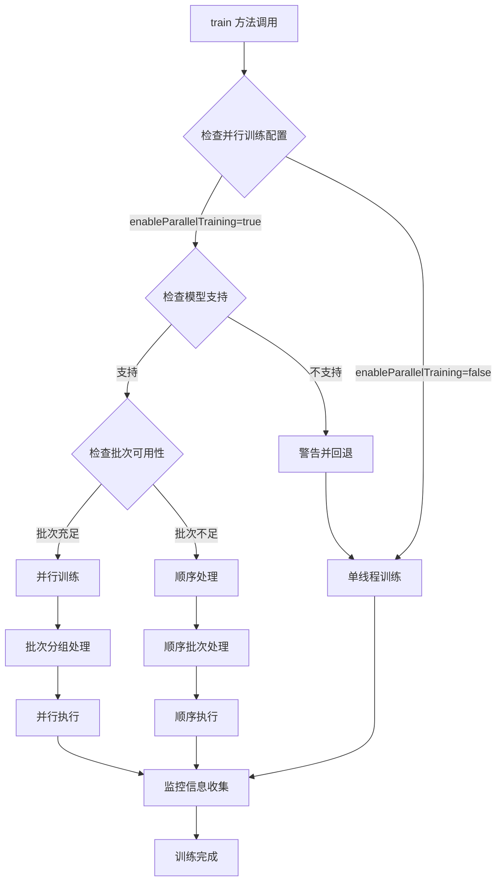

# 训练循环控制机制

<cite>
**本文档引用的文件**
- [Trainer.java](file://tinyai-dl-ml/src/main/java/io/leavesfly/tinyai/ml/Trainer.java)
- [ParallelTrainingUtils.java](file://tinyai-dl-ml/src/main/java/io/leavesfly/tinyai/ml/parallel/ParallelTrainingUtils.java)
- [ParallelBatchProcessor.java](file://tinyai-dl-ml/src/main/java/io/leavesfly/tinyai/ml/parallel/ParallelBatchProcessor.java)
- [GradientAggregator.java](file://tinyai-dl-ml/src/main/java/io/leavesfly/tinyai/ml/parallel/GradientAggregator.java)
- [ParallelTrainingTest.java](file://tinyai-dl-case/src/main/java/io/leavesfly/tinyai/example/parallel/ParallelTrainingTest.java)
</cite>

## 目录
1. [简介](#简介)
2. [项目结构概览](#项目结构概览)
3. [核心组件分析](#核心组件分析)
4. [架构概览](#架构概览)
5. [详细组件分析](#详细组件分析)
6. [训练循环控制机制](#训练循环控制机制)
7. [性能特征对比](#性能特征对比)
8. [最佳实践指南](#最佳实践指南)
9. [故障排除指南](#故障排除指南)
10. [结论](#结论)

## 简介

TinyDL框架的训练循环控制机制是一个高度优化的系统，能够根据并行训练配置自动路由到singleThreadTrain或parallelTrain方法。该机制提供了灵活的训练模式选择，支持单线程顺序训练和多线程并行训练两种模式，确保在不同硬件配置和数据规模下都能获得最佳性能。

## 项目结构概览

训练循环控制机制主要分布在以下关键模块中：



**图表来源**
- [Trainer.java](file://tinyai-dl-ml/src/main/java/io/leavesfly/tinyai/ml/Trainer.java#L1-L50)
- [ParallelTrainingUtils.java](file://tinyai-dl-ml/src/main/java/io/leavesfly/tinyai/ml/parallel/ParallelTrainingUtils.java#L1-L30)

## 核心组件分析

### Trainer 类 - 主控制器

Trainer类是整个训练循环控制的核心，负责协调各个组件的工作：

```java
public class Trainer {
    // 并行训练相关配置
    private int parallelThreadCount;
    private ExecutorService executorService;
    private boolean enableParallelTraining;
    
    // 主训练方法 - 自动选择训练模式
    public void train(boolean shuffleData) {
        if (enableParallelTraining) {
            parallelTrain(shuffleData);
        } else {
            singleThreadTrain(shuffleData);
        }
    }
}
```

**章节来源**
- [Trainer.java](file://tinyai-dl-ml/src/main/java/io/leavesfly/tinyai/ml/Trainer.java#L127-L132)

### 并行训练工具类

ParallelTrainingUtils提供了并行训练所需的核心工具方法：

```java
public class ParallelTrainingUtils {
    // 模型深拷贝 - 多线程训练的基础
    public static Model deepCopyModel(Model originalModel) {
        // 使用序列化进行深拷贝
        ByteArrayOutputStream baos = new ByteArrayOutputStream();
        ObjectOutputStream oos = new ObjectOutputStream(baos);
        oos.writeObject(originalModel);
        // ...
    }
    
    // 推荐线程数计算
    public static int getRecommendedThreadCount(int batchCount) {
        int availableCores = Runtime.getRuntime().availableProcessors();
        int maxThreads = Math.max(1, (int) (availableCores * 0.75));
        return Math.min(maxThreads, batchCount);
    }
}
```

**章节来源**
- [ParallelTrainingUtils.java](file://tinyai-dl-ml/src/main/java/io/leavesfly/tinyai/ml/parallel/ParallelTrainingUtils.java#L20-L40)

## 架构概览

训练循环控制机制采用分层架构设计，确保清晰的职责分离和高效的执行流程：



**图表来源**
- [Trainer.java](file://tinyai-dl-ml/src/main/java/io/leavesfly/tinyai/ml/Trainer.java#L127-L132)
- [Trainer.java](file://tinyai-dl-ml/src/main/java/io/leavesfly/tinyai/ml/Trainer.java#L170-L205)

## 详细组件分析

### singleThreadTrain 执行流程

singleThreadTrain方法实现了传统的单线程训练流程，确保在简单场景下的稳定性和可靠性：



**图表来源**
- [Trainer.java](file://tinyai-dl-ml/src/main/java/io/leavesfly/tinyai/ml/Trainer.java#L134-L170)

#### singleThreadTrain 的完整执行步骤

1. **数据预处理阶段**
   ```java
   DataSet trainDataSet = dataSet.getTrainDataSet();
   if (shuffleData) {
       trainDataSet.shuffle();  // 数据打乱
   }
   ```

2. **模型状态重置**
   ```java
   model.resetState();  // 重置模型内部状态
   monitor.startNewEpoch(i);  // 开始新轮次监控
   ```

3. **批次迭代处理**
   ```java
   for (Batch batch : batches) {
       Variable variableX = batch.toVariableX().setName("x").setRequireGrad(false);
       Variable variableY = batch.toVariableY().setName("y").setRequireGrad(false);
       
       Variable predictY = model.forward(variableX);
       Variable lossVariable = loss.loss(variableY, predictY);
   }
   ```

4. **前向传播与损失计算**
   ```java
   Variable predictY = model.forward(variableX);
   Variable lossVariable = loss.loss(variableY, predictY);
   lossVariable.setName("loss");
   
   model.clearGrads();  // 清空之前的梯度
   lossSum += lossVariable.getValue().getNumber().floatValue();
   ```

5. **反向传播与参数更新**
   ```java
   lossVariable.backward();  // 反向传播计算梯度
   optimizer.update();  // 使用优化器更新参数
   lossVariable.unChainBackward();  // 清理计算图
   
   model.tmpPredict = predictY;  // 存储预测结果
   ```

6. **监控信息收集**
   ```java
   monitor.collectInfo(lossSum / batches.size());
   monitor.endEpoch();
   monitor.printTrainInfo();
   ```

**章节来源**
- [Trainer.java](file://tinyai-dl-ml/src/main/java/io/leavesfly/tinyai/ml/Trainer.java#L134-L170)

### parallelTrain 并行处理策略

parallelTrain方法实现了复杂的多线程并行训练机制，通过以下步骤实现高效的数据并行处理：



**图表来源**
- [Trainer.java](file://tinyai-dl-ml/src/main/java/io/leavesfly/tinyai/ml/Trainer.java#L205-L242)
- [Trainer.java](file://tinyai-dl-ml/src/main/java/io/leavesfly/tinyai/ml/Trainer.java#L244-L310)

#### 并行处理的关键组件

##### 1. 并行批次处理器 (ParallelBatchProcessor)

```java
public class ParallelBatchProcessor implements Callable<BatchProcessResult> {
    @Override
    public BatchProcessResult call() throws Exception {
        try {
            // 1. 准备输入数据
            Variable variableX = batch.toVariableX().setName("x_" + threadId).setRequireGrad(false);
            Variable variableY = batch.toVariableY().setName("y_" + threadId).setRequireGrad(false);
            
            // 2. 前向传播
            Variable predictY = model.forward(variableX);
            
            // 3. 计算损失
            Variable lossVariable = loss.loss(variableY, predictY);
            
            // 4. 清空梯度并执行反向传播
            model.clearGrads();
            lossVariable.backward();
            
            // 5. 获取梯度并提交到聚合器
            Map<String, Parameter> gradients = model.getAllParams();
            gradientAggregator.submitGradients(gradients);
            
            return new BatchProcessResult(threadId, lossValue, batch.getSize(), true, null);
            
        } catch (Exception e) {
            // 错误处理：提交空梯度
            gradientAggregator.submitGradients(emptyGradients);
            return new BatchProcessResult(threadId, 0.0f, batch.getSize(), false, e);
        }
    }
}
```

**章节来源**
- [ParallelBatchProcessor.java](file://tinyai-dl-ml/src/main/java/io/leavesfly/tinyai/ml/parallel/ParallelBatchProcessor.java#L30-L80)

##### 2. 梯度聚合器 (GradientAggregator)

```java
public class GradientAggregator {
    private final Map<String, NdArray> accumulatedGradients;
    private final AtomicInteger submissionCount;
    private final int expectedSubmissions;
    private final ReentrantLock aggregationLock;
    private final Condition gradientReady;
    
    public void submitGradients(Map<String, Parameter> gradients) {
        aggregationLock.lock();
        try {
            // 累加梯度
            for (Map.Entry<String, Parameter> entry : gradients.entrySet()) {
                String paramName = entry.getKey();
                NdArray gradient = entry.getValue().getGrad();
                
                if (gradient != null) {
                    accumulatedGradients.merge(paramName, gradient, NdArray::add);
                }
            }
            
            // 检查是否收集完所有梯度
            if (submissionCount.incrementAndGet() >= expectedSubmissions) {
                // 计算平均梯度
                for (Map.Entry<String, NdArray> entry : accumulatedGradients.entrySet()) {
                    NdArray averageGrad = entry.getValue().divNum((float) expectedSubmissions);
                    entry.setValue(averageGrad);
                }
                isReady = true;
                gradientReady.signalAll(); // 通知等待的线程
            }
        } finally {
            aggregationLock.unlock();
        }
    }
}
```

**章节来源**
- [GradientAggregator.java](file://tinyai-dl-ml/src/main/java/io/leavesfly/tinyai/ml/parallel/GradientAggregator.java#L40-L80)

## 训练循环控制机制

### 自动路由机制

训练循环控制的核心在于自动路由机制，它根据配置和条件智能选择最适合的训练模式：



**图表来源**
- [Trainer.java](file://tinyai-dl-ml/src/main/java/io/leavesfly/tinyai/ml/Trainer.java#L127-L132)
- [Trainer.java](file://tinyai-dl-ml/src/main/java/io/leavesfly/tinyai/ml/Trainer.java#L105-L125)

### 数据打乱参数的实际影响

shuffleData参数对训练效果和性能都有重要影响：

1. **训练效果提升**
   - 打乱数据可以防止模型记住数据顺序
   - 提高模型的泛化能力
   - 减少过拟合风险

2. **性能考虑**
   - 数据打乱会增加内存访问模式的随机性
   - 可能影响缓存命中率
   - 对于小数据集，打乱开销可能超过收益

3. **最佳实践**
   ```java
   // 推荐的使用方式
   Trainer trainer = new Trainer(maxEpoch, monitor, evaluator, true, 4);
   trainer.init(dataSet, model, loss, optimizer);
   
   // 训练时决定是否打乱
   trainer.train(true);  // 训练时打乱数据
   trainer.train(false); // 训练时不打乱数据
   ```

**章节来源**
- [Trainer.java](file://tinyai-dl-ml/src/main/java/io/leavesfly/tinyai/ml/Trainer.java#L134-L140)

### 模型状态管理

模型状态重置是训练循环中的关键步骤，确保每轮训练的独立性：

```java
// 单线程模式下的状态管理
for (int i = 0; i < maxEpoch; i++) {
    model.resetState();  // 重置模型状态
    monitor.startNewEpoch(i);
    
    // 训练逻辑...
    
    monitor.endEpoch();
    monitor.printTrainInfo();
}

// 并行模式下的状态管理
private void processBatchesInParallel(List<Batch> batches, int epoch) {
    // 每个批次组使用独立的模型副本
    for (int i = 0; i < batchCount; i += parallelThreadCount) {
        Model modelCopy = ParallelTrainingUtils.deepCopyModel(model);
        // 并行处理...
    }
}
```

**章节来源**
- [Trainer.java](file://tinyai-dl-ml/src/main/java/io/leavesfly/tinyai/ml/Trainer.java#L137-L140)
- [Trainer.java](file://tinyai-dl-ml/src/main/java/io/leavesfly/tinyai/ml/Trainer.java#L250-L255)

## 性能特征对比

### 单线程 vs 并行训练性能特征

| 特征 | 单线程训练 | 并行训练 |
|------|------------|----------|
| **CPU利用率** | 低（单核） | 高（多核） |
| **内存使用** | 较低 | 较高（多模型副本） |
| **启动开销** | 低 | 中等（线程池初始化） |
| **吞吐量** | 低 | 高（批次级并行） |
| **延迟** | 低 | 中等（线程同步） |
| **适用场景** | 小数据集、简单模型 | 大数据集、复杂模型 |

### 性能基准测试建议

1. **测试环境配置**
   ```java
   // 基准测试配置
   int[] threadCounts = {1, 2, 4, 8, 16};
   int[] batchSizes = {16, 32, 64, 128};
   int maxEpoch = 10;
   
   for (int threads : threadCounts) {
       for (int batchSize : batchSizes) {
           testPerformance(threads, batchSize, maxEpoch);
       }
   }
   ```

2. **性能指标监控**
   ```java
   // 性能监控实现
   long startTime = System.currentTimeMillis();
   trainer.train(true);
   long endTime = System.currentTimeMillis();
   
   float throughput = (float) totalSamples / (endTime - startTime) * 1000;
   System.out.println("吞吐量: " + throughput + " samples/sec");
   ```

3. **内存使用分析**
   ```java
   // 内存使用监控
   Runtime runtime = Runtime.getRuntime();
   long memoryBefore = runtime.totalMemory() - runtime.freeMemory();
   
   trainer.train(true);
   
   long memoryAfter = runtime.totalMemory() - runtime.freeMemory();
   System.out.println("内存使用: " + (memoryAfter - memoryBefore) / 1024 / 1024 + " MB");
   ```

## 最佳实践指南

### 1. 并行训练配置最佳实践

```java
// 推荐的并行训练配置
public class TrainingBestPractices {
    public static Trainer createOptimalTrainer(
            DataSet dataSet, Model model, Loss loss, Optimizer optimizer,
            int maxEpoch, int recommendedThreadCount) {
        
        // 检查模型是否支持并行训练
        if (!ParallelTrainingUtils.isModelParallelizable(model)) {
            System.err.println("模型不支持并行训练，使用单线程模式");
            return new Trainer(maxEpoch, new Monitor(), new Evaluator());
        }
        
        // 创建并行训练器
        Trainer trainer = new Trainer(maxEpoch, new Monitor(), new Evaluator(), 
                                    true, recommendedThreadCount);
        
        // 初始化训练器
        trainer.init(dataSet, model, loss, optimizer);
        
        // 验证并行训练状态
        if (trainer.isParallelTrainingEnabled()) {
            System.out.println("并行训练已启用，线程数: " + trainer.getParallelThreadCount());
        } else {
            System.err.println("并行训练未启用，使用单线程模式");
        }
        
        return trainer;
    }
}
```

**章节来源**
- [Trainer.java](file://tinyai-dl-ml/src/main/java/io/leavesfly/tinyai/ml/Trainer.java#L105-L125)

### 2. 数据集准备最佳实践

```java
// 数据集准备最佳实践
public class DatasetPreparation {
    public static SpiralDateSet prepareOptimalDataset(int batchSize) {
        // 使用合适的批次大小
        SpiralDateSet dataSet = new SpiralDateSet(batchSize);
        
        // 预处理数据
        dataSet.prepare();
        
        // 检查批次分布
        List<Batch> batches = dataSet.getBatches();
        System.out.println("总批次数: " + batches.size());
        System.out.println("平均批次大小: " + batches.stream()
                .mapToInt(Batch::getSize).average().orElse(0));
        
        return dataSet;
    }
}
```

### 3. 错误处理最佳实践

```java
// 错误处理最佳实践
public class ErrorHandling {
    public static void robustTraining(Trainer trainer, DataSet dataSet) {
        try {
            // 训练前检查
            if (trainer == null || dataSet == null) {
                throw new IllegalArgumentException("训练器或数据集为空");
            }
            
            // 执行训练
            trainer.train(true);
            
        } catch (OutOfMemoryError e) {
            System.err.println("内存不足，请减少批次大小或线程数");
            // 回退到单线程模式
            trainer.configureParallelTraining(false, 1);
            trainer.train(true);
            
        } catch (Exception e) {
            System.err.println("训练过程中发生错误: " + e.getMessage());
            e.printStackTrace();
            
        } finally {
            // 确保资源释放
            trainer.shutdown();
        }
    }
}
```

### 4. 资源管理最佳实践

```java
// 资源管理最佳实践
public class ResourceManager {
    public static void managedTraining(Trainer trainer, DataSet dataSet) {
        try {
            // 训练逻辑
            trainer.train(true);
            
        } finally {
            // 确保资源释放
            if (trainer != null) {
                trainer.shutdown();
            }
        }
    }
    
    // 使用try-with-resources模式
    public static void resourceAwareTraining(Trainer trainer, DataSet dataSet) {
        try (trainer) {  // Trainer实现AutoCloseable接口
            trainer.train(true);
        }
    }
}
```

## 故障排除指南

### 常见问题及解决方案

#### 1. 并行训练未启用

**症状**: 显示"并行训练未启用"警告
**原因**: 模型不支持序列化或线程池初始化失败
**解决方案**:
```java
// 检查模型是否支持并行训练
if (!ParallelTrainingUtils.isModelParallelizable(model)) {
    System.err.println("模型不支持并行训练，使用单线程模式");
    trainer.configureParallelTraining(false, 1);
}
```

#### 2. 内存溢出错误

**症状**: OutOfMemoryError
**原因**: 并行训练时创建过多模型副本
**解决方案**:
```java
// 减少线程数或批次大小
int optimalThreadCount = ParallelTrainingUtils.getRecommendedThreadCount(batchCount);
trainer.configureParallelTraining(true, Math.min(optimalThreadCount, 2));
```

#### 3. 训练速度变慢

**症状**: 并行训练比单线程更慢
**原因**: 线程竞争或批次过小
**解决方案**:
```java
// 检查批次数量是否足够
List<Batch> batches = dataSet.getBatches();
if (batches.size() < trainer.getParallelThreadCount()) {
    System.out.println("批次数量不足，使用顺序处理");
    trainer.configureParallelTraining(false, 1);
}
```

#### 4. 梯度聚合失败

**症状**: 梯度聚合超时或异常
**原因**: 线程池配置不当或批次处理异常
**解决方案**:
```java
// 增加超时时间或调整线程池
executorService = Executors.newFixedThreadPool(parallelThreadCount, 
    new ThreadFactoryBuilder().setNameFormat("parallel-train-%d").build());
```

### 调试技巧

1. **启用详细日志**
   ```java
   // 在Trainer中添加调试日志
   private void logBatchProcessing(int threadId, int batchIndex, float loss) {
       System.out.println(String.format("[线程-%d] 批次 %d 处理完成，损失: %.6f", 
                                       threadId, batchIndex, loss));
   }
   ```

2. **监控线程状态**
   ```java
   // 检查线程池状态
   if (executorService instanceof ThreadPoolExecutor) {
       ThreadPoolExecutor pool = (ThreadPoolExecutor) executorService;
       System.out.println("活跃线程数: " + pool.getActiveCount());
       System.out.println("队列大小: " + pool.getQueue().size());
   }
   ```

3. **性能分析**
   ```java
   // 添加性能计时
   long startTime = System.nanoTime();
   trainer.train(true);
   long duration = System.nanoTime() - startTime;
   System.out.println("训练耗时: " + duration / 1_000_000 + " ms");
   ```

**章节来源**
- [Trainer.java](file://tinyai-dl-ml/src/main/java/io/leavesfly/tinyai/ml/Trainer.java#L105-L125)
- [Trainer.java](file://tinyai-dl-ml/src/main/java/io/leavesfly/tinyai/ml/Trainer.java#L374-L390)

## 结论

TinyDL框架的训练循环控制机制展现了现代深度学习框架的设计精髓。通过巧妙的自动路由机制，系统能够在单线程和并行训练之间无缝切换，既保证了简单场景下的稳定性，又充分利用了多核处理器的计算能力。

### 主要优势

1. **智能路由**: 根据配置和条件自动选择最优训练模式
2. **灵活配置**: 支持动态调整并行参数和训练模式
3. **健壮性**: 完善的错误处理和回退机制
4. **性能优化**: 针对不同场景的性能调优策略

### 设计亮点

- **模块化设计**: 清晰的职责分离和组件解耦
- **线程安全**: 完善的并发控制和资源管理
- **扩展性**: 易于添加新的训练模式和优化策略
- **易用性**: 简洁的API设计和丰富的配置选项

### 应用建议

对于不同的应用场景，建议采用相应的配置策略：

- **开发和调试**: 使用单线程模式，便于问题定位
- **小规模实验**: 根据硬件配置选择适当的线程数
- **大规模训练**: 充分利用并行训练提升效率
- **生产环境**: 结合监控和错误处理机制确保稳定性

通过深入理解这些机制，开发者可以更好地利用TinyDL框架的强大功能，构建高效、稳定的深度学习应用。