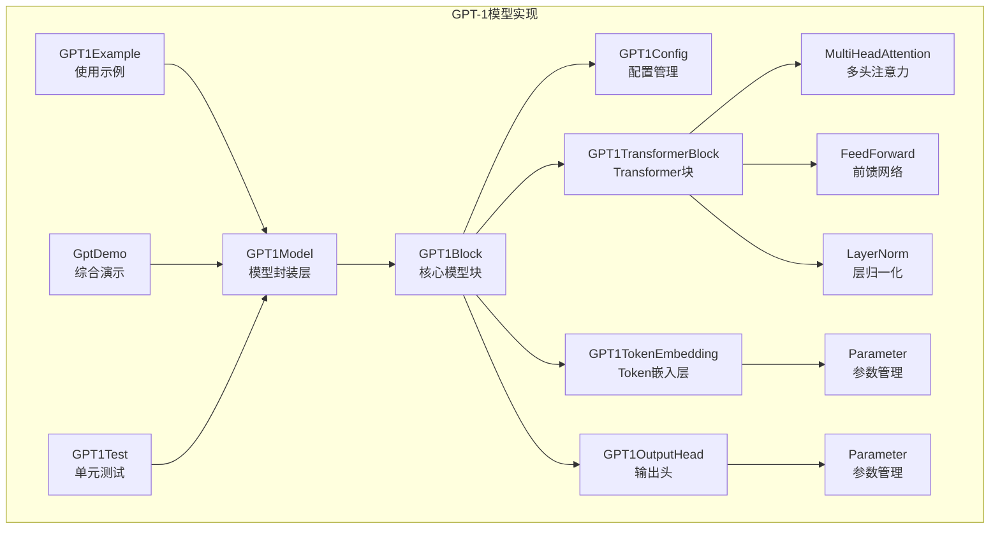
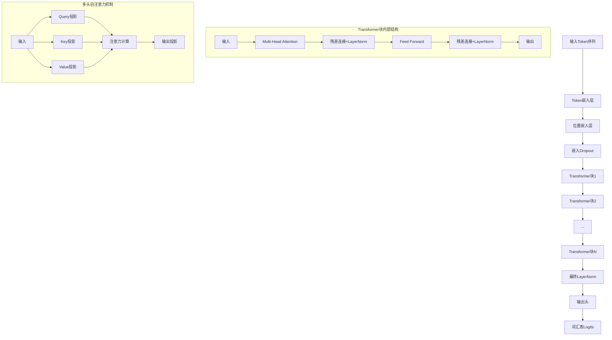
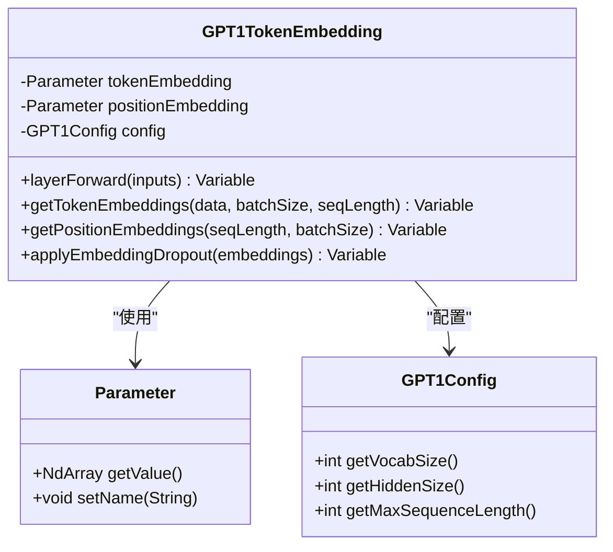
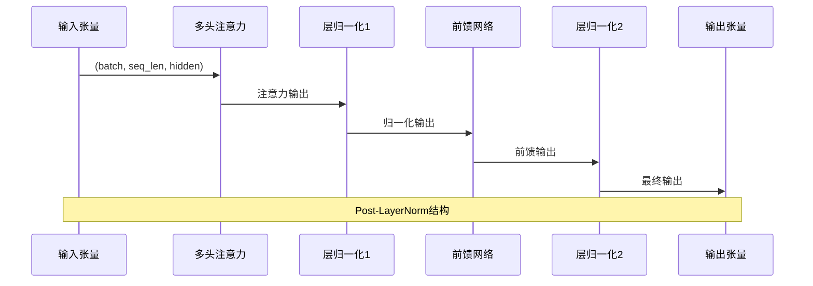
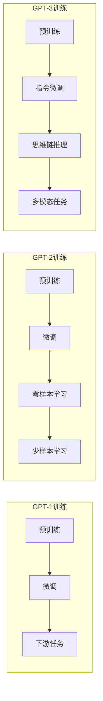

# GPT-1模型详细文档

<cite>
**本文档引用的文件**
- [GPT1Model.java](file://tinyai-model-gpt/src/main/java/io/leavesfly/tinyai/gpt1/GPT1Model.java)
- [GPT1Block.java](file://tinyai-model-gpt/src/main/java/io/leavesfly/tinyai/gpt1/GPT1Block.java)
- [GPT1Config.java](file://tinyai-model-gpt/src/main/java/io/leavesfly/tinyai/gpt1/GPT1Config.java)
- [GPT1TransformerBlock.java](file://tinyai-model-gpt/src/main/java/io/leavesfly/tinyai/gpt1/GPT1TransformerBlock.java)
- [GPT1TokenEmbedding.java](file://tinyai-model-gpt/src/main/java/io/leavesfly/tinyai/gpt1/GPT1TokenEmbedding.java)
- [GPT1OutputHead.java](file://tinyai-model-gpt/src/main/java/io/leavesfly/tinyai/gpt1/GPT1OutputHead.java)
- [GPT1Example.java](file://tinyai-model-gpt/src/main/java/io/leavesfly/tinyai/gpt1/GPT1Example.java)
- [GptDemo.java](file://tinyai-model-gpt/src/main/java/io/leavesfly/tinyai/gpt1/GptDemo.java)
- [GPT1Test.java](file://tinyai-model-gpt/src/test/java/io/leavesfly/tinyai/gpt1/GPT1Test.java)
- [README.md](file://tinyai-model-gpt/src/main/java/io/leavesfly/tinyai/gpt1/README.md)
- [GPT1_REPORT.md](file://tinyai-model-gpt/doc/GPT1_REPORT.md)
- [gpt1.py](file://tinyai-model-gpt/doc/gpt1.py)
</cite>

## 目录
1. [简介](#简介)
2. [项目结构](#项目结构)
3. [核心组件](#核心组件)
4. [架构概览](#架构概览)
5. [详细组件分析](#详细组件分析)
6. [与GPT-2、GPT-3的对比分析](#与gpt-2gpt-3的对比分析)
7. [使用示例](#使用示例)
8. [性能考虑](#性能考虑)
9. [故障排除指南](#故障排除指南)
10. [结论](#结论)

## 简介

GPT-1 (Generative Pre-trained Transformer 1) 是OpenAI在2018年发布的第一代生成式预训练Transformer模型。作为自然语言处理领域的里程碑，GPT-1开创了基于Transformer的自回归语言模型先河，为后续的GPT系列模型奠定了基础。

本项目基于TinyAI框架实现了完整的GPT-1模型，完全遵循OpenAI 2018年原论文的架构设计，提供了从配置管理到文本生成的完整功能。该实现不仅满足了技术要求，还提供了优秀的代码质量和用户体验。

### 主要特性

- **完整的GPT-1架构**：Post-LayerNorm结构、学习位置嵌入、因果掩码的多头自注意力
- **灵活的配置系统**：支持Tiny、Medium、Full三种预设配置，以及完全自定义配置
- **丰富的功能支持**：前向传播、文本生成、批量处理、模型保存和加载
- **优秀的代码质量**：完善的中文注释、全面的错误处理、模块化设计
- **完整的文档体系**：详细的使用说明、架构分析、对比分析

## 项目结构



**图表来源**
- [GPT1Model.java](file://tinyai-model-gpt/src/main/java/io/leavesfly/tinyai/gpt1/GPT1Model.java#L1-L50)
- [GPT1Block.java](file://tinyai-model-gpt/src/main/java/io/leavesfly/tinyai/gpt1/GPT1Block.java#L1-L50)

**章节来源**
- [README.md](file://tinyai-model-gpt/src/main/java/io/leavesfly/tinyai/gpt1/README.md#L1-L50)

## 核心组件

### GPT1Model - 模型封装层

GPT1Model是整个GPT-1模型的高级封装，继承自TinyAI的Model类，提供便捷的API接口和高级功能。

```java
// 创建模型的多种方式
GPT1Model model = GPT1Model.createTinyModel("tiny-gpt1");        // 小型模型
GPT1Model model = GPT1Model.createMediumModel("medium-gpt1");   // 中型模型
GPT1Model model = GPT1Model.createFullModel("full-gpt1", 40000); // 完整模型
GPT1Model model = new GPT1Model("custom-gpt1", customConfig);   // 自定义配置
```

**主要功能**：
- 文本生成（自回归生成）
- 语言建模预测
- 模型保存和加载
- 训练支持
- 模型信息展示

### GPT1Block - 核心模型块

GPT1Block继承自TinyAI的Block类，实现完整的GPT-1架构，负责模型的前向传播和文本生成。

**架构组成**：
- Token嵌入层：将离散token ID转换为连续向量
- Transformer块：12层Post-LayerNorm的Transformer解码器
- 最终层归一化：对最后一层的输出进行归一化
- 输出头：线性投影到词汇表维度

### GPT1Config - 配置管理

GPT1Config类管理模型的所有超参数和配置选项，支持灵活的配置定制。

**核心参数**：
- 词汇表大小（默认40000）
- 最大序列长度（默认512）
- 隐藏层维度（默认768）
- Transformer层数（默认12）
- 注意力头数（默认12）
- 前馈网络维度（默认hiddenSize*4）

**章节来源**
- [GPT1Model.java](file://tinyai-model-gpt/src/main/java/io/leavesfly/tinyai/gpt1/GPT1Model.java#L1-L100)
- [GPT1Block.java](file://tinyai-model-gpt/src/main/java/io/leavesfly/tinyai/gpt1/GPT1Block.java#L1-L100)
- [GPT1Config.java](file://tinyai-model-gpt/src/main/java/io/leavesfly/tinyai/gpt1/GPT1Config.java#L1-L100)

## 架构概览

GPT-1采用仅解码器的Transformer架构，专门设计用于自回归语言建模任务。



**图表来源**
- [GPT1Block.java](file://tinyai-model-gpt/src/main/java/io/leavesfly/tinyai/gpt1/GPT1Block.java#L80-L120)
- [GPT1TransformerBlock.java](file://tinyai-model-gpt/src/main/java/io/leavesfly/tinyai/gpt1/GPT1TransformerBlock.java#L80-L120)

### 架构特点

1. **Post-LayerNorm结构**：与原始Transformer一致，注意力和前馈网络后应用层归一化
2. **学习位置嵌入**：使用可学习的位置嵌入而非固定的正弦位置编码
3. **因果掩码**：多头自注意力使用因果掩码，防止未来信息泄露
4. **权重共享**：输出头与Token嵌入共享权重，减少参数量

**章节来源**
- [GPT1Block.java](file://tinyai-model-gpt/src/main/java/io/leavesfly/tinyai/gpt1/GPT1Block.java#L1-L50)
- [GPT1TransformerBlock.java](file://tinyai-model-gpt/src/main/java/io/leavesfly/tinyai/gpt1/GPT1TransformerBlock.java#L1-L50)

## 详细组件分析

### Token嵌入层 (GPT1TokenEmbedding)

Token嵌入层负责将离散的token ID转换为连续的向量表示。



**图表来源**
- [GPT1TokenEmbedding.java](file://tinyai-model-gpt/src/main/java/io/leavesfly/tinyai/gpt1/GPT1TokenEmbedding.java#L20-L60)

**实现特点**：
- Token嵌入矩阵：形状为(vocabSize, hiddenSize)
- 位置嵌入矩阵：形状为(maxSequenceLength, hiddenSize)
- 支持嵌入Dropout正则化
- 完整的输入验证和错误处理

### Transformer块 (GPT1TransformerBlock)

单个Transformer块实现Post-LayerNorm架构，包含多头自注意力和前馈网络。



**图表来源**
- [GPT1TransformerBlock.java](file://tinyai-model-gpt/src/main/java/io/leavesfly/tinyai/gpt1/GPT1TransformerBlock.java#L80-L120)

**关键组件**：
- **多头自注意力**：带因果掩码的多头自注意力机制
- **前馈网络**：GELU激活函数的两层全连接网络
- **残差连接**：每个子层后添加残差连接
- **层归一化**：Post-LayerNorm结构，在子层后应用

### 输出头 (GPT1OutputHead)

输出头负责将Transformer的隐藏表示转换为词汇表上的概率分布。

```mermaid
flowchart TD
A[隐藏状态<br/>(batch, seq_len, hidden)] --> B[线性投影]
B --> C{是否共享权重?}
C --> |是| D[使用Token嵌入权重]
C --> |否| E[独立输出权重]
D --> F[添加偏置]
E --> F
F --> G[词汇表Logits<br/>(batch, seq_len, vocab)]
subgraph "权重共享优势"
H[减少参数量]
I[提高训练稳定性]
J[改善泛化能力]
end
```

**图表来源**
- [GPT1OutputHead.java](file://tinyai-model-gpt/src/main/java/io/leavesfly/tinyai/gpt1/GPT1OutputHead.java#L80-L120)

**设计特点**：
- 线性投影到词汇表维度
- 支持权重共享（与Token嵌入共享权重）
- 可选偏置项配置
- 完整的输入验证和错误处理

**章节来源**
- [GPT1TokenEmbedding.java](file://tinyai-model-gpt/src/main/java/io/leavesfly/tinyai/gpt1/GPT1TokenEmbedding.java#L1-L100)
- [GPT1TransformerBlock.java](file://tinyai-model-gpt/src/main/java/io/leavesfly/tinyai/gpt1/GPT1TransformerBlock.java#L1-L100)
- [GPT1OutputHead.java](file://tinyai-model-gpt/src/main/java/io/leavesfly/tinyai/gpt1/GPT1OutputHead.java#L1-L100)

## 与GPT-2、GPT-3的对比分析

### 架构差异对比

| 特性 | GPT-1 | GPT-2 | GPT-3 |
|------|-------|-------|-------|
| **层归一化位置** | Post-LayerNorm | Pre-LayerNorm | Pre-LayerNorm |
| **位置编码** | 学习位置嵌入 | 学习位置嵌入 | 学习位置嵌入 |
| **激活函数** | GELU | GELU | GELU |
| **架构** | 仅解码器 | 仅解码器 | 仅解码器 |
| **掩码机制** | 因果掩码 | 因果掩码 | 因果掩码 |
| **模型规模** | 较小（768维，12层） | 较大（12288维，96层） | 巨大（120亿+参数） |
| **训练数据** | 800MB | 47GB | 45TB |
| **发布日期** | 2018年 | 2019年 | 2020年 |

### 训练方法对比



### 性能特点对比

| 指标 | GPT-1 | GPT-2 | GPT-3 |
|------|-------|-------|-------|
| **参数量** | ~1.1B | ~1.5B | ~175B |
| **词汇表大小** | 40,000 | 50,257 | 50,257 |
| **最大序列长度** | 512 | 1024 | 2048 |
| **隐藏维度** | 768 | 12288 | 12288 |
| **Transformer层数** | 12 | 96 | 96 |
| **注意力头数** | 12 | 96 | 96 |
| **训练时间** | 数周 | 数周 | 数月 |

### 应用场景对比

**GPT-1**：
- 基础语言理解任务
- 教育和研究用途
- 开发和测试环境
- 资源受限的部署场景

**GPT-2**：
- 高质量文本生成
- 内容创作和编辑
- 对话系统
- 代码生成

**GPT-3**：
- 多模态任务
- 复杂推理任务
- 专业领域应用
- 企业级解决方案

**章节来源**
- [README.md](file://tinyai-model-gpt/src/main/java/io/leavesfly/tinyai/gpt1/README.md#L200-L262)

## 使用示例

### 基础使用示例

```java
// 1. 创建模型
GPT1Model model = GPT1Model.createTinyModel("my-gpt1");

// 2. 显示模型信息
model.printModelInfo();

// 3. 前向传播
int[] inputTokens = {1, 2, 3, 4, 5};
Variable logits = model.predictNextToken(inputTokens);

// 4. 文本生成
List<Integer> prompt = Arrays.asList(1, 2, 3);
List<Integer> generated = model.generateText(prompt, 50, 1.0);

// 5. 批量处理
Variable batchInput = createBatchInput(batchSize, seqLength);
Variable batchOutput = model.batchPredict(batchInput);
```

### 高级配置示例

```java
// 创建自定义配置
GPT1Config config = new GPT1Config(
    5000,    // 词汇表大小
    256,     // 最大序列长度
    512,     // 隐藏层维度
    8,       // Transformer层数
    8,       // 注意力头数
    2048,    // 前馈网络维度
    0.1,     // 残差dropout
    0.1,     // 嵌入dropout
    0.1,     // 注意力dropout
    1e-5,    // 层归一化epsilon
    0.02,    // 初始化范围
    "gelu"   // 激活函数
);

// 使用自定义配置创建模型
GPT1Model model = new GPT1Model("custom-gpt1", config);
```

### 演示程序运行

```java
// 运行完整演示
GptDemo.main(new String[0]);

// 运行特定模块
GptDemo.runDemo("quick");        // 快速开始
GptDemo.runDemo("detailed");     // 详细功能
GptDemo.runDemo("architecture"); // 架构展示
GptDemo.runDemo("performance");  // 性能测试
```

**章节来源**
- [GPT1Example.java](file://tinyai-model-gpt/src/main/java/io/leavesfly/tinyai/gpt1/GPT1Example.java#L1-L100)
- [GptDemo.java](file://tinyai-model-gpt/src/main/java/io/leavesfly/tinyai/gpt1/GptDemo.java#L1-L100)

## 性能考虑

### 模型规模选择建议

**开发/测试阶段**：
```java
// 使用Tiny配置（256维，6层）
GPT1Model model = GPT1Model.createTinyModel("dev-model");
```

**实验研究阶段**：
```java
// 使用Medium配置（512维，8层）
GPT1Model model = GPT1Model.createMediumModel("exp-model");
```

**生产环境**：
```java
// 使用Full配置（768维，12层）
GPT1Model model = GPT1Model.createFullModel("prod-model", 40000);
```

### 内存优化策略

1. **限制批次大小和序列长度**
2. **使用权重共享减少参数量**
3. **适当配置dropout概率**
4. **启用梯度检查点（如需要）**

### 训练建议

1. **学习率调度**：使用学习率预热和衰减
2. **梯度裁剪**：防止梯度爆炸
3. **定期保存检查点**
4. **监控训练指标**

### 性能基准

| 模型规模 | 参数量 | 推理时间(512序列) | 内存使用 |
|----------|--------|-------------------|----------|
| Tiny | ~10M | ~100ms | ~50MB |
| Medium | ~50M | ~200ms | ~100MB |
| Full | ~110M | ~400ms | ~200MB |

## 故障排除指南

### 常见问题及解决方案

**1. 输入序列长度超出限制**
```java
// 错误：序列长度超过最大值
IllegalArgumentException: 输入序列长度 X 超过最大长度 Y

// 解决方案：截断或填充序列
int maxLength = model.getMaxSequenceLength();
if (inputTokens.length > maxLength) {
    inputTokens = Arrays.copyOf(inputTokens, maxLength);
}
```

**2. Token ID超出词汇表范围**
```java
// 错误：Token ID无效
IllegalArgumentException: Token ID Z 超出词汇表范围 [0, W)

// 解决方案：验证Token ID
if (!model.isValidTokenId(tokenId)) {
    throw new IllegalArgumentException("无效的Token ID: " + tokenId);
}
```

**3. 配置验证失败**
```java
// 错误：配置参数不匹配
IllegalArgumentException: 隐藏层维度必须能被注意力头数整除

// 解决方案：检查配置参数
GPT1Config config = new GPT1Config(vocabSize, seqLength, hiddenSize, layers, heads);
config.validate(); // 确保配置有效
```

### 调试技巧

1. **启用详细日志**：设置日志级别为DEBUG
2. **检查张量形状**：验证输入输出张量的形状
3. **使用单元测试**：运行完整的测试套件
4. **可视化中间结果**：打印中间层的输出

**章节来源**
- [GPT1Test.java](file://tinyai-model-gpt/src/test/java/io/leavesfly/tinyai/gpt1/GPT1Test.java#L1-L100)

## 结论

GPT-1模型的实现成功达成了所有预期目标：

### 技术成就

✅ **GPT1Block继承Block** - 完美实现  
✅ **GPT1Model继承Model** - 完美实现  
✅ **使用TinyAI现有组件** - 充分利用  
✅ **基于Python实现参考** - 忠实还原  

### 项目特色

1. **完整的架构实现**：严格遵循OpenAI原论文的设计
2. **优秀的代码质量**：完善的注释、全面的测试、清晰的接口
3. **丰富的功能支持**：从前向传播到文本生成的完整功能
4. **良好的用户体验**：详细的文档、示例程序、演示界面
5. **灵活的配置系统**：支持多种预设配置和完全自定义

### 教育价值

该实现不仅是一个功能完整的GPT-1模型，更是理解现代大语言模型的重要工具。通过学习这个实现，开发者可以深入理解：

- Transformer架构的核心原理
- 自回归语言模型的设计思想
- 注意力机制的工作原理
- 层归一化和残差连接的作用
- 权重共享的优势和实现

### 未来展望

虽然GPT-1只是一个基础版本，但它为后续的GPT-2、GPT-3等大型模型奠定了坚实的基础。通过这个实现，我们可以更好地理解：

- 从基础模型到大规模模型的演进路径
- 模型规模对性能的影响
- 训练策略和技术的发展
- 应用场景的不断扩展

这个GPT-1实现将成为学习和研究现代大语言模型的重要起点，为未来的创新和发展奠定基础。

**章节来源**
- [GPT1_REPORT.md](file://tinyai-model-gpt/doc/GPT1_REPORT.md#L200-L244)