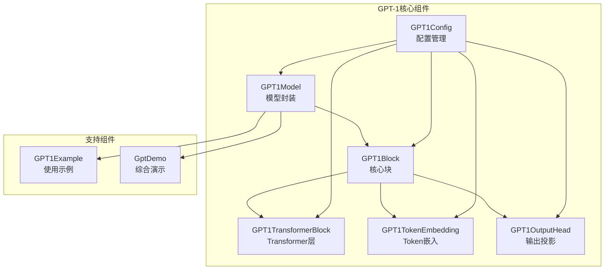
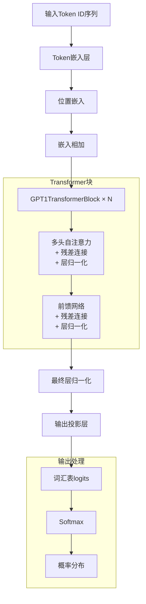
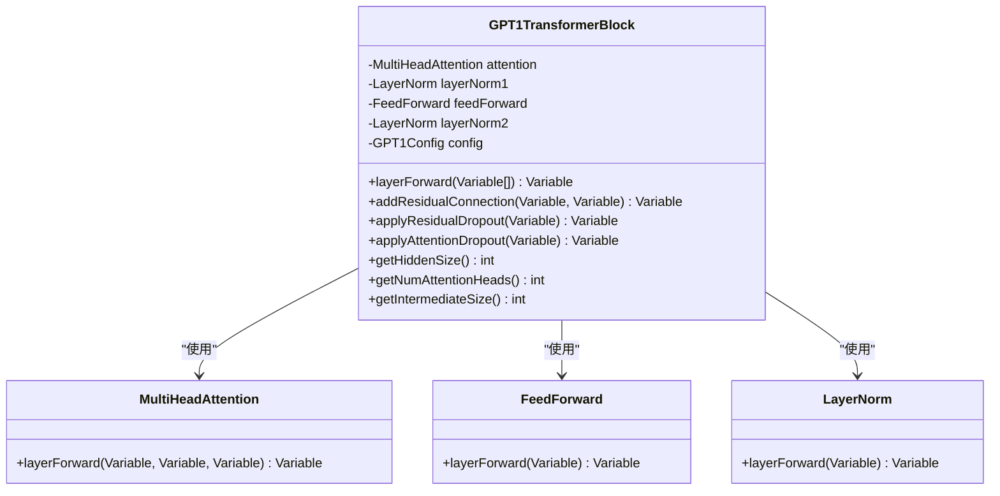
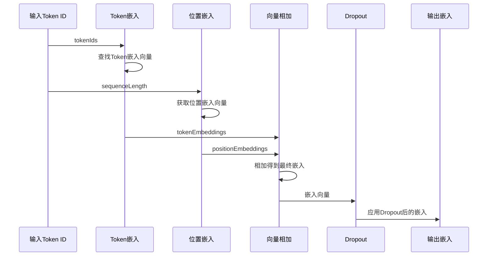
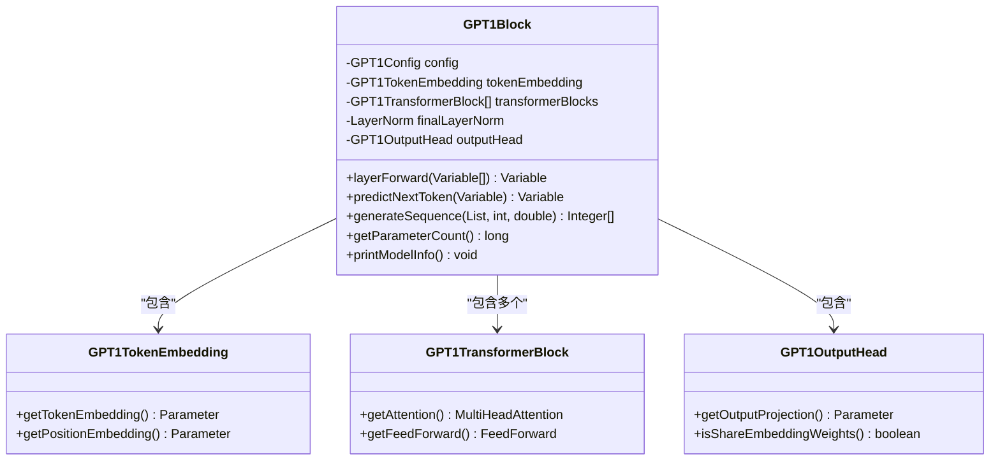
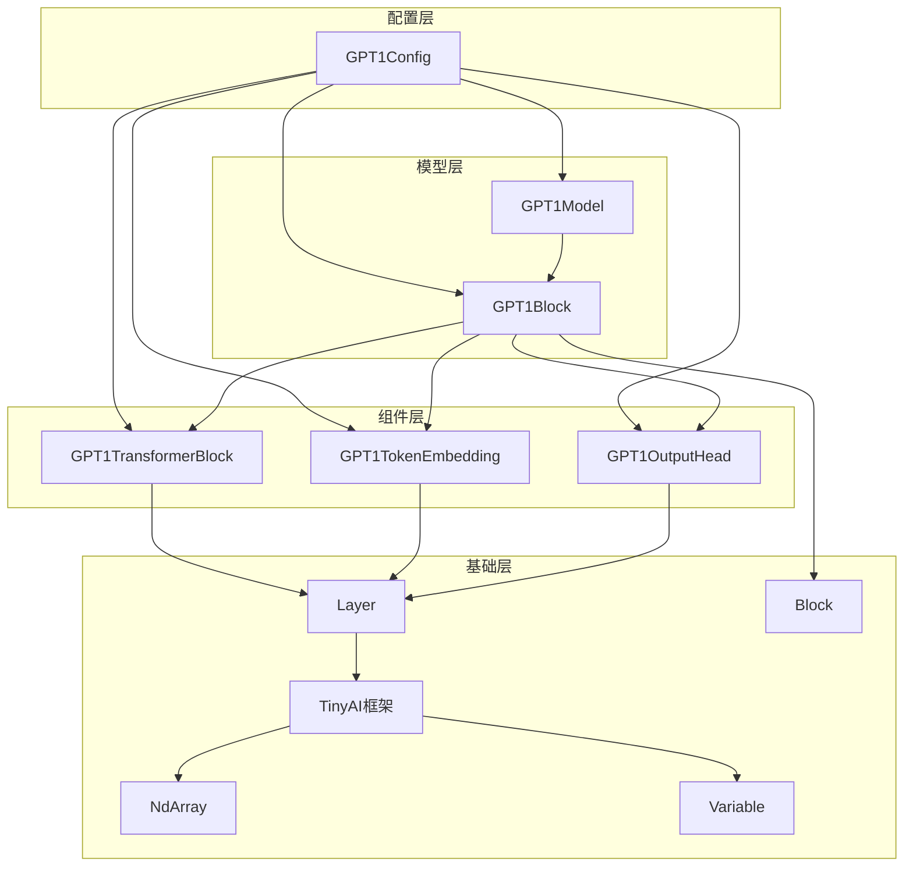

# GPT-1模型组件详细文档

<cite>
**本文档引用的文件**
- [GPT1Config.java](file://tinyai-model-gpt/src/main/java/io/leavesfly/tinyai/gpt1/GPT1Config.java)
- [GPT1Model.java](file://tinyai-model-gpt/src/main/java/io/leavesfly/tinyai/gpt1/GPT1Model.java)
- [GPT1Block.java](file://tinyai-model-gpt/src/main/java/io/leavesfly/tinyai/gpt1/GPT1Block.java)
- [GPT1TransformerBlock.java](file://tinyai-model-gpt/src/main/java/io/leavesfly/tinyai/gpt1/GPT1TransformerBlock.java)
- [GPT1TokenEmbedding.java](file://tinyai-model-gpt/src/main/java/io/leavesfly/tinyai/gpt1/GPT1TokenEmbedding.java)
- [GPT1OutputHead.java](file://tinyai-model-gpt/src/main/java/io/leavesfly/tinyai/gpt1/GPT1OutputHead.java)
- [GPT1Example.java](file://tinyai-model-gpt/src/main/java/io/leavesfly/tinyai/gpt1/GPT1Example.java)
- [GptDemo.java](file://tinyai-model-gpt/src/main/java/io/leavesfly/tinyai/gpt1/GptDemo.java)
- [README.md](file://tinyai-model-gpt/src/main/java/io/leavesfly/tinyai/gpt1/README.md)
</cite>

## 目录
1. [简介](#简介)
2. [项目结构](#项目结构)
3. [核心组件](#核心组件)
4. [架构概览](#架构概览)
5. [详细组件分析](#详细组件分析)
6. [依赖关系分析](#依赖关系分析)
7. [性能考虑](#性能考虑)
8. [故障排除指南](#故障排除指南)
9. [结论](#结论)

## 简介

GPT-1（Generative Pre-trained Transformer 1）是OpenAI在2018年发布的第一代生成式预训练Transformer模型。本项目基于TinyAI框架实现了完整的GPT-1模型，完全遵循原始论文的架构设计，提供了从基础配置到高级应用的完整解决方案。

GPT-1采用仅解码器的Transformer架构，专门设计用于自回归语言建模任务。该模型具有以下核心特点：
- **Post-LayerNorm架构**：与原始Transformer论文一致的后层归一化结构
- **因果掩码多头注意力**：确保模型只能关注当前位置之前的信息
- **学习位置嵌入**：使用可学习的位置向量而非固定编码
- **权重共享**：输出层与Token嵌入层共享权重以减少参数量

## 项目结构

GPT-1模型组件采用模块化设计，每个核心类负责特定的功能领域：



**图表来源**
- [GPT1Config.java](file://tinyai-model-gpt/src/main/java/io/leavesfly/tinyai/gpt1/GPT1Config.java#L1-L288)
- [GPT1Model.java](file://tinyai-model-gpt/src/main/java/io/leavesfly/tinyai/gpt1/GPT1Model.java#L1-L385)
- [GPT1Block.java](file://tinyai-model-gpt/src/main/java/io/leavesfly/tinyai/gpt1/GPT1Block.java#L1-L346)

**章节来源**
- [README.md](file://tinyai-model-gpt/src/main/java/io/leavesfly/tinyai/gpt1/README.md#L1-L262)

## 核心组件

### GPT1Config - 配置管理器

GPT1Config类是整个GPT-1模型的配置中心，负责管理所有超参数和配置选项。该类提供了完整的配置验证和多种预设配置方案。

**主要功能：**
- **核心模型参数**：词汇表大小、序列长度、隐藏维度、层数、注意力头数
- **训练相关参数**：dropout概率、层归一化epsilon、参数初始化范围
- **激活函数配置**：支持GELU等激活函数
- **配置验证**：确保参数组合的有效性

**关键特性：**
- 支持三种预设配置：Tiny（用于测试）、Medium（用于实验）、Full（原论文配置）
- 提供完整的getter/setter方法
- 实现了严格的参数验证机制
- 支持自定义配置创建

### GPT1Model - 模型封装器

GPT1Model继承自TinyAI的Model类，提供了高级的API接口和便捷的方法，封装了底层的GPT1Block实现。

**核心功能：**
- **文本生成**：支持自回归文本生成，可调节温度参数
- **语言建模**：提供预测下一个token的能力
- **批量处理**：支持批量输入和输出
- **模型管理**：提供模型保存、加载和信息展示功能
- **训练支持**：提供损失计算和训练辅助功能

**章节来源**
- [GPT1Config.java](file://tinyai-model-gpt/src/main/java/io/leavesfly/tinyai/gpt1/GPT1Config.java#L1-L288)
- [GPT1Model.java](file://tinyai-model-gpt/src/main/java/io/leavesfly/tinyai/gpt1/GPT1Model.java#L1-L385)

## 架构概览

GPT-1模型采用经典的Transformer解码器架构，整体结构清晰且层次分明：



**图表来源**
- [GPT1Block.java](file://tinyai-model-gpt/src/main/java/io/leavesfly/tinyai/gpt1/GPT1Block.java#L100-L130)
- [GPT1TransformerBlock.java](file://tinyai-model-gpt/src/main/java/io/leavesfly/tinyai/gpt1/GPT1TransformerBlock.java#L80-L110)

**章节来源**
- [GPT1Block.java](file://tinyai-model-gpt/src/main/java/io/leavesfly/tinyai/gpt1/GPT1Block.java#L1-L346)
- [README.md](file://tinyai-model-gpt/src/main/java/io/leavesfly/tinyai/gpt1/README.md#L1-L262)

## 详细组件分析

### GPT1TransformerBlock - Transformer解码器块

GPT1TransformerBlock是GPT-1模型的核心组件，实现了Post-LayerNorm结构的Transformer解码器块。



**图表来源**
- [GPT1TransformerBlock.java](file://tinyai-model-gpt/src/main/java/io/leavesfly/tinyai/gpt1/GPT1TransformerBlock.java#L30-L60)

**Post-LayerNorm架构流程：**

1. **多头自注意力**：输入通过多头自注意力机制，使用因果掩码防止信息泄露
2. **残差连接**：将输入与注意力输出相加
3. **层归一化**：对残差连接后的输出进行归一化
4. **前馈网络**：通过两层全连接网络处理
5. **第二次残差连接**：将归一化后的输出与FFN输出相加
6. **第二次层归一化**：最终输出经过层归一化

**章节来源**
- [GPT1TransformerBlock.java](file://tinyai-model-gpt/src/main/java/io/leavesfly/tinyai/gpt1/GPT1TransformerBlock.java#L1-L253)

### GPT1TokenEmbedding - Token嵌入层

GPT1TokenEmbedding负责将离散的token ID转换为连续的向量表示，是模型的输入处理单元。



**图表来源**
- [GPT1TokenEmbedding.java](file://tinyai-model-gpt/src/main/java/io/leavesfly/tinyai/gpt1/GPT1TokenEmbedding.java#L70-L100)

**关键特性：**
- **Token嵌入**：将词汇表中的token映射到高维向量空间
- **位置嵌入**：为每个序列位置学习位置向量
- **嵌入相加**：将token嵌入和位置嵌入相加得到最终表示
- **Dropout支持**：提供嵌入层的正则化能力

**章节来源**
- [GPT1TokenEmbedding.java](file://tinyai-model-gpt/src/main/java/io/leavesfly/tinyai/gpt1/GPT1TokenEmbedding.java#L1-L290)

### GPT1OutputHead - 输出投影层

GPT1OutputHead负责将Transformer的隐藏表示转换为词汇表上的概率分布，是模型的输出处理单元。

```mermaid
flowchart TD
HiddenStates[隐藏状态<br/>(batch, seq_len, hidden)] --> LinearProj[线性投影<br/>W^T × hidden]
Bias[偏置项<br/>可选] --> LinearProj
LinearProj --> Logits[词汇表logits<br/>(batch, seq_len, vocab)]
Logits --> Softmax[Softmax归一化]
Softmax --> ProbDist[概率分布]
subgraph "权重共享"
TokenEmb[Token嵌入权重] --> SharedWeight{是否共享?}
SharedWeight --> |是| UseShared[使用共享权重]
SharedWeight --> |否| Independent[独立初始化]
UseShared --> LinearProj
Independent --> LinearProj
end
```

**图表来源**
- [GPT1OutputHead.java](file://tinyai-model-gpt/src/main/java/io/leavesfly/tinyai/gpt1/GPT1OutputHead.java#L120-L150)

**设计特点：**
- **线性投影**：将隐藏维度映射到词汇表维度
- **权重共享**：可选择与Token嵌入层共享权重以减少参数
- **偏置支持**：可选的偏置项增加模型灵活性
- **数值稳定性**：支持层归一化epsilon参数

**章节来源**
- [GPT1OutputHead.java](file://tinyai-model-gpt/src/main/java/io/leavesfly/tinyai/gpt1/GPT1OutputHead.java#L1-L292)

### GPT1Block - 核心模型块

GPT1Block继承自TinyAI的Block类，实现了完整的GPT-1架构，是模型的主要构建单元。



**图表来源**
- [GPT1Block.java](file://tinyai-model-gpt/src/main/java/io/leavesfly/tinyai/gpt1/GPT1Block.java#L40-L80)

**章节来源**
- [GPT1Block.java](file://tinyai-model-gpt/src/main/java/io/leavesfly/tinyai/gpt1/GPT1Block.java#L1-L346)

## 依赖关系分析

GPT-1模型组件之间存在清晰的层次依赖关系，形成了完整的架构体系：



**图表来源**
- [GPT1Config.java](file://tinyai-model-gpt/src/main/java/io/leavesfly/tinyai/gpt1/GPT1Config.java#L1-L20)
- [GPT1Model.java](file://tinyai-model-gpt/src/main/java/io/leavesfly/tinyai/gpt1/GPT1Model.java#L1-L20)
- [GPT1Block.java](file://tinyai-model-gpt/src/main/java/io/leavesfly/tinyai/gpt1/GPT1Block.java#L1-L20)

**章节来源**
- [GPT1Config.java](file://tinyai-model-gpt/src/main/java/io/leavesfly/tinyai/gpt1/GPT1Config.java#L1-L288)
- [GPT1Model.java](file://tinyai-model-gpt/src/main/java/io/leavesfly/tinyai/gpt1/GPT1Model.java#L1-L385)
- [GPT1Block.java](file://tinyai-model-gpt/src/main/java/io/leavesfly/tinyai/gpt1/GPT1Block.java#L1-L346)

## 性能考虑

### 模型规模选择策略

GPT-1模型提供了三种预设配置，每种配置都有不同的性能特征：

**Tiny配置**（开发/测试阶段）：
- 隐藏维度：256
- Transformer层数：6
- 注意力头数：8
- 参数量：约10M
- 适用场景：快速原型开发、小规模实验

**Medium配置**（实验阶段）：
- 隐藏维度：512
- Transformer层数：8
- 注意力头数：8
- 参数量：约50M
- 适用场景：模型验证、中等规模实验

**Full配置**（生产阶段）：
- 隐藏维度：768
- Transformer层数：12
- 注意力头数：12
- 参数量：约120M
- 适用场景：正式部署、大规模应用

### 内存优化策略

1. **序列长度限制**：确保输入序列长度不超过maxSequenceLength
2. **批次大小优化**：根据可用内存调整批次大小
3. **权重共享**：使用输出层与Token嵌入层的权重共享
4. **Dropout配置**：合理设置dropout概率平衡正则化和训练稳定性

### 计算效率优化

1. **矩阵运算优化**：利用高效的矩阵乘法实现
2. **内存访问优化**：减少不必要的内存拷贝
3. **批处理支持**：充分利用GPU并行计算能力
4. **数值精度**：根据需求选择合适的浮点精度

## 故障排除指南

### 常见配置错误

**词汇表大小验证失败**：
```java
// 错误：词汇表大小必须大于0
IllegalArgumentException: 词汇表大小必须大于0
```
**解决方案**：确保词汇表大小参数大于0，并且能被注意力头数整除

**序列长度超出限制**：
```java
// 错误：输入序列长度超过最大长度
IllegalArgumentException: 输入序列长度 X 超过最大长度 Y
```
**解决方案**：检查输入序列长度，确保不超过配置的最大序列长度

### 输入数据问题

**Token ID范围错误**：
```java
// 错误：Token ID超出词汇表范围
IllegalArgumentException: Token ID Z 超出词汇表范围 [0, W)
```
**解决方案**：验证token ID的有效性，确保在[0, vocabSize)范围内

**输入维度不匹配**：
```java
// 错误：输入必须是2维张量
IllegalArgumentException: 输入必须是2维张量，但获得了N维
```
**解决方案**：确保输入数据是(batchSize, sequenceLength)的二维张量

### 训练相关问题

**梯度爆炸**：
- **症状**：损失值突然变为NaN或无穷大
- **解决方案**：使用梯度裁剪，调整学习率

**过拟合**：
- **症状**：训练损失持续下降，但验证损失上升
- **解决方案**：增加dropout概率，使用早停机制

**章节来源**
- [GPT1Config.java](file://tinyai-model-gpt/src/main/java/io/leavesfly/tinyai/gpt1/GPT1Config.java#L120-L150)
- [GPT1Model.java](file://tinyai-model-gpt/src/main/java/io/leavesfly/tinyai/gpt1/GPT1Model.java#L200-L230)

## 结论

GPT-1模型组件基于TinyAI框架实现了完整的Transformer解码器架构，具有以下优势：

### 技术优势

1. **架构完整性**：完全遵循原始GPT-1论文的设计，Post-LayerNorm结构和因果掩码的正确实现
2. **模块化设计**：清晰的组件分离，便于理解和扩展
3. **配置灵活性**：丰富的配置选项支持不同规模和用途的应用
4. **性能优化**：支持权重共享、dropout等优化技术

### 应用价值

1. **教育研究**：为深度学习研究者提供了优秀的教学案例
2. **快速原型**：小型配置支持快速模型开发和验证
3. **生产部署**：完整配置满足生产环境需求
4. **扩展基础**：良好的架构设计为后续改进和扩展奠定基础

### 发展方向

未来的改进计划包括：
- 实现真正的dropout功能
- 添加更多采样策略（top-k、top-p）
- 支持beam search解码
- 优化内存使用和计算效率
- 添加更多预训练检查点

GPT-1模型组件为开发者提供了一个功能完整、易于使用的Transformer实现，既适合学术研究，也适合工业应用。通过合理的配置和优化，可以在各种应用场景中发挥出色的性能。