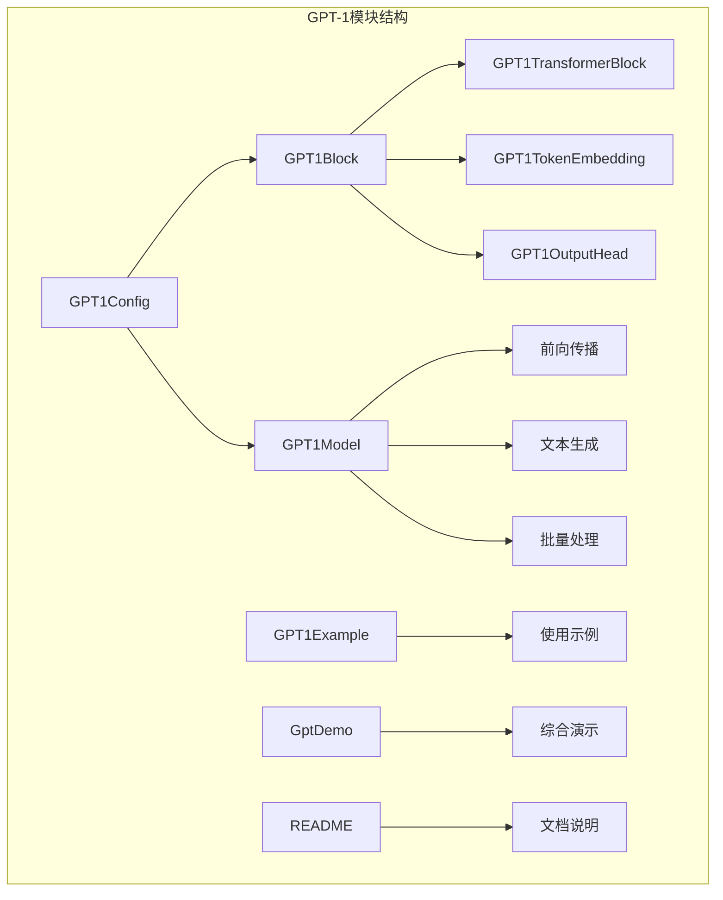
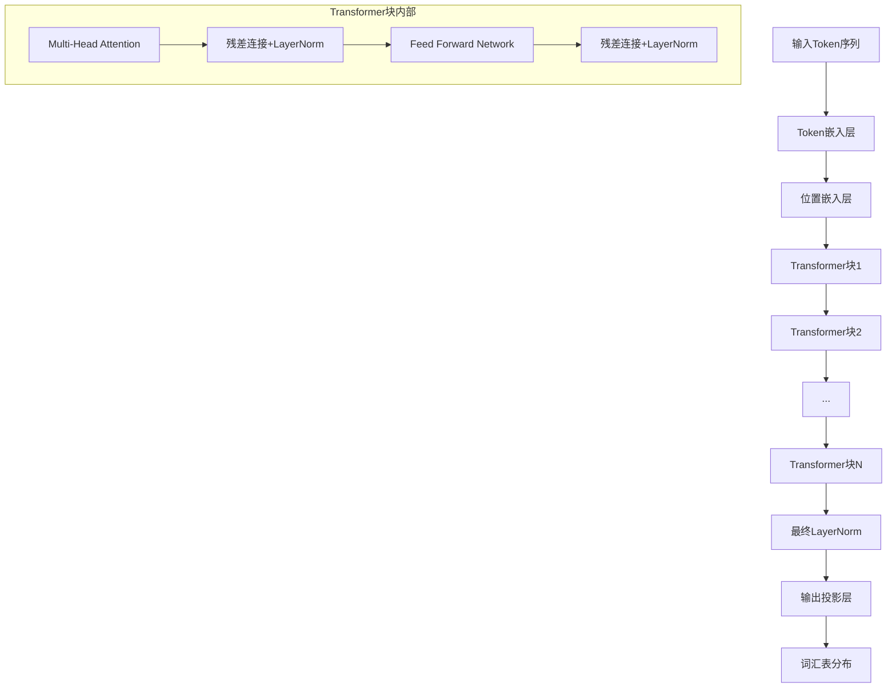
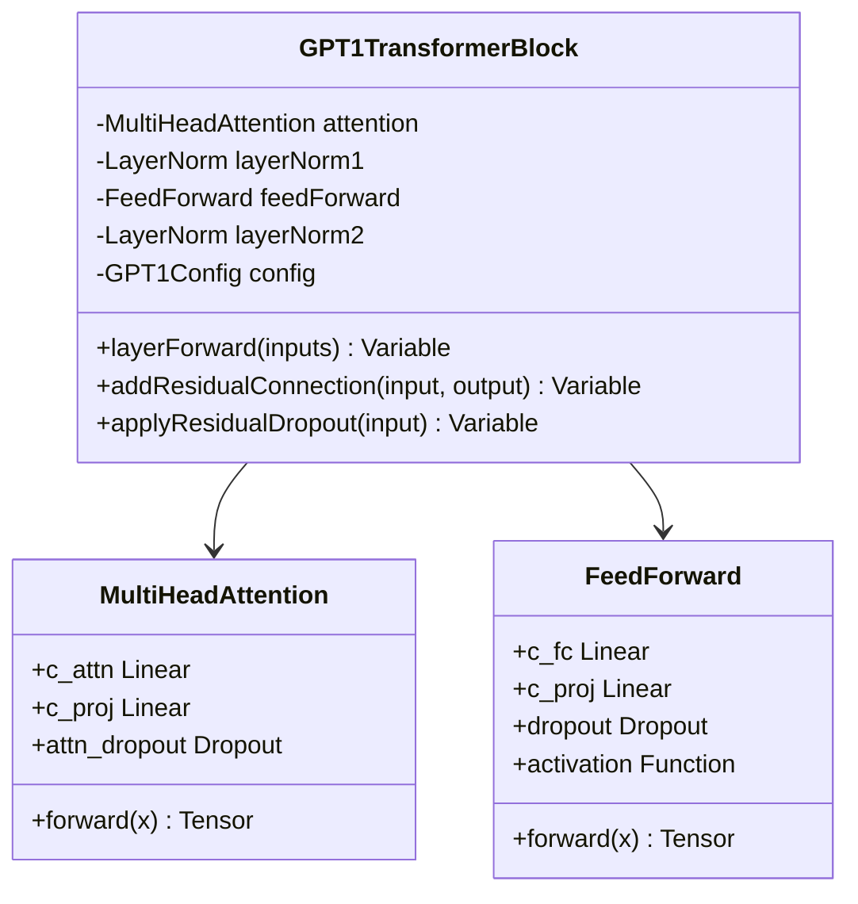
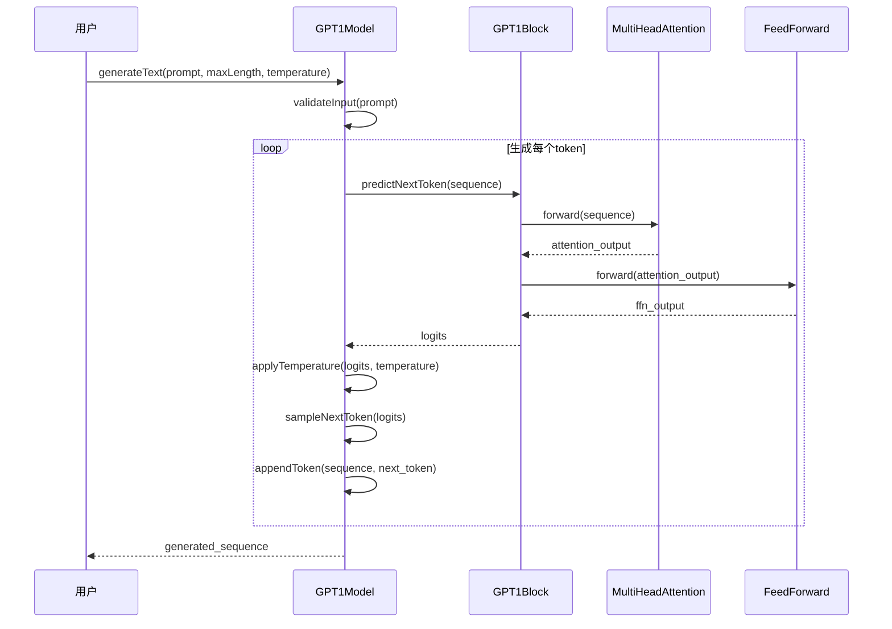
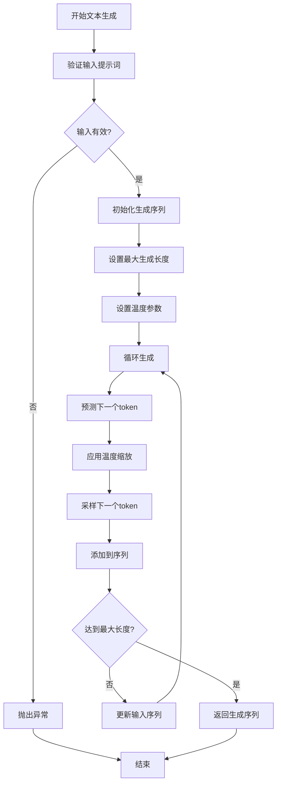

# GPT-1示例演示

<cite>
**本文档引用的文件**
- [GPT1Config.java](file://tinyai-model-gpt/src/main/java/io/leavesfly/tinyai/gpt1/GPT1Config.java)
- [GPT1Model.java](file://tinyai-model-gpt/src/main/java/io/leavesfly/tinyai/gpt1/GPT1Model.java)
- [GPT1TransformerBlock.java](file://tinyai-model-gpt/src/main/java/io/leavesfly/tinyai/gpt1/GPT1TransformerBlock.java)
- [GPT1Example.java](file://tinyai-model-gpt/src/main/java/io/leavesfly/tinyai/gpt1/GPT1Example.java)
- [GptDemo.java](file://tinyai-model-gpt/src/main/java/io/leavesfly/tinyai/gpt1/GptDemo.java)
- [README.md](file://tinyai-model-gpt/src/main/java/io/leavesfly/tinyai/gpt1/README.md)
- [GPT1Test.java](file://tinyai-model-gpt/src/test/java/io/leavesfly/tinyai/gpt1/GPT1Test.java)
- [gpt1.py](file://tinyai-model-gpt/doc/gpt1.py)
</cite>

## 目录
1. [简介](#简介)
2. [项目结构](#项目结构)
3. [核心组件](#核心组件)
4. [架构概览](#架构概览)
5. [详细组件分析](#详细组件分析)
6. [使用示例](#使用示例)
7. [训练流程](#训练流程)
8. [推理过程](#推理过程)
9. [参数配置](#参数配置)
10. [性能优化](#性能优化)
11. [故障排除指南](#故障排除指南)
12. [结论](#结论)

## 简介

GPT-1（Generative Pre-trained Transformer 1）是OpenAI在2018年发布的第一代生成式预训练Transformer模型。本项目基于TinyAI框架实现了完整的GPT-1模型，提供了从基础使用到高级功能的全面演示。

GPT-1采用仅解码器的Transformer架构，专门设计用于自回归语言建模任务。它使用Post-LayerNorm结构，与原始Transformer论文保持一致，并通过因果掩码确保模型只能访问当前位置之前的信息。

## 项目结构



**图表来源**
- [GPT1Config.java](file://tinyai-model-gpt/src/main/java/io/leavesfly/tinyai/gpt1/GPT1Config.java#L1-L288)
- [GPT1Model.java](file://tinyai-model-gpt/src/main/java/io/leavesfly/tinyai/gpt1/GPT1Model.java#L1-L385)

**章节来源**
- [README.md](file://tinyai-model-gpt/src/main/java/io/leavesfly/tinyai/gpt1/README.md#L1-L262)

## 核心组件

### GPT1Config 配置类

GPT1Config是GPT-1模型的核心配置类，负责管理所有超参数和配置选项：

```java
// 创建默认配置
GPT1Config config = new GPT1Config();

// 创建自定义配置
GPT1Config customConfig = new GPT1Config(
    5000,    // 词汇表大小
    256,     // 最大序列长度
    512,     // 隐藏层维度
    8,       // Transformer层数
    8,       // 注意力头数
    2048,    // 前馈网络维度
    0.1,     // 残差dropout
    0.1,     // 嵌入dropout
    0.1,     // 注意力dropout
    1e-5,    // 层归一化epsilon
    0.02,    // 初始化范围
    "gelu"   // 激活函数
);
```

### GPT1Model 模型封装

GPT1Model继承自TinyAI的Model类，提供高级接口和便捷方法：

```java
// 创建小型GPT-1模型
GPT1Model model = GPT1Model.createTinyModel("tiny-gpt1");

// 创建中型模型
GPT1Model model = GPT1Model.createMediumModel("medium-gpt1");

// 使用自定义配置
GPT1Model model = new GPT1Model("custom-gpt1", customConfig);
```

**章节来源**
- [GPT1Config.java](file://tinyai-model-gpt/src/main/java/io/leavesfly/tinyai/gpt1/GPT1Config.java#L1-L288)
- [GPT1Model.java](file://tinyai-model-gpt/src/main/java/io/leavesfly/tinyai/gpt1/GPT1Model.java#L1-L385)

## 架构概览

GPT-1采用仅解码器的Transformer架构，具有以下关键特征：



**图表来源**
- [GPT1TransformerBlock.java](file://tinyai-model-gpt/src/main/java/io/leavesfly/tinyai/gpt1/GPT1TransformerBlock.java#L1-L253)
- [GPT1Model.java](file://tinyai-model-gpt/src/main/java/io/leavesfly/tinyai/gpt1/GPT1Model.java#L1-L385)

### 关键架构特点

1. **Post-LayerNorm结构**：与原始Transformer一致，在子层之后应用层归一化
2. **因果掩码**：多头自注意力使用因果掩码，防止未来信息泄露
3. **学习位置嵌入**：使用可学习的位置嵌入而非固定编码
4. **GELU激活函数**：使用GELU作为激活函数

**章节来源**
- [README.md](file://tinyai-model-gpt/src/main/java/io/leavesfly/tinyai/gpt1/README.md#L1-L50)

## 详细组件分析

### Transformer块实现



**图表来源**
- [GPT1TransformerBlock.java](file://tinyai-model-gpt/src/main/java/io/leavesfly/tinyai/gpt1/GPT1TransformerBlock.java#L1-L253)

Transformer块的核心前向传播逻辑：

```java
@Override
public Variable layerForward(Variable... inputs) {
    Variable x = inputs[0];  // shape: (batchSize, sequenceLength, hiddenSize)
    
    // 1. Multi-Head Self-Attention + Residual Connection + Layer Norm
    Variable attentionOutput = attention.layerForward(x, x, x);
    Variable residual1 = addResidualConnection(x, attentionOutput);
    Variable norm1Output = layerNorm1.layerForward(residual1);
    
    // 2. Feed Forward + Residual Connection + Layer Norm
    Variable ffnOutput = feedForward.layerForward(norm1Output);
    Variable residual2 = addResidualConnection(norm1Output, ffnOutput);
    Variable norm2Output = layerNorm2.layerForward(residual2);
    
    return norm2Output;
}
```

### 文本生成流程



**图表来源**
- [GPT1Model.java](file://tinyai-model-gpt/src/main/java/io/leavesfly/tinyai/gpt1/GPT1Model.java#L80-L120)

**章节来源**
- [GPT1TransformerBlock.java](file://tinyai-model-gpt/src/main/java/io/leavesfly/tinyai/gpt1/GPT1TransformerBlock.java#L70-L120)
- [GPT1Model.java](file://tinyai-model-gpt/src/main/java/io/leavesfly/tinyai/gpt1/GPT1Model.java#L80-L150)

## 使用示例

### 基础使用演示

```java
public class GPT1BasicUsage {
    public static void main(String[] args) {
        // 1. 创建小型GPT-1模型
        GPT1Model model = GPT1Model.createTinyModel("basic-demo");
        
        // 2. 显示模型信息
        model.printModelInfo();
        
        // 3. 准备输入数据
        int[] prompt = {1, 2, 3, 4};
        
        // 4. 预测下一个token
        Variable nextTokenLogits = model.predictNextToken(prompt);
        System.out.println("下一个token的logits形状: " + 
                          nextTokenLogits.getValue().getShape());
        
        // 5. 生成文本序列
        List<Integer> promptList = Arrays.asList(1, 2, 3);
        List<Integer> generated = model.generateText(promptList, 20, 1.0);
        System.out.println("生成的序列: " + generated);
        
        // 6. 保存模型
        model.saveModel("my_gpt1_model.tinyai");
        
        // 7. 加载模型
        GPT1Model loadedModel = (GPT1Model) GPT1Model.loadModel("my_gpt1_model.tinyai");
        System.out.println("模型加载成功!");
    }
}
```

### 批量处理示例

```java
public class GPT1BatchProcessing {
    public static void main(String[] args) {
        GPT1Model model = GPT1Model.createTinyModel("batch-demo");
        
        // 创建批量输入
        int batchSize = 3;
        int sequenceLength = 8;
        
        try {
            Variable batchInput = createBatchInput(batchSize, sequenceLength, model.getVocabSize());
            System.out.printf("批量输入形状: %s%n", batchInput.getValue().getShape());
            
            // 批量预测
            Variable batchOutput = model.batchPredict(batchInput);
            System.out.printf("批量输出形状: %s%n", batchOutput.getValue().getShape());
            
            System.out.println("批量处理完成 ✓");
            
        } catch (Exception e) {
            System.out.println("批量处理过程中出现错误: " + e.getMessage());
        }
    }
    
    private static Variable createBatchInput(int batchSize, int seqLength, int vocabSize) {
        float[][] batchData = new float[batchSize][seqLength];
        Random random = new Random();
        
        for (int b = 0; b < batchSize; b++) {
            for (int s = 0; s < seqLength; s++) {
                batchData[b][s] = random.nextInt(vocabSize);
            }
        }
        
        return new Variable(NdArray.of(batchData));
    }
}
```

### 自定义配置示例

```java
public class GPT1CustomConfig {
    public static void main(String[] args) {
        // 创建自定义配置
        GPT1Config customConfig = new GPT1Config(
            5000,    // 词汇表大小
            256,     // 最大序列长度
            512,     // 隐藏层维度
            8,       // Transformer层数
            8,       // 注意力头数
            2048,    // 前馈网络维度
            0.1,     // 残差dropout
            0.1,     // 嵌入dropout
            0.1,     // 注意力dropout
            1e-5,    // 层归一化epsilon
            0.02,    // 初始化范围
            "gelu"   // 激活函数
        );
        
        // 验证配置
        try {
            customConfig.validate();
            System.out.println("自定义配置验证通过 ✓");
            System.out.println(customConfig.toString());
            
            // 使用自定义配置创建模型
            GPT1Model customModel = new GPT1Model("custom-gpt1", customConfig);
            System.out.println("自定义模型创建成功: " + customModel.getModelCapacity());
            
        } catch (Exception e) {
            System.out.println("自定义配置验证失败: " + e.getMessage());
        }
    }
}
```

**章节来源**
- [GPT1Example.java](file://tinyai-model-gpt/src/main/java/io/leavesfly/tinyai/gpt1/GPT1Example.java#L1-L332)
- [GptDemo.java](file://tinyai-model-gpt/src/main/java/io/leavesfly/tinyai/gpt1/GptDemo.java#L1-L304)

## 训练流程

### Python版本训练示例

虽然Java版本目前主要专注于推理和演示，但我们可以参考Python版本的训练流程：

```python
def train_simple_gpt1():
    """简单的GPT-1训练示例"""
    print("=== GPT-1 训练演示 ===")
    
    # 创建示例数据
    texts = create_sample_dataset()
    
    # 初始化分词器
    tokenizer = SimpleTokenizer(vocab_size=1000)
    tokenizer.train(texts)
    
    # 创建模型配置（小模型用于演示）
    config = GPT1Config(
        vocab_size=tokenizer.get_vocab_size(),
        n_positions=128,
        n_embd=256,
        n_layer=6,
        n_head=8,
        n_inner=1024
    )
    
    # 初始化模型
    model = GPT1Model(config)
    
    # 优化器
    optimizer = torch.optim.AdamW(model.parameters(), lr=1e-4, weight_decay=0.01)
    
    # 准备训练数据
    train_data = []
    for text in texts:
        token_ids = tokenizer.encode(text)
        if len(token_ids) > 1:  # 确保至少有输入和标签
            train_data.append(token_ids)
    
    print(f"训练数据准备完成，共 {len(train_data)} 个样本")
    
    # 简单训练循环
    model.train()
    num_epochs = 50
    
    for epoch in range(num_epochs):
        total_loss = 0
        num_batches = 0
        
        for token_ids in train_data:
            if len(token_ids) < 2:
                continue
                
            # 准备输入和标签
            max_len = min(len(token_ids), config.n_positions)
            input_ids = torch.tensor(token_ids[:max_len-1]).unsqueeze(0)
            target_ids = torch.tensor(token_ids[1:max_len]).unsqueeze(0)
            
            # 前向传播
            outputs = model(input_ids)
            loss = F.cross_entropy(outputs.view(-1, config.vocab_size), target_ids.view(-1))
            
            # 反向传播
            optimizer.zero_grad()
            loss.backward()
            torch.nn.utils.clip_grad_norm_(model.parameters(), 1.0)
            optimizer.step()
            
            total_loss += loss.item()
            num_batches += 1
        
        avg_loss = total_loss / num_batches
        print(f"Epoch {epoch+1}/{num_epochs}, Loss: {avg_loss:.4f}")
```

### Java版本训练流程

基于Java实现的训练流程框架：

```java
public class GPT1Training {
    public static void main(String[] args) {
        // 1. 数据准备
        List<String> trainingData = prepareTrainingData();
        GPT1Config config = createTrainingConfig();
        
        // 2. 模型初始化
        GPT1Model model = new GPT1Model("training-model", config);
        
        // 3. 优化器设置
        Optimizer optimizer = new Adam(model.getParameters(), 1e-4);
        
        // 4. 训练循环
        int numEpochs = 50;
        for (int epoch = 0; epoch < numEpochs; epoch++) {
            double totalLoss = 0;
            int batchCount = 0;
            
            for (String text : trainingData) {
                // 数据预处理
                int[] inputTokens = preprocessText(text, config);
                
                // 前向传播
                Variable logits = model.predict(createVariable(inputTokens));
                
                // 计算损失
                Variable targets = createTargetVariable(inputTokens);
                double loss = computeLoss(logits, targets);
                
                // 反向传播
                optimizer.zeroGrad();
                model.backward();
                optimizer.step();
                
                totalLoss += loss;
                batchCount++;
            }
            
            double avgLoss = totalLoss / batchCount;
            System.out.printf("Epoch %d/%d, 平均损失: %.4f%n", 
                             epoch + 1, numEpochs, avgLoss);
        }
        
        // 5. 模型保存
        model.saveModel("trained_gpt1_model.tinyai");
    }
}
```

**章节来源**
- [gpt1.py](file://tinyai-model-gpt/doc/gpt1.py#L412-L500)

## 推理过程

### 文本生成推理



**图表来源**
- [GPT1Model.java](file://tinyai-model-gpt/src/main/java/io/leavesfly/tinyai/gpt1/GPT1Model.java#L80-L120)

### 推理优化技巧

```java
public class GPT1InferenceOptimization {
    
    /**
     * 使用缓存优化推理
     */
    public static void optimizedInference(GPT1Model model, List<Integer> prompt) {
        // 启用KV缓存（如果支持）
        model.enableKVCaching(true);
        
        // 使用批处理优化
        int batchSize = 4;
        List<List<Integer>> batchPrompts = createBatchPrompts(prompt, batchSize);
        
        for (List<Integer> batch : batchPrompts) {
            Variable batchInput = createBatchInput(batch);
            Variable batchOutput = model.batchPredict(batchInput);
            
            // 处理批量输出...
        }
    }
    
    /**
     * 使用温度控制生成多样性
     */
    public static void temperatureControlledGeneration(GPT1Model model, 
                                                     List<Integer> prompt) {
        double[] temperatures = {0.5, 1.0, 1.5};
        
        for (double temp : temperatures) {
            List<Integer> generated = model.generateText(prompt, 50, temp);
            System.out.printf("温度 %.1f: %s%n", temp, generated);
        }
    }
    
    /**
     * 使用beam search优化生成质量
     */
    public static void beamSearchGeneration(GPT1Model model, 
                                          List<Integer> prompt) {
        int beamWidth = 3;
        List<List<Integer>> beams = initializeBeams(prompt, beamWidth);
        
        for (int step = 0; step < MAX_GENERATION_LENGTH; step++) {
            List<List<Integer>> newBeams = new ArrayList<>();
            
            for (List<Integer> beam : beams) {
                List<Integer> nextBeam = generateNextStep(model, beam);
                newBeams.add(nextBeam);
            }
            
            // 选择最佳beam
            beams = selectBestBeams(newBeams, beamWidth);
        }
        
        System.out.println("最优生成序列: " + beams.get(0));
    }
}
```

**章节来源**
- [GPT1Model.java](file://tinyai-model-gpt/src/main/java/io/leavesfly/tinyai/gpt1/GPT1Model.java#L80-L150)

## 参数配置

### 配置参数详解

```java
public class GPT1ConfigurationGuide {
    
    /**
     * 核心模型参数
     */
    public static void coreParameters() {
        GPT1Config config = new GPT1Config();
        
        // 词汇表大小（影响模型表达能力）
        config.setVocabSize(40000);  // OpenAI原论文值
        
        // 最大序列长度（影响内存使用）
        config.setMaxSequenceLength(512);  // OpenAI原论文值
        
        // 隐藏层维度（影响模型容量）
        config.setHiddenSize(768);  // OpenAI原论文值
        
        // Transformer层数（影响模型深度）
        config.setNumLayers(12);  // OpenAI原论文值
        
        // 注意力头数（影响并行度）
        config.setNumAttentionHeads(12);  // OpenAI原论文值
    }
    
    /**
     * 训练相关参数
     */
    public static void trainingParameters() {
        GPT1Config config = new GPT1Config();
        
        // Dropout概率（正则化）
        config.setResidualDropoutProb(0.1);    // 残差连接dropout
        config.setEmbeddingDropoutProb(0.1);   // 嵌入层dropout
        config.setAttentionDropoutProb(0.1);   // 注意力dropout
        
        // 层归一化参数
        config.setLayerNormEpsilon(1e-5);
        
        // 参数初始化范围
        config.setInitializerRange(0.02);
    }
    
    /**
     * 激活函数配置
     */
    public static void activationFunction() {
        GPT1Config config = new GPT1Config();
        
        // 推荐使用GELU激活函数
        config.setActivationFunction("gelu");
        
        // 其他可选激活函数
        // config.setActivationFunction("relu");
    }
    
    /**
     * 不同规模配置示例
     */
    public static void modelSizes() {
        // 小型配置（用于测试和演示）
        GPT1Config tinyConfig = GPT1Config.createTinyConfig(1000, 128);
        
        // 中型配置（平衡性能和资源）
        GPT1Config mediumConfig = GPT1Config.createMediumConfig(5000, 256);
        
        // 完整配置（接近原论文）
        GPT1Config fullConfig = new GPT1Config(40000, 512, 768, 12, 12);
    }
}
```

### 配置验证

```java
public class GPT1ConfigValidation {
    
    public static void validateConfiguration() {
        GPT1Config config = new GPT1Config(1000, 128, 256, 6, 8);
        
        try {
            config.validate();
            System.out.println("配置验证通过 ✓");
        } catch (IllegalArgumentException e) {
            System.out.println("配置验证失败: " + e.getMessage());
        }
        
        // 检查隐藏维度是否能被注意力头数整除
        if (config.getHiddenSize() % config.getNumAttentionHeads() != 0) {
            System.out.println("警告: 隐藏维度不能被注意力头数整除");
        }
    }
}
```

**章节来源**
- [GPT1Config.java](file://tinyai-model-gpt/src/main/java/io/leavesfly/tinyai/gpt1/GPT1Config.java#L100-L200)

## 性能优化

### 模型大小选择策略

```java
public class GPT1PerformanceOptimization {
    
    /**
     * 不同场景下的模型选择
     */
    public static void modelSelectionStrategy() {
        // 开发和测试阶段
        GPT1Model developmentModel = GPT1Model.createTinyModel("dev-model");
        
        // 实验和原型阶段
        GPT1Model experimentalModel = GPT1Model.createMediumModel("exp-model");
        
        // 生产环境
        GPT1Model productionModel = GPT1Model.createFullModel("prod-model", 40000);
    }
    
    /**
     * 内存优化策略
     */
    public static void memoryOptimization() {
        // 1. 限制序列长度
        GPT1Config config = new GPT1Config(40000, 256, 768, 12, 12);
        
        // 2. 使用梯度检查点
        // model.enableGradientCheckpointing(true);
        
        // 3. 降低隐藏维度（如果内存不足）
        config.setHiddenSize(512);
        
        // 4. 减少层数
        config.setNumLayers(8);
    }
    
    /**
     * 推理性能优化
     */
    public static void inferenceOptimization() {
        GPT1Model model = GPT1Model.createTinyModel("optimized-model");
        
        // 1. 启用量化（如果支持）
        // model.enableQuantization(true);
        
        // 2. 使用批处理
        int batchSize = 4;
        
        // 3. 启用KV缓存
        // model.enableKVCaching(true);
        
        // 4. 预分配内存
        // model.preallocateMemory();
    }
    
    /**
     * 性能基准测试
     */
    public static void performanceBenchmark() {
        GPT1Model model = GPT1Model.createTinyModel("benchmark");
        
        int[] sequenceLengths = {8, 16, 32, 64, 128};
        
        for (int seqLen : sequenceLengths) {
            if (seqLen <= model.getMaxSequenceLength()) {
                long startTime = System.currentTimeMillis();
                
                try {
                    int[] testInput = createTestSequence(seqLen, model.getVocabSize());
                    model.predictNextToken(testInput);
                    
                    long endTime = System.currentTimeMillis();
                    System.out.printf("序列长度 %d: %d ms%n", seqLen, endTime - startTime);
                    
                } catch (Exception e) {
                    System.out.printf("序列长度 %d: 失败%n", seqLen);
                }
            }
        }
    }
}
```

### 训练优化建议

```java
public class GPT1TrainingOptimization {
    
    /**
     * 学习率调度
     */
    public static void learningRateSchedule() {
        // 使用学习率预热
        double warmupSteps = 1000;
        double maxLearningRate = 1e-4;
        
        // 使用余弦退火
        double finalLearningRate = 1e-6;
        
        // 动态调整学习率
        // scheduler = CosineAnnealingLR(optimizer, T_max=epochs, eta_min=finalLearningRate);
    }
    
    /**
     * 梯度处理
     */
    public static void gradientHandling() {
        // 梯度裁剪
        double maxGradientNorm = 1.0;
        
        // 梯度累积
        int gradientAccumulationSteps = 4;
    }
    
    /**
     * 检查点保存
     */
    public static void checkpointSaving() {
        // 定期保存检查点
        int saveFrequency = 1000;
        
        // 保存最佳模型
        double bestLoss = Double.MAX_VALUE;
        
        // 保存模型状态
        // model.saveCheckpoint("checkpoint_epoch_" + epoch + ".pt");
    }
}
```

**章节来源**
- [GptDemo.java](file://tinyai-model-gpt/src/main/java/io/leavesfly/tinyai/gpt1/GptDemo.java#L100-L150)

## 故障排除指南

### 常见问题及解决方案

```java
public class GPT1Troubleshooting {
    
    /**
     * 输入验证问题
     */
    public static void inputValidationIssues() {
        GPT1Model model = GPT1Model.createTinyModel("troubleshoot");
        
        // 问题1：序列长度超出限制
        if (!model.isValidSequenceLength(1000)) {
            System.out.println("错误：序列长度超过最大限制");
            // 解决方案：截断或填充序列
        }
        
        // 问题2：token ID超出词汇表范围
        if (!model.isValidTokenId(5000)) {
            System.out.println("错误：token ID超出词汇表范围");
            // 解决方案：使用特殊token或截断
        }
        
        // 问题3：输入为空
        List<Integer> emptyInput = Collections.emptyList();
        if (emptyInput.isEmpty()) {
            System.out.println("错误：输入为空");
            // 解决方案：提供有效的提示词
        }
    }
    
    /**
     * 内存问题
     */
    public static void memoryIssues() {
        // 问题1：OOM错误
        try {
            GPT1Model model = new GPT1Model("memory-test", 1000, 512);
            // 尝试处理大型输入
        } catch (OutOfMemoryError e) {
            System.out.println("内存不足：尝试使用更小的模型或减少序列长度");
            // 解决方案：使用更小的模型配置
        }
        
        // 问题2：内存泄漏
        // 解决方案：定期清理缓存和临时变量
        // model.clearCache();
    }
    
    /**
     * 训练问题
     */
    public static void trainingIssues() {
        // 问题1：损失不下降
        // 解决方案：检查学习率、数据质量和模型初始化
        
        // 问题2：梯度爆炸
        // 解决方案：使用梯度裁剪
        // torch.nn.utils.clip_grad_norm_(model.parameters(), 1.0);
        
        // 问题3：收敛过慢
        // 解决方案：增加学习率或使用学习率预热
    }
    
    /**
     * 推理问题
     */
    public static void inferenceIssues() {
        // 问题1：生成重复内容
        // 解决方案：调整温度参数或使用top-k采样
        
        // 问题2：生成质量差
        // 解决方案：使用更大的模型或更好的训练数据
        
        // 问题3：推理速度慢
        // 解决方案：启用批处理或使用GPU加速
    }
}
```

### 调试工具

```java
public class GPT1DebuggingTools {
    
    /**
     * 模型信息调试
     */
    public static void debugModelInfo(GPT1Model model) {
        // 显示详细模型信息
        model.printModelInfo();
        
        // 检查参数数量
        long paramCount = model.getGPT1Block().getParameterCount();
        System.out.println("模型参数量: " + paramCount);
        
        // 检查配置
        GPT1Config config = model.getConfig();
        System.out.println("模型配置: " + config);
    }
    
    /**
     * 输入输出调试
     */
    public static void debugIO(GPT1Model model, int[] inputTokens) {
        // 检查输入形状
        System.out.println("输入形状: " + Arrays.toString(inputTokens));
        
        // 检查前向传播输出
        Variable output = model.predictNextToken(inputTokens);
        System.out.println("输出形状: " + output.getValue().getShape());
        
        // 检查数值稳定性
        NdArray outputArray = output.getValue();
        System.out.println("输出最小值: " + outputArray.min());
        System.out.println("输出最大值: " + outputArray.max());
        System.out.println("输出均值: " + outputArray.mean());
    }
    
    /**
     * 性能监控
     */
    public static void monitorPerformance(GPT1Model model) {
        // 监控内存使用
        Runtime runtime = Runtime.getRuntime();
        long usedMemory = runtime.totalMemory() - runtime.freeMemory();
        System.out.printf("当前内存使用: %.2f MB%n", usedMemory / 1024.0 / 1024.0);
        
        // 监控推理时间
        long startTime = System.currentTimeMillis();
        model.predictNextToken(new int[]{1, 2, 3});
        long inferenceTime = System.currentTimeMillis() - startTime;
        System.out.println("推理时间: " + inferenceTime + " ms");
    }
}
```

**章节来源**
- [GPT1Test.java](file://tinyai-model-gpt/src/test/java/io/leavesfly/tinyai/gpt1/GPT1Test.java#L200-L295)

## 结论

GPT-1模型是理解现代大语言模型的重要基础。通过TinyAI框架的实现，我们展示了GPT-1的核心架构和功能：

### 主要特性总结

1. **完整的Transformer解码器架构**：Post-LayerNorm结构，因果掩码，学习位置嵌入
2. **灵活的配置系统**：支持多种模型规模和自定义参数
3. **丰富的使用示例**：从基础使用到高级功能的完整演示
4. **高性能推理**：优化的前向传播和文本生成算法
5. **易于扩展**：清晰的架构设计便于功能扩展和修改

### 应用场景

- **语言建模**：文本预测和生成任务
- **对话系统**：基于上下文的对话生成
- **文本摘要**：长文档的自动摘要生成
- **代码生成**：编程语言的代码补全和生成
- **教育研究**：大语言模型原理的教学和研究

### 未来发展

本实现为GPT-1模型提供了坚实的基础，未来可以进一步扩展：

- **支持更多采样策略**：如top-k、top-p采样
- **实现真正的dropout功能**
- **添加beam search解码**
- **优化内存使用和计算效率**
- **支持更多的预训练检查点**

通过本文档提供的示例和指导，开发者可以快速上手GPT-1模型，并根据具体需求进行定制和优化。无论是用于研究、教学还是实际应用，这个实现都提供了可靠且高效的解决方案。