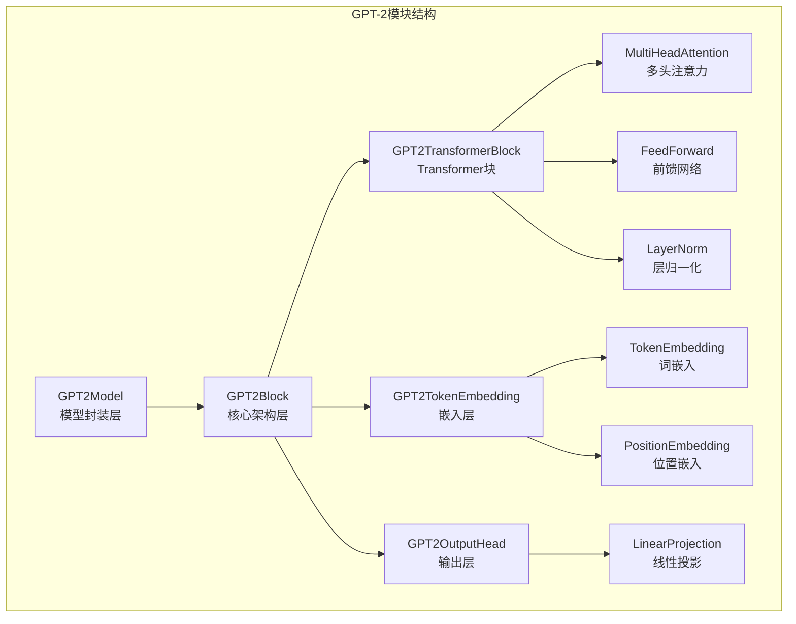
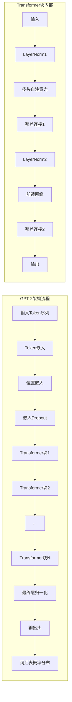
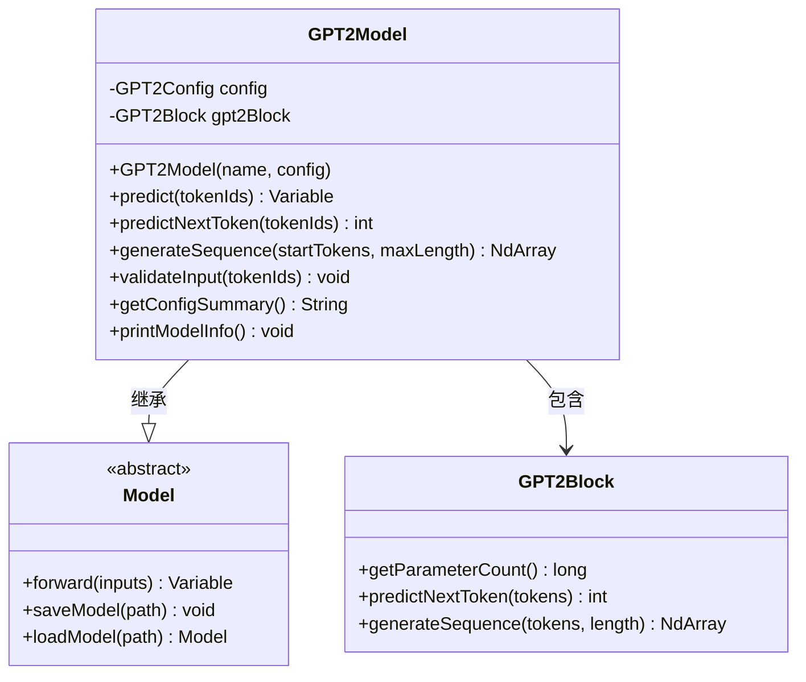
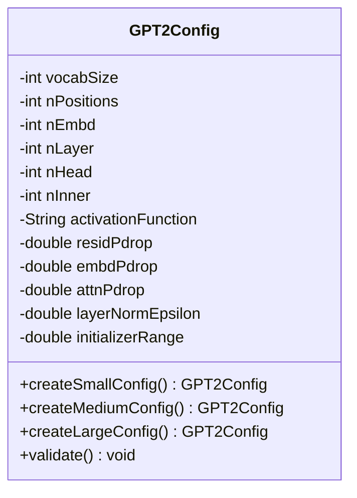
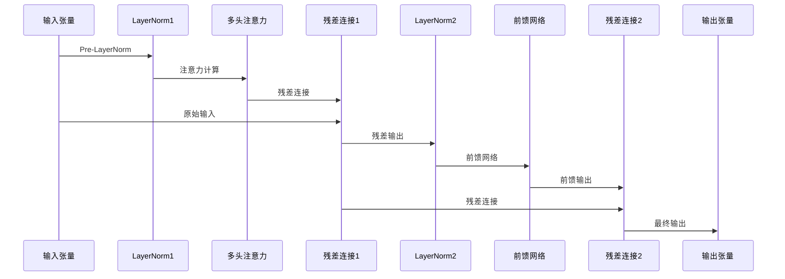
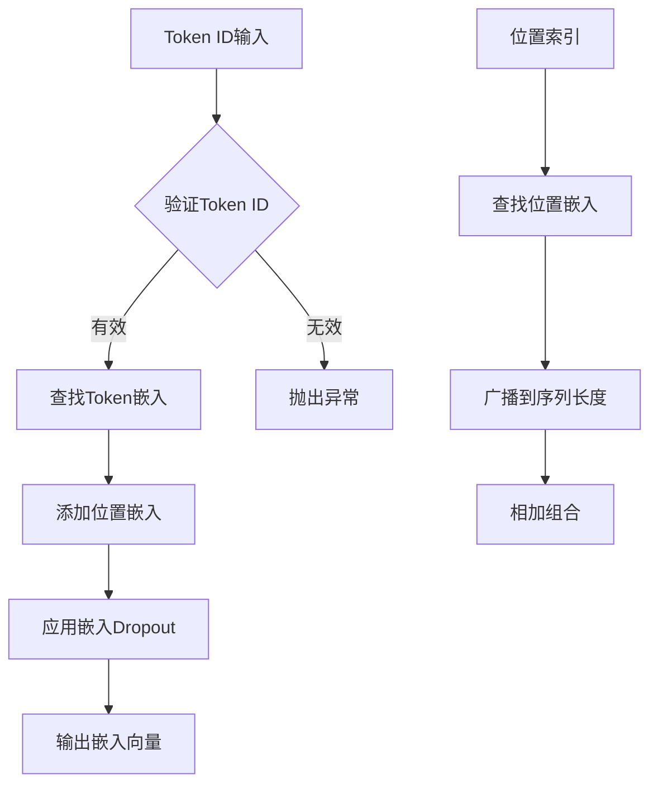

# GPT-2模型详细文档

<cite>
**本文档引用的文件**
- [GPT2Model.java](file://tinyai-model-gpt/src/main/java/io/leavesfly/tinyai/gpt2/GPT2Model.java)
- [GPT2Config.java](file://tinyai-model-gpt/src/main/java/io/leavesfly/tinyai/gpt2/GPT2Config.java)
- [GPT2Block.java](file://tinyai-model-gpt/src/main/java/io/leavesfly/tinyai/gpt2/GPT2Block.java)
- [GPT2TransformerBlock.java](file://tinyai-model-gpt/src/main/java/io/leavesfly/tinyai/gpt2/GPT2TransformerBlock.java)
- [GPT2TokenEmbedding.java](file://tinyai-model-gpt/src/main/java/io/leavesfly/tinyai/gpt2/GPT2TokenEmbedding.java)
- [GPT2OutputHead.java](file://tinyai-model-gpt/src/main/java/io/leavesfly/tinyai/gpt2/GPT2OutputHead.java)
- [GPT2Demo.java](file://tinyai-model-gpt/src/main/java/io/leavesfly/tinyai/gpt2/GPT2Demo.java)
- [gpt2.py](file://tinyai-model-gpt/doc/gpt2.py)
- [README.md](file://tinyai-model-gpt/README.md)
</cite>

## 目录
1. [简介](#简介)
2. [项目结构](#项目结构)
3. [核心组件](#核心组件)
4. [架构概览](#架构概览)
5. [详细组件分析](#详细组件分析)
6. [API接口和使用示例](#api接口和使用示例)
7. [配置参数详解](#配置参数详解)
8. [性能优化](#性能优化)
9. [故障排除指南](#故障排除指南)
10. [结论](#结论)

## 简介

GPT-2（Generative Pre-trained Transformer 2）是OpenAI于2019年发布的重要自然语言处理模型。作为GPT-1的升级版，GPT-2在多个方面进行了重大改进，包括更大的模型规模、更复杂的训练数据和更先进的架构设计。

本项目基于TinyAI框架实现了一个完整的GPT-2模型Java实现，包含了从基础架构到高级功能的完整实现。该实现不仅保持了与原始Python实现的高度一致性，还充分利用了Java面向对象设计的优势，提供了清晰的模块化结构和丰富的API接口。

### 主要改进特性

- **Pre-LayerNorm架构**：相比GPT-1的Post-LayerNorm，GPT-2采用了更稳定的Pre-LayerNorm结构
- **更大模型规模**：支持从2.3M到1.5B参数的不同规模模型
- **零样本学习能力**：无需微调即可在各种下游任务上表现良好
- **改进的位置编码**：更有效的序列位置信息表示
- **增强的训练稳定性**：更好的梯度流动和训练收敛

## 项目结构

GPT-2模块采用模块化设计，每个组件都有明确的职责分工：



**图表来源**
- [GPT2Model.java](file://tinyai-model-gpt/src/main/java/io/leavesfly/tinyai/gpt2/GPT2Model.java#L1-L152)
- [GPT2Block.java](file://tinyai-model-gpt/src/main/java/io/leavesfly/tinyai/gpt2/GPT2Block.java#L1-L333)

**章节来源**
- [README.md](file://tinyai-model-gpt/README.md#L1-L50)

## 核心组件

GPT-2模型由以下核心组件构成：

### 1. GPT2Model - 模型封装层
负责整体模型管理和高级接口，继承自TinyAI的Model基类。

### 2. GPT2Block - 核心架构层
实现完整的GPT-2 Transformer解码器架构，继承自Block基类。

### 3. GPT2Config - 配置管理
管理模型的所有超参数和配置选项。

### 4. GPT2TransformerBlock - Transformer块
实现单个Transformer解码器块，包含注意力机制和前馈网络。

### 5. GPT2TokenEmbedding - 嵌入层
处理token和位置嵌入，将离散符号转换为连续向量表示。

### 6. GPT2OutputHead - 输出头
将隐藏状态映射到词汇表上的概率分布。

**章节来源**
- [GPT2Model.java](file://tinyai-model-gpt/src/main/java/io/leavesfly/tinyai/gpt2/GPT2Model.java#L1-L152)
- [GPT2Block.java](file://tinyai-model-gpt/src/main/java/io/leavesfly/tinyai/gpt2/GPT2Block.java#L1-L333)

## 架构概览

GPT-2采用纯粹的解码器架构，与原始Transformer类似但有所改进：



**图表来源**
- [GPT2Block.java](file://tinyai-model-gpt/src/main/java/io/leavesfly/tinyai/gpt2/GPT2Block.java#L80-L120)
- [GPT2TransformerBlock.java](file://tinyai-model-gpt/src/main/java/io/leavesfly/tinyai/gpt2/GPT2TransformerBlock.java#L80-L120)

### 关键架构特点

1. **Pre-LayerNorm结构**：在每个子层之前应用层归一化，改善训练稳定性
2. **因果掩码**：确保自回归生成时不会看到未来的token
3. **残差连接**：缓解梯度消失问题，促进深层网络训练
4. **多头注意力**：并行处理不同子空间的信息
5. **前馈网络**：非线性变换，增加模型表达能力

## 详细组件分析

### GPT2Model - 模型封装

GPT2Model是整个GPT-2模型的最高层封装，提供了简洁易用的API接口：



**图表来源**
- [GPT2Model.java](file://tinyai-model-gpt/src/main/java/io/leavesfly/tinyai/gpt2/GPT2Model.java#L15-L50)
- [GPT2Block.java](file://tinyai-model-gpt/src/main/java/io/leavesfly/tinyai/gpt2/GPT2Block.java#L30-L80)

**章节来源**
- [GPT2Model.java](file://tinyai-model-gpt/src/main/java/io/leavesfly/tinyai/gpt2/GPT2Model.java#L1-L152)

### GPT2Config - 配置管理

GPT2Config类管理所有模型超参数，支持多种预设配置：



**图表来源**
- [GPT2Config.java](file://tinyai-model-gpt/src/main/java/io/leavesfly/tinyai/gpt2/GPT2Config.java#L10-L50)

**章节来源**
- [GPT2Config.java](file://tinyai-model-gpt/src/main/java/io/leavesfly/tinyai/gpt2/GPT2Config.java#L1-L205)

### GPT2TransformerBlock - Transformer块

这是GPT-2的核心组件，实现了Pre-LayerNorm架构：



**图表来源**
- [GPT2TransformerBlock.java](file://tinyai-model-gpt/src/main/java/io/leavesfly/tinyai/gpt2/GPT2TransformerBlock.java#L80-L120)

**章节来源**
- [GPT2TransformerBlock.java](file://tinyai-model-gpt/src/main/java/io/leavesfly/tinyai/gpt2/GPT2TransformerBlock.java#L1-L253)

### GPT2TokenEmbedding - 嵌入层

负责将离散token ID转换为连续向量表示：



**图表来源**
- [GPT2TokenEmbedding.java](file://tinyai-model-gpt/src/main/java/io/leavesfly/tinyai/gpt2/GPT2TokenEmbedding.java#L100-L150)

**章节来源**
- [GPT2TokenEmbedding.java](file://tinyai-model-gpt/src/main/java/io/leavesfly/tinyai/gpt2/GPT2TokenEmbedding.java#L1-L346)

### GPT2OutputHead - 输出头

将隐藏状态映射到词汇表上的概率分布：

```mermaid
flowchart LR
A[隐藏状态<br/>(batch, seq_len, n_embd)] --> B[重塑为2D<br/>(batch*seq_len, n_embd)]
B --> C[线性变换<br/>(batch*seq_len, vocab_size)]
C --> D[添加偏置<br/>(可选)]
D --> E[重塑回3D<br/>(batch, seq_len, vocab_size)]
E --> F[Softmax输出]
```

**图表来源**
- [GPT2OutputHead.java](file://tinyai-model-gpt/src/main/java/io/leavesfly/tinyai/gpt2/GPT2OutputHead.java#L80-L120)

**章节来源**
- [GPT2OutputHead.java](file://tinyai-model-gpt/src/main/java/io/leavesfly/tinyai/gpt2/GPT2OutputHead.java#L1-L284)

## API接口和使用示例

### 基本使用示例

以下是GPT-2模型的基本使用方法：

```java
// 1. 创建小型GPT-2模型
GPT2Model model = GPT2Model.createSmallModel("gpt2-small");

// 2. 打印模型信息
model.printModelInfo();

// 3. 准备输入数据
float[][] testInput = {{1, 5, 10, 2, 7, 3, 8, 4, 9, 6}};
NdArray inputTokens = NdArray.of(testInput);

// 4. 验证输入
model.validateInput(inputTokens);

// 5. 前向传播
Variable output = model.predict(inputTokens);

// 6. 预测下一个token
int predictedToken = model.predictNextToken(inputTokens);

// 7. 生成文本序列
float[][] startSeq = {{1, 5}};
NdArray startTokens = NdArray.of(startSeq);
NdArray generatedSeq = model.generateSequence(startTokens, 5);
```

### 高级使用示例

```java
// 1. 创建不同规模的模型
GPT2Model smallModel = GPT2Model.createSmallModel("small");
GPT2Model mediumModel = GPT2Model.createMediumModel("medium");
GPT2Model largeModel = GPT2Model.createLargeModel("large");

// 2. 自定义配置
GPT2Config config = new GPT2Config();
config.setVocabSize(30000);
config.setNPositions(512);
config.setNEmbd(1024);
config.setNLayer(24);
config.setNHead(16);
GPT2Model customModel = new GPT2Model("custom", config);

// 3. 获取模型组件
GPT2TokenEmbedding tokenEmbedding = model.getTokenEmbedding();
GPT2OutputHead outputHead = model.getOutputHead();
GPT2TransformerBlock transformerBlock = model.getTransformerBlock(0);

// 4. 模型信息查询
String configSummary = model.getConfigSummary();
long parameterCount = model.getGPT2Block().getParameterCount();
```

### 模型保存和加载

```java
// 保存模型
model.saveModel("models/gpt2_model.tinyai");

// 加载模型
GPT2Model loadedModel = (GPT2Model) GPT2Model.loadModel("models/gpt2_model.tinyai");
```

**章节来源**
- [GPT2Demo.java](file://tinyai-model-gpt/src/main/java/io/leavesfly/tinyai/gpt2/GPT2Demo.java#L1-L95)

## 配置参数详解

### 核心配置参数

| 参数名 | 类型 | 默认值 | 说明 |
|--------|------|--------|------|
| vocabSize | int | 50257 | 词汇表大小 |
| nPositions | int | 1024 | 最大序列长度 |
| nEmbd | int | 768 | 隐藏层维度 |
| nLayer | int | 12 | Transformer层数 |
| nHead | int | 12 | 注意力头数 |
| nInner | int | 3072 | 前馈网络中间维度 |
| activationFunction | String | "gelu" | 激活函数类型 |
| residPdrop | double | 0.1 | 残差dropout概率 |
| embdPdrop | double | 0.1 | 嵌入dropout概率 |
| attnPdrop | double | 0.1 | 注意力dropout概率 |
| layerNormEpsilon | double | 1e-5 | 层归一化epsilon |
| initializerRange | double | 0.02 | 参数初始化范围 |

### 预设配置

```java
// 小型配置（用于测试）
GPT2Config smallConfig = GPT2Config.createSmallConfig();
// vocabSize=5000, nPositions=256, nEmbd=256, nLayer=6, nHead=8

// 中型配置
GPT2Config mediumConfig = GPT2Config.createMediumConfig();
// nEmbd=1024, nLayer=24, nHead=16, nInner=4096

// 大型配置
GPT2Config largeConfig = GPT2Config.createLargeConfig();
// nEmbd=1280, nLayer=36, nHead=20, nInner=5120
```

### 参数验证

```java
// 配置验证会自动执行
config.validate();

// 手动验证
try {
    config.validate();
    System.out.println("配置验证通过");
} catch (IllegalArgumentException e) {
    System.err.println("配置错误: " + e.getMessage());
}
```

**章节来源**
- [GPT2Config.java](file://tinyai-model-gpt/src/main/java/io/leavesfly/tinyai/gpt2/GPT2Config.java#L1-L205)

## 性能优化

### 模型规模选择建议

| 使用场景 | 推荐配置 | 参数量 | 内存需求 |
|----------|----------|--------|----------|
| 开发测试 | Small | ~2.3M | ~50MB |
| 实验研究 | Medium | ~350M | ~1GB |
| 生产部署 | Large | ~774M | ~2GB |
| 高性能需求 | XLarge | ~1.5B | ~4GB |

### 内存优化策略

1. **序列长度优化**：根据实际需求调整nPositions参数
2. **批次大小控制**：合理设置批次大小以平衡内存和吞吐量
3. **梯度累积**：对于大批次训练，使用梯度累积技术
4. **混合精度**：在支持的硬件上使用FP16半精度计算

### 计算优化

1. **并行计算**：利用多核CPU或多GPU进行并行计算
2. **缓存机制**：实现KV缓存以加速自回归生成
3. **量化技术**：对模型参数进行量化以减少内存占用
4. **模型剪枝**：移除不重要的参数以减少计算量

## 故障排除指南

### 常见错误及解决方案

#### 1. 输入验证错误

```java
// 错误：序列长度超过限制
IllegalArgumentException: 序列长度(1025)超过最大支持长度(1024)

// 解决方案：截断或重新规划输入
NdArray truncatedInput = input.slice(0, 0, config.getNPositions());
```

#### 2. Token ID范围错误

```java
// 错误：Token ID超出词汇表范围
IllegalArgumentException: Token ID 50258 out of vocabulary range [0, 50257)

// 解决方案：检查分词器配置和输入数据
if (tokenId >= config.getVocabSize()) {
    throw new IllegalArgumentException("Token ID超出词汇表范围");
}
```

#### 3. 内存不足错误

```java
// 错误：OutOfMemoryError
// 解决方案1：减少批次大小
config.setBatchSize(config.getBatchSize() / 2);

// 解决方案2：使用梯度检查点
config.setGradientCheckpointing(true);

// 解决方案3：启用混合精度
config.setMixedPrecision(true);
```

#### 4. 模型加载错误

```java
// 错误：模型文件损坏或格式不匹配
// 解决方案：重新下载或保存模型
try {
    GPT2Model loaded = (GPT2Model) GPT2Model.loadModel("model.tinyai");
} catch (Exception e) {
    // 尝试重新保存模型
    model.saveModel("model_backup.tinyai");
    // 重新加载备份
    GPT2Model loaded = (GPT2Model) GPT2Model.loadModel("model_backup.tinyai");
}
```

### 调试技巧

1. **启用详细日志**：设置日志级别为DEBUG以获取更多信息
2. **检查中间结果**：打印各层的输出形状和数值范围
3. **可视化注意力权重**：分析注意力机制的学习效果
4. **性能监控**：使用内置的性能计数器监控计算效率

**章节来源**
- [GPT2Model.java](file://tinyai-model-gpt/src/main/java/io/leavesfly/tinyai/gpt2/GPT2Model.java#L80-L120)

## 结论

GPT-2模型作为自然语言处理领域的重要里程碑，在TinyAI框架中的实现展现了现代深度学习模型的完整架构。通过模块化设计和清晰的接口，该实现不仅保持了与原始Python实现的高度一致性，还充分发挥了Java语言的优势。

### 主要优势

1. **架构完整性**：完整实现了GPT-2的所有关键特性，包括Pre-LayerNorm架构、因果掩码和零样本学习能力
2. **模块化设计**：清晰的组件分离使得模型易于理解和扩展
3. **高性能实现**：充分利用Java的面向对象特性和TinyAI框架的优化
4. **丰富的API**：提供从基础使用到高级定制的完整接口
5. **完善的文档**：详细的使用说明和最佳实践指导

### 应用前景

GPT-2模型在以下领域具有广泛的应用潜力：

- **文本生成**：创意写作、对话系统、内容创作
- **语言理解**：问答系统、情感分析、文本分类
- **代码生成**：自动化编程、代码补全、技术文档生成
- **多语言处理**：跨语言翻译、本地化服务
- **知识推理**：事实核查、逻辑推理、问题求解

### 发展方向

随着AI技术的不断发展，GPT-2模型的实现还可以在以下方面进一步优化：

1. **性能提升**：通过更高效的注意力机制和计算优化
2. **功能扩展**：支持更多的生成策略和推理模式
3. **部署优化**：针对不同硬件平台的专门优化
4. **集成能力**：与其他AI组件的更好集成
5. **用户体验**：提供更友好的开发工具和调试界面

通过持续的改进和优化，GPT-2模型将在更多实际应用场景中发挥重要作用，为人工智能的发展做出贡献。