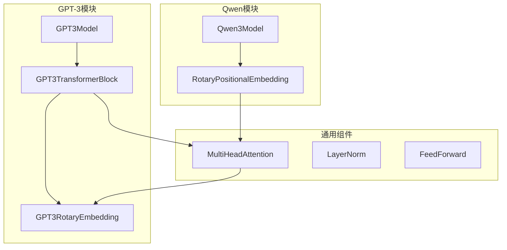
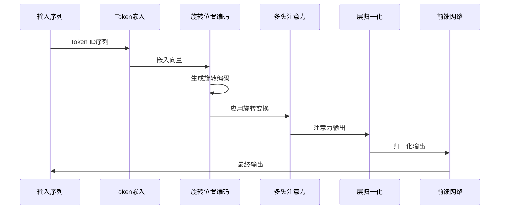
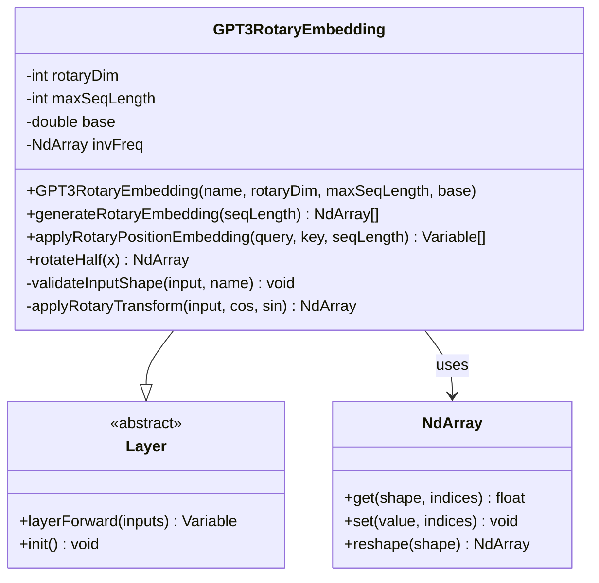
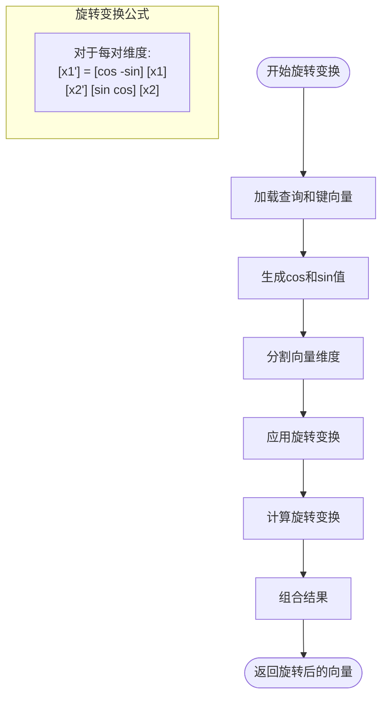
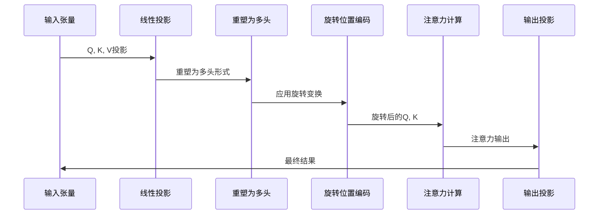

# GPT-3旋转位置编码（RoPE）详细文档

<cite>
**本文档引用的文件**
- [GPT3RotaryEmbedding.java](file://tinyai-model-gpt/src/main/java/io/leavesfly/tinyai/gpt3/GPT3RotaryEmbedding.java)
- [GPT3Demo.java](file://tinyai-model-gpt/src/main/java/io/leavesfly/tinyai/gpt3/GPT3Demo.java)
- [GPT3Test.java](file://tinyai-model-gpt/src/main/java/io/leavesfly/tinyai/gpt3/GPT3Test.java)
- [RotaryPositionalEmbedding.java](file://tinyai-model-qwen/src/main/java/io/leavesfly/tinyai/qwen3/RotaryPositionalEmbedding.java)
- [MultiHeadAttention.java](file://tinyai-deeplearning-nnet/src/main/java/io/leavesfly/tinyai/nnet/layer/transformer/MultiHeadAttention.java)
- [GPT3MainBlock.java](file://tinyai-model-gpt/src/main/java/io/leavesfly/tinyai/gpt3/GPT3MainBlock.java)
- [GPT3TransformerBlock.java](file://tinyai-model-gpt/src/main/java/io/leavesfly/tinyai/gpt3/GPT3TransformerBlock.java)
- [gpt3_README.md](file://tinyai-model-gpt/doc/gpt3_README.md)
</cite>

## 目录
1. [简介](#简介)
2. [项目结构](#项目结构)
3. [核心组件](#核心组件)
4. [架构概览](#架构概览)
5. [详细组件分析](#详细组件分析)
6. [数学原理](#数学原理)
7. [实现细节](#实现细节)
8. [性能考虑](#性能考虑)
9. [故障排除指南](#故障排除指南)
10. [结论](#结论)

## 简介

旋转位置编码（Rotary Position Embedding，简称RoPE）是GPT-3的一个重要创新，它解决了传统绝对位置编码的局限性。RoPE通过旋转变换将位置信息直接编码到注意力计算中，具有更好的相对位置感知能力和对长序列的处理能力。

相比于传统的绝对位置编码，RoPE具有以下优势：
- **更好的长序列处理能力**：能够有效处理训练时未见过的序列长度
- **相对位置编码特性**：自然地捕捉相对位置关系
- **无参数开销**：不需要额外的学习参数
- **模长保持**：旋转变换保持向量的模长不变

## 项目结构

GPT-3旋转位置编码的实现分布在多个模块中：



**图表来源**
- [GPT3MainBlock.java](file://tinyai-model-gpt/src/main/java/io/leavesfly/tinyai/gpt3/GPT3MainBlock.java#L1-L50)
- [RotaryPositionalEmbedding.java](file://tinyai-model-qwen/src/main/java/io/leavesfly/tinyai/qwen3/RotaryPositionalEmbedding.java#L1-L40)

## 核心组件

### GPT3RotaryEmbedding类

这是GPT-3旋转位置编码的核心实现类，提供了完整的RoPE功能：

```java
public class GPT3RotaryEmbedding extends Layer {
    private int rotaryDim;        // 旋转维度
    private int maxSeqLength;     // 最大序列长度
    private double base;          // 基础频率
    private NdArray invFreq;      // 预计算的频率倒数
}
```

**章节来源**
- [GPT3RotaryEmbedding.java](file://tinyai-model-gpt/src/main/java/io/leavesfly/tinyai/gpt3/GPT3RotaryEmbedding.java#L20-L35)

### RotaryPositionalEmbedding类

这是Qwen模型中的旋转位置编码实现，与GPT-3的实现类似但略有差异：

```java
public class RotaryPositionalEmbedding extends Layer {
    private int dim;                           // 特征维度
    private int maxPositionEmbeddings;         // 最大位置编码长度
    private float base;                        // 基础频率参数
    private NdArray invFreq;                   // 预计算的逆频率
}
```

**章节来源**
- [RotaryPositionalEmbedding.java](file://tinyai-model-qwen/src/main/java/io/leavesfly/tinyai/qwen3/RotaryPositionalEmbedding.java#L25-L40)

## 架构概览

旋转位置编码在GPT-3架构中的集成方式如下：



**图表来源**
- [GPT3MainBlock.java](file://tinyai-model-gpt/src/main/java/io/leavesfly/tinyai/gpt3/GPT3MainBlock.java#L80-L100)
- [GPT3TransformerBlock.java](file://tinyai-model-gpt/src/main/java/io/leavesfly/tinyai/gpt3/GPT3TransformerBlock.java#L80-L120)

## 详细组件分析

### GPT3RotaryEmbedding详细分析

#### 类结构图



**图表来源**
- [GPT3RotaryEmbedding.java](file://tinyai-model-gpt/src/main/java/io/leavesfly/tinyai/gpt3/GPT3RotaryEmbedding.java#L20-L50)

#### 核心方法分析

##### 1. 生成旋转位置编码

```java
public NdArray[] generateRotaryEmbedding(int seqLength) {
    // 生成位置索引
    NdArray positions = NdArray.of(Shape.of(seqLength));
    for (int i = 0; i < seqLength; i++) {
        positions.set(i, i);
    }
    
    // 计算频率矩阵：positions * invFreq
    NdArray freqs = NdArray.of(Shape.of(seqLength, halfDim));
    for (int pos = 0; pos < seqLength; pos++) {
        for (int dim = 0; dim < halfDim; dim++) {
            float freq = positions.get(pos) * invFreq.get(dim);
            freqs.set(freq, pos, dim);
        }
    }
    
    // 计算cos和sin值
    NdArray cos = NdArray.of(Shape.of(seqLength, rotaryDim));
    NdArray sin = NdArray.of(Shape.of(seqLength, rotaryDim));
    
    for (int pos = 0; pos < seqLength; pos++) {
        for (int dim = 0; dim < rotaryDim; dim++) {
            float freq = embFreqs.get(pos, dim);
            cos.set((float) Math.cos(freq), pos, dim);
            sin.set((float) Math.sin(freq), pos, dim);
        }
    }
    
    return new NdArray[]{cos, sin};
}
```

**章节来源**
- [GPT3RotaryEmbedding.java](file://tinyai-model-gpt/src/main/java/io/leavesfly/tinyai/gpt3/GPT3RotaryEmbedding.java#L75-L130)

##### 2. 应用旋转变换

```java
public Variable[] applyRotaryPositionEmbedding(Variable query, Variable key, int seqLength) {
    // 生成cos和sin
    NdArray[] cosAndSin = generateRotaryEmbedding(seqLength);
    NdArray cos = cosAndSin[0];
    NdArray sin = cosAndSin[1];
    
    // 应用旋转变换
    NdArray rotatedQuery = applyRotaryTransform(queryData, cos, sin);
    NdArray rotatedKey = applyRotaryTransform(keyData, cos, sin);
    
    return new Variable[]{
        new Variable(rotatedQuery), 
        new Variable(rotatedKey)
    };
}
```

**章节来源**
- [GPT3RotaryEmbedding.java](file://tinyai-model-gpt/src/main/java/io/leavesfly/tinyai/gpt3/GPT3RotaryEmbedding.java#L140-L155)

#### 旋转变换算法



**图表来源**
- [GPT3RotaryEmbedding.java](file://tinyai-model-gpt/src/main/java/io/leavesfly/tinyai/gpt3/GPT3RotaryEmbedding.java#L180-L220)

**章节来源**
- [GPT3RotaryEmbedding.java](file://tinyai-model-gpt/src/main/java/io/leavesfly/tinyai/gpt3/GPT3RotaryEmbedding.java#L180-L250)

### Qwen模型中的旋转位置编码

Qwen模型中的实现更加简洁和高效：

```java
private NdArray applyRotation(NdArray x, NdArray cos, NdArray sin, 
                              int batchSize, int numHeads, int seqLen, int headDim) {
    NdArray output = NdArray.of(x.getShape());
    int halfDim = headDim / 2;
    
    for (int b = 0; b < batchSize; b++) {
        for (int h = 0; h < numHeads; h++) {
            for (int s = 0; s < seqLen; s++) {
                // 应用旋转变换：每对维度进行旋转
                for (int i = 0; i < halfDim; i++) {
                    float x1 = x.get(b, h, s, i);
                    float x2 = x.get(b, h, s, i + halfDim);
                    
                    float cosVal = cos.get(s, i);
                    float sinVal = sin.get(s, i);
                    
                    // 旋转变换：
                    // [x1'] = [cos -sin] [x1]
                    // [x2']   [sin  cos] [x2]
                    float rotated1 = x1 * cosVal - x2 * sinVal;
                    float rotated2 = x1 * sinVal + x2 * cosVal;
                    
                    output.set(rotated1, b, h, s, i);
                    output.set(rotated2, b, h, s, i + halfDim);
                }
            }
        }
    }
    
    return output;
}
```

**章节来源**
- [RotaryPositionalEmbedding.java](file://tinyai-model-qwen/src/main/java/io/leavesfly/tinyai/qwen3/RotaryPositionalEmbedding.java#L180-L220)

## 数学原理

### 旋转位置编码的数学基础

旋转位置编码的核心思想是将位置信息编码为旋转变换，具体数学表达如下：

#### 1. 频率计算

对于位置`p`和维度`i`，计算旋转角度：

```
θ_{p,i} = p / (base^{2i/d})
```

其中：
- `p` 是位置索引
- `i` 是特征维度索引
- `base` 是基础频率参数（通常为10000）
- `d` 是特征维度

#### 2. 旋转变换

对于每个二维子空间，旋转变换矩阵为：

```
R(p) = [cos(θ_p)  -sin(θ_p)]
       [sin(θ_p)   cos(θ_p)]
```

#### 3. 向量旋转

给定向量`v = [x1, x2]`，经过位置`p`的旋转变换后得到：

```
v' = R(p) * v = [x1*cos(θ_p) - x2*sin(θ_p),
                 x1*sin(θ_p) + x2*cos(θ_p)]
```

#### 4. 多头注意力中的应用

在多头注意力中，查询`Q`和键`K`向量经过旋转变换：

```
Q_rotated = Q ⊙ cos(θ) + rotate_half(Q) ⊙ sin(θ)
K_rotated = K ⊙ cos(θ) + rotate_half(K) ⊙ sin(θ)
```

其中`rotate_half()`函数将向量的后半部分移到前面并取负号。

### 相对位置编码特性

RoPE的一个重要特性是它天然地具有相对位置编码的能力。对于两个位置`p1`和`p2`，它们之间的相对位置`Δp = p2 - p1`对应的旋转角度为：

```
θ_Δp = Δp / (base^{2i/d})
```

这意味着RoPE能够直接编码相对位置关系，而不需要额外的相对位置嵌入。

## 实现细节

### 频率预计算

为了提高效率，RoPE实现了频率的预计算：

```java
@Override
public void init() {
    if (!alreadyInit) {
        // 预计算频率倒数：1 / (base^(2i/d)) for i in [0, d/2)
        int halfDim = rotaryDim / 2;
        invFreq = NdArray.of(Shape.of(halfDim));
        
        for (int i = 0; i < halfDim; i++) {
            double freq = 1.0 / Math.pow(base, (2.0 * i) / rotaryDim);
            invFreq.set((float) freq, i);
        }
        
        alreadyInit = true;
    }
}
```

**章节来源**
- [GPT3RotaryEmbedding.java](file://tinyai-model-gpt/src/main/java/io/leavesfly/tinyai/gpt3/GPT3RotaryEmbedding.java#L55-L70)

### 旋转变换的实现

旋转变换的具体实现采用了高效的矩阵运算：

```java
private NdArray applyRotaryTransform(NdArray input, NdArray cos, NdArray sin) {
    Shape inputShape = input.getShape();
    int batchSize = inputShape.getDimension(0);
    int seqLen = inputShape.getDimension(1);
    int numHeads = inputShape.getDimension(2);
    int headDim = inputShape.getDimension(3);
    
    NdArray result = NdArray.of(inputShape);
    
    for (int b = 0; b < batchSize; b++) {
        for (int s = 0; s < seqLen; s++) {
            for (int h = 0; h < numHeads; h++) {
                // 应用旋转到前rotaryDim维度
                for (int d = 0; d < rotaryDim; d++) {
                    float x = input.get(b, s, h, d);
                    float cosVal = cos.get(s, d);
                    float sinVal = sin.get(s, d);
                    
                    // 旋转变换：计算配对维度
                    int pairIdx = (d < rotaryDim / 2) ? d + rotaryDim / 2 : d - rotaryDim / 2;
                    float y = input.get(b, s, h, pairIdx);
                    
                    float rotatedVal;
                    if (d < rotaryDim / 2) {
                        // 前半部分：x*cos - y*sin
                        rotatedVal = x * cosVal - y * sinVal;
                    } else {
                        // 后半部分：x*cos + y*sin
                        rotatedVal = x * cosVal + y * sinVal;
                    }
                    
                    result.set(rotatedVal, b, s, h, d);
                }
                
                // 复制未旋转的维度
                for (int d = rotaryDim; d < headDim; d++) {
                    result.set(input.get(b, s, h, d), b, s, h, d);
                }
            }
        }
    }
    
    return result;
}
```

**章节来源**
- [GPT3RotaryEmbedding.java](file://tinyai-model-gpt/src/main/java/io/leavesfly/tinyai/gpt3/GPT3RotaryEmbedding.java#L220-L270)

### 与多头注意力的集成

在多头注意力中，RoPE的集成方式如下：



**图表来源**
- [MultiHeadAttention.java](file://tinyai-deeplearning-nnet/src/main/java/io/leavesfly/tinyai/nnet/layer/transformer/MultiHeadAttention.java#L60-L120)

## 性能考虑

### 计算复杂度

RoPE的计算复杂度主要体现在以下几个方面：

1. **频率预计算**: O(d)，其中d是特征维度
2. **旋转变换**: O(n×d)，其中n是序列长度，d是特征维度
3. **整体复杂度**: O(n×d)，与传统位置编码相当

### 内存使用

RoPE的内存使用主要包括：
- 预计算的频率数组：O(d/2)
- 临时的cos和sin值：O(n×d)
- 旋转后的向量：O(batch_size×n×d)

### 优化策略

1. **预计算优化**: 频率值在初始化时一次性计算
2. **内存复用**: 在可能的情况下复用中间计算结果
3. **批处理**: 利用矩阵运算的并行性

## 故障排除指南

### 常见问题及解决方案

#### 1. 旋转维度必须是偶数

```java
if (rotaryDim % 2 != 0) {
    throw new IllegalArgumentException("旋转维度必须是偶数");
}
```

**解决方案**: 确保设置的旋转维度是偶数。

#### 2. 序列长度超出限制

```java
if (seqLength > maxSeqLength) {
    throw new IllegalArgumentException(
        String.format("序列长度(%d)超过最大支持长度(%d)", seqLength, maxSeqLength)
    );
}
```

**解决方案**: 调整`maxSeqLength`参数或使用支持更长序列的配置。

#### 3. 输入形状验证失败

```java
private void validateInputShape(NdArray input, String name) {
    Shape shape = input.getShape();
    if (shape.getDimNum() != 4) {
        throw new IllegalArgumentException(
            String.format("%s必须是4维张量 (batch_size, seq_len, num_heads, head_dim)", name)
        );
    }
    
    int headDim = shape.getDimension(3);
    if (rotaryDim > headDim) {
        throw new IllegalArgumentException(
            String.format("旋转维度(%d)不能大于头维度(%d)", rotaryDim, headDim)
        );
    }
}
```

**解决方案**: 确保输入张量的形状符合要求，且旋转维度不超过头维度。

**章节来源**
- [GPT3RotaryEmbedding.java](file://tinyai-model-gpt/src/main/java/io/leavesfly/tinyai/gpt3/GPT3RotaryEmbedding.java#L155-L180)

### 调试技巧

1. **打印中间结果**: 在关键步骤打印cos和sin值
2. **可视化编码**: 可视化不同位置的旋转角度
3. **性能监控**: 监控RoPE操作的执行时间

## 结论

GPT-3旋转位置编码（RoPE）是一个重要的技术创新，它通过旋转变换将位置信息直接编码到注意力计算中，具有以下优势：

### 主要优势

1. **更好的长序列处理能力**: 能够有效处理训练时未见过的序列长度
2. **相对位置编码特性**: 天然地捕捉相对位置关系
3. **无参数开销**: 不需要额外的学习参数
4. **模长保持**: 旋转变换保持向量的模长不变
5. **计算效率**: 相比传统位置编码具有相似的计算复杂度

### 应用场景

- **长文本生成**: 如文章写作、代码生成等
- **对话系统**: 支持长时间的对话历史
- **Few-shot学习**: 在有限上下文中理解任务
- **机器翻译**: 处理较长的源语言句子

### 技术贡献

RoPE的实现展示了深度学习模型中位置编码设计的新思路，为后续的Transformer变体提供了重要的参考。通过将位置信息直接编码到注意力计算中，RoPE不仅提高了模型的性能，还简化了架构设计。

### 未来发展方向

1. **动态RoPE**: 根据内容动态调整旋转参数
2. **多尺度RoPE**: 支持不同粒度的位置信息
3. **跨模态RoPE**: 扩展到图像、音频等其他模态
4. **理论分析**: 深入研究RoPE的数学性质和理论保证

通过深入理解和正确应用旋转位置编码，开发者可以构建出更加强大和高效的自然语言处理模型。