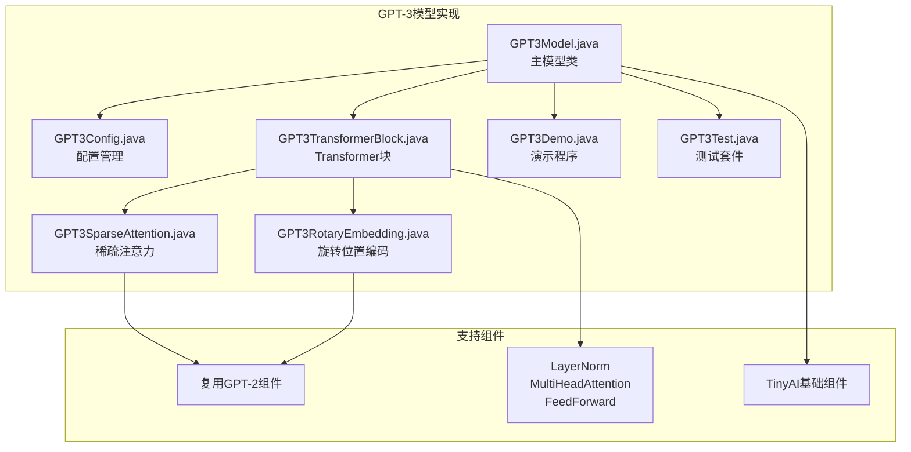
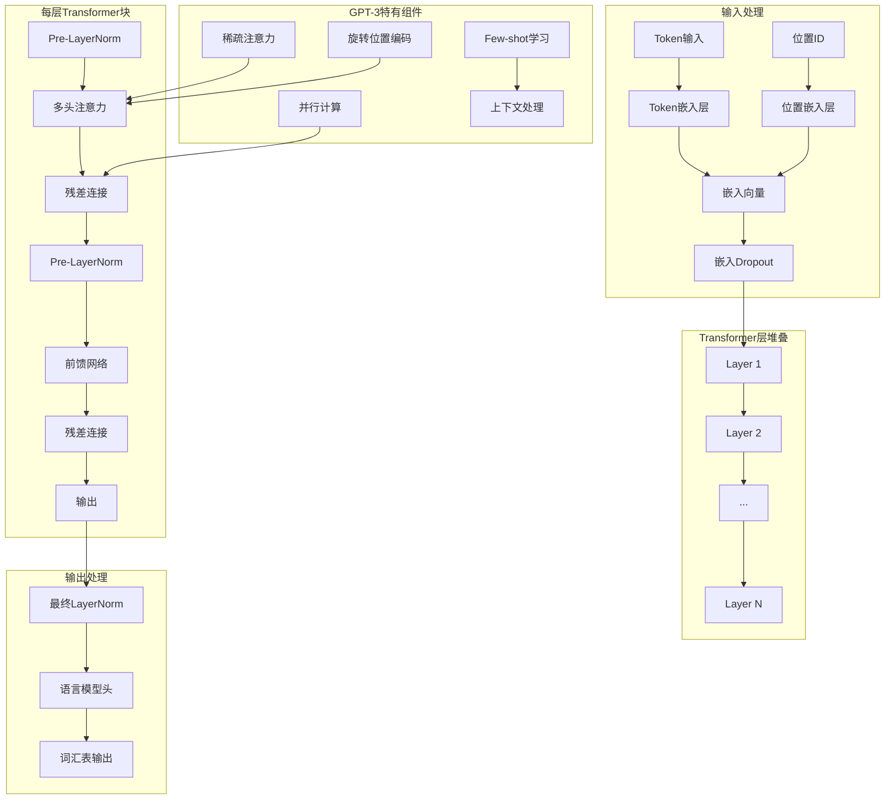

# GPT-3模型

<cite>
**本文档引用的文件**
- [GPT3Model.java](file://tinyai-model-gpt/src/main/java/io/leavesfly/tinyai/gpt3/GPT3Model.java)
- [GPT3Config.java](file://tinyai-model-gpt/src/main/java/io/leavesfly/tinyai/gpt3/GPT3Config.java)
- [GPT3TransformerBlock.java](file://tinyai-model-gpt/src/main/java/io/leavesfly/tinyai/gpt3/GPT3TransformerBlock.java)
- [GPT3SparseAttention.java](file://tinyai-model-gpt/src/main/java/io/leavesfly/tinyai/gpt3/GPT3SparseAttention.java)
- [GPT3RotaryEmbedding.java](file://tinyai-model-gpt/src/main/java/io/leavesfly/tinyai/gpt3/GPT3RotaryEmbedding.java)
- [GPT3Demo.java](file://tinyai-model-gpt/src/main/java/io/leavesfly/tinyai/gpt3/GPT3Demo.java)
- [GPT3Test.java](file://tinyai-model-gpt/src/main/java/io/leavesfly/tinyai/gpt3/GPT3Test.java)
- [gpt3_README.md](file://tinyai-model-gpt/doc/gpt3_README.md)
- [gpt3.py](file://tinyai-model-gpt/doc/gpt3.py)
</cite>

## 目录
1. [简介](#简介)
2. [项目结构](#项目结构)
3. [核心特性](#核心特性)
4. [架构概览](#架构概览)
5. [详细组件分析](#详细组件分析)
6. [稀疏注意力机制](#稀疏注意力机制)
7. [旋转位置编码](#旋转位置编码)
8. [性能优化](#性能优化)
9. [使用指南](#使用指南)
10. [最佳实践](#最佳实践)
11. [故障排除](#故障排除)
12. [结论](#结论)

## 简介

GPT-3（Generative Pre-trained Transformer 3）是OpenAI开发的第三代生成式预训练语言模型，代表了自然语言处理领域的重要突破。基于TinyAI框架实现的GPT-3模型提供了完整的企业级解决方案，支持多种模型规模配置和先进的特性。

本实现基于Transformer架构，采用了多项创新技术，包括稀疏注意力机制、旋转位置编码（RoPE）、并行计算优化等，能够在保持高性能的同时支持长序列处理和大规模部署。

## 项目结构



**图表来源**
- [GPT3Model.java](file://tinyai-model-gpt/src/main/java/io/leavesfly/tinyai/gpt3/GPT3Model.java#L1-L50)
- [GPT3Config.java](file://tinyai-model-gpt/src/main/java/io/leavesfly/tinyai/gpt3/GPT3Config.java#L1-L30)

**章节来源**
- [gpt3_README.md](file://tinyai-model-gpt/doc/gpt3_README.md#L1-L50)

## 核心特性

### 多规模模型支持

GPT-3实现支持从125M到175B参数的不同规模配置：

| 规模 | 参数量 | 嵌入维度 | 层数 | 注意力头 | 稀疏注意力 |
|------|--------|----------|------|----------|------------|
| 小型 | 125M | 768 | 12 | 12 | ❌ |
| 中型 | 350M | 1024 | 24 | 16 | ❌ |
| 大型 | 1.3B | 2048 | 24 | 32 | ✅ |
| 超大型 | 175B | 12288 | 96 | 96 | ✅ |

### 架构设计

- **解码器-only Transformer**: 专为自回归语言建模设计
- **Pre-LayerNorm结构**: 提高训练稳定性
- **并行注意力和MLP**: GPT-3的关键优化
- **残差连接**: 支持深层网络训练

### 先进特性

- **旋转位置编码(RoPE)**: 更好的位置感知能力
- **稀疏注意力机制**: 支持更长序列，降低计算复杂度
- **Few-shot学习**: 强大的上下文学习能力
- **梯度检查点**: 内存效率优化

**章节来源**
- [GPT3Config.java](file://tinyai-model-gpt/src/main/java/io/leavesfly/tinyai/gpt3/GPT3Config.java#L15-L50)
- [gpt3_README.md](file://tinyai-model-gpt/doc/gpt3_README.md#L20-L60)

## 架构概览



**图表来源**
- [GPT3Model.java](file://tinyai-model-gpt/src/main/java/io/leavesfly/tinyai/gpt3/GPT3Model.java#L30-L80)
- [GPT3TransformerBlock.java](file://tinyai-model-gpt/src/main/java/io/leavesfly/tinyai/gpt3/GPT3TransformerBlock.java#L30-L80)

## 详细组件分析

### GPT3Model - 主模型类

GPT3Model是整个GPT-3模型的核心类，继承自Model基类，封装了完整的语言模型功能。

```java
public class GPT3Model extends Model {
    private GPT3Config config;
    private GPT3MainBlock gpt3Block;
    
    // 支持不同规模的模型创建
    public static GPT3Model createSmallModel(String name)
    public static GPT3Model createMediumModel(String name)
    public static GPT3Model createLargeModel(String name)
    public static GPT3Model createXLModel(String name)
}
```

**主要功能**：
- 模型创建和配置管理
- 前向传播和推理
- 文本生成和Few-shot学习
- 模型信息展示和验证

### GPT3Config - 配置管理

GPT3Config类统一管理GPT-3模型的所有超参数和配置选项：

```java
public class GPT3Config {
    // 基础模型参数
    private int vocabSize = 50257;
    private int nPositions = 2048;
    private int nEmbd = 12288;
    private int nLayer = 96;
    private int nHead = 96;
    
    // GPT-3特有参数
    private boolean sparseAttention = false;
    private boolean gradientCheckpointing = true;
    private boolean parallelAttention = true;
    private double rotaryPct = 0.25;
}
```

**章节来源**
- [GPT3Model.java](file://tinyai-model-gpt/src/main/java/io/leavesfly/tinyai/gpt3/GPT3Model.java#L30-L100)
- [GPT3Config.java](file://tinyai-model-gpt/src/main/java/io/leavesfly/tinyai/gpt3/GPT3Config.java#L10-L80)

## 稀疏注意力机制

稀疏注意力机制是GPT-3处理长序列的关键技术，显著降低了计算复杂度。

### 实现原理

```mermaid
flowchart TD
A[输入序列] --> B[线性变换<br/>Q, K, V]
B --> C[多头分割]
C --> D[旋转位置编码]
D --> E[稀疏注意力计算]
E --> F{稀疏模式?}
F --> |是| G[局部注意力<br/>窗口内]
F --> |否| H[全注意力<br/>全局计算]
G --> I[步长注意力<br/>间隔采样]
H --> J[标准注意力<br/>O(n²)]
I --> K[注意力权重]
J --> K
K --> L[加权求和]
L --> M[输出投影]
```

**图表来源**
- [GPT3SparseAttention.java](file://tinyai-model-gpt/src/main/java/io/leavesfly/tinyai/gpt3/GPT3SparseAttention.java#L126-L157)

### 关键特性

1. **局部注意力**: 每个位置只关注邻近的位置
2. **稀疏全局注意力**: 在特定位置使用全局注意力
3. **步长注意力**: 以固定步长关注远距离位置
4. **自适应窗口**: 根据序列长度自动调整窗口大小

### 性能优势

- **计算复杂度**: 从O(n²)降低到O(n√n)或O(n log n)
- **内存使用**: 显著减少内存占用
- **长序列支持**: 支持更长的上下文窗口
- **保持性能**: 在降低复杂度的同时保持模型性能

**章节来源**
- [GPT3SparseAttention.java](file://tinyai-model-gpt/src/main/java/io/leavesfly/tinyai/gpt3/GPT3SparseAttention.java#L1-L94)

## 旋转位置编码

旋转位置编码（Rotary Position Embedding, RoPE）是GPT-3的重要改进，相比传统绝对位置编码具有多项优势。

### 工作原理

```mermaid
flowchart LR
subgraph "位置编码生成"
A[位置索引] --> B[频率计算]
B --> C[余弦值]
B --> D[正弦值]
end
subgraph "旋转变换"
E[查询向量] --> F[应用旋转]
G[键向量] --> F
F --> H[旋转后的向量]
end
subgraph "数学公式"
I[θ = pos / base^(2i/d)] --> J[cos(θ), sin(θ)]
J --> K[旋转变换]
end
C --> F
D --> F
I --> J
```

**图表来源**
- [GPT3RotaryEmbedding.java](file://tinyai-model-gpt/src/main/java/io/leavesfly/tinyai/gpt3/GPT3RotaryEmbedding.java#L80-L120)

### 数学实现

旋转位置编码的核心数学公式：

```
对于位置pos和维度i：
- 频率: θ_i = pos / base^(2i/d)
- 旋转角度: α = θ_i × d
- 旋转变换: 
  - 新x = x·cos(α) - y·sin(α)
  - 新y = x·sin(α) + y·cos(α)
```

### 主要优势

1. **相对位置感知**: 具有相对位置编码的特性
2. **长序列处理**: 在推理时可处理训练时未见过的序列长度
3. **无参数**: 不需要学习位置参数
4. **模长保持**: 旋转变换保持向量的模长不变

**章节来源**
- [GPT3RotaryEmbedding.java](file://tinyai-model-gpt/src/main/java/io/leavesfly/tinyai/gpt3/GPT3RotaryEmbedding.java#L1-L50)

## 性能优化

### 并行计算优化

GPT-3实现了并行注意力和MLP计算，显著提高训练和推理效率：

```java
private Variable forwardParallel(Variable hiddenStates) {
    // Pre-LayerNorm：在注意力和MLP之前分别应用层归一化
    Variable ln1Output = layerNorm1.layerForward(hiddenStates);
    Variable ln2Output = layerNorm2.layerForward(hiddenStates);
    
    // 并行计算注意力和MLP
    Variable attnOutput = attention.layerForward(ln1Output, ln1Output, ln1Output);
    Variable mlpOutput = feedForward.layerForward(ln2Output);
    
    // 应用dropout
    attnOutput = applyDropout(attnOutput, config.getResidDropout());
    mlpOutput = applyDropout(mlpOutput, config.getResidDropout());
    
    // 残差连接
    Variable output = hiddenStates.add(attnOutput).add(mlpOutput);
    return output;
}
```

### 内存优化技术

1. **梯度检查点**: 在训练时节省内存
2. **KV缓存**: 在推理时缓存键值对
3. **稀疏注意力**: 减少注意力矩阵大小
4. **混合精度**: 支持FP16计算

### 计算优化策略

- **矩阵乘法优化**: 利用BLAS库加速
- **内存布局优化**: 优化数据访问模式
- **批处理优化**: 合理设置批大小
- **设备利用**: 支持CPU、GPU和TPU

**章节来源**
- [GPT3TransformerBlock.java](file://tinyai-model-gpt/src/main/java/io/leavesfly/tinyai/gpt3/GPT3TransformerBlock.java#L100-L150)

## 使用指南

### 基本使用示例

```java
// 创建GPT-3模型
GPT3Model model = GPT3Model.createSmallModel("my-gpt3");

// 前向传播
NdArray tokenIds = NdArray.of(Shape.of(1, 10)); // 输入token序列
Variable output = model.forward(new Variable(tokenIds));

// 文本生成
NdArray generated = model.generateSequence(tokenIds, 20);

// Few-shot学习
NdArray context = createFewShotContext(); // 创建上下文
NdArray result = model.fewShotGenerate(context, 15);
```

### 自定义配置

```java
// 创建自定义配置
GPT3Config config = new GPT3Config(
    50000,  // vocab_size
    1024,   // n_positions  
    512,    // n_embd
    8,      // n_layer
    8       // n_head
);

// 启用高级特性
config.setSparseAttention(true);
config.setParallelAttention(true);
config.setRotaryPct(0.25);

// 创建模型
GPT3Model model = new GPT3Model("custom-gpt3", config);
```

### 模型信息展示

```java
GPT3Model model = GPT3Model.createLargeModel("gpt3-large");
model.printModelInfo();
// 输出模型架构、参数数量、配置信息等
```

**章节来源**
- [GPT3Demo.java](file://tinyai-model-gpt/src/main/java/io/leavesfly/tinyai/gpt3/GPT3Demo.java#L50-L150)
- [gpt3_README.md](file://tinyai-model-gpt/doc/gpt3_README.md#L50-L100)

## 最佳实践

### 模型选择指南

1. **小型模型 (125M参数)**: 适用于资源受限环境，快速原型开发
2. **中型模型 (350M参数)**: 平衡性能和资源消耗，适合大多数应用场景
3. **大型模型 (1.3B参数)**: 支持复杂任务，启用稀疏注意力
4. **超大型模型 (175B参数)**: 企业级应用，支持Few-shot学习

### 配置优化建议

```java
// 推荐配置
GPT3Config config = new GPT3Config();
config.setSparseAttention(true);        // 启用稀疏注意力
config.setParallelAttention(true);     // 启用并行计算
config.setGradientCheckpointing(true); // 启用梯度检查点
config.setRotaryPct(0.25);             // 设置旋转位置编码比例
```

### 性能调优

1. **批大小优化**: 根据可用内存调整批大小
2. **序列长度**: 控制输入序列长度以平衡性能和质量
3. **注意力头数**: 注意力头数应能被嵌入维度整除
4. **Dropout率**: 合理设置防止过拟合

### 内存管理

- **梯度检查点**: 在内存受限时启用
- **KV缓存**: 在推理时启用以减少重复计算
- **模型并行**: 对于超大模型考虑模型并行

## 故障排除

### 常见问题及解决方案

1. **内存不足**
   ```java
   // 启用梯度检查点
   config.setGradientCheckpointing(true);
   
   // 减少批大小
   // 减少序列长度
   ```

2. **序列长度超出限制**
   ```java
   // 检查最大序列长度
   if (seqLen > config.getNPositions()) {
       throw new IllegalArgumentException("序列长度超过最大支持长度");
   }
   ```

3. **参数初始化问题**
   ```java
   // 验证配置有效性
   config.validate();
   
   // 检查嵌入维度和头数的关系
   if (nEmbd % nHead != 0) {
       throw new IllegalArgumentException("嵌入维度必须能被头数整除");
   }
   ```

### 性能监控

```java
// 模型信息监控
String summary = model.getConfigSummary();
System.out.println(summary);

// 参数数量统计
long totalParams = gpt3Block.getParameterCount();
System.out.println("总参数数量: " + totalParams);
```

**章节来源**
- [GPT3Test.java](file://tinyai-model-gpt/src/main/java/io/leavesfly/tinyai/gpt3/GPT3Test.java#L100-L200)

## 结论

基于TinyAI框架实现的GPT-3模型提供了完整的企业级解决方案，具有以下优势：

### 技术优势

1. **模块化设计**: 清晰的组件分离，便于维护和扩展
2. **性能优化**: 多项先进技术确保高效运行
3. **灵活配置**: 支持多种模型规模和配置选项
4. **完整测试**: 全面的测试覆盖保证代码质量

### 应用价值

1. **自然语言生成**: 强大的文本生成能力
2. **Few-shot学习**: 无需微调即可适应新任务
3. **长序列处理**: 支持长上下文理解和生成
4. **企业级部署**: 可靠的性能和稳定性

### 发展方向

- **更多激活函数**: 支持更多激活函数类型
- **稀疏注意力扩展**: 实现更多稀疏注意力模式
- **模型并行**: 支持更大规模模型训练
- **量化支持**: 添加模型量化功能

本实现为企业用户提供了一个可靠、高效的GPT-3模型解决方案，满足各种自然语言处理任务的需求。