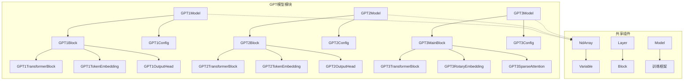
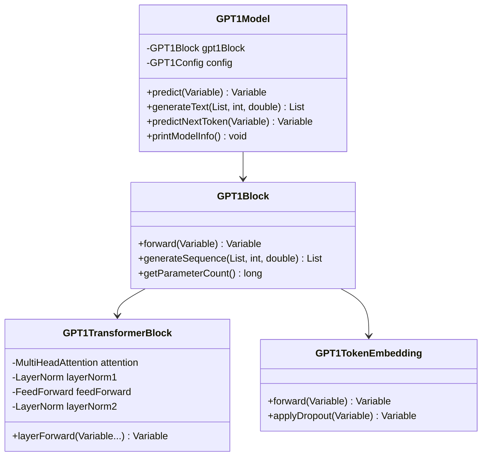
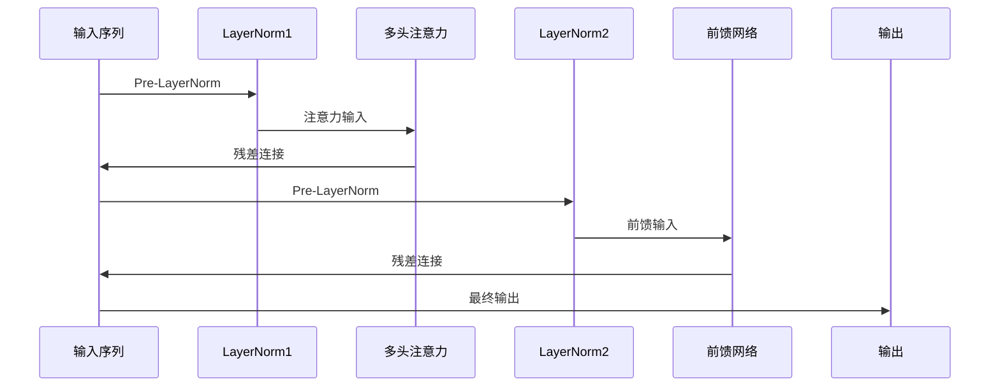
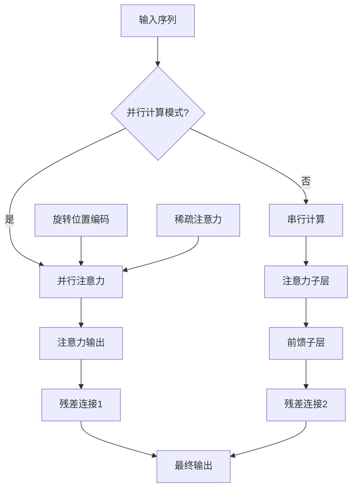
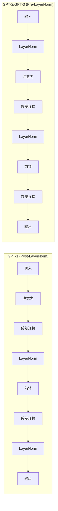
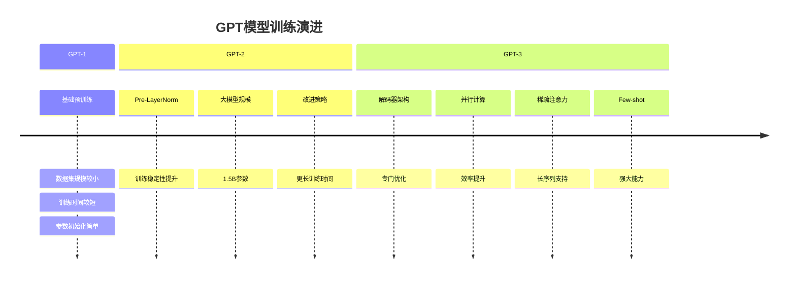

# GPT系列模型

<cite>
**本文档引用的文件**
- [GPT1_REPORT.md](file://tinyai-model-gpt/doc/GPT1_REPORT.md)
- [gpt2.py](file://tinyai-model-gpt/doc/gpt2.py)
- [gpt3_README.md](file://tinyai-model-gpt/doc/gpt3_README.md)
- [GPT1Model.java](file://tinyai-model-gpt/src/main/java/io/leavesfly/tinyai/gpt1/GPT1Model.java)
- [GPT2Model.java](file://tinyai-model-gpt/src/main/java/io/leavesfly/tinyai/gpt2/GPT2Model.java)
- [GPT3Model.java](file://tinyai-model-gpt/src/main/java/io/leavesfly/tinyai/gpt3/GPT3Model.java)
- [GPT1TransformerBlock.java](file://tinyai-model-gpt/src/main/java/io/leavesfly/tinyai/gpt1/GPT1TransformerBlock.java)
- [GPT2TransformerBlock.java](file://tinyai-model-gpt/src/main/java/io/leavesfly/tinyai/gpt2/GPT2TransformerBlock.java)
- [GPT3TransformerBlock.java](file://tinyai-model-gpt/src/main/java/io/leavesfly/tinyai/gpt3/GPT3TransformerBlock.java)
- [GPT1Config.java](file://tinyai-model-gpt/src/main/java/io/leavesfly/tinyai/gpt1/GPT1Config.java)
- [GPT2Config.java](file://tinyai-model-gpt/src/main/java/io/leavesfly/tinyai/gpt2/GPT2Config.java)
- [GPT3Config.java](file://tinyai-model-gpt/src/main/java/io/leavesfly/tinyai/gpt3/GPT3Config.java)
- [GPT1Example.java](file://tinyai-model-gpt/src/main/java/io/leavesfly/tinyai/gpt1/GPT1Example.java)
- [GPT3Demo.java](file://tinyai-model-gpt/src/main/java/io/leavesfly/tinyai/gpt3/GPT3Demo.java)
</cite>

## 目录
1. [简介](#简介)
2. [项目结构](#项目结构)
3. [GPT-1模型](#gpt-1模型)
4. [GPT-2模型](#gpt-2模型)
5. [GPT-3模型](#gpt-3模型)
6. [架构对比分析](#架构对比分析)
7. [使用示例](#使用示例)
8. [性能特点](#性能特点)
9. [故障排除指南](#故障排除指南)
10. [结论](#结论)

## 简介

GPT（Generative Pre-trained Transformer）系列模型是OpenAI开发的一系列强大的语言模型，代表了自然语言处理领域的重大突破。本文档详细介绍了基于TinyAI框架实现的GPT-1、GPT-2和GPT-3三个版本的架构演进、实现细节和使用方法。

这三个版本展示了Transformer架构在自然语言处理中的不断演进：
- **GPT-1**：首次展示大规模预训练语言模型的强大能力
- **GPT-2**：引入Pre-LayerNorm架构和更大的模型规模
- **GPT-3**：实现解码器-only架构和先进的Few-shot学习能力

## 项目结构



**图表来源**
- [GPT1Model.java](file://tinyai-model-gpt/src/main/java/io/leavesfly/tinyai/gpt1/GPT1Model.java#L1-L50)
- [GPT2Model.java](file://tinyai-model-gpt/src/main/java/io/leavesfly/tinyai/gpt2/GPT2Model.java#L1-L50)
- [GPT3Model.java](file://tinyai-model-gpt/src/main/java/io/leavesfly/tinyai/gpt3/GPT3Model.java#L1-L50)

**章节来源**
- [GPT1_REPORT.md](file://tinyai-model-gpt/doc/GPT1_REPORT.md#L1-L50)
- [gpt3_README.md](file://tinyai-model-gpt/doc/gpt3_README.md#L1-L50)

## GPT-1模型

### 架构特点

GPT-1是首个大规模预训练的语言模型，采用了仅解码器的Transformer架构。其主要特点包括：

- **Post-LayerNorm结构**：与原始Transformer一致，在子层之后应用层归一化
- **因果掩码的多头自注意力**：确保自回归生成的正确性
- **GELU激活函数**：相比ReLU提供更好的梯度流动
- **学习位置嵌入**：而非固定的正弦编码

### 核心组件



**图表来源**
- [GPT1Model.java](file://tinyai-model-gpt/src/main/java/io/leavesfly/tinyai/gpt1/GPT1Model.java#L20-L60)
- [GPT1TransformerBlock.java](file://tinyai-model-gpt/src/main/java/io/leavesfly/tinyai/gpt1/GPT1TransformerBlock.java#L20-L80)

### 配置参数

GPT-1的配置类提供了灵活的参数管理：

```java
// 默认配置（原论文标准）
GPT1Config config = new GPT1Config(40000, 512, 768, 12, 12);

// 小型配置（用于测试）
GPT1Config tinyConfig = GPT1Config.createTinyConfig(1000, 128);

// 中型配置
GPT1Config mediumConfig = GPT1Config.createMediumConfig(5000, 256);
```

### 使用示例

```java
// 创建GPT-1模型
GPT1Model model = GPT1Model.createTinyModel("my-gpt1");

// 文本生成
List<Integer> prompt = Arrays.asList(1, 2, 3);
List<Integer> generated = model.generateText(prompt, 50, 1.0);

// 显示模型信息
model.printModelInfo();
```

**章节来源**
- [GPT1_REPORT.md](file://tinyai-model-gpt/doc/GPT1_REPORT.md#L1-L244)
- [GPT1Model.java](file://tinyai-model-gpt/src/main/java/io/leavesfly/tinyai/gpt1/GPT1Model.java#L1-L385)
- [GPT1Example.java](file://tinyai-model-gpt/src/main/java/io/leavesfly/tinyai/gpt1/GPT1Example.java#L1-L199)

## GPT-2模型

### 架构创新

GPT-2引入了重要的架构改进：

- **Pre-LayerNorm结构**：将层归一化移到每个子层之前，提高训练稳定性
- **更大的模型规模**：从GPT-1的1.1B参数扩展到GPT-2的1.5B参数
- **改进的训练策略**：使用更大的批次和更长的训练时间

### 核心组件差异



**图表来源**
- [GPT2TransformerBlock.java](file://tinyai-model-gpt/src/main/java/io/leavesfly/tinyai/gpt2/GPT2TransformerBlock.java#L80-L120)

### 配置管理

GPT-2提供了多种预设配置：

```java
// 小型配置（用于快速测试）
GPT2Config smallConfig = GPT2Config.createSmallConfig();

// 中型配置
GPT2Config mediumConfig = GPT2Config.createMediumConfig();

// 大型配置
GPT2Config largeConfig = GPT2Config.createLargeConfig();
```

### 高级功能

```java
// 创建GPT-2模型
GPT2Model model = GPT2Model.createLargeModel("gpt2-large");

// 验证输入
NdArray tokens = NdArray.of(Shape.of(1, 10));
model.validateInput(tokens);

// 文本生成
NdArray generated = model.generateSequence(tokens, 50);
```

**章节来源**
- [gpt2.py](file://tinyai-model-gpt/doc/gpt2.py#L1-L359)
- [GPT2Model.java](file://tinyai-model-gpt/src/main/java/io/leavesfly/tinyai/gpt2/GPT2Model.java#L1-L152)

## GPT-3模型

### 架构革新

GPT-3代表了语言模型的重大飞跃：

- **解码器-only架构**：专门针对自回归语言建模优化
- **Pre-LayerNorm结构**：继承自GPT-2的训练稳定性优势
- **并行注意力和MLP计算**：显著提升计算效率
- **旋转位置编码(RoPE)**：改进的位置感知能力
- **稀疏注意力机制**：支持更长序列，降低计算复杂度

### 核心特性



**图表来源**
- [GPT3TransformerBlock.java](file://tinyai-model-gpt/src/main/java/io/leavesfly/tinyai/gpt3/GPT3TransformerBlock.java#L80-L120)

### 多规模支持

GPT-3支持从小型到超大型的不同规模配置：

| 规模 | 参数量 | 嵌入维度 | 层数 | 注意力头 | 稀疏注意力 |
|------|--------|----------|------|----------|------------|
| 小型 | 125M | 768 | 12 | 12 | ❌ |
| 中型 | 350M | 1024 | 24 | 16 | ❌ |
| 大型 | 1.3B | 2048 | 24 | 32 | ✅ |
| 超大型 | 175B | 12288 | 96 | 96 | ✅ |

### 高级功能

```java
// 创建GPT-3模型
GPT3Model model = GPT3Model.createLargeModel("gpt3-large");

// Few-shot学习
NdArray context = createFewShotContext();
NdArray result = model.fewShotGenerate(context, 15);

// 旋转位置编码
GPT3RotaryEmbedding rope = new GPT3RotaryEmbedding("rope", 64, 2048);
Variable[] rotated = rope.applyRotaryPositionEmbedding(query, key, seqLen);
```

**章节来源**
- [gpt3_README.md](file://tinyai-model-gpt/doc/gpt3_README.md#L1-L215)
- [GPT3Model.java](file://tinyai-model-gpt/src/main/java/io/leavesfly/tinyai/gpt3/GPT3Model.java#L1-L199)
- [GPT3Demo.java](file://tinyai-model-gpt/src/main/java/io/leavesfly/tinyai/gpt3/GPT3Demo.java#L1-L199)

## 架构对比分析

### 层归一化位置对比



### 计算模式对比

| 特性 | GPT-1 | GPT-2 | GPT-3 |
|------|-------|-------|-------|
| 层归一化位置 | Post-LN | Pre-LN | Pre-LN |
| 注意力计算 | 串行 | 串行 | 并行/串行 |
| 前馈网络 | 串行 | 串行 | 并行/串行 |
| 位置编码 | 学习位置嵌入 | 学习位置嵌入 | 旋转位置编码 |
| 稀疏注意力 | ❌ | ❌ | ✅ |
| Few-shot能力 | 基础 | 增强 | 强大 |

### 参数效率对比

```mermaid
barGraph
title GPT模型参数效率对比
series "GPT-1" 1.1B
series "GPT-2" 1.5B
series "GPT-3 Small" 125M
series "GPT-3 Medium" 350M
series "GPT-3 Large" 1.3B
series "GPT-3 XL" 175B
```

**章节来源**
- [GPT1TransformerBlock.java](file://tinyai-model-gpt/src/main/java/io/leavesfly/tinyai/gpt1/GPT1TransformerBlock.java#L80-L120)
- [GPT2TransformerBlock.java](file://tinyai-model-gpt/src/main/java/io/leavesfly/tinyai/gpt2/GPT2TransformerBlock.java#L80-L120)
- [GPT3TransformerBlock.java](file://tinyai-model-gpt/src/main/java/io/leavesfly/tinyai/gpt3/GPT3TransformerBlock.java#L80-L120)

## 使用示例

### 基础使用模式

```java
// GPT-1基础使用
GPT1Model gpt1 = GPT1Model.createTinyModel("gpt1-demo");
List<Integer> gpt1Result = gpt1.generateText(Arrays.asList(1, 2, 3), 20, 1.0);

// GPT-2基础使用  
GPT2Model gpt2 = GPT2Model.createMediumModel("gpt2-demo");
NdArray gpt2Result = gpt2.generateSequence(NdArray.of(Shape.of(1, 5)), 30);

// GPT-3高级使用
GPT3Model gpt3 = GPT3Model.createLargeModel("gpt3-demo");
NdArray fewShotResult = gpt3.fewShotGenerate(contextTokens, 25);
```

### 配置定制

```java
// 自定义GPT-1配置
GPT1Config customGPT1 = new GPT1Config(
    5000, 256, 512, 8, 8, 2048, 0.1, 0.1, 0.1, 1e-5, 0.02, "gelu"
);

// 自定义GPT-3配置
GPT3Config customGPT3 = new GPT3Config(50000, 2048, 1024, 12, 16);
customGPT3.setSparseAttention(true);
customGPT3.setParallelAttention(true);
```

### 批量处理

```java
// 批量预测
int batchSize = 4;
int seqLength = 16;
Variable batchInput = createBatchInput(batchSize, seqLength, vocabSize);
Variable batchOutput = model.batchPredict(batchInput);
```

**章节来源**
- [GPT1Example.java](file://tinyai-model-gpt/src/main/java/io/leavesfly/tinyai/gpt1/GPT1Example.java#L50-L150)
- [GPT3Demo.java](file://tinyai-model-gpt/src/main/java/io/leavesfly/tinyai/gpt3/GPT3Demo.java#L100-L200)

## 性能特点

### 计算复杂度

| 模型 | 参数量 | 计算复杂度 | 内存需求 |
|------|--------|------------|----------|
| GPT-1 | 1.1B | O(n²d) | 中等 |
| GPT-2 | 1.5B | O(n²d) | 中等 |
| GPT-3 Small | 125M | O(n²d) | 低 |
| GPT-3 Medium | 350M | O(n²d) | 中等 |
| GPT-3 Large | 1.3B | O(n²d) | 高 |
| GPT-3 XL | 175B | O(n²d) | 很高 |

### 训练策略



### 内存优化

- **梯度检查点**：GPT-3的XL模型使用梯度检查点减少内存占用
- **KV缓存**：生成时缓存键值对，提高推理速度
- **混合精度**：支持FP16训练和推理

## 故障排除指南

### 常见问题

1. **内存不足**
   ```java
   // 减少批次大小或序列长度
   config.setMaxSequenceLength(512); // 从1024减少
   ```

2. **训练不稳定**
   ```java
   // 调整学习率和正则化
   config.setResidualDropoutProb(0.1); // 默认值
   config.setLayerNormEpsilon(1e-5);   // 默认值
   ```

3. **生成质量问题**
   ```java
   // 调整温度参数
   double temperature = 0.8; // 0.5-1.0之间
   
   // 使用top-k采样
   // 需要在生成器中实现
   ```

### 性能调优

```java
// 模型选择建议
if (资源有限) {
    GPT1Model.createTinyModel("limited");
} else if (平衡性能) {
    GPT2Model.createMediumModel("balanced");
} else {
    GPT3Model.createLargeModel("powerful");
}
```

**章节来源**
- [GPT1Config.java](file://tinyai-model-gpt/src/main/java/io/leavesfly/tinyai/gpt1/GPT1Config.java#L100-L150)
- [GPT3Config.java](file://tinyai-model-gpt/src/main/java/io/leavesfly/tinyai/gpt3/GPT3Config.java#L100-L150)

## 结论

GPT系列模型代表了自然语言处理领域的重要里程碑。通过TinyAI框架的实现，我们看到了：

### 技术演进总结

1. **架构优化**：从Post-LayerNorm到Pre-LayerNorm的改进
2. **规模扩展**：参数量从1.1B到175B的指数级增长
3. **功能增强**：从基础语言建模到强大的Few-shot学习
4. **效率提升**：并行计算和稀疏注意力的引入

### 实现特色

- **模块化设计**：清晰的组件分离和接口定义
- **配置灵活性**：支持多种规模和自定义配置
- **性能优化**：内存和计算效率的持续改进
- **易用性**：简洁的API和丰富的示例

### 应用前景

GPT系列模型在以下领域展现出巨大潜力：
- **文本生成**：创意写作、对话系统
- **代码生成**：自动化编程辅助
- **知识问答**：智能客服和信息检索
- **多语言处理**：跨语言理解和生成

通过深入理解这些模型的架构和实现，开发者可以更好地利用这些强大的工具来解决实际问题。随着技术的不断发展，我们可以期待更加高效和智能的语言模型在未来的发展。