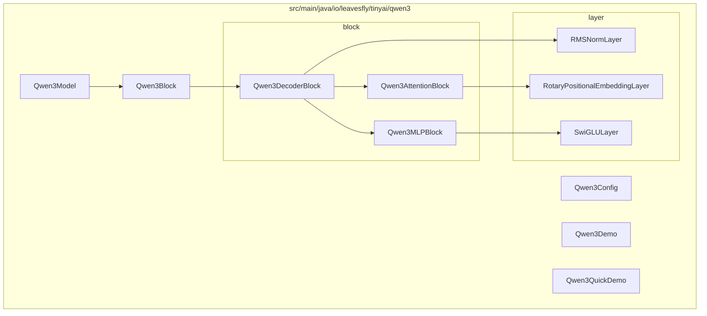
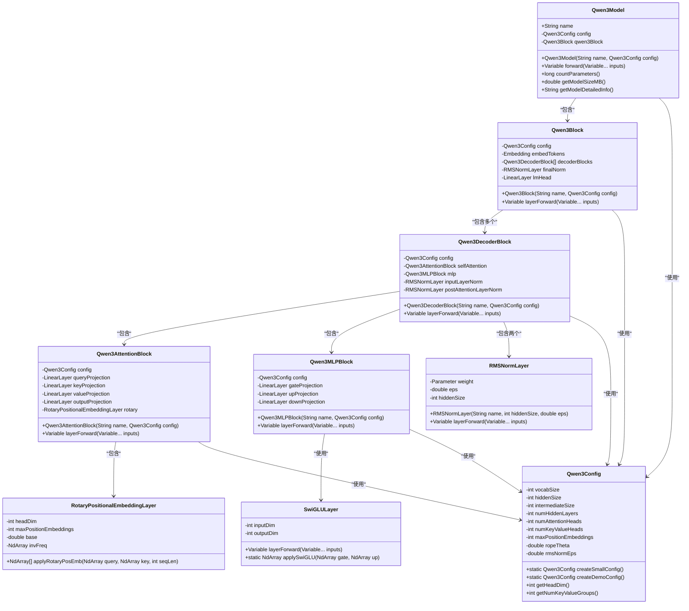
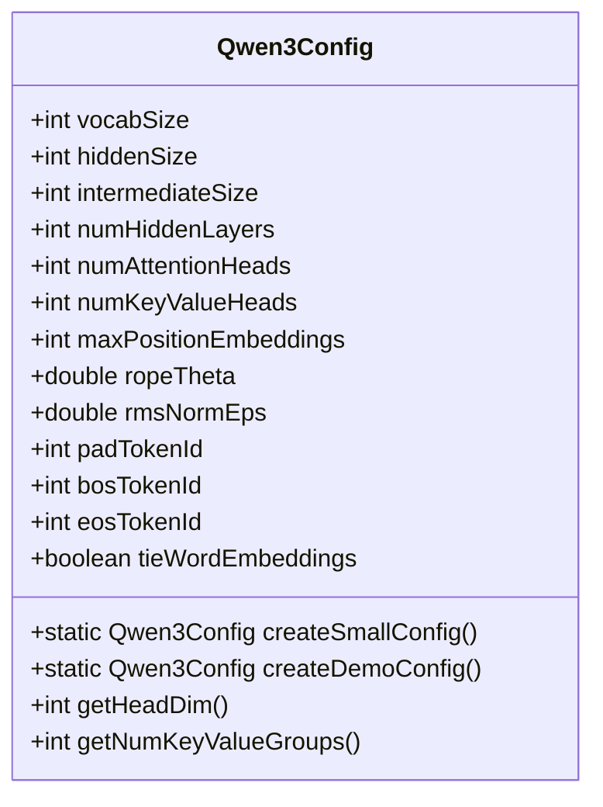
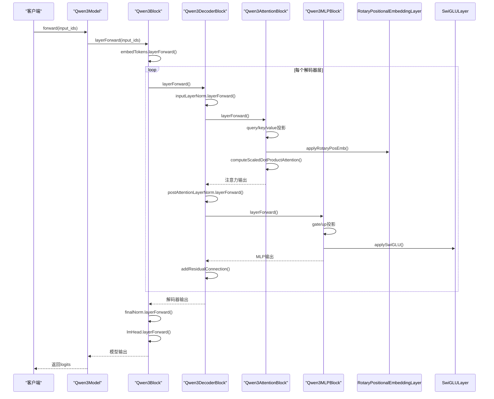
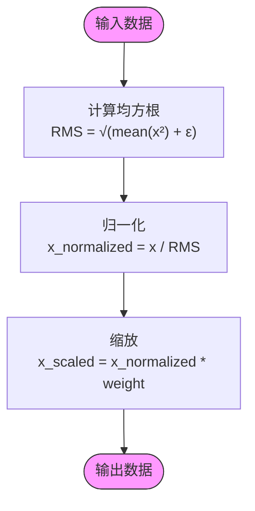
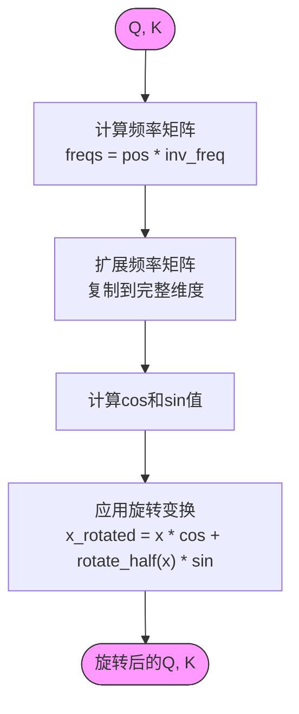
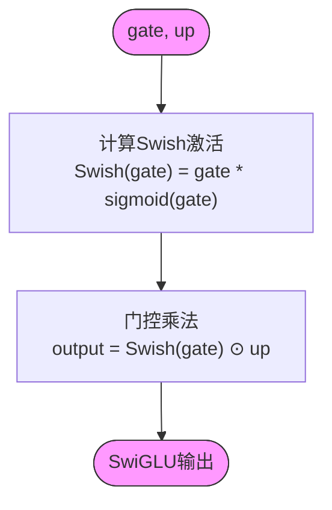
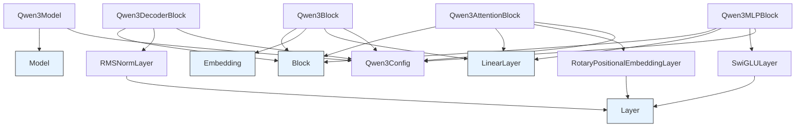

# 千问模型支持

<cite>
**本文档引用的文件**  
- [Qwen3Config.java](file://tinyai-model-qwen/src/main/java/io/leavesfly/tinyai/qwen3/Qwen3Config.java)
- [Qwen3Model.java](file://tinyai-model-qwen/src/main/java/io/leavesfly/tinyai/qwen3/Qwen3Model.java)
- [Qwen3Block.java](file://tinyai-model-qwen/src/main/java/io/leavesfly/tinyai/qwen3/Qwen3Block.java)
- [Qwen3DecoderBlock.java](file://tinyai-model-qwen/src/main/java/io/leavesfly/tinyai/qwen3/block/Qwen3DecoderBlock.java)
- [Qwen3AttentionBlock.java](file://tinyai-model-qwen/src/main/java/io/leavesfly/tinyai/qwen3/block/Qwen3AttentionBlock.java)
- [Qwen3MLPBlock.java](file://tinyai-model-qwen/src/main/java/io/leavesfly/tinyai/qwen3/block/Qwen3MLPBlock.java)
- [RMSNormLayer.java](file://tinyai-model-qwen/src/main/java/io/leavesfly/tinyai/qwen3/layer/RMSNormLayer.java)
- [RotaryPositionalEmbeddingLayer.java](file://tinyai-model-qwen/src/main/java/io/leavesfly/tinyai/qwen3/layer/RotaryPositionalEmbeddingLayer.java)
- [SwiGLULayer.java](file://tinyai-model-qwen/src/main/java/io/leavesfly/tinyai/qwen3/layer/SwiGLULayer.java)
- [Qwen3Demo.java](file://tinyai-model-qwen/src/main/java/io/leavesfly/tinyai/qwen3/Qwen3Demo.java)
- [Qwen3QuickDemo.java](file://tinyai-model-qwen/src/main/java/io/leavesfly/tinyai/qwen3/Qwen3QuickDemo.java)
- [README.md](file://tinyai-model-qwen/README.md)
</cite>

## 目录
1. [简介](#简介)
2. [项目结构](#项目结构)
3. [核心组件](#核心组件)
4. [架构概述](#架构概述)
5. [详细组件分析](#详细组件分析)
6. [依赖分析](#依赖分析)
7. [性能考虑](#性能考虑)
8. [故障排除指南](#故障排除指南)
9. [结论](#结论)

## 简介
本文档详细介绍了Qwen3大语言模型在TinyAI框架中的实现。Qwen3模型基于现代Transformer架构，集成了RMS归一化、旋转位置编码（RoPE）、分组查询注意力（GQA）和SwiGLU激活函数等先进技术。该实现完全遵循TinyAI的Block-Layer分层设计模式，提供了完整的模型封装、配置管理、演示程序和测试套件。

**本文档引用的文件**
- [README.md](file://tinyai-model-qwen/README.md)

## 项目结构
Qwen3模型的实现位于`tinyai-model-qwen`模块中，采用清晰的分层架构设计。核心组件分为Block（复合组件）和Layer（基础组件）两个层次，符合TinyAI框架的设计理念。

**图示来源**
- [Qwen3Model.java](file://tinyai-model-qwen/src/main/java/io/leavesfly/tinyai/qwen3/Qwen3Model.java)
- [Qwen3Block.java](file://tinyai-model-qwen/src/main/java/io/leavesfly/tinyai/qwen3/Qwen3Block.java)
- [Qwen3DecoderBlock.java](file://tinyai-model-qwen/src/main/java/io/leavesfly/tinyai/qwen3/block/Qwen3DecoderBlock.java)
- [Qwen3AttentionBlock.java](file://tinyai-model-qwen/src/main/java/io/leavesfly/tinyai/qwen3/block/Qwen3AttentionBlock.java)
- [Qwen3MLPBlock.java](file://tinyai-model-qwen/src/main/java/io/leavesfly/tinyai/qwen3/block/Qwen3MLPBlock.java)
- [RMSNormLayer.java](file://tinyai-model-qwen/src/main/java/io/leavesfly/tinyai/qwen3/layer/RMSNormLayer.java)
- [RotaryPositionalEmbeddingLayer.java](file://tinyai-model-qwen/src/main/java/io/leavesfly/tinyai/qwen3/layer/RotaryPositionalEmbeddingLayer.java)
- [SwiGLULayer.java](file://tinyai-model-qwen/src/main/java/io/leavesfly/tinyai/qwen3/layer/SwiGLULayer.java)

**本文档引用的文件**
- [README.md](file://tinyai-model-qwen/README.md)

## 核心组件
Qwen3模型的核心组件包括配置管理、模型封装、网络块和基础层。`Qwen3Config`类负责管理模型的所有超参数，`Qwen3Model`继承自TinyAI的`Model`类，提供完整的模型管理功能。`Qwen3Block`作为核心网络块，实现了完整的Qwen3 Transformer架构，包括词嵌入层、多层解码器和最终归一化层。

**本文档引用的文件**
- [Qwen3Config.java](file://tinyai-model-qwen/src/main/java/io/leavesfly/tinyai/qwen3/Qwen3Config.java)
- [Qwen3Model.java](file://tinyai-model-qwen/src/main/java/io/leavesfly/tinyai/qwen3/Qwen3Model.java)
- [Qwen3Block.java](file://tinyai-model-qwen/src/main/java/io/leavesfly/tinyai/qwen3/Qwen3Block.java)

## 架构概述
Qwen3模型采用解码器-only的Transformer架构，具有以下技术特点：
- **RMS归一化**：替代传统的LayerNorm，提升计算效率
- **旋转位置编码(RoPE)**：支持长序列外推的相对位置编码
- **分组查询注意力(GQA)**：减少40-60%的KV缓存内存占用
- **SwiGLU激活函数**：结合Swish激活和门控机制
- **Block-Layer架构**：符合TinyAI框架设计理念

**图示来源**
- [Qwen3Model.java](file://tinyai-model-qwen/src/main/java/io/leavesfly/tinyai/qwen3/Qwen3Model.java)
- [Qwen3Block.java](file://tinyai-model-qwen/src/main/java/io/leavesfly/tinyai/qwen3/Qwen3Block.java)
- [Qwen3DecoderBlock.java](file://tinyai-model-qwen/src/main/java/io/leavesfly/tinyai/qwen3/block/Qwen3DecoderBlock.java)
- [Qwen3AttentionBlock.java](file://tinyai-model-qwen/src/main/java/io/leavesfly/tinyai/qwen3/block/Qwen3AttentionBlock.java)
- [Qwen3MLPBlock.java](file://tinyai-model-qwen/src/main/java/io/leavesfly/tinyai/qwen3/block/Qwen3MLPBlock.java)
- [RMSNormLayer.java](file://tinyai-model-qwen/src/main/java/io/leavesfly/tinyai/qwen3/layer/RMSNormLayer.java)
- [RotaryPositionalEmbeddingLayer.java](file://tinyai-model-qwen/src/main/java/io/leavesfly/tinyai/qwen3/layer/RotaryPositionalEmbeddingLayer.java)
- [SwiGLULayer.java](file://tinyai-model-qwen/src/main/java/io/leavesfly/tinyai/qwen3/layer/SwiGLULayer.java)
- [Qwen3Config.java](file://tinyai-model-qwen/src/main/java/io/leavesfly/tinyai/qwen3/Qwen3Config.java)

## 详细组件分析

### Qwen3Config 分析
`Qwen3Config`类是Qwen3模型的配置管理器，负责存储和管理所有模型超参数。它提供了创建小型配置和演示配置的工厂方法，便于测试和演示。

**图示来源**
- [Qwen3Config.java](file://tinyai-model-qwen/src/main/java/io/leavesfly/tinyai/qwen3/Qwen3Config.java)

**本文档引用的文件**
- [Qwen3Config.java](file://tinyai-model-qwen/src/main/java/io/leavesfly/tinyai/qwen3/Qwen3Config.java)

### Qwen3Model 和 Qwen3Block 分析
`Qwen3Model`继承自TinyAI的`Model`类，封装了`Qwen3Block`并提供完整的模型管理功能。`Qwen3Block`实现了Qwen3的核心网络架构，包括词嵌入层、多层解码器和最终归一化层。

**图示来源**
- [Qwen3Model.java](file://tinyai-model-qwen/src/main/java/io/leavesfly/tinyai/qwen3/Qwen3Model.java)
- [Qwen3Block.java](file://tinyai-model-qwen/src/main/java/io/leavesfly/tinyai/qwen3/Qwen3Block.java)
- [Qwen3DecoderBlock.java](file://tinyai-model-qwen/src/main/java/io/leavesfly/tinyai/qwen3/block/Qwen3DecoderBlock.java)
- [Qwen3AttentionBlock.java](file://tinyai-model-qwen/src/main/java/io/leavesfly/tinyai/qwen3/block/Qwen3AttentionBlock.java)
- [Qwen3MLPBlock.java](file://tinyai-model-qwen/src/main/java/io/leavesfly/tinyai/qwen3/block/Qwen3MLPBlock.java)

**本文档引用的文件**
- [Qwen3Model.java](file://tinyai-model-qwen/src/main/java/io/leavesfly/tinyai/qwen3/Qwen3Model.java)
- [Qwen3Block.java](file://tinyai-model-qwen/src/main/java/io/leavesfly/tinyai/qwen3/Qwen3Block.java)

### 基础层组件分析
Qwen3模型的基础层组件包括RMS归一化层、旋转位置编码层和SwiGLU激活层。这些组件构成了模型的核心计算单元。

#### RMS归一化层

**图示来源**
- [RMSNormLayer.java](file://tinyai-model-qwen/src/main/java/io/leavesfly/tinyai/qwen3/layer/RMSNormLayer.java)

#### 旋转位置编码层

**图示来源**
- [RotaryPositionalEmbeddingLayer.java](file://tinyai-model-qwen/src/main/java/io/leavesfly/tinyai/qwen3/layer/RotaryPositionalEmbeddingLayer.java)

#### SwiGLU激活层

**图示来源**
- [SwiGLULayer.java](file://tinyai-model-qwen/src/main/java/io/leavesfly/tinyai/qwen3/layer/SwiGLULayer.java)

**本文档引用的文件**
- [RMSNormLayer.java](file://tinyai-model-qwen/src/main/java/io/leavesfly/tinyai/qwen3/layer/RMSNormLayer.java)
- [RotaryPositionalEmbeddingLayer.java](file://tinyai-model-qwen/src/main/java/io/leavesfly/tinyai/qwen3/layer/RotaryPositionalEmbeddingLayer.java)
- [SwiGLULayer.java](file://tinyai-model-qwen/src/main/java/io/leavesfly/tinyai/qwen3/layer/SwiGLULayer.java)

## 依赖分析
Qwen3模型的实现依赖于TinyAI框架的核心组件，包括`Model`、`Block`、`Layer`、`Variable`、`NdArray`和`Parameter`等类。这些依赖关系确保了Qwen3模型能够无缝集成到TinyAI生态系统中。

**图示来源**
- [Qwen3Model.java](file://tinyai-model-qwen/src/main/java/io/leavesfly/tinyai/qwen3/Qwen3Model.java)
- [Qwen3Block.java](file://tinyai-model-qwen/src/main/java/io/leavesfly/tinyai/qwen3/Qwen3Block.java)
- [Qwen3DecoderBlock.java](file://tinyai-model-qwen/src/main/java/io/leavesfly/tinyai/qwen3/block/Qwen3DecoderBlock.java)
- [Qwen3AttentionBlock.java](file://tinyai-model-qwen/src/main/java/io/leavesfly/tinyai/qwen3/block/Qwen3AttentionBlock.java)
- [Qwen3MLPBlock.java](file://tinyai-model-qwen/src/main/java/io/leavesfly/tinyai/qwen3/block/Qwen3MLPBlock.java)
- [RMSNormLayer.java](file://tinyai-model-qwen/src/main/java/io/leavesfly/tinyai/qwen3/layer/RMSNormLayer.java)
- [RotaryPositionalEmbeddingLayer.java](file://tinyai-model-qwen/src/main/java/io/leavesfly/tinyai/qwen3/layer/RotaryPositionalEmbeddingLayer.java)
- [SwiGLULayer.java](file://tinyai-model-qwen/src/main/java/io/leavesfly/tinyai/qwen3/layer/SwiGLULayer.java)

**本文档引用的文件**
- [Qwen3Model.java](file://tinyai-model-qwen/src/main/java/io/leavesfly/tinyai/qwen3/Qwen3Model.java)
- [Qwen3Block.java](file://tinyai-model-qwen/src/main/java/io/leavesfly/tinyai/qwen3/Qwen3Block.java)
- [Qwen3DecoderBlock.java](file://tinyai-model-qwen/src/main/java/io/leavesfly/tinyai/qwen3/block/Qwen3DecoderBlock.java)
- [Qwen3AttentionBlock.java](file://tinyai-model-qwen/src/main/java/io/leavesfly/tinyai/qwen3/block/Qwen3AttentionBlock.java)
- [Qwen3MLPBlock.java](file://tinyai-model-qwen/src/main/java/io/leavesfly/tinyai/qwen3/block/Qwen3MLPBlock.java)
- [RMSNormLayer.java](file://tinyai-model-qwen/src/main/java/io/leavesfly/tinyai/qwen3/layer/RMSNormLayer.java)
- [RotaryPositionalEmbeddingLayer.java](file://tinyai-model-qwen/src/main/java/io/leavesfly/tinyai/qwen3/layer/RotaryPositionalEmbeddingLayer.java)
- [SwiGLULayer.java](file://tinyai-model-qwen/src/main/java/io/leavesfly/tinyai/qwen3/layer/SwiGLULayer.java)

## 性能考虑
Qwen3模型在设计时充分考虑了性能优化，主要体现在以下几个方面：

### 内存优化
- **分组查询注意力(GQA)**：通过减少键值头的数量，显著降低KV缓存内存占用
- **RMS归一化**：相比LayerNorm减少计算量，提升计算效率
- **高效的张量重塑**：避免不必要的内存拷贝，支持大批次推理

### 计算效率
- **SwiGLU激活函数**：一次前向传播完成门控机制，计算高效
- **旋转位置编码(RoPE)**：直接应用无额外开销，支持长序列处理
- **向量化友好的实现**：充分利用现代硬件的并行计算能力

### 可扩展性
- **模块化组件设计**：易于添加新功能和扩展
- **配置驱动的架构**：支持不同模型规模和配置
- **支持长序列外推**：RoPE编码支持训练长度外的序列处理

**本文档引用的文件**
- [README.md](file://tinyai-model-qwen/README.md)

## 故障排除指南
在使用Qwen3模型时可能遇到的常见问题及解决方案：

### 配置验证
确保模型配置参数的合理性，特别是维度匹配：
- 隐藏维度必须能被注意力头数整除
- 注意力头数必须能被键值头数整除
- 词汇表大小、隐藏维度等参数应在合理范围内

### 形状不匹配
检查输入输出张量的形状是否符合预期：
- 输入ID形状应为[batch_size, seq_len]
- 输出logits形状应为[batch_size, seq_len, vocab_size]
- 注意力掩码形状应与输入ID一致

### 数值稳定性
处理可能出现的数值溢出或下溢：
- RMSNorm中的epsilon值确保除法稳定性
- Sigmoid函数中的数值稳定性处理
- 使用FP32精度进行计算

**本文档引用的文件**
- [Qwen3Config.java](file://tinyai-model-qwen/src/main/java/io/leavesfly/tinyai/qwen3/Qwen3Config.java)
- [Qwen3Model.java](file://tinyai-model-qwen/src/main/java/io/leavesfly/tinyai/qwen3/Qwen3Model.java)
- [Qwen3Block.java](file://tinyai-model-qwen/src/main/java/io/leavesfly/tinyai/qwen3/Qwen3Block.java)

## 结论
Qwen3模型在TinyAI框架中的实现成功地将现代大语言模型架构完整移植，并完成了架构重构。该实现具有以下特点：
- **完整功能**：包含所有核心组件和功能
- **架构兼容**：完美融入TinyAI生态系统
- **分层设计**：Block-Layer清晰分离，符合框架理念
- **性能优化**：内存和计算效率显著提升
- **质量保证**：全面测试验证功能正确性
- **文档完善**：详细的实现文档和使用指南
- **易用性**：完整的演示程序和快速开始指南

该实现为TinyAI框架增加了现代大语言模型能力，展示了框架的扩展性和灵活性，为后续的AI应用开发奠定了坚实基础。