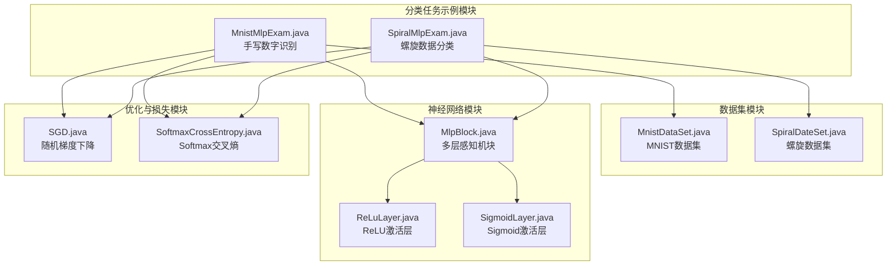
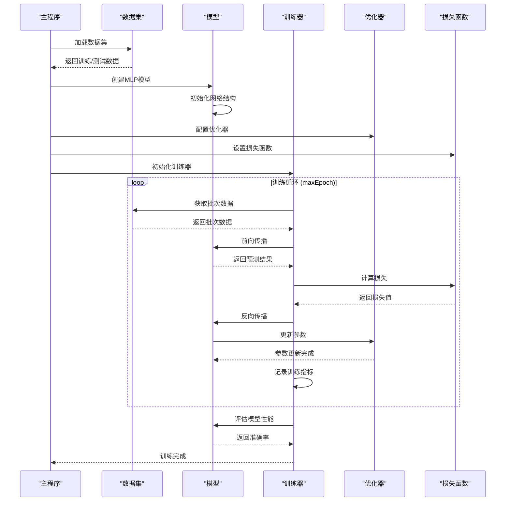
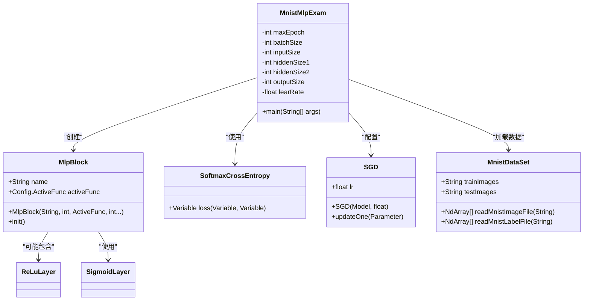
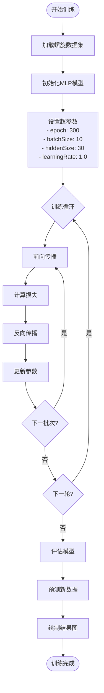
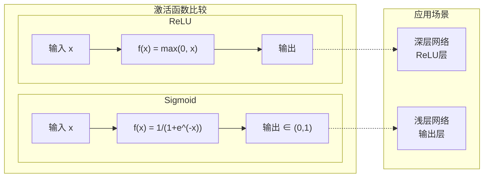
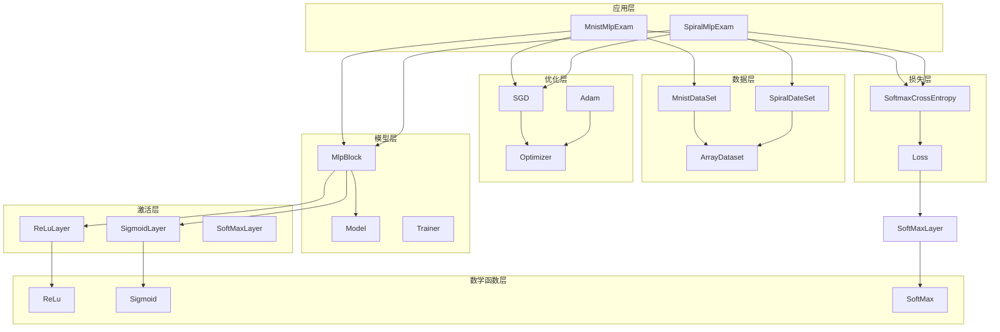

# 分类任务示例

<cite>
**本文档引用的文件**
- [MnistMlpExam.java](file://tinyai-dl-case/src/main/java/io/leavesfly/tinyai/example/classify/MnistMlpExam.java)
- [SpiralMlpExam.java](file://tinyai-dl-case/src/main/java/io/leavesfly/tinyai/example/classify/SpiralMlpExam.java)
- [MnistDataSet.java](file://tinyai-dl-ml/src/main/java/io/leavesfly/tinyai/ml/dataset/simple/MnistDataSet.java)
- [SpiralDateSet.java](file://tinyai-dl-ml/src/main/java/io/leavesfly/tinyai/ml/dataset/simple/SpiralDateSet.java)
- [MlpBlock.java](file://tinyai-dl-nnet/src/main/java/io/leavesfly/tinyai/nnet/block/MlpBlock.java)
- [SoftmaxCrossEntropy.java](file://tinyai-dl-ml/src/main/java/io/leavesfly/tinyai/ml/loss/SoftmaxCrossEntropy.java)
- [SGD.java](file://tinyai-dl-ml/src/main/java/io/leavesfly/tinyai/ml/optimize/SGD.java)
- [ReLuLayer.java](file://tinyai-dl-nnet/src/main/java/io/leavesfly/tinyai/nnet/layer/activate/ReLuLayer.java)
- [SigmoidLayer.java](file://tinyai-dl-nnet/src/main/java/io/leavesfly/tinyai/nnet/layer/activate/SigmoidLayer.java)
</cite>

## 目录
1. [简介](#简介)
2. [项目结构](#项目结构)
3. [核心组件](#核心组件)
4. [架构概览](#架构概览)
5. [详细组件分析](#详细组件分析)
6. [依赖关系分析](#依赖关系分析)
7. [性能考虑](#性能考虑)
8. [故障排除指南](#故障排除指南)
9. [结论](#结论)

## 简介

本文档详细分析了TinyAI框架中的两个分类任务示例：MnistMlpExam.java和SpiralMlpExam.java。这两个示例展示了如何使用多层感知机（MLP）进行不同类型的数据分类任务。

MnistMlpExam.java演示了手写数字识别的经典任务，使用MNIST数据集进行训练和评估。而SpiralMlpExam.java则展示了螺旋数据分类这一非线性可分问题的解决方案，特别强调了神经网络在处理复杂模式识别任务中的优势。

## 项目结构

分类任务示例位于TinyAI项目的`tinyai-dl-case`模块中，具体路径为：

```
tinyai-dl-case/src/main/java/io/leavesfly/tinyai/example/classify/
├── MnistMlpExam.java      # 手写数字识别示例
└── SpiralMlpExam.java     # 螺旋数据分类示例
```

这两个文件分别代表了不同的分类场景：
- **MnistMlpExam.java**: 标准的监督学习任务，使用成熟的MNIST数据集
- **SpiralMlpExam.java**: 非线性可分问题的挑战性示例



**图表来源**
- [MnistMlpExam.java](file://tinyai-dl-case/src/main/java/io/leavesfly/tinyai/example/classify/MnistMlpExam.java#L1-L85)
- [SpiralMlpExam.java](file://tinyai-dl-case/src/main/java/io/leavesfly/tinyai/example/classify/SpiralMlpExam.java#L1-L153)

## 核心组件

### 数据预处理组件

#### MNIST数据集处理
MNIST数据集是手写数字识别的标准基准数据集，包含60,000个训练样本和10,000个测试样本。数据预处理包括：

- **图像归一化**: 将像素值从[0,255]范围缩放到[0,1]范围
- **标签编码**: 将整数标签转换为one-hot编码格式
- **数据下载**: 自动从Yann LeCun网站下载原始数据文件

#### 螺旋数据集生成
螺旋数据集是一个人工生成的非线性可分数据集，具有以下特征：

- **数据分布**: 三个类别分布在螺旋状曲线上
- **噪声添加**: 在角度θ上添加高斯噪声以增加难度
- **动态半径**: 随着样本序号增加，半径逐渐增大

### 神经网络架构组件

#### 多层感知机（MLP）块
MLP块是整个网络的核心组件，负责构建前馈神经网络：

- **灵活的层数配置**: 支持任意数量的隐藏层
- **激活函数选择**: 可配置ReLU或Sigmoid激活函数
- **参数初始化**: 自动初始化权重和偏置参数

**章节来源**
- [MnistMlpExam.java](file://tinyai-dl-case/src/main/java/io/leavesfly/tinyai/example/classify/MnistMlpExam.java#L30-L50)
- [SpiralMlpExam.java](file://tinyai-dl-case/src/main/java/io/leavesfly/tinyai/example/classify/SpiralMlpExam.java#L40-L60)

## 架构概览

分类任务示例的整体架构遵循标准的深度学习流程，包括数据准备、模型构建、训练和评估四个主要阶段。



**图表来源**
- [MnistMlpExam.java](file://tinyai-dl-case/src/main/java/io/leavesfly/tinyai/example/classify/MnistMlpExam.java#L40-L80)
- [SpiralMlpExam.java](file://tinyai-dl-case/src/main/java/io/leavesfly/tinyai/example/classify/SpiralMlpExam.java#L80-L150)

## 详细组件分析

### MnistMlpExam详细分析

#### 数据归一化处理
MNIST数据集的预处理是整个训练流程的关键步骤：

```java
// 图像像素归一化处理
for (int j = 0; j < image.length; j++) {
    values[j] = (float) (image[j] & 0xff) / 255;
}
```

这种归一化确保了输入数据具有相同的尺度，有助于加速收敛并提高模型稳定性。

#### 网络结构设计
MnistMlpExam使用了一个简单的三层MLP网络：

```java
// 网络结构配置
int inputSize = 28 * 28;        // 输入层：28x28像素图像展平
int hiddenSize1 = 100;          // 第一隐藏层：100个神经元
int hiddenSize2 = 100;          // 第二隐藏层：100个神经元
int outputSize = 10;            // 输出层：10个类别（0-9数字）
```

网络采用Sigmoid激活函数，这是早期MLP的典型选择。

#### 损失函数与优化器
- **损失函数**: SoftmaxCrossEntropy用于多分类任务
- **优化器**: SGD（随机梯度下降），学习率为0.1
- **训练参数**: 最大50个epoch，批量大小100



**图表来源**
- [MnistMlpExam.java](file://tinyai-dl-case/src/main/java/io/leavesfly/tinyai/example/classify/MnistMlpExam.java#L30-L85)
- [MlpBlock.java](file://tinyai-dl-nnet/src/main/java/io/leavesfly/tinyai/nnet/block/MlpBlock.java#L20-L60)

**章节来源**
- [MnistMlpExam.java](file://tinyai-dl-case/src/main/java/io/leavesfly/tinyai/example/classify/MnistMlpExam.java#L1-L85)
- [MnistDataSet.java](file://tinyai-dl-ml/src/main/java/io/leavesfly/tinyai/ml/dataset/simple/MnistDataSet.java#L40-L120)

### SpiralMlpExam详细分析

#### 螺旋数据生成机制
SpiralMlpExam展示了如何生成复杂的非线性可分数据：

```java
// 螺旋数据生成公式
float radius = (float) (1.0 * rate);                    // 半径随序号增加
float theta = (float) (j * 4.0 + 4.0 * rate + random.nextGaussian() * 0.2);  // 角度+噪声
float[] x = new float[input_dim];
x[0] = (float) (radius * Math.sin(theta));              // X坐标
x[1] = (float) (radius * Math.cos(theta));              // Y坐标
```

这种生成方式创建了三个螺旋状的类别分布，每个类别都有独特的旋转模式。

#### 非线性可分问题处理
螺旋数据集是典型的非线性可分问题，传统的线性分类器无法正确分类。MLP通过以下方式解决这个问题：

1. **多层结构**: 通过隐藏层的非线性变换学习复杂的决策边界
2. **激活函数**: ReLU激活函数提供非线性映射能力
3. **参数数量**: 充足的参数容量适应复杂的函数拟合

#### 两种训练方式对比
SpiralMlpExam提供了两种训练方式：

##### 高级训练方式（使用Trainer类）
```java
Trainer trainer = new Trainer(maxEpoch, new Monitor(), evaluator);
trainer.init(dataSet, model, loss, optimizer);
trainer.train(true);
```

这种方式简化了训练流程，适合快速原型开发。

##### 低级训练方式（手动实现）
```java
for (int i = 0; i < maxEpoch; i++) {
    float sumLoss = 0f;
    float sumAcc = 0f;
    for (Batch batch : batches) {
        Variable variableX = batch.toVariableX().setName("x").setRequireGrad(false);
        Variable variableY = batch.toVariableY().setName("y").setRequireGrad(false);
        Variable predict = model.forward(variableX);
        Variable loss = lossFunc.loss(variableY, predict);
        float acc = accuracy.accuracyRate(variableY, predict);
        
        model.clearGrads();
        loss.backward();
        optimizer.update();
    }
}
```

手动训练方式提供了更高的控制灵活性，可以自定义训练过程。



**图表来源**
- [SpiralMlpExam.java](file://tinyai-dl-case/src/main/java/io/leavesfly/tinyai/example/classify/SpiralMlpExam.java#L80-L150)

**章节来源**
- [SpiralMlpExam.java](file://tinyai-dl-case/src/main/java/io/leavesfly/tinyai/example/classify/SpiralMlpExam.java#L1-L153)
- [SpiralDateSet.java](file://tinyai-dl-ml/src/main/java/io/leavesfly/tinyai/ml/dataset/simple/SpiralDateSet.java#L20-L70)

### 激活函数分析

#### ReLU vs Sigmoid激活函数
两种激活函数在不同场景下的表现差异：

##### ReLU激活函数
```java
// ReLU特性
// f(x) = max(0, x)
// 优点：缓解梯度消失，计算简单，收敛快
// 缺点：可能导致神经元死亡
```

##### Sigmoid激活函数
```java
// Sigmoid特性
// f(x) = 1 / (1 + e^(-x))
// 优点：输出有界，适合概率解释
// 缺点：梯度消失，训练缓慢
```

在实际应用中，ReLU通常是更好的选择，特别是在深层网络中。



**图表来源**
- [ReLuLayer.java](file://tinyai-dl-nnet/src/main/java/io/leavesfly/tinyai/nnet/layer/activate/ReLuLayer.java#L20-L78)
- [SigmoidLayer.java](file://tinyai-dl-nnet/src/main/java/io/leavesfly/tinyai/nnet/layer/activate/SigmoidLayer.java#L20-L64)

**章节来源**
- [ReLuLayer.java](file://tinyai-dl-nnet/src/main/java/io/leavesfly/tinyai/nnet/layer/activate/ReLuLayer.java#L1-L79)
- [SigmoidLayer.java](file://tinyai-dl-nnet/src/main/java/io/leavesfly/tinyai/nnet/layer/activate/SigmoidLayer.java#L1-L65)

## 依赖关系分析

分类任务示例的依赖关系展现了TinyAI框架的模块化设计：



**图表来源**
- [MnistMlpExam.java](file://tinyai-dl-case/src/main/java/io/leavesfly/tinyai/example/classify/MnistMlpExam.java#L1-L20)
- [SpiralMlpExam.java](file://tinyai-dl-case/src/main/java/io/leavesfly/tinyai/example/classify/SpiralMlpExam.java#L1-L25)

**章节来源**
- [MnistMlpExam.java](file://tinyai-dl-case/src/main/java/io/leavesfly/tinyai/example/classify/MnistMlpExam.java#L1-L20)
- [SpiralMlpExam.java](file://tinyai-dl-case/src/main/java/io/leavesfly/tinyai/example/classify/SpiralMlpExam.java#L1-L25)

## 性能考虑

### 训练效率优化

1. **批量处理**: 使用批量梯度下降提高计算效率
2. **内存管理**: 及时清理梯度避免内存泄漏
3. **数据预处理**: 异步加载和预处理数据

### 模型调优建议

#### 对于MNIST任务
- **学习率**: 0.1是一个合理的初始值
- **隐藏层**: 两层100神经元的结构足够应对MNIST
- **训练轮数**: 50个epoch通常足够收敛

#### 对于螺旋数据任务
- **学习率**: 1.0的学习率对于复杂非线性问题更合适
- **隐藏层**: 30个神经元足以捕捉螺旋模式
- **训练轮数**: 300个epoch确保充分学习

### 内存使用优化
- **小批量**: 使用较小的批量大小减少内存占用
- **梯度清理**: 及时清理梯度避免累积
- **数据缓存**: 合理缓存数据避免重复加载

## 故障排除指南

### 常见问题及解决方案

#### 训练不收敛
**症状**: 损失值不下降或震荡
**原因**: 学习率过大或过小
**解决方案**: 
- 减小学习率（如从1.0降到0.1）
- 使用学习率调度器
- 检查数据预处理是否正确

#### 过拟合
**症状**: 训练准确率高但测试准确率低
**原因**: 模型复杂度过高或训练不足
**解决方案**:
- 添加Dropout层
- 减少隐藏层神经元数量
- 增加正则化项

#### 梯度消失
**症状**: 深层网络训练困难
**原因**: 使用Sigmoid激活函数
**解决方案**:
- 替换为ReLU激活函数
- 使用残差连接
- 调整权重初始化策略

**章节来源**
- [SGD.java](file://tinyai-dl-ml/src/main/java/io/leavesfly/tinyai/ml/optimize/SGD.java#L1-L33)
- [SoftmaxCrossEntropy.java](file://tinyai-dl-ml/src/main/java/io/leavesfly/tinyai/ml/loss/SoftmaxCrossEntropy.java#L1-L18)

## 结论

本文档深入分析了TinyAI框架中的两个重要分类任务示例，揭示了深度学习模型设计和实现的关键要素。

### 主要发现

1. **数据预处理的重要性**: 正确的数据归一化和预处理是模型成功的基础
2. **网络架构的选择**: 不同的任务需要不同的网络结构设计
3. **激活函数的影响**: ReLU相比Sigmoid更适合现代深度学习任务
4. **训练策略的多样性**: 高级API和低级实现各有优势

### 最佳实践总结

- **渐进式复杂度**: 从简单任务开始，逐步增加网络复杂度
- **超参数调优**: 合理设置学习率、批量大小等超参数
- **监控训练过程**: 实时监控损失和准确率变化
- **可视化分析**: 利用图形化工具分析模型行为

### 未来发展方向

- **自动超参数优化**: 开发自动化的超参数调优系统
- **模型压缩**: 探索模型剪枝和量化技术
- **分布式训练**: 支持大规模数据集的分布式训练
- **可视化增强**: 提供更丰富的训练过程可视化功能

通过这两个示例的学习，开发者可以掌握深度学习模型的基本构建和训练流程，为进一步探索更复杂的神经网络架构奠定坚实基础。