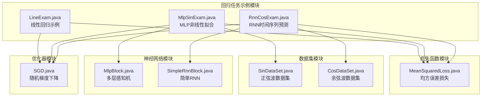
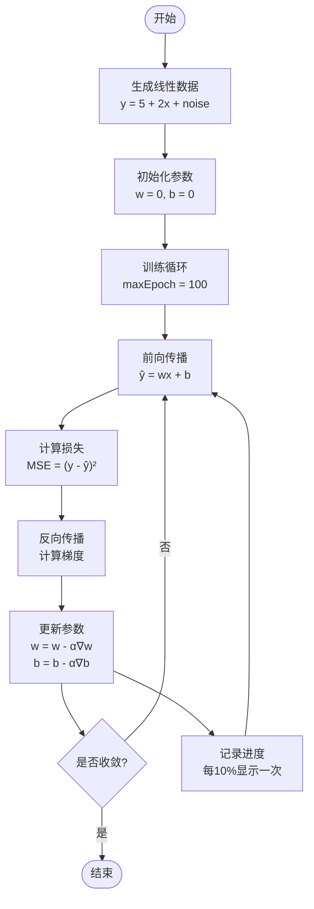
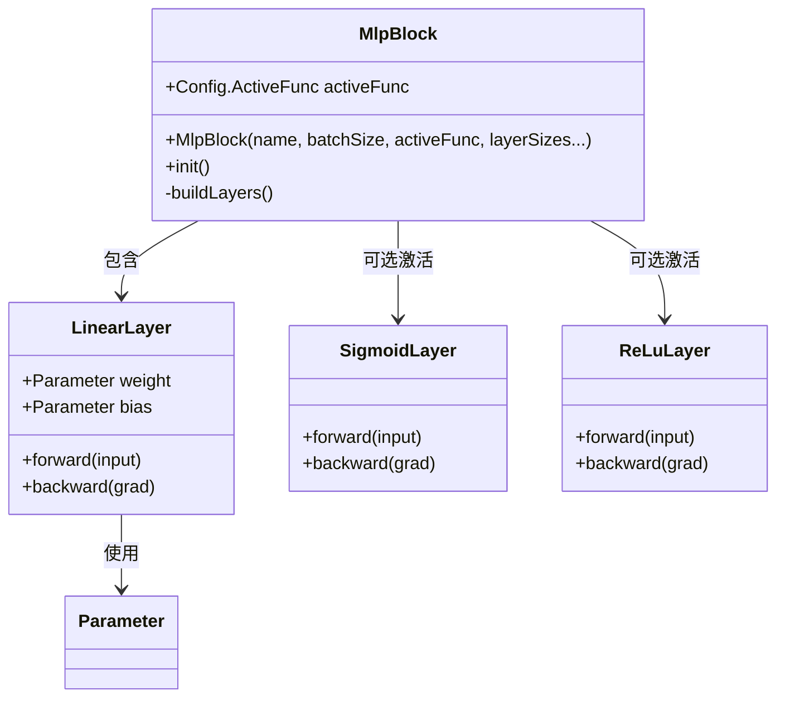
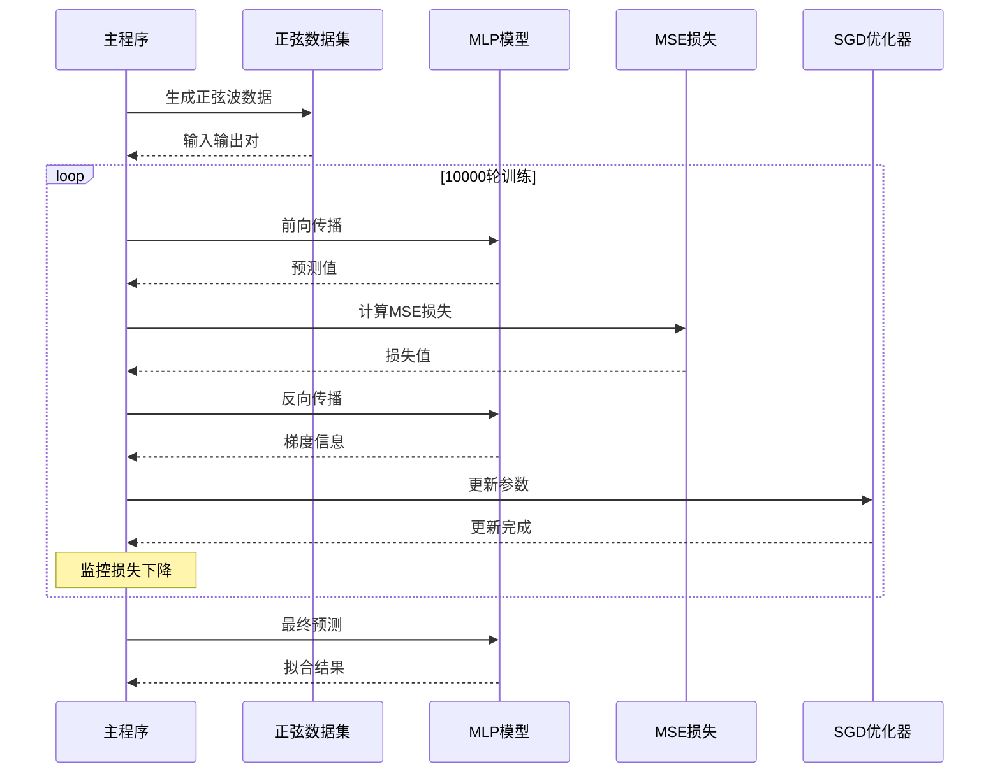
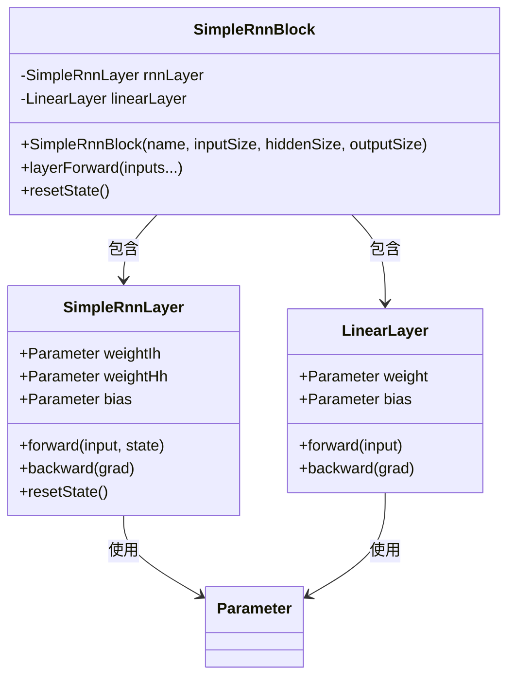
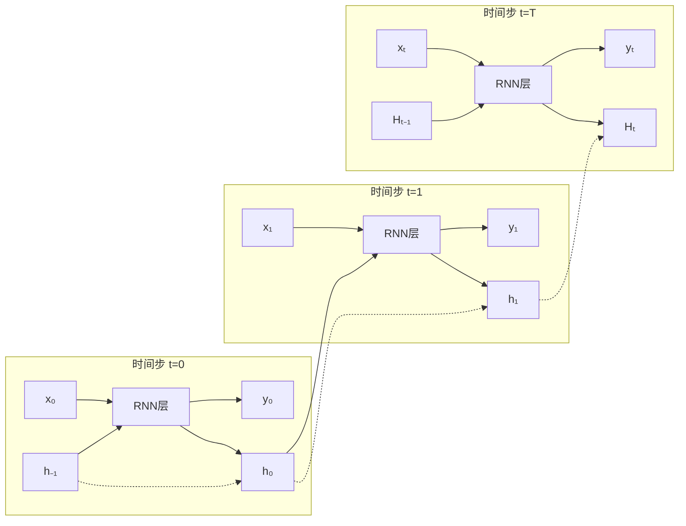
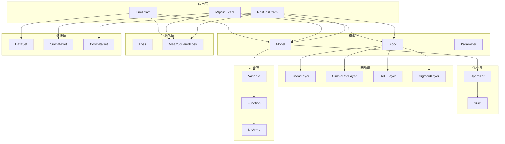

# 回归任务示例

<cite>
**本文档中引用的文件**
- [LineExam.java](file://tinyai-dl-case/src/main/java/io/leavesfly/tinyai/example/regress/LineExam.java)
- [MlpSinExam.java](file://tinyai-dl-case/src/main/java/io/leavesfly/tinyai/example/regress/MlpSinExam.java)
- [RnnCosExam.java](file://tinyai-dl-case/src/main/java/io/leavesfly/tinyai/example/regress/RnnCosExam.java)
- [MeanSquaredLoss.java](file://tinyai-dl-ml/src/main/java/io/leavesfly/tinyai/ml/loss/MeanSquaredLoss.java)
- [SinDataSet.java](file://tinyai-dl-ml/src/main/java/io/leavesfly/tinyai/ml/dataset/simple/SinDataSet.java)
- [CosDataSet.java](file://tinyai-dl-ml/src/main/java/io/leavesfly/tinyai/ml/dataset/simple/CosDataSet.java)
- [MlpBlock.java](file://tinyai-dl-nnet/src/main/java/io/leavesfly/tinyai/nnet/block/MlpBlock.java)
- [SimpleRnnBlock.java](file://tinyai-dl-nnet/src/main/java/io/leavesfly/tinyai/nnet/block/SimpleRnnBlock.java)
- [Add.java](file://tinyai-dl-func/src/main/java/io/leavesfly/tinyai/func/base/Add.java)
- [SGD.java](file://tinyai-dl-ml/src/main/java/io/leavesfly/tinyai/ml/optimize/SGD.java)
</cite>

## 目录
1. [简介](#简介)
2. [项目结构](#项目结构)
3. [核心组件](#核心组件)
4. [架构概览](#架构概览)
5. [详细组件分析](#详细组件分析)
6. [依赖关系分析](#依赖关系分析)
7. [性能考虑](#性能考虑)
8. [故障排除指南](#故障排除指南)
9. [结论](#结论)

## 简介

本文档全面解析了TinyAI框架中的三个核心回归任务示例，展示了不同类型的神经网络在回归任务中的应用。这些示例涵盖了从最基础的线性回归到复杂的循环神经网络的时间序列预测，每个示例都针对特定的回归场景进行了优化。

主要包含以下三个核心示例：
- **LineExam.java**: 展示一维线性回归的实现，演示如何使用梯度下降法拟合带有噪声的线性数据
- **MlpSinExam.java**: 展示多层感知机(MLP)对正弦函数的非线性拟合能力，包括网络深度与宽度对拟合效果的影响
- **RnnCosExam.java**: 展示递归神经网络(RNN)在时间序列预测中的应用，涉及序列输入构造、状态保持与长期依赖建模

所有示例都使用均方误差(MeanSquaredLoss)作为回归损失函数，这是回归任务中最常用的损失函数之一。

## 项目结构

回归任务示例位于`tinyai-dl-case`模块的`regress`包中，采用清晰的分层架构设计：



**图表来源**
- [LineExam.java](file://tinyai-dl-case/src/main/java/io/leavesfly/tinyai/example/regress/LineExam.java#L1-L107)
- [MlpSinExam.java](file://tinyai-dl-case/src/main/java/io/leavesfly/tinyai/example/regress/MlpSinExam.java#L1-L80)
- [RnnCosExam.java](file://tinyai-dl-case/src/main/java/io/leavesfly/tinyai/example/regress/RnnCosExam.java#L1-L107)

## 核心组件

### 均方误差损失函数

均方误差(MeanSquaredLoss)是回归任务的核心损失函数，其数学表达式为：

$$L(y, \hat{y}) = \frac{1}{n}\sum_{i=1}^{n}(y_i - \hat{y}_i)^2$$

其中：
- $y$ 是真实值
- $\hat{y}$ 是预测值
- $n$ 是样本数量

```java
@Override
public Variable loss(Variable y, Variable predict) {
    return predict.meanSquaredError(y);
}
```

### 数据集生成器

系统提供了专门的数据集生成器来模拟不同的回归场景：

1. **SinDataSet**: 生成正弦波数据，用于测试非线性拟合能力
2. **CosDataSet**: 生成余弦波数据，用于时间序列预测测试

**章节来源**
- [MeanSquaredLoss.java](file://tinyai-dl-ml/src/main/java/io/leavesfly/tinyai/ml/loss/MeanSquaredLoss.java#L1-L19)
- [SinDataSet.java](file://tinyai-dl-ml/src/main/java/io/leavesfly/tinyai/ml/dataset/simple/SinDataSet.java#L1-L48)
- [CosDataSet.java](file://tinyai-dl-ml/src/main/java/io/leavesfly/tinyai/ml/dataset/simple/CosDataSet.java#L1-L49)

## 架构概览

整个回归任务示例采用模块化设计，各组件之间通过清晰的接口进行交互：

```mermaid
sequenceDiagram
participant Main as 主程序
participant Data as 数据集
participant Model as 神经网络模型
participant Loss as 损失函数
participant Opt as 优化器
participant Plot as 可视化
Main->>Data : 生成训练数据
Data-->>Main : 返回数据批次
loop 训练循环
Main->>Model : 前向传播
Model-->>Main : 预测结果
Main->>Loss : 计算损失
Loss-->>Main : 损失值
Main->>Model : 反向传播
Model-->>Main : 梯度信息
Main->>Opt : 参数更新
Opt-->>Main : 更新后的参数
Note over Main : 可选：可视化损失下降
end
Main->>Plot : 绘制拟合结果
Plot-->>Main : 可视化图表
```

**图表来源**
- [LineExam.java](file://tinyai-dl-case/src/main/java/io/leavesfly/tinyai/example/regress/LineExam.java#L30-L70)
- [MlpSinExam.java](file://tinyai-dl-case/src/main/java/io/leavesfly/tinyai/example/regress/MlpSinExam.java#L40-L70)
- [RnnCosExam.java](file://tinyai-dl-case/src/main/java/io/leavesfly/tinyai/example/regress/RnnCosExam.java#L40-L90)

## 详细组件分析

### 线性回归示例 (LineExam.java)

线性回归是最基础的回归算法，用于建立输入特征与目标值之间的线性关系。

#### 核心实现流程



**图表来源**
- [LineExam.java](file://tinyai-dl-case/src/main/java/io/leavesfly/tinyai/example/regress/LineExam.java#L30-L70)

#### 关键特性

1. **简单线性模型**: 使用最简单的线性函数 $y = wx + b$
2. **手动梯度下降**: 手动实现梯度下降算法，便于理解
3. **损失可视化**: 实时监控损失函数的变化趋势
4. **参数跟踪**: 跟踪权重和偏置的更新过程

#### 数学原理

线性回归的目标是最小化以下损失函数：

$$L(w,b) = \frac{1}{n}\sum_{i=1}^{n}(y_i - (wx_i + b))^2$$

通过梯度下降法更新参数：

$$w := w - \alpha\frac{\partial L}{\partial w}$$
$$b := b - \alpha\frac{\partial L}{\partial b}$$

**章节来源**
- [LineExam.java](file://tinyai-dl-case/src/main/java/io/leavesfly/tinyai/example/regress/LineExam.java#L1-L107)

### 多层感知机非线性拟合 (MlpSinExam.java)

MLP展示了神经网络处理非线性关系的能力，能够拟合复杂的正弦波函数。

#### 网络架构设计



**图表来源**
- [MlpBlock.java](file://tinyai-dl-nnet/src/main/java/io/leavesfly/tinyai/nnet/block/MlpBlock.java#L1-L61)

#### 训练流程



**图表来源**
- [MlpSinExam.java](file://tinyai-dl-case/src/main/java/io/leavesfly/tinyai/example/regress/MlpSinExam.java#L40-L70)

#### 网络参数影响

MLP的性能受以下因素显著影响：

1. **网络深度**: 增加层数可以提高拟合复杂度
2. **网络宽度**: 增加每层神经元数量可以增强表达能力
3. **激活函数**: Sigmoid vs ReLU的选择影响训练稳定性
4. **学习率**: 过大会导致震荡，过小会导致收敛慢

**章节来源**
- [MlpSinExam.java](file://tinyai-dl-case/src/main/java/io/leavesfly/tinyai/example/regress/MlpSinExam.java#L1-L80)
- [MlpBlock.java](file://tinyai-dl-nnet/src/main/java/io/leavesfly/tinyai/nnet/block/MlpBlock.java#L1-L61)

### 循环神经网络时间序列预测 (RnnCosExam.java)

RNN专门设计用于处理序列数据，能够捕捉时间序列中的长期依赖关系。

#### RNN架构特点



**图表来源**
- [SimpleRnnBlock.java](file://tinyai-dl-nnet/src/main/java/io/leavesfly/tinyai/nnet/block/SimpleRnnBlock.java#L1-L60)

#### 序列处理机制

RNN通过以下方式处理序列数据：



**图表来源**
- [RnnCosExam.java](file://tinyai-dl-case/src/main/java/io/leavesfly/tinyai/example/regress/RnnCosExam.java#L60-L90)

#### 关键技术点

1. **状态保持**: RNN需要维护隐藏状态$h_t$以捕捉序列依赖
2. **截断反向传播**: 为避免梯度消失，使用BPTT限制反向传播长度
3. **序列预处理**: 将连续数据分割成序列批次
4. **状态重置**: 每个批次开始前重置隐藏状态

**章节来源**
- [RnnCosExam.java](file://tinyai-dl-case/src/main/java/io/leavesfly/tinyai/example/regress/RnnCosExam.java#L1-L107)
- [SimpleRnnBlock.java](file://tinyai-dl-nnet/src/main/java/io/leavesfly/tinyai/nnet/block/SimpleRnnBlock.java#L1-L60)

## 依赖关系分析

回归任务示例的依赖关系展现了清晰的分层架构：



**图表来源**
- [LineExam.java](file://tinyai-dl-case/src/main/java/io/leavesfly/tinyai/example/regress/LineExam.java#L1-L20)
- [MlpSinExam.java](file://tinyai-dl-case/src/main/java/io/leavesfly/tinyai/example/regress/MlpSinExam.java#L1-L25)
- [RnnCosExam.java](file://tinyai-dl-case/src/main/java/io/leavesfly/tinyai/example/regress/RnnCosExam.java#L1-L20)

**章节来源**
- [LineExam.java](file://tinyai-dl-case/src/main/java/io/leavesfly/tinyai/example/regress/LineExam.java#L1-L107)
- [MlpSinExam.java](file://tinyai-dl-case/src/main/java/io/leavesfly/tinyai/example/regress/MlpSinExam.java#L1-L80)
- [RnnCosExam.java](file://tinyai-dl-case/src/main/java/io/leavesfly/tinyai/example/regress/RnnCosExam.java#L1-L107)

## 性能考虑

### 训练效率优化

1. **批量处理**: 所有示例都采用批量处理提高计算效率
2. **梯度累积**: RNN示例中使用截断反向传播减少内存占用
3. **状态管理**: RNN需要显式管理隐藏状态，避免内存泄漏
4. **学习率调整**: 不同任务采用不同的学习率策略

### 内存管理

1. **计算图清理**: RNN示例中使用`unChainBackward()`清理计算图
2. **状态重置**: 每个批次开始前重置RNN状态
3. **参数共享**: 共享激活函数和损失函数实例

### 可扩展性

1. **模块化设计**: 各组件独立，便于替换和扩展
2. **配置灵活**: 支持不同的网络结构和超参数
3. **可视化集成**: 内置绘图功能便于调试和分析

## 故障排除指南

### 常见问题及解决方案

#### 1. 线性回归不收敛

**症状**: 损失值不下降或震荡
**原因**: 学习率过大或数据预处理不当
**解决方案**: 
- 减小学习率至0.01-0.1
- 检查数据标准化
- 增加训练轮数

#### 2. MLP训练不稳定

**症状**: 损失值突然增大或NaN
**原因**: 梯度爆炸或激活函数选择不当
**解决方案**:
- 使用ReLU激活函数
- 添加梯度裁剪
- 减小学习率

#### 3. RNN梯度消失

**症状**: 长序列预测效果差
**原因**: BPTT长度不足或隐藏层太小
**解决方案**:
- 增加BPTT长度
- 增大隐藏层大小
- 使用LSTM或GRU替代

**章节来源**
- [LineExam.java](file://tinyai-dl-case/src/main/java/io/leavesfly/tinyai/example/regress/LineExam.java#L50-L70)
- [RnnCosExam.java](file://tinyai-dl-case/src/main/java/io/leavesfly/tinyai/example/regress/RnnCosExam.java#L70-L90)

## 结论

本文档全面分析了TinyAI框架中的三个核心回归任务示例，展示了不同类型的神经网络在回归任务中的应用优势：

1. **线性回归**提供了回归任务的基础理解，适合初学者掌握基本概念
2. **MLP非线性拟合**展示了神经网络处理复杂非线性关系的能力
3. **RNN时间序列预测**体现了序列数据处理的独特优势

所有示例都统一使用均方误差作为损失函数，这证明了其在回归任务中的普适性和有效性。通过这些示例的学习，开发者可以深入理解不同神经网络架构的特点和适用场景，为进一步的深度学习实践奠定坚实基础。

这些回归任务示例不仅具有教学价值，也为实际应用提供了参考模板，展示了如何在TinyAI框架中构建和训练各种类型的回归模型。