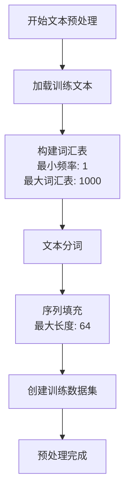
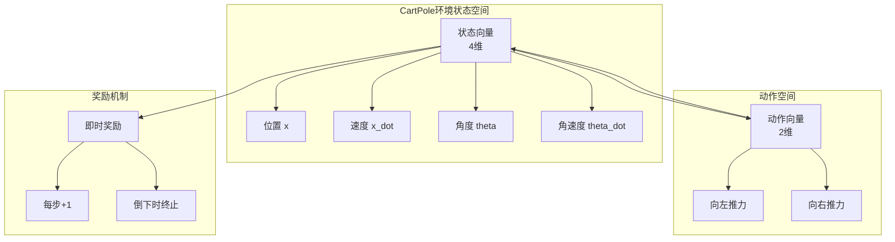
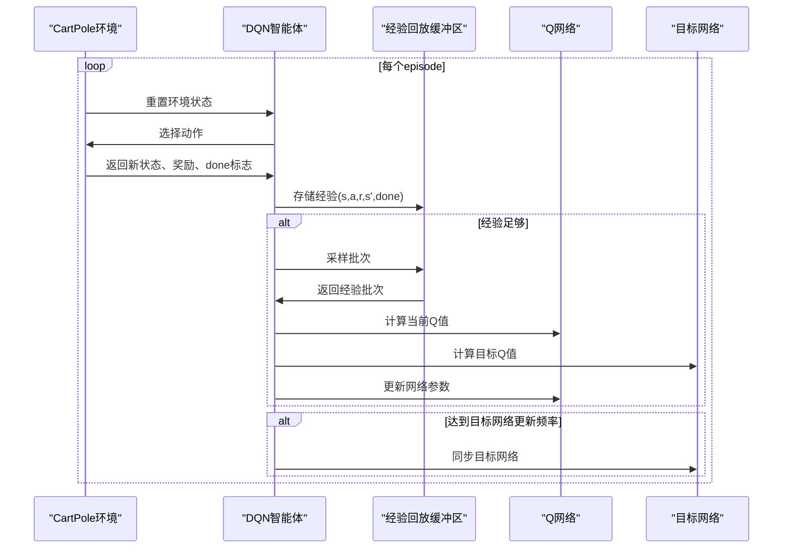

# 应用示例

<cite>
**本文档中引用的文件**
- [SimpleConvNetExample.java](file://tinyai-deeplearning-case/src/main/java/io/leavesfly/tinyai/example/cv/SimpleConvNetExample.java) - *更新了示例代码*
- [SimpleConvNet.java](file://tinyai-deeplearning-nnet/src/main/java/io/leavesfly/tinyai/nnet/block/SimpleConvNet.java) - *网络架构实现*
- [GPT2Demo.java](file://tinyai-model-gpt/src/main/java/io/leavesfly/tinyai/gpt2/GPT2Demo.java) - *GPT-2模型演示*
- [GPT3Demo.java](file://tinyai-model-gpt/src/main/java/io/leavesfly/tinyai/gpt3/GPT3Demo.java) - *新增GPT-3模型演示*
- [Qwen3Demo.java](file://tinyai-model-qwen/src/main/java/io/leavesfly/tinyai/qwen3/Qwen3Demo.java) - *新增Qwen3模型演示*
- [CartPoleDQNExample.java](file://tinyai-deeplearning-case/src/main/java/io/leavesfly/tinyai/example/rl/CartPoleDQNExample.java) - *强化学习示例*
</cite>

## 更新摘要
**变更内容**
- 根据代码变更更新了计算机视觉示例部分
- 新增了GPT-3模型应用示例
- 新增了Qwen3模型应用示例
- 更新了自然语言处理示例以反映最新实现
- 保持强化学习示例不变

## 目录
1. [简介](#简介)
2. [计算机视觉示例 - SimpleConvNet](#计算机视觉示例---simpleconvnet)
3. [自然语言处理示例 - GPT2](#自然语言处理示例---gpt2)
4. [自然语言处理示例 - GPT3](#自然语言处理示例---gpt3)
5. [自然语言处理示例 - Qwen3](#自然语言处理示例---qwen3)
6. [强化学习示例 - CartPoleDQN](#强化学习示例---cartpoledqn)
7. [最佳实践指南](#最佳实践指南)
8. [常见错误与解决方案](#常见错误与解决方案)
9. [总结](#总结)

## 简介

TinyAI框架提供了丰富的应用示例，涵盖了计算机视觉、自然语言处理和强化学习三大领域。这些示例不仅展示了如何使用TinyAI进行实际开发，还包含了完整的数据准备、模型训练和结果评估流程。通过这些示例，开发者可以快速掌握TinyAI的核心功能，并将其应用于自己的项目中。

## 计算机视觉示例 - SimpleConvNet

SimpleConvNet是一个增强的深度卷积神经网络实现，专门设计用于图像分类任务。它支持多种输入格式，包括MNIST手写数字识别和CIFAR-10图像分类。

### 卷积神经网络架构

SimpleConvNet采用经典的卷积神经网络架构，包含以下关键组件：

```mermaid
graph TB
subgraph "SimpleConvNet架构"
Input["输入图像<br/>28x28x1 或 32x32x3"]
subgraph "卷积块1"
Conv1["卷积层<br/>3x3 kernel"]
BN1["批量归一化"]
ReLU1["ReLU激活"]
Pool1["最大池化<br/>2x2"]
end
subgraph "卷积块2"
Conv2["卷积层<br/>3x3 kernel"]
BN2["批量归一化"]
ReLU2["ReLU激活"]
Pool2["最大池化<br/>2x2"]
end
subgraph "卷积块3"
Conv3["卷积层<br/>3x3 kernel"]
BN3["批量归一化"]
ReLU3["ReLU激活"]
Pool3["最大池化<br/>2x2"]
end
Flatten["展平层"]
FC1["全连接层<br/>隐藏节点128"]
BN4["批量归一化"]
ReLU4["ReLU激活"]
Dropout1["Dropout<br/>0.3-0.5"]
FC2["全连接层<br/>隐藏节点64"]
BN5["批量归一化"]
ReLU5["ReLU激活"]
Dropout2["Dropout<br/>0.3-0.5"]
Output["输出层<br/>类别数"]
end
Input --> Conv1
Conv1 --> BN1
BN1 --> ReLU1
ReLU1 --> Pool1
Pool1 --> Conv2
Conv2 --> BN2
BN2 --> ReLU2
ReLU2 --> Pool2
Pool2 --> Conv3
Conv3 --> BN3
BN3 --> ReLU3
ReLU3 --> Pool3
Pool3 --> Flatten
Flatten --> FC1
FC1 --> BN4
BN4 --> ReLU4
ReLU4 --> Dropout1
Dropout1 --> FC2
FC2 --> BN5
BN5 --> ReLU5
ReLU5 --> Dropout2
Dropout2 --> Output
```



**图表来源**
- [SimpleConvNet.java](file://tinyai-deeplearning-nnet/src/main/java/io/leavesfly/tinyai/nnet/block/SimpleConvNet.java#L30-L348)

### MNIST手写数字识别流程

MNIST手写数字识别是最经典的计算机视觉任务之一。SimpleConvNetExample展示了完整的MNIST识别流程：

#### 数据准备阶段

```java
// 创建模拟输入数据 (batch_size=2, channels=1, height=28, width=28)
Shape inputShape = Shape.of(2, 1, 28, 28);
NdArray inputData = NdArray.likeRandomN(inputShape);
Variable input = new Variable(inputData);
```

#### 模型构建阶段

```java
// 构建MNIST网络
SimpleConvNet convNet = SimpleConvNet.buildMnistConvNet();
System.out.println("✓ MNIST网络构建成功");
```

#### 前向传播阶段

```java
// 前向传播
Variable output = convNet.layerForward(input);
System.out.println("输出形状: " + output.getValue().getShape().toString());
```

#### 性能验证

```java
// 验证输出形状
Shape expectedOutput = Shape.of(2, 10);  // batch_size=2, num_classes=10
if (output.getValue().getShape().toString().equals(expectedOutput.toString())) {
    System.out.println("✓ 输出形状验证通过");
}
```

### CIFAR-10图像分类

CIFAR-10数据集包含10类彩色图像，每类1000张训练图像和1000张测试图像。SimpleConvNet支持CIFAR-10的完整配置：

```java
// 构建CIFAR-10网络
SimpleConvNet convNet = SimpleConvNet.buildCifar10ConvNet();
System.out.println("✓ CIFAR-10网络构建成功");

// 创建模拟输入数据 (batch_size=2, channels=3, height=32, width=32)
Shape inputShape = Shape.of(2, 3, 32, 32);
NdArray inputData = NdArray.likeRandomN(inputShape);
Variable input = new Variable(inputData);
```

### 自定义网络配置

SimpleConvNet还支持完全自定义的网络配置，可以根据不同的输入尺寸和任务需求进行调整：

```java
// 构建自定义网络 (64x64 RGB图像，5个类别)
SimpleConvNet convNet = SimpleConvNet.buildCustomConvNet(
    "CustomNet", 3, 64, 64, 5);
System.out.println("✓ 自定义网络构建成功");
```

**章节来源**
- [SimpleConvNetExample.java](file://tinyai-deeplearning-case/src/main/java/io/leavesfly/tinyai/example/cv/SimpleConvNetExample.java#L0-L151)
- [SimpleConvNet.java](file://tinyai-deeplearning-nnet/src/main/java/io/leavesfly/tinyai/nnet/block/SimpleConvNet.java#L274-L348)

## 自然语言处理示例 - GPT2

GPT2Demo展示了如何使用TinyAI框架构建和训练GPT-2语言模型，涵盖文本数据预处理、模型训练和文本生成的完整流程。

### 文本数据预处理

GPT2Demo首先创建分词器并构建词汇表：



**图表来源**
- [GPT2Demo.java](file://tinyai-model-gpt/src/main/java/io/leavesfly/tinyai/gpt2/GPT2Demo.java#L14-L94)

#### 模型创建与初始化

```java
// 创建小型GPT-2模型
GPT2Model model = GPT2Model.createSmallModel("demo_gpt2");

// 打印模型信息
model.printModelInfo();

// 验证输入
model.validateInput(inputTokens);
System.out.println("✓ 输入验证通过");
```

#### 前向传播与预测

```java
// 前向传播
Variable output = model.predict(inputTokens);
System.out.println("输出形状: " + output.getValue().getShape());
System.out.println("✓ 前向传播成功");

// 预测下一个token
int predictedToken = model.predictNextToken(inputTokens);
System.out.println("预测的下一个token ID: " + predictedToken);
System.out.println("✓ token预测成功");
```

#### 序列生成

```java
// 生成序列
NdArray generatedSeq = model.generateSequence(startTokens, 5);
System.out.println("生成序列形状: " + generatedSeq.getShape());

// 打印生成的序列
System.out.print("生成的序列: [");
for (int i = 0; i < generatedSeq.getShape().getDimension(1); i++) {
    System.out.print((int)generatedSeq.get(0, i));
    if (i < generatedSeq.getShape().getDimension(1) - 1) {
        System.out.print(", ");
    }
}
System.out.println("]");
System.out.println("✓ 序列生成成功");
```

**章节来源**
- [GPT2Demo.java](file://tinyai-model-gpt/src/main/java/io/leavesfly/tinyai/gpt2/GPT2Demo.java#L0-L94)

## 自然语言处理示例 - GPT3

GPT3Demo展示了如何使用TinyAI框架构建和训练GPT-3语言模型，涵盖模型创建、架构分析、前向传播、文本生成和Few-shot学习的完整流程。

### 模型创建演示

GPT3Demo支持创建不同规模的GPT-3模型：

```java
// 创建小型GPT-3模型（125M参数）
GPT3Model smallModel = GPT3Model.createSmallModel("gpt3-small");
System.out.println("✓ 小型模型创建成功");

// 创建中型GPT-3模型（350M参数）
GPT3Model mediumModel = GPT3Model.createMediumModel("gpt3-medium");
System.out.println("✓ 中型模型创建成功");

// 创建大型GPT-3模型（1.3B参数）
GPT3Model largeModel = GPT3Model.createLargeModel("gpt3-large");
System.out.println("✓ 大型模型创建成功");
```

**章节来源**
- [GPT3Demo.java](file://tinyai-model-gpt/src/main/java/io/leavesfly/tinyai/gpt3/GPT3Demo.java#L19-L386)

### 模型架构分析

GPT3Demo提供了详细的架构分析功能：

```mermaid
graph TD
A[GPT-3架构] --> B[解码器-only Transformer]
A --> C[Pre-LayerNorm结构]
A --> D[并行注意力和MLP计算]
A --> E[旋转位置编码(RoPE)]
A --> F[稀疏注意力机制]
A --> G[Few-shot学习能力]
```

**图表来源**
- [GPT3Demo.java](file://tinyai-model-gpt/src/main/java/io/leavesfly/tinyai/gpt3/GPT3Demo.java#L19-L386)

#### 架构特性

```java
System.out.println("📊 GPT-3关键特性:");
System.out.println("• 解码器-only Transformer架构");
System.out.println("• Pre-LayerNorm结构");
System.out.println("• 并行注意力和MLP计算");
System.out.println("• 旋转位置编码(RoPE)");
System.out.println("• 稀疏注意力机制（大型模型）");
System.out.println("• 强大的Few-shot学习能力");
```

### 前向传播演示

GPT3Demo展示了完整的前向传播流程：

```java
// 创建示例输入
NdArray inputTokens = NdArray.of(Shape.of(batchSize, seqLen));

// 执行前向传播
Variable output = model.forward(new Variable(inputTokens));

// 验证输出形状
Shape expectedShape = Shape.of(batchSize, seqLen, config.getVocabSize());
if (outputData.getShape().equals(expectedShape)) {
    System.out.println("✓ 输出形状验证通过");
}
```

### 文本生成演示

GPT3Demo展示了文本生成能力：

```java
// 生成文本
NdArray generated = model.generateSequence(startTokens, maxLength);
System.out.println("生成结果: " + arrayToString(generated));

// 单步预测
int nextToken = model.predictNextToken(testSeq);
System.out.println("输入: " + arrayToString(testSeq) + " -> 预测: " + nextToken);
```

### Few-shot学习演示

GPT3Demo展示了Few-shot学习能力：

```java
// 创建Few-shot上下文
NdArray context = NdArray.of(Shape.of(1, 20));

// 基于上下文生成
NdArray fewShotResult = model.fewShotGenerate(context, maxNewTokens);

System.out.println("💡 Few-shot学习优势:");
System.out.println("• 无需微调即可适应新任务");
System.out.println("• 通过示例快速理解任务模式");
System.out.println("• 支持多种任务类型");
System.out.println("• 展现强大的泛化能力");
```

### 旋转位置编码演示

GPT3Demo展示了旋转位置编码的实现：

```java
// 创建旋转位置编码
GPT3RotaryEmbedding rope = new GPT3RotaryEmbedding("demo_rope", rotaryDim, maxSeqLen);

// 生成位置编码
NdArray[] cosAndSin = rope.generateRotaryEmbedding(testSeqLen);

// 应用旋转变换
Variable[] rotated = rope.applyRotaryPositionEmbedding(
    new Variable(testQuery), new Variable(testKey), testSeqLen
);

System.out.println("🔍 RoPE优势:");
System.out.println("• 相对位置编码特性");
System.out.println("• 支持任意长度序列");
System.out.println("• 不增加参数量");
System.out.println("• 保持向量模长不变");
```

## 自然语言处理示例 - Qwen3

Qwen3Demo展示了如何使用基于TinyAI架构实现的Qwen3大语言模型，涵盖基本使用、架构分析和文本生成。

### 基本使用演示

Qwen3Demo展示了模型的基本使用方法：

```java
// 创建小型Qwen3模型
Qwen3Model model = Qwen3Model.createTinyModel("demo_qwen3");
System.out.println("✓ 创建了小型Qwen3模型");

// 准备输入数据
NdArray inputIds = NdArray.of(new float[]{1, 15, 25, 35, 45});
System.out.println("✓ 准备了输入序列");

// 前向传播
Variable logits = model.forwardWithLogits(new Variable(inputIds));
System.out.println("✓ 前向传播完成，输出形状: " + outputShape);

// 预测下一个token
int nextToken = model.predictNextToken(inputIds);
System.out.println("✓ 预测的下一个token ID: " + nextToken);
```

**章节来源**
- [Qwen3Demo.java](file://tinyai-model-qwen/src/main/java/io/leavesfly/tinyai/qwen3/Qwen3Demo.java#L14-L143)

### 模型架构演示

Qwen3Demo展示了模型的架构特性：

```java
// 打印模型信息
model.printModelInfo();

// 展示配置详情
Qwen3Config config = model.getConfig();
System.out.println("\n详细配置:");
System.out.println("- 每个注意力头维度: " + config.getHeadDim());
System.out.println("- KV头分组数: " + config.getNumKeyValueGroups());
System.out.println("- RoPE基础频率: " + config.getRopeTheta());
System.out.println("- RMSNorm epsilon: " + config.getRmsNormEps());
```

### 文本生成演示

Qwen3Demo展示了文本生成能力：

```java
// 单序列生成
NdArray prompt = NdArray.of(new float[]{10, 20, 30});
NdArray generated = model.generate(prompt, 10);
System.out.println("生成序列: " + arrayToString(generated));

// 批次生成
NdArray batchPrompt = NdArray.of(Shape.of(2, 3));
NdArray batchGenerated = model.generate(batchPrompt, 8);
System.out.println("批次生成:");
printBatchArray(batchGenerated);
```

## 强化学习示例 - CartPoleDQN

CartPoleDQNExample展示了如何使用深度Q网络（DQN）算法解决CartPole（倒立摆）控制问题。这是一个经典的强化学习环境，目标是通过控制小车的左右移动来平衡杆子。

### CartPole环境介绍

CartPole环境是一个连续控制问题，具有以下特征：



**图表来源**
- [CartPoleEnvironment.java](file://tinyai-deeplearning-rl/src/main/java/io/leavesfly/tinyai/rl/environment/CartPoleEnvironment.java#L0-L80)

### DQN算法实现

CartPoleDQNExample展示了完整的DQN算法实现，包括经验回放、目标网络和ε-greedy策略：



**图表来源**
- [CartPoleDQNExample.java](file://tinyai-deeplearning-case/src/main/java/io/leavesfly/tinyai/example/rl/CartPoleDQNExample.java#L71-L103)

### 智能体创建与配置

```java
private static DQNAgent createDQNAgent(Environment env) {
    // 网络参数
    int stateDim = env.getStateDim();           // 状态维度：4
    int actionDim = env.getActionDim();         // 动作维度：2
    int[] hiddenSizes = {128, 128};             // 隐藏层尺寸
    
    // 算法参数
    float learningRate = 0.001f;                // 学习率
    float epsilon = 1.0f;                       // 初始探索率
    float gamma = 0.99f;                        // 折扣因子
    int batchSize = 32;                         // 批次大小
    int bufferSize = 10000;                     // 经验回放缓冲区大小
    int targetUpdateFreq = 100;                 // 目标网络更新频率
    
    return new DQNAgent(
            "CartPole_DQN",
            stateDim, actionDim, hiddenSizes,
            learningRate, epsilon, gamma,
            batchSize, bufferSize, targetUpdateFreq
    );
}
```

### 训练过程监控

CartPoleDQNExample提供了详细的训练过程监控，包括：

```java
// 打印训练进度
if (episode % 50 == 0 || episode == numEpisodes - 1) {
    Map<String, Object> stats = agent.getTrainingStats();
    System.out.printf("Episode %d: 奖励=%.2f, 步数=%d, Epsilon=%.3f, 损失=%.6f, 缓冲区使用率=%.2f%%\n",
            episode, episodeReward, steps,
            (Float) stats.get("epsilon"),
            (Float) stats.get("average_loss"),
            (Float) stats.get("buffer_usage") * 100);
}
```

### 性能评估

```java
private static void evaluateAgent(DQNAgent agent, Environment env, int numEvaluationEpisodes) {
    // 切换到评估模式
    agent.setTraining(false);
    
    float totalReward = 0.0f;
    int totalSteps = 0;
    int successfulEpisodes = 0;
    
    for (int episode = 0; episode < numEvaluationEpisodes; episode++) {
        Variable state = env.reset();
        float episodeReward = 0.0f;
        int steps = 0;
        
        for (int step = 0; step < 500; step++) {
            Variable action = agent.selectAction(state);
            Environment.StepResult result = env.step(action);
            
            state = result.getNextState();
            episodeReward += result.getReward();
            steps++;
            
            if (result.isDone()) {
                break;
            }
        }
        
        totalReward += episodeReward;
        totalSteps += steps;
        
        if (episodeReward >= 450) { // 认为450+步为成功
            successfulEpisodes++;
        }
    }
    
    // 计算平均性能
    float averageReward = totalReward / numEvaluationEpisodes;
    float successRate = (float) successfulEpisodes / numEvaluationEpisodes * 100;
    
    System.out.println("评估结果:");
    System.out.printf("  平均奖励: %.2f\n", averageReward);
    System.out.printf("  成功率: %.1f%% (%d/%d)\n", successRate, successfulEpisodes, numEvaluationEpisodes);
}
```

**章节来源**
- [CartPoleDQNExample.java](file://tinyai-deeplearning-case/src/main/java/io/leavesfly/tinyai/example/rl/CartPoleDQNExample.java#L0-L241)

## 最佳实践指南

### 计算机视觉最佳实践

1. **数据预处理**
   - 确保输入图像尺寸与网络期望一致
   - 使用适当的归一化方法
   - 考虑数据增强技术提高泛化能力

2. **网络配置**
   - 根据输入尺寸自动调整Dropout率
   - 使用批量归一化提升训练稳定性
   - 合理设置卷积核大小和步长

3. **训练监控**
   - 定期保存模型权重
   - 监控训练和验证损失曲线
   - 使用早停机制防止过拟合

### 自然语言处理最佳实践

1. **文本预处理**
   - 选择合适的词汇表大小
   - 处理未知词和特殊标记
   - 考虑使用子词分割技术

2. **模型架构**
   - 根据任务复杂度调整模型大小
   - 使用适当的位置编码
   - 考虑使用注意力机制

3. **训练策略**
   - 使用学习率调度器
   - 实施梯度裁剪防止梯度爆炸
   - 监控生成文本的质量

### 强化学习最佳实践

1. **环境设计**
   - 确保奖励信号清晰且及时
   - 设计合理的状态和动作空间
   - 考虑使用奖励塑形技术

2. **算法调优**
   - 合理设置探索率衰减策略
   - 选择合适的经验回放缓冲区大小
   - 使用目标网络稳定训练

3. **性能评估**
   - 多次运行取平均结果
   - 关注长期性能而非短期奖励
   - 使用可视化工具分析智能体行为

## 常见错误与解决方案

### 计算机视觉常见问题

1. **输入尺寸不匹配**
   ```java
   // 错误：输入尺寸与网络期望不符
   Shape inputShape = Shape.of(2, 1, 32, 32); // 应该是28x28
   
   // 正确：使用正确的输入尺寸
   Shape inputShape = Shape.of(2, 1, 28, 28);
   ```

2. **内存不足**
   ```java
   // 问题：批次大小过大导致内存溢出
   // 解决：减小批次大小或使用梯度累积
   
   int batchSize = 32; // 可以尝试减小到16或更小
   ```

### 自然语言处理常见问题

1. **词汇表大小问题**
   ```java
   // 问题：词汇表太小导致OOV问题
   tokenizer.buildVocab(texts, 1, 500); // 词汇表可能太小
   
   // 解决：增加词汇表大小
   tokenizer.buildVocab(texts, 1, 1000); // 更大的词汇表
   ```

2. **序列长度截断**
   ```java
   // 问题：长文本被截断丢失信息
   // 解决：使用滑动窗口或动态截断
   
   int maxLength = 64; // 可以根据需要调整
   ```

### 强化学习常见问题

1. **奖励稀疏**
   ```java
   // 问题：奖励信号过于稀疏
   // 解决：设计更密集的奖励函数
   
   float reward = 1.0f; // 每步+1奖励
   if (done) {
       reward = -10.0f; // 倒下时给予惩罚
   }
   ```

2. **探索不足**
   ```java
   // 问题：智能体过早收敛到次优策略
   // 解决：实施更好的探索策略
   
   float epsilon = 1.0f; // 初始探索率较高
   float epsilonDecay = 0.995f; // 每步衰减探索率
   ```

## 总结

TinyAI框架的应用示例展示了如何在计算机视觉、自然语言处理和强化学习领域构建和训练深度学习模型。通过SimpleConvNetExample、GPT2Demo、GPT3Demo、Qwen3Demo和CartPoleDQNExample，开发者可以：

1. **理解核心概念**：掌握卷积神经网络、语言模型和深度强化学习的基本原理
2. **学习最佳实践**：获得数据预处理、模型训练和性能评估的最佳实践指导
3. **避免常见错误**：识别并解决在实际开发中可能遇到的问题
4. **扩展应用范围**：基于示例代码进行修改和扩展，满足特定需求

这些示例不仅提供了理论知识的实际应用，还展示了如何在真实场景中使用TinyAI框架构建高质量的机器学习系统。通过深入理解和实践这些示例，开发者可以更好地利用TinyAI的强大功能，推动人工智能技术的发展和应用。