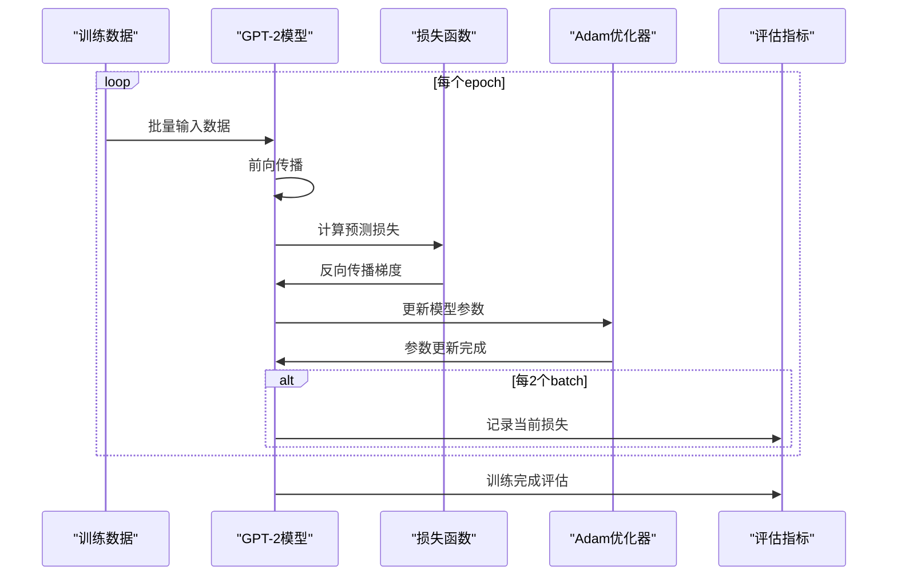
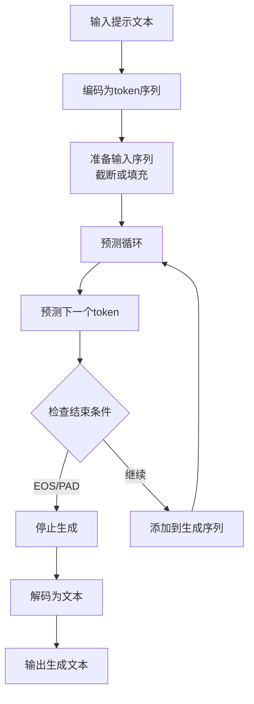

# 应用示例

<cite>
**本文档中引用的文件**
- [SimpleConvNetExample.java](file://tinyai-dl-case/src/main/java/io/leavesfly/tinyai/example/cv/SimpleConvNetExample.java)
- [SimpleConvNet.java](file://tinyai-dl-cv/src/main/java/io/leavesfly/tinyai/cv/SimpleConvNet.java)
- [SimpleConvNetDemo.java](file://tinyai-dl-cv/src/main/java/io/leavesfly/tinyai/cv/SimpleConvNetDemo.java)
- [SimpleConvNetTest.java](file://tinyai-dl-cv/src/test/java/io/leavesfly/tinyai/cv/SimpleConvNetTest.java)
- [GPT2Example.java](file://tinyai-model-gpt/src/main/java/io/leavesfly/tinyai/gpt/GPT2Example.java)
- [CartPoleDQNExample.java](file://tinyai-dl-case/src/main/java/io/leavesfly/tinyai/example/rl/CartPoleDQNExample.java)
- [CartPoleEnvironment.java](file://tinyai-dl-rl/src/main/java/io/leavesfly/tinyai/rl/environment/CartPoleEnvironment.java)
</cite>

## 目录
1. [简介](#简介)
2. [计算机视觉示例 - SimpleConvNet](#计算机视觉示例---simpleconvnet)
3. [自然语言处理示例 - GPT2](#自然语言处理示例---gpt2)
4. [强化学习示例 - CartPoleDQN](#强化学习示例---cartpoledqn)
5. [最佳实践指南](#最佳实践指南)
6. [常见错误与解决方案](#常见错误与解决方案)
7. [总结](#总结)

## 简介

TinyAI框架提供了丰富的应用示例，涵盖了计算机视觉、自然语言处理和强化学习三大领域。这些示例不仅展示了如何使用TinyAI进行实际开发，还包含了完整的数据准备、模型训练和结果评估流程。通过这些示例，开发者可以快速掌握TinyAI的核心功能，并将其应用于自己的项目中。

## 计算机视觉示例 - SimpleConvNet

SimpleConvNet是一个增强的深度卷积神经网络实现，专门设计用于图像分类任务。它支持多种输入格式，包括MNIST手写数字识别和CIFAR-10图像分类。

### 卷积神经网络架构

SimpleConvNet采用经典的卷积神经网络架构，包含以下关键组件：


**图表来源**
- [SimpleConvNet.java](file://tinyai-dl-cv/src/main/java/io/leavesfly/tinyai/cv/SimpleConvNet.java#L0-L32)

### MNIST手写数字识别流程

MNIST手写数字识别是最经典的计算机视觉任务之一。SimpleConvNetExample展示了完整的MNIST识别流程：

#### 数据准备阶段

```java
// 创建模拟输入数据 (batch_size=2, channels=1, height=28, width=28)
Shape inputShape = Shape.of(2, 1, 28, 28);
NdArray inputData = NdArray.likeRandomN(inputShape);
Variable input = new Variable(inputData);
```

#### 模型构建阶段

```java
// 构建MNIST网络
SimpleConvNet convNet = SimpleConvNet.buildMnistConvNet();
System.out.println("✓ MNIST网络构建成功");
```

#### 前向传播阶段

```java
// 前向传播
Variable output = convNet.layerForward(input);
System.out.println("输出形状: " + output.getValue().getShape().toString());
```

#### 性能验证

```java
// 验证输出形状
Shape expectedOutput = Shape.of(2, 10);  // batch_size=2, num_classes=10
if (output.getValue().getShape().toString().equals(expectedOutput.toString())) {
    System.out.println("✓ 输出形状验证通过");
}
```

### CIFAR-10图像分类

CIFAR-10数据集包含10类彩色图像，每类1000张训练图像和1000张测试图像。SimpleConvNet支持CIFAR-10的完整配置：

```java
// 构建CIFAR-10网络
SimpleConvNet convNet = SimpleConvNet.buildCifar10ConvNet();
System.out.println("✓ CIFAR-10网络构建成功");

// 创建模拟输入数据 (batch_size=2, channels=3, height=32, width=32)
Shape inputShape = Shape.of(2, 3, 32, 32);
NdArray inputData = NdArray.likeRandomN(inputShape);
Variable input = new Variable(inputData);
```

### 自定义网络配置

SimpleConvNet还支持完全自定义的网络配置，可以根据不同的输入尺寸和任务需求进行调整：

```java
// 构建自定义网络 (64x64 RGB图像，5个类别)
SimpleConvNet convNet = SimpleConvNet.buildCustomConvNet(
    "CustomNet", 3, 64, 64, 5);
System.out.println("✓ 自定义网络构建成功");
```

**章节来源**
- [SimpleConvNetExample.java](file://tinyai-dl-case/src/main/java/io/leavesfly/tinyai/example/cv/SimpleConvNetExample.java#L0-L139)
- [SimpleConvNet.java](file://tinyai-dl-cv/src/main/java/io/leavesfly/tinyai/cv/SimpleConvNet.java#L274-L348)

## 自然语言处理示例 - GPT2

GPT2Example展示了如何使用TinyAI框架构建和训练GPT-2语言模型，涵盖文本数据预处理、模型训练和文本生成的完整流程。

### 文本数据预处理

GPT2Example首先创建分词器并构建词汇表：


**图表来源**
- [GPT2Example.java](file://tinyai-model-gpt/src/main/java/io/leavesfly/tinyai/gpt/GPT2Example.java#L47-L85)

#### 词汇表构建

```java
private static SimpleTokenizer createTokenizer() {
    SimpleTokenizer tokenizer = new SimpleTokenizer();
    
    // 准备训练文本用于构建词汇表
    List<String> vocabTexts = getVocabularyTexts();
    
    // 构建词汇表
    tokenizer.buildVocab(vocabTexts, 1, 1000);  // 最小频率1，最大词汇表1000
    tokenizer.printVocabInfo();
    
    return tokenizer;
}
```

#### 训练数据集创建

```java
private static GPT2TextDataset createTrainingDataset(SimpleTokenizer tokenizer) {
    List<String> trainingTexts = getVocabularyTexts();
    
    GPT2TextDataset dataset = new GPT2TextDataset(
            "gpt2_training",
            trainingTexts,
            tokenizer,
            64,    // 最大序列长度
            4,     // 批次大小
            true   // 打乱数据
    );
    
    return dataset;
}
```

### GPT-2模型训练

GPT2Example展示了完整的模型训练流程，包括前向传播、损失计算、反向传播和参数更新：



**图表来源**
- [GPT2Example.java](file://tinyai-model-gpt/src/main/java/io/leavesfly/tinyai/gpt/GPT2Example.java#L115-L175)

#### 训练循环实现

```java
for (int epoch = 0; epoch < epochs; epoch++) {
    System.out.println("\n--- Epoch " + (epoch + 1) + "/" + epochs + " ---");
    
    dataset.prepare();
    List<Batch> batches = dataset.getBatches();
    
    float totalLoss = 0.0f;
    int batchCount = 0;
    
    for (Batch batch : batches) {
        // 前向传播
        Variable predictions = model.forward(new Variable(batch.getX()[0]));
        
        // 计算损失
        Variable targets = new Variable(batch.getY()[0]);
        Variable loss = lossFunction.loss(predictions, targets);
        
        // 反向传播
        loss.backward();
        
        // 更新参数
        optimizer.update();
        
        // 清除梯度
        model.clearGrads();
        
        if (batchCount % 2 == 0) {
            System.out.println("  Batch " + batchCount + ", Loss: " +
                    String.format("%.4f", lossValue));
        }
    }
}
```

### 文本生成过程

GPT2Example展示了如何使用训练好的模型生成连贯的文本：



**图表来源**
- [GPT2Example.java](file://tinyai-model-gpt/src/main/java/io/leavesfly/tinyai/gpt/GPT2Example.java#L220-L280)

#### 文本生成实现

```java
private static String generateFromPrompt(GPT2Model gpt2Model, SimpleTokenizer tokenizer,
                                         String prompt, int maxNewTokens) {
    // 编码提示
    int[] promptTokens = tokenizer.encode(prompt, false);
    
    List<Integer> generatedTokens = new ArrayList<>();
    for (int token : promptTokens) {
        generatedTokens.add(token);
    }
    
    // 生成新token
    for (int i = 0; i < maxNewTokens; i++) {
        // 准备输入序列
        int[] inputTokens = new int[Math.min(generatedTokens.size(), gpt2Model.getMaxSeqLength())];
        int startIdx = Math.max(0, generatedTokens.size() - gpt2Model.getMaxSeqLength());
        
        for (int j = 0; j < inputTokens.length; j++) {
            inputTokens[j] = generatedTokens.get(startIdx + j);
        }
        
        // 预测下一个token
        int nextToken = gpt2Model.predictNextToken(input);
        
        // 检查是否是结束token
        if (nextToken == SimpleTokenizer.EOS_ID || nextToken == SimpleTokenizer.PAD_ID) {
            break;
        }
        
        generatedTokens.add(nextToken);
    }
    
    // 解码生成的文本
    int[] allTokens = generatedTokens.stream().mapToInt(Integer::intValue).toArray();
    return tokenizer.decode(allTokens, true);
}
```

**章节来源**
- [GPT2Example.java](file://tinyai-model-gpt/src/main/java/io/leavesfly/tinyai/gpt/GPT2Example.java#L0-L306)

## 强化学习示例 - CartPoleDQN

CartPoleDQNExample展示了如何使用深度Q网络（DQN）算法解决CartPole（倒立摆）控制问题。这是一个经典的强化学习环境，目标是通过控制小车的左右移动来平衡杆子。

### CartPole环境介绍

CartPole环境是一个连续控制问题，具有以下特征：


**图表来源**
- [CartPoleEnvironment.java](file://tinyai-dl-rl/src/main/java/io/leavesfly/tinyai/rl/environment/CartPoleEnvironment.java#L0-L80)

### DQN算法实现

CartPoleDQNExample展示了完整的DQN算法实现，包括经验回放、目标网络和ε-greedy策略：


**图表来源**
- [CartPoleDQNExample.java](file://tinyai-dl-case/src/main/java/io/leavesfly/tinyai/example/rl/CartPoleDQNExample.java#L71-L103)

### 智能体创建与配置

```java
private static DQNAgent createDQNAgent(Environment env) {
    // 网络参数
    int stateDim = env.getStateDim();           // 状态维度：4
    int actionDim = env.getActionDim();         // 动作维度：2
    int[] hiddenSizes = {128, 128};             // 隐藏层尺寸
    
    // 算法参数
    float learningRate = 0.001f;                // 学习率
    float epsilon = 1.0f;                       // 初始探索率
    float gamma = 0.99f;                        // 折扣因子
    int batchSize = 32;                         // 批次大小
    int bufferSize = 10000;                     // 经验回放缓冲区大小
    int targetUpdateFreq = 100;                 // 目标网络更新频率
    
    return new DQNAgent(
            "CartPole_DQN",
            stateDim, actionDim, hiddenSizes,
            learningRate, epsilon, gamma,
            batchSize, bufferSize, targetUpdateFreq
    );
}
```

### 训练过程监控

CartPoleDQNExample提供了详细的训练过程监控，包括：

```java
// 打印训练进度
if (episode % 50 == 0 || episode == numEpisodes - 1) {
    Map<String, Object> stats = agent.getTrainingStats();
    System.out.printf("Episode %d: 奖励=%.2f, 步数=%d, Epsilon=%.3f, 损失=%.6f, 缓冲区使用率=%.2f%%\n",
            episode, episodeReward, steps,
            (Float) stats.get("epsilon"),
            (Float) stats.get("average_loss"),
            (Float) stats.get("buffer_usage") * 100);
}
```

### 性能评估

```java
private static void evaluateAgent(DQNAgent agent, Environment env, int numEvaluationEpisodes) {
    // 切换到评估模式
    agent.setTraining(false);
    
    float totalReward = 0.0f;
    int totalSteps = 0;
    int successfulEpisodes = 0;
    
    for (int episode = 0; episode < numEvaluationEpisodes; episode++) {
        Variable state = env.reset();
        float episodeReward = 0.0f;
        int steps = 0;
        
        for (int step = 0; step < 500; step++) {
            Variable action = agent.selectAction(state);
            Environment.StepResult result = env.step(action);
            
            state = result.getNextState();
            episodeReward += result.getReward();
            steps++;
            
            if (result.isDone()) {
                break;
            }
        }
        
        totalReward += episodeReward;
        totalSteps += steps;
        
        if (episodeReward >= 450) { // 认为450+步为成功
            successfulEpisodes++;
        }
    }
    
    // 计算平均性能
    float averageReward = totalReward / numEvaluationEpisodes;
    float successRate = (float) successfulEpisodes / numEvaluationEpisodes * 100;
    
    System.out.println("评估结果:");
    System.out.printf("  平均奖励: %.2f\n", averageReward);
    System.out.printf("  成功率: %.1f%% (%d/%d)\n", successRate, successfulEpisodes, numEvaluationEpisodes);
}
```

**章节来源**
- [CartPoleDQNExample.java](file://tinyai-dl-case/src/main/java/io/leavesfly/tinyai/example/rl/CartPoleDQNExample.java#L0-L241)

## 最佳实践指南

### 计算机视觉最佳实践

1. **数据预处理**
   - 确保输入图像尺寸与网络期望一致
   - 使用适当的归一化方法
   - 考虑数据增强技术提高泛化能力

2. **网络配置**
   - 根据输入尺寸自动调整Dropout率
   - 使用批量归一化提升训练稳定性
   - 合理设置卷积核大小和步长

3. **训练监控**
   - 定期保存模型权重
   - 监控训练和验证损失曲线
   - 使用早停机制防止过拟合

### 自然语言处理最佳实践

1. **文本预处理**
   - 选择合适的词汇表大小
   - 处理未知词和特殊标记
   - 考虑使用子词分割技术

2. **模型架构**
   - 根据任务复杂度调整模型大小
   - 使用适当的位置编码
   - 考虑使用注意力机制

3. **训练策略**
   - 使用学习率调度器
   - 实施梯度裁剪防止梯度爆炸
   - 监控生成文本的质量

### 强化学习最佳实践

1. **环境设计**
   - 确保奖励信号清晰且及时
   - 设计合理的状态和动作空间
   - 考虑使用奖励塑形技术

2. **算法调优**
   - 合理设置探索率衰减策略
   - 选择合适的经验回放缓冲区大小
   - 使用目标网络稳定训练

3. **性能评估**
   - 多次运行取平均结果
   - 关注长期性能而非短期奖励
   - 使用可视化工具分析智能体行为

## 常见错误与解决方案

### 计算机视觉常见问题

1. **输入尺寸不匹配**
   ```java
   // 错误：输入尺寸与网络期望不符
   Shape inputShape = Shape.of(2, 1, 32, 32); // 应该是28x28
   
   // 正确：使用正确的输入尺寸
   Shape inputShape = Shape.of(2, 1, 28, 28);
   ```

2. **内存不足**
   ```java
   // 问题：批次大小过大导致内存溢出
   // 解决：减小批次大小或使用梯度累积
   
   int batchSize = 32; // 可以尝试减小到16或更小
   ```

### 自然语言处理常见问题

1. **词汇表大小问题**
   ```java
   // 问题：词汇表太小导致OOV问题
   tokenizer.buildVocab(texts, 1, 500); // 词汇表可能太小
   
   // 解决：增加词汇表大小
   tokenizer.buildVocab(texts, 1, 1000); // 更大的词汇表
   ```

2. **序列长度截断**
   ```java
   // 问题：长文本被截断丢失信息
   // 解决：使用滑动窗口或动态截断
   
   int maxLength = 64; // 可以根据需要调整
   ```

### 强化学习常见问题

1. **奖励稀疏**
   ```java
   // 问题：奖励信号过于稀疏
   // 解决：设计更密集的奖励函数
   
   float reward = 1.0f; // 每步+1奖励
   if (done) {
       reward = -10.0f; // 倒下时给予惩罚
   }
   ```

2. **探索不足**
   ```java
   // 问题：智能体过早收敛到次优策略
   // 解决：实施更好的探索策略
   
   float epsilon = 1.0f; // 初始探索率较高
   float epsilonDecay = 0.995f; // 每步衰减探索率
   ```

## 总结

TinyAI框架的应用示例展示了如何在计算机视觉、自然语言处理和强化学习领域构建和训练深度学习模型。通过SimpleConvNetExample、GPT2Example和CartPoleDQNExample，开发者可以：

1. **理解核心概念**：掌握卷积神经网络、语言模型和深度强化学习的基本原理
2. **学习最佳实践**：获得数据预处理、模型训练和性能评估的最佳实践指导
3. **避免常见错误**：识别并解决在实际开发中可能遇到的问题
4. **扩展应用范围**：基于示例代码进行修改和扩展，满足特定需求

这些示例不仅提供了理论知识的实际应用，还展示了如何在真实场景中使用TinyAI框架构建高质量的机器学习系统。通过深入理解和实践这些示例，开发者可以更好地利用TinyAI的强大功能，推动人工智能技术的发展和应用。