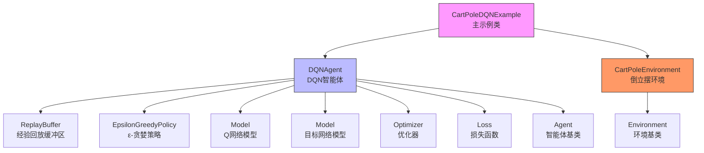
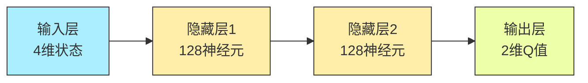
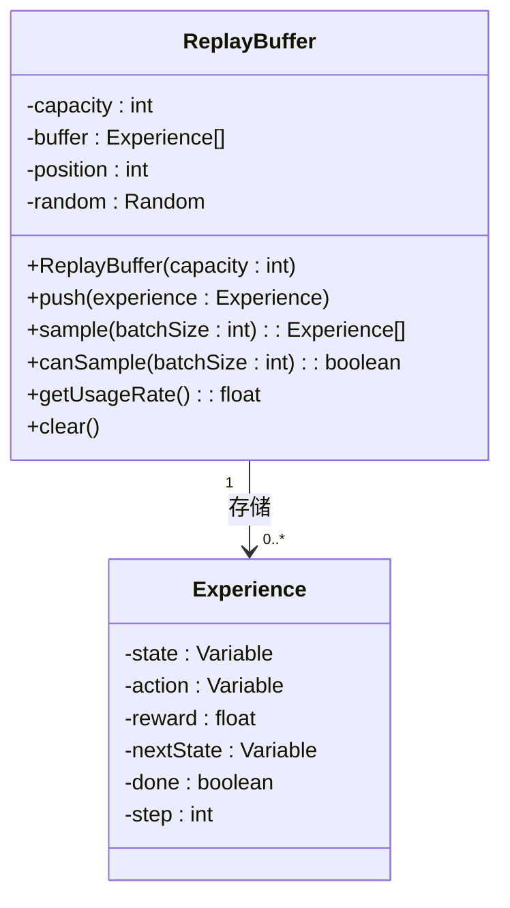
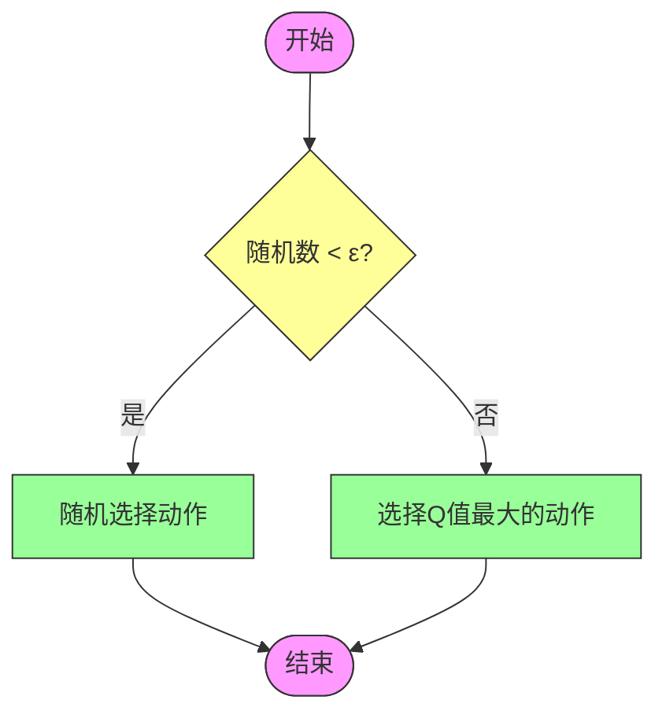
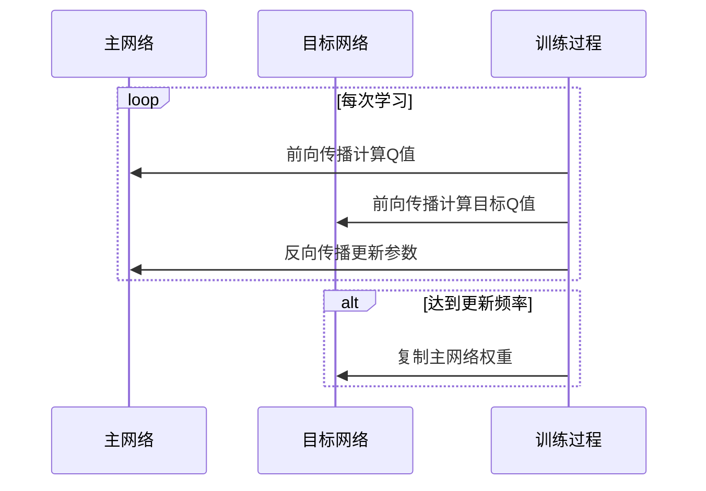
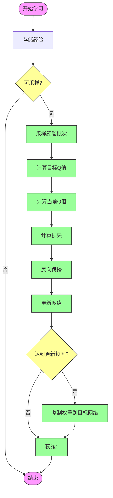
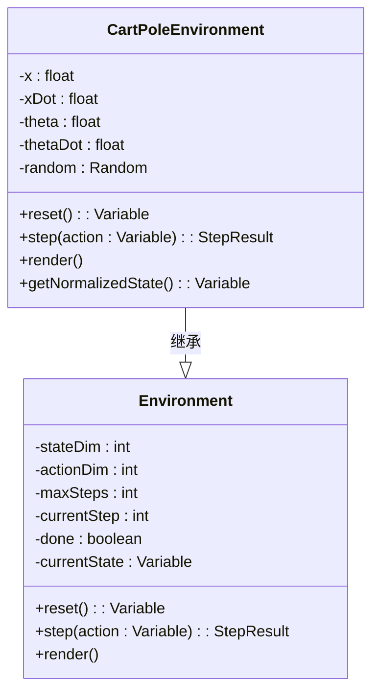
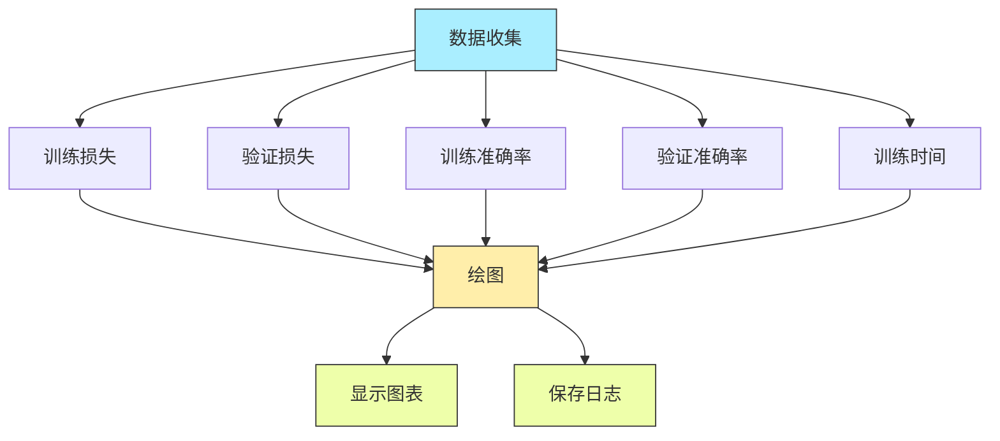

# DQN算法示例：CartPole环境

<cite>
**本文档引用的文件**   
- [CartPoleDQNExample.java](file://tinyai-dl-case/src/main/java/io/leavesfly/tinyai/example/rl/CartPoleDQNExample.java)
- [DQNAgent.java](file://tinyai-dl-rl/src/main/java/io/leavesfly/tinyai/rl/agent/DQNAgent.java)
- [ReplayBuffer.java](file://tinyai-dl-rl/src/main/java/io/leavesfly/tinyai/rl/ReplayBuffer.java)
- [EpsilonGreedyPolicy.java](file://tinyai-dl-rl/src/main/java/io/leavesfly/tinyai/rl/policy/EpsilonGreedyPolicy.java)
- [CartPoleEnvironment.java](file://tinyai-dl-rl/src/main/java/io/leavesfly/tinyai/rl/environment/CartPoleEnvironment.java)
- [Monitor.java](file://tinyai-dl-ml/src/main/java/io/leavesfly/tinyai/ml/Monitor.java)
</cite>

## 目录
1. [项目结构](#项目结构)
2. [核心组件](#核心组件)
3. [Q网络结构设计](#q网络结构设计)
4. [经验回放缓冲区](#经验回放缓冲区)
5. [ε-贪婪策略实现](#ε-贪婪策略实现)
6. [目标网络更新机制](#目标网络更新机制)
7. [动作选择与价值函数优化](#动作选择与价值函数优化)
8. [观测空间与动作空间定义](#观测空间与动作空间定义)
9. [训练曲线可视化](#训练曲线可视化)
10. [超参数调优建议](#超参数调优建议)
11. [训练稳定性与收敛速度提升](#训练稳定性与收敛速度提升)

## 项目结构

**图源**
- [CartPoleDQNExample.java](file://tinyai-dl-case/src/main/java/io/leavesfly/tinyai/example/rl/CartPoleDQNExample.java)
- [DQNAgent.java](file://tinyai-dl-rl/src/main/java/io/leavesfly/tinyai/rl/agent/DQNAgent.java)
- [CartPoleEnvironment.java](file://tinyai-dl-rl/src/main/java/io/leavesfly/tinyai/rl/environment/CartPoleEnvironment.java)

**本节来源**
- [CartPoleDQNExample.java](file://tinyai-dl-case/src/main/java/io/leavesfly/tinyai/example/rl/CartPoleDQNExample.java)
- [DQNAgent.java](file://tinyai-dl-rl/src/main/java/io/leavesfly/tinyai/rl/agent/DQNAgent.java)
- [CartPoleEnvironment.java](file://tinyai-dl-rl/src/main/java/io/leavesfly/tinyai/rl/environment/CartPoleEnvironment.java)

## 核心组件

DQN算法在CartPole环境中的实现主要由以下几个核心组件构成：DQNAgent作为智能体核心，负责决策和学习；CartPoleEnvironment作为环境，提供状态转移和奖励信号；ReplayBuffer用于存储和采样经验数据；EpsilonGreedyPolicy实现探索与利用的平衡；以及Q网络和目标网络用于价值函数的逼近和稳定训练。

**本节来源**
- [CartPoleDQNExample.java](file://tinyai-dl-case/src/main/java/io/leavesfly/tinyai/example/rl/CartPoleDQNExample.java#L1-L50)
- [DQNAgent.java](file://tinyai-dl-rl/src/main/java/io/leavesfly/tinyai/rl/agent/DQNAgent.java#L1-L50)

## Q网络结构设计

DQN算法使用多层感知机（MLP）作为Q网络来逼近状态-动作价值函数。在CartPole环境中，Q网络的输入是4维的状态向量（位置、速度、角度、角速度），输出是2维的动作价值向量（左移、右移）。网络结构由两个隐藏层组成，每层128个神经元，形成4→128→128→2的全连接网络架构。Q网络通过前向传播计算给定状态下各动作的Q值，为智能体提供决策依据。

**图源**
- [DQNAgent.java](file://tinyai-dl-rl/src/main/java/io/leavesfly/tinyai/rl/agent/DQNAgent.java#L100-L120)
- [CartPoleDQNExample.java](file://tinyai-dl-case/src/main/java/io/leavesfly/tinyai/example/rl/CartPoleDQNExample.java#L60-L70)

**本节来源**
- [DQNAgent.java](file://tinyai-dl-rl/src/main/java/io/leavesfly/tinyai/rl/agent/DQNAgent.java#L95-L130)
- [CartPoleDQNExample.java](file://tinyai-dl-case/src/main/java/io/leavesfly/tinyai/example/rl/CartPoleDQNExample.java#L55-L75)

## 经验回放缓冲区

经验回放缓冲区（ReplayBuffer）是DQN算法的关键组件，用于存储智能体与环境交互产生的经验数据。每个经验包含当前状态、采取的动作、获得的奖励、下一状态和终止标志。ReplayBuffer实现了固定大小的循环缓冲区，当缓冲区满时会覆盖最旧的经验。通过随机采样机制，可以从缓冲区中抽取经验批次进行学习，打破数据间的相关性，提高学习的稳定性和数据利用率。

**图源**
- [ReplayBuffer.java](file://tinyai-dl-rl/src/main/java/io/leavesfly/tinyai/rl/ReplayBuffer.java#L15-L50)
- [DQNAgent.java](file://tinyai-dl-rl/src/main/java/io/leavesfly/tinyai/rl/agent/DQNAgent.java#L30-L40)

**本节来源**
- [ReplayBuffer.java](file://tinyai-dl-rl/src/main/java/io/leavesfly/tinyai/rl/ReplayBuffer.java#L1-L100)
- [DQNAgent.java](file://tinyai-dl-rl/src/main/java/io/leavesfly/tinyai/rl/agent/DQNAgent.java#L30-L45)

## ε-贪婪策略实现

ε-贪婪策略是DQN算法中平衡探索与利用的核心机制。该策略以ε的概率随机选择动作（探索），以1-ε的概率选择当前Q值最大的动作（利用）。在训练初期，ε值较大，鼓励智能体进行更多探索；随着训练进行，ε值按指数衰减（衰减率0.995），逐渐减少探索，增加利用。这种策略确保智能体既能发现新的有效策略，又能充分利用已学到的知识。

**图源**
- [EpsilonGreedyPolicy.java](file://tinyai-dl-rl/src/main/java/io/leavesfly/tinyai/rl/policy/EpsilonGreedyPolicy.java#L50-L80)
- [DQNAgent.java](file://tinyai-dl-rl/src/main/java/io/leavesfly/tinyai/rl/agent/DQNAgent.java#L140-L150)

**本节来源**
- [EpsilonGreedyPolicy.java](file://tinyai-dl-rl/src/main/java/io/leavesfly/tinyai/rl/policy/EpsilonGreedyPolicy.java#L1-L100)
- [DQNAgent.java](file://tinyai-dl-rl/src/main/java/io/leavesfly/tinyai/rl/agent/DQNAgent.java#L135-L155)

## 目标网络更新机制

目标网络是DQN算法稳定训练的关键技术。DQNAgent维护两个网络：主网络（model）和目标网络（targetModel）。主网络用于选择动作和计算当前Q值，目标网络用于计算目标Q值。目标网络的参数定期从主网络复制（硬更新），更新频率由targetUpdateFreq参数控制（默认每100步更新一次）。这种机制减少了Q值估计的波动，避免了训练过程中的振荡和发散。

**图源**
- [DQNAgent.java](file://tinyai-dl-rl/src/main/java/io/leavesfly/tinyai/rl/agent/DQNAgent.java#L220-L240)
- [CartPoleDQNExample.java](file://tinyai-dl-case/src/main/java/io/leavesfly/tinyai/example/rl/CartPoleDQNExample.java#L70-L80)

**本节来源**
- [DQNAgent.java](file://tinyai-dl-rl/src/main/java/io/leavesfly/tinyai/rl/agent/DQNAgent.java#L180-L200)
- [DQNAgent.java](file://tinyai-dl-rl/src/main/java/io/leavesfly/tinyai/rl/agent/DQNAgent.java#L220-L240)

## 动作选择与价值函数优化

DQNAgent通过selectAction方法选择动作，在训练模式下使用ε-贪婪策略，在评估模式下总是选择贪婪动作。价值函数优化通过learn方法实现：首先将经验存入回放缓冲区，当缓冲区有足够的经验时，随机采样一个批次进行学习。学习过程计算当前Q值和目标Q值之间的均方误差损失，通过反向传播更新主网络参数。目标Q值的计算使用Bellman方程：r + γ * max(Q(s', a'))，其中γ是折扣因子。

**图源**
- [DQNAgent.java](file://tinyai-dl-rl/src/main/java/io/leavesfly/tinyai/rl/agent/DQNAgent.java#L160-L240)
- [DQNAgent.java](file://tinyai-dl-rl/src/main/java/io/leavesfly/tinyai/rl/agent/DQNAgent.java#L240-L300)

**本节来源**
- [DQNAgent.java](file://tinyai-dl-rl/src/main/java/io/leavesfly/tinyai/rl/agent/DQNAgent.java#L155-L300)
- [CartPoleDQNExample.java](file://tinyai-dl-case/src/main/java/io/leavesfly/tinyai/example/rl/CartPoleDQNExample.java#L100-L150)

## 观测空间与动作空间定义

CartPoleEnvironment定义了倒立摆问题的观测空间和动作空间。观测空间是4维连续向量，包含小车位置、小车速度、杆子角度和杆子角速度。动作空间是2维离散空间，0表示向左推，1表示向右推。环境通过物理方程模拟状态转移，每步给予+1的奖励，当小车位置超出±2.4或杆子角度超出±12度时回合结束。最大步数限制为500步，成功平衡杆子需要达到450步以上。

**图源**
- [CartPoleEnvironment.java](file://tinyai-dl-rl/src/main/java/io/leavesfly/tinyai/rl/environment/CartPoleEnvironment.java#L50-L100)
- [DQNAgent.java](file://tinyai-dl-rl/src/main/java/io/leavesfly/tinyai/rl/agent/DQNAgent.java#L50-L60)

**本节来源**
- [CartPoleEnvironment.java](file://tinyai-dl-rl/src/main/java/io/leavesfly/tinyai/rl/environment/CartPoleEnvironment.java#L1-L150)
- [DQNAgent.java](file://tinyai-dl-rl/src/main/java/io/leavesfly/tinyai/rl/agent/DQNAgent.java#L50-L60)

## 训练曲线可视化

训练过程的监控和可视化通过Monitor类实现。Monitor收集训练损失、验证损失、训练准确率和验证准确率等指标，并提供plot方法绘制训练曲线。在CartPoleDQNExample中，可以通过DQNAgent的getTrainingStats方法获取训练统计信息，包括平均损失、探索率、缓冲区使用率等。这些数据可以用于分析训练过程的收敛性和稳定性，帮助调试和优化算法。

**图源**
- [Monitor.java](file://tinyai-dl-ml/src/main/java/io/leavesfly/tinyai/ml/Monitor.java#L180-L230)
- [DQNAgent.java](file://tinyai-dl-rl/src/main/java/io/leavesfly/tinyai/rl/agent/DQNAgent.java#350-L370)

**本节来源**
- [Monitor.java](file://tinyai-dl-ml/src/main/java/io/leavesfly/tinyai/ml/Monitor.java#L1-L300)
- [DQNAgent.java](file://tinyai-dl-rl/src/main/java/io/leavesfly/tinyai/rl/agent/DQNAgent.java#350-L370)

## 超参数调优建议

DQN算法的性能高度依赖于超参数的选择。关键超参数包括：学习率（learningRate）、初始探索率（epsilon）、折扣因子（gamma）、批次大小（batchSize）、经验回放缓冲区大小（bufferSize）和目标网络更新频率（targetUpdateFreq）。建议的学习率范围是0.001-0.01，初始探索率0.9-1.0，折扣因子0.95-0.99。较大的批次大小和缓冲区大小通常能提高稳定性，但会增加内存消耗。目标网络更新频率不宜过小，建议在50-200之间。

**本节来源**
- [CartPoleDQNExample.java](file://tinyai-dl-case/src/main/java/io/leavesfly/tinyai/example/rl/CartPoleDQNExample.java#L55-L80)
- [DQNAgent.java](file://tinyai-dl-rl/src/main/java/io/leavesfly/tinyai/rl/agent/DQNAgent.java#L80-L100)
- [ModelInfo.java](file://tinyai-dl-ml/src/main/java/io/leavesfly/tinyai/ml/ModelInfo.java#L350-L430)

## 训练稳定性与收敛速度提升

提升DQN训练稳定性和收敛速度的关键策略包括：使用目标网络减少Q值估计的波动，经验回放打破数据相关性，ε-贪婪策略平衡探索与利用。此外，可以考虑使用Adam优化器替代SGD，它能自适应调整学习率。适当增加隐藏层大小可以提高模型表达能力，但过大的网络可能导致过拟合。定期评估智能体性能，监控损失曲线和探索率变化，有助于及时发现和解决训练问题。

**本节来源**
- [DQNAgent.java](file://tinyai-dl-rl/src/main/java/io/leavesfly/tinyai/rl/agent/DQNAgent.java#L180-L240)
- [Monitor.java](file://tinyai-dl-ml/src/main/java/io/leavesfly/tinyai/ml/Monitor.java#L360-L400)
- [Adam.java](file://tinyai-dl-ml/src/main/java/io/leavesfly/tinyai/ml/optimize/Adam.java#L1-L50)