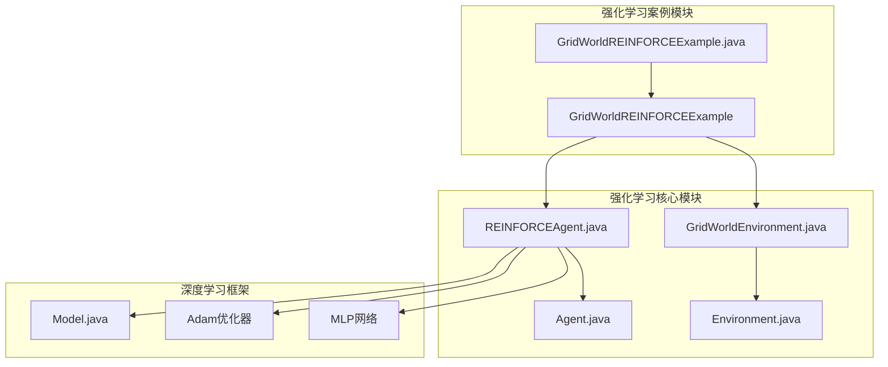
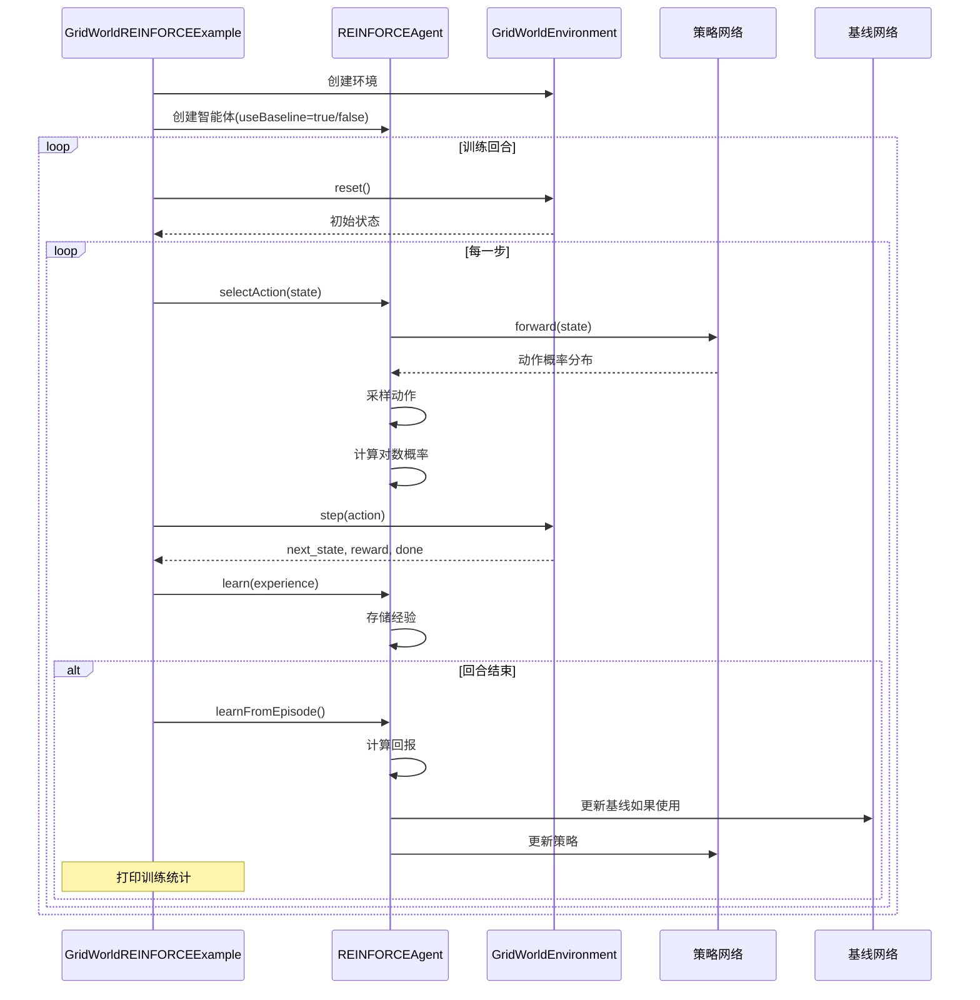
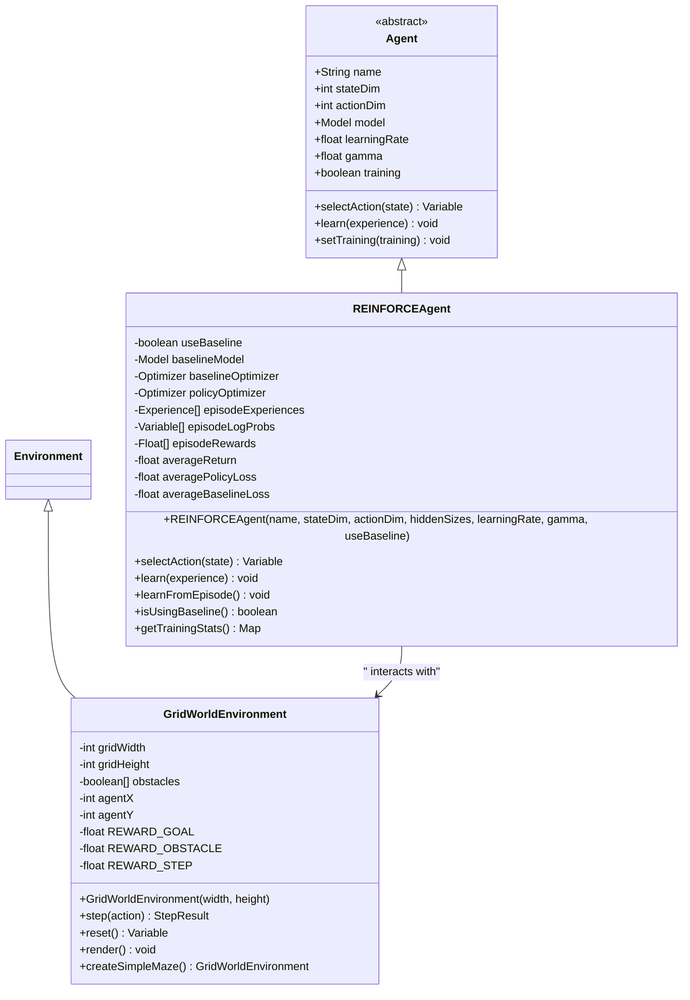
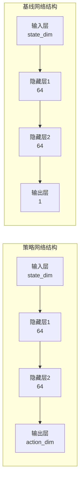
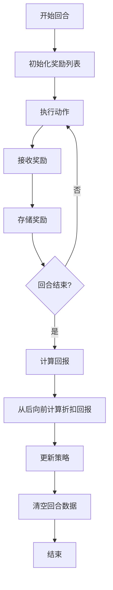
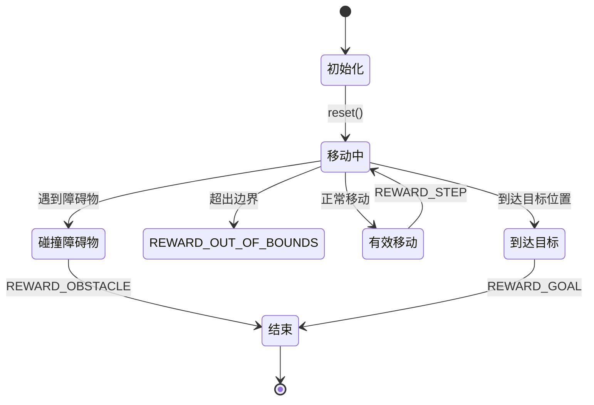

# REINFORCE算法示例：GridWorld环境

<cite>
**本文档引用的文件**
- [GridWorldREINFORCEExample.java](file://tinyai-dl-case/src/main/java/io/leavesfly/tinyai/example/rl/GridWorldREINFORCEExample.java)
- [REINFORCEAgent.java](file://tinyai-dl-rl/src/main/java/io/leavesfly/tinyai/rl/agent/REINFORCEAgent.java)
- [GridWorldEnvironment.java](file://tinyai-dl-rl/src/main/java/io/leavesfly/tinyai/rl/environment/GridWorldEnvironment.java)
- [Agent.java](file://tinyai-dl-rl/src/main/java/io/leavesfly/tinyai/rl/Agent.java)
- [Environment.java](file://tinyai-dl-rl/src/main/java/io/leavesfly/tinyai/rl/Environment.java)
</cite>

## 目录
1. [简介](#简介)
2. [项目结构](#项目结构)
3. [核心组件](#核心组件)
4. [架构概览](#架构概览)
5. [详细组件分析](#详细组件分析)
6. [策略梯度算法实现](#策略梯度算法实现)
7. [GridWorld环境分析](#gridworld环境分析)
8. [性能考虑](#性能考虑)
9. [故障排除指南](#故障排除指南)
10. [结论](#结论)

## 简介

GridWorldREINFORCEExample是一个完整的强化学习示例，展示了如何使用策略梯度方法（REINFORCE算法）来解决网格世界导航问题。该示例包含了策略网络的概率分布输出、回合制奖励累积、优势函数计算与梯度更新方向等关键概念。

REINFORCE算法是一种基于蒙特卡洛方法的策略梯度算法，它直接优化策略网络，通过采样动作并更新策略参数来最大化长期回报。本示例特别强调了策略梯度的高方差问题及其缓解策略，如基线（baseline）引入和奖励归一化处理。

## 项目结构



**图表来源**
- [GridWorldREINFORCEExample.java](file://tinyai-dl-case/src/main/java/io/leavesfly/tinyai/example/rl/GridWorldREINFORCEExample.java#L1-L293)
- [REINFORCEAgent.java](file://tinyai-dl-rl/src/main/java/io/leavesfly/tinyai/rl/agent/REINFORCEAgent.java#L1-L488)
- [GridWorldEnvironment.java](file://tinyai-dl-rl/src/main/java/io/leavesfly/tinyai/rl/environment/GridWorldEnvironment.java#L1-L392)

**章节来源**
- [GridWorldREINFORCEExample.java](file://tinyai-dl-case/src/main/java/io/leavesfly/tinyai/example/rl/GridWorldREINFORCEExample.java#L1-L293)

## 核心组件

### REINFORCEAgent智能体

REINFORCEAgent是本示例的核心组件，实现了经典的策略梯度算法REINFORCE。它具有以下主要特性：

- **直接优化策略网络**：输出动作概率分布
- **蒙特卡洛方法**：使用完整回合的数据计算回报
- **策略梯度定理**：通过梯度上升更新策略参数
- **基线支持**：可选的基线网络减少方差

### GridWorldEnvironment环境

GridWorldEnvironment实现了经典的网格世界导航问题：

- **状态空间**：智能体的位置坐标 [x, y]
- **动作空间**：4个方向 [上, 下, 左, 右]
- **奖励机制**：到达目标+10，碰撞障碍物-1，每步-0.01

**章节来源**
- [REINFORCEAgent.java](file://tinyai-dl-rl/src/main/java/io/leavesfly/tinyai/rl/agent/REINFORCEAgent.java#L28-L90)
- [GridWorldEnvironment.java](file://tinyai-dl-rl/src/main/java/io/leavesfly/tinyai/rl/environment/GridWorldEnvironment.java#L25-L87)

## 架构概览



**图表来源**
- [GridWorldREINFORCEExample.java](file://tinyai-dl-case/src/main/java/io/leavesfly/tinyai/example/rl/GridWorldREINFORCEExample.java#L60-L120)
- [REINFORCEAgent.java](file://tinyai-dl-rl/src/main/java/io/leavesfly/tinyai/rl/agent/REINFORCEAgent.java#L130-L180)

## 详细组件分析

### REINFORCEAgent类结构



**图表来源**
- [REINFORCEAgent.java](file://tinyai-dl-rl/src/main/java/io/leavesfly/tinyai/rl/agent/REINFORCEAgent.java#L28-L90)
- [GridWorldEnvironment.java](file://tinyai-dl-rl/src/main/java/io/leavesfly/tinyai/rl/environment/GridWorldEnvironment.java#L25-L87)

### 策略网络架构

REINFORCEAgent使用多层感知机（MLP）作为策略网络：



**图表来源**
- [REINFORCEAgent.java](file://tinyai-dl-rl/src/main/java/io/leavesfly/tinyai/rl/agent/REINFORCEAgent.java#L92-L120)

**章节来源**
- [REINFORCEAgent.java](file://tinyai-dl-rl/src/main/java/io/leavesfly/tinyai/rl/agent/REINFORCEAgent.java#L28-L120)

## 策略梯度算法实现

### 动态动作选择

REINFORCEAgent采用概率分布采样策略：

```java
@Override
public Variable selectAction(Variable state) {
    // 前向传播获取动作概率分布
    Variable logits = model.forward(state);
    
    // 应用Softmax获取概率分布
    Variable probabilities = applySoftmax(logits);
    
    // 根据概率分布采样动作
    int action = sampleFromProbabilities(probabilities);
    
    // 计算对数概率并存储（用于训练）
    if (training) {
        Variable logProb = computeLogProbability(probabilities, action);
        episodeLogProbs.add(logProb);
    }
    
    return new Variable(NdArray.of(action));
}
```

### 回合制奖励累积



**图表来源**
- [REINFORCEAgent.java](file://tinyai-dl-rl/src/main/java/io/leavesfly/tinyai/rl/agent/REINFORCEAgent.java#L130-L180)

### 优势函数计算与梯度更新

优势函数的计算是策略梯度的核心：

```java
private void updatePolicy(List<Float> returns, List<Float> baselines) {
    float totalPolicyLoss = 0.0f;
    
    for (int i = 0; i < episodeLogProbs.size(); i++) {
        Variable logProb = episodeLogProbs.get(i);
        float returnValue = returns.get(i);
        
        // 计算优势函数
        float advantage = returnValue;
        if (baselines != null) {
            advantage -= baselines.get(i);
        }
        
        // 策略梯度：-log(π(a|s)) * A
        Variable advantageVar = new Variable(NdArray.of(-advantage));
        Variable policyLoss = logProb.mul(advantageVar);
        
        // 反向传播
        model.clearGrads();
        policyLoss.backward();
        policyOptimizer.update();
        
        totalPolicyLoss += policyLoss.getValue().getNumber().floatValue();
    }
    
    // 更新策略损失统计
    averagePolicyLoss = totalPolicyLoss / episodeLogProbs.size();
}
```

### 基线网络实现

基线网络用于减少策略梯度的方差：

```java
private void updateBaseline(List<Float> returns) {
    float totalBaselineLoss = 0.0f;
    
    for (int i = 0; i < episodeExperiences.size(); i++) {
        Variable state = episodeExperiences.get(i).getState();
        Variable predictedValue = baselineModel.forward(state);
        Variable targetValue = new Variable(NdArray.of(returns.get(i)));
        
        // 计算MSE损失
        Variable loss = computeMSELoss(predictedValue, targetValue);
        
        // 反向传播
        baselineModel.clearGrads();
        loss.backward();
        baselineOptimizer.update();
        
        totalBaselineLoss += loss.getValue().getNumber().floatValue();
    }
    
    // 更新基线损失统计
    averageBaselineLoss = totalBaselineLoss / episodeExperiences.size();
}
```

**章节来源**
- [REINFORCEAgent.java](file://tinyai-dl-rl/src/main/java/io/leavesfly/tinyai/rl/agent/REINFORCEAgent.java#L130-L350)

## GridWorld环境分析

### 状态转移逻辑

GridWorldEnvironment实现了完整的状态转移机制：



**图表来源**
- [GridWorldEnvironment.java](file://tinyai-dl-rl/src/main/java/io/leavesfly/tinyai/rl/environment/GridWorldEnvironment.java#L110-L180)

### 奖励机制设计

GridWorldEnvironment采用了多层次的奖励设计：

- **到达目标**：+10.0f（强烈鼓励）
- **碰撞障碍物**：-1.0f（避免障碍物）
- **越界**：-1.0f（避免超出边界）
- **每步移动**：-0.01f（鼓励快速到达）

这种奖励设计平衡了探索与利用，既鼓励智能体尽快到达目标，又避免过度冒险。

### 环境可视化

```java
@Override
public void render() {
    System.out.println("=== GridWorld Step " + currentStep + " ===");

    for (int y = 0; y < gridHeight; y++) {
        for (int x = 0; x < gridWidth; x++) {
            if (x == agentX && y == agentY) {
                System.out.print(" A "); // Agent
            } else if (x == goalX && y == goalY) {
                System.out.print(" G "); // Goal
            } else if (isObstacle(x, y)) {
                System.out.print(" # "); // Obstacle
            } else {
                System.out.print(" . "); // Empty
            }
        }
        System.out.println();
    }

    System.out.println("位置: (" + agentX + ", " + agentY + ")");
    System.out.println("目标: (" + goalX + ", " + goalY + ")");
    System.out.println("步数: " + currentStep + "/" + maxSteps);
    System.out.println("完成: " + done);
    System.out.println();
}
```

**章节来源**
- [GridWorldEnvironment.java](file://tinyai-dl-rl/src/main/java/io/leavesfly/tinyai/rl/environment/GridWorldEnvironment.java#L110-L220)

## 性能考虑

### 训练效率优化

1. **批量处理**：虽然REINFORCE通常是回合制学习，但支持批次更新
2. **内存管理**：及时清理回合数据，避免内存泄漏
3. **统计更新**：使用滑动平均计算统计指标

### 方差控制策略

1. **基线网络**：引入价值函数作为基线，显著降低方差
2. **奖励归一化**：在某些情况下可以考虑归一化奖励
3. **探索策略**：虽然REINFORCE不使用epsilon，但可以通过其他方式控制探索

### 收敛性分析

- **学习率调度**：建议使用学习率衰减策略
- **训练步数**：2000回合对于简单迷宫足够，复杂环境可能需要更多
- **评估频率**：每200回合评估一次，平衡性能与效率

## 故障排除指南

### 常见问题及解决方案

1. **策略不收敛**
   - 检查学习率设置
   - 验证奖励函数设计
   - 确认基线网络正确更新

2. **高方差问题**
   - 启用基线网络
   - 调整学习率
   - 增加训练回合数

3. **过早终止**
   - 检查最大步数设置
   - 验证环境配置
   - 确认奖励信号

### 调试技巧

- 使用`getTrainingStats()`查看训练统计
- 启用详细日志输出
- 可视化策略变化过程

**章节来源**
- [GridWorldREINFORCEExample.java](file://tinyai-dl-case/src/main/java/io/leavesfly/tinyai/example/rl/GridWorldREINFORCEExample.java#L120-L200)

## 结论

GridWorldREINFORCEExample提供了一个完整的策略梯度算法实现，展示了以下关键技术要点：

1. **策略网络设计**：通过MLP网络输出动作概率分布
2. **回合制学习**：使用完整回合数据计算蒙特卡洛回报
3. **优势函数**：结合基线网络减少方差
4. **梯度更新**：基于策略梯度定理的参数更新
5. **环境设计**：清晰的状态转移和奖励机制

该示例特别强调了策略梯度算法的高方差问题，并通过基线网络的有效引入提供了实用的解决方案。通过对比使用基线和不使用基线的两种配置，开发者可以直观理解基线在网络训练中的重要作用。

REINFORCE算法作为策略梯度方法的基础，为更复杂的Actor-Critic算法奠定了重要基础。本示例不仅展示了理论概念的实际应用，也为进一步研究和开发提供了良好的起点。