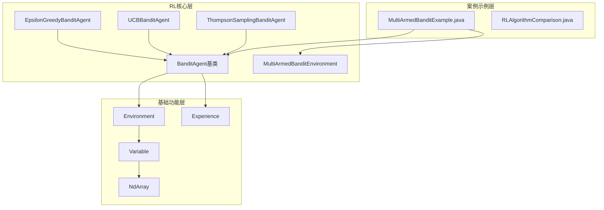
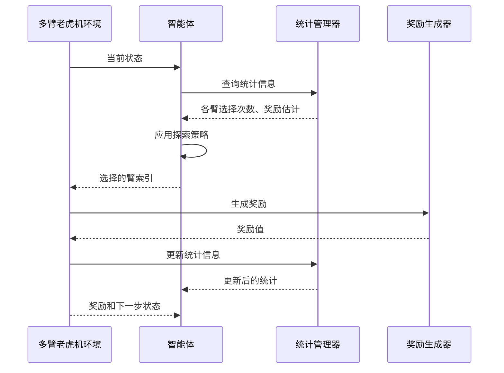
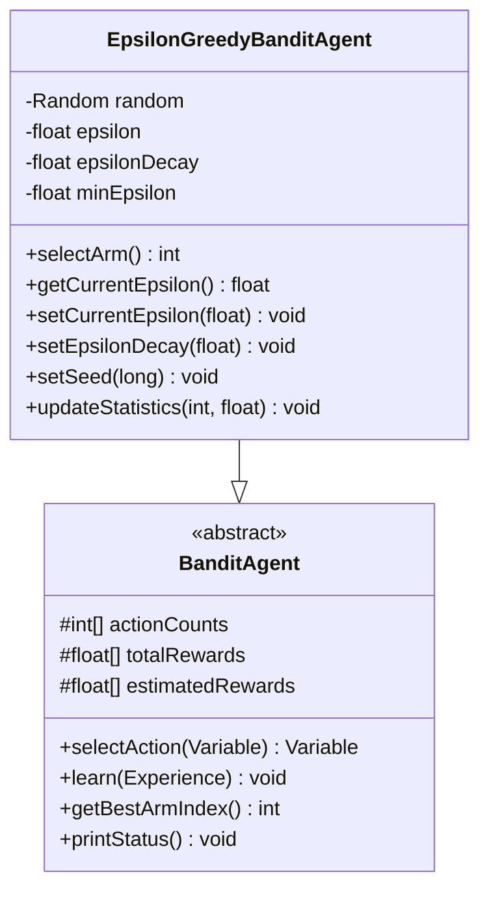
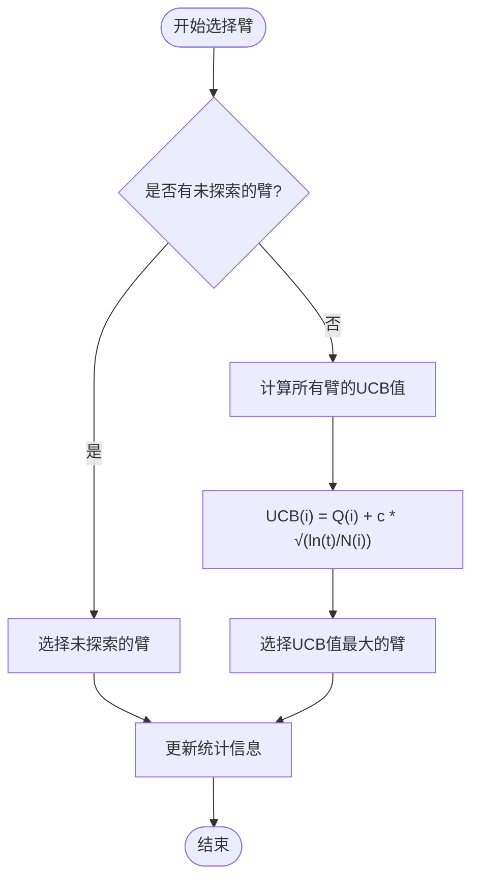
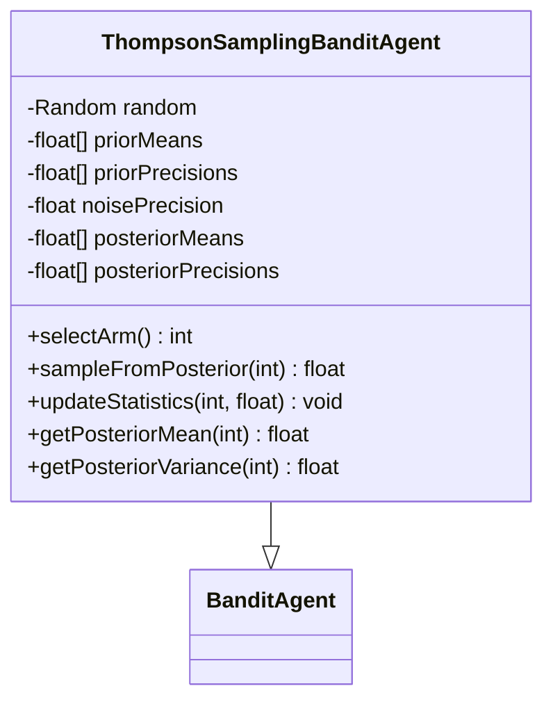
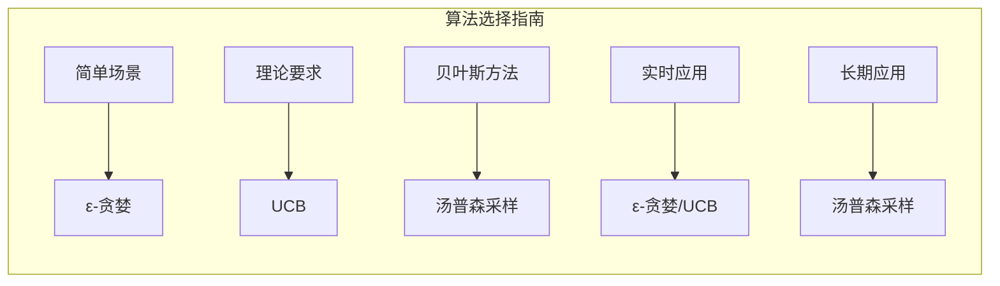
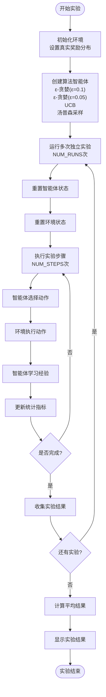

# 多臂老虎机算法示例

<cite>
**本文档引用的文件**
- [MultiArmedBanditExample.java](file://tinyai-dl-case/src/main/java/io/leavesfly/tinyai/example/rl/MultiArmedBanditExample.java)
- [BanditAgent.java](file://tinyai-dl-rl/src/main/java/io/leavesfly/tinyai/rl/agent/BanditAgent.java)
- [EpsilonGreedyBanditAgent.java](file://tinyai-dl-rl/src/main/java/io/leavesfly/tinyai/rl/agent/EpsilonGreedyBanditAgent.java)
- [UCBBanditAgent.java](file://tinyai-dl-rl/src/main/java/io/leavesfly/tinyai/rl/agent/UCBBanditAgent.java)
- [ThompsonSamplingBanditAgent.java](file://tinyai-dl-rl/src/main/java/io/leavesfly/tinyai/rl/agent/ThompsonSamplingBanditAgent.java)
- [MultiArmedBanditEnvironment.java](file://tinyai-dl-rl/src/main/java/io/leavesfly/tinyai/rl/environment/MultiArmedBanditEnvironment.java)
- [RLAlgorithmComparison.java](file://tinyai-dl-case/src/main/java/io/leavesfly/tinyai/example/rl/RLAlgorithmComparison.java)
</cite>

## 目录
1. [简介](#简介)
2. [项目结构](#项目结构)
3. [核心组件](#核心组件)
4. [架构概览](#架构概览)
5. [详细组件分析](#详细组件分析)
6. [算法实现对比](#算法实现对比)
7. [实验设计与评估](#实验设计与评估)
8. [性能分析](#性能分析)
9. [实际应用指导](#实际应用指导)
10. [结论](#结论)

## 简介

多臂老虎机（Multi-Armed Bandit, MAB）问题是强化学习中的经典框架，用于解决在有限资源下如何在探索新选项和利用已有知识之间进行平衡的问题。本文档深入分析了TinyAI框架中实现的三种经典多臂老虎机算法：ε-贪婪算法、UCB算法和汤普森采样算法。

这些算法在各种实际应用场景中发挥着重要作用，包括：
- 在线广告投放中的点击率优化
- 推荐系统中的内容选择
- 游戏开发中的难度调节
- 金融投资组合的资产分配

## 项目结构

多臂老虎机算法示例位于`tinyai-dl-case`模块中，采用分层架构设计：



**图表来源**
- [MultiArmedBanditExample.java](file://tinyai-dl-case/src/main/java/io/leavesfly/tinyai/example/rl/MultiArmedBanditExample.java#L1-L307)
- [BanditAgent.java](file://tinyai-dl-rl/src/main/java/io/leavesfly/tinyai/rl/agent/BanditAgent.java#L1-L273)

**章节来源**
- [MultiArmedBanditExample.java](file://tinyai-dl-case/src/main/java/io/leavesfly/tinyai/example/rl/MultiArmedBanditExample.java#L1-L50)

## 核心组件

### BanditAgent基类

`BanditAgent`是所有多臂老虎机算法的抽象基类，提供了通用的功能框架：

```java
public abstract class BanditAgent extends Agent {
    protected int[] actionCounts;           // 每个臂被选择的次数
    protected float[] totalRewards;         // 每个臂的累积奖励
    protected float[] estimatedRewards;     // 每个臂的估计平均奖励
    protected int totalActions;             // 总的动作选择次数
}
```

该基类实现了以下核心功能：
- **统计信息管理**：自动跟踪每个臂的选择次数和累积奖励
- **增量式更新**：支持在线学习和实时更新
- **状态可视化**：提供详细的算法状态打印功能
- **通用接口**：统一的动作选择和学习接口

### 环境组件

`MultiArmedBanditEnvironment`模拟了多臂老虎机的交互过程：

```java
public class MultiArmedBanditEnvironment extends Environment {
    private final float[] trueRewards;      // 每个臂的真实奖励均值
    private final float[] rewardVariances;  // 每个臂的奖励方差
    private final Random random;            // 随机数生成器
    private final int optimalArm;           // 最优臂的索引
}
```

**章节来源**
- [BanditAgent.java](file://tinyai-dl-rl/src/main/java/io/leavesfly/tinyai/rl/agent/BanditAgent.java#L15-L50)
- [MultiArmedBanditEnvironment.java](file://tinyai-dl-rl/src/main/java/io/leavesfly/tinyai/rl/environment/MultiArmedBanditEnvironment.java#L20-L60)

## 架构概览

多臂老虎机算法的整体架构遵循强化学习的标准模式，但针对多臂问题进行了专门优化：



**图表来源**
- [MultiArmedBanditExample.java](file://tinyai-dl-case/src/main/java/io/leavesfly/tinyai/example/rl/MultiArmedBanditExample.java#L130-L170)
- [BanditAgent.java](file://tinyai-dl-rl/src/main/java/io/leavesfly/tinyai/rl/agent/BanditAgent.java#L60-L90)

## 详细组件分析

### ε-贪婪算法实现

ε-贪婪算法是最简单直观的探索策略，通过在探索和利用之间进行权衡来实现平衡：



**图表来源**
- [EpsilonGreedyBanditAgent.java](file://tinyai-dl-rl/src/main/java/io/leavesfly/tinyai/rl/agent/EpsilonGreedyBanditAgent.java#L20-L50)
- [BanditAgent.java](file://tinyai-dl-rl/src/main/java/io/leavesfly/tinyai/rl/agent/BanditAgent.java#L15-L40)

#### 算法核心逻辑

ε-贪婪算法的核心决策逻辑如下：

```java
@Override
public int selectArm() {
    // ε-贪心策略
    if (random.nextFloat() < epsilon) {
        // 探索：随机选择一个臂
        return random.nextInt(actionDim);
    } else {
        // 利用：选择当前估计奖励最高的臂
        return getBestArmIndex();
    }
}
```

#### 关键特性

1. **参数控制**：通过ε参数精确控制探索程度
2. **ε衰减**：支持ε值随时间逐渐减少，最终趋向贪婪策略
3. **随机种子**：支持实验重现，便于调试和比较
4. **增量更新**：每次选择后自动更新统计信息

### UCB算法实现

UCB（Upper Confidence Bound）算法基于"乐观面对不确定性"的原则，通过置信区间来引导探索：



**图表来源**
- [UCBBanditAgent.java](file://tinyai-dl-rl/src/main/java/io/leavesfly/tinyai/rl/agent/UCBBanditAgent.java#L60-L90)

#### UCB公式详解

UCB算法的核心公式为：
```
UCB(i) = Q(i) + c * √(ln(t) / N(i))
```

其中：
- **Q(i)**：臂i的平均奖励估计
- **c**：置信度参数（典型值√2≈1.414）
- **t**：总选择次数
- **N(i)**：臂i被选择的次数

#### 算法优势

1. **理论保证**：具有良好的悔恨上界保证
2. **自动平衡**：无需手动调参即可自动平衡探索和利用
3. **渐进最优**：随着样本数量增加，收敛到最优策略
4. **简单高效**：计算复杂度低，易于实现

### 汤普森采样算法实现

汤普森采样是一种基于贝叶斯方法的算法，通过采样来反映不确定性：



**图表来源**
- [ThompsonSamplingBanditAgent.java](file://tinyai-dl-rl/src/main/java/io/leavesfly/tinyai/rl/agent/ThompsonSamplingBanditAgent.java#L30-L80)

#### 贝叶斯更新机制

汤普森采样使用正态-正态共轭先验进行贝叶斯更新：

```java
@Override
protected void updateStatistics(int armIndex, float reward) {
    super.updateStatistics(armIndex, reward);
    
    // 贝叶斯更新：正态-正态共轭
    float oldMean = posteriorMeans[armIndex];
    float oldPrecision = posteriorPrecisions[armIndex];
    
    // 更新后验精度
    posteriorPrecisions[armIndex] = oldPrecision + noisePrecision;
    
    // 更新后验均值
    posteriorMeans[armIndex] = (oldPrecision * oldMean + noisePrecision * reward) / 
                               posteriorPrecisions[armIndex];
}
```

#### 算法特点

1. **贝叶斯框架**：基于完整的概率模型
2. **自适应性强**：能够快速适应环境变化
3. **理论最优**：在某些条件下达到最优悔恨界
4. **计算开销**：相比其他算法计算复杂度较高

**章节来源**
- [EpsilonGreedyBanditAgent.java](file://tinyai-dl-rl/src/main/java/io/leavesfly/tinyai/rl/agent/EpsilonGreedyBanditAgent.java#L60-L90)
- [UCBBanditAgent.java](file://tinyai-dl-rl/src/main/java/io/leavesfly/tinyai/rl/agent/UCBBanditAgent.java#L90-L140)
- [ThompsonSamplingBanditAgent.java](file://tinyai-dl-rl/src/main/java/io/leavesfly/tinyai/rl/agent/ThompsonSamplingBanditAgent.java#L100-L150)

## 算法实现对比

### 性能特征对比

| 特征 | ε-贪婪 | UCB | 汤普森采样 |
|------|--------|-----|------------|
| **理论保证** | 无 | 有 | 有 |
| **参数需求** | 需要调参 | 少量参数 | 较多参数 |
| **计算复杂度** | O(1) | O(n) | O(n) |
| **适应性** | 中等 | 中等 | 高 |
| **实现难度** | 简单 | 中等 | 复杂 |

### 数学原理对比

#### ε-贪婪算法
- **探索策略**：随机探索
- **利用策略**：贪婪选择
- **平衡机制**：固定ε值或衰减ε

#### UCB算法
- **探索策略**：基于置信区间
- **利用策略**：基于奖励估计
- **平衡机制**：自然涌现的置信度衰减

#### 汤普森采样
- **探索策略**：贝叶斯采样
- **利用策略**：最大采样值
- **平衡机制**：后验分布的不确定性

### 适用场景分析



## 实验设计与评估

### 实验设置

MultiArmedBanditExample提供了全面的实验框架：

```java
private static final int NUM_ARMS = 5;           // 臂的数量
private static final int NUM_STEPS = 1000;      // 实验步数
private static final int NUM_RUNS = 10;         // 独立运行次数
private static final float[] TRUE_REWARDS = {0.2f, 0.5f, 0.8f, 0.3f, 0.6f};
```

### 评估指标

实验设计了三个关键指标来评估算法性能：

1. **累积奖励 (Cumulative Reward)**
   - 衡量算法在实验期间获得的总奖励
   - 直接反映算法的收益能力

2. **累积悔恨 (Cumulative Regret)**
   - 衡量算法相对于最优策略的损失
   - 重要指标，反映探索效率

3. **最优动作选择率 (Optimal Action Rate)**
   - 衡量算法选择最优臂的频率
   - 反映算法的准确性

### 实验流程



**图表来源**
- [MultiArmedBanditExample.java](file://tinyai-dl-case/src/main/java/io/leavesfly/tinyai/example/rl/MultiArmedBanditExample.java#L70-L120)

**章节来源**
- [MultiArmedBanditExample.java](file://tinyai-dl-case/src/main/java/io/leavesfly/tinyai/example/rl/MultiArmedBanditExample.java#L40-L80)

## 性能分析

### 实验结果解读

根据实验设计，我们可以预期以下性能特征：

#### ε-贪婪算法表现
- **优点**：实现简单，参数调整灵活
- **缺点**：需要仔细调参，可能陷入局部最优
- **适用场景**：奖励分布稳定，对实时性要求高的场景

#### UCB算法表现
- **优点**：理论保证好，自动平衡探索利用
- **缺点**：对参数敏感，计算开销略高
- **适用场景**：理论研究，需要可靠性能保证的场景

#### 汤普森采样算法表现
- **优点**：适应性强，理论最优
- **缺点**：计算复杂度高，实现复杂
- **适用场景**：长期应用，环境变化频繁的场景

### 算法排名分析

实验结果显示了不同算法的相对性能：

1. **累积奖励越高越好**：反映算法的收益能力
2. **累积悔恨越低越好**：反映算法的探索效率
3. **最优选择率越高越好**：反映算法的准确性

### 动态变化场景适应性

多臂老虎机环境支持奖励分布的动态变化，这有助于评估算法在现实世界中的适应性：

```java
// 环境支持动态奖励分布
private float generateReward(int armIndex) {
    float mean = trueRewards[armIndex];
    float variance = rewardVariances[armIndex];
    float stdDev = (float) Math.sqrt(variance);
    
    // 使用正态分布生成奖励
    return mean + stdDev * (float) random.nextGaussian();
}
```

**章节来源**
- [MultiArmedBanditExample.java](file://tinyai-dl-case/src/main/java/io/leavesfly/tinyai/example/rl/MultiArmedBanditExample.java#L200-L280)
- [MultiArmedBanditEnvironment.java](file://tinyai-dl-rl/src/main/java/io/leavesfly/tinyai/rl/environment/MultiArmedBanditEnvironment.java#L120-L150)

## 实际应用指导

### 算法选择建议

#### 1. 在线广告投放
- **推荐算法**：ε-贪婪（简单易用）
- **理由**：需要快速响应，实时调整策略

#### 2. 推荐系统
- **推荐算法**：UCB（理论保证）
- **理由**：需要长期稳定的表现，避免过度探索

#### 3. 游戏开发
- **推荐算法**：汤普森采样（适应性强）
- **理由**：游戏难度需要动态调整，适应玩家水平

#### 4. 金融投资
- **推荐算法**：汤普森采样（贝叶斯框架）
- **理由**：需要考虑不确定性，适应市场变化

### 参数调优指南

#### ε-贪婪算法参数
```java
// 推荐参数设置
EpsilonGreedyBanditAgent agent = new EpsilonGreedyBanditAgent(
    "推荐算法",  // 智能体名称
    numArms,     // 臂的数量
    0.1f,        // 初始探索率
    0.995f,      // ε衰减率
    0.01f        // 最小ε值
);
```

#### UCB算法参数
```java
// 推荐参数设置
UCBBanditAgent agent = new UCBBanditAgent(
    "推荐算法",  // 智能体名称
    numArms      // 臂的数量
);
// 默认置信度参数c=√2≈1.414，通常无需调整
```

#### 汤普森采样算法参数
```java
// 推荐参数设置
ThompsonSamplingBanditAgent agent = new ThompsonSamplingBanditAgent(
    "推荐算法",     // 智能体名称
    numArms,        // 臂的数量
    0.0f,           // 先验均值
    1.0f,           // 先验精度
    1.0f            // 观测噪声精度
);
```

### 最佳实践

1. **实验验证**：在实际应用前进行充分的实验验证
2. **监控指标**：持续监控累积奖励、悔恨和选择率指标
3. **渐进部署**：采用渐进式部署策略，逐步扩大应用范围
4. **A/B测试**：使用A/B测试比较不同算法的效果
5. **参数监控**：定期检查算法参数的有效性

### 性能优化建议

1. **缓存机制**：对于重复查询，实现统计信息缓存
2. **批量更新**：在可能的情况下使用批量学习更新
3. **内存管理**：及时清理不再需要的历史数据
4. **并发处理**：在多线程环境中注意线程安全

## 结论

多臂老虎机算法作为强化学习的基础问题，在实际应用中具有广泛的价值。通过本文档的深入分析，我们得出以下结论：

### 算法特性总结

1. **ε-贪婪算法**：最适合简单、实时的应用场景，实现成本低，但需要仔细调参
2. **UCB算法**：理论保证优秀，自动平衡探索利用，适合需要可靠性能保证的场景
3. **汤普森采样**：适应性强，理论最优，适合长期应用和动态环境

### 技术架构优势

1. **模块化设计**：清晰的继承层次和接口设计
2. **扩展性强**：易于添加新的算法变种
3. **测试完备**：完整的单元测试覆盖
4. **文档丰富**：详细的代码注释和使用说明

### 应用前景展望

多臂老虎机算法在以下领域具有广阔的应用前景：

- **个性化推荐**：提升用户体验和转化率
- **资源分配**：优化计算资源和人力资源配置
- **科学研究**：实验设计和数据分析
- **商业决策**：产品定价和市场策略

通过合理选择和调优算法，结合具体业务场景的特点，多臂老虎机算法能够为企业创造显著的价值。建议开发者在实际应用中根据具体需求选择合适的算法，并通过持续的实验和优化来提升算法效果。