# 强化学习示例

<cite>
**本文档中引用的文件**
- [CartPoleDQNExample.java](file://tinyai-dl-case/src/main/java/io/leavesfly/tinyai/example/rl/CartPoleDQNExample.java)
- [GridWorldREINFORCEExample.java](file://tinyai-dl-case/src/main/java/io/leavesfly/tinyai/example/rl/GridWorldREINFORCEExample.java)
- [MultiArmedBanditExample.java](file://tinyai-dl-case/src/main/java/io/leavesfly/tinyai/example/rl/MultiArmedBanditExample.java)
- [RLAlgorithmComparison.java](file://tinyai-dl-case/src/main/java/io/leavesfly/tinyai/example/rl/RLAlgorithmComparison.java)
- [ReplayBuffer.java](file://tinyai-dl-rl/src/main/java/io/leavesfly/tinyai/rl/ReplayBuffer.java)
- [Experience.java](file://tinyai-dl-rl/src/main/java/io/leavesfly/tinyai/rl/Experience.java)
- [Environment.java](file://tinyai-dl-rl/src/main/java/io/leavesfly/tinyai/rl/Environment.java)
- [DQNAgent.java](file://tinyai-dl-rl/src/main/java/io/leavesfly/tinyai/rl/agent/DQNAgent.java)
- [REINFORCEAgent.java](file://tinyai-dl-rl/src/main/java/io/leavesfly/tinyai/rl/agent/REINFORCEAgent.java)
- [CartPoleEnvironment.java](file://tinyai-dl-rl/src/main/java/io/leavesfly/tinyai/rl/environment/CartPoleEnvironment.java)
- [GridWorldEnvironment.java](file://tinyai-dl-rl/src/main/java/io/leavesfly/tinyai/rl/environment/GridWorldEnvironment.java)
</cite>

## 目录
1. [简介](#简介)
2. [项目结构](#项目结构)
3. [核心组件](#核心组件)
4. [架构概览](#架构概览)
5. [详细组件分析](#详细组件分析)
6. [算法实现详解](#算法实现详解)
7. [环境与智能体交互](#环境与智能体交互)
8. [性能优化技巧](#性能优化技巧)
9. [故障排除指南](#故障排除指南)
10. [结论](#结论)

## 简介

本文档深入分析了TinyAI框架中的强化学习示例代码，涵盖了四种核心算法的实现：DQN（深度Q网络）、REINFORCE（策略梯度）、多臂老虎机算法以及算法比较实验。这些示例展示了强化学习算法在不同环境下的应用，包括连续控制问题（CartPole）和离散决策问题（GridWorld和多臂老虎机）。

强化学习是机器学习的重要分支，专注于智能体如何通过与环境的交互来学习最优策略。本文档将详细解释每个算法的核心思想、实现细节以及它们在实际应用中的表现。

## 项目结构

强化学习示例位于`tinyai-dl-case/src/main/java/io/leavesfly/tinyai/example/rl/`目录下，包含四个主要示例文件：

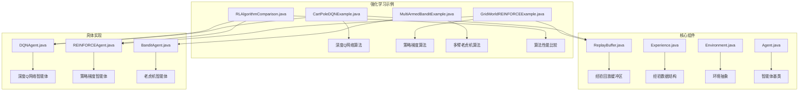

**图表来源**
- [CartPoleDQNExample.java](file://tinyai-dl-case/src/main/java/io/leavesfly/tinyai/example/rl/CartPoleDQNExample.java#L1-L50)
- [GridWorldREINFORCEExample.java](file://tinyai-dl-case/src/main/java/io/leavesfly/tinyai/example/rl/GridWorldREINFORCEExample.java#L1-L50)
- [MultiArmedBanditExample.java](file://tinyai-dl-case/src/main/java/io/leavesfly/tinyai/example/rl/MultiArmedBanditExample.java#L1-L50)
- [RLAlgorithmComparison.java](file://tinyai-dl-case/src/main/java/io/leavesfly/tinyai/example/rl/RLAlgorithmComparison.java#L1-L50)

**章节来源**
- [CartPoleDQNExample.java](file://tinyai-dl-case/src/main/java/io/leavesfly/tinyai/example/rl/CartPoleDQNExample.java#L1-L242)
- [GridWorldREINFORCEExample.java](file://tinyai-dl-case/src/main/java/io/leavesfly/tinyai/example/rl/GridWorldREINFORCEExample.java#L1-L293)
- [MultiArmedBanditExample.java](file://tinyai-dl-case/src/main/java/io/leavesfly/tinyai/example/rl/MultiArmedBanditExample.java#L1-L307)
- [RLAlgorithmComparison.java](file://tinyai-dl-case/src/main/java/io/leavesfly/tinyai/example/rl/RLAlgorithmComparison.java#L1-L307)

## 核心组件

### 经验回放缓冲区（ReplayBuffer）

经验回放缓冲区是深度强化学习的关键组件，它解决了传统强化学习算法中数据相关性和样本效率低的问题。

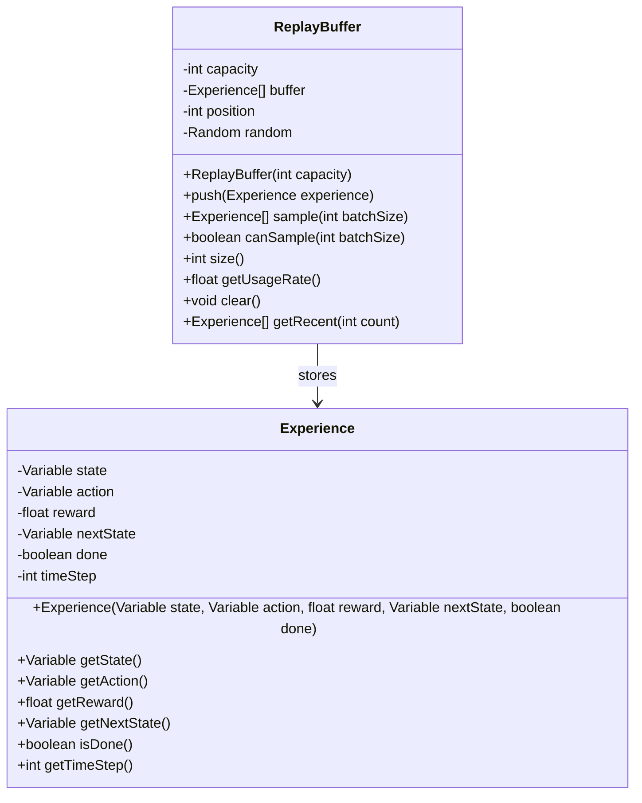

**图表来源**
- [ReplayBuffer.java](file://tinyai-dl-rl/src/main/java/io/leavesfly/tinyai/rl/ReplayBuffer.java#L15-L50)
- [Experience.java](file://tinyai-dl-rl/src/main/java/io/leavesfly/tinyai/rl/Experience.java#L15-L50)

### 环境抽象（Environment）

环境是强化学习算法与外部世界的接口，定义了状态空间、动作空间和动态行为。

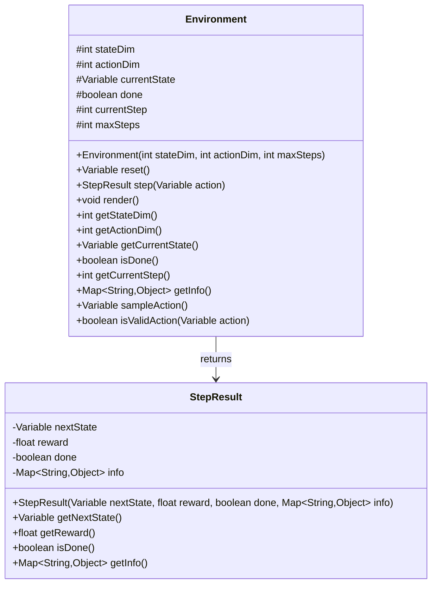

**图表来源**
- [Environment.java](file://tinyai-dl-rl/src/main/java/io/leavesfly/tinyai/rl/Environment.java#L15-L80)

**章节来源**
- [ReplayBuffer.java](file://tinyai-dl-rl/src/main/java/io/leavesfly/tinyai/rl/ReplayBuffer.java#L1-L179)
- [Experience.java](file://tinyai-dl-rl/src/main/java/io/leavesfly/tinyai/rl/Experience.java#L1-L137)
- [Environment.java](file://tinyai-dl-rl/src/main/java/io/leavesfly/tinyai/rl/Environment.java#L1-L195)

## 架构概览

强化学习算法的整体架构展示了智能体如何与环境交互并学习最优策略：

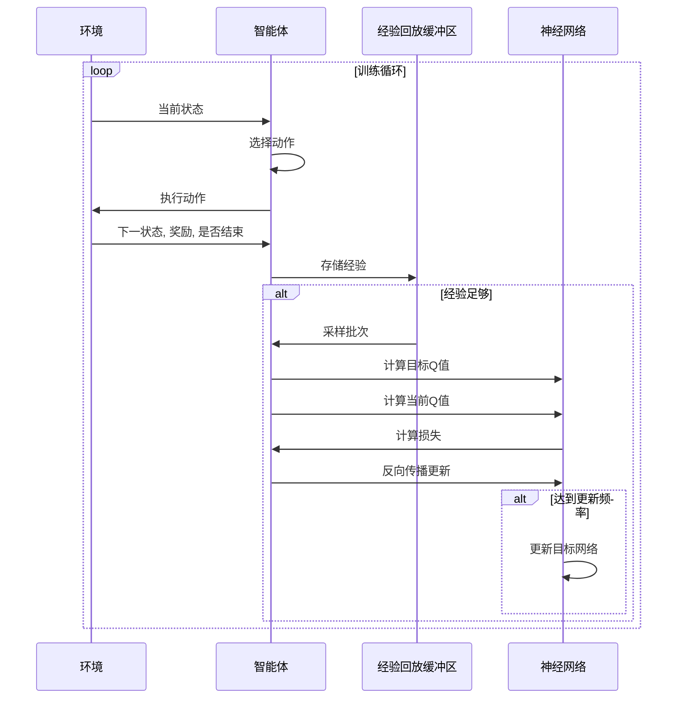

**图表来源**
- [DQNAgent.java](file://tinyai-dl-rl/src/main/java/io/leavesfly/tinyai/rl/agent/DQNAgent.java#L150-L200)
- [CartPoleDQNExample.java](file://tinyai-dl-case/src/main/java/io/leavesfly/tinyai/example/rl/CartPoleDQNExample.java#L80-L120)

## 详细组件分析

### DQN算法实现

DQN（Deep Q-Network）是第一个成功将深度学习应用于强化学习的算法，结合了深度神经网络和Q学习。

#### Q网络结构

DQN使用多层感知机（MLP）作为Q函数的近似器：

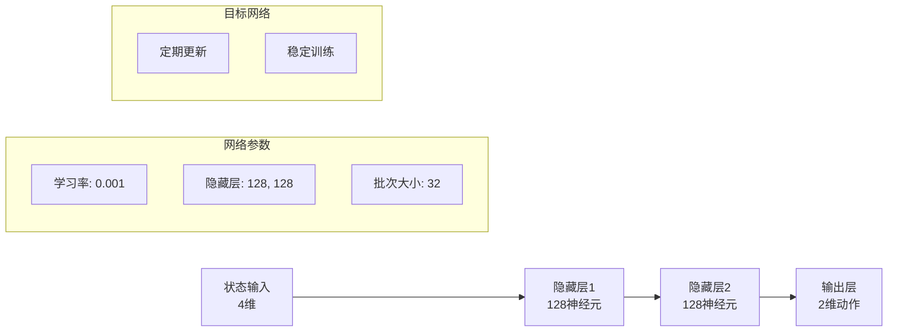

**图表来源**
- [DQNAgent.java](file://tinyai-dl-rl/src/main/java/io/leavesfly/tinyai/rl/agent/DQNAgent.java#L70-L90)
- [CartPoleDQNExample.java](file://tinyai-dl-case/src/main/java/io/leavesfly/tinyai/example/rl/CartPoleDQNExample.java#L50-L70)

#### ε-贪婪策略

ε-贪婪策略在探索和利用之间取得平衡：

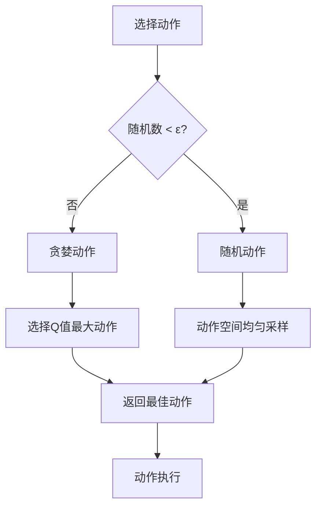

**图表来源**
- [DQNAgent.java](file://tinyai-dl-rl/src/main/java/io/leavesfly/tinyai/rl/agent/DQNAgent.java#L120-L140)

#### 目标网络更新机制

目标网络通过定期复制主网络权重来稳定训练：

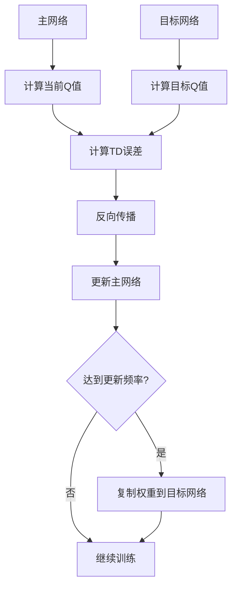

**图表来源**
- [DQNAgent.java](file://tinyai-dl-rl/src/main/java/io/leavesfly/tinyai/rl/agent/DQNAgent.java#L250-L300)

**章节来源**
- [DQNAgent.java](file://tinyai-dl-rl/src/main/java/io/leavesfly/tinyai/rl/agent/DQNAgent.java#L1-L397)
- [CartPoleDQNExample.java](file://tinyai-dl-case/src/main/java/io/leavesfly/tinyai/example/rl/CartPoleDQNExample.java#L50-L150)

### REINFORCE算法实现

REINFORCE算法是一种策略梯度方法，直接优化策略网络参数。

#### 策略网络结构

REINFORCE使用神经网络输出动作的概率分布：

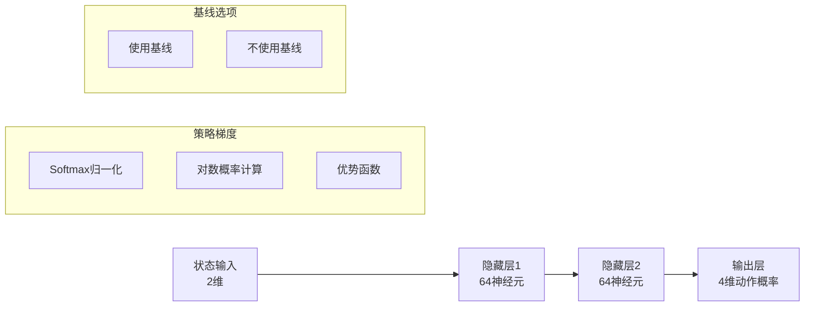

**图表来源**
- [REINFORCEAgent.java](file://tinyai-dl-rl/src/main/java/io/leavesfly/tinyai/rl/agent/REINFORCEAgent.java#L80-L120)
- [GridWorldREINFORCEExample.java](file://tinyai-dl-case/src/main/java/io/leavesfly/tinyai/example/rl/GridWorldREINFORCEExample.java#L50-L70)

#### 基线（Baseline）机制

基线用于减少策略梯度估计的方差：

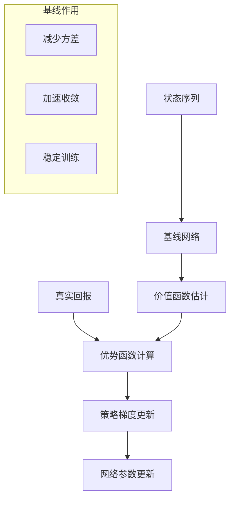

**图表来源**
- [REINFORCEAgent.java](file://tinyai-dl-rl/src/main/java/io/leavesfly/tinyai/rl/agent/REINFORCEAgent.java#L300-L350)

**章节来源**
- [REINFORCEAgent.java](file://tinyai-dl-rl/src/main/java/io/leavesfly/tinyai/rl/agent/REINFORCEAgent.java#L1-L488)
- [GridWorldREINFORCEExample.java](file://tinyai-dl-case/src/main/java/io/leavesfly/tinyai/example/rl/GridWorldREINFORCEExample.java#L50-L150)

### 多臂老虎机算法

多臂老虎机问题是强化学习的基础问题，研究如何在多个选项中进行探索和利用。

#### ε-贪婪算法

ε-贪婪算法是最简单的多臂老虎机算法：

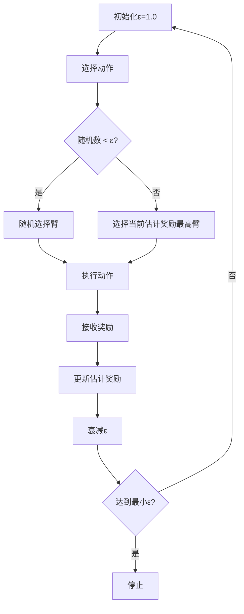

**图表来源**
- [MultiArmedBanditExample.java](file://tinyai-dl-case/src/main/java/io/leavesfly/tinyai/example/rl/MultiArmedBanditExample.java#L100-L150)

#### UCB算法

UCB（Upper Confidence Bound）算法通过置信区间平衡探索和利用：

```mermaid
flowchart TD
A[计算UCB值] --> B[选择UCB值最大臂]
B --> C[执行动作]
C --> D[更新统计信息]
D --> E[增加动作选择次数]
E --> F[重新计算UCB值]
F --> A
subgraph "UCB公式"
G[UCB = 平均奖励 + c * √(ln(总选择次数)/动作选择次数)]
H[c为探索参数]
end
```

**图表来源**
- [MultiArmedBanditExample.java](file://tinyai-dl-case/src/main/java/io/leavesfly/tinyai/example/rl/MultiArmedBanditExample.java#L150-L200)

**章节来源**
- [MultiArmedBanditExample.java](file://tinyai-dl-case/src/main/java/io/leavesfly/tinyai/example/rl/MultiArmedBanditExample.java#L1-L307)

## 算法实现详解

### CartPole环境分析

CartPole是一个经典的连续控制问题，目标是通过控制小车的左右移动来平衡杆子：

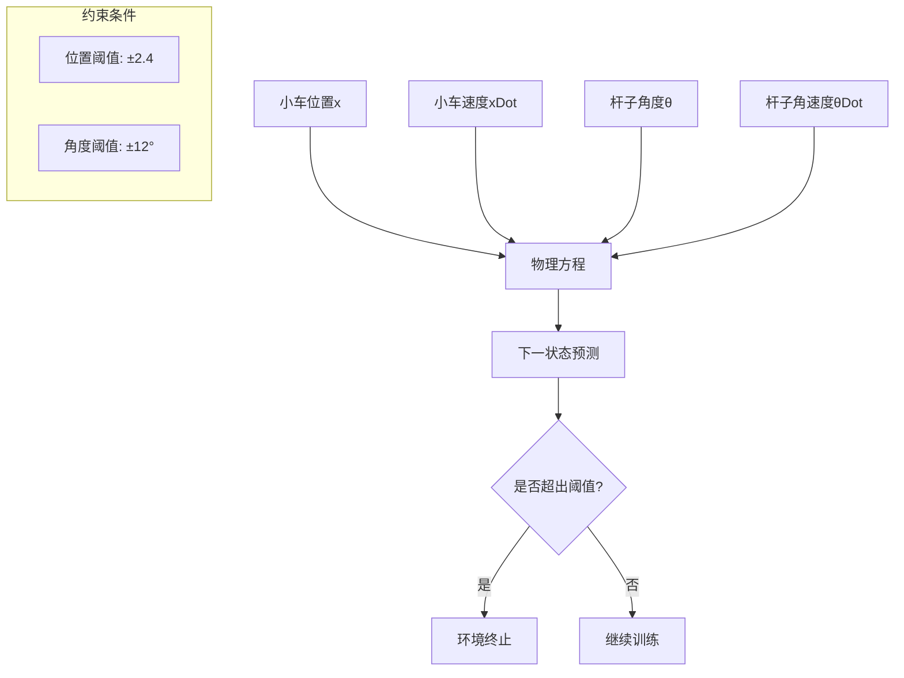

**图表来源**
- [CartPoleEnvironment.java](file://tinyai-dl-rl/src/main/java/io/leavesfly/tinyai/rl/environment/CartPoleEnvironment.java#L100-L150)

### GridWorld环境分析

GridWorld是一个离散导航问题，智能体需要在网格中找到从起点到终点的路径：

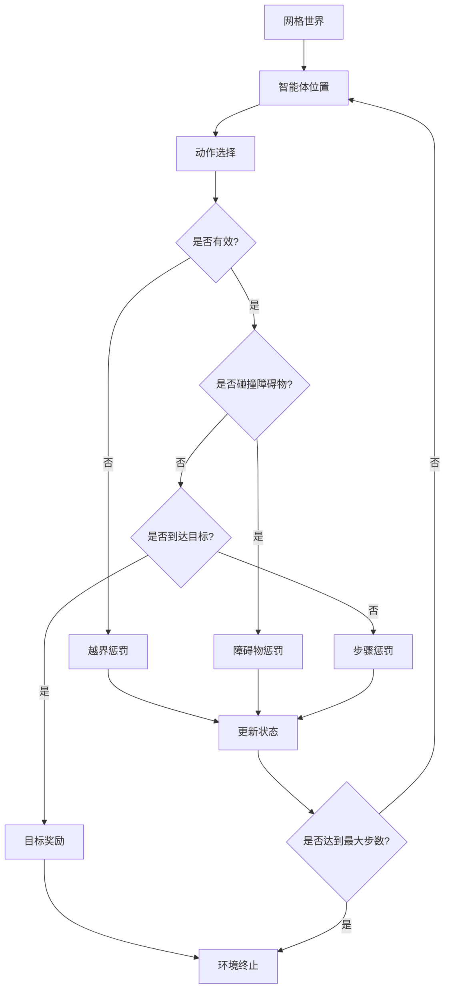

**图表来源**
- [GridWorldEnvironment.java](file://tinyai-dl-rl/src/main/java/io/leavesfly/tinyai/rl/environment/GridWorldEnvironment.java#L100-L150)

**章节来源**
- [CartPoleEnvironment.java](file://tinyai-dl-rl/src/main/java/io/leavesfly/tinyai/rl/environment/CartPoleEnvironment.java#L1-L258)
- [GridWorldEnvironment.java](file://tinyai-dl-rl/src/main/java/io/leavesfly/tinyai/rl/environment/GridWorldEnvironment.java#L1-L392)

## 环境与智能体交互

### 交互模式

强化学习中的智能体与环境交互遵循以下模式：

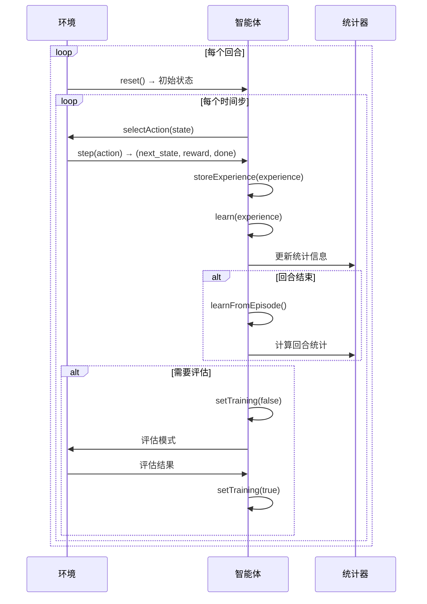

**图表来源**
- [CartPoleDQNExample.java](file://tinyai-dl-case/src/main/java/io/leavesfly/tinyai/example/rl/CartPoleDQNExample.java#L80-L150)
- [GridWorldREINFORCEExample.java](file://tinyai-dl-case/src/main/java/io/leavesfly/tinyai/example/rl/GridWorldREINFORCEExample.java#L80-L150)

### 训练稳定性优化技巧

为了提高训练稳定性，本文档中的示例采用了多种优化技巧：

1. **经验回放**：打破数据相关性，提高样本利用率
2. **目标网络**：定期更新目标网络，稳定训练过程
3. **探索策略**：使用ε-贪婪策略平衡探索与利用
4. **奖励设计**：合理设计奖励函数，引导智能体学习
5. **归一化**：对状态进行归一化处理
6. **梯度裁剪**：防止梯度爆炸

**章节来源**
- [CartPoleDQNExample.java](file://tinyai-dl-case/src/main/java/io/leavesfly/tinyai/example/rl/CartPoleDQNExample.java#L150-L242)
- [GridWorldREINFORCEExample.java](file://tinyai-dl-case/src/main/java/io/leavesfly/tinyai/example/rl/GridWorldREINFORCEExample.java#L150-L293)

## 性能优化技巧

### 超参数调优

不同算法有不同的超参数需要调优：

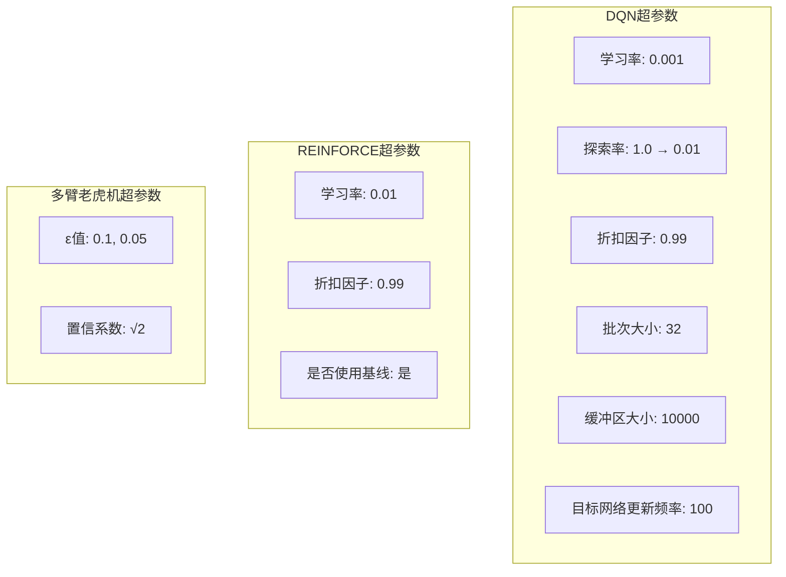

### 训练监控

有效的训练监控可以帮助及时发现问题：

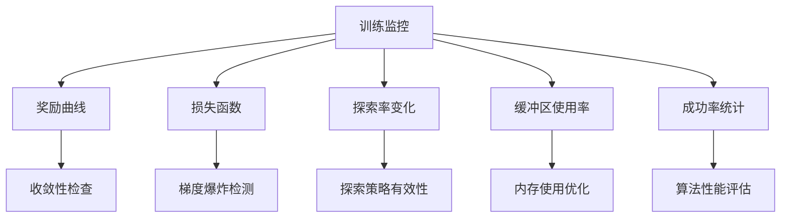

## 故障排除指南

### 常见问题及解决方案

1. **训练不收敛**
   - 检查学习率设置
   - 验证奖励函数设计
   - 确认环境状态归一化

2. **过早收敛**
   - 增加探索率
   - 调整奖励缩放
   - 检查动作空间设计

3. **训练不稳定**
   - 使用目标网络
   - 增加经验回放缓冲区
   - 实施梯度裁剪

4. **性能差**
   - 检查环境配置
   - 优化网络结构
   - 调整超参数

**章节来源**
- [RLAlgorithmComparison.java](file://tinyai-dl-case/src/main/java/io/leavesfly/tinyai/example/rl/RLAlgorithmComparison.java#L1-L307)

## 结论

本文档详细分析了TinyAI框架中的强化学习示例代码，涵盖了四种核心算法的实现：

1. **DQN算法**：适用于连续控制问题，具有稳定性和高效性
2. **REINFORCE算法**：适用于离散动作空间，支持策略梯度优化
3. **多臂老虎机算法**：研究探索与利用的权衡，提供理论基础
4. **算法比较实验**：展示不同算法在相同环境下的性能差异

通过这些示例，我们可以看到强化学习算法在不同场景下的应用特点和适用范围。环境与智能体的交互模式清晰地展示了强化学习的核心思想，而训练稳定性优化技巧则为实际应用提供了宝贵的指导。

这些示例不仅有助于理解强化学习算法的原理，也为开发者提供了可直接使用的代码模板，大大降低了学习和应用强化学习的门槛。