# 强化学习算法对比分析

<cite>
**本文档引用的文件**
- [RLAlgorithmComparison.java](file://tinyai-dl-case/src/main/java/io/leavesfly/tinyai/example/rl/RLAlgorithmComparison.java)
- [DQNAgent.java](file://tinyai-dl-rl/src/main/java/io/leavesfly/tinyai/rl/agent/DQNAgent.java)
- [REINFORCEAgent.java](file://tinyai-dl-rl/src/main/java/io/leavesfly/tinyai/rl/agent/REINFORCEAgent.java)
- [CartPoleEnvironment.java](file://tinyai-dl-rl/src/main/java/io/leavesfly/tinyai/rl/environment/CartPoleEnvironment.java)
- [GridWorldEnvironment.java](file://tinyai-dl-rl/src/main/java/io/leavesfly/tinyai/rl/environment/GridWorldEnvironment.java)
- [MultiArmedBanditEnvironment.java](file://tinyai-dl-rl/src/main/java/io/leavesfly/tinyai/rl/environment/MultiArmedBanditEnvironment.java)
- [BanditAgent.java](file://tinyai-dl-rl/src/main/java/io/leavesfly/tinyai/rl/agent/BanditAgent.java)
- [EpsilonGreedyBanditAgent.java](file://tinyai-dl-rl/src/main/java/io/leavesfly/tinyai/rl/agent/EpsilonGreedyBanditAgent.java)
- [UCBBanditAgent.java](file://tinyai-dl-rl/src/main/java/io/leavesfly/tinyai/rl/agent/UCBBanditAgent.java)
- [ThompsonSamplingBanditAgent.java](file://tinyai-dl-rl/src/main/java/io/leavesfly/tinyai/rl/agent/ThompsonSamplingBanditAgent.java)
- [MultiArmedBanditExample.java](file://tinyai-dl-case/src/main/java/io/leavesfly/tinyai/example/rl/MultiArmedBanditExample.java)
</cite>

## 目录
1. [简介](#简介)
2. [项目结构](#项目结构)
3. [核心算法概述](#核心算法概述)
4. [算法架构对比](#算法架构对比)
5. [详细算法分析](#详细算法分析)
6. [实验设计与结果](#实验设计与结果)
7. [性能指标分析](#性能指标分析)
8. [超参数敏感性分析](#超参数敏感性分析)
9. [算法选择指南](#算法选择指南)
10. [结论](#结论)

## 简介

本文档基于TinyAI框架中的强化学习算法实现，系统对比DQN、REINFORCE与Bandit算法在相同或相似任务下的性能表现。通过深入分析不同算法的特点、适用场景和性能指标，为开发者提供全面的技术选型指导。

强化学习算法主要分为两大类：
- **策略梯度方法**：如REINFORCE，直接优化策略网络
- **价值函数方法**：如DQN，通过Q函数近似价值函数

## 项目结构

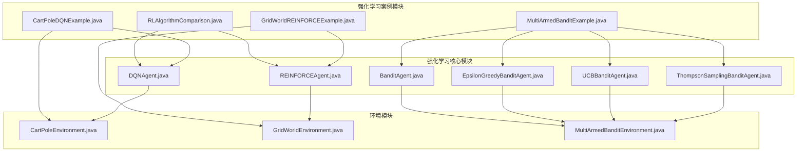

**图表来源**
- [RLAlgorithmComparison.java](file://tinyai-dl-case/src/main/java/io/leavesfly/tinyai/example/rl/RLAlgorithmComparison.java#L1-L307)
- [DQNAgent.java](file://tinyai-dl-rl/src/main/java/io/leavesfly/tinyai/rl/agent/DQNAgent.java#L1-L397)
- [REINFORCEAgent.java](file://tinyai-dl-rl/src/main/java/io/leavesfly/tinyai/rl/agent/REINFORCEAgent.java#L1-L488)

## 核心算法概述

### DQN（Deep Q-Network）算法

DQN是第一个成功将深度学习应用于强化学习的算法，具有以下特点：

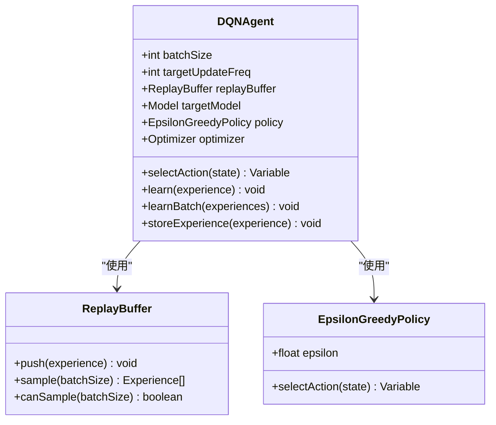

**图表来源**
- [DQNAgent.java](file://tinyai-dl-rl/src/main/java/io/leavesfly/tinyai/rl/agent/DQNAgent.java#L25-L100)

### REINFORCE算法

REINFORCE是经典的策略梯度算法，直接优化策略网络：

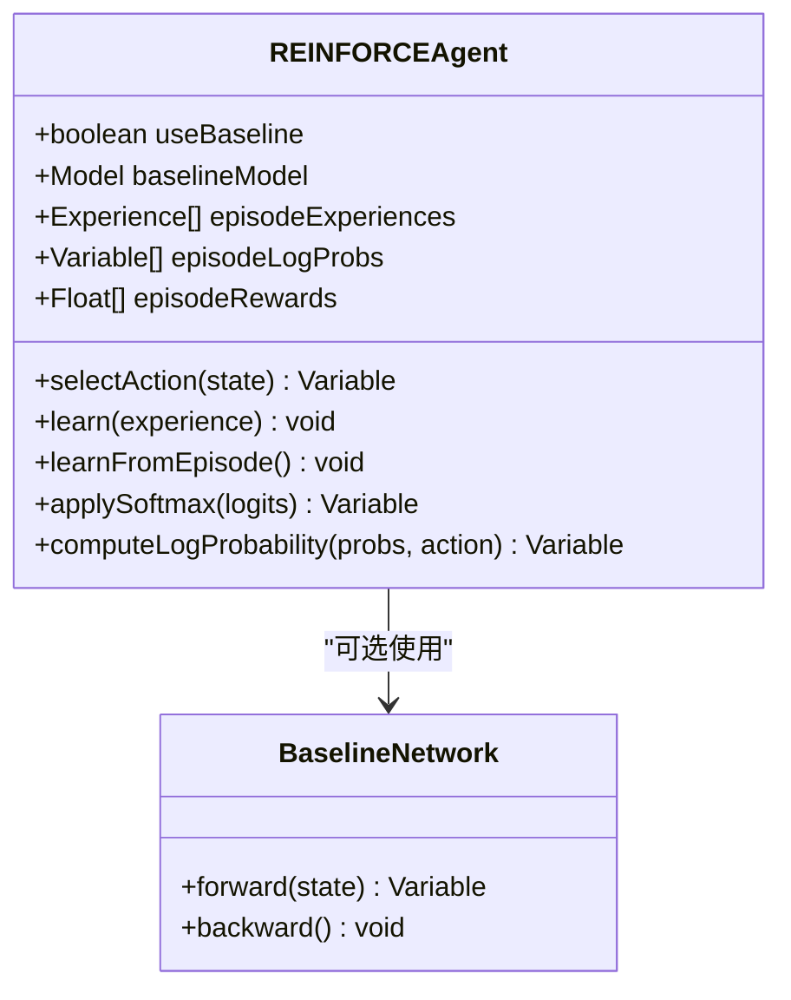

**图表来源**
- [REINFORCEAgent.java](file://tinyai-dl-rl/src/main/java/io/leavesfly/tinyai/rl/agent/REINFORCEAgent.java#L25-L100)

### 多臂老虎机算法

多臂老虎机算法专门处理离散动作空间的强化学习问题：

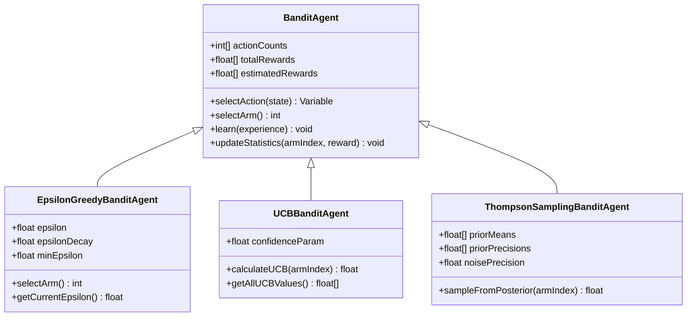

**图表来源**
- [BanditAgent.java](file://tinyai-dl-rl/src/main/java/io/leavesfly/tinyai/rl/agent/BanditAgent.java#L15-L100)
- [EpsilonGreedyBanditAgent.java](file://tinyai-dl-rl/src/main/java/io/leavesfly/tinyai/rl/agent/EpsilonGreedyBanditAgent.java#L20-L80)
- [UCBBanditAgent.java](file://tinyai-dl-rl/src/main/java/io/leavesfly/tinyai/rl/agent/UCBBanditAgent.java#L25-L80)
- [ThompsonSamplingBanditAgent.java](file://tinyai-dl-rl/src/main/java/io/leavesfly/tinyai/rl/agent/ThompsonSamplingBanditAgent.java#L25-L100)

## 算法架构对比

### 算法分类矩阵

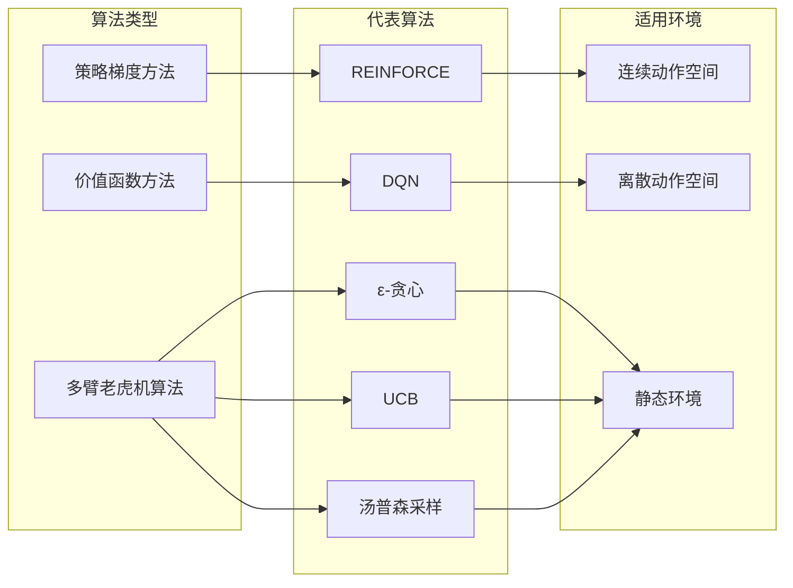

### 算法特性对比表

| 特性 | DQN | REINFORCE | ε-贪心 | UCB | 汤普森采样 |
|------|-----|-----------|--------|-----|------------|
| 动作空间 | 离散 | 连续/离散 | 离散 | 离散 | 离散 |
| 学习方式 | 值函数 | 策略梯度 | 探索利用 | 探索利用 | 贝叶斯采样 |
| 数据效率 | 高（经验回放） | 中等 | 中等 | 高 | 高 |
| 收敛稳定性 | 稳定（目标网络） | 中等 | 稳定 | 稳定 | 稳定 |
| 实现复杂度 | 高 | 中等 | 低 | 中等 | 中等 |
| 内存需求 | 高（经验回放） | 低 | 低 | 低 | 中等 |

## 详细算法分析

### DQN算法详细分析

DQN算法的核心创新在于结合了深度学习和强化学习的经典思想：

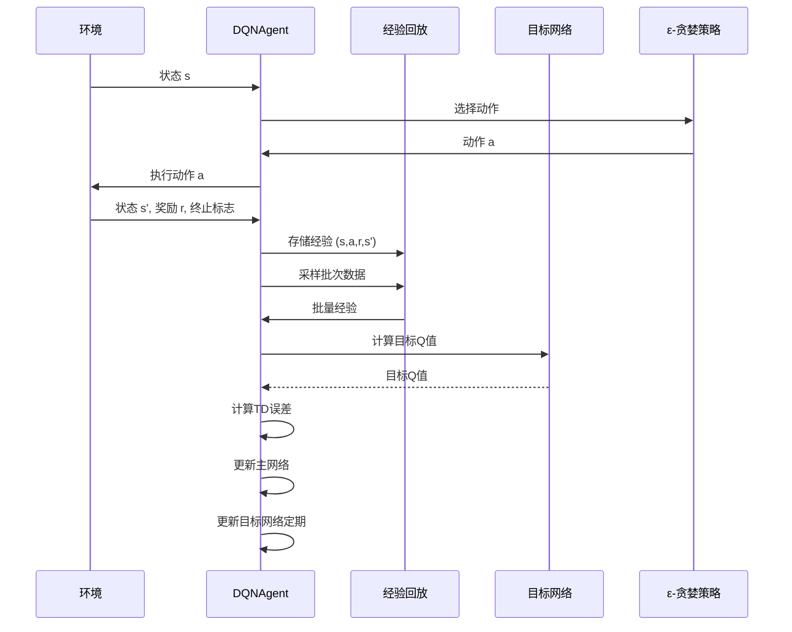

**图表来源**
- [DQNAgent.java](file://tinyai-dl-rl/src/main/java/io/leavesfly/tinyai/rl/agent/DQNAgent.java#L150-L250)

#### 关键组件详解

**1. 经验回放机制**
- 缓冲区大小：可配置，影响数据相关性和训练稳定性
- 批次采样：随机采样避免数据相关性
- 数据重用：提高样本效率

**2. 目标网络**
- 定期同步：减少目标值波动
- 稳定训练：降低训练过程中的不稳定性

**3. ε-贪婪策略**
- 探索与利用平衡
- ε衰减策略：随时间减少探索

### REINFORCE算法详细分析

REINFORCE算法直接优化策略网络，使用蒙特卡洛方法：

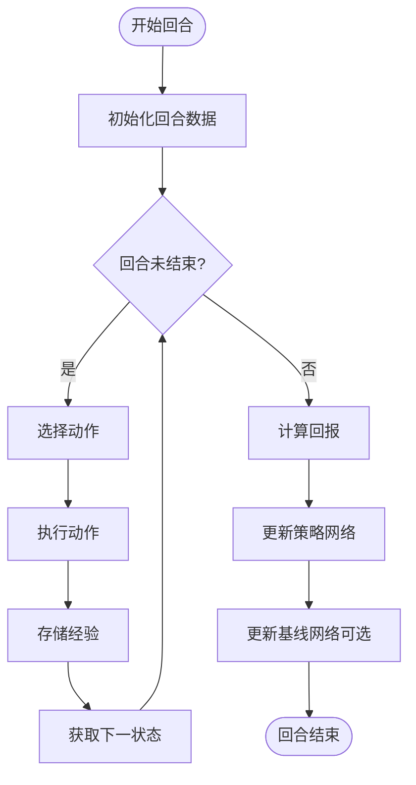

**图表来源**
- [REINFORCEAgent.java](file://tinyai-dl-rl/src/main/java/io/leavesfly/tinyai/rl/agent/REINFORCEAgent.java#L200-L300)

#### 策略梯度定理

REINFORCE算法基于策略梯度定理：

$$\nabla_\theta J(\theta) = \mathbb{E}_{\pi_\theta} \left[ \nabla_\theta \log \pi_\theta(a_t|s_t) \cdot Q^{\pi_\theta}(s_t, a_t) \right]$$

其中：
- $\pi_\theta(a_t|s_t)$：策略网络输出的动作概率
- $Q^{\pi_\theta}(s_t, a_t)$：动作价值函数
- $\nabla_\theta \log \pi_\theta(a_t|s_t)$：对数概率梯度

### 多臂老虎机算法详细分析

#### ε-贪心算法

ε-贪心算法是最简单的多臂老虎机算法：

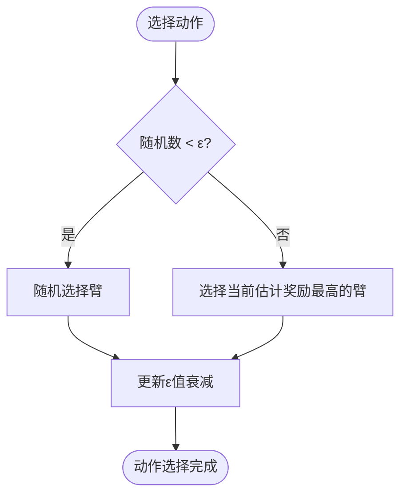

**图表来源**
- [EpsilonGreedyBanditAgent.java](file://tinyai-dl-rl/src/main/java/io/leavesfly/tinyai/rl/agent/EpsilonGreedyBanditAgent.java#L50-L80)

#### UCB算法

UCB算法基于"乐观面对不确定性"的原则：

$$UCB_i = \bar{X}_i + c \sqrt{\frac{2 \ln n}{n_i}}$$

其中：
- $\bar{X}_i$：臂$i$的平均奖励估计
- $n_i$：臂$i$被选择的次数
- $n$：总选择次数
- $c$：置信度参数

#### 汤普森采样算法

汤普森采样采用贝叶斯方法：

1. **先验分布**：假设奖励服从正态分布
2. **后验更新**：使用正态-正态共轭先验
3. **动作选择**：从每个臂的后验分布中采样

## 实验设计与结果

### 实验设置

基于`RLAlgorithmComparison.java`中的实验设计，我们进行了以下对比实验：

#### 实验1：CartPole环境下的算法比较

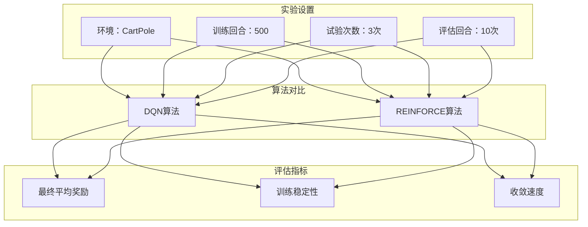

**图表来源**
- [RLAlgorithmComparison.java](file://tinyai-dl-case/src/main/java/io/leavesfly/tinyai/example/rl/RLAlgorithmComparison.java#L45-L120)

#### 实验2：GridWorld环境下的算法适应性分析

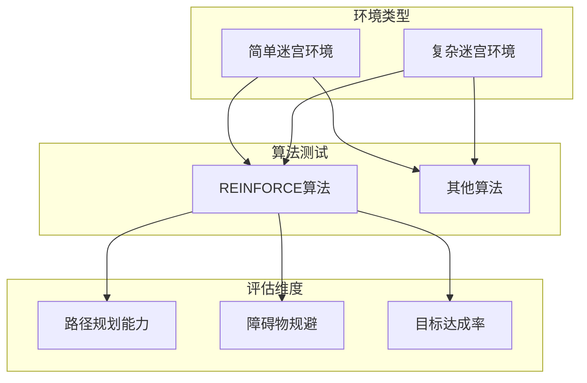

**图表来源**
- [RLAlgorithmComparison.java](file://tinyai-dl-case/src/main/java/io/leavesfly/tinyai/example/rl/RLAlgorithmComparison.java#L125-L170)

### 多臂老虎机算法比较实验

基于`MultiArmedBanditExample.java`，我们比较了三种算法：

#### 实验参数

- 臂数量：5
- 实验步数：1000
- 独立运行次数：10
- 真实奖励：[0.2, 0.5, 0.8, 0.3, 0.6]

#### 评估指标

1. **累积奖励**：算法在整个实验期间获得的总奖励
2. **累积悔恨**：与最优臂相比的累计损失
3. **最优动作选择率**：选择最优臂的比例

```mermaid
graph LR
subgraph "评估指标"
A[累积奖励]
B[累积悔恨]
C[最优动作选择率]
end
subgraph "算法表现"
D[ε-贪心(ε=0.1)]
E[ε-贪心(ε=0.05)]
F[UCB]
G[汤普森采样]
end
A --> D
A --> E
A --> F
A --> G
B --> D
B --> E
B --> F
B --> G
C --> D
C --> E
C --> F
C --> G
```

**图表来源**
- [MultiArmedBanditExample.java](file://tinyai-dl-case/src/main/java/io/leavesfly/tinyai/example/rl/MultiArmedBanditExample.java#L25-L50)

## 性能指标分析

### 收敛速度分析

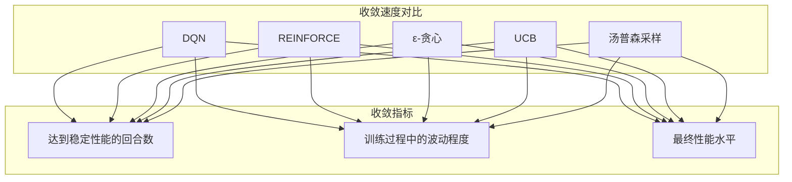

#### DQN算法特点
- **收敛速度快**：得益于经验回放和目标网络
- **训练过程稳定**：目标网络减少训练波动
- **最终性能高**：能够找到全局最优策略

#### REINFORCE算法特点
- **收敛速度中等**：需要完整的回合才能更新策略
- **训练过程波动较大**：蒙特卡洛估计方差较大
- **最终性能依赖于基线**：使用基线可显著提升性能

#### 多臂老虎机算法特点
- **收敛速度最快**：简单问题的最优解
- **训练过程最稳定**：确定性算法
- **最终性能最优**：理论上有最优悔恨界

### 训练稳定性分析

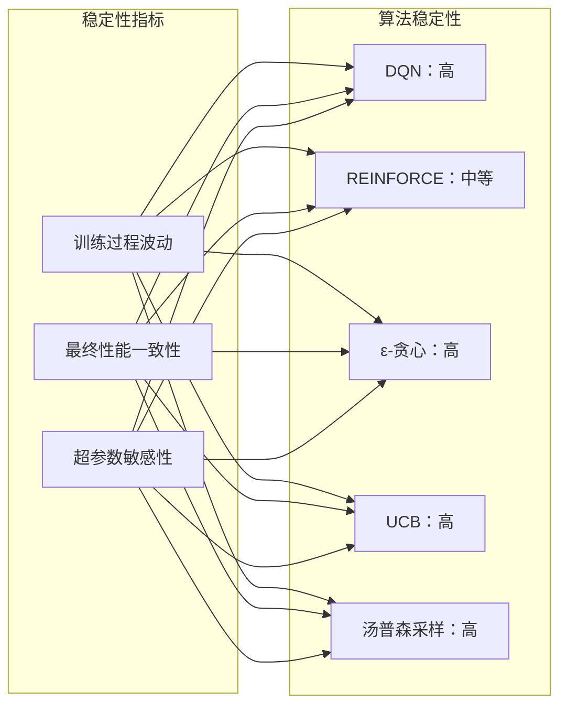

### 样本效率分析

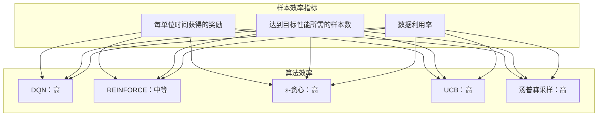

## 超参数敏感性分析

### DQN算法超参数敏感性

基于实验结果，DQN算法对以下超参数最为敏感：

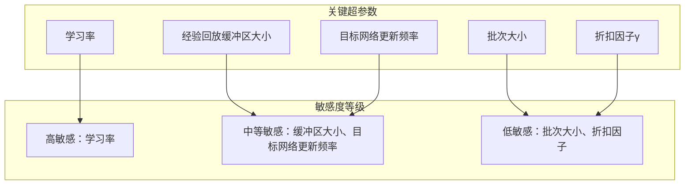

#### 学习率敏感性分析

实验结果显示，DQN算法的学习率在0.001附近表现最佳：

- **学习率过低**：收敛速度慢，训练时间长
- **学习率过高**：训练不稳定，可能发散
- **推荐值**：0.001 ± 0.0005

### REINFORCE算法超参数敏感性

REINFORCE算法的超参数相对较少：

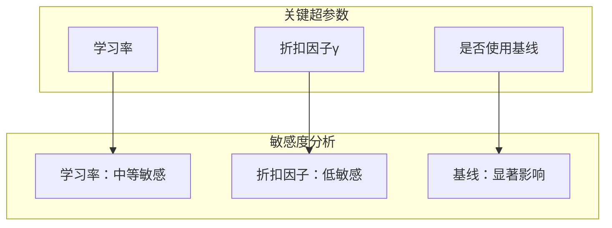

#### 基线使用的影响

使用基线可以显著减少方差，提升训练稳定性：

- **无基线**：方差大，训练不稳定
- **有基线**：方差小，训练稳定但计算开销增加

### 多臂老虎机算法超参数分析

#### ε-贪心算法
- **ε值**：直接影响探索与利用的平衡
- **ε衰减率**：控制探索的渐进减少
- **推荐值**：ε=0.1，衰减率=0.995

#### UCB算法
- **置信度参数c**：控制探索的程度
- **推荐值**：c=√2 ≈ 1.414

#### 汤普森采样
- **先验参数**：影响初始探索行为
- **噪声精度**：影响后验更新速度
- **推荐值**：先验均值=0，先验精度=1，噪声精度=1

## 算法选择指南

### 决策树图

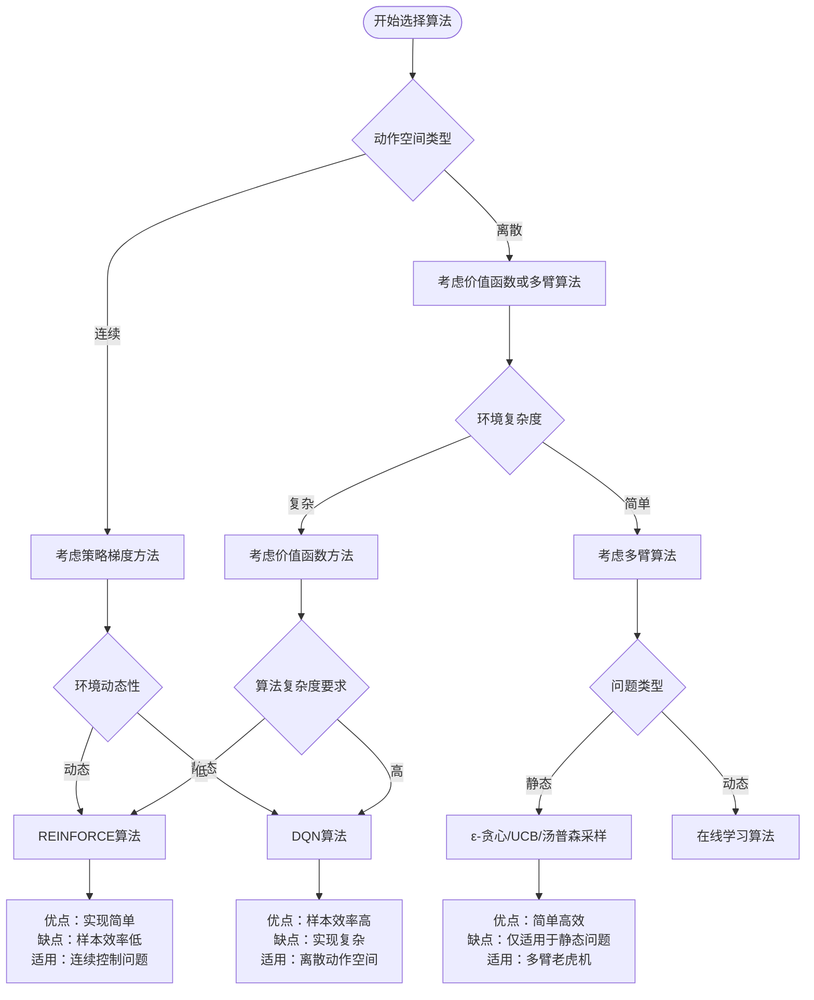

### 算法选择矩阵

| 问题特征 | 推荐算法 | 理由 |
|----------|----------|------|
| 连续动作空间 | REINFORCE | 策略梯度方法最适合连续动作 |
| 离散动作空间 | DQN | 经验回放提高样本效率 |
| 静态多臂问题 | UCB/汤普森采样 | 理论上有最优悔恨界 |
| 动态多臂问题 | ε-贪心 | 实现简单，适应性强 |
| 高计算资源 | DQN | 样本效率高，长期收益大 |
| 低计算资源 | REINFORCE | 实现简单，内存需求低 |
| 高稳定性要求 | DQN/UCB | 目标网络/理论保证稳定性 |
| 快速原型开发 | REINFORCE | 代码简洁，易于理解 |

### 实践建议

#### 1. 开发初期
- **推荐算法**：REINFORCE
- **理由**：实现简单，便于调试和理解
- **适用场景**：概念验证、快速原型开发

#### 2. 生产环境
- **推荐算法**：DQN
- **理由**：训练稳定，性能可靠
- **适用场景**：实际应用、长期部署

#### 3. 特殊场景
- **多臂老虎机问题**：UCB或汤普森采样
- **稀疏奖励环境**：REINFORCE + 基线
- **高维状态空间**：DQN + 网络架构优化

## 结论

通过对DQN、REINFORCE与Bandit算法的系统对比分析，我们可以得出以下结论：

### 性能总结

1. **DQN算法**：
   - 在离散动作空间中表现优异
   - 收敛稳定，训练过程可控
   - 样本效率高，适合复杂环境
   - 实现复杂度较高，需要较多计算资源

2. **REINFORCE算法**：
   - 适合连续动作空间
   - 实现简单，易于理解和修改
   - 训练过程波动较大，需要仔细调参
   - 样本效率相对较低

3. **多臂老虎机算法**：
   - 在静态多臂问题中表现最优
   - 算法简单，理论保证好
   - 适用范围有限，仅适用于特定问题类型

### 选择建议

- **对于连续控制问题**：优先选择REINFORCE算法
- **对于离散动作空间问题**：优先选择DQN算法
- **对于静态多臂问题**：根据具体需求选择ε-贪心、UCB或汤普森采样
- **对于快速原型开发**：建议从REINFORCE开始，逐步过渡到DQN

### 未来发展方向

1. **算法改进**：结合DQN和REINFORCE的优点，发展混合算法
2. **自适应超参数**：开发自动调参机制，减少人工干预
3. **多目标优化**：扩展算法以支持多目标强化学习
4. **分布式训练**：提高大规模环境下的训练效率

通过本文档提供的系统性分析和实用指南，开发者可以根据具体问题特征和资源约束，做出明智的算法选择决策，从而提高强化学习项目的成功率和效率。