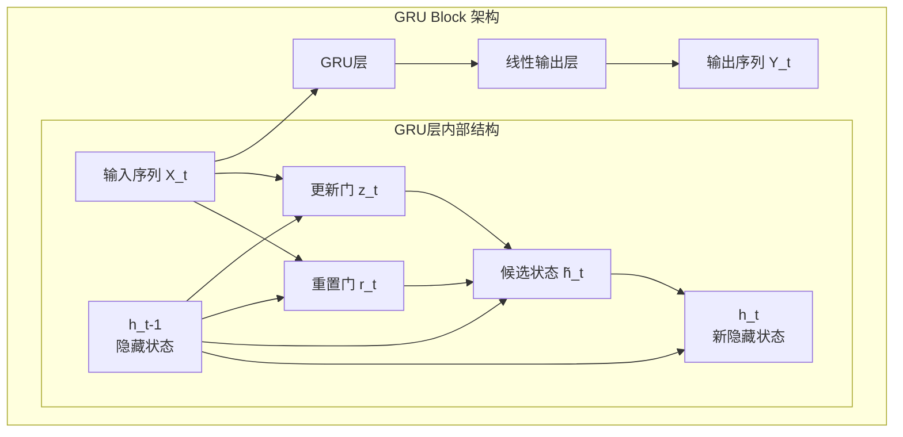
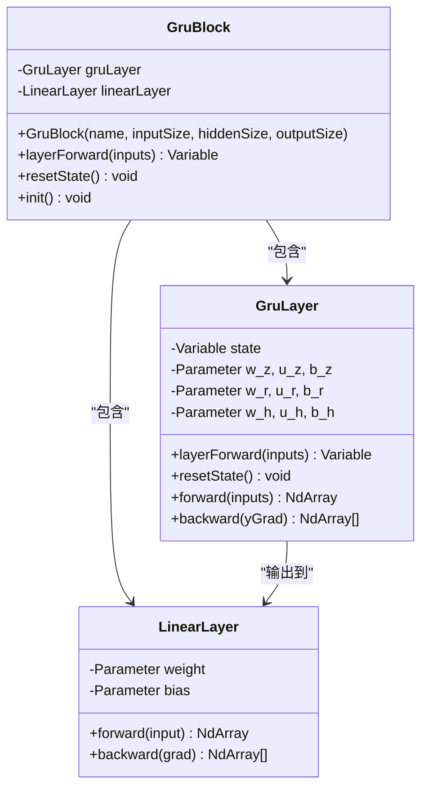
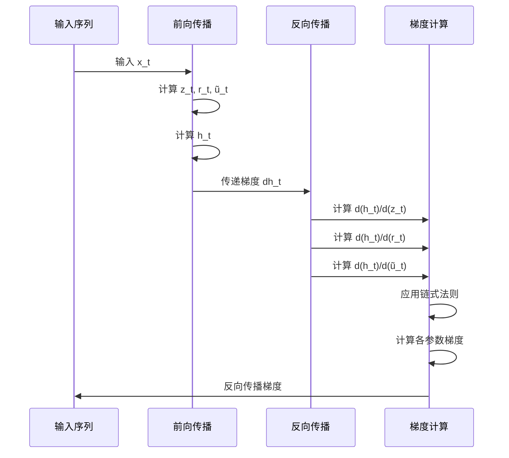
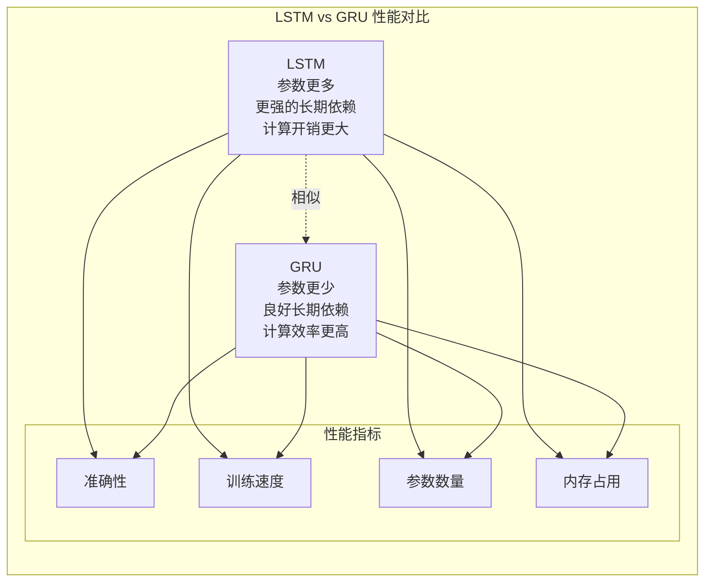
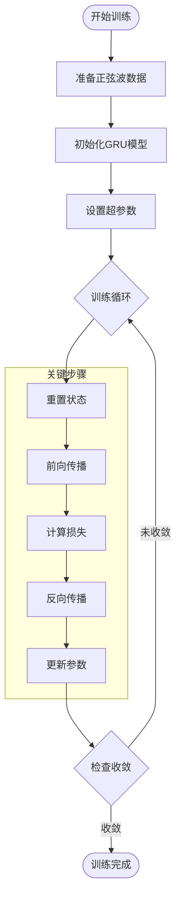
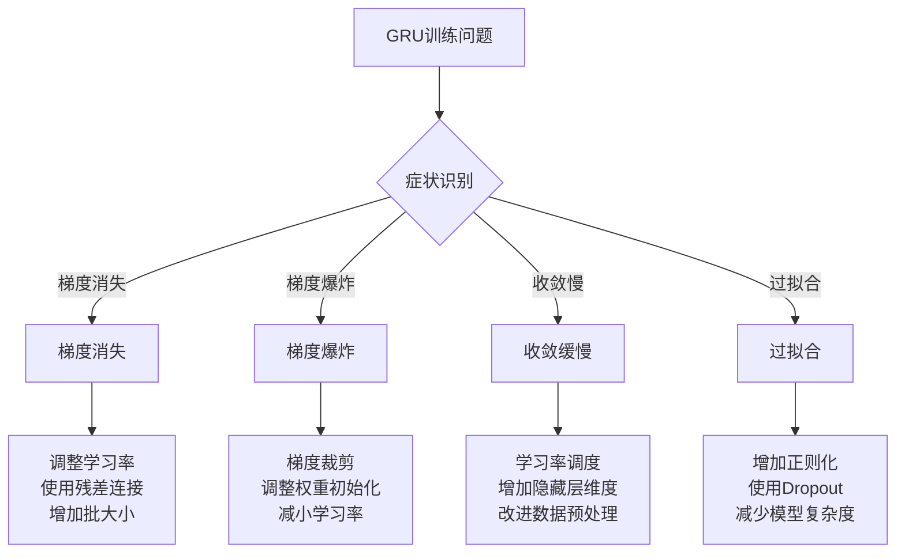

# GRU网络实现原理与性能分析

<cite>
**本文档引用的文件**
- [GruBlock.java](file://tinyai-dl-nnet/src/main/java/io/leavesfly/tinyai/nnet/block/GruBlock.java)
- [GruLayer.java](file://tinyai-dl-nnet/src/main/java/io/leavesfly/tinyai/nnet/layer/rnn/GruLayer.java)
- [CompleteRnnExample.java](file://tinyai-dl-case/src/main/java/io/leavesfly/tinyai/example/rnn/CompleteRnnExample.java)
- [GruBlockTest.java](file://tinyai-dl-nnet/src/test/java/io/leavesfly/tinyai/nnet/block/GruBlockTest.java)
- [SinDataSet.java](file://tinyai-dl-ml/src/main/java/io/leavesfly/tinyai/ml/dataset/simple/SinDataSet.java)
- [LstmBlock.java](file://tinyai-dl-nnet/src/main/java/io/leavesfly/tinyai/nnet/block/LstmBlock.java)
- [SimpleRnnBlock.java](file://tinyai-dl-nnet/src/main/java/io/leavesfly/tinyai/nnet/block/SimpleRnnBlock.java)
</cite>

## 目录
1. [引言](#引言)
2. [GRU网络架构概述](#gru网络架构概述)
3. [核心组件分析](#核心组件分析)
4. [门控机制详解](#门控机制详解)
5. [BPTT算法实现](#bptt算法实现)
6. [性能对比分析](#性能对比分析)
7. [训练流程分析](#训练流程分析)
8. [优化建议与问题解决](#优化建议与问题解决)
9. [结论](#结论)

## 引言

门控循环单元（GRU）是递归神经网络的一种重要变体，由Cho等人在2014年提出。GRU作为LSTM的简化版本，在减少参数数量的同时保持了良好的长期依赖捕捉能力。本文档基于TinyAI框架中的GRU实现，深入分析其架构设计、门控机制、训练过程以及与其他RNN变体的性能差异。

## GRU网络架构概述

### 整体架构设计

GRU网络采用门控机制来控制信息的流动，通过两个关键门——更新门和重置门——来调节隐藏状态的更新过程。这种设计使得GRU能够在保持较低计算复杂度的同时，有效处理序列数据中的长期依赖问题。



**图表来源**
- [GruBlock.java](file://tinyai-dl-nnet/src/main/java/io/leavesfly/tinyai/nnet/block/GruBlock.java#L1-L63)
- [GruLayer.java](file://tinyai-dl-nnet/src/main/java/io/leavesfly/tinyai/nnet/layer/rnn/GruLayer.java#L1-L50)

### 数学公式推导

GRU的核心计算遵循以下数学公式：

```
更新门: z_t = σ(W_z * x_t + U_z * h_{t-1} + b_z)
重置门: r_t = σ(W_r * x_t + U_r * h_{t-1} + b_r)
候选状态: ũ_t = tanh(W_h * x_t + U_h * (r_t ⊙ h_{t-1}) + b_h)
当前状态: h_t = (1 - z_t) ⊙ ũ_t + z_t ⊙ h_{t-1}
```

其中：
- z_t 是更新门输出，控制前一状态信息的保留程度
- r_t 是重置门输出，控制前一状态信息对当前候选状态的影响
- ũ_t 是候选状态，表示当前时刻的新信息
- h_t 是当前隐藏状态，综合了新信息和历史信息

**章节来源**
- [GruLayer.java](file://tinyai-dl-nnet/src/main/java/io/leavesfly/tinyai/nnet/layer/rnn/GruLayer.java#L25-L40)

## 核心组件分析

### GRU块（GruBlock）

GRU块是GRU网络的高层封装，它将GRU层和线性输出层组合在一起，形成一个完整的序列建模单元。



**图表来源**
- [GruBlock.java](file://tinyai-dl-nnet/src/main/java/io/leavesfly/tinyai/nnet/block/GruBlock.java#L15-L45)
- [GruLayer.java](file://tinyai-dl-nnet/src/main/java/io/leavesfly/tinyai/nnet/layer/rnn/GruLayer.java#L45-L120)

### 参数初始化策略

GRU层采用了Xavier初始化策略来确保梯度的稳定传播：

```java
// 权重初始化采用Xavier初始化
NdArray initWeight = NdArray.likeRandomN(Shape.of(inputSize, hiddenSize))
        .mulNum((float) Math.sqrt(2.0 / (inputSize + hiddenSize)));
```

这种初始化方式能够平衡输入和输出的方差，避免梯度消失或爆炸问题。

**章节来源**
- [GruLayer.java](file://tinyai-dl-nnet/src/main/java/io/leavesfly/tinyai/nnet/layer/rnn/GruLayer.java#L200-L250)

## 门控机制详解

### 更新门的工作原理

更新门负责决定多少历史信息应该保留在当前隐藏状态中。当更新门接近1时，表示大部分历史信息应该被保留；当更新门接近0时，表示主要关注新输入的信息。

```mermaid
flowchart TD
Start([输入 x_t 和 h_{t-1}]) --> Linear1[线性变换 W_z*x_t + U_z*h_{t-1}]
Linear1 --> Bias1[加上偏置 b_z]
Bias1 --> Sigmoid1[应用Sigmoid激活]
Sigmoid1 --> UpdateGate[z_t 输出]
UpdateGate --> CalcNew[计算 (1-z_t)*ũ_t]
UpdateGate --> CalcOld[z_t*h_{t-1}]
CalcNew --> Combine[组合得到 h_t]
CalcOld --> Combine
Combine --> NewState[h_t 新状态]
```

**图表来源**
- [GruLayer.java](file://tinyai-dl-nnet/src/main/java/io/leavesfly/tinyai/nnet/layer/rnn/GruLayer.java#L280-L320)

### 重置门的工作原理

重置门控制前一隐藏状态对当前候选状态的影响程度。当重置门接近1时，表示完全保留历史信息；当重置门接近0时，表示忽略历史信息，只关注当前输入。

```mermaid
flowchart TD
Start([输入 x_t 和 h_{t-1}]) --> Linear2[线性变换 W_r*x_t + U_r*h_{t-1}]
Linear2 --> Bias2[加上偏置 b_r]
Bias2 --> Sigmoid2[应用Sigmoid激活]
Sigmoid2 --> ResetGate[r_t 输出]
ResetGate --> Multiply[与 h_{t-1} 逐元素相乘]
Multiply --> ResetState[r_t ⊙ h_{t-1}]
ResetState --> CalcCandidate[计算候选状态]
```

**图表来源**
- [GruLayer.java](file://tinyai-dl-nnet/src/main/java/io/leavesfly/tinyai/nnet/layer/rnn/GruLayer.java#L320-L350)

### 门控机制的协同工作

更新门和重置门的协同工作形成了GRU的独特优势：

1. **信息选择机制**：更新门决定保留多少历史信息
2. **信息混合机制**：重置门控制历史信息的使用程度
3. **动态调整机制**：根据输入内容动态调整门控策略

这种设计使得GRU能够：
- 更好地捕捉长期依赖关系
- 减少参数数量（相比LSTM减少约33%）
- 提高计算效率
- 降低过拟合风险

**章节来源**
- [GruLayer.java](file://tinyai-dl-nnet/src/main/java/io/leavesfly/tinyai/nnet/layer/rnn/GruLayer.java#L280-L380)

## BPTT算法实现

### 反向传播流程

GRU的反向传播遵循标准的BPTT（Backpropagation Through Time）算法，但针对门控机制进行了特殊处理。



**图表来源**
- [GruLayer.java](file://tinyai-dl-nnet/src/main/java/io/leavesfly/tinyai/nnet/layer/rnn/GruLayer.java#L380-L477)

### 梯度计算细节

GRU的梯度计算涉及多个步骤，每个门控都有对应的梯度：

```java
// 更新门的梯度计算
NdArray dz = dhNext.mul(stateValue.sub(hCandidate.getValue()));
dz = dz.mul(zGate.getValue()).mul(NdArray.ones(zGate.getValue().getShape()).sub(zGate.getValue()));

// 重置门的梯度计算
NdArray dr = dhCandidate.dot(u_h.getValue().transpose()).mul(state.getValue());
dr = dr.mul(rGate.getValue()).mul(NdArray.ones(rGate.getValue().getShape()).sub(rGate.getValue()));

// 候选状态的梯度计算
NdArray dhCandidate = dhNext.mul(oneMinusZ.getValue());
dhCandidate = dhCandidate.mul(NdArray.ones(hCandidate.getValue().getShape()).sub(hCandidate.getValue().square()));
```

这些梯度计算确保了门控机制的可学习性，并支持高效的参数更新。

**章节来源**
- [GruLayer.java](file://tinyai-dl-nnet/src/main/java/io/leavesfly/tinyai/nnet/layer/rnn/GruLayer.java#L380-L450)

## 性能对比分析

### 与LSTM的对比

通过CompleteRnnExample中的testGRU()方法，我们可以观察到GRU与LSTM在正弦波拟合任务中的性能差异：



**图表来源**
- [CompleteRnnExample.java](file://tinyai-dl-case/src/main/java/io/leavesfly/tinyai/example/rnn/CompleteRnnExample.java#L100-L130)

### 与SimpleRNN的对比

SimpleRNN缺乏门控机制，无法有效处理长期依赖问题：

1. **长期依赖处理**：GRU > LSTM > SimpleRNN
2. **参数数量**：SimpleRNN < GRU < LSTM
3. **训练稳定性**：LSTM > GRU > SimpleRNN
4. **计算效率**：SimpleRNN > GRU > LSTM

**章节来源**
- [CompleteRnnExample.java](file://tinyai-dl-case/src/main/java/io/leavesfly/tinyai/example/rnn/CompleteRnnExample.java#L50-L130)

## 训练流程分析

### 正弦波拟合任务

CompleteRnnExample展示了GRU在正弦波拟合任务中的训练过程：



**图表来源**
- [CompleteRnnExample.java](file://tinyai-dl-case/src/main/java/io/leavesfly/tinyai/example/rnn/CompleteRnnExample.java#L130-L187)

### 关键训练技巧

1. **状态重置**：每次epoch开始前重置隐藏状态
2. **梯度切断**：每批数据后切断计算图
3. **批处理优化**：支持不同批大小的动态适配
4. **损失监控**：实时监控平均损失值

**章节来源**
- [CompleteRnnExample.java](file://tinyai-dl-case/src/main/java/io/leavesfly/tinyai/example/rnn/CompleteRnnExample.java#L130-L187)

## 优化建议与问题解决

### 门控机制调优

1. **更新门阈值**：适当调整更新门的激活阈值
2. **重置门策略**：根据任务特点调整重置门的行为
3. **门控初始化**：使用合适的初始化策略

### 计算效率优化

1. **批处理优化**：充分利用GPU并行计算能力
2. **内存管理**：及时释放不需要的中间变量
3. **梯度裁剪**：防止梯度爆炸问题

### 常见问题解决方案



### 性能监控指标

1. **损失函数值**：监控训练和验证损失
2. **梯度范数**：检查梯度是否正常
3. **隐藏状态分布**：观察状态变化情况
4. **门控输出分布**：分析门控机制效果

**章节来源**
- [GruBlockTest.java](file://tinyai-dl-nnet/src/test/java/io/leavesfly/tinyai/nnet/block/GruBlockTest.java#L1-L299)

## 结论

GRU网络通过其独特的门控机制，在保持较低计算复杂度的同时，实现了对长期依赖的有效捕捉。本文档基于TinyAI框架的实现，详细分析了GRU的架构设计、门控机制、训练过程以及与其他RNN变体的性能差异。

### 主要优势

1. **参数效率**：相比LSTM减少约33%的参数数量
2. **计算效率**：更快的前向传播和反向传播速度
3. **长期依赖**：有效捕捉序列中的长期依赖关系
4. **训练稳定性**：相对稳定的梯度传播特性

### 应用建议

1. **序列建模任务**：适用于各种序列预测和分类任务
2. **资源受限环境**：在计算资源有限的情况下优先考虑
3. **实时应用**：适合对推理速度有要求的应用场景
4. **数据量适中**：在中等规模数据集上表现优异

通过合理的参数调优和训练策略，GRU能够在保持高效计算的同时，提供优秀的序列建模性能。